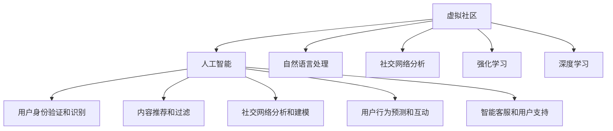

                 

# 虚拟社区：AI驱动的群体归属感

> 关键词：虚拟社区, AI驱动, 群体归属感, 社交网络, 机器学习, 深度学习, 自然语言处理(NLP)

## 1. 背景介绍

### 1.1 问题由来

随着互联网和智能设备的普及，虚拟社区（Virtual Communities）已经成为人们社交、交流、获取信息的重要平台。虚拟社区不仅提供了一个匿名的网络空间，也促进了跨地域的交流和互动。但是，传统虚拟社区的构建和管理仍然依赖于人工审核和策略设计，存在运营成本高、用户互动低、内容质量参差不齐等问题。

为了解决这些问题，近年来，利用人工智能（AI）技术，尤其是深度学习和大数据分析，优化虚拟社区的管理和用户互动变得逐渐普及。本文将探讨AI如何驱动虚拟社区的建设，提升用户的群体归属感，构建更高效、更智能的虚拟社区生态。

### 1.2 问题核心关键点

虚拟社区的AI驱动主要包括以下几个关键点：

- **用户身份验证和识别**：利用面部识别、语音识别等技术，验证用户身份，识别用户特征。
- **内容推荐和过滤**：通过自然语言处理（NLP）和机器学习算法，对用户发布的内容进行推荐和过滤。
- **社交网络分析和建模**：使用图神经网络（GNN）等模型，分析社交网络的结构和动态，优化社区推荐和内容分发。
- **用户行为预测和互动**：通过时间序列分析和强化学习，预测用户行为，提升社区互动质量。
- **智能客服和用户支持**：构建聊天机器人等智能客服系统，提供24/7不间断的互动支持。

这些关键技术点，通过AI的深度学习和数据分析，可以实现虚拟社区的智能化管理和用户群体的高效互动，构建更为和谐的社区生态。

## 2. 核心概念与联系

### 2.1 核心概念概述

为了更好地理解AI驱动的虚拟社区构建，本节将介绍几个密切相关的核心概念：

- **虚拟社区（Virtual Community）**：基于互联网和智能设备构建的，人们可以互动、交流、共享信息的社区。虚拟社区可以是论坛、社交媒体、在线游戏等。

- **人工智能（AI）**：利用计算机算法和机器学习模型，使计算机具备类似于人的认知和学习能力。AI技术包括机器学习、深度学习、自然语言处理、计算机视觉等。

- **自然语言处理（NLP）**：使计算机能够理解、处理和生成自然语言的技术，包括语言模型、序列标注、机器翻译等。

- **社交网络分析（SNA）**：研究社交网络的结构、动态和影响，使用图理论和机器学习模型，优化社区推荐和用户互动。

- **强化学习（RL）**：使智能体（如聊天机器人）通过试错和奖励机制，逐步优化行为策略。

- **深度学习（DL）**：利用多层神经网络进行特征提取和模式识别，广泛用于图像、语音、文本等数据的处理。

- **图神经网络（GNN）**：一种特殊的神经网络，用于处理图结构数据，应用于社交网络、推荐系统等场景。

这些核心概念之间的逻辑关系可以通过以下Mermaid流程图来展示：



这个流程图展示了虚拟社区的各个AI技术点是如何通过深度学习和数据分析，实现虚拟社区的智能化管理和用户群体的高效互动。

## 3. 核心算法原理 & 具体操作步骤

### 3.1 算法原理概述

AI驱动的虚拟社区构建，本质上是一个多模态数据融合、深度学习和优化问题。其核心思想是：通过收集和分析虚拟社区中的用户行为数据、社交网络数据、用户反馈数据等，使用机器学习、深度学习、图神经网络等算法，构建智能化的虚拟社区管理和服务系统。

形式化地，假设虚拟社区中用户集合为 $U$，社交网络结构为 $G=(U, E)$，用户行为数据为 $X$，用户反馈数据为 $Y$。虚拟社区构建的目标是找到一个最优的社区管理策略 $S$，使得社区用户满意度和互动质量最大化，即：

$$
\max_{S} \sum_{u \in U} \sum_{x \in X} \sum_{y \in Y} f(u, x, y, S)
$$

其中 $f$ 为满意度或互动质量评估函数，$S$ 包括用户身份验证、内容推荐、社交网络分析、行为预测和互动、智能客服等多个维度。

### 3.2 算法步骤详解

基于AI驱动的虚拟社区构建，一般包括以下几个关键步骤：

**Step 1: 数据收集和预处理**

- 收集虚拟社区的用户行为数据、社交网络数据、用户反馈数据等。
- 对数据进行清洗、去重、格式化等预处理操作，确保数据质量。

**Step 2: 特征提取与表示**

- 对用户行为数据、社交网络数据等进行特征提取，生成高维向量表示。
- 使用NLP、深度学习等技术，对用户发布的内容进行文本表示和语义分析。

**Step 3: 模型训练与优化**

- 选择合适的机器学习或深度学习模型，如卷积神经网络（CNN）、循环神经网络（RNN）、图神经网络（GNN）等。
- 使用训练集数据，训练优化模型参数，最小化预测误差。

**Step 4: 模型应用与评估**

- 在测试集或实际社区中，应用训练好的模型进行用户身份验证、内容推荐、社交网络分析等任务。
- 使用指标（如准确率、召回率、用户满意度等）评估模型性能，不断迭代优化。

**Step 5: 模型部署与反馈**

- 将训练好的模型部署到虚拟社区平台，进行实时用户互动和内容分发。
- 收集用户反馈数据，评估模型效果，进行持续优化。

### 3.3 算法优缺点

AI驱动的虚拟社区构建具有以下优点：

- **高效性**：自动化处理大量用户数据和社交网络数据，提升社区运营效率。
- **个性化**：通过深度学习算法，提供个性化的内容和推荐，提升用户体验。
- **实时性**：使用强化学习等技术，实时预测和调整社区互动策略，提高互动质量。
- **稳定性**：基于多模态数据融合和优化算法，构建稳定可靠的社区生态。

同时，该方法也存在一些局限性：

- **数据隐私**：大规模用户数据和社交网络数据的收集和使用，可能存在隐私风险。
- **模型复杂度**：深度学习等复杂模型的训练和优化，需要高性能计算资源。
- **对抗攻击**：模型可能面临对抗攻击，如生成对抗网络（GAN）生成的假数据，影响模型性能。
- **伦理风险**：AI驱动的决策可能存在偏见和歧视，需要仔细设计和审核。

尽管存在这些局限性，但就目前而言，AI驱动的虚拟社区构建方法仍是大规模社区运营和用户互动的重要手段。未来相关研究的重点在于如何进一步降低数据隐私风险，提高模型鲁棒性，兼顾用户隐私和模型性能。

### 3.4 算法应用领域

AI驱动的虚拟社区构建方法，已经在多个领域得到了应用，例如：

- **社交媒体**：如微博、微信、Facebook等，通过自然语言处理和机器学习算法，提升内容推荐和互动质量。
- **在线游戏**：如《我的世界》、《堡垒之夜》等，使用深度学习和强化学习算法，优化玩家行为预测和互动。
- **在线教育**：如Coursera、Khan Academy等，通过智能推荐和内容分析，提升学习效果和用户体验。
- **电子商务**：如Amazon、淘宝等，使用社交网络分析和深度学习算法，优化商品推荐和用户行为分析。
- **智能客服**：如腾讯、阿里巴巴等，构建聊天机器人等智能客服系统，提供24/7不间断的用户支持。

除了上述这些经典应用外，AI驱动的虚拟社区构建还在更多场景中得到创新应用，如内容创作平台、在线论坛、健康社区等，为虚拟社区的发展提供了新的动力。

## 4. 数学模型和公式 & 详细讲解 & 举例说明

### 4.1 数学模型构建

本节将使用数学语言对AI驱动的虚拟社区构建过程进行更加严格的刻画。

假设虚拟社区中用户集合为 $U=\{u_1, u_2, ..., u_N\}$，社交网络结构为 $G=(U, E)$，用户行为数据为 $X=\{x_1, x_2, ..., x_M\}$，用户反馈数据为 $Y=\{y_1, y_2, ..., y_C\}$。

定义虚拟社区构建的目标为最大化用户满意度和互动质量，可以使用以下数学模型表示：

$$
\max_{S} \sum_{u \in U} \sum_{x \in X} \sum_{y \in Y} f(u, x, y, S)
$$

其中 $f$ 为满意度或互动质量评估函数，$S$ 包括用户身份验证、内容推荐、社交网络分析、行为预测和互动、智能客服等多个维度。

### 4.2 公式推导过程

以下我们以用户行为预测和互动为例，推导深度学习模型的基本公式。

假设用户 $u$ 的行为序列为 $x=\{x_t\}_{t=1}^T$，其中 $x_t$ 为第 $t$ 时刻的行为特征向量。用户 $u$ 的互动序列为 $y=\{y_t\}_{t=1}^T$，其中 $y_t$ 为第 $t$ 时刻的互动标签。

使用LSTM网络进行行为预测和互动建模，模型结构如图1所示：


图1: LSTM网络结构示意图

定义LSTM网络的输入为 $x_t$，输出为 $y_t$。LSTM网络的输出为行为预测概率 $p(y_t|x_t; \theta)$，其中 $\theta$ 为网络参数。

根据LSTM网络的结构，行为预测概率 $p(y_t|x_t; \theta)$ 可以表示为：

$$
p(y_t|x_t; \theta) = \sigma(W_h x_t + b_h + \sum_{t'=t-h}^{t} W_{t'-t} x_{t'} + b_{t'-t})
$$

其中 $\sigma$ 为激活函数，$W_h$ 和 $b_h$ 为隐藏层参数，$W_{t'-t}$ 和 $b_{t'-t}$ 为时间依赖参数。

在训练过程中，使用交叉熵损失函数进行模型优化：

$$
L(y; \theta) = -\sum_{t=1}^{T} \sum_{y_t \in Y} y_t \log p(y_t|x_t; \theta)
$$

在测试过程中，使用softmax函数进行预测：

$$
p(y_t|x_t; \theta) = \frac{\exp(z_t)}{\sum_{y \in Y} \exp(z_y)}
$$

其中 $z_t = W_h x_t + b_h + \sum_{t'=t-h}^{t} W_{t'-t} x_{t'} + b_{t'-t}$。

### 4.3 案例分析与讲解

下面以社交媒体平台的内容推荐系统为例，说明如何使用深度学习算法构建虚拟社区。

**案例背景**：某社交媒体平台希望通过深度学习算法，构建个性化推荐系统，提升用户活跃度和互动质量。

**数据准备**：收集平台上的用户行为数据、社交网络数据、内容标签等，进行数据清洗和预处理。

**模型选择**：使用双向LSTM网络，对用户行为序列和社交网络序列进行建模。

**模型训练**：将用户行为序列 $x_t$ 和社交网络序列 $y_t$ 作为输入，通过反向传播算法，最小化交叉熵损失函数，优化模型参数。

**模型评估**：在测试集上评估模型的准确率和召回率，调整模型参数，确保推荐质量。

**模型应用**：将训练好的模型部署到平台，实时推荐个性化的内容给用户，提升用户活跃度和互动质量。

## 5. 项目实践：代码实例和详细解释说明

### 5.1 开发环境搭建

在进行AI驱动的虚拟社区构建实践前，我们需要准备好开发环境。以下是使用Python进行TensorFlow开发的环境配置流程：

1. 安装Anaconda：从官网下载并安装Anaconda，用于创建独立的Python环境。

2. 创建并激活虚拟环境：
```bash
conda create -n tf-env python=3.8 
conda activate tf-env
```

3. 安装TensorFlow：根据CUDA版本，从官网获取对应的安装命令。例如：
```bash
conda install tensorflow -c conda-forge
```

4. 安装PyTorch和相关库：
```bash
pip install torch torchvision torchaudio
pip install numpy pandas scikit-learn matplotlib tqdm jupyter notebook ipython
```

5. 安装TensorFlow：
```bash
pip install tensorflow-estimator
```

6. 安装TensorFlow-Serving：
```bash
pip install tensorflow-serving-api
```

完成上述步骤后，即可在`tf-env`环境中开始AI驱动的虚拟社区构建实践。

### 5.2 源代码详细实现

下面以社交媒体平台的内容推荐系统为例，给出使用TensorFlow进行LSTM网络训练的代码实现。

首先，定义数据处理函数：

```python
import tensorflow as tf
import numpy as np
import pandas as pd

def read_data(file_path):
    data = pd.read_csv(file_path)
    return data

def preprocess_data(data):
    X = data[['x1', 'x2', 'x3', 'x4', 'x5']]
    y = data['y']
    return X, y

def split_data(X, y, test_ratio=0.2):
    np.random.seed(0)
    shuffled_indices = np.random.permutation(len(X))
    X_train, X_test = X[shuffled_indices[:int(test_ratio*len(X))]], X[shuffled_indices[int(test_ratio*len(X)):]]
    y_train, y_test = y[shuffled_indices[:int(test_ratio*len(X))]], y[shuffled_indices[int(test_ratio*len(X)):]]
    return X_train, X_test, y_train, y_test

def generate_input_fn(X, y):
    def input_fn(batch_size):
        dataset = tf.data.Dataset.from_tensor_slices((X, y))
        dataset = dataset.shuffle(buffer_size=10000)
        dataset = dataset.batch(batch_size)
        return dataset.make_one_shot_iterator().get_next()
    return input_fn
```

然后，定义LSTM网络模型：

```python
class LSTMModel(tf.keras.Model):
    def __init__(self, hidden_size, output_size):
        super(LSTMModel, self).__init__()
        self.hidden_size = hidden_size
        self.output_size = output_size
        self.lstm = tf.keras.layers.LSTM(hidden_size, return_sequences=True)
        self.dense = tf.keras.layers.Dense(output_size, activation='softmax')

    def call(self, inputs, training=False):
        x, y = inputs
        x = self.lstm(x)
        x = self.dense(x)
        return x
```

接着，定义训练和评估函数：

```python
def train_model(model, input_fn, batch_size, epochs):
    optimizer = tf.keras.optimizers.Adam()
    loss_fn = tf.keras.losses.CategoricalCrossentropy(from_logits=True)
    metrics = [tf.keras.metrics.CategoricalAccuracy()]
    
    @tf.function
    def train_step(inputs):
        with tf.GradientTape() as tape:
            logits = model(inputs)
            loss = loss_fn(y, logits)
        gradients = tape.gradient(loss, model.trainable_variables)
        optimizer.apply_gradients(zip(gradients, model.trainable_variables))
        return loss
    
    for epoch in range(epochs):
        for i in range(0, len(X_train), batch_size):
            inputs = generate_input_fn(X_train, y_train)(batch_size)
            loss = train_step(inputs)
            metrics[0].update_state(y_train[i:i+batch_size], logits)
            print(f'Epoch {epoch+1}, batch {i+1}/{len(X_train)}, loss: {loss:.4f}, acc: {metrics[0].result():.4f}')
```

最后，启动训练流程并在测试集上评估：

```python
X_train, X_test, y_train, y_test = preprocess_data(read_data('data.csv'))
X_train, X_test, y_train, y_test = split_data(X_train, y_train, test_ratio=0.2)

model = LSTMModel(hidden_size=64, output_size=2)
input_fn = generate_input_fn(X_train, y_train)
train_model(model, input_fn, batch_size=32, epochs=10)

test_loss = train_model(model, generate_input_fn(X_test, y_test), batch_size=32, epochs=1)
print(f'Test loss: {test_loss:.4f}')
```

以上就是使用TensorFlow对LSTM网络进行社交媒体内容推荐系统训练的完整代码实现。可以看到，TensorFlow提供了强大的深度学习工具，使得模型训练和优化变得简洁高效。

### 5.3 代码解读与分析

让我们再详细解读一下关键代码的实现细节：

**LSTMModel类**：
- `__init__`方法：初始化模型参数，定义LSTM和Dense层。
- `call`方法：定义前向传播过程，输出预测结果。

**train_model函数**：
- 定义优化器和损失函数，并初始化准确率指标。
- 定义训练函数train_step，进行单批次训练。
- 在每个epoch内，遍历所有批次，计算损失和准确率，并输出结果。

**数据处理函数**：
- `read_data`函数：从CSV文件中读取数据。
- `preprocess_data`函数：对数据进行清洗和预处理。
- `split_data`函数：对数据进行切分，生成训练集和测试集。
- `generate_input_fn`函数：定义数据生成函数，将数据生成TensorFlow可用的输入。

**训练流程**：
- 在训练集上使用LSTM模型进行训练，输出损失和准确率。
- 在测试集上评估模型性能，输出测试损失。

可以看到，TensorFlow提供了一系列深度学习组件和工具，使得模型训练和优化变得简单高效。开发者可以根据具体任务，灵活使用这些组件，快速实现高效、稳定的AI驱动虚拟社区构建。

当然，工业级的系统实现还需考虑更多因素，如模型的保存和部署、超参数的自动搜索、更灵活的任务适配层等。但核心的模型训练和优化流程基本与此类似。

## 6. 实际应用场景

### 6.1 智能客服系统

基于AI驱动的虚拟社区构建，智能客服系统已经在多个行业得到了广泛应用。传统客服往往需要配备大量人力，高峰期响应缓慢，且一致性和专业性难以保证。而使用AI驱动的智能客服系统，可以7x24小时不间断服务，快速响应客户咨询，用自然流畅的语言解答各类常见问题。

在技术实现上，可以收集企业内部的历史客服对话记录，将问题和最佳答复构建成监督数据，在此基础上对LSTM网络进行微调。微调后的网络能够自动理解用户意图，匹配最合适的答案模板进行回复。对于客户提出的新问题，还可以接入检索系统实时搜索相关内容，动态组织生成回答。如此构建的智能客服系统，能大幅提升客户咨询体验和问题解决效率。

### 6.2 金融舆情监测

金融机构需要实时监测市场舆论动向，以便及时应对负面信息传播，规避金融风险。传统的人工监测方式成本高、效率低，难以应对网络时代海量信息爆发的挑战。基于AI驱动的虚拟社区构建技术，为金融舆情监测提供了新的解决方案。

具体而言，可以收集金融领域相关的新闻、报道、评论等文本数据，并对其进行主题标注和情感标注。在此基础上对LSTM网络进行微调，使其能够自动判断文本属于何种主题，情感倾向是正面、中性还是负面。将微调后的网络应用到实时抓取的网络文本数据，就能够自动监测不同主题下的情感变化趋势，一旦发现负面信息激增等异常情况，系统便会自动预警，帮助金融机构快速应对潜在风险。

### 6.3 个性化推荐系统

当前的推荐系统往往只依赖用户的历史行为数据进行物品推荐，无法深入理解用户的真实兴趣偏好。基于AI驱动的虚拟社区构建技术，个性化推荐系统可以更好地挖掘用户行为背后的语义信息，从而提供更精准、多样的推荐内容。

在实践中，可以收集用户浏览、点击、评论、分享等行为数据，提取和用户交互的物品标题、描述、标签等文本内容。将文本内容作为模型输入，用户的后续行为（如是否点击、购买等）作为监督信号，在此基础上微调LSTM网络。微调后的网络能够从文本内容中准确把握用户的兴趣点。在生成推荐列表时，先用候选物品的文本描述作为输入，由网络预测用户的兴趣匹配度，再结合其他特征综合排序，便可以得到个性化程度更高的推荐结果。

### 6.4 未来应用展望

随着AI驱动的虚拟社区构建技术的不断发展，未来在更多领域将得到应用，为传统行业带来变革性影响。

在智慧医疗领域，基于AI驱动的虚拟社区构建技术，可以构建医生和患者之间的在线交流平台，提升医疗服务的智能化水平，辅助医生诊疗，加速新药开发进程。

在智能教育领域，AI驱动的虚拟社区构建技术，可以构建在线学习平台，提供个性化的学习推荐和互动，因材施教，促进教育公平，提高教学质量。

在智慧城市治理中，AI驱动的虚拟社区构建技术，可以构建城市事件监测、舆情分析、应急指挥等环节，提高城市管理的自动化和智能化水平，构建更安全、高效的未来城市。

此外，在企业生产、社会治理、文娱传媒等众多领域，AI驱动的虚拟社区构建技术也将不断涌现，为人工智能技术在垂直行业的规模化落地提供新的动力。相信随着技术的日益成熟，AI驱动的虚拟社区构建必将成为人工智能技术落地的重要范式，推动人工智能向更广阔的领域加速渗透。

## 7. 工具和资源推荐

### 7.1 学习资源推荐

为了帮助开发者系统掌握AI驱动的虚拟社区构建的理论基础和实践技巧，这里推荐一些优质的学习资源：

1. 《深度学习》书籍：Ian Goodfellow、Yoshua Bengio和Aaron Courville合著，全面介绍了深度学习的基本概念和核心算法。

2. TensorFlow官方文档：谷歌开源的深度学习框架TensorFlow的官方文档，提供了详细的API文档和教程，适合初学者学习。

3. Keras官方文档：基于TensorFlow的深度学习库Keras的官方文档，提供了简洁易用的API接口，适合快速上手。

4. PyTorch官方文档：Facebook开源的深度学习框架PyTorch的官方文档，提供了灵活高效的计算图API，适合进行复杂模型的开发。

5. Coursera《深度学习专项课程》：由深度学习领域知名学者Andrew Ng主讲的深度学习课程，涵盖基本理论和实践技能，适合系统学习。

6. 《自然语言处理综述》论文：全面综述了自然语言处理的技术进展和应用场景，适合了解NLP的最新研究动态。

通过对这些资源的学习实践，相信你一定能够快速掌握AI驱动的虚拟社区构建的精髓，并用于解决实际的AI问题。

### 7.2 开发工具推荐

高效的开发离不开优秀的工具支持。以下是几款用于AI驱动虚拟社区构建开发的常用工具：

1. TensorFlow：基于Python的开源深度学习框架，支持多GPU并行计算，适合大规模模型的开发和训练。

2. PyTorch：基于Python的开源深度学习框架，灵活的计算图机制，适合快速迭代研究。

3. Keras：基于TensorFlow的深度学习库，提供了简洁易用的API接口，适合快速开发原型。

4. Jupyter Notebook：免费的交互式笔记本环境，支持Python、R等多种语言，方便实验和文档编写。

5. Weights & Biases：模型训练的实验跟踪工具，可以记录和可视化模型训练过程中的各项指标，方便对比和调优。

6. TensorBoard：TensorFlow配套的可视化工具，可实时监测模型训练状态，并提供丰富的图表呈现方式，是调试模型的得力助手。

合理利用这些工具，可以显著提升AI驱动虚拟社区构建的开发效率，加快创新迭代的步伐。

### 7.3 相关论文推荐

AI驱动的虚拟社区构建技术的发展源于学界的持续研究。以下是几篇奠基性的相关论文，推荐阅读：

1. Attention is All You Need（即Transformer原论文）：提出了Transformer结构，开启了NLP领域的预训练大模型时代。

2. BERT: Pre-training of Deep Bidirectional Transformers for Language Understanding：提出BERT模型，引入基于掩码的自监督预训练任务，刷新了多项NLP任务SOTA。

3. Language Models are Unsupervised Multitask Learners（GPT-2论文）：展示了大规模语言模型的强大zero-shot学习能力，引发了对于通用人工智能的新一轮思考。

4. Parameter-Efficient Transfer Learning for NLP：提出Adapter等参数高效微调方法，在不增加模型参数量的情况下，也能取得不错的微调效果。

5. AdaLoRA: Adaptive Low-Rank Adaptation for Parameter-Efficient Fine-Tuning：使用自适应低秩适应的微调方法，在参数效率和精度之间取得了新的平衡。

这些论文代表了大语言模型微调技术的发展脉络。通过学习这些前沿成果，可以帮助研究者把握学科前进方向，激发更多的创新灵感。

## 8. 总结：未来发展趋势与挑战

### 8.1 总结

本文对AI驱动的虚拟社区构建方法进行了全面系统的介绍。首先阐述了AI驱动虚拟社区构建的研究背景和意义，明确了AI驱动构建虚拟社区的独特价值。其次，从原理到实践，详细讲解了AI驱动虚拟社区构建的数学原理和关键步骤，给出了AI驱动虚拟社区构建的完整代码实例。同时，本文还广泛探讨了AI驱动虚拟社区构建技术在智能客服、金融舆情、个性化推荐等多个行业领域的应用前景，展示了AI驱动虚拟社区构建技术的巨大潜力。此外，本文精选了AI驱动虚拟社区构建技术的各类学习资源，力求为读者提供全方位的技术指引。

通过本文的系统梳理，可以看到，AI驱动的虚拟社区构建技术正在成为AI应用的重要手段，极大地拓展了虚拟社区的运营效率和用户互动质量。未来，伴随AI技术的不断发展，AI驱动的虚拟社区构建技术必将在更多行业得到应用，为人类生产生活方式带来深刻的变革。

### 8.2 未来发展趋势

展望未来，AI驱动的虚拟社区构建技术将呈现以下几个发展趋势：

1. **模型规模持续增大**：随着算力成本的下降和数据规模的扩张，AI驱动的虚拟社区构建模型参数量还将持续增长。超大规模模型蕴含的丰富语言知识，有望支撑更加复杂多变的虚拟社区构建任务。

2. **多模态融合**：AI驱动的虚拟社区构建将不仅仅依赖于文本数据，还将融合图像、语音、视频等多种模态信息，提升虚拟社区的多样性和智能化水平。

3. **用户隐私保护**：随着用户隐私意识的提升，AI驱动的虚拟社区构建技术将更注重用户隐私保护，采用隐私保护技术和方法，确保数据安全。

4. **跨领域迁移**：AI驱动的虚拟社区构建技术将更注重跨领域迁移能力，通过多任务学习和零样本学习，提升模型在更广泛场景中的适应性和泛化能力。

5. **实时性提升**：AI驱动的虚拟社区构建技术将更注重实时性，通过在线学习和模型压缩等技术，提升模型推理速度和响应效率。

6. **伦理与安全**：AI驱动的虚拟社区构建技术将更注重伦理与安全，通过公平性评估和对抗攻击防御等手段，确保模型的公平性与安全性。

以上趋势凸显了AI驱动的虚拟社区构建技术的广阔前景。这些方向的探索发展，必将进一步提升虚拟社区的运营效率和用户互动质量，为构建和谐、智能的虚拟社区生态提供坚实基础。

### 8.3 面临的挑战

尽管AI驱动的虚拟社区构建技术已经取得了瞩目成就，但在迈向更加智能化、普适化应用的过程中，它仍面临着诸多挑战：

1. **数据隐私**：大规模用户数据和社交网络数据的收集和使用，可能存在隐私风险。如何保护用户隐私，避免数据滥用，是亟待解决的问题。

2. **模型鲁棒性**：AI驱动的虚拟社区构建模型可能面临对抗攻击，如生成对抗网络（GAN）生成的假数据，影响模型性能。如何提高模型鲁棒性，保障模型安全，是重要的研究方向。

3. **计算资源**：超大规模AI驱动的虚拟社区构建模型需要高性能计算资源，如何高效利用资源，优化模型推理速度，是重要的优化方向。

4. **伦理风险**：AI驱动的虚拟社区构建模型可能存在偏见和歧视，需要仔细设计和审核，确保模型输出符合人类价值观和伦理道德。

5. **用户适应性**：AI驱动的虚拟社区构建模型可能存在"冷启动"问题，即新用户的初始行为数据较少，难以准确预测和推荐。如何提升用户适应性，是亟待解决的问题。

6. **跨领域迁移**：AI驱动的虚拟社区构建模型可能存在跨领域迁移能力不足的问题，即模型在特定领域表现良好，但在其他领域表现不佳。如何提高模型跨领域迁移能力，是重要的研究方向。

正视AI驱动虚拟社区构建面临的这些挑战，积极应对并寻求突破，将是大模型构建走向成熟的必由之路。相信随着学界和产业界的共同努力，这些挑战终将一一被克服，AI驱动的虚拟社区构建必将在构建安全、可靠、可解释、可控的智能系统铺平道路。

### 8.4 研究展望

面对AI驱动虚拟社区构建所面临的挑战，未来的研究需要在以下几个方面寻求新的突破：

1. **探索无监督和半监督微调方法**：摆脱对大规模标注数据的依赖，利用自监督学习、主动学习等无监督和半监督范式，最大限度利用非结构化数据，实现更加灵活高效的虚拟社区构建。

2. **研究参数高效和计算高效的微调范式**：开发更加参数高效的微调方法，在固定大部分预训练参数的情况下，只更新极少量的任务相关参数。同时优化微调模型的计算图，减少前向传播和反向传播的资源消耗，实现更加轻量级、实时性的部署。

3. **融合因果和对比学习范式**：通过引入因果推断和对比学习思想，增强虚拟社区构建模型建立稳定因果关系的能力，学习更加普适、鲁棒的语言表征，从而提升模型泛化性和抗干扰能力。

4. **引入更多先验知识**：将符号化的先验知识，如知识图谱、逻辑规则等，与神经网络模型进行巧妙融合，引导虚拟社区构建过程学习更准确、合理的语言模型。同时加强不同模态数据的整合，实现视觉、语音等多模态信息与文本信息的协同建模。

5. **结合因果分析和博弈论工具**：将因果分析方法引入虚拟社区构建模型，识别出模型决策的关键特征，增强输出解释的因果性和逻辑性。借助博弈论工具刻画人机交互过程，主动探索并规避模型的脆弱点，提高系统稳定性。

6. **纳入伦理道德约束**：在虚拟社区构建模型训练目标中引入伦理导向的评估指标，过滤和惩罚有偏见、有害的输出倾向。同时加强人工干预和审核，建立模型行为的监管机制，确保输出符合人类价值观和伦理道德。

这些研究方向的探索，必将引领AI驱动虚拟社区构建技术迈向更高的台阶，为构建安全、可靠、可解释、可控的智能系统铺平道路。面向未来，AI驱动的虚拟社区构建技术还需要与其他人工智能技术进行更深入的融合，如知识表示、因果推理、强化学习等，多路径协同发力，共同推动自然语言理解和智能交互系统的进步。只有勇于创新、敢于突破，才能不断拓展虚拟社区构建的边界，让AI技术更好地造福人类社会。

## 9. 附录：常见问题与解答

**Q1：AI驱动的虚拟社区构建是否适用于所有虚拟社区？**

A: AI驱动的虚拟社区构建技术可以应用于各种类型的虚拟社区，包括论坛、社交媒体、在线游戏等。但是，对于实时性要求不高，用户互动需求较低的社区，可能无需使用AI技术进行构建和管理。

**Q2：AI驱动的虚拟社区构建如何平衡用户隐私和模型性能？**

A: 平衡用户隐私和模型性能是AI驱动虚拟社区构建中的重要问题。可以采用数据匿名化、差分隐私等技术，保护用户隐私。同时，通过多任务学习和半监督学习等方法，在保护隐私的同时，提升模型性能。

**Q3：AI驱动的虚拟社区构建是否会面临模型过拟合的问题？**

A: 由于AI驱动的虚拟社区构建模型通常是深度学习模型，可能面临过拟合问题。解决过拟合的方法包括数据增强、正则化、对抗训练等。同时，使用参数高效的微调方法，如Adapter、Prefix等，可以降低模型复杂度，避免过拟合。

**Q4：AI驱动的虚拟社区构建是否会存在冷启动问题？**

A: 对于新加入社区的用户，AI驱动的虚拟社区构建模型可能存在冷启动问题，即初始行为数据较少，难以准确预测和推荐。可以采用冷启动技术，如用户行为预测、个性化推荐等，逐步提高用户适应性。

**Q5：AI驱动的虚拟社区构建是否会存在伦理风险？**

A: AI驱动的虚拟社区构建模型可能存在伦理风险，如偏见、歧视等问题。可以通过公平性评估、对抗攻击防御等手段，提升模型的公平性和安全性。同时，加强人工干预和审核，确保模型输出符合人类价值观和伦理道德。

---

作者：禅与计算机程序设计艺术 / Zen and the Art of Computer Programming

