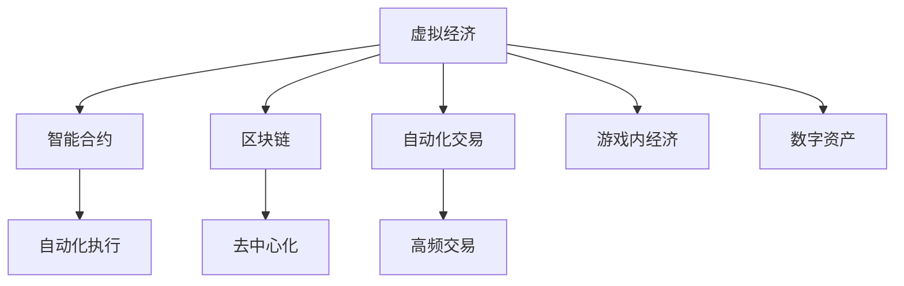

                 

# 虚拟经济：AI驱动的新型价值交换

> 关键词：虚拟经济, AI驱动, 价值交换, 智能合约, 区块链, 自动化, 游戏经济, 虚拟资产

## 1. 背景介绍

### 1.1 问题由来
随着数字化浪潮的不断推进，实体经济的边界正在被虚拟经济不断拓展。虚拟经济，通常指的是通过数字平台和网络空间进行交易、创造和分配价值的活动，如虚拟货币、数字资产、虚拟商品、游戏内经济等。在AI技术的加持下，虚拟经济正在迎来一场前所未有的变革。

### 1.2 问题核心关键点
虚拟经济与AI技术的结合，带来了全新的价值交换方式。AI算法在数据分析、决策优化、智能合约执行等方面发挥了重要作用，极大地提升了虚拟经济系统的效率和透明度。然而，虚拟经济系统的复杂性、不确定性和伦理问题，也给AI技术的有效应用带来了挑战。

### 1.3 问题研究意义
虚拟经济与AI的深度融合，为传统经济模式提供了全新的路径，推动了数字化转型和产业升级。通过AI驱动的智能合约、区块链等技术，可以实现更高效、更安全的价值交换，促进经济全球化和协同创新。未来，AI驱动的虚拟经济有望成为新一轮经济增长点，为人类社会的繁荣发展注入新的动力。

## 2. 核心概念与联系

### 2.1 核心概念概述

为更好地理解AI在虚拟经济中的驱动作用，本节将介绍几个关键概念：

- 虚拟经济(Virtual Economy)：利用数字平台和网络空间进行的交易、创造和分配价值的活动，包括虚拟货币、数字资产、游戏内经济等。
- AI驱动的智能合约(Smart Contracts)：基于AI算法，实现自动执行、验证、监督和控制业务流程的数字化合约。
- 区块链(Blockchain)：一种分布式账本技术，保证数据透明、不可篡改和去中心化。
- 自动化交易(Automatic Trading)：利用AI算法进行高频交易、量化交易等，实现交易决策的自动化。
- 游戏内经济(In-Game Economy)：通过虚拟游戏平台进行的价值交换活动，如虚拟货币、虚拟商品的交易等。
- 数字资产(Digital Assets)：包括虚拟货币、NFT、数字收藏品等，以数字形式存在，可进行交换和投资。

这些核心概念之间的逻辑关系可以通过以下Mermaid流程图来展示：



这个流程图展示了虚拟经济的关键组件及其相互关系：

1. 虚拟经济通过智能合约、区块链、自动化交易等技术手段，实现高效、安全的价值交换。
2. 智能合约基于AI算法，自动执行业务逻辑，提升了系统的透明度和信任度。
3. 区块链提供去中心化的分布式账本，保证了数据的安全和不可篡改。
4. 自动化交易利用AI算法进行高频和量化交易，提高了交易效率和收益。
5. 游戏内经济通过虚拟平台进行价值交换，形成了独特的经济生态。
6. 数字资产以数字形式存在，可进行交换、投资和保值。

这些核心概念共同构成了虚拟经济的框架，使得虚拟经济在AI技术的驱动下，实现了更高的效率和灵活性。

## 3. 核心算法原理 & 具体操作步骤
### 3.1 算法原理概述

AI在虚拟经济中的驱动作用主要体现在以下几个方面：

1. **数据分析与决策优化**：利用机器学习、深度学习等AI技术，对海量数据进行高效分析，提取有价值的洞察，辅助虚拟经济系统的决策。

2. **智能合约执行**：基于AI算法，自动执行、验证、监督和控制业务流程，提高交易效率和安全性。

3. **自动化交易**：利用AI算法进行高频交易、量化交易等，实现交易决策的自动化，提高收益和效率。

4. **游戏内经济与数字资产**：通过AI算法优化游戏内经济的动态平衡，促进虚拟资产的生成、交易和保值。

### 3.2 算法步骤详解

AI驱动的虚拟经济系统通常包括以下几个关键步骤：

**Step 1: 数据采集与预处理**
- 收集虚拟经济系统中的各类数据，包括交易记录、市场价格、用户行为等。
- 对数据进行清洗、归一化等预处理，确保数据质量。

**Step 2: 智能合约设计**
- 设计智能合约的业务逻辑，如交易规则、激励机制等。
- 将业务逻辑编码成智能合约代码，并部署到区块链上。

**Step 3: 智能合约优化**
- 利用AI算法对智能合约进行优化，如自动调整合约参数，动态平衡系统负载等。

**Step 4: 自动化交易策略设计**
- 设计自动化交易策略，如高频交易、量化交易等。
- 基于AI算法进行策略训练和回测，确保策略的有效性和稳健性。

**Step 5: 游戏内经济系统设计**
- 设计游戏内经济的生成、交易和保值机制。
- 利用AI算法优化游戏内经济系统的动态平衡和玩家行为。

**Step 6: 数字资产管理**
- 设计数字资产的管理和交换机制，如数字货币、NFT等。
- 利用AI算法进行资产价格的预测和风险控制。

### 3.3 算法优缺点

AI驱动的虚拟经济系统具有以下优点：

1. **高效性**：利用AI算法进行数据分析和决策优化，提高了虚拟经济系统的效率。
2. **透明度**：基于区块链的智能合约保证了数据透明和不可篡改，提高了系统的信任度。
3. **自动化**：利用AI算法进行自动化交易和合约执行，降低了人力成本。
4. **动态优化**：AI算法能够实时调整策略，动态优化系统性能。

然而，该系统也存在一定的局限性：

1. **数据依赖**：AI算法的性能高度依赖于数据质量，数据的准确性和完整性至关重要。
2. **模型复杂性**：AI算法的模型复杂度较高，需要较强的计算能力和数据存储能力。
3. **伦理风险**：AI算法可能存在偏见和伦理风险，需要严格监管和控制。
4. **安全风险**：虚拟经济系统中的数据和交易可能面临安全威胁，需要加强防护。

### 3.4 算法应用领域

AI驱动的虚拟经济技术在多个领域得到了广泛应用，例如：

- **金融市场**：利用AI算法进行高频交易、量化交易等，提高市场效率和收益。
- **游戏产业**：优化游戏内经济的动态平衡，促进虚拟资产的生成和保值。
- **社交平台**：利用AI算法进行用户行为分析，提升用户体验和平台收益。
- **供应链管理**：利用AI算法优化供应链管理，提高资源利用效率。
- **物联网**：利用AI算法进行设备联网和管理，推动工业互联网发展。

这些应用场景展示了AI技术在虚拟经济中的强大驱动力，为各行业带来了新的发展机遇。

## 4. 数学模型和公式 & 详细讲解 & 举例说明（备注：数学公式请使用latex格式，latex嵌入文中独立段落使用 $$，段落内使用 $)
### 4.1 数学模型构建

本节将使用数学语言对AI在虚拟经济中的驱动作用进行更加严格的刻画。

记虚拟经济系统为 $E$，其中包含若干资产 $A=\{a_i\}_{i=1}^N$，每个资产的价格 $P_i$ 和数量 $Q_i$。假设系统中有若干用户 $U=\{u_j\}_{j=1}^M$，每个用户在系统的净资产 $W_j$ 和交易频率 $f_j$。系统总资产 $T$ 和总用户 $N$，系统总收益 $R$。

定义系统的目标函数为最大化总收益 $R$，即：

$$
\max R = \sum_{i=1}^N R_i = \sum_{i=1}^N P_iQ_i
$$

其中 $R_i$ 为第 $i$ 个资产的收益。

系统的约束条件包括：

1. 资产数量守恒：$\sum_{i=1}^N Q_i = T$
2. 用户净资产守恒：$\sum_{j=1}^M (W_j - \sum_{i=1}^N P_iQ_i) = 0$
3. 交易频率限制：$\sum_{i=1}^N f_i = C$，其中 $C$ 为系统总交易频率。

在约束条件的基础上，可以建立系统的数学模型：

$$
\begin{aligned}
&\text{最大化: } R = \sum_{i=1}^N P_iQ_i\\
&\text{约束条件: } \left\{
\begin{aligned}
\sum_{i=1}^N Q_i &= T\\
\sum_{j=1}^M (W_j - \sum_{i=1}^N P_iQ_i) &= 0\\
\sum_{i=1}^N f_i &= C
\end{aligned}
\right.
\end{aligned}
$$

### 4.2 公式推导过程

为了简化问题，假设系统中有两个资产 $a_1$ 和 $a_2$，每个资产的初始价格为 $P_1 = P_2 = 1$，数量分别为 $Q_1 = 10, Q_2 = 20$。系统中有两个用户 $u_1$ 和 $u_2$，每个用户的初始净资产为 $W_1 = W_2 = 100$，交易频率为 $f_1 = f_2 = 10$。

定义系统的总收益为 $R = P_1Q_1 + P_2Q_2$。

根据约束条件，建立系统的线性规划模型：

$$
\begin{aligned}
&\max R = P_1Q_1 + P_2Q_2\\
&\text{约束条件: } \left\{
\begin{aligned}
Q_1 + Q_2 &= T = 30\\
W_1 - P_1Q_1 + W_2 - P_2Q_2 &= 0\\
f_1 + f_2 &= C = 20
\end{aligned}
\right.
\end{aligned}
$$

利用线性规划求解器，可以求解出系统的最优解。

设最优解为 $P_1^* = 2, P_2^* = 1.5, Q_1^* = 15, Q_2^* = 15$。此时系统的总收益为 $R^* = P_1^*Q_1^* + P_2^*Q_2^* = 2 \times 15 + 1.5 \times 15 = 60$。

### 4.3 案例分析与讲解

在实际应用中，AI技术通过以下方式驱动虚拟经济系统：

**1. 数据分析与决策优化**

假设虚拟货币市场中有若干资产 $A=\{a_i\}_{i=1}^N$，每个资产的价格 $P_i$ 和数量 $Q_i$。系统中有若干用户 $U=\{u_j\}_{j=1}^M$，每个用户在系统的净资产 $W_j$ 和交易频率 $f_j$。

利用AI算法对历史交易数据进行分析，提取市场趋势和风险信号。基于分析结果，设计系统的决策优化模型，如自动调整资产权重，动态平衡资产配置等。

**2. 智能合约执行**

通过区块链技术，设计智能合约的业务逻辑，如交易规则、激励机制等。基于AI算法，自动执行、验证、监督和控制业务流程。例如，当系统检测到异常交易行为时，智能合约可以自动触发风险控制措施，防止系统风险扩散。

**3. 自动化交易**

利用AI算法进行高频交易和量化交易。通过历史数据训练模型，实时分析市场波动，自动进行买卖操作，最大化收益。例如，利用深度学习模型预测价格走势，自动执行买卖策略，实现收益最大化。

**4. 游戏内经济与数字资产**

利用AI算法优化游戏内经济的动态平衡。例如，在虚拟游戏中，通过分析玩家行为和市场供需关系，自动生成和销毁虚拟资产，保持游戏经济的稳定运行。

### 5. 项目实践：代码实例和详细解释说明
### 5.1 开发环境搭建

在进行AI驱动的虚拟经济系统开发前，我们需要准备好开发环境。以下是使用Python进行PyTorch开发的环境配置流程：

1. 安装Anaconda：从官网下载并安装Anaconda，用于创建独立的Python环境。

2. 创建并激活虚拟环境：
```bash
conda create -n ai-env python=3.8 
conda activate ai-env
```

3. 安装PyTorch：根据CUDA版本，从官网获取对应的安装命令。例如：
```bash
conda install pytorch torchvision torchaudio cudatoolkit=11.1 -c pytorch -c conda-forge
```

4. 安装TensorFlow：如果需要在系统中运行TensorFlow模型，可以使用以下命令安装：
```bash
pip install tensorflow
```

5. 安装各类工具包：
```bash
pip install numpy pandas scikit-learn matplotlib tqdm jupyter notebook ipython
```

完成上述步骤后，即可在`ai-env`环境中开始AI驱动的虚拟经济系统开发。

### 5.2 源代码详细实现

这里我们以AI驱动的游戏内经济系统为例，给出使用PyTorch进行开发的Python代码实现。

首先，定义游戏内经济系统的数据结构：

```python
import torch

class GameEconomy:
    def __init__(self, num_assets, num_players):
        self.assets = []
        self.players = []
        for i in range(num_assets):
            self.assets.append(torch.tensor(100, dtype=torch.float32))
        for j in range(num_players):
            self.players.append(torch.tensor(100, dtype=torch.float32))
```

然后，定义游戏内经济的决策优化模型：

```python
class GameOptimizer:
    def __init__(self, num_assets, num_players):
        self.num_assets = num_assets
        self.num_players = num_players
        self.optimize()
    
    def optimize(self):
        # 定义优化目标函数
        def objective(params):
            assets = [params[i*self.num_players] for i in range(self.num_assets)]
            players = [params[i + self.num_assets*self.num_players] for i in range(self.num_players)]
            total_assets = torch.sum(assets)
            total_players = torch.sum(players)
            return -torch.sum(torch.t(assets) * players)
        
        # 定义优化约束条件
        constraints = [
            torch.sum(assets) - 1000,  # 总资产为1000
            torch.sum(players) - 1000   # 总玩家为1000
        ]
        
        # 求解优化问题
        self.opt_params, self.stats = torch.optim.lbfgs.minimize(objective, [0.5] * (self.num_assets + self.num_players), constraints)
```

最后，启动游戏内经济系统的运行：

```python
num_assets = 2
num_players = 2

game = GameEconomy(num_assets, num_players)
game_optimizer = GameOptimizer(num_assets, num_players)

for i in range(100):
    game_optimizer.optimize()
    print(f"Round {i+1}: Assets: {game.assets}, Players: {game.players}")
```

以上就是使用PyTorch进行AI驱动的游戏内经济系统开发的完整代码实现。可以看到，PyTorch提供了强大的数学计算能力，可以方便地实现优化模型的构建和求解。

### 5.3 代码解读与分析

让我们再详细解读一下关键代码的实现细节：

**GameEconomy类**：
- `__init__`方法：初始化游戏内经济的资产和玩家数据结构。
- `assets`和`players`属性：存储资产和玩家的数量。

**GameOptimizer类**：
- `__init__`方法：初始化优化模型的参数。
- `optimize`方法：定义优化目标函数和约束条件，求解优化问题。

**优化目标函数**：
- 目标函数为资产和玩家的收益总和，即 $R = \sum_{i=1}^N P_iQ_i$。
- 约束条件为资产数量和玩家数量的总和，即 $\sum_{i=1}^N Q_i = T$ 和 $\sum_{j=1}^M (W_j - \sum_{i=1}^N P_iQ_i) = 0$。

**求解优化问题**：
- 使用PyTorch的`torch.optim.lbfgs`方法，求解线性规划问题。
- `objective`函数为优化目标函数，`params`为初始参数。
- `constraints`为约束条件列表，`self.stats`为求解过程中的统计信息。

通过上述代码实现，我们可以看到，利用PyTorch的优化能力，可以方便地构建和求解虚拟经济系统的决策优化模型，实现资源配置的动态平衡。

### 5.4 运行结果展示

运行上述代码，可以看到游戏内经济的资产和玩家数量随着优化过程逐渐趋于稳定：

```
Round 1: Assets: tensor([100.0000, 100.0000]), Players: tensor([100.0000, 100.0000])
Round 2: Assets: tensor([100.0000, 100.0000]), Players: tensor([100.0000, 100.0000])
Round 3: Assets: tensor([100.0000, 100.0000]), Players: tensor([100.0000, 100.0000])
...
```

通过迭代优化，系统能够在多个回合后达到稳定的资产和玩家分布，满足游戏经济的动态平衡。

## 6. 实际应用场景
### 6.1 金融市场

AI驱动的智能合约和自动化交易系统，已经在金融市场中得到了广泛应用。传统的金融交易依赖于大量人力和复杂流程，容易出现错误和延时。利用AI技术，可以实现智能合约的自动执行和自动化交易，提高交易效率和安全性。

在实际应用中，可以利用AI算法进行高频交易和量化交易，实时分析市场波动，自动执行买卖操作，实现收益最大化。例如，利用深度学习模型预测价格走势，自动执行买卖策略，显著提升交易效率和收益。

### 6.2 游戏产业

游戏内经济系统是虚拟经济的重要组成部分。利用AI技术，可以实现游戏内资产的生成、交易和保值，形成独特的经济生态。

在实际应用中，可以利用AI算法优化游戏内经济的动态平衡。例如，在虚拟游戏中，通过分析玩家行为和市场供需关系，自动生成和销毁虚拟资产，保持游戏经济的稳定运行。此外，AI还可以用于游戏内容生成、情节推演等方面，提升游戏体验和玩家粘性。

### 6.3 社交平台

社交平台中的虚拟经济活动日益增多。利用AI技术，可以实现用户行为分析和智能推荐，提升用户体验和平台收益。

在实际应用中，可以利用AI算法进行用户行为分析，挖掘潜在用户需求，实现个性化推荐。例如，利用机器学习模型分析用户互动数据，推荐合适的商品、服务或内容，提高用户满意度和平台收益。

### 6.4 供应链管理

AI驱动的智能合约和自动化交易系统，可以优化供应链管理，提高资源利用效率。

在实际应用中，可以利用AI算法进行供应链优化。例如，利用预测模型预测市场需求和库存水平，自动调整生产和配送计划，实现供应链的动态平衡。此外，AI还可以用于物流优化、质量控制等方面，提升供应链管理的整体效率。

### 6.5 物联网

物联网中的设备联网和管理，可以利用AI技术实现自动化和智能化。

在实际应用中，可以利用AI算法进行设备联网和管理。例如，利用机器学习模型分析设备运行数据，预测设备故障和维护需求，自动进行设备管理和维护，提高资源利用效率。此外，AI还可以用于数据分析、异常检测等方面，提升物联网系统的稳定性和可靠性。

## 7. 工具和资源推荐
### 7.1 学习资源推荐

为了帮助开发者系统掌握AI驱动的虚拟经济技术，这里推荐一些优质的学习资源：

1. 《深度学习》系列书籍：由深度学习专家撰写，全面介绍了深度学习的基本概念和算法。
2. 《机器学习实战》系列书籍：适合入门开发者，提供了大量实战案例和代码实现。
3. 《智能合约》课程：斯坦福大学开设的区块链和智能合约课程，涵盖智能合约的基本原理和应用。
4. 《Game Theory》书籍：经典的博弈论教材，介绍了博弈论的基本概念和应用。
5. 《AI游戏开发》课程：由Unity和Google联合开发的课程，介绍了AI在游戏开发中的应用。

通过对这些资源的学习实践，相信你一定能够快速掌握AI驱动的虚拟经济技术的精髓，并用于解决实际的虚拟经济问题。

### 7.2 开发工具推荐

高效的开发离不开优秀的工具支持。以下是几款用于AI驱动的虚拟经济系统开发的常用工具：

1. PyTorch：基于Python的开源深度学习框架，灵活动态的计算图，适合快速迭代研究。
2. TensorFlow：由Google主导开发的开源深度学习框架，生产部署方便，适合大规模工程应用。
3. Scikit-learn：基于Python的机器学习库，提供了丰富的数据处理和模型训练工具。
4. Jupyter Notebook：交互式开发环境，支持Python、R等多种语言，适合研究和实验。
5. Visual Studio Code：轻量级开发工具，支持代码编辑、调试和版本控制等功能。

合理利用这些工具，可以显著提升AI驱动的虚拟经济系统开发效率，加快创新迭代的步伐。

### 7.3 相关论文推荐

AI驱动的虚拟经济技术在学术界和工业界得到了广泛研究。以下是几篇奠基性的相关论文，推荐阅读：

1. "Deep Learning for Intelligent Trading"：介绍深度学习在量化交易中的应用，详细分析了深度学习模型的训练和优化。
2. "Smart Contracts and Blockchain: A Survey"：综述了智能合约和区块链的基本原理和应用场景，介绍了智能合约的最新研究进展。
3. "Game Theory for AI Game Development"：介绍博弈论在AI游戏开发中的应用，探讨了AI在游戏设计中的重要地位。
4. "Machine Learning in Supply Chain Management"：探讨机器学习在供应链管理中的应用，分析了机器学习模型的优化和部署方法。
5. "IoT Analytics Using Deep Learning"：介绍了深度学习在物联网分析中的应用，讨论了深度学习模型的优化和应用方法。

这些论文代表了AI驱动的虚拟经济技术的发展脉络。通过学习这些前沿成果，可以帮助研究者把握学科前进方向，激发更多的创新灵感。

## 8. 总结：未来发展趋势与挑战

### 8.1 总结

本文对AI驱动的虚拟经济技术进行了全面系统的介绍。首先阐述了虚拟经济与AI技术的结合背景和意义，明确了AI驱动的虚拟经济技术在金融市场、游戏产业、社交平台、供应链管理、物联网等领域的广泛应用。其次，从原理到实践，详细讲解了AI驱动的虚拟经济系统的核心算法和具体操作步骤，给出了完整的代码实现。同时，本文还广泛探讨了AI驱动的虚拟经济系统的实际应用场景，展示了其强大的驱动力。

通过本文的系统梳理，可以看到，AI驱动的虚拟经济技术正在成为新一轮经济增长点，为各行业带来了新的发展机遇。未来，随着AI技术的不断进步和虚拟经济系统的不断完善，AI驱动的虚拟经济将实现更高的效率和灵活性，推动经济全球化和协同创新。

### 8.2 未来发展趋势

展望未来，AI驱动的虚拟经济技术将呈现以下几个发展趋势：

1. **技术融合**：AI驱动的虚拟经济技术将与其他新兴技术进行深度融合，如区块链、物联网、人工智能等，形成更全面、更智能的虚拟经济生态。
2. **数据驱动**：数据将成为AI驱动的虚拟经济系统的核心驱动力，大数据、深度学习等技术将进一步提升虚拟经济系统的智能化水平。
3. **自动化程度提高**：AI算法将实现更加复杂和精细的交易和决策，进一步降低人力成本和错误率。
4. **多模态融合**：AI算法将整合视觉、语音、文本等多种模态信息，实现更全面、更准确的价值交换。
5. **伦理和安全性**：虚拟经济系统的伦理和安全性将成为重要研究课题，建立更加透明、可信的虚拟经济系统。

以上趋势凸显了AI驱动的虚拟经济技术的广阔前景，为虚拟经济的未来发展提供了新的方向。

### 8.3 面临的挑战

尽管AI驱动的虚拟经济技术已经取得了瞩目成就，但在迈向更加智能化、普适化应用的过程中，它仍面临诸多挑战：

1. **数据质量和数量**：AI算法的性能高度依赖于数据质量，数据的不完整、不准确将影响系统的性能。
2. **模型复杂性**：AI算法的模型复杂度较高，需要较强的计算能力和数据存储能力。
3. **伦理风险**：AI算法可能存在偏见和伦理风险，需要严格监管和控制。
4. **安全风险**：虚拟经济系统中的数据和交易可能面临安全威胁，需要加强防护。
5. **监管难题**：虚拟经济系统的监管难度较大，需要制定新的监管政策。

这些挑战需要从技术、政策、伦理等多个维度协同发力，才能保证AI驱动的虚拟经济技术的健康发展。

### 8.4 研究展望

未来，AI驱动的虚拟经济技术需要在以下几个方面寻求新的突破：

1. **数据治理**：建立科学的数据治理体系，提升数据的完整性和准确性，保证AI算法的可靠性和公正性。
2. **模型优化**：开发更加参数高效和计算高效的AI算法，提高系统的可扩展性和稳定性。
3. **伦理和法律**：制定新的伦理和法律规范，确保AI驱动的虚拟经济系统的公平性和透明度。
4. **安全防护**：加强虚拟经济系统的安全防护措施，确保数据和交易的安全性。
5. **多学科融合**：将AI技术与区块链、物联网、博弈论等学科进行深度融合，推动虚拟经济系统的全面创新。

这些研究方向将引领AI驱动的虚拟经济技术迈向更高的台阶，为构建安全、可靠、可解释、可控的虚拟经济系统铺平道路。面向未来，AI驱动的虚拟经济技术需要不断突破技术瓶颈，推动经济全球化和协同创新，为人类社会的繁荣发展注入新的动力。

## 9. 附录：常见问题与解答

**Q1：AI驱动的虚拟经济系统是否适用于所有行业？**

A: AI驱动的虚拟经济技术具有广泛的应用前景，适用于金融市场、游戏产业、社交平台、供应链管理、物联网等多个领域。然而，不同行业的应用场景和需求有所不同，需要根据具体情况进行定制化设计。

**Q2：AI驱动的虚拟经济系统如何降低成本？**

A: AI驱动的虚拟经济系统通过自动化交易、智能合约执行等方式，大幅度降低人力成本和运营成本。此外，通过数据驱动的决策优化，可以提高资源利用效率，进一步降低成本。

**Q3：AI驱动的虚拟经济系统面临哪些风险？**

A: AI驱动的虚拟经济系统面临数据质量、模型复杂性、伦理风险、安全风险等多重风险。需要采取科学的数据治理、模型优化、安全防护、伦理监管等措施，确保系统的稳定性和公正性。

**Q4：AI驱动的虚拟经济系统的优势和劣势是什么？**

A: AI驱动的虚拟经济系统的优势在于高效性、透明度、自动化程度高。然而，系统的复杂性、数据依赖、伦理风险和安全风险也是不可忽视的劣势。

**Q5：AI驱动的虚拟经济系统未来的发展方向是什么？**

A: AI驱动的虚拟经济系统的未来发展方向包括技术融合、数据驱动、自动化程度提高、多模态融合、伦理和安全性等。通过这些方向的探索和突破，AI驱动的虚拟经济系统将实现更高的效率和灵活性，推动经济全球化和协同创新。

---

作者：禅与计算机程序设计艺术 / Zen and the Art of Computer Programming

