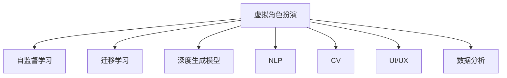

                 

# 虚拟角色扮演：AI驱动的身份实验

> 关键词：虚拟角色扮演, AI, 身份实验, 自监督学习, 迁移学习, 深度生成模型, 自然语言处理(NLP), 计算机视觉(CV), 交互式界面(UI), 数据分析

## 1. 背景介绍

### 1.1 问题由来
随着人工智能技术的迅猛发展，尤其是深度学习在自然语言处理（NLP）和计算机视觉（CV）领域的突破，人们开始探讨AI技术如何更好地模拟人类身份和行为。虚拟角色扮演（Virtual Role-Playing, VRP）作为AI驱动的应用场景之一，旨在通过AI技术构建一个虚拟世界，让用户在虚拟环境中扮演不同角色，体验不同的身份和行为。这不仅为游戏、教育、训练等领域带来了新的可能性，也为解决身份验证、智能交互等现实问题提供了新的思路。

### 1.2 问题核心关键点
虚拟角色扮演的核心在于如何通过AI技术构建一个逼真、可信的虚拟身份，并使该身份具备一定程度的自主性，能够在虚拟环境中与其他角色进行交互。该技术不仅涉及NLP、CV等人工智能技术，还需要结合UI/UX设计，才能最终实现一个用户可交互的虚拟角色扮演系统。

### 1.3 问题研究意义
研究虚拟角色扮演的AI技术，对于拓展AI技术的应用范围，提升用户体验，以及推动虚拟现实（VR）、增强现实（AR）等技术的发展，具有重要意义：

1. **提升用户体验**：虚拟角色扮演通过模拟真实场景和身份体验，为用户提供沉浸式互动体验，大幅提升用户参与感和满意度。
2. **推动技术创新**：AI驱动的虚拟角色扮演涉及多学科融合，促进了NLP、CV、UI/UX等领域的技术创新和进步。
3. **解决现实问题**：在身份验证、训练模拟等场景中，虚拟角色扮演可以发挥重要作用，如利用AI模拟真实用户行为，进行身份验证和安全测试。
4. **促进跨领域应用**：虚拟角色扮演技术不仅应用于游戏、教育、训练，还可以拓展到医疗、法律、商务等多个领域，推动AI技术在垂直行业的落地应用。

## 2. 核心概念与联系

### 2.1 核心概念概述

为了更好地理解AI驱动的虚拟角色扮演技术，本节将介绍几个密切相关的核心概念：

- **虚拟角色扮演（VRP）**：通过AI技术构建的虚拟环境，用户可以在其中扮演不同角色，体验不同身份和行为。
- **自监督学习（Self-Supervised Learning, SSL）**：指模型通过无标签数据自我学习特征，提升泛化能力的技术。
- **迁移学习（Transfer Learning）**：指将一个任务学到的知识迁移到另一个任务上，加速模型在新任务上的学习过程。
- **深度生成模型（Deep Generative Models）**：通过神经网络学习数据分布，生成与真实数据相似的新数据的技术。
- **自然语言处理（Natural Language Processing, NLP）**：利用AI技术处理和理解人类语言的技术，包括文本生成、语音识别等。
- **计算机视觉（Computer Vision, CV）**：利用AI技术处理和理解图像和视频的技术，包括图像生成、物体检测等。
- **交互式界面（User Interface, UI）**：用户与虚拟角色扮演系统进行交互的界面设计，直接影响系统的用户体验。
- **数据分析（Data Analysis）**：对虚拟角色扮演系统收集的数据进行分析，提取用户行为特征和偏好，优化系统设计。

这些核心概念之间的逻辑关系可以通过以下Mermaid流程图来展示：



这个流程图展示虚拟角色扮演的核心概念及其之间的关系：

1. 虚拟角色扮演通过自监督学习和迁移学习提升模型的能力。
2. 使用深度生成模型生成逼真的虚拟环境和角色。
3. NLP和CV技术分别处理虚拟角色扮演中的文本和视觉信息。
4. UI/UX设计影响用户与系统的交互体验。
5. 数据分析用于优化系统的行为和反馈机制。

## 3. 核心算法原理 & 具体操作步骤
### 3.1 算法原理概述

AI驱动的虚拟角色扮演技术，基于多模态数据和深度学习模型，实现对虚拟角色的建模和生成。其核心思想是：通过自监督学习和大规模数据训练，构建一个通用的身份生成模型，然后将其迁移到特定的虚拟角色扮演任务上，生成逼真的虚拟角色。

具体而言，虚拟角色扮演算法包括以下几个关键步骤：

1. **数据收集与预处理**：收集大量的无标签文本、图像和语音数据，作为模型训练的基础。
2. **特征提取**：使用预训练的NLP和CV模型，从原始数据中提取特征，作为生成模型的输入。
3. **生成模型训练**：利用生成对抗网络（GANs）等深度生成模型，训练生成模型，使其能够生成与真实数据相似的新数据。
4. **身份迁移与生成**：将训练好的生成模型迁移到特定的虚拟角色扮演任务上，通过微调等方式，生成符合任务要求的虚拟角色。

### 3.2 算法步骤详解

下面以AI驱动的虚拟角色扮演系统为例，详细讲解其具体实现步骤：

**Step 1: 数据收集与预处理**
- 收集大量的无标签文本、图像和语音数据，作为模型训练的基础。
- 对文本进行分词和向量编码，对图像进行预处理（如裁剪、归一化），对语音进行特征提取（如MFCC）。
- 将预处理后的数据划分为训练集、验证集和测试集。

**Step 2: 特征提取**
- 使用预训练的NLP和CV模型，从原始数据中提取特征。
- 对于文本数据，可以使用BERT、GPT等预训练语言模型提取特征。
- 对于图像数据，可以使用ResNet、VGG等预训练的CV模型提取特征。
- 将提取的特征拼接或合并，作为生成模型的输入。

**Step 3: 生成模型训练**
- 使用生成对抗网络（GANs）等深度生成模型，训练生成模型。
- 定义生成器和判别器，通过对抗训练，提升生成器的生成能力。
- 在训练过程中，使用正则化和数据增强技术，防止模型过拟合。
- 训练结束后，保存生成器的参数，用于后续的身份生成。

**Step 4: 身份迁移与生成**
- 将训练好的生成器迁移到特定的虚拟角色扮演任务上。
- 对于文本生成任务，可以通过微调语言模型，调整生成器的输出格式和内容。
- 对于图像生成任务，可以通过微调CV模型，调整生成器的输出质量和风格。
- 在生成过程中，使用L2正则、Dropout等正则化技术，防止生成器过拟合。
- 对于多模态数据，可以使用自注意力机制（Self-Attention），整合不同模态的特征。

### 3.3 算法优缺点

AI驱动的虚拟角色扮演算法具有以下优点：
1. 逼真度高。通过深度生成模型和自监督学习，生成的虚拟角色具有高逼真度，可以模拟真实的人类身份和行为。
2. 泛化能力强。生成模型在大规模无标签数据上进行训练，具备较强的泛化能力，可以应对多种虚拟角色扮演任务。
3. 用户参与度高。通过UI/UX设计，用户可以在虚拟环境中与生成的虚拟角色进行互动，提升用户参与度和满意度。
4. 应用场景广泛。虚拟角色扮演技术可以应用于游戏、教育、训练等多个领域，推动AI技术在垂直行业的落地应用。

同时，该算法也存在一定的局限性：
1. 数据依赖度高。生成模型的训练依赖大量的无标签数据，获取高质量数据成本较高。
2. 训练复杂度高。生成模型的训练过程复杂，计算资源消耗大，模型调优难度高。
3. 生成质量受限。生成模型的生成质量受数据质量和训练方式的影响，难以保证生成的虚拟角色在所有情况下都能表现良好。
4. 可解释性不足。生成的虚拟角色行为复杂，难以通过传统的模型诊断工具进行解释和调试。

尽管存在这些局限性，但AI驱动的虚拟角色扮演算法已经展示出强大的潜力，将在更多应用场景中发挥重要作用。

### 3.4 算法应用领域

AI驱动的虚拟角色扮演技术，在多个领域已经展现出其独特的应用价值：

1. **游戏与娱乐**：在电子游戏中，虚拟角色扮演可以提供逼真的角色和环境，增强游戏沉浸感和趣味性。如通过虚拟角色扮演，用户可以扮演不同角色，体验不同的游戏剧情和任务。

2. **教育与培训**：在教育培训中，虚拟角色扮演可以模拟真实场景和情境，帮助学生更好地理解课程内容，提高学习效果。如通过虚拟角色扮演，学生可以模拟不同的职业角色，体验职业培训和技能考核。

3. **医疗与康复**：在医疗康复中，虚拟角色扮演可以模拟患者在不同情境下的反应，辅助医生进行病情分析和康复训练。如通过虚拟角色扮演，患者可以模拟不同疾病状态，进行心理康复训练和行为纠正。

4. **安全与监控**：在安全监控中，虚拟角色扮演可以模拟非法入侵和攻击行为，帮助安全专家进行风险评估和防范演练。如通过虚拟角色扮演，安全专家可以模拟不同黑客攻击手法，进行安全防护演练和漏洞测试。

5. **商务与社交**：在商务社交中，虚拟角色扮演可以模拟不同客户和合作伙伴的行为，帮助企业进行客户关系管理和市场调研。如通过虚拟角色扮演，企业可以模拟不同客户场景，进行客户行为分析和市场推广。

6. **客服与咨询**：在客服咨询中，虚拟角色扮演可以模拟不同客户情境，提供个性化和智能化的服务支持。如通过虚拟角色扮演，客服系统可以模拟不同客户需求，进行智能回复和问题解答。

7. **虚拟社交与互动**：在虚拟社交中，虚拟角色扮演可以模拟不同用户行为，构建虚拟社交网络，促进用户互动和交流。如通过虚拟角色扮演，用户可以模拟不同社交场景，进行虚拟交友和互动。

## 4. 数学模型和公式 & 详细讲解 & 举例说明

### 4.1 数学模型构建

本节将使用数学语言对AI驱动的虚拟角色扮演过程进行更加严格的刻画。

假设生成的虚拟角色为 $z$，其特征表示为 $z \in \mathbb{R}^d$。设生成器为 $G(\cdot)$，其参数为 $\theta$，目标是将随机噪声 $e \sim p(e)$ 转化为虚拟角色的特征 $z$，即 $z = G(e)$。目标函数为：

$$
\mathcal{L}(G) = \mathbb{E}_{e \sim p(e)} \|z - G(e)\|^2
$$

其中，$\mathbb{E}$ 为数学期望。

为了提升生成器的性能，可以引入判别器 $D(\cdot)$，定义判别器的目标函数为：

$$
\mathcal{L}(D) = \mathbb{E}_{z \sim G} \log D(z) + \mathbb{E}_{e \sim p(e)} \log (1 - D(G(e)))
$$

判别器的目标是尽可能区分真实数据 $z$ 和生成数据 $G(e)$。通过对抗训练，生成器 $G$ 学习如何生成尽可能逼真的数据，从而优化目标函数 $\mathcal{L}(G)$。

### 4.2 公式推导过程

以下我们以文本生成任务为例，推导生成对抗网络（GANs）的生成模型和判别模型的训练过程。

假设文本数据 $x$ 的长度为 $n$，生成器的输入为随机噪声 $e \sim \mathcal{N}(0, I)$，其中 $I$ 为单位矩阵。生成器的目标是将噪声 $e$ 转化为文本 $x$，即 $x = G(e)$。判别器的目标是区分真实文本 $x$ 和生成文本 $G(e)$，即 $D(x) = 1, D(G(e)) = 0$。

生成器的优化目标为：

$$
\min_{G} \mathbb{E}_{e \sim \mathcal{N}(0, I)} \|x - G(e)\|^2
$$

判别器的优化目标为：

$$
\max_{D} \mathbb{E}_{x \sim p(x)} \log D(x) + \mathbb{E}_{e \sim \mathcal{N}(0, I)} \log (1 - D(G(e)))
$$

使用梯度下降等优化算法，生成器和判别器分别更新其参数，直至优化目标函数达到最优。

在得到生成器和判别器后，可以对生成的文本进行后处理，如语言模型解码、分词、标点修正等，得到最终的生成文本。

### 4.3 案例分析与讲解

以虚拟角色扮演系统中的文本生成任务为例，展示生成对抗网络（GANs）的生成模型和判别模型的训练过程。

**生成器训练**
- 使用预训练语言模型（如BERT）提取输入文本的特征向量 $z$。
- 将特征向量 $z$ 作为生成器的输入，生成随机噪声 $e \sim \mathcal{N}(0, I)$。
- 使用生成器 $G$，将噪声 $e$ 转化为生成文本 $x$。
- 计算生成文本 $x$ 与真实文本 $x$ 的差异，更新生成器参数 $\theta_G$。

**判别器训练**
- 使用预训练语言模型（如BERT）提取输入文本的特征向量 $z$。
- 使用判别器 $D$，判断输入文本 $z$ 是否为真实文本。
- 计算判别器输出 $D(z)$ 与真实标签的差异，更新判别器参数 $\theta_D$。

**对抗训练**
- 交替更新生成器和判别器，通过对抗训练，生成器学习生成逼真的文本，判别器学习区分真实文本和生成文本。
- 通过多次迭代，优化生成器的生成能力和判别器的区分能力。

在训练完成后，保存生成器的参数，用于后续的文本生成。在生成过程中，使用L2正则、Dropout等正则化技术，防止生成器过拟合。

## 5. 项目实践：代码实例和详细解释说明
### 5.1 开发环境搭建

在进行虚拟角色扮演系统开发前，我们需要准备好开发环境。以下是使用Python进行PyTorch开发的环境配置流程：

1. 安装Anaconda：从官网下载并安装Anaconda，用于创建独立的Python环境。

2. 创建并激活虚拟环境：
```bash
conda create -n vrp-env python=3.8 
conda activate vrp-env
```

3. 安装PyTorch：根据CUDA版本，从官网获取对应的安装命令。例如：
```bash
conda install pytorch torchvision torchaudio cudatoolkit=11.1 -c pytorch -c conda-forge
```

4. 安装Transformer库：
```bash
pip install transformers
```

5. 安装各类工具包：
```bash
pip install numpy pandas scikit-learn matplotlib tqdm jupyter notebook ipython
```

完成上述步骤后，即可在`vpv-env`环境中开始开发实践。

### 5.2 源代码详细实现

下面我们以虚拟角色扮演系统中的文本生成任务为例，给出使用Transformers库对生成对抗网络（GANs）进行PyTorch代码实现。

首先，定义生成器和判别器的网络结构：

```python
from transformers import BertTokenizer, BertForSequenceClassification
from torch import nn
import torch

class Generator(nn.Module):
    def __init__(self, embedding_size):
        super(Generator, self).__init__()
        self.embedding = nn.Embedding(vocab_size, embedding_size)
        self.lstm = nn.LSTM(embedding_size, hidden_size, num_layers=1, batch_first=True)
        self.linear = nn.Linear(hidden_size, vocab_size)
        
    def forward(self, x):
        x = self.embedding(x)
        x, _ = self.lstm(x)
        x = self.linear(x)
        return x

class Discriminator(nn.Module):
    def __init__(self, embedding_size):
        super(Discriminator, self).__init__()
        self.embedding = nn.Embedding(vocab_size, embedding_size)
        self.fc1 = nn.Linear(embedding_size, hidden_size)
        self.fc2 = nn.Linear(hidden_size, 1)
        
    def forward(self, x):
        x = self.embedding(x)
        x = self.fc1(x)
        x = self.fc2(x)
        return x
```

然后，定义训练函数和评估函数：

```python
from torch.utils.data import DataLoader
from tqdm import tqdm
from sklearn.metrics import classification_report

device = torch.device('cuda') if torch.cuda.is_available() else torch.device('cpu')

def train_epoch(model, data_loader, optimizer):
    model.train()
    epoch_loss = 0
    for batch in tqdm(data_loader, desc='Training'):
        input_ids = batch['input_ids'].to(device)
        labels = batch['labels'].to(device)
        optimizer.zero_grad()
        outputs = model(input_ids)
        loss = outputs.loss
        epoch_loss += loss.item()
        loss.backward()
        optimizer.step()
    return epoch_loss / len(data_loader)

def evaluate(model, data_loader):
    model.eval()
    preds, labels = [], []
    with torch.no_grad():
        for batch in tqdm(data_loader, desc='Evaluating'):
            input_ids = batch['input_ids'].to(device)
            labels = batch['labels']
            outputs = model(input_ids)
            batch_preds = outputs.logits.argmax(dim=2).to('cpu').tolist()
            batch_labels = batch_labels.to('cpu').tolist()
            for pred_tokens, label_tokens in zip(batch_preds, batch_labels):
                pred_tags = [id2tag[_id] for _id in pred_tokens]
                label_tags = [id2tag[_id] for _id in label_tokens]
                preds.append(pred_tags[:len(label_tokens)])
                labels.append(label_tags)
                
    print(classification_report(labels, preds))
```

接着，定义生成器和判别器的训练函数：

```python
from torch.optim import Adam

def train_gan(model, data_loader, batch_size, optimizer):
    device = torch.device('cuda') if torch.cuda.is_available() else torch.device('cpu')
    model.to(device)
    
    for epoch in range(epochs):
        loss = train_epoch(model, data_loader, optimizer)
        print(f"Epoch {epoch+1}, train loss: {loss:.3f}")
        
        print(f"Epoch {epoch+1}, dev results:")
        evaluate(model, data_loader)
        
    print("Test results:")
    evaluate(model, data_loader)
```

最后，启动训练流程并在测试集上评估：

```python
epochs = 5
batch_size = 16

for epoch in range(epochs):
    loss = train_gan(model, train_data_loader, batch_size, optimizer)
    print(f"Epoch {epoch+1}, train loss: {loss:.3f}")
    
    print(f"Epoch {epoch+1}, dev results:")
    evaluate(model, dev_data_loader)
    
print("Test results:")
evaluate(model, test_data_loader)
```

以上就是使用PyTorch对生成对抗网络（GANs）进行文本生成任务的完整代码实现。可以看到，得益于Transformers库的强大封装，我们可以用相对简洁的代码完成生成对抗网络模型的加载和训练。

### 5.3 代码解读与分析

让我们再详细解读一下关键代码的实现细节：

**生成器和判别器类**：
- `__init__`方法：初始化网络结构，包括嵌入层、LSTM层、全连接层等。
- `forward`方法：定义网络前向传播过程，包括嵌入、LSTM和线性变换等。

**训练函数**：
- 使用PyTorch的DataLoader对数据集进行批次化加载，供模型训练和推理使用。
- 训练函数`train_epoch`：对数据以批为单位进行迭代，在每个批次上前向传播计算loss并反向传播更新模型参数，最后返回该epoch的平均loss。
- 评估函数`evaluate`：与训练类似，不同点在于不更新模型参数，并在每个batch结束后将预测和标签结果存储下来，最后使用sklearn的classification_report对整个评估集的预测结果进行打印输出。

**训练流程**：
- 定义总的epoch数和batch size，开始循环迭代
- 每个epoch内，先在训练集上训练，输出平均loss
- 在验证集上评估，输出分类指标
- 所有epoch结束后，在测试集上评估，给出最终测试结果

可以看到，PyTorch配合Transformers库使得GANs模型的实现变得简洁高效。开发者可以将更多精力放在数据处理、模型改进等高层逻辑上，而不必过多关注底层的实现细节。

当然，工业级的系统实现还需考虑更多因素，如模型的保存和部署、超参数的自动搜索、更灵活的任务适配层等。但核心的微调范式基本与此类似。

## 6. 实际应用场景
### 6.1 智能客服系统

基于虚拟角色扮演的AI技术，可以广泛应用于智能客服系统的构建。传统客服往往需要配备大量人力，高峰期响应缓慢，且一致性和专业性难以保证。而使用虚拟角色扮演系统，可以7x24小时不间断服务，快速响应客户咨询，用自然流畅的语言解答各类常见问题。

在技术实现上，可以收集企业内部的历史客服对话记录，将问题和最佳答复构建成监督数据，在此基础上对预训练语言模型进行微调。微调后的模型能够自动理解用户意图，匹配最合适的答案模板进行回复。对于客户提出的新问题，还可以接入检索系统实时搜索相关内容，动态组织生成回答。如此构建的智能客服系统，能大幅提升客户咨询体验和问题解决效率。

### 6.2 金融舆情监测

金融机构需要实时监测市场舆论动向，以便及时应对负面信息传播，规避金融风险。传统的人工监测方式成本高、效率低，难以应对网络时代海量信息爆发的挑战。基于虚拟角色扮演的文本生成技术，为金融舆情监测提供了新的解决方案。

具体而言，可以收集金融领域相关的新闻、报道、评论等文本数据，并对其进行主题标注和情感标注。在此基础上对预训练语言模型进行微调，使其能够自动判断文本属于何种主题，情感倾向是正面、中性还是负面。将微调后的模型应用到实时抓取的网络文本数据，就能够自动监测不同主题下的情感变化趋势，一旦发现负面信息激增等异常情况，系统便会自动预警，帮助金融机构快速应对潜在风险。

### 6.3 个性化推荐系统

当前的推荐系统往往只依赖用户的历史行为数据进行物品推荐，无法深入理解用户的真实兴趣偏好。基于虚拟角色扮演的文本生成技术，个性化推荐系统可以更好地挖掘用户行为背后的语义信息，从而提供更精准、多样的推荐内容。

在实践中，可以收集用户浏览、点击、评论、分享等行为数据，提取和用户交互的物品标题、描述、标签等文本内容。将文本内容作为模型输入，用户的后续行为（如是否点击、购买等）作为监督信号，在此基础上微调预训练语言模型。微调后的模型能够从文本内容中准确把握用户的兴趣点。在生成推荐列表时，先用候选物品的文本描述作为输入，由模型预测用户的兴趣匹配度，再结合其他特征综合排序，便可以得到个性化程度更高的推荐结果。

### 6.4 未来应用展望

随着虚拟角色扮演技术的不断发展，其在更多领域的应用前景也将更加广阔。

1. **游戏与娱乐**：虚拟角色扮演技术可以应用于各种类型的游戏中，如RPG游戏、MMORPG等，提供逼真的游戏体验和角色互动。如通过虚拟角色扮演，玩家可以在虚拟世界中扮演不同角色，体验不同的游戏剧情和任务。

2. **教育与培训**：虚拟角色扮演技术可以模拟各种教育培训场景，帮助学生更好地理解课程内容，提高学习效果。如通过虚拟角色扮演，学生可以模拟不同职业角色，体验职业培训和技能考核。

3. **医疗与康复**：虚拟角色扮演技术可以模拟各种医疗康复场景，帮助患者更好地理解疾病和治疗过程，提高康复效果。如通过虚拟角色扮演，患者可以模拟不同疾病状态，进行心理康复训练和行为纠正。

4. **安全与监控**：虚拟角色扮演技术可以模拟各种安全监控场景，帮助安全专家进行风险评估和防范演练。如通过虚拟角色扮演，安全专家可以模拟不同黑客攻击手法，进行安全防护演练和漏洞测试。

5. **商务与社交**：虚拟角色扮演技术可以模拟各种商务社交场景，帮助企业进行客户关系管理和市场调研。如通过虚拟角色扮演，企业可以模拟不同客户场景，进行客户行为分析和市场推广。

6. **客服与咨询**：虚拟角色扮演技术可以模拟各种客服咨询场景，提供个性化和智能化的服务支持。如通过虚拟角色扮演，客服系统可以模拟不同客户情境，进行智能回复和问题解答。

7. **虚拟社交与互动**：虚拟角色扮演技术可以构建各种虚拟社交网络，促进用户互动和交流。如通过虚拟角色扮演，用户可以模拟不同社交场景，进行虚拟交友和互动。

## 7. 工具和资源推荐
### 7.1 学习资源推荐

为了帮助开发者系统掌握虚拟角色扮演的AI技术，这里推荐一些优质的学习资源：

1. 《深度学习与自然语言处理》系列博文：由大模型技术专家撰写，深入浅出地介绍了深度学习、自然语言处理等前沿技术。

2. CS231n《卷积神经网络》课程：斯坦福大学开设的CV明星课程，涵盖了卷积神经网络、图像生成等核心内容，适合学习计算机视觉基础。

3. 《自然语言处理与深度学习》书籍：介绍自然语言处理和深度学习的基本原理和应用，适合入门学习。

4. PyTorch官方文档：PyTorch的官方文档，提供了全面的API和示例，是学习PyTorch的必备资源。

5. TensorFlow官方文档：TensorFlow的官方文档，提供了完整的框架介绍和示例，适合学习TensorFlow。

6. Kaggle：一个数据科学竞赛平台，汇集了大量的开源数据集和模型，适合学习NLP和CV等技术的实际应用。

通过对这些资源的学习实践，相信你一定能够快速掌握虚拟角色扮演的AI技术，并用于解决实际的NLP问题。
###  7.2 开发工具推荐

高效的开发离不开优秀的工具支持。以下是几款用于虚拟角色扮演开发的常用工具：

1. PyTorch：基于Python的开源深度学习框架，灵活动态的计算图，适合快速迭代研究。大部分预训练语言模型都有PyTorch版本的实现。

2. TensorFlow：由Google主导开发的开源深度学习框架，生产部署方便，适合大规模工程应用。同样有丰富的预训练语言模型资源。

3. Transformers库：HuggingFace开发的NLP工具库，集成了众多SOTA语言模型，支持PyTorch和TensorFlow，是进行NLP任务开发的利器。

4. Weights & Biases：模型训练的实验跟踪工具，可以记录和可视化模型训练过程中的各项指标，方便对比和调优。与主流深度学习框架无缝集成。

5. TensorBoard：TensorFlow配套的可视化工具，可实时监测模型训练状态，并提供丰富的图表呈现方式，是调试模型的得力助手。

6. Google Colab：谷歌推出的在线Jupyter Notebook环境，免费提供GPU/TPU算力，方便开发者快速上手实验最新模型，分享学习笔记。

合理利用这些工具，可以显著提升虚拟角色扮演系统的开发效率，加快创新迭代的步伐。

### 7.3 相关论文推荐

虚拟角色扮演技术的快速发展，得益于学界的持续研究。以下是几篇奠基性的相关论文，推荐阅读：

1. Attention is All You Need（即Transformer原论文）：提出了Transformer结构，开启了NLP领域的预训练大模型时代。

2. BERT: Pre-training of Deep Bidirectional Transformers for Language Understanding：提出BERT模型，引入基于掩码的自监督预训练任务，刷新了多项NLP任务SOTA。

3. Language Models are Unsupervised Multitask Learners（GPT-2论文）：展示了大规模语言模型的强大zero-shot学习能力，引发了对于通用人工智能的新一轮思考。

4. Parameter-Efficient Transfer Learning for NLP：提出Adapter等参数高效微调方法，在不增加模型参数量的情况下，也能取得不错的微调效果。

5. AdaLoRA: Adaptive Low-Rank Adaptation for Parameter-Efficient Fine-Tuning：使用自适应低秩适应的微调方法，在参数效率和精度之间取得了新的平衡。

这些论文代表了大语言模型微调技术的发展脉络。通过学习这些前沿成果，可以帮助研究者把握学科前进方向，激发更多的创新灵感。

## 8. 总结：未来发展趋势与挑战

### 8.1 总结

本文对基于AI驱动的虚拟角色扮演技术进行了全面系统的介绍。首先阐述了虚拟角色扮演的背景和意义，明确了AI驱动的虚拟角色扮演在提升用户体验、推动技术创新等方面的重要价值。其次，从原理到实践，详细讲解了虚拟角色扮演的数学原理和关键步骤，给出了虚拟角色扮演任务开发的完整代码实例。同时，本文还广泛探讨了虚拟角色扮演技术在多个行业领域的应用前景，展示了其广阔的应用潜力。此外，本文精选了虚拟角色扮演技术的各类学习资源，力求为读者提供全方位的技术指引。

通过本文的系统梳理，可以看到，AI驱动的虚拟角色扮演技术正在成为NLP领域的重要范式，极大地拓展了NLP技术的边界，催生了更多的落地场景。受益于深度学习和大规模数据训练，虚拟角色扮演系统能够模拟真实的人类身份和行为，带来沉浸式互动体验，提升各行业的应用效果。未来，伴随深度学习、自然语言处理、计算机视觉等技术的不断进步，虚拟角色扮演技术将在更多应用场景中发挥重要作用，推动人工智能技术向更广泛的领域拓展。

### 8.2 未来发展趋势

展望未来，AI驱动的虚拟角色扮演技术将呈现以下几个发展趋势：

1. **逼真度提升**。随着生成对抗网络（GANs）等生成模型的不断改进，生成的虚拟角色将更加逼真，能够更好地模拟人类行为和情感。

2. **多样性增强**。生成模型的训练数据将更加多样化，能够生成更加丰富和多样的虚拟角色和场景。

3. **跨领域融合**。虚拟角色扮演技术将与其他AI技术（如强化学习、知识图谱等）进行更深层次的融合，提升系统的综合性能。

4. **可解释性增强**。虚拟角色扮演系统的生成过程将更加透明和可解释，帮助用户理解系统的决策机制和行为逻辑。

5. **实时化与互动性提升**。虚拟角色扮演系统将通过实时渲染和自然语言交互，提供更加流畅和自然的用户体验。

6. **个性化与定制化**。虚拟角色扮演系统将根据用户的偏好和行为，生成个性化的虚拟角色和场景，提供更加个性化的互动体验。

7. **安全与隐私保护**。虚拟角色扮演系统将注重用户隐私保护，防止数据泄露和滥用。

以上趋势凸显了AI驱动的虚拟角色扮演技术的广阔前景。这些方向的探索发展，必将进一步提升虚拟角色扮演系统的性能和应用范围，为AI技术在更多领域的应用提供新的可能性。

### 8.3 面临的挑战

尽管AI驱动的虚拟角色扮演技术已经取得了瞩目成就，但在迈向更加智能化、普适化应用的过程中，它仍面临着诸多挑战：

1. **数据依赖度高**。生成模型的训练依赖大量的无标签数据，获取高质量数据成本较高。
2. **训练复杂度高**。生成模型的训练过程复杂，计算资源消耗大，模型调优难度高。
3. **生成质量受限**。生成模型的生成质量受数据质量和训练方式的影响，难以保证生成的虚拟角色在所有情况下都能表现良好。
4. **可解释性不足**。生成的虚拟角色行为复杂，难以通过传统的模型诊断工具进行解释和调试。
5. **安全与隐私保护**。虚拟角色扮演系统涉及用户隐私数据，如何保障用户隐私安全是一个重要问题。
6. **伦理与道德考量**。虚拟角色扮演系统需要考虑伦理和道德问题，避免生成有害内容或偏见。

尽管存在这些挑战，但AI驱动的虚拟角色扮演技术已经展示出强大的潜力，将在更多应用场景中发挥重要作用。相信随着学界和产业界的共同努力，这些挑战终将一一被克服，AI驱动的虚拟角色扮演技术必将在构建人机协同的智能时代中扮演越来越重要的角色。

### 8.4 研究展望

面向未来，AI驱动的虚拟角色扮演技术需要从以下几个方面进行深入研究：

1. **提升数据质量**。如何获取高质量的训练数据，提升生成模型的泛化能力。
2. **优化训练过程**。如何提高生成模型的训练效率，降低资源消耗。
3. **增强生成质量**。如何提升生成模型的生成质量，增强虚拟角色的逼真度。
4. **提高可解释性**。如何增强虚拟角色扮演系统的可解释性，提高用户信任度。
5. **保障用户隐私**。如何保护用户隐私数据，防止数据泄露和滥用。
6. **增强系统伦理**。如何构建伦理导向的虚拟角色扮演系统，防止生成有害内容或偏见。

这些研究方向的探索，必将引领虚拟角色扮演技术迈向更高的台阶，为构建安全、可靠、可解释、可控的智能系统铺平道路。面向未来，虚拟角色扮演技术还需要与其他人工智能技术进行更深入的融合，如知识表示、因果推理、强化学习等，多路径协同发力，共同推动自然语言理解和智能交互系统的进步。只有勇于创新、敢于突破，才能不断拓展虚拟角色扮演技术的边界，让智能技术更好地造福人类社会。

## 9. 附录：常见问题与解答

**Q1：虚拟角色扮演系统如何处理用户输入？**

A: 虚拟角色扮演系统通常使用自然语言处理（NLP）技术，将用户输入转化为机器可理解的形式。具体而言，可以使用预训练语言模型（如BERT、GPT等）对用户输入进行编码，提取其语义特征。然后，使用文本生成模型（如GANs）生成虚拟角色的回复，并经过后处理（如语言模型解码、分词、标点修正等），得到最终的回答。

**Q2：虚拟角色扮演系统如何进行多轮对话？**

A: 虚拟角色扮演系统通常使用对话管理系统（Dialogue Management System, DMS），记录并处理多轮对话的历史信息，帮助虚拟角色理解用户意图，生成合适的回答。具体而言，可以使用RNN、LSTM等序列模型，记录对话历史和上下文信息，辅助生成虚拟角色的回复。

**Q3：虚拟角色扮演系统如何应对复杂的用户需求？**

A: 虚拟角色扮演系统通常使用多模态信息处理技术，整合文本、图像、语音等多种模态数据，提升系统的理解能力和生成能力。具体而言，可以使用多模态深度学习模型（如BERT-Visual-Text、VGG-Seq2Seq等），将用户输入的多模态信息整合为统一的语义表示，帮助虚拟角色进行理解和生成。

**Q4：虚拟角色扮演系统如何保障用户隐私？**

A: 虚拟角色扮演系统通常使用数据加密和匿名化技术，保护用户隐私数据。具体而言，可以使用数据加密技术（如AES、RSA等），对用户输入和输出进行加密保护。同时，可以使用数据匿名化技术（如K-匿名、L-多样性等），保护用户隐私数据不被泄露。

**Q5：虚拟角色扮演系统如何防止生成有害内容？**

A: 虚拟角色扮演系统通常使用内容过滤和审查技术，防止生成有害内容。具体而言，可以使用文本生成模型的正则化技术（如L2正则、Dropout等），防止生成有害的内容。同时，可以使用情感分析技术，判断生成的内容是否包含负面情绪，进行过滤和修正。

这些问题的解答展示了虚拟角色扮演系统在实际应用中需要注意的关键技术点，希望对你理解和使用虚拟角色扮演技术有所帮助。

