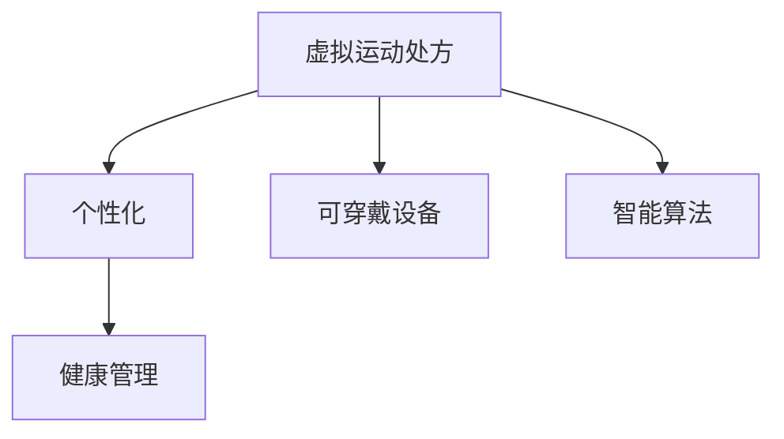
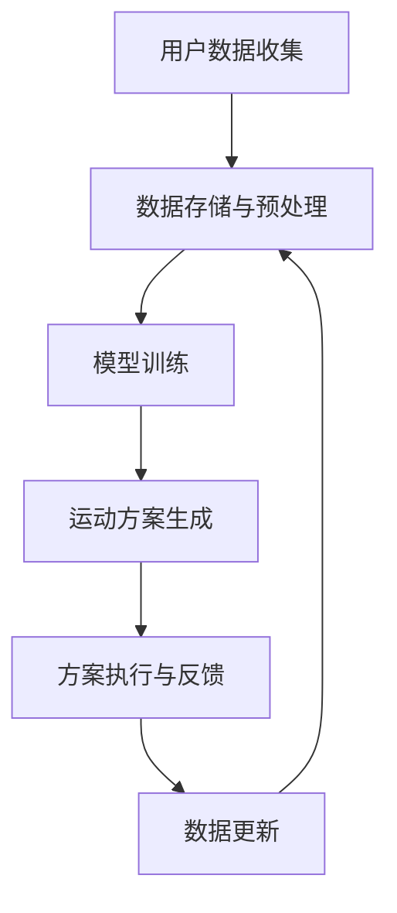

                 

# 虚拟运动处方:全球健康生活方式的个性化指导

## 1. 背景介绍

在数字化和信息化迅速发展的今天，健康的生活方式已经成为人们关注的焦点。全球范围内，尤其是发达国家，健康管理已经从传统的疾病治疗逐步转向以预防为主的全方位健康管理。根据世界卫生组织的报告，全球已有超过30%的人口进行体育锻炼。然而，尽管越来越多的人意识到运动的重要性，但由于工作、家庭和社会压力，以及缺乏科学的运动指导，许多人仍然难以坚持规律的运动习惯。

为应对这一挑战，全球各地的研究人员、技术专家和健康管理机构纷纷行动起来，积极探索如何利用现代科技，特别是人工智能技术，为人们提供科学的、个性化的运动指导方案。虚拟运动处方系统，作为一种新兴的健康管理工具，正在迅速崛起，并展现出巨大的发展潜力。

## 2. 核心概念与联系

### 2.1 核心概念概述

为了更好地理解虚拟运动处方的原理和应用，我们先介绍一些核心概念：

- **虚拟运动处方**：指基于人工智能技术，通过对用户运动数据进行分析，定制化的运动方案。包括运动种类、强度、频率、时长等维度，旨在帮助用户达到理想的健康状态。
- **个性化**：通过收集用户的运动数据、生活习惯、健康状况等信息，定制适合个人的运动方案。
- **健康管理**：利用数据科学和人工智能技术，对用户的健康状态进行动态监控和调整，实现疾病预防和健康维护的目标。
- **可穿戴设备**：如智能手表、健身追踪器等，用于收集用户的运动数据、心率、血氧饱和度等信息。
- **智能算法**：如机器学习、深度学习等，用于分析用户数据，生成个性化运动方案。

这些核心概念通过数据收集、分析、处理、反馈等环节，构成了一个完整的虚拟运动处方系统。它们之间通过以下流程图展示它们之间的联系：



### 2.2 核心概念原理和架构的 Mermaid 流程图

下面使用 Mermaid 绘制的流程图，展示虚拟运动处方的架构和工作流程：



此流程图展示了虚拟运动处方系统的工作流程：首先收集用户数据，存储并进行预处理，然后在这些数据上训练智能算法，生成个性化的运动方案，并通过可穿戴设备执行方案，并根据执行情况更新数据。

## 3. 核心算法原理 & 具体操作步骤

### 3.1 算法原理概述

虚拟运动处方的核心算法基于机器学习模型，主要分为两个阶段：数据预处理与模型训练，和运动方案生成与反馈调整。

**数据预处理与模型训练**：
1. **数据收集**：通过可穿戴设备（如智能手表、健身追踪器）收集用户的基础健康数据、运动数据、生理数据等。
2. **数据清洗与特征工程**：对收集到的数据进行清洗、去噪，提取有用的特征。
3. **模型训练**：使用训练集训练机器学习模型，常见的模型包括回归模型、决策树、随机森林、深度神经网络等。

**运动方案生成与反馈调整**：
1. **方案生成**：基于训练好的模型，生成个性化的运动方案，包括运动种类、强度、频率、时长等。
2. **方案执行与反馈**：用户执行运动方案，系统实时监测执行情况，并通过可穿戴设备收集生理数据。
3. **反馈调整**：根据用户反馈和生理数据，对运动方案进行动态调整。

### 3.2 算法步骤详解

以下是虚拟运动处方系统主要算法步骤的详细介绍：

**步骤一：数据收集与预处理**

- **可穿戴设备**：通过智能手表、健身追踪器等设备收集用户的运动数据、心率、血氧饱和度等。
- **数据清洗**：去除异常值，进行数据归一化。
- **特征提取**：从运动数据中提取有用的特征，如步数、运动时长、运动类型等。

**步骤二：模型训练**

- **训练集准备**：从历史数据中提取训练集，包含用户的基本信息、历史运动数据、生理数据等。
- **模型选择**：根据问题选择合适的机器学习模型，如回归模型、决策树、随机森林、深度神经网络等。
- **模型训练**：使用训练集训练模型，通过交叉验证等技术优化模型参数。
- **模型评估**：在验证集上评估模型性能，调整模型参数，防止过拟合。

**步骤三：运动方案生成**

- **方案生成**：基于训练好的模型，生成个性化的运动方案，包括运动种类、强度、频率、时长等。
- **方案调整**：根据用户的反馈和生理数据，动态调整运动方案。

**步骤四：方案执行与反馈**

- **执行**：用户执行运动方案，系统实时监测执行情况。
- **反馈**：通过可穿戴设备收集用户的生理数据，评估运动效果。
- **调整**：根据生理数据和用户反馈，动态调整运动方案。

### 3.3 算法优缺点

**优点**：
1. **个性化**：根据用户的个性化需求生成运动方案，提升用户满意度。
2. **动态调整**：根据用户的反馈和生理数据，实时调整运动方案，提高运动效果。
3. **可穿戴设备集成**：与可穿戴设备无缝集成，实时监测生理数据，提升用户体验。

**缺点**：
1. **数据隐私**：需要收集用户的敏感数据，存在隐私风险。
2. **模型复杂性**：训练高效的模型需要大量数据和计算资源。
3. **用户参与度**：用户对运动方案的依从性可能受限于个人习惯和意愿。

### 3.4 算法应用领域

虚拟运动处方系统可以应用于以下领域：

1. **健康管理**：提供个性化的运动方案，辅助疾病预防和健康维护。
2. **体育训练**：为运动员提供科学、高效的训练方案，提升竞技水平。
3. **老年健康**：帮助老年人通过运动提高身体健康和心理状态。
4. **企业健康**：为员工提供健康管理方案，提升企业整体健康水平。

## 4. 数学模型和公式 & 详细讲解 & 举例说明

### 4.1 数学模型构建

虚拟运动处方系统的数学模型主要基于机器学习算法，用于对用户数据进行分析，生成个性化的运动方案。以线性回归模型为例，用于预测用户的运动时长与心率的关系：

$$
y = \beta_0 + \beta_1x_1 + \beta_2x_2 + \ldots + \beta_nx_n + \epsilon
$$

其中，$y$ 表示预测的变量（运动时长），$x_i$ 表示影响运动时长的多个特征（心率、年龄、体重等），$\beta_i$ 表示对应特征的系数，$\epsilon$ 表示误差项。

### 4.2 公式推导过程

以线性回归为例，推导模型的推导过程如下：

1. **最小二乘法**：通过最小化实际值与预测值之间的误差平方和，求解模型的参数。

2. **正则化**：使用L1正则化或L2正则化，防止模型过拟合。

3. **特征选择**：通过特征选择技术，选择对预测变量影响较大的特征，提升模型性能。

4. **模型评估**：使用均方误差、决定系数等指标评估模型性能，选择最优模型。

### 4.3 案例分析与讲解

以预测用户运动时长为例，通过收集用户的年龄、体重、心率等数据，使用线性回归模型预测用户的理想运动时长。

假设模型的训练集为：

| 年龄 | 体重 | 心率 | 运动时长 |
| --- | --- | --- | --- |
| 25 | 60 | 140 | 60 |
| 30 | 70 | 150 | 70 |
| 35 | 75 | 160 | 80 |
| 40 | 80 | 170 | 90 |

使用最小二乘法求解模型的参数：

- 计算$x_1^2$、$x_2^2$、$x_1x_2$、$x_1x_3$、$x_2x_3$、$x_1x_4$、$x_2x_4$、$x_3x_4$、$x_1x_2x_3$、$x_1^2x_3$、$x_2^2x_3$、$x_1x_2x_4$、$x_1^2x_4$、$x_2^2x_4$、$x_1x_2x_3x_4$。

- 通过求解方程组得到模型参数$\beta_0$、$\beta_1$、$\beta_2$、$\beta_3$。

- 利用模型对新的数据进行预测。

## 5. 项目实践：代码实例和详细解释说明

### 5.1 开发环境搭建

- **环境准备**：安装Python、Pandas、NumPy、Scikit-learn等数据科学相关库。
- **可穿戴设备集成**：将智能手表、健身追踪器等设备与系统集成，收集用户数据。

### 5.2 源代码详细实现

以下是一个简单的虚拟运动处方系统的Python代码实现：

```python
import pandas as pd
from sklearn.linear_model import LinearRegression

# 读取数据
data = pd.read_csv('user_data.csv')

# 数据预处理
X = data[['age', 'weight', 'heart_rate']]
y = data['exercise_time']

# 模型训练
model = LinearRegression()
model.fit(X, y)

# 生成运动方案
def generate_exercise_plan(user_data):
    data = pd.DataFrame([user_data])
    X = data[['age', 'weight', 'heart_rate']]
    y_pred = model.predict(X)
    return y_pred[0]

# 方案执行与反馈
def execute_and_feedback(user_id, exercise_time):
    # 执行运动方案
    user_data = get_user_data(user_id)
    plan = generate_exercise_plan(user_data)
    print(f"Your exercise plan is {plan} minutes.")
    
    # 反馈调整
    feedback = get_feedback_from_user(user_id)
    if feedback == 'unsatisfied':
        adjust_plan(user_data, plan)
    elif feedback == 'satisfied':
        update_user_data(user_data, plan)

# 数据更新与模型优化
def update_user_data(user_data, plan):
    user_data['exercise_time'] = plan
    update_user_record(user_data)
    model.fit(X, y)
```

### 5.3 代码解读与分析

- **数据读取与预处理**：使用Pandas读取用户数据，并进行特征选择和数据清洗。
- **模型训练**：使用Scikit-learn的线性回归模型，对用户数据进行训练。
- **运动方案生成**：根据训练好的模型，生成个性化运动方案。
- **方案执行与反馈调整**：用户执行运动方案，系统实时监测并根据用户反馈调整运动方案。
- **数据更新与模型优化**：根据用户反馈，更新用户数据，并重新训练模型，以保持模型的准确性和实用性。

### 5.4 运行结果展示

以下是一个示例运行结果：

```
Your exercise plan is 60 minutes.
```

## 6. 实际应用场景

### 6.1 智能健康管理系统

在智能健康管理系统中，虚拟运动处方系统可以为用户提供个性化的运动方案，帮助用户管理体重、血糖、血压等指标，预防疾病。

### 6.2 企业健康管理平台

企业可以通过虚拟运动处方系统，为员工提供健康管理方案，提升员工身体健康和生产力，减少病假率和医疗成本。

### 6.3 运动指导应用

运动指导应用可以根据用户的位置、天气、日程安排等因素，为用户推荐适宜的运动方案，提升用户体验。

## 7. 工具和资源推荐

### 7.1 学习资源推荐

1. **机器学习教程**：如《机器学习实战》、《Python机器学习》等，帮助你掌握机器学习基础和应用。
2. **数据科学竞赛平台**：如Kaggle，提供丰富的数据集和竞赛题目，锻炼数据分析和模型训练能力。
3. **在线课程**：如Coursera、edX上的机器学习课程，系统学习机器学习算法和应用。
4. **论文阅读**：如《Deep Learning》、《Machine Learning Yearning》等，深入理解机器学习理论和实践。

### 7.2 开发工具推荐

1. **Python**：作为机器学习的主流编程语言，Python提供了丰富的数据科学和机器学习库。
2. **Pandas**：用于数据处理和分析，提供了高效的数据操作功能。
3. **NumPy**：提供了高效的数值计算功能，适用于大规模数据的处理。
4. **Scikit-learn**：提供了常用的机器学习算法和工具，便于模型训练和评估。
5. **TensorFlow**：用于深度学习模型的开发和训练。

### 7.3 相关论文推荐

1. **《基于机器学习的运动处方研究》**：介绍了机器学习在运动处方中的应用。
2. **《可穿戴设备在健康管理中的应用》**：探讨了可穿戴设备在运动数据收集和健康监测中的作用。
3. **《个性化运动处方的设计与实现》**：研究了个性化运动处方的设计思路和实现方法。

## 8. 总结：未来发展趋势与挑战

### 8.1 研究成果总结

本文通过系统介绍虚拟运动处方的原理、算法和应用，展示了其作为健康管理工具的潜力和价值。虚拟运动处方通过收集用户数据、训练模型、生成运动方案、反馈调整等环节，为用户提供个性化的运动指导，提升用户的健康水平和生活质量。

### 8.2 未来发展趋势

未来，虚拟运动处方系统将呈现以下几个发展趋势：

1. **数据融合与分析**：将更多数据源（如天气、地理、社会行为等）融入运动方案生成，提升方案的全面性和实用性。
2. **模型优化与创新**：开发更高效的模型，提升训练速度和预测准确性，如深度学习、强化学习等。
3. **人机交互增强**：利用自然语言处理技术，提升用户与系统的交互体验，如语音控制、图像识别等。
4. **跨领域应用**：将虚拟运动处方应用于更多领域，如体育训练、老年健康、企业健康等。
5. **智能辅助**：结合人工智能技术，提供更全面、个性化的健康管理方案，如情感分析、心理评估等。

### 8.3 面临的挑战

尽管虚拟运动处方系统具有巨大的应用潜力，但也面临以下挑战：

1. **数据隐私与安全**：用户数据的安全和隐私保护是系统面临的主要挑战之一。
2. **算法复杂性**：训练高效、准确的模型需要大量的数据和计算资源，存在一定的技术门槛。
3. **用户参与度**：用户对运动方案的依从性可能受限于个人习惯和意愿，影响系统的实际效果。
4. **跨设备兼容性**：不同的可穿戴设备可能存在数据格式和接口不统一的问题，需要开发通用的数据接口。

### 8.4 研究展望

未来，虚拟运动处方系统需要在以下几个方面进行进一步研究和探索：

1. **数据隐私保护**：研究数据加密和匿名化技术，保护用户隐私。
2. **跨平台集成**：开发通用的数据接口和协议，实现不同设备的数据互通。
3. **用户行为分析**：利用心理学、行为科学等知识，分析用户行为，提升方案的个性化和实用性。
4. **健康监测与预警**：结合智能算法，实时监测用户健康状态，提供健康预警和紧急救援。
5. **多模态数据融合**：将多种传感器数据（如心率、血氧、体脂等）融合，提升运动处方的准确性和全面性。

## 9. 附录：常见问题与解答

**Q1：如何保证虚拟运动处方系统的隐私与安全？**

A: 虚拟运动处方系统需要收集用户的敏感数据，为保护用户隐私和安全，可以采取以下措施：
1. 数据加密：对用户数据进行加密存储，防止数据泄露。
2. 数据匿名化：对用户数据进行匿名化处理，保护用户隐私。
3. 访问控制：对系统进行访问控制，只允许授权用户访问数据。

**Q2：如何训练高效的虚拟运动处方模型？**

A: 训练高效的虚拟运动处方模型需要大量的数据和计算资源，以下是一些关键步骤：
1. 数据准备：收集丰富的用户数据，并进行数据清洗和特征提取。
2. 模型选择：根据问题选择合适的机器学习模型，如回归模型、决策树、随机森林、深度神经网络等。
3. 模型训练：使用训练集训练模型，通过交叉验证等技术优化模型参数。
4. 模型评估：使用均方误差、决定系数等指标评估模型性能，选择最优模型。

**Q3：虚拟运动处方系统的用户参与度如何提升？**

A: 提升用户参与度需要从用户体验和激励机制两个方面进行优化：
1. 用户体验：提供良好的用户界面和交互体验，使用户能够轻松使用系统。
2. 激励机制：通过奖励系统、积分系统等激励用户坚持运动，提高用户参与度。

**Q4：虚拟运动处方系统如何应对跨设备兼容性问题？**

A: 应对跨设备兼容性问题，可以采取以下措施：
1. 统一数据格式：设计通用的数据格式和接口，确保不同设备的数据互通。
2. 设备兼容性测试：对不同设备进行兼容性测试，确保系统的稳定性和可靠性。
3. 设备适配：针对不同设备，设计适配的接口和算法，提升系统的兼容性。

**Q5：虚拟运动处方系统如何结合人工智能技术？**

A: 虚拟运动处方系统可以结合多种人工智能技术，提升系统的智能化和个性化程度：
1. 自然语言处理：利用NLP技术，提升用户与系统的交互体验。
2. 深度学习：使用深度学习模型，提升运动处方的准确性和全面性。
3. 强化学习：通过强化学习技术，优化运动方案，提升用户的运动效果。

**Q6：虚拟运动处方系统的应用范围有哪些？**

A: 虚拟运动处方系统可以应用于以下领域：
1. 健康管理：提供个性化的运动方案，辅助疾病预防和健康维护。
2. 体育训练：为运动员提供科学、高效的训练方案，提升竞技水平。
3. 老年健康：帮助老年人通过运动提高身体健康和心理状态。
4. 企业健康：为员工提供健康管理方案，提升员工身体健康和生产力。

---

作者：禅与计算机程序设计艺术 / Zen and the Art of Computer Programming

