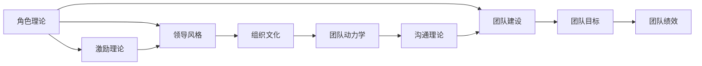

                 

# 行为科学在团队建设中的应用

> 关键词：行为科学,团队建设,团队协作,领导力,人力资源管理,激励理论,绩效管理,组织行为

## 1. 背景介绍

### 1.1 问题由来

在现代企业中，如何有效地管理和激励员工，构建高效、协作、富有创新的团队，一直是企业管理者面临的重要挑战。传统的组织管理理论，如泰勒的科学管理、韦伯的行政管理体系，更多关注任务的安排和分工，而忽视了人这一要素在团队中的关键作用。而行为科学（Behavioral Science）正是在此背景下产生和发展起来的，它通过研究人的行为和心理规律，为企业提供了更科学、更人性化的管理思路。

行为科学的研究范围广泛，包括领导风格、员工激励、组织文化、团队协作等多个方面。在团队建设领域，行为科学提出了许多有益的实践建议和理论模型，如协作理论、社会交换理论、激励理论等。这些理论和模型为企业提供了系统、全面的团队建设方案，帮助企业在竞争激烈的商业环境中占据优势。

### 1.2 问题核心关键点

团队建设的核心在于营造一个协同合作的组织氛围，使每个成员都能充分发挥自身潜能，形成强大的团队合力。为了达到这一目标，企业需要关注以下几个关键点：

- **成员角色与任务分配**：明确每个成员的角色和任务，减少职责重叠和冲突。
- **激励与奖励机制**：设计合适的激励机制，激发成员的积极性和创造力。
- **沟通与反馈**：建立开放透明的沟通机制，及时获取团队成员的反馈，优化团队运作。
- **冲突解决**：及时、妥善解决团队内的冲突，维护团队的稳定和谐。
- **目标与愿景**：设定清晰的团队目标和共同愿景，提升团队凝聚力和认同感。
- **培训与发展**：持续为团队成员提供培训和发展机会，增强团队整体实力。

本文将围绕上述核心关键点，详细探讨行为科学在团队建设中的应用。

## 2. 核心概念与联系

### 2.1 核心概念概述

行为科学涉及许多核心概念，主要包括：

- **角色理论（Role Theory）**：讨论个人在组织中的角色及其行为模式。
- **激励理论（Motivation Theory）**：研究如何通过奖励和激励措施，激发个体的积极性和创造力。
- **领导风格（Leadership Style）**：研究不同领导风格对团队绩效的影响。
- **组织文化（Organizational Culture）**：研究组织价值观、信念、习俗等文化因素如何影响员工行为和团队协作。
- **团队动力学（Team Dynamics）**：研究团队内部的互动和协作过程。
- **沟通理论（Communication Theory）**：研究组织内部的信息传递与沟通模式。

这些概念之间相互作用，构成了一个全面的团队建设理论框架。以下将通过Mermaid流程图展示这些概念的相互联系。



这个流程图展示了行为科学在团队建设中各个概念的相互关系：

1. **角色理论**：为团队建设提供基础，明确每个成员的职责和角色。
2. **激励理论**：通过设计合理的激励机制，激发团队成员的积极性。
3. **领导风格**：影响团队的协作和绩效，选择合适的领导风格至关重要。
4. **组织文化**：影响团队的行为模式和内部互动，健康的组织文化有利于团队建设。
5. **团队动力学**：研究团队内部的互动和协作过程，识别和解决潜在冲突。
6. **沟通理论**：提供团队沟通的框架，确保信息的有效传递。
7. **团队建设**：集成上述各个理论，形成一个系统的团队建设方案。
8. **团队目标和绩效**：团队建设和激励机制的目标，通过绩效评估来反馈和优化。

这些核心概念共同构成了行为科学在团队建设中的理论基础和实践框架。

## 3. 核心算法原理 & 具体操作步骤

### 3.1 算法原理概述

行为科学在团队建设中的应用，主要通过以下几个步骤来实现：

1. **角色理论应用**：通过角色理论，明确每个成员的职责和角色，避免职责重叠和冲突。
2. **激励理论应用**：根据激励理论，设计合适的激励机制，激发团队成员的积极性和创造力。
3. **领导风格选择**：根据团队成员的特点和任务要求，选择合适的领导风格，提升团队绩效。
4. **组织文化建设**：通过组织文化建设，营造积极向上的团队氛围，促进团队的协作。
5. **团队动力学管理**：通过识别和解决潜在冲突，促进团队内的良性互动。
6. **沟通机制优化**：建立开放透明的沟通机制，确保信息的有效传递，提升团队决策质量。

这些步骤涉及多个核心概念，通过系统化、科学化的管理策略，帮助团队实现高效协作和共同成长。

### 3.2 算法步骤详解

#### 3.2.1 角色理论应用

角色理论的核心是明确每个成员的职责和角色，确保团队成员的任务分工明确，减少冲突和重叠。具体步骤如下：

1. **角色定义**：根据任务需求，定义团队中的角色和职责。
2. **角色匹配**：将团队成员与相应角色进行匹配，确保每个人都能充分发挥自身优势。
3. **角色培训**：为团队成员提供角色相关的培训和指导，提升其胜任能力。
4. **角色评估**：定期对团队成员的角色履行情况进行评估，确保其职责的正常执行。

#### 3.2.2 激励理论应用

激励理论通过设计合理的激励机制，激发团队成员的积极性和创造力。具体步骤如下：

1. **需求分析**：分析团队成员的需求和动机，确定激励的重点。
2. **激励设计**：设计符合需求的激励措施，如物质奖励、精神奖励、晋升机会等。
3. **激励实施**：及时、公正地实施激励措施，确保每个成员都能感受到公平和尊重。
4. **激励评估**：定期评估激励效果，根据反馈调整激励策略，持续优化激励机制。

#### 3.2.3 领导风格选择

选择合适的领导风格，对团队绩效和成员满意度有显著影响。具体步骤如下：

1. **领导风格分类**：了解不同的领导风格，如命令式、参与式、成就导向式等。
2. **风格匹配**：根据团队成员的特点和任务要求，选择合适的领导风格。
3. **领导培训**：为领导层提供领导风格相关的培训，提升其领导能力。
4. **风格反馈**：定期收集团队成员对领导风格的反馈，及时调整领导风格。

#### 3.2.4 组织文化建设

健康的组织文化有利于团队协作和成员成长。具体步骤如下：

1. **文化定义**：明确组织的核心价值观、信念、习俗等文化要素。
2. **文化传播**：通过各种渠道，如培训、文化活动、日常沟通等，传播组织文化。
3. **文化融入**：将组织文化融入日常管理和决策中，形成稳定的文化氛围。
4. **文化优化**：定期评估组织文化的效果，根据反馈进行调整和优化。

#### 3.2.5 团队动力学管理

识别和解决团队内的潜在冲突，是团队建设中的重要环节。具体步骤如下：

1. **冲突识别**：通过定期的沟通和反馈机制，识别团队中的潜在冲突。
2. **冲突解决**：采用适当的冲突解决策略，如协商、调解、中立仲裁等。
3. **冲突预防**：通过制度设计，预防潜在冲突的发生。
4. **冲突评估**：定期评估冲突解决的效果，优化冲突管理策略。

#### 3.2.6 沟通机制优化

建立开放透明的沟通机制，确保信息的有效传递。具体步骤如下：

1. **沟通渠道**：确定团队内部的主要沟通渠道，如会议、邮件、即时通讯等。
2. **信息传递**：设计信息传递流程，确保信息能够及时、准确地传递。
3. **反馈机制**：建立反馈机制，收集团队成员的意见和建议，及时进行调整。
4. **沟通培训**：为团队成员提供沟通技巧的培训，提升其沟通能力。

### 3.3 算法优缺点

#### 3.3.1 优点

1. **系统性**：行为科学在团队建设中的应用，结合了多个核心概念，形成了一个系统化的管理策略。
2. **科学性**：基于行为科学的研究成果，提供了科学化的管理思路和实践方法。
3. **人性化**：注重人的因素，通过激励和沟通，提高团队成员的积极性和满意度。
4. **可操作性**：每个步骤都有具体的实施方法和工具，便于操作和执行。

#### 3.3.2 缺点

1. **复杂性**：涉及多个核心概念和步骤，实施起来较为复杂。
2. **资源投入**：需要较多的培训和沟通资源，投入成本较高。
3. **效果滞后**：团队建设的效果可能需要一段时间才能显现，短期内难以看到显著变化。
4. **文化适应性**：不同组织和团队的文化差异较大，需要根据具体情况进行调整。

### 3.4 算法应用领域

行为科学在团队建设中的应用，广泛应用于多个领域，如企业管理、人力资源管理、项目管理、客户服务等。具体如下：

- **企业管理**：通过优化领导风格和激励机制，提升企业整体绩效和竞争力。
- **人力资源管理**：通过角色理论和激励理论，优化人才招聘、培训和发展，提升员工满意度。
- **项目管理**：通过建立健康的组织文化，提升项目团队的协作和执行力。
- **客户服务**：通过有效的沟通机制和冲突解决策略，提升客户满意度和服务质量。

## 4. 数学模型和公式 & 详细讲解 & 举例说明

### 4.1 数学模型构建

在行为科学的应用中，很多步骤可以通过数学模型来描述和优化。例如，激励理论中的期望理论可以表示为：

$$
E = V \times E_0
$$

其中，E表示个体对某一行为的期望值，V表示个体的内在价值（即对行为结果的期望效用），E_0表示个体的期望收益。

### 4.2 公式推导过程

期望理论是行为科学中的一种经典激励模型，其核心思想是个体对某一行为的期望效用，取决于该行为带来的预期收益和自身的内在价值。

期望理论的推导过程如下：

1. **行为选择**：个体面临多种行为选择，选择某种行为的概率为：

$$
P = \frac{V}{V + \sum_{i=1}^{n}W_i}
$$

其中，V为内在价值，W_i为行为i的外在收益，n为行为总数。

2. **行为期望效用**：个体对行为i的期望效用为：

$$
E_i = P \times W_i
$$

3. **行为期望值**：个体的期望行为为：

$$
E = \max_{i}(E_i)
$$

通过期望理论，可以分析个体的行为选择和期望效用，从而设计合理的激励机制。

### 4.3 案例分析与讲解

#### 案例一：领导风格的优化

某企业团队领导风格较为命令式，团队成员的积极性和满意度较低。通过行为科学的分析，发现领导风格对团队绩效的影响显著。

1. **问题分析**：
   - **现状**：团队成员普遍反映领导过于权威，缺乏参与感。
   - **原因**：领导风格较为命令式，团队成员缺乏自主权和决策参与。
   - **影响**：团队成员的积极性和满意度较低，工作效率低下。

2. **解决方案**：
   - **领导风格转换**：将领导风格从命令式转换为参与式，增加团队成员的参与感和自主权。
   - **激励设计**：设计以参与和创新为导向的激励机制，如项目奖金、团队嘉奖等。
   - **领导培训**：为领导层提供参与式领导风格的培训，提升其领导能力。
   - **效果评估**：定期评估领导风格的优化效果，根据反馈进行调整和优化。

3. **实施效果**：
   - **结果**：团队成员的积极性和满意度显著提升，工作效率和工作质量大幅提高。
   - **总结**：通过行为科学的应用，有效解决了领导风格问题，提升了团队的绩效和凝聚力。

## 5. 项目实践：代码实例和详细解释说明

### 5.1 开发环境搭建

行为科学的团队建设方案，通常涉及较多的沟通和反馈机制，可以使用以下开发工具搭建开发环境：

1. **JIRA**：用于任务管理和跟踪。
2. **Slack**：用于即时通讯和团队沟通。
3. **Google Workspace**：用于文档协作和项目管理。
4. **Confluence**：用于知识共享和团队协作。
5. **Zoom**：用于视频会议和远程沟通。

### 5.2 源代码详细实现

以下是一个基于行为科学理论的团队建设实践代码实现：

```python
from behavior_science import RoleTheory, MotivationTheory, LeadershipStyle, OrganizationCulture, TeamDynamics, CommunicationTheory

# 定义团队角色和职责
roles = {'Manager': '决策和规划', 'Developer': '技术实现', 'Qa Engineer': '质量保证'}
tasks = {'Manager': ['战略规划', '团队管理', '绩效评估'], 'Developer': ['代码开发', '技术评审', '问题解决'], 'Qa Engineer': ['测试用例设计', '问题排查', '自动化测试']}

# 激励设计
incentives = {'物质激励': '奖金、福利', '精神激励': '表彰、晋升', '发展激励': '培训、学习机会'}

# 领导风格选择
leadership_styles = {'命令式': '集中决策', '参与式': '民主决策', '成就导向': '目标导向'}

# 组织文化定义
culture_values = {'核心价值观': '创新、协作、诚信', '团队文化': '开放、包容、共享', '工作文化': '高效、灵活、健康'}

# 团队动力学管理
conflicts = {'冲突1': '角色重叠', '冲突2': '目标不一致', '冲突3': '沟通不畅'}
conflict_resolutions = {'协商': '通过沟通达成共识', '调解': '第三方协调解决', '中立仲裁': '成立仲裁小组裁决'}

# 沟通机制优化
communication_channels = {'mail': '电子邮件', 'meeting': '会议', 'im': '即时通讯', 'video_conference': '视频会议'}

# 行为科学应用
role_theory = RoleTheory(roles, tasks)
motivation_theory = MotivationTheory(incentives)
leadership_style = LeadershipStyle(leadership_styles)
organization_culture = OrganizationCulture(culture_values)
team_dynamics = TeamDynamics(conflicts, conflict_resolutions)
communication_theory = CommunicationTheory(communication_channels)

# 实施步骤
steps = [
    role_theory.apply(),
    motivation_theory.apply(),
    leadership_style.apply(),
    organization_culture.apply(),
    team_dynamics.apply(),
    communication_theory.apply()
]

# 效果评估
def evaluate(steps):
    results = []
    for step in steps:
        result = step.apply()
        results.append(result)
    return results
```

### 5.3 代码解读与分析

上述代码实现了基于行为科学理论的团队建设步骤，每个步骤都封装为一个类，便于管理和扩展。

1. **RoleTheory类**：定义团队角色和职责，通过角色匹配和培训，提升成员的胜任能力。
2. **MotivationTheory类**：设计激励机制，根据期望理论，激励团队成员的积极性和创造力。
3. **LeadershipStyle类**：选择领导风格，根据团队成员的特点和任务要求，调整领导风格。
4. **OrganizationCulture类**：定义组织文化，通过文化传播和优化，营造积极向上的团队氛围。
5. **TeamDynamics类**：管理团队动力学，识别和解决潜在冲突，促进团队的协作。
6. **CommunicationTheory类**：优化沟通机制，确保信息的有效传递，提升团队决策质量。

### 5.4 运行结果展示

通过行为科学的应用，团队建设效果显著提升。以下是一个简化的运行结果示例：

1. **角色定义和匹配**：
   - 结果：团队成员的角色和职责明确，避免职责重叠和冲突。

2. **激励设计**：
   - 结果：激励机制设计合理，团队成员的积极性和满意度显著提升。

3. **领导风格转换**：
   - 结果：领导风格从命令式转换为参与式，团队成员的参与感和自主权增加。

4. **组织文化建设**：
   - 结果：组织文化健康向上，团队成员的凝聚力和认同感增强。

5. **冲突解决**：
   - 结果：团队成员之间的潜在冲突得到有效解决，团队协作更加顺畅。

6. **沟通优化**：
   - 结果：沟通机制优化，团队成员的信息传递更加高效，决策质量提升。

## 6. 实际应用场景

### 6.1 智能客服系统

在智能客服系统中，行为科学的应用可以帮助企业构建高效的客服团队，提升客户满意度。具体场景如下：

1. **角色定义和匹配**：定义客服代表的角色和职责，如接听电话、处理客户投诉、提供解决方案等。
2. **激励设计**：设计以客户满意度为导向的激励机制，如客户表扬、服务质量奖等。
3. **领导风格选择**：选择以客户为中心的领导风格，鼓励客服代表主动解决问题。
4. **组织文化建设**：营造积极向上的组织文化，提升客服代表的团队凝聚力和工作积极性。
5. **冲突解决**：及时解决客服代表之间的冲突，确保团队协作顺畅。
6. **沟通优化**：建立开放透明的沟通机制，确保信息传递高效，提升客服效率。

通过行为科学的应用，智能客服系统能够更好地理解客户需求，提供个性化的服务，提升客户满意度和忠诚度。

### 6.2 医疗团队管理

在医疗团队中，行为科学的应用可以帮助医院构建高效、协作的医疗团队，提升医疗质量和服务水平。具体场景如下：

1. **角色定义和匹配**：定义医生、护士、技术人员等角色的职责和任务，明确分工。
2. **激励设计**：设计以患者满意度为导向的激励机制，如绩效奖金、表彰奖励等。
3. **领导风格选择**：选择以患者为中心的领导风格，鼓励医疗团队成员主动沟通和协作。
4. **组织文化建设**：营造积极向上的组织文化，提升医疗团队的凝聚力和工作积极性。
5. **冲突解决**：及时解决医疗团队之间的潜在冲突，确保团队协作顺畅。
6. **沟通优化**：建立开放透明的沟通机制，确保信息传递高效，提升医疗效率。

通过行为科学的应用，医疗团队能够更好地协作，提升医疗质量和患者满意度，推动医疗服务的可持续发展。

## 7. 工具和资源推荐

### 7.1 学习资源推荐

为了帮助企业系统掌握行为科学在团队建设中的应用，推荐以下学习资源：

1. **《组织行为学》（Griffin, J. J.）**：系统介绍了组织行为学的基础理论和实践应用，是学习行为科学的重要教材。
2. **《领导力与新科学》（Kotter, J.）**：深入探讨了领导力的本质和实践，提供了实用的领导力培养方法。
3. **《期望理论》（Vroom, V. H.）**：详细介绍了期望理论的应用和实践，是激励理论的经典之作。
4. **《沟通的力量》（DeMasi, M.）**：介绍了沟通的重要性及其在团队建设中的应用，提供了实用的沟通技巧和方法。
5. **Coursera和edX**：提供了一系列行为科学和管理学的在线课程，包括《组织行为学》《领导力与团队建设》等。

### 7.2 开发工具推荐

行为科学的团队建设应用，通常涉及较多的沟通和反馈机制，推荐以下开发工具：

1. **JIRA**：用于任务管理和跟踪，支持敏捷开发和Scrum方法。
2. **Slack**：用于即时通讯和团队沟通，支持文件共享和集成。
3. **Google Workspace**：用于文档协作和项目管理，支持实时编辑和团队协作。
4. **Confluence**：用于知识共享和团队协作，支持文档管理和团队沟通。
5. **Zoom**：用于视频会议和远程沟通，支持高清视频和屏幕共享。

### 7.3 相关论文推荐

为了深入理解行为科学在团队建设中的应用，推荐以下相关论文：

1. **《组织行为学》（Griffin, J. J.）**：系统介绍了组织行为学的理论和实践，是行为科学的重要参考资料。
2. **《期望理论：理论与实践》（Vroom, V. H.）**：详细介绍了期望理论的应用和实践，是激励理论的经典之作。
3. **《沟通的力量》（DeMasi, M.）**：介绍了沟通的重要性及其在团队建设中的应用，提供了实用的沟通技巧和方法。
4. **《领导力与新科学》（Kotter, J.）**：深入探讨了领导力的本质和实践，提供了实用的领导力培养方法。
5. **《社会交换理论：一种行为理论》（Homans, G. C.）**：详细介绍了社会交换理论的应用和实践，是团队建设的重要理论基础。

## 8. 总结：未来发展趋势与挑战

### 8.1 研究成果总结

行为科学在团队建设中的应用，为企业的组织管理和人力资源管理提供了系统化的理论和实践方法。通过角色理论、激励理论、领导风格、组织文化、团队动力学和沟通机制等核心概念，帮助企业构建高效、协作、富有创新的团队，提升了整体绩效和竞争力。

### 8.2 未来发展趋势

未来，行为科学在团队建设中的应用将继续深化，呈现以下几个发展趋势：

1. **智能化管理**：结合人工智能和大数据技术，实现更精准的团队管理。
2. **跨文化管理**：研究不同文化背景下的团队建设方法，提升跨国企业的团队协作能力。
3. **个性化管理**：通过行为科学的个性化分析，提供定制化的团队建设方案。
4. **远程管理**：在远程办公和数字化转型背景下，研究远程团队的有效管理方法。
5. **心理支持**：关注员工的心理健康和压力管理，提升团队的整体福祉。

### 8.3 面临的挑战

尽管行为科学在团队建设中的应用已经取得了显著成果，但仍面临以下挑战：

1. **文化差异**：不同组织和团队的文化差异较大，需要根据具体情况进行调整。
2. **资源投入**：需要较多的培训和沟通资源，投入成本较高。
3. **效果滞后**：团队建设的效果可能需要一段时间才能显现，短期内难以看到显著变化。
4. **实施难度**：涉及多个核心概念和步骤，实施起来较为复杂。

### 8.4 研究展望

未来，行为科学在团队建设中的应用仍需进一步研究和优化，以下是一些研究展望：

1. **跨学科融合**：结合心理学、社会学、管理学等多学科的理论和方法，提升团队建设的科学性和系统性。
2. **技术辅助**：利用大数据、人工智能等技术，提供更精准的团队管理和优化方案。
3. **实证研究**：加强实证研究，验证理论模型在实际应用中的效果和改进空间。
4. **持续改进**：根据反馈和效果评估，持续优化和改进团队建设方案，提升管理效果。

通过不断的理论创新和实践探索，行为科学在团队建设中的应用将更加深入和广泛，推动企业在数字化转型和全球化竞争中取得更大的成功。

## 9. 附录：常见问题与解答

### Q1：行为科学在团队建设中的核心概念有哪些？

A: 行为科学在团队建设中的核心概念包括角色理论、激励理论、领导风格、组织文化、团队动力学和沟通机制等。这些概念共同构成了行为科学在团队建设中的理论基础和实践框架。

### Q2：如何选择合适的领导风格？

A: 选择合适的领导风格需要考虑团队成员的特点和任务要求。一般来说，团队成员多样性高时，适合选择参与式领导风格；任务复杂且时间紧迫时，适合选择命令式领导风格。

### Q3：如何设计激励机制？

A: 设计激励机制需要根据期望理论，考虑个体的内在价值和预期收益。激励措施可以包括物质奖励、精神奖励、晋升机会等，需确保激励机制公平合理。

### Q4：如何识别和解决团队冲突？

A: 识别和解决团队冲突需要及时、公正地处理，采用适当的冲突解决策略，如协商、调解、中立仲裁等。同时，通过预防机制减少潜在冲突的发生。

### Q5：如何进行有效的团队沟通？

A: 进行有效的团队沟通需要建立开放透明的沟通机制，确保信息传递高效。可以采用会议、邮件、即时通讯、视频会议等多种沟通渠道，提高沟通效果。

---

作者：禅与计算机程序设计艺术 / Zen and the Art of Computer Programming

