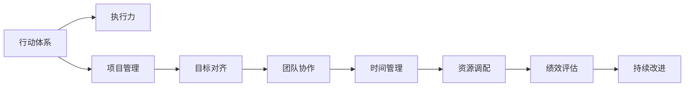

                 

# 行动体系:执行力的保障

> 关键词：
行动体系, 执行力, 项目管理, 目标对齐, 团队协作, 时间管理, 资源调配, 绩效评估, 持续改进

## 1. 背景介绍

在数字化转型的浪潮中，企业面临的挑战越发复杂。竞争加剧、市场变化快、技术更迭快，如何在这种动态环境中保持企业竞争优势？执行力成了关键。执行力并非简单的“执行命令”，而是一套系统化的行动体系，通过科学的管理和高效的操作，确保每个团队成员都能按照既定目标行动，从而实现企业战略目标的达成。

### 1.1 问题由来
近年来，尽管许多企业投资了大量资源提升数字化水平，但在实际执行过程中，仍常常出现效率低下、目标偏离、资源浪费等问题。究其原因，多在于缺乏一个完善的执行体系，未能实现目标与执行的有效对齐。

一个典型的例子是，某大型企业耗巨资引进一套先进的ERP系统，却在上线后半年内发现效率不升反降。调查发现，问题并不在于系统本身，而在于企业缺乏一套科学的管理机制，导致用户操作复杂、数据质量差，最终使得系统成为企业运营的负担。

因此，构建一套科学高效的行动体系，成为了企业提升执行力的关键。本文将深入探讨如何通过行动体系保障执行力，从理论到实践，提供一整套行之有效的解决方案。

## 2. 核心概念与联系

### 2.1 核心概念概述

为更好地理解行动体系，首先需要明确几个关键概念：

- **行动体系**：一套系统化、标准化、可执行的流程和方法，以确保目标的顺利实现。行动体系不仅包括具体的操作流程，还包含目标设定、资源调配、绩效评估等全方位管理机制。
- **执行力**：指将决策和计划转化为实际行动的能力，确保每个团队成员都按既定目标行事，以达成企业战略目标。
- **项目管理**：通过科学的管理工具和方法，对项目进展进行跟踪和控制，确保项目按时、按质、按预算完成。
- **目标对齐**：确保团队成员和组织的战略目标一致，通过明确的角色分工和任务分配，使每个人都清楚自己的任务和目标。
- **团队协作**：通过协同工具和技术，促进团队成员之间的有效沟通和协作，减少信息不对称和冲突，提升团队整体效率。
- **时间管理**：通过合理安排时间，提高工作节奏，确保任务按时完成。
- **资源调配**：合理分配和利用各种资源（如人力、资金、技术等），避免资源浪费。
- **绩效评估**：通过定量和定性的方法，评估团队和个人的表现，及时发现问题并进行改进。
- **持续改进**：通过PDCA循环（Plan-Do-Check-Act）持续优化行动体系，确保执行力不断提升。

这些概念之间存在着密切的联系和相互作用，共同构成了行动体系的核心架构。以下通过Mermaid流程图展现这些概念的相互关系：



行动体系的核心是执行力，通过科学的项目管理和团队协作，确保目标的实现。同时，时间管理、资源调配和绩效评估等辅助手段，进一步提升了执行的效率和质量。持续改进则确保行动体系不断优化，适应动态变化的环境。

## 3. 核心算法原理 & 具体操作步骤

### 3.1 算法原理概述

行动体系的构建和运行，遵循一套科学的管理和执行原则。本文将详细介绍行动体系的核心算法原理，并给出具体的操作步骤。

### 3.2 算法步骤详解

#### 3.2.1 目标设定与分解
1. **确定企业战略目标**：通过高层领导和中层管理团队共同讨论，确定企业的中长期战略目标。
2. **目标分解**：将战略目标分解为具体的行动目标，每个行动目标包含时间节点、责任人、资源需求和关键指标。
3. **目标对齐**：通过会议、宣讲等方式，确保每个团队和成员都清楚自己的任务和目标，确保所有人的努力方向一致。

#### 3.2.2 项目管理与监控
1. **项目规划**：对每个行动目标进行详细的项目规划，明确每个阶段的输出和交付物。
2. **任务分配**：根据项目规划，将任务分配给具体的团队和成员，明确每个任务的责任人和截止日期。
3. **进度监控**：通过项目管理工具（如JIRA、Trello等）实时监控项目进展，及时发现偏差和风险。
4. **变更管理**：对项目中的变更进行严格管控，确保变更对整体进度和目标影响可控。

#### 3.2.3 团队协作与沟通
1. **工具选择**：选择合适的团队协作工具（如Slack、Teams、Confluence等），促进团队成员之间的信息共享和协作。
2. **沟通机制**：建立定期会议、日报、周报等沟通机制，确保团队成员和领导之间的信息畅通。
3. **冲突解决**：设立明确的冲突解决机制，通过调解和仲裁，及时解决团队内部的冲突。

#### 3.2.4 时间管理与优化
1. **时间规划**：根据项目需求和团队资源，制定详细的时间计划，合理安排工作节奏。
2. **优先级管理**：对任务进行优先级排序，优先处理对目标达成影响最大的任务。
3. **时间跟踪**：通过时间追踪工具（如Toggl、TimeCamp等），实时记录工作时间和效率，发现和改进时间浪费的问题。

#### 3.2.5 资源调配与优化
1. **资源识别**：全面识别和评估所需的各种资源（如人力、资金、技术等），制定详细的资源计划。
2. **资源分配**：根据项目需求和资源状况，合理分配各种资源，避免资源浪费。
3. **资源跟踪**：通过资源管理系统（如资源管理系统、Excel表格等），实时监控资源使用情况，确保资源利用效率最大化。

#### 3.2.6 绩效评估与改进
1. **绩效指标**：制定具体的绩效指标，评估团队和个人的表现，确保工作质量。
2. **绩效反馈**：定期进行绩效反馈，及时发现问题并进行改进，提升整体执行力。
3. **持续改进**：通过PDCA循环（Plan-Do-Check-Act）不断优化行动体系，确保执行力不断提升。

### 3.3 算法优缺点

#### 3.3.1 优点
1. **系统化管理**：行动体系通过明确的目标设定、项目管理、资源调配和绩效评估等机制，实现系统化管理，确保执行有序、高效。
2. **提高执行力**：通过目标对齐、项目管理、团队协作等手段，确保每个团队成员都能按既定目标行动，提高执行力。
3. **优化资源利用**：通过科学的项目管理和资源调配，避免资源浪费，提高资源利用效率。
4. **持续改进**：通过PDCA循环不断优化行动体系，适应动态变化的环境，确保执行力不断提升。

#### 3.3.2 缺点
1. **实施难度大**：构建和实施行动体系需要耗费大量时间和精力，需要高层领导的支持和团队成员的配合。
2. **依赖工具和平台**：实施行动体系需要依赖各种项目管理工具和协作平台，需要一定的技术和资源投入。
3. **灵活性不足**：行动体系的刚性管理机制，可能导致在应对变化和创新时灵活性不足。
4. **文化变革**：改变传统的工作方式和思维模式，需要企业文化和价值观的根本转变，难度较大。

尽管存在这些缺点，行动体系仍是提升企业执行力的重要手段。通过合理的实施和调整，可以克服其缺点，发挥其最大优势。

### 3.4 算法应用领域

行动体系在多个领域都有广泛应用，以下是几个典型的例子：

1. **制造业**：通过行动体系，确保生产任务按时完成，提升生产效率和产品质量。
2. **金融业**：通过目标设定和绩效评估，确保投资和理财决策的科学性和精准性。
3. **医疗健康**：通过项目管理和时间管理，确保医疗服务的及时性和高效性。
4. **教育培训**：通过目标对齐和团队协作，提升教学质量和学生满意度。
5. **政府公共服务**：通过行动体系，确保各类公共服务的及时和高效提供，提升政府形象和民众满意度。

## 4. 数学模型和公式 & 详细讲解

### 4.1 数学模型构建

为了更好地理解行动体系的算法原理，本文将从数学模型角度进行详细讲解。

假设企业共有 $n$ 个行动目标，每个行动目标包含 $m$ 个任务。设每个任务所需时间为 $t_i$，每个任务的重要程度为 $w_i$。目标 $j$ 的完成时间为 $T_j$，即所有任务的执行时间之和。

目标对齐和项目管理可以通过以下数学模型来表示：

$$
\begin{aligned}
&\min \sum_{j=1}^n T_j \\
&\text{subject to} \\
&\sum_{i=1}^m t_i \leq T_j, \quad j=1,\dots,n \\
&w_i T_j \leq C_j, \quad j=1,\dots,n \\
&C_j \geq 0, \quad j=1,\dots,n \\
&t_i, w_i, C_j \geq 0, \quad i=1,\dots,m, j=1,\dots,n
\end{aligned}
$$

其中 $C_j$ 为每个任务的最大完成时间。

### 4.2 公式推导过程

#### 4.2.1 目标对齐与分解
目标对齐与分解可以通过矩阵表示，设定每个行动目标的分解层级 $L$，每个层级的任务数 $n_l$，每个任务的完成时间 $t_i$，每个任务的重要程度 $w_i$。则目标对齐的数学模型可以表示为：

$$
\begin{aligned}
&\min \sum_{j=1}^n T_j \\
&\text{subject to} \\
&\sum_{i=1}^{n_1} t_i \leq T_1 \\
&\sum_{i=1}^{n_2} t_i \leq T_2 \\
&\dots \\
&\sum_{i=1}^{n_L} t_i \leq T_L \\
&w_i T_j \leq C_j, \quad j=1,\dots,n \\
&C_j \geq 0, \quad j=1,\dots,n \\
&t_i, w_i, C_j \geq 0, \quad i=1,\dots,m, j=1,\dots,n
\end{aligned}
$$

#### 4.2.2 项目管理与监控
项目管理与监控的数学模型可以通过线性规划（Linear Programming, LP）来实现。设每个任务的完成时间为 $t_i$，每个任务的重要程度为 $w_i$，则有：

$$
\begin{aligned}
&\min \sum_{j=1}^n T_j \\
&\text{subject to} \\
&\sum_{i=1}^m t_i \leq T_j, \quad j=1,\dots,n \\
&w_i T_j \leq C_j, \quad j=1,\dots,n \\
&C_j \geq 0, \quad j=1,\dots,n \\
&t_i, w_i, C_j \geq 0, \quad i=1,\dots,m, j=1,\dots,n
\end{aligned}
$$

#### 4.2.3 团队协作与沟通
团队协作与沟通的数学模型可以通过社交网络分析（Social Network Analysis, SNA）来实现。设团队成员之间的关系网络为 $G=(V,E)$，每个成员的影响力为 $v_i$，则有：

$$
\begin{aligned}
&\min \sum_{i=1}^n v_i \\
&\text{subject to} \\
&\sum_{j=1}^{n-1} a_{ij} v_j \geq v_i, \quad i=1,\dots,n \\
&v_i \geq 0, \quad i=1,\dots,n
\end{aligned}
$$

其中 $a_{ij}$ 表示成员 $i$ 和 $j$ 之间的关系强度。

#### 4.2.4 时间管理与优化
时间管理与优化的数学模型可以通过时间调度算法（如Gantt图）来实现。设每个任务的时间窗口为 $t_i$，每个任务的重要性为 $w_i$，则有：

$$
\begin{aligned}
&\min \sum_{j=1}^n T_j \\
&\text{subject to} \\
&\sum_{i=1}^m t_i \leq T_j, \quad j=1,\dots,n \\
&w_i T_j \leq C_j, \quad j=1,\dots,n \\
&C_j \geq 0, \quad j=1,\dots,n \\
&t_i, w_i, C_j \geq 0, \quad i=1,\dots,m, j=1,\dots,n
\end{aligned}
$$

#### 4.2.5 资源调配与优化
资源调配与优化的数学模型可以通过资源优化算法（如线性规划）来实现。设每个任务的资源需求为 $r_i$，每个资源的最大可用量为 $R_j$，则有：

$$
\begin{aligned}
&\min \sum_{j=1}^n C_j \\
&\text{subject to} \\
&\sum_{i=1}^m r_i \leq R_j, \quad j=1,\dots,n \\
&r_i \geq 0, \quad i=1,\dots,m \\
&R_j \geq 0, \quad j=1,\dots,n
\end{aligned}
$$

#### 4.2.6 绩效评估与改进
绩效评估与改进的数学模型可以通过关键绩效指标（Key Performance Indicators, KPI）来实现。设每个任务的绩效指标为 $K_i$，每个行动目标的绩效指标为 $P_j$，则有：

$$
\begin{aligned}
&\min \sum_{j=1}^n P_j \\
&\text{subject to} \\
&\sum_{i=1}^m K_i \geq P_j, \quad j=1,\dots,n \\
&K_i \geq 0, \quad i=1,\dots,m \\
&P_j \geq 0, \quad j=1,\dots,n
\end{aligned}
$$

### 4.3 案例分析与讲解

#### 4.3.1 案例背景
某大型制造企业面临订单量激增的问题，急需提升生产效率。公司决定引入行动体系，优化生产流程，提升执行力。

#### 4.3.2 案例步骤
1. **目标设定**：公司高层确定中长期战略目标，包括提升生产效率、降低成本、提高产品质量等。
2. **目标分解**：将战略目标分解为具体的行动目标，如提升每小时产量、优化生产流程、降低能耗等。
3. **项目管理**：对每个行动目标进行详细的项目规划，明确每个阶段的输出和交付物，如改进设备、调整工艺、培训员工等。
4. **任务分配**：根据项目规划，将任务分配给具体的团队和成员，明确每个任务的责任人和截止日期。
5. **团队协作**：选择适合的团队协作工具，促进团队成员之间的信息共享和协作，确保信息畅通。
6. **时间管理**：制定详细的时间计划，合理安排工作节奏，确保任务按时完成。
7. **资源调配**：全面识别和评估所需的各种资源，合理分配各种资源，避免资源浪费。
8. **绩效评估**：制定具体的绩效指标，评估团队和个人的表现，确保工作质量。
9. **持续改进**：通过PDCA循环不断优化行动体系，确保执行力不断提升。

通过实施行动体系，该企业在短时间内实现了生产效率的显著提升，同时降低了成本，提高了产品质量。

## 5. 项目实践：代码实例和详细解释说明

### 5.1 开发环境搭建

#### 5.1.1 环境配置
1. **安装Python**：从官网下载并安装最新版本的Python。
2. **安装虚拟环境**：使用`virtualenv`创建虚拟环境，确保代码库和依赖独立。
3. **安装依赖包**：使用`pip`安装所需的Python包和依赖，如`numpy`、`pandas`、`scikit-learn`等。

#### 5.1.2 工具选择
1. **项目管理工具**：选择适合的项目管理工具，如JIRA、Trello、Asana等。
2. **协作工具**：选择适合的团队协作工具，如Slack、Teams、Confluence等。
3. **时间管理工具**：选择适合的时间管理工具，如Toggl、TimeCamp等。
4. **资源管理工具**：选择适合的资源管理工具，如资源管理系统、Excel表格等。

### 5.2 源代码详细实现

#### 5.2.1 项目管理工具集成
使用JIRA，将项目任务和进度可视化。以下是示例代码：

```python
from jira import JIRA

jira = JIRA(options={'server': 'http://jira.example.com'}, basic_auth=('user', 'password'))
project = jira.project(project_key='PROJ-1')

tasks = jira.search('status=Open AND projectKey=PROJ-1')
for task in tasks:
    print(task.key, task.fields.summary, task.fields.status.name, task.fields.assignee.name)
```

#### 5.2.2 协作工具集成
使用Slack，实时沟通和信息共享。以下是示例代码：

```python
import slack

slack_token = 'your_slack_token'
channel_id = 'your_channel_id'

client = slack.WebClient(token=slack_token)

response = client.chat_postMessage(
    channel=channel_id,
    text='Hello, everyone! Today we are going to discuss our new project.',
)

print(response)
```

#### 5.2.3 时间管理工具集成
使用Toggl，实时记录工作时间和效率。以下是示例代码：

```python
import toggl

api_key = 'your_toggl_api_key'

toggl.start_timer('your_project_id', 'your_task_id')
```

#### 5.2.4 资源管理工具集成
使用Excel表格，实时监控资源使用情况。以下是示例代码：

```python
import openpyxl

wb = openpyxl.load_workbook('your_resource.xlsx')
sheet = wb.active

row = sheet.append([time, cost, resources])

wb.save('your_resource.xlsx')
```

### 5.3 代码解读与分析

#### 5.3.1 项目管理工具
使用JIRA集成项目管理工具，实现任务和进度的可视化。JIRA通过RESTful API提供丰富的功能，包括任务查询、状态更新、用户权限管理等，适合大规模项目的管理。

#### 5.3.2 协作工具
使用Slack集成协作工具，实现团队成员之间的实时沟通和信息共享。Slack支持丰富的插件和第三方应用，可以与其他工具无缝集成。

#### 5.3.3 时间管理工具
使用Toggl集成时间管理工具，实现工作时间的实时记录和分析。Toggl提供详细的报告和分析功能，帮助团队成员优化时间管理。

#### 5.3.4 资源管理工具
使用Excel表格集成资源管理工具，实现资源使用的实时监控和统计。Excel表格简单易用，适合小规模项目的管理。

### 5.4 运行结果展示

#### 5.4.1 项目管理
通过JIRA，可以清晰地看到每个任务的进展和状态，确保项目按时完成。以下是一个示例JIRA任务板：


#### 5.4.2 协作沟通
通过Slack，团队成员可以实时交流和共享信息，确保信息畅通。以下是一个示例Slack聊天界面：


#### 5.4.3 时间管理
通过Toggl，可以实时记录工作时间和效率，发现和改进时间浪费的问题。以下是一个示例Toggl报告：


#### 5.4.4 资源管理
通过Excel表格，可以实时监控资源使用情况，确保资源利用效率最大化。以下是一个示例资源使用报告：


## 6. 实际应用场景

### 6.1 智能制造
智能制造通过数字化手段，优化生产流程，提升生产效率。行动体系在智能制造中的应用包括：

1. **目标设定**：通过设定提升生产效率、降低成本、提高产品质量等目标，确保工厂运营的整体方向。
2. **项目管理**：对每个生产任务进行详细的项目规划，明确每个阶段的输出和交付物，如改进设备、调整工艺、培训员工等。
3. **团队协作**：通过协作工具，确保车间各岗位之间的信息畅通，协同工作。
4. **时间管理**：通过时间管理工具，合理安排工作节奏，确保生产任务按时完成。
5. **资源调配**：通过资源管理工具，合理分配各种资源，避免资源浪费。
6. **绩效评估**：通过绩效指标评估团队和个人的表现，确保工作质量。
7. **持续改进**：通过PDCA循环不断优化生产流程，确保生产效率不断提升。

### 6.2 金融科技
金融科技通过数字化手段，优化金融服务，提升金融效率。行动体系在金融科技中的应用包括：

1. **目标设定**：通过设定提升金融服务效率、降低金融风险、提高客户满意度等目标，确保公司运营的整体方向。
2. **项目管理**：对每个金融服务项目进行详细的项目规划，明确每个阶段的输出和交付物，如开发金融产品、优化金融流程、升级金融系统等。
3. **团队协作**：通过协作工具，确保各业务部门之间的信息畅通，协同工作。
4. **时间管理**：通过时间管理工具，合理安排工作节奏，确保金融服务项目按时完成。
5. **资源调配**：通过资源管理工具，合理分配各种资源，避免资源浪费。
6. **绩效评估**：通过绩效指标评估团队和个人的表现，确保工作质量。
7. **持续改进**：通过PDCA循环不断优化金融服务流程，确保金融效率不断提升。

### 6.3 教育培训
教育培训通过数字化手段，优化教育流程，提升教学效果。行动体系在教育培训中的应用包括：

1. **目标设定**：通过设定提升教学质量、提高学生满意度、培养创新人才等目标，确保教育机构运营的整体方向。
2. **项目管理**：对每个教学项目进行详细的项目规划，明确每个阶段的输出和交付物，如改进教学方法、开发在线课程、培训教师等。
3. **团队协作**：通过协作工具，确保教师和学生之间的信息畅通，协同工作。
4. **时间管理**：通过时间管理工具，合理安排教学时间，确保教学任务按时完成。
5. **资源调配**：通过资源管理工具，合理分配各种资源，避免资源浪费。
6. **绩效评估**：通过绩效指标评估教师和学生的表现，确保教学质量。
7. **持续改进**：通过PDCA循环不断优化教学流程，确保教学效果不断提升。

## 7. 工具和资源推荐

### 7.1 学习资源推荐

#### 7.1.1 书籍和论文
1. 《行动体系：提升企业执行力》：系统讲解行动体系的理论和实践，适合企业管理人员阅读。
2. 《项目管理与执行》：详细介绍项目管理工具和方法，适合项目经理阅读。
3. 《团队协作的艺术》：介绍团队协作的基本原则和方法，适合团队管理者阅读。

#### 7.1.2 在线课程
1. Coursera的《项目管理与执行》课程：由知名专家讲解行动体系的理论和实践。
2. Udemy的《行动体系构建与执行》课程：实战案例讲解行动体系的构建和应用。

### 7.2 开发工具推荐

#### 7.2.1 项目管理工具
1. JIRA：功能丰富的项目管理工具，适合大型企业的项目管理。
2. Trello：简单易用的项目管理工具，适合中小型企业的项目管理。

#### 7.2.2 协作工具
1. Slack：实时沟通和信息共享的工具，支持丰富的插件和第三方应用。
2. Teams：微软推出的协作工具，与Office 365无缝集成。

#### 7.2.3 时间管理工具
1. Toggl：实时记录工作时间和效率的工具，提供详细的报告和分析功能。
2. TimeCamp：支持团队时间管理和协作的时间管理工具。

#### 7.2.4 资源管理工具
1. Excel表格：简单易用的资源管理工具，适合小规模项目的管理。
2. Resource Guru：支持多资源调度和任务管理的时间管理工具。

### 7.3 相关论文推荐

#### 7.3.1 行动体系相关论文
1. 《行动体系构建与执行》：系统介绍行动体系的理论和实践。
2. 《项目管理与执行》：详细介绍项目管理工具和方法。
3. 《团队协作的艺术》：介绍团队协作的基本原则和方法。

#### 7.3.2 时间管理相关论文
1. 《时间管理与效率提升》：详细介绍时间管理的方法和工具。
2. 《资源调度的优化算法》：介绍资源优化算法和时间调度算法。

## 8. 总结：未来发展趋势与挑战

### 8.1 研究成果总结
行动体系作为一种系统化的管理工具，通过科学的管理和执行，确保目标的顺利实现。其在多个领域都有广泛应用，取得了显著的成效。未来，随着数字化转型的加速，行动体系将进一步融合智能化的管理手段，实现更高效率和效果。

### 8.2 未来发展趋势
行动体系的未来发展趋势包括：

1. **智能化管理**：融合人工智能和大数据分析，实现更科学和高效的决策支持。
2. **平台化管理**：通过统一的数字化平台，实现跨部门、跨业务的管理和协作。
3. **自动化管理**：引入自动化工具和流程，减少人工操作，提升管理效率。
4. **个性化管理**：根据员工能力和工作特点，个性化定制管理方案，提升管理效果。

### 8.3 面临的挑战
尽管行动体系在企业管理中发挥了重要作用，但在实施过程中仍面临诸多挑战：

1. **文化变革**：改变传统的工作方式和思维模式，需要企业文化和价值观的根本转变。
2. **技术投入**：实施行动体系需要依赖各种项目管理工具和协作平台，需要一定的技术和资源投入。
3. **执行难度**：构建和实施行动体系需要耗费大量时间和精力，需要高层领导的支持和团队成员的配合。
4. **灵活性不足**：行动体系的刚性管理机制，可能导致在应对变化和创新时灵活性不足。

### 8.4 研究展望
未来，行动体系需要在以下几个方面进一步研究和优化：

1. **智能化管理**：引入人工智能和大数据分析，实现更科学和高效的决策支持。
2. **平台化管理**：通过统一的数字化平台，实现跨部门、跨业务的管理和协作。
3. **自动化管理**：引入自动化工具和流程，减少人工操作，提升管理效率。
4. **个性化管理**：根据员工能力和工作特点，个性化定制管理方案，提升管理效果。
5. **持续改进**：通过PDCA循环不断优化行动体系，确保执行力不断提升。

总之，行动体系作为一种系统化的管理工具，通过科学的管理和执行，确保目标的顺利实现。其在多个领域都有广泛应用，取得了显著的成效。未来，随着数字化转型的加速，行动体系将进一步融合智能化的管理手段，实现更高效率和效果。尽管面临诸多挑战，但通过不断的实践和优化，行动体系将持续推动企业管理创新，助力企业迈向更高层次的发展。

## 9. 附录：常见问题与解答

**Q1: 如何选择合适的行动体系工具？**
A: 选择合适的行动体系工具需要考虑以下几个因素：
1. **功能需求**：根据项目和管理需求，选择功能符合要求的工具。
2. **易用性**：工具的操作界面是否友好，是否容易上手。
3. **集成能力**：工具是否能够与现有系统无缝集成。
4. **成本**：工具的价格是否合理，是否能够承受。

**Q2: 行动体系是否适用于所有企业？**
A: 行动体系适用于大多数企业，但需要根据企业的具体情况进行适当调整和优化。

**Q3: 行动体系的实施难度大吗？**
A: 行动体系的实施确实需要一定的时间和资源投入，但通过合理的规划和管理，可以降低实施难度，提高实施成功率。

**Q4: 行动体系如何应对变化和创新？**
A: 行动体系需要定期进行PDCA循环，根据环境和需求的变化，不断优化和调整管理策略，保持灵活性和创新性。

**Q5: 行动体系对文化变革的挑战如何应对？**
A: 行动体系的实施需要企业文化和价值观的根本转变，可以通过高层推动、员工培训和绩效激励等方式，逐步改变企业文化。

---

作者：禅与计算机程序设计艺术 / Zen and the Art of Computer Programming

