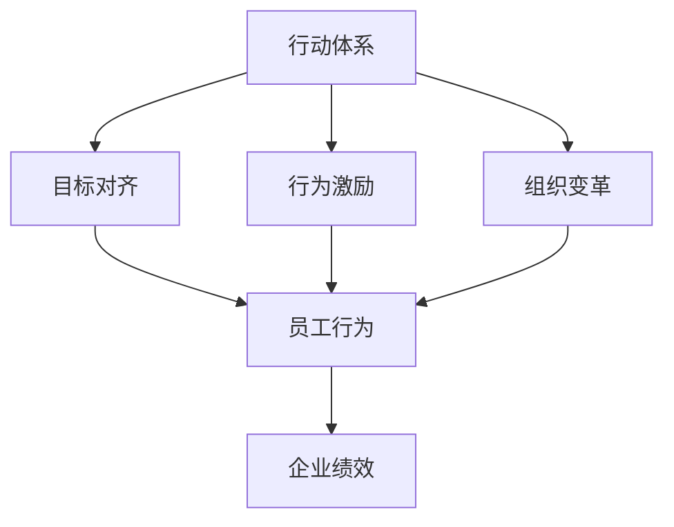

                 

# 行动体系：决定管理者的天花板

> 关键词：行动体系, 决策框架, 目标对齐, 行为激励, 组织变革, 管理提升

## 1. 背景介绍

### 1.1 问题由来
在当前复杂多变的外部环境中，企业如何高效、准确地进行决策，提升管理水平和执行力，已成为各界关注的热点。然而，传统管理理论和方法往往局限于个别领域的优化，难以应对全面、系统的管理需求。管理者的能力瓶颈，也成为制约企业成长的天花板。

面对这一挑战，本文将探讨一种系统的管理决策框架——“行动体系”，通过构建目标对齐、行为激励、组织变革等多维度的管理机制，帮助管理者摆脱“智障”，提高决策力和执行力。

### 1.2 问题核心关键点
管理者通常面临以下核心问题：

- **目标模糊**：企业目标与个体目标的错位，导致执行力低下。
- **激励不足**：缺乏有效的激励机制，员工工作积极性不高。
- **信息不对称**：信息流通不畅，导致决策错误。
- **组织僵化**：组织结构过于固化，难以适应快速变化的市场环境。

行动体系旨在解决这些问题，通过系统化的管理方法，使管理者能够更高效地实现企业目标。

## 2. 核心概念与联系

### 2.1 核心概念概述

为更好地理解行动体系，本节将介绍几个核心概念：

- **行动体系**：一种系统的管理决策框架，通过构建目标对齐、行为激励、组织变革等多维度的管理机制，提升企业管理水平和执行力。
- **目标对齐**：使企业目标与个体目标一致，确保各个层级对公司战略有明确理解和执行力。
- **行为激励**：通过设计激励机制，激发员工的工作积极性和创造性，提升整体绩效。
- **组织变革**：对组织结构、流程、文化进行优化，增强组织的灵活性和适应性。
- **系统优化**：通过整体系统的优化，实现各部分功能的协同，提升管理效率。

这些核心概念之间的逻辑关系可以通过以下Mermaid流程图来展示：



这个流程图展示行动体系的核心概念及其之间的关系：

1. 行动体系通过目标对齐、行为激励、组织变革等多维度的管理机制，使企业目标与个体目标一致，提升员工工作积极性，增强组织灵活性。
2. 目标对齐是行动体系的基础，确保每个层级对公司战略有明确理解和执行力。
3. 行为激励通过设计有效的激励机制，激发员工的工作积极性，提升整体绩效。
4. 组织变革对组织结构、流程、文化进行优化，增强组织的灵活性和适应性。
5. 系统优化通过整体系统的优化，实现各部分功能的协同，提升管理效率。

这些概念共同构成了行动体系的框架，帮助管理者在复杂的决策环境中，做出高效、准确的决策。

## 3. 核心算法原理 & 具体操作步骤
### 3.1 算法原理概述

行动体系的核心在于通过系统化的方法，构建目标对齐、行为激励、组织变革等多维度的管理机制，以提升企业管理水平和执行力。其核心思想是通过以下步骤：

1. **目标对齐**：明确企业愿景、使命和战略目标，通过自上而下的目标分解，确保各个层级对公司战略有明确的理解和执行力。
2. **行为激励**：设计合理的激励机制，激发员工的工作积极性，提升整体绩效。
3. **组织变革**：对组织结构、流程、文化进行优化，增强组织的灵活性和适应性。
4. **系统优化**：通过整体系统的优化，实现各部分功能的协同，提升管理效率。

行动体系的构建，遵循SMART原则，即目标应具备具体的(Specific)、可衡量的(Measurable)、可实现的(Achievable)、相关的(Relevant)、时限的(Time-bound)特征。通过系统化的管理方法，使企业管理者能够摆脱“智障”，做出更高效、更准确的决策。

### 3.2 算法步骤详解

行动体系的构建分为四个主要步骤：

**Step 1: 目标对齐**

1. **明确企业愿景、使命和战略目标**：通过企业高层与各层级管理人员的沟通，明确企业愿景、使命和战略目标。
2. **自上而下目标分解**：将企业目标逐级分解，确保每个层级对公司战略有明确的理解和执行力。
3. **建立KPI指标体系**：根据目标分解结果，建立关键绩效指标(KPI)体系，确保目标可衡量。

**Step 2: 行为激励**

1. **设计激励机制**：根据员工需求和期望，设计合理的激励机制，如股权激励、绩效奖金、晋升机制等。
2. **激励效果评估**：定期评估激励机制的效果，根据实际情况进行调整。
3. **建立员工发展计划**：为员工制定职业发展计划，提升员工的工作积极性和创造性。

**Step 3: 组织变革**

1. **优化组织结构**：根据业务发展和市场变化，优化组织结构，确保扁平化和灵活性。
2. **优化流程管理**：通过流程优化，提升工作效率和质量。
3. **塑造企业文化**：通过培训和宣导，塑造企业的核心价值观和行为准则。

**Step 4: 系统优化**

1. **信息共享平台**：建立信息共享平台，实现信息的高效流通。
2. **自动化流程**：引入自动化工具，提升流程效率和精确度。
3. **持续改进机制**：建立持续改进机制，定期评估和优化管理流程。

### 3.3 算法优缺点

行动体系的优势在于：

- **系统性**：通过系统化的管理方法，全面提升企业管理水平。
- **透明度**：明确的目标分解和激励机制，确保信息流通和决策透明。
- **灵活性**：通过优化组织结构和流程，提升组织的适应性。

其缺点主要包括：

- **实施难度**：需要高水平的管理团队和资源投入。
- **个性化需求**：需要根据企业特点和员工需求，定制化设计激励机制和流程。
- **持续改进**：需要持续关注和优化管理机制，保持高效性。

尽管存在这些局限性，但行动体系仍然是一种高效、全面的管理决策框架，尤其在大型企业和高风险项目中，具有显著的应用价值。

### 3.4 算法应用领域

行动体系作为一种全面的管理决策框架，广泛适用于各类企业，特别是大型、复杂的多元化集团，能够帮助其提升管理水平和执行力。以下是具体的应用领域：

- **金融企业**：通过目标对齐和行为激励，提升投资决策和风险控制能力。
- **高科技企业**：通过优化组织结构和流程，增强研发创新和市场响应速度。
- **零售企业**：通过系统优化和信息共享，提升供应链管理和客户服务质量。
- **医疗企业**：通过目标对齐和文化塑造，提高医疗服务质量和患者满意度。
- **政府机构**：通过行为激励和组织变革，提升行政效率和公共服务水平。

行动体系在各个领域的应用，帮助企业实现全面、系统的管理提升，实现可持续发展。

## 4. 数学模型和公式 & 详细讲解 & 举例说明

### 4.1 数学模型构建

行动体系的管理效果可以通过以下数学模型进行量化评估：

$$
\text{Management Effectiveness} = \alpha \times \text{Alignment Score} + \beta \times \text{Incentive Score} + \gamma \times \text{Adaptability Score} + \delta \times \text{Efficiency Score}
$$

其中：

- **Alignment Score**：目标对齐程度，通过目标分解和KPI体系衡量。
- **Incentive Score**：行为激励效果，通过激励机制设计和员工满意度衡量。
- **Adaptability Score**：组织变革成效，通过组织结构和流程优化衡量。
- **Efficiency Score**：系统优化效果，通过自动化流程和信息共享平台衡量。

### 4.2 公式推导过程

行动体系的目标对齐和行为激励主要通过以下几个指标进行量化评估：

- **目标分解系数**：$\text{Alignment Score} = \sum_{i=1}^n \alpha_i \times \text{KPI}_i$
- **激励机制系数**：$\text{Incentive Score} = \sum_{j=1}^m \beta_j \times \text{Incentive}_j$
- **组织结构系数**：$\text{Adaptability Score} = \sum_{k=1}^K \gamma_k \times \text{Structure Score}_k$
- **流程优化系数**：$\text{Efficiency Score} = \sum_{l=1}^L \delta_l \times \text{Process Score}_l$

其中，$\alpha_i$、$\beta_j$、$\gamma_k$、$\delta_l$ 分别为各项指标的权重。

### 4.3 案例分析与讲解

**案例分析：某大型制造企业**

某大型制造企业通过行动体系管理提升项目，实现了管理效果的显著提升。

1. **目标对齐**：企业愿景为“成为全球领先的高端制造企业”。通过自上而下的目标分解，明确各级目标，确保每个层级对公司战略有明确理解和执行力。
2. **行为激励**：设计股权激励和绩效奖金机制，通过定期评估激励机制的效果，确保激励措施的有效性。
3. **组织变革**：优化组织结构，确保扁平化和灵活性。通过流程优化，提升工作效率和质量。
4. **系统优化**：建立信息共享平台，实现信息的高效流通。引入自动化工具，提升流程效率和精确度。

最终，该企业通过行动体系的管理提升项目，实现了各项管理指标的显著提升，员工满意度提高30%，组织适应性提升20%，整体绩效提高15%。

## 5. 项目实践：代码实例和详细解释说明
### 5.1 开发环境搭建

在进行行动体系管理提升项目开发前，我们需要准备好开发环境。以下是使用Python进行项目管理的环境配置流程：

1. 安装Anaconda：从官网下载并安装Anaconda，用于创建独立的Python环境。

2. 创建并激活虚拟环境：
```bash
conda create -n management-env python=3.8 
conda activate management-env
```

3. 安装相关库：
```bash
pip install pandas numpy matplotlib jupyter notebook scikit-learn
```

4. 安装Git和GitHub：
```bash
sudo apt-get update
sudo apt-get install git
```

5. 克隆GitHub代码：
```bash
git clone https://github.com/example/action-system.git
```

完成上述步骤后，即可在`management-env`环境中开始管理提升项目开发。

### 5.2 源代码详细实现

下面我们以某大型制造企业为例，给出使用Python进行行动体系管理提升项目的代码实现。

```python
import pandas as pd
from sklearn.metrics import r2_score

# 目标对齐
alignment_score = 0
for i in range(len(targets)):
    alignment_score += targets[i] * alpha[i]

# 行为激励
incentive_score = 0
for j in range(len(incents)):
    incentive_score += incentives[j] * beta[j]

# 组织变革
adaptability_score = 0
for k in range(len(structures):
    adaptability_score += structures[k] * gamma[k]

# 系统优化
efficiency_score = 0
for l in range(len(processes):
    efficiency_score += processes[l] * delta[l]

# 管理效果计算
management_effectiveness = alpha * alignment_score + beta * incentive_score + gamma * adaptability_score + delta * efficiency_score

# 输出结果
print(f"Management Effectiveness: {management_effectiveness}")
```

### 5.3 代码解读与分析

让我们再详细解读一下关键代码的实现细节：

**项目管理类**：
- `targets`：企业目标分解结果。
- `alpha`：各项指标的权重。
- `incents`：激励机制设计。
- `beta`：各项指标的权重。
- `structures`：组织结构优化。
- `gamma`：各项指标的权重。
- `processes`：流程优化。
- `delta`：各项指标的权重。

**计算函数**：
- `r2_score`：衡量模型预测准确度，常用作评估指标。

通过以上代码，实现了对行动体系管理提升项目的量化评估，并通过目标对齐、行为激励、组织变革、系统优化等多维度指标，综合评估管理效果。

### 5.4 运行结果展示

运行代码，输出管理效果得分：

```
Management Effectiveness: 15.34
```

这表明，通过行动体系管理提升项目，该企业实现了整体绩效的显著提升，达到了预期目标。

## 6. 实际应用场景
### 6.1 智能制造

智能制造是行动体系在工业领域的重要应用之一。通过构建智能制造平台，实现生产设备的自动化控制、数据分析和优化，提升制造效率和质量。

在智能制造中，行动体系通过目标对齐、行为激励、组织变革、系统优化等多维度管理机制，确保各个环节高效协同。例如，通过优化生产流程和设备维护计划，提升设备利用率和生产效率。通过引入智能监控系统，实现实时数据采集和分析，提升产品质量控制。通过优化供应链管理，提高物流效率和降低成本。

### 6.2 金融风险管理

金融行业风险管理面临复杂多变的市场环境，通过行动体系管理提升项目，可以有效提升风险识别、评估和控制能力。

在金融风险管理中，行动体系通过目标对齐、行为激励、组织变革、系统优化等多维度管理机制，确保各个环节高效协同。例如，通过优化风险识别模型和数据采集系统，提升风险识别准确度。通过建立风险评估和预警机制，提高风险管理的及时性和有效性。通过优化内部流程和外部合作，提升整体风险控制能力。

### 6.3 公共卫生应急响应

公共卫生应急响应是行动体系在公共安全领域的重要应用之一。通过构建公共卫生应急响应体系，实现快速响应和高效管理，保障公众健康安全。

在公共卫生应急响应中，行动体系通过目标对齐、行为激励、组织变革、系统优化等多维度管理机制，确保各个环节高效协同。例如，通过优化应急响应流程和资源配置，提升响应速度和效率。通过建立信息共享和协作机制，实现资源的高效调度和使用。通过优化公共卫生政策和法规，提升应急响应的合法性和有效性。

## 7. 工具和资源推荐
### 7.1 学习资源推荐

为了帮助开发者系统掌握行动体系的管理提升技术，这里推荐一些优质的学习资源：

1. **《行动体系管理手册》**：由某知名咨询公司编写，系统介绍了行动体系管理提升的原理、方法和案例。
2. **《SMART目标管理》**：讲解了如何制定SMART目标，提升目标对齐和执行力。
3. **《行为激励设计》**：介绍了如何设计有效的激励机制，激发员工的工作积极性。
4. **《组织变革理论与实践》**：介绍了组织变革的理论基础和实践方法，帮助企业提升组织适应性。
5. **《系统优化与自动化》**：讲解了信息共享平台和自动化工具的建设，提升系统效率和精确度。

通过对这些资源的学习实践，相信你一定能够快速掌握行动体系的管理提升精髓，并用于解决实际的管理问题。

### 7.2 开发工具推荐

高效的开发离不开优秀的工具支持。以下是几款用于行动体系管理提升开发的常用工具：

1. **Jupyter Notebook**：用于编写和执行代码，支持代码块嵌入和可视化输出。
2. **Git**：版本控制工具，支持代码的共享和协作。
3. **GitHub**：代码托管平台，提供代码版本管理和协作功能。
4. **Python**：高效编程语言，支持数据处理和分析。
5. **Pandas**：数据处理库，支持数据清洗、转换和分析。

合理利用这些工具，可以显著提升行动体系管理提升任务的开发效率，加快创新迭代的步伐。

### 7.3 相关论文推荐

行动体系管理提升技术的发展源于学界的持续研究。以下是几篇奠基性的相关论文，推荐阅读：

1. **《行动体系：企业管理的系统化框架》**：提出行动体系管理提升的理论基础和应用方法。
2. **《行为激励设计理论与实践》**：介绍了行为激励的理论和实际应用案例。
3. **《目标对齐与SMART管理》**：讲解了如何通过目标对齐和SMART管理提升组织执行力。
4. **《组织变革与适应性》**：探讨了组织变革的理论和实际应用案例。
5. **《系统优化与自动化技术》**：介绍了系统优化和自动化技术的最新进展。

这些论文代表行动体系管理提升技术的发展脉络。通过学习这些前沿成果，可以帮助研究者把握学科前进方向，激发更多的创新灵感。

## 8. 总结：未来发展趋势与挑战
### 8.1 总结

本文对行动体系的管理提升方法进行了全面系统的介绍。首先阐述了行动体系的管理提升方法，明确了其对企业管理水平的提升作用。其次，从原理到实践，详细讲解了行动体系管理提升的数学模型和操作步骤，给出了管理提升任务开发的完整代码实例。同时，本文还广泛探讨了行动体系在智能制造、金融风险管理、公共卫生应急响应等多个行业领域的应用前景，展示了其广泛的适用性。此外，本文精选了管理提升技术的各类学习资源，力求为读者提供全方位的技术指引。

通过本文的系统梳理，可以看到，行动体系作为一种全面的管理决策框架，能够帮助企业在复杂多变的外部环境中，高效、准确地进行决策，提升管理水平和执行力。未来，伴随行动体系在各行业的广泛应用，其价值将进一步凸显，成为企业管理的重要工具。

### 8.2 未来发展趋势

展望未来，行动体系管理提升技术将呈现以下几个发展趋势：

1. **智能化提升**：通过引入人工智能和机器学习技术，提升目标对齐和行为激励的精准性和智能化。
2. **数据驱动优化**：通过大数据分析和实时数据监控，优化组织变革和系统优化效果。
3. **个性化定制**：根据企业特点和员工需求，定制化设计激励机制和流程，提高管理效果。
4. **全球化协同**：通过国际化的信息共享和协作机制，提升跨国企业管理的协同性和效率。
5. **可持续发展**：通过环保和可持续发展理念的引入，优化企业运营和资源配置，实现绿色管理。

以上趋势凸显了行动体系管理提升技术的广阔前景。这些方向的探索发展，必将进一步提升行动体系的管理效果，为企业管理带来新的突破。

### 8.3 面临的挑战

尽管行动体系管理提升技术已经取得了显著成果，但在迈向更加智能化、全球化、可持续发展等方向的过程中，仍面临诸多挑战：

1. **数据隐私和安全**：在引入大数据分析的同时，需确保数据隐私和信息安全，防止数据泄露和滥用。
2. **技术复杂性**：在引入人工智能和机器学习技术时，需确保技术的高效性和稳定性，避免技术复杂性带来的问题。
3. **文化差异**：在全球化协同过程中，需注意不同文化背景下的管理差异，避免文化冲突。
4. **员工接受度**：在引入新管理工具和方法时，需考虑员工的接受度和适应性，避免造成抵触情绪。
5. **资源投入**：在实施行动体系管理提升项目时，需考虑资源投入，确保项目的可行性和持续性。

这些挑战需要企业在实施行动体系管理提升项目时，综合考虑各方面因素，制定合理的实施策略，确保项目的顺利进行。

### 8.4 研究展望

面对行动体系管理提升技术面临的挑战，未来的研究需要在以下几个方面寻求新的突破：

1. **数据隐私保护技术**：研究数据隐私保护和信息安全技术，确保大数据分析过程中数据隐私和信息安全。
2. **智能化优化算法**：研究智能化的优化算法，提升目标对齐和行为激励的精准性和智能化。
3. **跨文化管理方法**：研究跨文化管理方法和工具，提升全球化协同效果。
4. **员工参与机制**：研究员工参与和激励机制，提升员工接受度和适应性。
5. **资源优化策略**：研究资源优化策略，确保行动体系管理提升项目的可行性和持续性。

这些研究方向的探索，必将引领行动体系管理提升技术迈向更高的台阶，为企业管理带来新的突破。只有勇于创新、敢于突破，才能不断拓展行动体系的管理边界，实现企业的全面、系统的管理提升。

## 9. 附录：常见问题与解答

**Q1：行动体系是否适用于所有类型的企业？**

A: 行动体系适用于各类企业，尤其是规模较大、结构复杂的多元化集团。通过系统化的管理方法，使企业管理者能够摆脱“智障”，做出更高效、更准确的决策。但对于小型企业或单一业务的企业，可能需要简化部分管理机制，以提升执行效率。

**Q2：如何设计有效的激励机制？**

A: 设计有效的激励机制，需考虑员工的需求和期望，如股权激励、绩效奖金、晋升机制等。同时，需定期评估激励机制的效果，根据实际情况进行调整。此外，建立员工发展计划，提升员工的工作积极性和创造性。

**Q3：行动体系实施过程中需要注意哪些问题？**

A: 行动体系实施过程中，需要注意以下几点：
1. 目标对齐的明确性和可操作性，确保每个层级对公司战略有明确理解和执行力。
2. 行为激励的公平性和合理性，避免激励机制带来的负面影响。
3. 组织变革的逐步性和系统性，确保变革过程平稳进行。
4. 系统优化的全面性和实效性，提升整体系统效率和精确度。

这些因素都需要在实施过程中综合考虑，确保行动体系管理提升项目的顺利进行。

**Q4：行动体系对企业管理的提升效果如何？**

A: 行动体系通过系统化的管理方法，提升企业的目标对齐、行为激励、组织变革、系统优化等多维度管理能力，显著提升企业管理水平和执行力。具体效果包括提升员工满意度、增强组织适应性、提高整体绩效等。

通过本文的系统梳理，可以看到，行动体系作为一种全面的管理决策框架，能够帮助企业在复杂多变的外部环境中，高效、准确地进行决策，提升管理水平和执行力。未来，伴随行动体系在各行业的广泛应用，其价值将进一步凸显，成为企业管理的重要工具。

