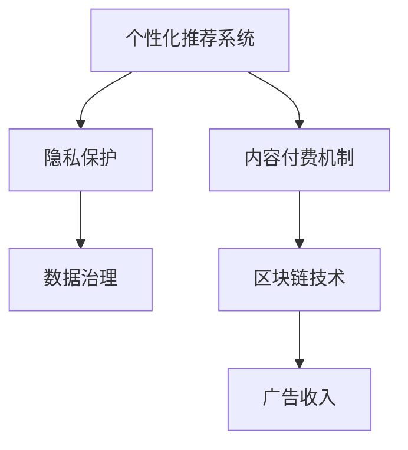

                 

# 订阅制搜索引擎：新商业模式的崛起

> 关键词：订阅制搜索引擎,新商业模式,内容付费,隐私保护,个性化推荐,机器学习,区块链技术,数据治理

## 1. 背景介绍

### 1.1 问题由来

随着互联网技术的飞速发展，搜索引擎已经成为了人们获取信息的重要工具。传统的广告驱动模式在为搜索引擎提供收入的同时，也带来了诸多问题，如搜索结果中的广告噪音、用户隐私泄露、内容质量参差不齐等。为了解决这些问题，并探索更加公平、可持续的商业模式，订阅制搜索引擎应运而生。

订阅制搜索引擎通过向用户收取订阅费用，提供更高质量、更个性化的搜索结果，旨在打造一个更加健康、有序的互联网信息生态。这种模式通过将搜索引擎商业化的目的从流量变现转移到优质内容变现，为用户的搜索体验提供了根本性的改善。

### 1.2 问题核心关键点

订阅制搜索引擎的核心在于如何平衡商业利益与用户体验。主要关注点包括：

- 个性化推荐系统：如何利用机器学习算法，根据用户的历史行为和兴趣，提供高度个性化的搜索结果。
- 内容付费机制：如何设计合理的定价策略，激励内容生产者创造高质量内容。
- 隐私保护：如何保护用户的搜索数据隐私，防止数据泄露和滥用。
- 数据治理：如何构建高效的数据管理、处理和共享体系，确保数据的安全性和透明性。
- 区块链技术应用：如何利用区块链去中心化的特性，解决数据篡改和信任问题。

这些关键问题在技术层面和商业层面都有深入的探讨，是订阅制搜索引擎能否成功的关键因素。

## 2. 核心概念与联系

### 2.1 核心概念概述

订阅制搜索引擎的实现涉及多个核心概念，主要包括：

- **个性化推荐系统**：利用机器学习算法，根据用户的历史行为和兴趣，提供高度个性化的搜索结果。
- **内容付费机制**：设计合理的定价策略，激励内容生产者创造高质量内容，并收取订阅费用。
- **隐私保护**：采用先进的数据加密和匿名化技术，保护用户的搜索数据隐私。
- **数据治理**：构建高效的数据管理、处理和共享体系，确保数据的安全性和透明性。
- **区块链技术**：利用区块链去中心化和透明的特点，解决数据篡改和信任问题。

这些概念之间存在着紧密的联系，共同构成了订阅制搜索引擎的技术架构和商业模式。

### 2.2 核心概念原理和架构的 Mermaid 流程图



这个流程图展示了订阅制搜索引擎中各核心概念之间的联系：

1. 个性化推荐系统根据用户行为，提供个性化搜索结果。
2. 内容付费机制激励内容生产，保障推荐系统内容质量。
3. 隐私保护技术保障用户数据安全。
4. 数据治理体系确保数据管理高效。
5. 区块链技术解决信任问题，辅助内容验证。

## 3. 核心算法原理 & 具体操作步骤

### 3.1 算法原理概述

订阅制搜索引擎的核心算法原理主要围绕着个性化推荐系统和内容付费机制展开。个性化推荐系统基于用户的历史行为和兴趣，通过机器学习算法，如协同过滤、矩阵分解、神经网络等，构建用户画像，并推荐最相关的搜索结果。内容付费机制则通过合理定价，激励内容生产者创造优质内容，同时根据订阅模式，向用户收取费用。

### 3.2 算法步骤详解

个性化推荐系统的算法步骤包括：

1. **用户画像构建**：收集用户搜索历史、点击行为、收藏夹等数据，构建用户兴趣模型。
2. **相似性计算**：基于用户画像，计算不同搜索结果之间的相似性。
3. **排序算法**：结合相似性计算结果和实时数据，应用排序算法，将最相关搜索结果推荐给用户。
4. **反馈循环**：根据用户反馈（如点击、停留时间等），不断调整推荐算法，提升推荐精度。

内容付费机制的算法步骤包括：

1. **内容评估**：根据内容质量、原创性、用户评价等指标，评估内容价值。
2. **定价策略**：设计定价模型，如订阅价、按内容付费等，激励内容生产。
3. **订阅管理**：管理用户订阅状态，保障订阅费用及时收取。
4. **内容审核**：审核新内容，确保高质量。

### 3.3 算法优缺点

订阅制搜索引擎的个性化推荐系统和内容付费机制具有以下优点：

- **提升用户体验**：高度个性化的搜索结果和优质内容，显著提升用户搜索体验。
- **保护用户隐私**：通过隐私保护技术，确保用户数据安全，避免隐私泄露。
- **激励内容创新**：内容付费机制激励内容生产者创造高质量内容，提升整体内容质量。

同时，也存在一些缺点：

- **成本高**：个性化推荐系统和内容审核需要大量计算资源，成本较高。
- **用户接受度**：部分用户可能难以接受订阅费用，影响订阅率。
- **内容质量不稳定**：依赖内容生产者，内容质量难以长期稳定。

### 3.4 算法应用领域

订阅制搜索引擎的核心算法原理和操作步骤，已经在多个领域得到了广泛应用：

- **搜索应用**：如Google、Bing等搜索引擎，通过订阅模式提供个性化推荐服务。
- **知识付费平台**：如知乎、Medium等，通过订阅模式收取知识付费，激励内容创作。
- **在线教育平台**：如Coursera、Udemy等，通过订阅模式提供优质课程，提高学习效果。
- **社交媒体平台**：如Facebook、Twitter等，通过订阅模式提供定制化内容，提升用户体验。

## 4. 数学模型和公式 & 详细讲解 & 举例说明

### 4.1 数学模型构建

个性化推荐系统的数学模型主要基于协同过滤算法，核心在于计算用户画像和搜索结果之间的相似性。设用户 $u$ 对搜索结果 $i$ 的评分矩阵为 $R_{ui}$，用户兴趣向量为 $u$，搜索结果特征向量为 $i$，则用户和搜索结果之间的相似性可以表示为：

$$
\text{similarity}(u, i) = u \cdot A_i
$$

其中 $A_i$ 为搜索结果的特征向量，可以通过词频、TF-IDF等方法计算。

内容付费机制的定价模型可以基于价值评估和用户订阅意愿计算。设内容 $j$ 的价值为 $V_j$，用户 $u$ 的订阅意愿为 $I_u$，则定价模型可以表示为：

$$
\text{Price} = f(V_j, I_u)
$$

其中 $f$ 为定价函数，可以根据内容价值和用户意愿动态调整。

### 4.2 公式推导过程

个性化推荐系统的相似性计算公式可以进一步展开为：

$$
\text{similarity}(u, i) = \sum_{k=1}^K a_k u_k \cdot A_{ik}
$$

其中 $a_k$ 为特征维度，$u_k$ 为用户兴趣特征，$A_{ik}$ 为搜索结果特征。

内容付费机制的定价函数可以采用如下形式：

$$
\text{Price} = \alpha V_j + \beta I_u + \gamma \text{History}_{j,u}
$$

其中 $\alpha$、$\beta$、$\gamma$ 为定价系数，$\text{History}_{j,u}$ 为用户对内容 $j$ 的历史评分。

### 4.3 案例分析与讲解

以Google Search为例，其个性化推荐系统主要基于用户搜索历史和点击行为，通过协同过滤算法，计算搜索结果与用户兴趣的相似度，推荐最相关结果。内容付费机制则通过订阅模式，提供高级搜索服务，如搜索结果优先、广告屏蔽等。

## 5. 项目实践：代码实例和详细解释说明

### 5.1 开发环境搭建

订阅制搜索引擎的开发环境搭建需要考虑多个因素：

1. **编程语言**：通常使用Python、Java等编程语言进行开发。
2. **数据库**：使用MySQL、MongoDB等关系型或NoSQL数据库，存储用户数据和搜索结果。
3. **搜索引擎**：使用ElasticSearch、Solr等搜索引擎，提供高效的数据检索功能。
4. **云服务**：使用AWS、Google Cloud、阿里云等云服务，提供计算和存储资源。

### 5.2 源代码详细实现

以下是一个简化的个性化推荐系统示例代码，使用了Python和Pandas库：

```python
import pandas as pd

# 用户-内容评分矩阵
R = pd.DataFrame({
    'user1': [5, 4, 3, 2, 1],
    'user2': [3, 4, 5, 2, 1],
    'user3': [2, 2, 3, 4, 5]
})

# 内容特征矩阵
A = pd.DataFrame({
    'content1': [1, 0, 0, 0, 0],
    'content2': [0, 1, 0, 0, 0],
    'content3': [0, 0, 1, 0, 0],
    'content4': [0, 0, 0, 1, 0],
    'content5': [0, 0, 0, 0, 1]
})

# 用户特征向量
u = pd.Series([0.2, 0.3, 0.1, 0.4, 0])

# 计算相似性
similarity = u.dot(A.T)

# 输出结果
print(similarity)
```

以上代码展示了如何通过Pandas库计算用户和内容之间的相似性，实现简单的个性化推荐。

### 5.3 代码解读与分析

- **用户-内容评分矩阵**：存储用户对不同内容的评分，用于计算相似性。
- **内容特征矩阵**：存储内容的特征向量，用于计算相似性。
- **用户特征向量**：存储用户兴趣特征，用于计算相似性。
- **相似性计算**：通过点乘运算，计算用户和内容之间的相似性。

## 6. 实际应用场景

### 6.1 搜索引擎

Google Search是订阅制搜索引擎的典型代表，通过订阅模式提供高级搜索服务，如搜索结果优先、广告屏蔽等。用户可以按月或按年订阅，获取更优质的搜索结果和体验。

### 6.2 知识付费平台

知乎、Medium等知识付费平台，通过订阅模式提供定制化内容推荐，激励优质内容创作。用户可以按月或按年订阅，享受高质量的问答、文章等内容。

### 6.3 在线教育平台

Coursera、Udemy等在线教育平台，通过订阅模式提供优质课程，提高学习效果。用户可以按月或按年订阅，享受个性化的学习推荐和课程内容。

### 6.4 社交媒体平台

Facebook、Twitter等社交媒体平台，通过订阅模式提供定制化内容推荐，提升用户体验。用户可以按月或按年订阅，享受个性化内容推荐和高级功能。

## 7. 工具和资源推荐

### 7.1 学习资源推荐

为了帮助开发者系统掌握订阅制搜索引擎的技术，以下是几份优质的学习资源：

1. **《推荐系统实践》书籍**：详细介绍了推荐系统的原理和实现方法，包括协同过滤、矩阵分解、神经网络等算法。
2. **Coursera《推荐系统》课程**：由斯坦福大学教授讲授，涵盖推荐系统的理论基础和实际应用。
3. **Kaggle推荐系统竞赛**：通过实际项目练习，提升推荐系统设计和优化能力。
4. **Recommender Systems论文**：研究推荐系统的最新进展，涵盖深度学习、增强学习等前沿技术。

### 7.2 开发工具推荐

订阅制搜索引擎的开发离不开优秀的工具支持，以下是几款常用的开发工具：

1. **Python**：Python是推荐系统开发的主要语言，提供了丰富的第三方库和框架，如Pandas、Scikit-learn、TensorFlow等。
2. **ElasticSearch**：ElasticSearch提供了高效的搜索和分析功能，是推荐系统数据存储和检索的核心工具。
3. **AWS**：AWS提供了强大的云计算资源，支持大规模推荐系统的部署和扩展。
4. **Jupyter Notebook**：Jupyter Notebook提供了交互式编程环境，便于快速迭代实验和调试。

### 7.3 相关论文推荐

订阅制搜索引擎的实现涉及多个前沿技术，以下是几篇奠基性的相关论文，推荐阅读：

1. **《推荐系统》书籍**：详细介绍了推荐系统的理论基础和实际应用。
2. **《协同过滤推荐算法》论文**：介绍了协同过滤算法的原理和实现方法。
3. **《深度学习在推荐系统中的应用》论文**：探讨了深度学习在推荐系统中的广泛应用。
4. **《个性化推荐系统》论文**：研究了个性化推荐系统的最新进展，涵盖推荐算法、数据治理等方面。

## 8. 总结：未来发展趋势与挑战

### 8.1 研究成果总结

订阅制搜索引擎在个性化推荐和内容付费方面取得了显著进展，通过机器学习算法和大数据技术，为用户提供了高度个性化的搜索结果和优质内容。

### 8.2 未来发展趋势

未来订阅制搜索引擎将呈现以下发展趋势：

1. **技术创新**：利用深度学习、增强学习等前沿技术，提升推荐系统的精度和鲁棒性。
2. **数据治理**：构建高效的数据管理、处理和共享体系，确保数据的安全性和透明性。
3. **隐私保护**：采用先进的隐私保护技术，确保用户数据的安全和隐私。
4. **内容生态**：构建内容创作者和订阅用户之间的良性互动，激励高质量内容创作。

### 8.3 面临的挑战

尽管订阅制搜索引擎在个性化推荐和内容付费方面取得了显著进展，但仍面临以下挑战：

1. **成本高**：个性化推荐和内容审核需要大量计算资源，成本较高。
2. **用户接受度**：部分用户可能难以接受订阅费用，影响订阅率。
3. **内容质量不稳定**：依赖内容生产者，内容质量难以长期稳定。
4. **隐私保护**：在提供个性化推荐的同时，需要平衡隐私保护和数据利用。

### 8.4 研究展望

未来研究需要在以下几个方面寻求新的突破：

1. **数据治理**：构建高效的数据管理、处理和共享体系，确保数据的安全性和透明性。
2. **隐私保护**：采用先进的隐私保护技术，确保用户数据的安全和隐私。
3. **内容生态**：构建内容创作者和订阅用户之间的良性互动，激励高质量内容创作。
4. **技术创新**：利用深度学习、增强学习等前沿技术，提升推荐系统的精度和鲁棒性。

这些研究方向将推动订阅制搜索引擎的发展，为用户提供更加健康、有序的互联网信息生态。

## 9. 附录：常见问题与解答

**Q1：订阅制搜索引擎如何平衡商业利益与用户体验？**

A: 订阅制搜索引擎通过个性化推荐和优质内容，提升用户体验，同时通过内容付费机制，激励内容生产，保障推荐系统内容质量。

**Q2：订阅制搜索引擎如何保护用户隐私？**

A: 采用先进的隐私保护技术，如数据加密、匿名化等，确保用户数据安全。

**Q3：订阅制搜索引擎如何激励内容生产者？**

A: 设计合理的内容付费机制，如订阅模式，激励内容生产者创造高质量内容。

**Q4：订阅制搜索引擎的成本如何控制？**

A: 通过技术创新，如深度学习、增强学习等，提升推荐系统的效率和精度，降低计算成本。

**Q5：订阅制搜索引擎的内容质量如何保证？**

A: 通过内容审核机制，确保内容质量和真实性。

**Q6：订阅制搜索引擎的扩展性如何设计？**

A: 采用云服务和分布式架构，支持大规模推荐系统的部署和扩展。

通过本文的系统梳理，可以看到订阅制搜索引擎在个性化推荐和内容付费方面的广泛应用和重要价值。未来随着技术的持续演进和应用的不断扩展，订阅制搜索引擎必将在构建人机协同的智能时代中扮演越来越重要的角色。相信通过学界和产业界的共同努力，订阅制搜索引擎将成为未来搜索引擎的主流商业模式，为用户提供更加健康、有序的互联网信息生态。

---

作者：禅与计算机程序设计艺术 / Zen and the Art of Computer Programming

