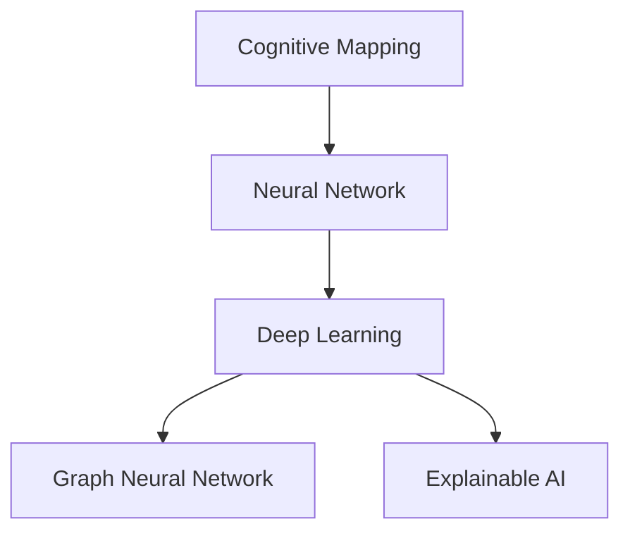

                 

# 认知映射：可视化思维过程

> 关键词：认知映射,思维可视化,人工智能,机器学习,深度学习,图神经网络,神经科学,心理学

## 1. 背景介绍

### 1.1 问题由来
在人工智能领域，特别是深度学习和神经网络研究中，我们常常需要理解复杂的网络结构和算法的内在机制，以便更好地进行调优和优化。传统的模型解释方法往往局限于特征图和激活图，难以全面展示模型的内部工作机制和信息流动过程。因此，亟需一种新的可视化工具，能够直观、全面地展示深度学习模型的内在运行机制。

### 1.2 问题核心关键点
认知映射（Cognitive Mapping）是一种结合心理学、认知科学和神经科学的理论与方法，旨在通过构建可视化图谱，展示大脑或模型的内部认知过程和知识结构。将认知映射应用于深度学习模型，可以全面展现模型的输入输出关系、信息流动路径以及每个节点所代表的计算过程，从而揭示模型的内在机制，辅助调优和优化。

## 2. 核心概念与联系

### 2.1 核心概念概述

为更好地理解认知映射在深度学习模型中的应用，本节将介绍几个密切相关的核心概念：

- 认知映射（Cognitive Mapping）：通过构建知识图谱，展示大脑或模型的内在认知过程和知识结构。
- 神经网络（Neural Network）：由神经元和连接组成的计算模型，通过训练学习输入与输出之间的映射关系。
- 深度学习（Deep Learning）：基于神经网络的多层模型，用于解决复杂非线性问题，如图像识别、自然语言处理等。
- 图神经网络（Graph Neural Network, GNN）：一种特殊类型的神经网络，用于处理图结构数据。
- 可解释人工智能（Explainable AI, XAI）：旨在使人工智能模型更加透明，便于解释和理解，从而增强其可信度和可靠性。

这些核心概念之间的逻辑关系可以通过以下Mermaid流程图来展示：



这个流程图展示了几者之间的联系：认知映射通过对深度学习模型的可视化，辅助模型的解释和优化；而图神经网络作为深度学习的一种，通过知识图谱的构建和展示，进一步增强了模型的解释性和可解释性。

## 3. 核心算法原理 & 具体操作步骤
### 3.1 算法原理概述

认知映射的实现依赖于知识图谱的构建和展示。知识图谱是一种结构化的图数据，用于描述实体、属性和它们之间的关系。在深度学习中，我们可以将网络结构看作一种知识图谱，其中节点表示神经元或层，边表示连接关系，层之间的连接方式（如全连接、卷积、池化等）可以被看作属性。

认知映射的目标是通过可视化展示深度学习模型的内部结构，揭示模型在信息处理、特征提取和决策过程中的机制。这可以通过以下步骤实现：

1. 定义模型的层级结构，将网络拆分为输入层、隐藏层和输出层。
2. 构建层与层之间的连接图谱，展示信息流动的路径和方向。
3. 使用图形工具（如Python的matplotlib、NetworkX等）可视化展示图谱。

### 3.2 算法步骤详解

以卷积神经网络（Convolutional Neural Network, CNN）为例，展示认知映射的具体实现步骤：

1. **数据准备**：收集CNN的层级结构信息，包括各层的节点数、连接方式、激活函数等。
2. **构建图谱**：将网络结构转换为图结构，其中节点表示层，边表示连接关系。
3. **可视化展示**：使用图形工具绘制图谱，展示各层之间的连接方式和数据流动路径。

### 3.3 算法优缺点

认知映射的优点包括：
1. 可视化展示：通过图形化展示网络结构，有助于理解模型的内部机制和信息流动过程。
2. 辅助调优：可视化展示有助于发现模型中的性能瓶颈，辅助调优和优化。
3. 可解释性强：通过展示模型各层的输入输出关系，增强了模型的可解释性和可信度。

同时，认知映射也存在一些局限性：
1. 数据复杂性：大规模深度学习模型结构复杂，构建知识图谱可能较为困难。
2. 时间开销：可视化展示图谱的过程可能耗费较多时间。
3. 解释边界：可视化展示仅能揭示模型内部机制的一部分，可能无法全面解释模型的决策过程。

### 3.4 算法应用领域

认知映射在深度学习模型的可视化展示和解释方面具有广泛应用，尤其在以下领域：

- 图像处理：通过可视化展示卷积神经网络的卷积层、池化层等，理解模型的特征提取机制。
- 自然语言处理：展示循环神经网络（RNN）或Transformer模型中的注意力机制和信息流动路径。
- 生成对抗网络（GAN）：展示生成器和判别器的网络结构和信息流动，理解生成对抗训练过程。
- 强化学习：展示价值函数、策略网络和环境状态的关系，辅助策略优化。

## 4. 数学模型和公式 & 详细讲解  
### 4.1 数学模型构建

认知映射的数学模型构建主要基于图论和图神经网络的知识。我们可以将深度学习模型看作一个图网络，其中节点表示层，边表示连接关系，层的计算过程可以通过节点之间的边连接来表示。

### 4.2 公式推导过程

以卷积神经网络为例，假设网络中有 $L$ 层，第 $l$ 层的节点数为 $n_l$，则网络结构可以表示为一个图网络 $G=(V, E)$，其中 $V$ 为节点集，$E$ 为边集。对于卷积层，边连接关系可以表示为：

$$
e_{i,j}=\left\{
\begin{aligned}
&1, &\text{如果节点 } i \text{ 和节点 } j \text{ 相连}\\
&0, &\text{如果节点 } i \text{ 和节点 } j \text{ 不相连}
\end{aligned}
\right.
$$

对于池化层，边连接关系相对简单，可以表示为：

$$
e_{i,j}=\left\{
\begin{aligned}
&1, &\text{如果节点 } i \text{ 和节点 } j \text{ 相邻}\\
&0, &\text{如果节点 } i \text{ 和节点 } j \text{ 不相邻}
\end{aligned}
\right.
$$

### 4.3 案例分析与讲解

以ResNet为例，展示认知映射的可视化过程：

1. **网络结构定义**：ResNet网络由多个残差块组成，每个块包含多个卷积层和残差连接。
2. **边连接关系构建**：定义每个层之间的连接方式，包括卷积层的连接和残差连接。
3. **可视化展示**：使用Python的matplotlib库，绘制ResNet的网络结构图谱。

## 5. 项目实践：代码实例和详细解释说明
### 5.1 开发环境搭建

在进行认知映射实践前，我们需要准备好开发环境。以下是使用Python进行认知映射实践的环境配置流程：

1. 安装Anaconda：从官网下载并安装Anaconda，用于创建独立的Python环境。

2. 创建并激活虚拟环境：
```bash
conda create -n graph-mapping python=3.8 
conda activate graph-mapping
```

3. 安装相关库：
```bash
pip install networkx matplotlib
```

4. 安装图形可视化工具：
```bash
pip install pydot
```

完成上述步骤后，即可在`graph-mapping`环境中开始认知映射实践。

### 5.2 源代码详细实现

下面我们以ResNet网络为例，给出使用Python进行认知映射的代码实现。

```python
import networkx as nx
import matplotlib.pyplot as plt
import pydot

# 定义ResNet网络结构
def resnet_layers():
    layers = []
    # 定义每个层的信息
    layers.append((1, 64, 'Conv', 3, 3, 'relu'))
    layers.append((2, 64, 'Conv', 3, 3, 'relu'))
    layers.append((2, 64, 'Conv', 3, 3, 'relu'))
    layers.append((2, 64, 'Conv', 3, 3, 'relu'))
    layers.append((3, 128, 'Conv', 3, 3, 'relu'))
    layers.append((3, 128, 'Conv', 3, 3, 'relu'))
    layers.append((3, 128, 'Conv', 3, 3, 'relu'))
    layers.append((3, 128, 'Conv', 3, 3, 'relu'))
    layers.append((4, 256, 'Conv', 3, 3, 'relu'))
    layers.append((4, 256, 'Conv', 3, 3, 'relu'))
    layers.append((4, 256, 'Conv', 3, 3, 'relu'))
    layers.append((4, 256, 'Conv', 3, 3, 'relu'))
    return layers

# 构建网络图谱
def build_graph(layers):
    G = nx.Graph()
    for l in layers:
        node = (l[0], f"Layer {l[0]}")
        G.add_node(node)
        G.add_node(node + '->')
        for c in range(l[1]):
            G.add_edge(node, node + '->')
        if l[3] == 3:
            G.add_edge(node + '->', node + '->')
            G.add_edge(node + '->', node + '->')
        else:
            G.add_edge(node + '->', node + '->')
    return G

# 可视化展示图谱
def visualize_graph(G):
    pos = nx.spring_layout(G)
    nx.draw(G, pos, with_labels=True, node_color='lightblue', node_size=1000)
    plt.title('ResNet Network Structure')
    plt.show()

# 输出网络信息
def print_network(layers):
    for l in layers:
        print(f"Layer {l[0]}: {l[1]} -> {l[3]}x{l[4]} {l[5]}")

# 运行主程序
if __name__ == "__main__":
    layers = resnet_layers()
    G = build_graph(layers)
    visualize_graph(G)
    print_network(layers)
```

以上代码实现了ResNet网络结构的可视化展示。可以看到，使用Python的networkx库，可以方便地构建和展示深度学习模型的图谱结构。

### 5.3 代码解读与分析

让我们再详细解读一下关键代码的实现细节：

**resnet_layers函数**：
- 定义了ResNet网络的各层信息，包括层数、节点数、连接方式、激活函数等。

**build_graph函数**：
- 根据各层信息，构建网络图谱，节点表示层，边表示连接关系。

**visualize_graph函数**：
- 使用matplotlib库绘制图谱，展示各层之间的连接方式和数据流动路径。

**print_network函数**：
- 打印网络各层的信息，方便调试和理解。

**主程序**：
- 通过调用各个函数，展示ResNet网络结构，并打印网络信息。

通过以上代码，可以清晰地展示ResNet网络的结构和信息流动路径，有助于理解模型的内部机制和特征提取过程。

## 6. 实际应用场景
### 6.1 图像处理

在图像处理领域，认知映射可以用于展示卷积神经网络（CNN）的卷积层、池化层等，理解模型的特征提取机制。具体应用包括：

- 图像分类：通过可视化展示卷积层的特征图，理解不同卷积核对图像特征的提取。
- 目标检测：展示卷积神经网络中的特征提取和上下文理解过程，理解目标检测的机制。
- 图像生成：展示生成对抗网络（GAN）中的生成器和判别器的网络结构和信息流动，理解生成对抗训练过程。

### 6.2 自然语言处理

在自然语言处理领域，认知映射可以用于展示循环神经网络（RNN）或Transformer模型中的注意力机制和信息流动路径。具体应用包括：

- 语言建模：展示RNN或Transformer模型中的语言生成过程，理解模型在词序列上的预测能力。
- 机器翻译：展示Transformer模型中的多头注意力机制，理解模型的翻译过程。
- 命名实体识别：展示序列标注模型的信息流动路径，理解模型对实体边界的预测过程。

### 6.3 生成对抗网络（GAN）

在生成对抗网络领域，认知映射可以用于展示生成器和判别器的网络结构和信息流动，理解生成对抗训练过程。具体应用包括：

- 图像生成：展示GAN中生成器和判别器的结构，理解生成对抗训练过程。
- 风格迁移：展示GAN在风格迁移任务中的信息流动路径，理解风格迁移的过程。

### 6.4 强化学习

在强化学习领域，认知映射可以用于展示价值函数、策略网络和环境状态的关系，辅助策略优化。具体应用包括：

- 游戏AI：展示强化学习模型在特定游戏中的决策过程，理解模型的行为机制。
- 机器人控制：展示机器人控制模型中的状态转换和决策过程，理解模型的行为策略。

## 7. 工具和资源推荐
### 7.1 学习资源推荐

为了帮助开发者系统掌握认知映射的理论基础和实践技巧，这里推荐一些优质的学习资源：

1. 《深度学习：理论与实践》系列书籍：详细介绍了深度学习的基本理论和实践技巧，包括认知映射的可视化方法。
2. CS231n《计算机视觉：卷积神经网络》课程：斯坦福大学开设的计算机视觉明星课程，深入讲解了卷积神经网络的结构和可视化方法。
3. CS224n《自然语言处理与深度学习》课程：斯坦福大学开设的自然语言处理明星课程，涵盖深度学习模型的各种可视化方法。
4. 《Python图论与网络科学》书籍：详细介绍图论和图神经网络的基础知识和实践技巧，包括认知映射的实现方法。
5. ArXiv上的认知映射相关论文：最新研究和前沿进展，涵盖认知映射在深度学习中的应用方法和技术细节。

通过对这些资源的学习实践，相信你一定能够快速掌握认知映射的精髓，并用于解决实际的深度学习问题。

### 7.2 开发工具推荐

高效的开发离不开优秀的工具支持。以下是几款用于认知映射开发的常用工具：

1. Python：强大的编程语言，支持网络x和matplotlib等库，适合构建深度学习模型的可视化图谱。
2. Jupyter Notebook：开源的交互式计算平台，支持Python代码的在线执行，方便调试和展示。
3. Pydot：图形可视化工具，可以将Python网络x图谱转换为DOT格式，方便导出和展示。
4. TensorFlow：深度学习框架，提供可视化工具TensorBoard，方便展示模型结构和训练过程。
5. PyTorch：深度学习框架，提供可视化工具PyViz，方便展示模型结构和训练过程。

合理利用这些工具，可以显著提升认知映射任务的开发效率，加快创新迭代的步伐。

### 7.3 相关论文推荐

认知映射在深度学习模型的可视化展示和解释方面具有广泛应用，以下是几篇奠基性的相关论文，推荐阅读：

1. "Cognitive Mapping of Deep Neural Networks for Visualizing and Explaining AI Systems"（认知映射深度神经网络，展示和解释人工智能系统的可视化方法）。
2. "Neural Network Visualization with Visualization Networks"（使用可视化网络展示神经网络，理解模型的内部机制）。
3. "A Survey on Deep Learning Visualization"（深度学习可视化综述，涵盖各类可视化方法和应用场景）。
4. "Understanding Deep Neural Networks: A Visual Perspective"（理解深度神经网络：一种可视化视角）。
5. "Visualizing and Understanding the Dynamics of Deep Neural Networks"（深度神经网络动态可视化和理解）。

这些论文代表了大语言模型微调技术的发展脉络。通过学习这些前沿成果，可以帮助研究者把握学科前进方向，激发更多的创新灵感。

## 8. 总结：未来发展趋势与挑战

### 8.1 总结

本文对认知映射在深度学习模型中的应用进行了全面系统的介绍。首先阐述了认知映射在深度学习模型中的重要性和应用场景，明确了认知映射在模型解释和调优中的独特价值。其次，从原理到实践，详细讲解了认知映射的数学模型和操作步骤，给出了认知映射任务开发的完整代码实例。同时，本文还广泛探讨了认知映射方法在图像处理、自然语言处理、生成对抗网络、强化学习等多个领域的应用前景，展示了认知映射范式的巨大潜力。

通过本文的系统梳理，可以看到，认知映射技术在深度学习模型的解释和可视化方面，具有广阔的应用前景。这不仅有助于理解模型内部机制，提高模型解释性和可信度，还可以辅助模型调优，提升模型性能。未来，伴随深度学习技术的不断演进，认知映射技术也将不断发展和完善，为构建人机协同的智能系统提供强有力的支持。

### 8.2 未来发展趋势

展望未来，认知映射技术将呈现以下几个发展趋势：

1. 模型复杂度提升：随着深度学习模型结构复杂度的不断提升，认知映射技术也需要不断发展和优化，以适应更为复杂的模型结构。
2. 可视化效果增强：认知映射技术将结合更多先进技术，如交互式可视化、多视角展示等，进一步提升可视化效果。
3. 模型解释性提升：认知映射技术将结合可解释人工智能（XAI）技术，进一步增强模型的解释性和可信度。
4. 应用场景扩展：认知映射技术将广泛应用于图像处理、自然语言处理、生成对抗网络、强化学习等多个领域，为深度学习模型提供全面的可视化支持。

以上趋势凸显了认知映射技术的广阔前景。这些方向的探索发展，必将进一步提升深度学习模型的解释性和可解释性，推动人工智能技术在更多领域的落地应用。

### 8.3 面临的挑战

尽管认知映射技术已经取得了瞩目成就，但在迈向更加智能化、普适化应用的过程中，它仍面临诸多挑战：

1. 数据复杂性：深度学习模型结构复杂，构建认知映射图谱可能较为困难。
2. 可视化开销：可视化展示图谱的过程可能耗费较多时间。
3. 解释边界：可视化展示仅能揭示模型内部机制的一部分，可能无法全面解释模型的决策过程。
4. 应用场景限制：当前认知映射技术更多应用于学术研究和实验室场景，实际应用仍需进一步推广和优化。

### 8.4 研究展望

面对认知映射面临的挑战，未来的研究需要在以下几个方面寻求新的突破：

1. 探索更高效的数据表示方法：优化深度学习模型的结构表示，降低构建认知映射图谱的难度。
2. 研究更高效的可视化工具：结合交互式可视化和多视角展示，提升可视化效果。
3. 引入更多先验知识：结合符号化的先验知识，增强认知映射模型的解释性和可信度。
4. 结合更多先进技术：如深度学习、强化学习、自然语言处理等，拓展认知映射技术的应用范围。

这些研究方向将为认知映射技术的未来发展提供新的思路和方法，推动深度学习模型在更多领域的应用。总之，认知映射技术需要在理论和实践的不断探索中，持续发展和完善，方能成为构建智能系统的重要工具。

## 9. 附录：常见问题与解答

**Q1：认知映射在深度学习模型中如何应用？**

A: 认知映射在深度学习模型中的应用主要体现在两个方面：
1. 可视化展示：通过构建图谱，展示模型的内部结构、信息流动路径和计算过程，帮助理解模型的内部机制和决策过程。
2. 辅助调优：通过可视化展示，发现模型的性能瓶颈，辅助调优和优化，提升模型性能。

**Q2：如何选择合适的认知映射可视化工具？**

A: 选择合适的认知映射可视化工具需要考虑以下几个因素：
1. 可视化效果：工具能否直观、全面地展示模型结构，是否支持交互式展示。
2. 可视化速度：工具的渲染速度是否满足实际需求，是否支持大规模数据集。
3. 数据兼容性：工具是否支持常见深度学习框架，如TensorFlow、PyTorch等。
4. 扩展性：工具是否支持自定义图形展示，是否支持图形导出和共享。

常用的认知映射可视化工具包括NetworkX、Matplotlib、Pydot、TensorBoard等。

**Q3：认知映射在实际应用中需要注意哪些问题？**

A: 认知映射在实际应用中需要注意以下问题：
1. 数据处理：模型结构复杂，构建认知映射图谱可能较为困难，需要合理处理数据，降低构建难度。
2. 可视化开销：可视化展示图谱的过程可能耗费较多时间，需要优化算法和工具，提升可视化效率。
3. 解释边界：可视化展示仅能揭示模型内部机制的一部分，可能无法全面解释模型的决策过程，需要结合其他方法进行补充。
4. 应用场景：认知映射技术更多应用于学术研究和实验室场景，实际应用仍需进一步推广和优化。

通过不断优化和改进，认知映射技术将为深度学习模型的解释和调优提供强有力的支持，推动人工智能技术在更多领域的落地应用。

---

作者：禅与计算机程序设计艺术 / Zen and the Art of Computer Programming

