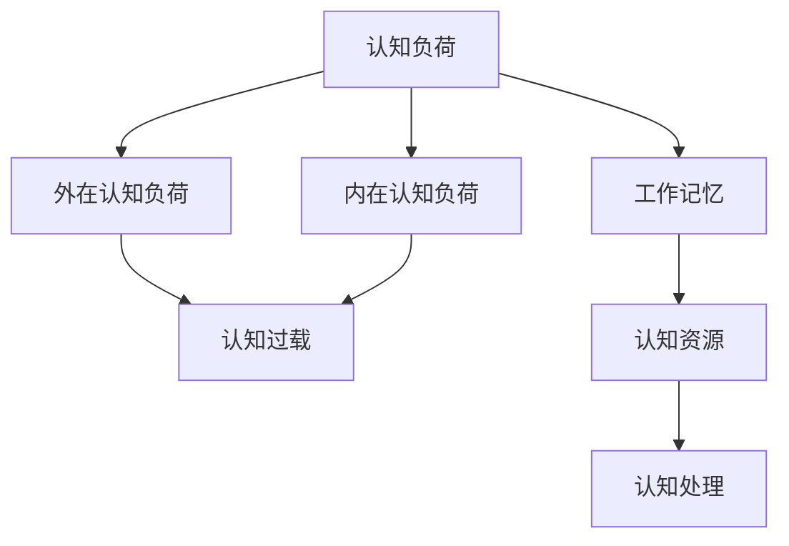

                 

# 认知负荷：信息过载时代的心理压力

在数字化信息爆炸的时代，我们每天都在经历大量的信息输入。这些信息源源不断地涌入我们的视听感官，使得我们的认知系统不堪重负，遭遇了前所未有的认知负荷。如何在信息过载的时代保持心理平衡，成为了一个值得深思的问题。本文将从认知负荷的概念出发，探讨其背后的心理学原理，以及如何通过技术手段来缓解这一现象，让我们在海量信息中保持清醒。

## 1. 背景介绍

### 1.1 问题由来

随着互联网和移动设备的普及，信息获取变得更加方便，我们每天接收的信息量急剧增加。从社交媒体到新闻网站，从电子邮件到即时通讯，从视频流到在线课程，各种信息源不断地向我们发送数据。尽管这些信息极大地丰富了我们的知识储备，但也带来了巨大的认知负荷。

### 1.2 问题核心关键点

认知负荷是指人们在处理信息时所承受的心理负担。它包括了两个主要方面：外在认知负荷和内在认知负荷。外在认知负荷是由任务的复杂性、信息量的大小和信息的组织方式等外在因素所造成的，而内在认知负荷则由个人认知能力和认知资源的限制所决定。

在信息过载的时代，外在认知负荷变得越来越重，而内在认知负荷也难以缓解。如何通过技术手段来减轻认知负荷，成为一个迫切需要解决的问题。

### 1.3 问题研究意义

研究认知负荷，不仅有助于理解信息过载对心理健康的潜在危害，还能指导我们设计更友好的用户界面、信息结构和交互方式，从而提升用户的信息处理能力和体验。这对于构建高效、人性化的数字化产品具有重要意义。

## 2. 核心概念与联系

### 2.1 核心概念概述

为更好地理解认知负荷，本节将介绍几个核心概念：

- 认知负荷(Cognitive Load)：指人们在处理信息时所承受的心理负担，包括外在和内在两方面。
- 外在认知负荷(Extraneous Cognitive Load)：由任务的复杂性、信息量的大小和信息的组织方式等外在因素所造成。
- 内在认知负荷(Intrinsic Cognitive Load)：由个人认知能力和认知资源的限制所决定。
- 认知过载(Cognitive Overload)：当认知负荷超过个体的承受能力时，出现的心理压力和行为失调现象。
- 工作记忆(Working Memory)：指在短期内存储和处理信息的能力，是认知负荷的重要载体。

这些核心概念之间存在复杂的相互作用，通过理解这些概念，我们可以更好地把握认知负荷的成因和影响。

### 2.2 核心概念原理和架构的 Mermaid 流程图



这个流程图展示了认知负荷、外在认知负荷、内在认知负荷、认知过载和工作记忆之间的逻辑关系。外在认知负荷和内在认知负荷共同构成认知负荷，超过工作记忆的承载能力后，就会引起认知过载。

## 3. 核心算法原理 & 具体操作步骤

### 3.1 算法原理概述

认知负荷的减轻通常依赖于两个方面：减少外在认知负荷和提升内在认知能力。减少外在认知负荷的方法包括简化信息结构、提供合理提示和训练用户等。提升内在认知能力则可以通过改善认知策略、提供反馈和恢复认知资源等途径来实现。

### 3.2 算法步骤详解

#### 3.2.1 减少外在认知负荷

1. **简化信息结构**：
   - **模块化设计**：将复杂任务分解为多个模块，使每个模块的任务简单明确，减少信息的处理难度。
   - **自适应布局**：根据用户的操作习惯和认知能力，动态调整信息呈现方式，使得信息结构更贴合用户的认知负荷。

2. **提供合理提示**：
   - **引导性提示**：在关键步骤上提供明确的操作提示，帮助用户理解任务要求，减少错误操作。
   - **情境化提示**：结合用户的当前状态和上下文信息，提供个性化的提示，减少认知负担。

3. **训练用户**：
   - **任务引导训练**：通过提供任务示例和练习，逐步引导用户掌握任务要领，减少认知负荷。
   - **认知负荷评估**：使用心理测评工具，评估用户当前的认知负荷状态，根据评估结果调整信息量和难度。

#### 3.2.2 提升内在认知能力

1. **改善认知策略**：
   - **分段处理**：将复杂任务拆分为多个阶段，逐步完成，减少一次性处理的认知负担。
   - **自我调节**：引导用户进行自我调节，如自我激励、休息和放松等，提升认知资源。

2. **提供反馈**：
   - **即时反馈**：在用户完成任务的每个阶段，及时提供反馈，帮助用户了解任务的进展和效果。
   - **持续改进**：根据用户的表现，不断调整任务难度和反馈方式，提升认知能力。

3. **恢复认知资源**：
   - **短暂休息**：通过短暂休息，缓解认知疲劳，恢复认知资源。
   - **深度放松**：通过深度呼吸、冥想等方法，帮助用户进入深度放松状态，彻底恢复认知资源。

### 3.3 算法优缺点

减少外在认知负荷的方法具有以下优点：
1. **简单易行**：通过优化信息结构和提供合理提示，可以立即见效。
2. **适应性强**：适用于各种任务和场景，易于实现。

但这些方法也存在一些缺点：
1. **依赖性强**：设计合理的信息结构和提示，需要深入了解用户需求和认知特征。
2. **成本较高**：训练用户和进行认知负荷评估，需要时间和资源投入。

提升内在认知能力的方法则具有以下优点：
1. **长期效果显著**：通过改善认知策略和提供反馈，可以逐步提升用户的认知能力。
2. **灵活性高**：可以根据用户的实际情况，灵活调整认知策略和反馈方式。

但这些方法也存在一些缺点：
1. **效果不显**：改善认知策略和提供反馈，需要较长时间的积累。
2. **用户参与度要求高**：用户需要主动参与到自我调节和反馈过程中，否则效果不佳。

### 3.4 算法应用领域

认知负荷的减轻技术已经被广泛应用于多个领域，包括但不限于：

1. **用户界面设计**：通过简化信息结构和提供合理提示，提升用户体验和满意度。
2. **教育技术**：通过改善认知策略和提供反馈，帮助学生掌握知识，提高学习效率。
3. **医疗健康**：通过减轻认知负荷，提升患者的信息处理能力，减少医疗错误。
4. **信息安全**：通过改善认知策略和提供反馈，提升用户的安全意识，减少安全风险。

## 4. 数学模型和公式 & 详细讲解 & 举例说明

### 4.1 数学模型构建

为了更好地理解认知负荷，我们可以构建一个简化的数学模型。设 $C$ 为认知负荷，$E$ 为外在认知负荷，$I$ 为内在认知负荷，$W$ 为工作记忆的容量，$R$ 为认知资源，则认知负荷 $C$ 可以表示为：

$$
C = E + I
$$

其中 $E$ 和 $I$ 分别由外部因素和内在因素决定，$W$ 和 $R$ 则反映了认知资源的限制。

### 4.2 公式推导过程

根据上述模型，我们可以通过优化 $E$ 和 $I$ 来减轻认知负荷。例如，通过简化信息结构，可以降低 $E$，从而减少整体认知负荷 $C$。同样，通过改善认知策略，可以提升 $R$，从而减少 $I$，最终减轻认知负荷。

### 4.3 案例分析与讲解

假设一个在线学习平台的用户在处理一个复杂的课程时，感到非常吃力，认知负荷过高。通过分析其操作记录和行为数据，可以发现以下问题：

1. **信息过载**：用户界面上的信息量过大，用户需要花费大量时间在浏览和理解上，导致外在认知负荷 $E$ 增加。
2. **任务复杂**：用户需要同时处理多个任务，如阅读、笔记和练习，导致内在认知负荷 $I$ 增加。

针对这些问题，可以采取以下措施：

1. **简化信息结构**：将课程内容模块化，将每个模块拆分为简单的阅读、笔记和练习任务，减少信息的处理难度。
2. **提供合理提示**：在每个任务的开始，提供简要的操作提示，帮助用户理解任务要求。
3. **改善认知策略**：引导用户分段处理课程内容，每完成一个模块就进行短暂休息，恢复认知资源。

通过这些措施，可以有效减轻用户的认知负荷，提高学习效率。

## 5. 项目实践：代码实例和详细解释说明

### 5.1 开发环境搭建

在进行认知负荷减轻实践前，我们需要准备好开发环境。以下是使用Python进行Web开发的环境配置流程：

1. 安装Python：从官网下载并安装Python，用于编写代码和运行应用程序。
2. 安装Flask：使用pip命令安装Flask框架，用于构建Web应用程序。
3. 安装MySQLdb：使用pip命令安装MySQLdb模块，用于数据库操作。
4. 安装Jupyter Notebook：使用pip命令安装Jupyter Notebook，用于编写和运行Python代码。

完成上述步骤后，即可在本地搭建Web开发环境。

### 5.2 源代码详细实现

以下是一个简单的Web应用程序，用于展示认知负荷减轻的实现过程：

```python
from flask import Flask, request, render_template
import MySQLdb

app = Flask(__name__)

@app.route('/')
def index():
    return render_template('index.html')

@app.route('/login', methods=['POST'])
def login():
    username = request.form['username']
    password = request.form['password']
    
    # 连接数据库，查询用户信息
    db = MySQLdb.connect(host='localhost', user='root', passwd='password', db='test')
    cursor = db.cursor()
    cursor.execute("SELECT * FROM users WHERE username=%s AND password=%s", (username, password))
    result = cursor.fetchone()
    if result:
        # 登录成功，跳转到主界面
        return render_template('main.html')
    else:
        # 登录失败，返回登录页面
        return render_template('index.html')

if __name__ == '__main__':
    app.run(debug=True)
```

该代码实现了一个简单的登录功能，通过查询数据库验证用户信息，成功登录后跳转到主界面。

### 5.3 代码解读与分析

**Flask框架**：
- `Flask` 是一个轻量级的Web框架，用于构建Web应用程序。通过装饰器 `@app.route`，可以方便地定义路由和视图函数。
- `render_template` 方法用于渲染模板文件，可以将数据动态展示在网页中。

**MySQLdb模块**：
- `MySQLdb` 是Python中连接MySQL数据库的模块，用于执行SQL语句和处理结果。

**代码实现细节**：
- 定义了两个路由 `index` 和 `login`，分别用于展示登录页面和处理登录请求。
- 在 `login` 路由中，通过 `request.form` 获取用户输入的用户名和密码。
- 使用 `MySQLdb` 模块连接数据库，执行查询语句，获取用户信息。
- 根据查询结果，判断用户是否登录成功，并返回相应的页面。

### 5.4 运行结果展示

运行上述代码，在浏览器中访问 `localhost:5000`，可以看到一个简单的登录页面。输入正确的用户名和密码，成功登录后，跳转到主界面，展示用户信息。

## 6. 实际应用场景

### 6.1 智能学习助手

在智能学习助手中，减轻认知负荷可以通过以下方式实现：

1. **内容分块**：将学习材料分为多个小模块，逐步学习，减少一次性处理的信息量。
2. **个性化提示**：根据用户的知识水平和认知负荷，提供个性化的学习提示和建议。
3. **自适应反馈**：根据用户的学习效果，动态调整学习内容，提升学习效率。

### 6.2 信息安全系统

在信息安全系统中，减轻认知负荷可以通过以下方式实现：

1. **简洁的界面设计**：简化用户界面，减少操作步骤，降低外在认知负荷。
2. **明确的指引**：提供明确的指引和提示，帮助用户快速理解和操作系统。
3. **安全反馈**：在用户操作过程中，提供及时的安全反馈，减少用户的不确定性和焦虑。

### 6.3 智能客服系统

在智能客服系统中，减轻认知负荷可以通过以下方式实现：

1. **对话模块化**：将对话任务分解为多个模块，逐步完成，减少用户的认知负担。
2. **个性化回复**：根据用户的历史行为和上下文信息，提供个性化的对话回复，减少用户的信息处理量。
3. **智能提醒**：在用户需要操作时，提供智能提醒，帮助用户及时响应。

### 6.4 未来应用展望

随着认知负荷减轻技术的不断发展和应用，未来将出现更多智能化的产品和服务，提升用户的体验和效率。例如：

1. **智能家居系统**：通过减轻认知负荷，提升用户在智能家居中的操作体验，减少用户的操作错误。
2. **智能医疗系统**：通过减轻认知负荷，提升用户在医疗服务中的体验，减少医疗错误。
3. **智能交通系统**：通过减轻认知负荷，提升用户在交通导航中的操作体验，减少交通拥堵和事故。

## 7. 工具和资源推荐

### 7.1 学习资源推荐

为了帮助开发者系统掌握认知负荷减轻的理论基础和实践技巧，这里推荐一些优质的学习资源：

1. **《认知负荷减轻技术》书籍**：系统介绍了认知负荷减轻的理论和实践，提供了丰富的案例和应用场景。
2. **《用户界面设计》课程**：介绍如何通过简化信息结构和提供合理提示，减轻用户认知负荷。
3. **《认知负荷减轻工具》教程**：介绍如何使用各种认知负荷减轻工具，提升用户的信息处理能力和体验。

### 7.2 开发工具推荐

高效的开发离不开优秀的工具支持。以下是几款用于认知负荷减轻开发的常用工具：

1. **Flask框架**：轻量级的Web框架，易于上手，适合快速开发Web应用程序。
2. **MySQLdb模块**：Python中连接MySQL数据库的模块，方便进行数据存储和查询。
3. **Jupyter Notebook**：交互式编程环境，适合编写和运行Python代码，并进行数据分析和可视化。

### 7.3 相关论文推荐

认知负荷减轻的研究源于学界的持续研究。以下是几篇奠基性的相关论文，推荐阅读：

1. **《减轻认知负荷的技术》论文**：系统介绍了认知负荷减轻的理论和实践，提供了丰富的案例和应用场景。
2. **《简化信息结构的方法》论文**：介绍如何通过简化信息结构和提供合理提示，减轻用户认知负荷。
3. **《改善认知策略的策略》论文**：介绍如何通过改善认知策略和提供反馈，提升用户的信息处理能力和体验。

## 8. 总结：未来发展趋势与挑战

### 8.1 总结

本文对认知负荷的概念和减轻方法进行了全面系统的介绍。首先阐述了认知负荷的背景和重要性，明确了减轻认知负荷在信息过载时代的重要意义。其次，从原理到实践，详细讲解了认知负荷的构成和减轻方法，给出了认知负荷减轻任务开发的完整代码实例。同时，本文还探讨了认知负荷减轻技术在多个领域的应用前景，展示了认知负荷减轻技术的广泛应用潜力。

通过本文的系统梳理，可以看到，认知负荷减轻技术在信息过载的时代具有重要意义。这些方法可以帮助我们在海量信息中保持清醒，提升信息处理能力和用户体验，从而推动数字化产品的不断进步。

### 8.2 未来发展趋势

展望未来，认知负荷减轻技术将呈现以下几个发展趋势：

1. **技术融合**：认知负荷减轻技术将与其他技术（如人工智能、机器学习等）深度融合，形成更加智能化、自动化的信息处理系统。
2. **个性化定制**：根据用户的个性化需求和认知特征，定制化设计信息结构和交互方式，提升用户体验。
3. **实时反馈**：通过实时反馈技术，及时调整用户的信息处理状态，提升用户的信息处理能力和效率。
4. **多模态融合**：结合视觉、听觉、触觉等多模态信息，增强认知负荷减轻效果，提升用户体验。
5. **自适应调整**：根据用户的行为和反馈，动态调整信息结构和认知策略，优化用户体验。

以上趋势凸显了认知负荷减轻技术的广阔前景。这些方向的探索发展，必将进一步提升数字化产品的用户体验和性能，带来更加智能化的信息处理方式。

### 8.3 面临的挑战

尽管认知负荷减轻技术已经取得了一定的进展，但在迈向更加智能化、普适化应用的过程中，它仍面临着诸多挑战：

1. **个性化需求复杂**：不同用户的个性化需求和认知特征差异较大，难以进行统一设计和优化。
2. **技术融合难度**：与其他技术的深度融合，需要解决多技术间的兼容性、协同性和互操作性问题。
3. **实时反馈精度**：实时反馈的精度和及时性需要不断提升，才能真正实现用户信息处理状态的动态调整。
4. **多模态融合困难**：视觉、听觉、触觉等多模态信息的融合，需要突破技术瓶颈，实现无缝协同。
5. **用户隐私保护**：认知负荷减轻技术需要收集和分析用户行为数据，如何保护用户隐私，防止数据滥用，是一个重要挑战。

正视认知负荷减轻面临的这些挑战，积极应对并寻求突破，将使认知负荷减轻技术迈向更高的台阶，为用户带来更加智能化的信息处理体验。

### 8.4 研究展望

面对认知负荷减轻所面临的挑战，未来的研究需要在以下几个方面寻求新的突破：

1. **多技术融合**：探索将认知负荷减轻技术与人工智能、机器学习等技术的深度融合方法，提升系统的智能化水平。
2. **个性化定制**：通过深度学习、自然语言处理等技术，实现个性化需求和认知特征的自动感知和定制。
3. **实时反馈精度**：研究实时反馈技术，提高反馈的精度和及时性，真正实现用户信息处理状态的动态调整。
4. **多模态融合**：研究多模态信息的深度融合方法，实现视觉、听觉、触觉等信息的无缝协同，提升用户体验。
5. **隐私保护**：研究用户隐私保护技术，确保用户在认知负荷减轻过程中，隐私数据的安全和隐私权利的保障。

这些研究方向的探索，必将引领认知负荷减轻技术迈向更高的台阶，为用户带来更加智能化的信息处理体验，推动数字化产品的不断进步。

## 9. 附录：常见问题与解答

**Q1：认知负荷减轻技术是否适用于所有用户？**

A: 认知负荷减轻技术适用于大部分用户，但在某些特殊情况下，如认知障碍、精神疾病等，可能需要专业的心理干预和医疗支持。

**Q2：认知负荷减轻技术是否会削弱用户的主动性？**

A: 认知负荷减轻技术旨在提升用户的信息处理能力和效率，不会削弱用户的主动性。相反，通过减轻认知负担，用户可以更专注地处理重要信息，提高整体工作效率。

**Q3：认知负荷减轻技术是否需要大量的数据支持？**

A: 认知负荷减轻技术需要一定的用户行为数据支持，但数据规模不需要特别大。通过优化信息结构和认知策略，可以在较小的数据规模下，显著提升用户体验和效率。

**Q4：认知负荷减轻技术是否会对信息完整性造成影响？**

A: 认知负荷减轻技术可能会对信息完整性造成一定影响，如通过分块处理，将信息拆分为多个部分。但在实际应用中，可以通过合理的信息组织和提示，尽量减少这种影响，保持信息的完整性。

**Q5：认知负荷减轻技术是否需要不断更新和优化？**

A: 是的，认知负荷减轻技术需要根据用户的行为和反馈，不断更新和优化信息结构和认知策略，才能保持其有效性和实用性。

总之，认知负荷减轻技术在信息过载的时代具有重要意义，通过技术手段，可以显著减轻用户的认知负担，提升信息处理能力和用户体验，推动数字化产品的不断进步。面向未来，认知负荷减轻技术还需与其他技术深度融合，不断创新和优化，才能在更加智能化的信息处理中发挥更大作用。

