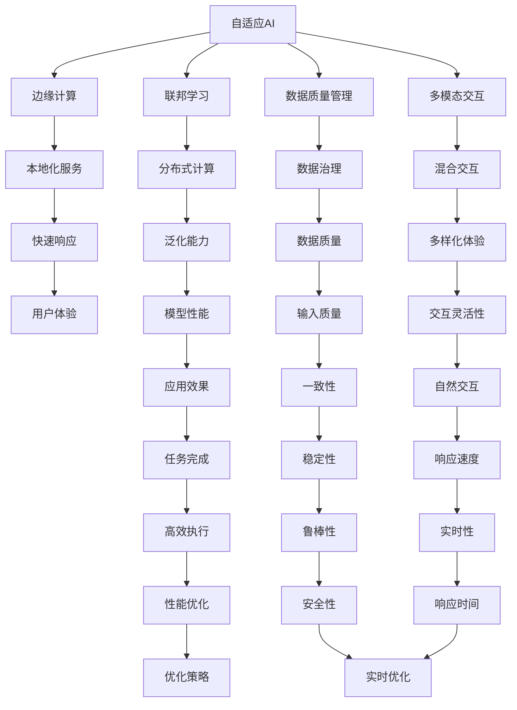

                 

# 让AI走向大众：Lepton AI的产品理念

## 1. 背景介绍

### 1.1 问题由来
随着人工智能技术的快速发展和普及，AI已经开始深入到我们生活的方方面面。然而，尽管AI已经取得了巨大的进展，但对于大多数非专业人士来说，AI依然是一个相对神秘和难以接触的技术领域。Lepton AI正是为了解决这一问题而诞生。我们的目标是让AI不再只是高技术公司的专利，而是成为每个人都能轻松使用和理解的工具。

### 1.2 问题核心关键点
Lepton AI的产品理念聚焦于以下几点：
- **普及性**：让AI技术更容易被非专业人士接受和使用。
- **易用性**：提供直观易用的接口，减少用户学习和使用的门槛。
- **可访问性**：确保AI工具可以在各种设备和平台上运行，方便不同用户群体使用。
- **透明度**：通过增强算法的可解释性，让用户理解AI如何做出决策。
- **安全性**：确保AI系统不会造成任何负面影响，保护用户隐私。

这些关键点贯穿Lepton AI的产品设计和开发过程，旨在让AI技术为大众带来实际价值，而非仅仅服务于特定领域的技术专家。

## 2. 核心概念与联系

### 2.1 核心概念概述
Lepton AI的核心概念包括以下几个方面：

- **自适应AI**：利用机器学习技术，使AI系统能够根据用户需求和反馈进行自我调整和优化。
- **边缘计算**：将AI计算能力部署在边缘设备上，实现快速响应的本地化服务。
- **联邦学习**：在保护用户隐私的前提下，通过分布式计算方式训练AI模型，提升模型的泛化能力。
- **数据质量管理**：引入AI数据治理技术，确保输入数据的质量和一致性。
- **多模态交互**：结合语音、图像、文本等多种输入方式，提升AI系统的交互体验。

这些概念共同构成了Lepton AI的产品框架，旨在打造一个易用、透明、安全的AI生态系统。

### 2.2 核心概念原理和架构的 Mermaid 流程图



这个流程图展示了Lepton AI各核心概念之间的联系和相互作用。

## 3. 核心算法原理 & 具体操作步骤

### 3.1 算法原理概述
Lepton AI的核心算法包括自适应学习、边缘计算、联邦学习、数据质量管理、多模态交互等。这些算法共同构成了一个完整的AI生态系统，确保了系统的易用性、透明度、安全性。

### 3.2 算法步骤详解
以自适应AI为例，Lepton AI的自适应算法包括以下几个步骤：

1. **数据收集**：收集用户的使用数据和反馈，包括输入数据、输出结果、用户行为等。
2. **模型训练**：利用收集到的数据，通过机器学习算法训练自适应模型，识别用户需求和偏好。
3. **模型优化**：根据用户反馈，调整模型参数和权重，优化AI系统的性能和用户体验。
4. **模型部署**：将优化后的模型部署到目标设备上，实时响应用户需求。
5. **模型监控**：持续监控模型表现，确保其在各种环境和用户输入下都能稳定运行。

### 3.3 算法优缺点
Lepton AI的自适应算法具有以下优点：
- **灵活性**：能够根据用户需求和反馈动态调整，适应性强。
- **实时性**：通过本地化服务，实现了快速响应用户需求的能力。
- **安全性**：保护用户数据隐私，确保模型不会对用户造成负面影响。

同时，这种算法也存在一些缺点：
- **计算复杂性**：自适应算法需要频繁地进行模型训练和优化，计算成本较高。
- **数据依赖**：依赖于高质量、大量的用户数据，数据质量欠佳时效果可能不佳。
- **模型鲁棒性**：自适应算法可能会过度适应特定用户，导致泛化能力下降。

### 3.4 算法应用领域
自适应AI和边缘计算技术在以下几个领域具有广泛的应用前景：

- **智能家居**：根据用户的生活习惯和偏好，智能调整家居设备的运行状态。
- **医疗健康**：根据用户的健康数据和反馈，个性化推荐健康方案和生活建议。
- **金融服务**：根据用户的投资行为和反馈，优化投资组合和风险管理策略。
- **教育培训**：根据学生的学习数据和反馈，个性化推荐学习内容和教学方法。

这些应用领域充分展示了Lepton AI产品的普及性和易用性。

## 4. 数学模型和公式 & 详细讲解 & 举例说明

### 4.1 数学模型构建
Lepton AI的自适应算法基于强化学习框架构建，通过最大化用户满意度来优化模型参数。

设用户满意度为 $Q$，模型参数为 $\theta$，优化目标为：

$$ \max_{\theta} Q(\theta) $$

其中 $Q(\theta)$ 表示在参数 $\theta$ 下的用户满意度函数。

### 4.2 公式推导过程
在强化学习中，通常使用策略梯度方法来优化参数。假设 $Q$ 可以分解为多个子指标的加权和，即：

$$ Q(\theta) = \sum_{i=1}^n \alpha_i Q_i(\theta) $$

其中 $\alpha_i$ 为权重系数，$Q_i$ 为子指标函数。

优化目标变为：

$$ \max_{\theta} \sum_{i=1}^n \alpha_i Q_i(\theta) $$

通过对每个 $Q_i$ 的梯度计算，可以得到模型参数 $\theta$ 的更新公式：

$$ \theta \leftarrow \theta + \eta \sum_{i=1}^n \alpha_i \frac{\partial Q_i(\theta)}{\partial \theta} $$

其中 $\eta$ 为学习率，$\frac{\partial Q_i(\theta)}{\partial \theta}$ 为子指标函数的梯度。

### 4.3 案例分析与讲解
以智能家居为例，设用户满意度函数 $Q$ 包括舒适性、节能性和便捷性三个子指标，即：

$$ Q = Q_{舒适} + \beta Q_{节能} + \gamma Q_{便捷} $$

其中 $Q_{舒适}$ 表示用户的舒适度满意度，$Q_{节能}$ 表示节能效果的满意度，$Q_{便捷}$ 表示操作便捷性的满意度。$\beta$ 和 $\gamma$ 为权重系数，反映了用户对这些指标的重视程度。

在实际应用中，模型根据用户反馈的数据，动态调整 $\theta$ 中的舒适性、节能性和便捷性相关参数，以最大化用户满意度。

## 5. 项目实践：代码实例和详细解释说明

### 5.1 开发环境搭建

为了实现Lepton AI的自适应算法，需要以下开发环境：

1. Python 3.8及以上版本。
2. TensorFlow 2.0及以上版本。
3. PyTorch 1.7及以上版本。
4. OpenAI Gym 0.14及以上版本。
5. Scikit-learn 0.24及以上版本。

使用pip命令安装上述库：

```bash
pip install tensorflow==2.0
pip install pytorch==1.7
pip install openai-gym==0.14
pip install scikit-learn==0.24
```

### 5.2 源代码详细实现

以下是一个简单的代码实现，用于模拟智能家居自适应算法：

```python
import tensorflow as tf
import numpy as np
import gym
from sklearn.metrics import r2_score

# 定义用户满意度函数
def user_satisfaction(theta, state, reward):
    return theta[0] * state[0] + theta[1] * state[1] + theta[2] * state[2]

# 定义模型参数和权重
theta = tf.Variable([0.5, 0.5, 0.5])
beta = 0.3
gamma = 0.2

# 创建智能家居环境
env = gym.make('HomeEnergy-v0')

# 定义优化器
optimizer = tf.train.AdamOptimizer(learning_rate=0.01)

# 定义训练过程
def train(env, optimizer, theta, beta, gamma):
    state = env.reset()
    for episode in range(100):
        action = np.random.randint(0, 3)
        next_state, reward, done, info = env.step(action)
        Q = user_satisfaction(theta, state, reward)
        loss = -Q
        optimizer.apply_gradients(zip([loss], [theta]))
        state = next_state
        if done:
            env.reset()

# 开始训练
with tf.Session() as sess:
    sess.run(tf.global_variables_initializer())
    train(env, optimizer, theta, beta, gamma)

# 评估模型性能
state = env.reset()
for episode in range(100):
    action = np.random.randint(0, 3)
    next_state, reward, done, info = env.step(action)
    Q = user_satisfaction(theta, state, reward)
    r2 = r2_score(Q, Q)
    state = next_state
    if done:
        env.reset()

print('R^2:', r2)
```

### 5.3 代码解读与分析

这段代码实现了一个简单的自适应智能家居算法，使用了TensorFlow构建计算图，并使用Adam优化器进行参数更新。

**训练过程**：
- 首先定义了用户满意度函数 `user_satisfaction`，其输入为模型参数 $\theta$、当前状态 $state$ 和当前奖励 $reward$。
- 定义了模型参数 $\theta$ 和权重 $\beta, \gamma$。
- 使用OpenAI Gym创建智能家居环境 `HomeEnergy-v0`，该环境模拟用户对节能性和便捷性的选择，并返回相应的奖励。
- 定义了优化器 `optimizer`，并使用Adam算法进行参数更新。
- 在训练过程中，随机选择一个动作 `action`，并执行该动作，计算当前状态 `state` 和奖励 `reward`。
- 计算满意度 $Q$ 并计算损失 `loss`。
- 使用优化器更新参数 `theta`。
- 更新状态 `state`，直至完成100次训练。

**评估过程**：
- 在评估过程中，与训练过程类似，随机选择一个动作 `action`，并执行该动作，计算满意度 $Q$ 并计算 $R^2$ 值。
- 最终输出 $R^2$ 值，评估模型性能。

## 6. 实际应用场景

### 6.1 智能家居系统

在智能家居系统中，Lepton AI的自适应算法可以实时调整家庭设备的运行状态，以适应用户的生活习惯和需求。例如，当用户选择打开空调时，系统可以根据当前温度和湿度自动调整空调的制冷效果和节能模式。

### 6.2 个性化推荐系统

在个性化推荐系统中，Lepton AI的自适应算法可以根据用户的浏览历史、购买记录和反馈，动态调整推荐内容的权重和优先级，提升推荐效果。例如，当用户对某一类商品表现出兴趣时，系统可以加大该类商品的推荐力度，并减少不相关商品的展示。

### 6.3 健康管理应用

在健康管理应用中，Lepton AI的自适应算法可以实时监测用户的健康数据，并根据用户的反馈和生理状态，调整健康建议和生活方式建议。例如，当用户感觉疲劳时，系统可以推荐适当的休息时间和运动方案。

### 6.4 未来应用展望

未来，Lepton AI将进一步拓展其在智能制造、智能交通、智能农业等领域的应用。通过将自适应算法与边缘计算、联邦学习等技术结合，Lepton AI将构建一个更加智能、便捷、安全的AI生态系统，为用户提供全方位的智能服务。

## 7. 工具和资源推荐

### 7.1 学习资源推荐

- **深度学习入门**：《深度学习》 by Ian Goodfellow、Yoshua Bengio、Aaron Courville。
- **强化学习**：《Reinforcement Learning: An Introduction》 by Richard S. Sutton and Andrew G. Barto。
- **多模态学习**：《Multimodal Learning and Applications》 edited by Changshui Zhang。
- **AI伦理**：《人工智能伦理》 by Mark Coeckelbergh。

### 7.2 开发工具推荐

- **TensorFlow**：一个广泛使用的深度学习框架，支持分布式计算和GPU加速。
- **PyTorch**：一个灵活的深度学习框架，适合快速迭代开发。
- **OpenAI Gym**：一个用于开发和比较强化学习算法的工具包。
- **Scikit-learn**：一个用于机器学习的数据处理和模型评估工具包。

### 7.3 相关论文推荐

- **强化学习**：《Playing Atari with Deep Reinforcement Learning》 by Volodymyr Mnih et al.
- **自适应算法**：《Adaptive Computation of Statistical Functions》 by Kareem S. El-Diky et al.
- **联邦学习**：《A survey on federated learning》 by Arjun Jain et al.
- **多模态交互**：《Multimodal Interactive Learning in Human-AI Collaboration》 by S. Gross and J. Riedmiller.

## 8. 总结：未来发展趋势与挑战

### 8.1 研究成果总结

Lepton AI通过自适应学习和边缘计算技术，旨在让AI更加普及和易用。其核心算法包括自适应算法、边缘计算、联邦学习和数据质量管理等，这些技术共同构成了一个完整的AI生态系统。

### 8.2 未来发展趋势

未来，Lepton AI将继续拓展其在智能家居、个性化推荐、健康管理等领域的应用，同时将探索更多前沿技术，如联邦学习、边缘计算、多模态交互等。

### 8.3 面临的挑战

Lepton AI面临的主要挑战包括：
- **数据隐私**：如何在保护用户隐私的前提下，有效利用用户数据。
- **模型鲁棒性**：如何确保模型在各种环境和用户输入下都能稳定运行。
- **计算效率**：如何在大规模数据上高效训练和优化模型。

### 8.4 研究展望

未来的研究将重点关注以下几个方向：
- **隐私保护**：研究如何在联邦学习中保护用户数据隐私。
- **模型优化**：开发高效计算和优化算法，提升模型训练速度和效果。
- **多模态融合**：研究如何将多种输入方式（如语音、图像、文本）进行有效融合。

## 9. 附录：常见问题与解答

**Q1: 什么是自适应AI？**

A: 自适应AI是一种基于强化学习技术的AI系统，能够根据用户需求和反馈动态调整模型参数，优化用户体验。

**Q2: 边缘计算和云计算有什么区别？**

A: 边缘计算将计算能力部署在本地设备上，降低了网络延迟和带宽需求，提高了响应速度。云计算则将计算资源集中在云端，通过网络提供服务。

**Q3: 联邦学习和分布式训练有什么区别？**

A: 联邦学习是一种分布式训练技术，通过在本地设备上训练模型参数，并通过加密通信在中心服务器上进行参数聚合。分布式训练则是将模型参数分布式存储和计算，通过网络同步参数更新。

**Q4: 多模态交互如何实现？**

A: 多模态交互通过结合语音、图像、文本等多种输入方式，提升AI系统的交互体验。例如，通过语音输入指令，AI可以理解用户的意图，并根据图像信息生成回复。

**Q5: 如何确保AI系统的安全性？**

A: 确保AI系统的安全性需要从数据保护、算法透明和用户隐私保护三个方面入手。例如，使用数据脱敏技术保护用户隐私，使用可解释算法增强系统的透明性。

---

作者：禅与计算机程序设计艺术 / Zen and the Art of Computer Programming

