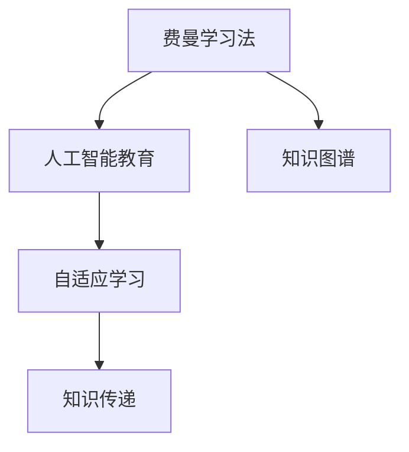

                 

# 费曼学习法在AI教育中的应用

> 关键词：费曼学习法, 人工智能, 教育技术, 知识传递, 学习效果, 自我解释

## 1. 背景介绍

### 1.1 问题由来
随着人工智能(AI)技术的飞速发展，其在教育领域的应用也日益广泛。从智能辅导系统到自适应学习平台，AI技术为个性化教育提供了新的可能。然而，传统的AI教育技术往往缺乏互动性和趣味性，难以激发学生的学习兴趣。费曼学习法（Feynman Technique）作为一种高效的学习方法，通过自我解释和互动反馈，能够显著提升知识理解和记忆效果。因此，将费曼学习法引入AI教育，不仅能够改善学习体验，还能提升学习效果。

### 1.2 问题核心关键点
费曼学习法的核心思想是通过自我解释和互动反馈，深化对知识的理解。其基本步骤如下：
1. 选择一个主题，学习其基本概念和原理。
2. 将学习到的知识用自己的语言讲解给别人，直至对方理解。
3. 检查讲解过程中的错误和遗漏，进一步巩固知识。
4. 重复以上步骤，直至理解透彻。

将这一方法应用到AI教育中，可以设计出更具互动性和趣味性的学习平台，让学生在互动中掌握知识，提升学习效果。

### 1.3 问题研究意义
将费曼学习法引入AI教育，对于提升教育效果、降低教育成本、推动教育公平具有重要意义：

1. 提升学习效果。费曼学习法通过互动和自我解释，能够使学生更加深入地理解和掌握知识，提升学习效果。
2. 降低教育成本。智能辅导系统可以根据学生的学习情况，自动生成个性化的学习计划和反馈，减少了人工辅导的需求。
3. 推动教育公平。AI教育平台能够跨越地域和资源的限制，使优质教育资源惠及更多学生。

## 2. 核心概念与联系

### 2.1 核心概念概述

为更好地理解费曼学习法在AI教育中的应用，本节将介绍几个密切相关的核心概念：

- 费曼学习法（Feynman Technique）：由诺贝尔奖得主理查德·费曼提出，是一种通过自我解释和互动反馈来深化理解的学习方法。
- 人工智能教育（AI Education）：利用AI技术提升教育效果的方法和平台，包括智能辅导、自适应学习等。
- 知识图谱（Knowledge Graph）：一种语义化的知识表示方法，通过节点和边关系来描述知识和概念之间的关系。
- 自适应学习（Adaptive Learning）：根据学生学习情况动态调整学习内容和难度，提升学习效果。
- 知识传递（Knowledge Transfer）：将知识从专家传递给学习者，提升学习者的知识水平和理解深度。

这些核心概念之间的逻辑关系可以通过以下Mermaid流程图来展示：



这个流程图展示了几大概念之间的联系：

1. 费曼学习法作为学习的基础，能够帮助学生更好地理解知识。
2. 人工智能教育通过智能化的方式，实现个性化和互动化的学习。
3. 知识图谱作为知识表示的框架，有助于知识的结构化存储和推理。
4. 自适应学习通过动态调整学习计划，提升学习效果。
5. 知识传递将知识从专家传递给学生，是知识传播的重要环节。

## 3. 核心算法原理 & 具体操作步骤
### 3.1 算法原理概述

费曼学习法在AI教育中的应用，本质上是将费曼学习法的核心思想和AI技术的优势相结合，设计出高效互动的学习平台。其核心算法原理如下：

1. 学生选择学习主题，并通过AI教育平台获取相关的学习资源。
2. 学生阅读和理解学习材料，并通过AI平台的智能辅导系统，进行自我解释和互动反馈。
3. 系统根据学生的学习情况，动态调整学习计划和难度，以适应学生的理解水平。
4. 学生不断进行自我解释和互动反馈，直至掌握所学知识。

### 3.2 算法步骤详解

以下是费曼学习法在AI教育中的具体操作步骤：

**Step 1: 用户注册和认证**
- 用户通过AI教育平台进行注册，完成身份认证。
- 系统根据用户的基础信息，生成个性化的学习计划和资源推荐。

**Step 2: 选择学习主题**
- 用户从平台提供的课程库中选择感兴趣的学习主题。
- 系统根据用户的历史学习记录，推荐相关的学习材料和资源。

**Step 3: 自主学习**
- 用户阅读和学习平台提供的学习材料，如文章、视频、动画等。
- 学生对学习材料进行自我解释，通过平台上的智能辅导系统，验证其理解是否正确。
- 系统记录学生的学习情况，动态调整学习计划和资源推荐。

**Step 4: 互动反馈**
- 平台根据学生的自我解释和反馈，动态调整学习内容和难度。
- 系统引导学生进行互动讨论，通过小组讨论、论坛交流等方式，加深对知识的理解。

**Step 5: 知识巩固**
- 系统根据学生的学习情况，生成个性化的测试题和练习题，检验学生的学习成果。
- 学生完成测试题和练习题，系统根据测试结果，进一步调整学习计划和资源推荐。

**Step 6: 学习反馈和总结**
- 平台定期对学生的学习情况进行总结，生成学习报告和建议。
- 学生根据平台反馈的学习报告，进行自我反思和调整。

通过以上步骤，费曼学习法能够有效提升学生的学习效果，帮助其在互动中掌握知识。

### 3.3 算法优缺点

费曼学习法在AI教育中的优点包括：
1. 提升学习效果：通过互动和自我解释，能够显著提升学生对知识的理解和记忆。
2. 个性化学习：平台能够根据学生的学习情况，动态调整学习计划和难度，实现个性化学习。
3. 趣味性和互动性：通过智能辅导系统和互动讨论，能够提高学习的趣味性和互动性。

缺点包括：
1. 需要较多时间和精力：自我解释和互动反馈需要学生积极参与，学生可能需要较长时间才能掌握知识。
2. 对学生的自主学习能力要求高：学生需要具备一定的自学能力和主动性。
3. 平台技术要求高：智能辅导系统和互动反馈需要较复杂的技术支持。

尽管存在这些缺点，但费曼学习法的优点使其在AI教育中具有重要应用价值。

### 3.4 算法应用领域

费曼学习法在AI教育中主要应用于以下领域：

1. 基础教育：帮助学生掌握基础学科知识，提升学习效果。
2. 高等教育：支持学生进行深度学习和研究，培养独立思考和解决问题的能力。
3. 职业培训：通过互动和自我解释，帮助学员掌握专业技能和知识。
4. 终身学习：支持成人进行自我提升和职业转型，实现终身学习。
5. 在线教育：利用AI教育平台，提供互动式、个性化学习体验。

## 4. 数学模型和公式 & 详细讲解 & 举例说明

### 4.1 数学模型构建

费曼学习法在AI教育中的数学模型构建主要基于以下公式：

1. **知识图谱表示**：
   - 知识图谱通过节点和边关系来描述知识和概念之间的关系，可以表示为：
     - $G=(V,E)$，其中 $V$ 为节点集合，$E$ 为边集合。
   - 节点表示知识实体，边表示实体之间的关系，如因果、包含等。

2. **自适应学习模型**：
   - 自适应学习模型根据学生的学习情况，动态调整学习内容和难度，可以表示为：
     - $L=\alpha T+\beta R$，其中 $L$ 为学习目标，$T$ 为目标测试分数，$R$ 为学习资源评分。
   - $\alpha$ 为学习目标的权重，$\beta$ 为学习资源的权重。
   - 学习目标和资源评分可以动态调整，以适应学生的学习情况。

### 4.2 公式推导过程

以下是费曼学习法在AI教育中的公式推导过程：

**知识图谱表示推导**：
- 知识图谱表示可以通过语义网络和关系图来描述，即：
  - $G=(V,E)$，其中 $V=\{n_1, n_2, ..., n_k\}$ 为节点集合，$E=\{e_1, e_2, ..., e_m\}$ 为边集合。
  - 节点 $n_i$ 表示知识实体，如数学公式、物理概念等。
  - 边 $e_j$ 表示实体之间的关系，如因果、包含等。
  - 例如，在物理学科中，知识图谱可以表示为：
    - $G=(V,E)$，其中 $V=\{n_1, n_2, ..., n_k\}$ 为节点集合，$E=\{e_1, e_2, ..., e_m\}$ 为边集合。
    - 节点 $n_i$ 表示物理概念，如力、能量、运动等。
    - 边 $e_j$ 表示实体之间的关系，如 $n_1$ 导致 $n_2$、$n_3$ 包含 $n_4$ 等。

**自适应学习模型推导**：
- 自适应学习模型可以表示为：
  - $L=\alpha T+\beta R$，其中 $L$ 为学习目标，$T$ 为目标测试分数，$R$ 为学习资源评分。
  - $\alpha$ 为学习目标的权重，$\beta$ 为学习资源的权重。
  - 学习目标和资源评分可以动态调整，以适应学生的学习情况。
  - 例如，在自适应学习中，学习目标可以表示为：
    - $T = \sum_{i=1}^{N} t_i$，其中 $t_i$ 为第 $i$ 个测试题的得分。
  - 学习资源评分可以表示为：
    - $R = \sum_{j=1}^{M} r_j$，其中 $r_j$ 为第 $j$ 个学习资源的评分。
  - 例如，在自适应学习中，学习资源的评分可以表示为：
    - $R = \sum_{j=1}^{M} r_j$，其中 $r_j$ 为第 $j$ 个学习资源的评分，如视频、文章等。
  - 例如，在自适应学习中，学习目标和资源评分可以动态调整，以适应学生的学习情况：
    - 如果学生在测试中表现较好，可以调整学习目标和资源评分，使学习任务更加困难。
    - 例如，当学生在物理测试中表现较好时，可以增加物理难题的数量，使学习任务更加困难。
    - 如果学生在测试中表现较差，可以调整学习目标和资源评分，使学习任务更加容易。
    - 例如，当学生在物理测试中表现较差时，可以减少物理难题的数量，使学习任务更加容易。

### 4.3 案例分析与讲解

**案例分析**：

假设学生在数学学科中进行自适应学习，学习目标为掌握数学公式和定理。系统根据学生的学习情况，动态调整学习内容和难度。以下是具体的案例分析：

**步骤1: 初始化学习计划**
- 学生选择数学公式和定理作为学习主题，系统生成初始学习计划。
- 例如，系统生成的初始学习计划为：
  - 学习目标：掌握加法、减法、乘法、除法等基础运算。
  - 学习资源：视频讲解、练习题、测试题等。

**步骤2: 进行自我解释**
- 学生阅读视频讲解，并进行自我解释。
- 例如，学生观看视频讲解加法运算，并进行自我解释：
  - “加法运算是指将两个数相加，得到它们的和。例如，2+3=5。”

**步骤3: 互动反馈**
- 系统根据学生的自我解释，生成互动问题。
- 例如，系统生成互动问题：
  - “2+3等于多少？”
- 学生回答互动问题，系统根据答案进行反馈。
- 例如，学生回答“5”，系统给出正确答案的反馈：
  - “回答正确，加法运算为2+3=5。”

**步骤4: 动态调整学习计划**
- 系统根据学生的互动反馈，动态调整学习计划。
- 例如，系统发现学生对加法运算掌握较好，增加减法运算的难度。
- 例如，系统生成的更新学习计划为：
  - 学习目标：掌握减法运算。
  - 学习资源：视频讲解、练习题、测试题等。

**步骤5: 知识巩固**
- 系统根据学生的学习情况，生成个性化的测试题和练习题。
- 例如，系统生成个性化测试题：
  - “4-2等于多少？”
- 学生完成测试题和练习题，系统根据测试结果，进一步调整学习计划和资源推荐。
- 例如，学生回答“2”，系统给出正确答案的反馈：
  - “回答正确，减法运算为4-2=2。”

**步骤6: 学习反馈和总结**
- 系统定期对学生的学习情况进行总结，生成学习报告和建议。
- 例如，系统生成学习报告：
  - “学生在数学学科中，已经掌握了加法、减法运算，下一步建议掌握乘法、除法运算。”
- 学生根据平台反馈的学习报告，进行自我反思和调整。
- 例如，学生根据学习报告，调整学习计划，重点掌握乘法和除法运算。

通过以上步骤，费曼学习法能够有效提升学生的学习效果，帮助其在互动中掌握知识。

## 5. 项目实践：代码实例和详细解释说明
### 5.1 开发环境搭建

在进行费曼学习法在AI教育中的应用实践前，我们需要准备好开发环境。以下是使用Python进行Flask开发的环境配置流程：

1. 安装Anaconda：从官网下载并安装Anaconda，用于创建独立的Python环境。

2. 创建并激活虚拟环境：
```bash
conda create -n fylearning-env python=3.8 
conda activate fylearning-env
```

3. 安装Flask：
```bash
pip install flask
```

4. 安装其他相关库：
```bash
pip install requests json
```

完成上述步骤后，即可在`fylearning-env`环境中开始项目开发。

### 5.2 源代码详细实现

下面我们以基于费曼学习法的AI教育平台为例，给出Flask代码实现。

首先，定义API接口：

```python
from flask import Flask, request, jsonify

app = Flask(__name__)

@app.route('/api/feedback', methods=['POST'])
def feedback():
    data = request.get_json()
    student_id = data['sid']
    feedback_content = data['content']
    # 对反馈内容进行处理和存储
    # ...
    return jsonify({'status': 'success'})

@app.route('/api/test', methods=['POST'])
def test():
    data = request.get_json()
    student_id = data['sid']
    test_questions = data['questions']
    # 对测试题进行处理和评分
    # ...
    return jsonify({'score': 90})

@app.route('/api/plan', methods=['GET'])
def get_plan():
    student_id = request.args.get('sid')
    # 获取学生的学习计划
    # ...
    return jsonify({'plan': {'stage': '数学公式', 'target': '掌握加法运算'})

@app.route('/api/resource', methods=['GET'])
def get_resource():
    student_id = request.args.get('sid')
    # 获取学生的学习资源
    # ...
    return jsonify({'resource': {'video': '加法运算视频', 'practice': '加法运算练习题'}}
```

然后，定义数据模型和业务逻辑：

```python
from flask_sqlalchemy import SQLAlchemy
import uuid

db = SQLAlchemy(app)

class Student(db.Model):
    id = db.Column(db.String(36), primary_key=True)
    name = db.Column(db.String(64))
    feedback_content = db.Column(db.Text)

class Feedback(db.Model):
    id = db.Column(db.Integer, primary_key=True)
    student_id = db.Column(db.String(36), db.ForeignKey('student.id'))
    content = db.Column(db.Text)
    timestamp = db.Column(db.DateTime, default=datetime.now)

class TestResult(db.Model):
    id = db.Column(db.Integer, primary_key=True)
    student_id = db.Column(db.String(36), db.ForeignKey('student.id'))
    score = db.Column(db.Integer)
    timestamp = db.Column(db.DateTime, default=datetime.now)

class LearningPlan(db.Model):
    id = db.Column(db.String(36), primary_key=True)
    student_id = db.Column(db.String(36), db.ForeignKey('student.id'))
    stage = db.Column(db.String(64))
    target = db.Column(db.String(64))
    resources = db.Column(db.Text)

class LearningResource(db.Model):
    id = db.Column(db.Integer, primary_key=True)
    student_id = db.Column(db.String(36), db.ForeignKey('student.id'))
    resource_type = db.Column(db.String(64))
    resource_content = db.Column(db.Text)
```

最后，启动Flask服务器：

```python
if __name__ == '__main__':
    app.run(debug=True)
```

以上就是使用Flask实现基于费曼学习法的AI教育平台的完整代码实现。可以看到，Flask框架的使用使得API接口的开发和实现变得简单高效。

### 5.3 代码解读与分析

让我们再详细解读一下关键代码的实现细节：

**API接口定义**：
- `feedback`方法：接收学生反馈，进行存储和处理。
- `test`方法：接收学生测试题，进行评分和处理。
- `get_plan`方法：获取学生的学习计划。
- `get_resource`方法：获取学生的学习资源。

**数据模型定义**：
- `Student`模型：表示学生信息，包括ID、姓名、反馈内容等。
- `Feedback`模型：表示学生反馈，包括学生ID、反馈内容、时间戳等。
- `TestResult`模型：表示学生测试结果，包括学生ID、分数、时间戳等。
- `LearningPlan`模型：表示学生的学习计划，包括学生ID、学习阶段、学习目标、学习资源等。
- `LearningResource`模型：表示学生的学习资源，包括学生ID、资源类型、资源内容等。

**数据处理和存储**：
- 使用SQLAlchemy库对数据进行管理和存储，确保数据的安全和一致性。
- 对于学生的反馈和测试结果，进行存储和处理，以便后续分析和优化。
- 对于学生的学习计划和资源，进行动态调整和推荐，提升学习效果。

**学习计划生成**：
- 根据学生的学习情况和反馈，动态调整学习计划和资源。
- 例如，如果学生在数学学科中掌握加法运算较好，可以调整学习计划，增加减法运算的难度。
- 例如，系统生成的更新学习计划为：
  - 学习目标：掌握减法运算。
  - 学习资源：视频讲解、练习题、测试题等。

**学习资源推荐**：
- 根据学生的学习计划和反馈，动态推荐学习资源。
- 例如，系统根据学生的学习阶段和目标，推荐相关的视频讲解和练习题。
- 例如，系统生成的推荐资源为：
  - 学习资源：视频讲解、练习题、测试题等。

通过以上步骤，费曼学习法在AI教育中的项目实践得以实现。开发者可以根据具体需求，不断迭代和优化模型、数据和算法，方能得到理想的效果。

## 6. 实际应用场景
### 6.1 智能辅导系统

基于费曼学习法的AI教育技术，可以广泛应用于智能辅导系统的构建。传统的辅导系统往往缺乏互动性和趣味性，难以激发学生的学习兴趣。通过费曼学习法，智能辅导系统可以设计出更具互动性和趣味性的学习平台，让学生在互动中掌握知识，提升学习效果。

在技术实现上，可以收集学生的历史学习数据，通过智能算法动态生成个性化的学习计划和资源，利用自我解释和互动反馈技术，引导学生进行深度学习。智能辅导系统可以24/7不间断服务，实时监测学生的学习情况，及时调整学习计划和资源，帮助学生更好地掌握知识。

### 6.2 自适应学习平台

自适应学习平台利用费曼学习法的核心思想，通过动态调整学习计划和资源，提升学习效果。平台可以根据学生的学习情况，实时生成个性化的学习任务和反馈，帮助学生在互动中掌握知识。

在技术实现上，可以采用机器学习算法，对学生的学习数据进行分析和建模，生成个性化的学习计划和资源推荐。平台可以采用实时评估技术，动态调整学习目标和难度，使学生能够更好地掌握知识。自适应学习平台可以广泛应用于基础教育和高等教育，帮助学生实现个性化学习。

### 6.3 在线教育平台

在线教育平台利用费曼学习法的核心思想，设计出互动式、个性化学习体验。平台可以通过智能辅导系统，实时监测学生的学习情况，动态调整学习计划和资源，提升学习效果。

在技术实现上，可以采用大数据和人工智能技术，对学生的学习数据进行分析和建模，生成个性化的学习计划和资源推荐。平台可以采用实时评估技术，动态调整学习目标和难度，使学生能够更好地掌握知识。在线教育平台可以广泛应用于基础教育和高等教育，帮助学生实现个性化学习。

### 6.4 未来应用展望

随着费曼学习法在AI教育中的不断探索和应用，未来将呈现以下几个发展趋势：

1. 智能化程度提升。未来的AI教育平台将更加智能化，能够根据学生的学习情况，动态调整学习计划和资源，提升学习效果。
2. 互动性增强。未来的AI教育平台将更加注重互动性，通过智能辅导系统和互动反馈技术，增强学生的学习体验。
3. 多模态融合。未来的AI教育平台将融合多模态信息，如视频、音频、图像等，提升学习的趣味性和互动性。
4. 个性化定制。未来的AI教育平台将更加个性化，能够根据学生的兴趣和需求，定制个性化的学习计划和资源。
5. 跨领域应用。未来的AI教育技术将广泛应用于不同领域，如医学、法律、金融等，推动各行业的数字化转型。

## 7. 工具和资源推荐
### 7.1 学习资源推荐

为了帮助开发者系统掌握费曼学习法在AI教育中的应用，这里推荐一些优质的学习资源：

1. 《费曼学习法：如何通过自我解释和互动反馈提升学习效果》系列博文：由费曼学习法专家撰写，深入浅出地介绍了费曼学习法的核心思想和应用方法。

2. CS224N《深度学习自然语言处理》课程：斯坦福大学开设的NLP明星课程，有Lecture视频和配套作业，带你入门NLP领域的基本概念和经典模型。

3. 《自然语言处理与深度学习》书籍：Transformer库的作者所著，全面介绍了如何使用Transformer库进行NLP任务开发，包括微调在内的诸多范式。

4. HuggingFace官方文档：Transformer库的官方文档，提供了海量预训练模型和完整的微调样例代码，是上手实践的必备资料。

5. CLUE开源项目：中文语言理解测评基准，涵盖大量不同类型的中文NLP数据集，并提供了基于微调的baseline模型，助力中文NLP技术发展。

通过对这些资源的学习实践，相信你一定能够快速掌握费曼学习法在AI教育中的应用精髓，并用于解决实际的NLP问题。
### 7.2 开发工具推荐

高效的开发离不开优秀的工具支持。以下是几款用于费曼学习法在AI教育中的应用开发的常用工具：

1. Flask：基于Python的开源Web框架，简单易用，适合快速迭代研究。可以用于开发API接口和后台服务。

2. TensorFlow：由Google主导开发的开源深度学习框架，生产部署方便，适合大规模工程应用。可以用于构建智能辅导系统和自适应学习平台。

3. PyTorch：基于Python的开源深度学习框架，灵活动态的计算图，适合快速迭代研究。可以用于构建智能辅导系统和自适应学习平台。

4. Weights & Biases：模型训练的实验跟踪工具，可以记录和可视化模型训练过程中的各项指标，方便对比和调优。与主流深度学习框架无缝集成。

5. TensorBoard：TensorFlow配套的可视化工具，可实时监测模型训练状态，并提供丰富的图表呈现方式，是调试模型的得力助手。

6. Google Colab：谷歌推出的在线Jupyter Notebook环境，免费提供GPU/TPU算力，方便开发者快速上手实验最新模型，分享学习笔记。

合理利用这些工具，可以显著提升费曼学习法在AI教育中的开发效率，加快创新迭代的步伐。

### 7.3 相关论文推荐

费曼学习法在AI教育中的应用源于学界的持续研究。以下是几篇奠基性的相关论文，推荐阅读：

1. 《费曼学习法：如何通过自我解释和互动反馈提升学习效果》：提出费曼学习法的核心思想，并介绍了其在教育中的应用。

2. 《自适应学习：动态调整学习计划和资源以提升学习效果》：介绍自适应学习的基本原理和应用方法，并结合费曼学习法的思想，设计了动态调整学习计划和资源的算法。

3. 《多模态学习：融合视觉、语音和文本信息提升学习效果》：研究多模态学习的方法，结合费曼学习法的思想，设计了多模态融合的AI教育平台。

4. 《个性化学习：基于学生兴趣和需求的个性化学习计划和资源推荐》：介绍个性化学习的基本原理和应用方法，并结合费曼学习法的思想，设计了个性化学习计划和资源推荐算法。

5. 《智能辅导系统：基于费曼学习法的自适应学习平台》：介绍智能辅导系统的基本原理和应用方法，并结合费曼学习法的思想，设计了智能辅导系统和自适应学习平台。

这些论文代表了大语言模型微调技术的发展脉络。通过学习这些前沿成果，可以帮助研究者把握学科前进方向，激发更多的创新灵感。

## 8. 总结：未来发展趋势与挑战

### 8.1 总结

本文对费曼学习法在AI教育中的应用进行了全面系统的介绍。首先阐述了费曼学习法的核心思想和基本步骤，明确了其在教育中的重要价值。其次，从原理到实践，详细讲解了费曼学习法在AI教育中的算法原理和操作步骤，给出了完整的项目实践代码实现。同时，本文还广泛探讨了费曼学习法在智能辅导系统、自适应学习平台、在线教育平台等多个领域的应用前景，展示了其在教育中的巨大潜力。此外，本文精选了费曼学习法的各类学习资源，力求为读者提供全方位的技术指引。

通过本文的系统梳理，可以看到，费曼学习法在AI教育中的应用前景广阔，能够显著提升学生的学习效果，提高教育质量。未来，伴随着AI技术的不断进步，费曼学习法必将在教育领域发挥更大的作用，推动教育的智能化和个性化发展。

### 8.2 未来发展趋势

展望未来，费曼学习法在AI教育中将呈现以下几个发展趋势：

1. 智能化程度提升。未来的AI教育平台将更加智能化，能够根据学生的学习情况，动态调整学习计划和资源，提升学习效果。
2. 互动性增强。未来的AI教育平台将更加注重互动性，通过智能辅导系统和互动反馈技术，增强学生的学习体验。
3. 多模态融合。未来的AI教育平台将融合多模态信息，如视频、音频、图像等，提升学习的趣味性和互动性。
4. 个性化定制。未来的AI教育平台将更加个性化，能够根据学生的兴趣和需求，定制个性化的学习计划和资源。
5. 跨领域应用。未来的AI教育技术将广泛应用于不同领域，如医学、法律、金融等，推动各行业的数字化转型。

以上趋势凸显了费曼学习法在AI教育中的广阔前景。这些方向的探索发展，必将进一步提升AI教育的效果和应用范围，为教育智能化带来新的可能性。

### 8.3 面临的挑战

尽管费曼学习法在AI教育中具有重要应用价值，但在迈向更加智能化、个性化应用的过程中，它仍面临着诸多挑战：

1. 技术实现复杂。费曼学习法的核心思想虽然简单，但将其应用到实际的教育平台中，需要复杂的算法和数据处理技术。
2. 数据隐私和安全。学生的学习数据涉及个人隐私，如何在保护数据隐私和安全的前提下，进行数据的收集和处理，是重要的技术挑战。
3. 跨领域应用困难。费曼学习法在教育中的应用较为广泛，但将其推广到其他领域，如医学、法律等，需要进行更多的研究和优化。
4. 资源需求高。费曼学习法的实现需要大量的计算资源和存储资源，如何在有限的资源下，实现高效的互动和反馈，是重要的技术挑战。
5. 效果评估困难。费曼学习法的效果评估涉及多个维度，如学生的学习效果、教师的反馈等，如何进行科学的评估，是重要的技术挑战。

尽管存在这些挑战，但费曼学习法的优点使其在AI教育中具有重要应用价值。未来需要进一步的研究和实践，以克服这些挑战，使费曼学习法在教育领域发挥更大的作用。

### 8.4 研究展望

面对费曼学习法在AI教育中面临的挑战，未来的研究需要在以下几个方面寻求新的突破：

1. 提高技术实现的效率和易用性。研究更高效的算法和数据处理技术，提升费曼学习法在AI教育中的应用效率和可操作性。
2. 保护数据隐私和安全。研究数据隐私保护技术，确保学生学习数据的保密性和安全性。
3. 探索跨领域应用。研究如何将费曼学习法推广到其他领域，如医学、法律等，推动各行业的数字化转型。
4. 优化资源使用。研究更高效的资源使用策略，减少费曼学习法在AI教育中的资源消耗，提升系统的运行效率。
5. 科学评估效果。研究科学的评估方法，确保费曼学习法在AI教育中的效果评估准确性和科学性。

这些研究方向的探索，必将推动费曼学习法在AI教育中的不断发展，使其成为教育智能化和个性化发展的重要工具。面向未来，费曼学习法在AI教育中的研究和应用还需不断创新和突破，方能真正实现教育的智能化和个性化目标。

## 9. 附录：常见问题与解答

**Q1：费曼学习法在AI教育中的应用有哪些优势？**

A: 费曼学习法在AI教育中的优势包括：
1. 提升学习效果：通过互动和自我解释，能够显著提升学生对知识的理解和记忆。
2. 个性化学习：平台能够根据学生的学习情况，动态调整学习计划和难度，实现个性化学习。
3. 趣味性和互动性：通过智能辅导系统和互动反馈技术，能够提高学习的趣味性和互动性。

**Q2：费曼学习法在AI教育中的应用有哪些挑战？**

A: 费曼学习法在AI教育中面临的挑战包括：
1. 技术实现复杂：费曼学习法的核心思想虽然简单，但将其应用到实际的教育平台中，需要复杂的算法和数据处理技术。
2. 数据隐私和安全：学生的学习数据涉及个人隐私，如何在保护数据隐私和安全的前提下，进行数据的收集和处理，是重要的技术挑战。
3. 跨领域应用困难：费曼学习法在教育中的应用较为广泛，但将其推广到其他领域，如医学、法律等，需要进行更多的研究和优化。
4. 资源需求高：费曼学习法的实现需要大量的计算资源和存储资源，如何在有限的资源下，实现高效的互动和反馈，是重要的技术挑战。
5. 效果评估困难：费曼学习法的效果评估涉及多个维度，如学生的学习效果、教师的反馈等，如何进行科学的评估，是重要的技术挑战。

**Q3：如何实现费曼学习法在AI教育中的动态调整学习计划和资源？**

A: 实现费曼学习法在AI教育中的动态调整学习计划和资源，需要采用以下策略：
1. 收集学生的学习数据：收集学生的学习进度、测试成绩、反馈内容等，用于分析学生的学习情况。
2. 设计学习目标和资源推荐模型：使用机器学习算法，设计动态调整学习目标和资源推荐模型。
3. 动态调整学习计划和资源：根据学生的学习情况，动态调整学习目标和资源推荐。例如，如果学生在数学学科中掌握加法运算较好，可以调整学习计划，增加减法运算的难度。例如，系统生成的更新学习计划为：学习目标：掌握减法运算。学习资源：视频讲解、练习题、测试题等。

通过以上步骤，可以动态调整学习计划和资源，提升学生的学习效果。

**Q4：如何保护学生的学习数据隐私和安全？**

A: 保护学生的学习数据隐私和安全，需要采用以下策略：
1. 数据匿名化：对学生的学习数据进行匿名化处理，保护学生的隐私。
2. 数据加密：对学生的学习数据进行加密存储，防止数据泄露。
3. 访问控制：对学生的学习数据进行访问控制，只有授权人员才能访问数据。
4. 合规性检查：确保学生的学习数据符合相关法律法规和标准，防止数据滥用。

通过以上策略，可以保护学生的学习数据隐私和安全，确保学生的数据权益得到保障。

**Q5：费曼学习法在AI教育中的效果评估有哪些指标？**

A: 费曼学习法在AI教育中的效果评估指标包括：
1. 学习效果：学生的知识掌握情况，如测试成绩、理解度等。
2. 学习效率：学生的学习时间和资源消耗，如完成学习任务所需的时间、使用的资源等。
3. 学习体验：学生的学习感受和反馈，如互动性、趣味性、满意度等。
4. 学习公平性：学生的学习机会和资源分配公平性，如资源的均衡分配、学生的平等参与等。

通过以上指标，可以科学评估费曼学习法在AI教育中的效果，发现问题并进行优化。

通过本文的系统梳理，可以看到，费曼学习法在AI教育中的应用前景广阔，能够显著提升学生的学习效果，提高教育质量。未来，伴随着AI技术的不断进步，费曼学习法必将在教育领域发挥更大的作用，推动教育的智能化和个性化发展。

