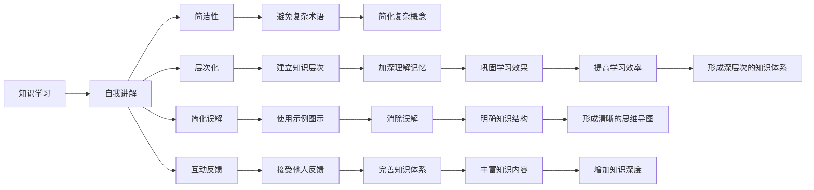

                 

# 费曼学习法的误解与真相

> 关键词：费曼学习法, 深度学习, 人工智能, 学习理解, 学习效率, 教育科技, 学习方法论

## 1. 背景介绍

### 1.1 问题由来

费曼学习法（The Feynman Technique）由诺贝尔奖得主理查德·费曼（Richard Feynman）所创造，是一种以自我讲解为核心的学习策略。其主要思想是通过将知识讲给他人，来加深自身的理解和掌握。在当今知识爆炸和终身学习的背景下，费曼学习法被广泛推崇，成为提高学习效率和效果的重要方法。

然而，在实际应用过程中，费曼学习法也面临着诸多误解与争议。例如，有人认为费曼学习法只适用于理论知识，而不适用于实践技能；有人质疑费曼学习法是否适用于所有学科领域；也有人担心费曼学习法耗时过长，效率低下。

为了深入理解费曼学习法，本文将对其核心概念和应用方法进行详细阐述，澄清常见误解，揭示其真谛。

### 1.2 问题核心关键点

费曼学习法的核心在于通过自我讲解来加深学习理解，提升知识掌握。关键点包括：
- 自我讲解：通过将知识讲给他人，加深对知识的理解和记忆。
- 简洁性：讲解时使用简洁明了的语言，避免过于复杂和专业的术语。
- 层次化：从基础概念讲起，逐步深入，建立知识的层级关系。
- 简化误解：通过举例子、画图示意等方式，消除对知识的误解。
- 互动反馈：讲解后，向他人提问，接受反馈，进一步修正和强化知识。

这些关键点共同构成费曼学习法的精髓，其目的是通过自我讲解的方式，促进知识的深度理解和掌握。

## 2. 核心概念与联系

### 2.1 核心概念概述

费曼学习法是一种基于深度理解和知识解释的学习策略，其核心思想是通过自我讲解来巩固和深化知识。以下是费曼学习法的主要概念和原理：

1. **自我讲解**：学习者将自己所学知识用简单的语言解释给他人听，以加深理解和记忆。
2. **简洁性**：讲解时避免使用复杂的术语和概念，用最朴素的方式表达。
3. **层次化**：从基础概念讲起，逐步深入，建立知识的层级关系。
4. **简化误解**：通过具体示例和图示，消除对知识的误解和疑惑。
5. **互动反馈**：与他人互动，接受反馈，进一步完善知识。

### 2.2 核心概念原理和架构的 Mermaid 流程图

这个流程图展示了费曼学习法的核心流程和原理：
1. 学习者首先进行知识学习（A）。
2. 然后通过自我讲解（B）来巩固和深化知识。
3. 自我讲解过程中，学习者需要注意简洁性（C），避免使用复杂的术语。
4. 将知识分层化（D），从基础概念讲起，逐步深入。
5. 使用示例图示（E）来简化误解。
6. 与他人互动，接受反馈（F），进一步完善知识。
7. 通过简化复杂概念（G）和丰富知识内容（Q），加深理解记忆（L）。
8. 最终形成清晰的思维导图（S）和深层次的知识体系（U），提高学习效率（R）。

## 3. 核心算法原理 & 具体操作步骤

### 3.1 算法原理概述

费曼学习法的核心在于通过自我讲解来巩固和深化知识。其基本原理是通过将知识讲给他人，加深对知识的理解和记忆。这一过程不仅促进了知识的深度理解，还能揭示学习者对知识的误解，帮助其消除疑惑。

### 3.2 算法步骤详解

1. **知识学习**：首先进行基础知识的学习，掌握相关概念和原理。这一步可以通过阅读书籍、观看视频、参加课程等多种方式完成。

2. **自我讲解**：选择一段知识进行讲解。可以是书中的章节、视频的内容、课程的讲义等。

3. **简洁性**：在讲解时，避免使用过于复杂的术语和概念，用最朴素、直观的语言表达。如果发现有难以理解的地方，可以暂停下来，重新学习相关内容。

4. **层次化**：将知识分层化，从基础概念讲起，逐步深入，建立知识的层级关系。这一步可以通过绘制思维导图或使用结构化笔记的方式来实现。

5. **简化误解**：使用具体示例、图示、故事等，帮助自己更好地理解知识。可以通过画图、做笔记、写博客等方式进行。

6. **互动反馈**：将讲解的内容分享给他人，接受反馈和提问。这可以是对同学、同事、朋友或互联网上的社区。通过互动反馈，可以进一步完善和深化知识。

7. **重复迭代**：根据他人的反馈和提问，不断完善和调整讲解内容，直至自己完全掌握相关知识。

### 3.3 算法优缺点

费曼学习法的优点包括：
- 提升深度理解：通过自我讲解，学习者能够更深入地理解和掌握知识。
- 消除误解：通过简洁和图示，帮助学习者消除对知识的误解和疑惑。
- 提高记忆效率：通过多次讲解，加深记忆，巩固知识。

其缺点包括：
- 耗时较长：费曼学习法需要花费大量时间进行讲解和互动。
- 适用范围有限：对于一些需要实际操作的实践技能，费曼学习法的效果可能不如实验练习。
- 需要他人反馈：费曼学习法需要与他人互动，获取反馈。在找不到合适的讲解对象时，可能会遇到障碍。

### 3.4 算法应用领域

费曼学习法不仅适用于理论知识的学习，也适用于实践技能的提升。其应用领域包括但不限于：
- 编程和软件开发：通过自我讲解代码实现过程，加深对编程语言的理解。
- 数据分析和统计学：通过讲解数据处理流程，提升数据分析能力。
- 科学研究和技术开发：通过讲解实验设计和结果分析，深化对科学技术的理解。
- 教育培训和教师发展：通过讲解教学方法和课程内容，提升教师的教学水平。
- 公共演讲和演示：通过自我讲解演示内容，提高公共演讲能力。

## 4. 数学模型和公式 & 详细讲解 & 举例说明

### 4.1 数学模型构建

费曼学习法是一种非数学化的学习方法，其核心在于通过自我讲解来加深知识理解。因此，费曼学习法不需要构建数学模型，但其过程可以通过一些简单的结构和图示来辅助说明。

### 4.2 公式推导过程

由于费曼学习法不涉及具体的数学公式推导，我们以一个简单的例子来展示其基本原理和步骤。

**示例**：假设我们学习到一个关于电路分析的知识点，其中包括电阻、电流、电压等基本概念。

1. **知识学习**：通过阅读电路分析的书籍或视频，掌握电阻、电流、电压等基础概念。
2. **自我讲解**：选择一个简单的电路模型进行讲解，如一个串联电路。
3. **简洁性**：用最朴素的语言解释电阻、电流、电压之间的关系。
4. **层次化**：从电阻的定义讲起，逐步深入，解释电阻如何影响电路的电流和电压。
5. **简化误解**：画图示意电路的结构，通过图示帮助理解。
6. **互动反馈**：将讲解的内容分享给同学，接受反馈和提问。
7. **重复迭代**：根据反馈和提问，不断完善和调整讲解内容。

### 4.3 案例分析与讲解

以编程语言学习为例，费曼学习法的操作步骤如下：

1. **知识学习**：学习编程语言的基本语法和概念，如变量、函数、循环等。
2. **自我讲解**：选择一个小程序进行讲解，如“Hello, World!”程序。
3. **简洁性**：用简单的语言解释程序的实现过程。
4. **层次化**：从变量定义讲起，逐步深入，解释函数调用和循环结构。
5. **简化误解**：画图或写代码注释，帮助理解程序的逻辑结构。
6. **互动反馈**：将讲解的内容分享给编程学习小组，接受反馈和提问。
7. **重复迭代**：根据反馈和提问，不断完善和调整讲解内容。

## 5. 项目实践：代码实例和详细解释说明

### 5.1 开发环境搭建

为了实践费曼学习法，需要搭建一个适合学习和讲解的环境。以下是搭建开发环境的步骤：

1. **选择学习平台**：可以选择在线平台（如Coursera、edX）或本地计算机。
2. **安装学习工具**：安装必要的学习工具（如Markdown编辑器、思维导图工具）。
3. **配置讲解环境**：选择一个安静、舒适的环境，准备好笔、纸、白板等工具。
4. **获取学习资源**：下载相关书籍、视频、课程讲义等学习资源。

### 5.2 源代码详细实现

费曼学习法的实践不需要编写代码，但其操作步骤可以结合具体的编程任务进行讲解。以下是一个简单的例子：

**示例**：假设我们学习Python编程语言，可以使用以下步骤进行费曼学习法实践：

1. **知识学习**：阅读Python编程语言的书籍或视频教程。
2. **自我讲解**：选择一个简单的编程任务，如编写一个猜数字游戏程序。
3. **简洁性**：用最朴素的语言解释猜数字游戏的实现过程。
4. **层次化**：从变量定义讲起，逐步深入，解释条件判断和循环结构。
5. **简化误解**：画图或写代码注释，帮助理解程序的逻辑结构。
6. **互动反馈**：将讲解的内容分享给编程学习小组，接受反馈和提问。
7. **重复迭代**：根据反馈和提问，不断完善和调整讲解内容。

### 5.3 代码解读与分析

由于费曼学习法的实践不需要编写代码，我们重点关注如何通过自我讲解和互动反馈来加深理解和掌握知识。以下是一些关键点：

1. **自我讲解**：讲解时用简单、朴素的语言，避免使用过于专业的术语。
2. **层次化**：逐步深入，建立知识的层级关系。
3. **简化误解**：使用图示、示例等，帮助理解复杂的概念。
4. **互动反馈**：接受他人反馈，进一步完善和深化知识。
5. **重复迭代**：根据反馈不断调整和完善讲解内容。

### 5.4 运行结果展示

由于费曼学习法的实践主要依赖于自我讲解和互动反馈，因此没有具体的运行结果展示。但可以通过以下方式来评估其效果：
- **自我评价**：通过自我讲解的过程，加深对知识的理解。
- **他人反馈**：通过互动反馈，了解他人对讲解的理解和疑问，进一步完善知识。

## 6. 实际应用场景

### 6.1 编程和软件开发

费曼学习法在编程和软件开发中非常适用。通过自我讲解代码实现过程，加深对编程语言的理解，提升编码能力。

### 6.2 数据分析和统计学

在数据分析和统计学中，费曼学习法可以帮助学习者理解数据处理流程，提升数据处理能力。

### 6.3 科学研究和技术开发

通过自我讲解实验设计和结果分析，加深对科学技术的理解，提升研究能力。

### 6.4 教育培训和教师发展

在教育培训和教师发展中，费曼学习法可以帮助教师掌握教学方法和课程内容，提升教学水平。

### 6.5 公共演讲和演示

通过自我讲解演示内容，提升公共演讲能力，增强演示效果。

## 7. 工具和资源推荐

### 7.1 学习资源推荐

以下是一些推荐的费曼学习法学习资源：

1. **《费曼学习法：深度学习编程指南》**：该书详细介绍了费曼学习法在编程中的应用，提供了大量的实践案例。
2. **《深度学习入门：基于费曼学习法》**：该书结合深度学习入门内容，介绍了如何通过费曼学习法来理解和掌握深度学习知识。
3. **Coursera上的《学习如何学习》课程**：该课程由费曼学习法的创始人之一理查德·费曼的弟子讲解，详细介绍了费曼学习法的基本原理和操作步骤。

### 7.2 开发工具推荐

以下是一些推荐的费曼学习法开发工具：

1. **Markdown编辑器**：如Typora、GitHub Pages，适合编写和发布笔记。
2. **思维导图工具**：如XMind、MindMeister，适合建立知识的层级关系。
3. **绘图工具**：如Draw.io、Inkscape，适合绘制图示和流程图。

### 7.3 相关论文推荐

以下是几篇关于费曼学习法的研究论文，推荐阅读：

1. **《费曼学习法在深度学习中的应用》**：详细介绍了费曼学习法在深度学习中的实践方法和效果。
2. **《基于费曼学习法的知识图谱构建方法》**：提出了一种结合费曼学习法的知识图谱构建方法，通过自我讲解和互动反馈，构建知识图谱。
3. **《费曼学习法在教育培训中的应用》**：探讨了费曼学习法在教育培训中的应用，提出了一些改进建议。

## 8. 总结：未来发展趋势与挑战

### 8.1 研究成果总结

费曼学习法作为一种深度理解和知识解释的学习策略，已经在多个领域得到了广泛应用，取得了显著效果。其核心在于通过自我讲解来加深知识理解，提升学习效率和效果。

### 8.2 未来发展趋势

费曼学习法的未来发展趋势包括：
- **多模态学习**：结合图像、声音等多模态数据，提升学习效果。
- **自适应学习**：根据学习者的反馈和进展，动态调整学习内容和方式。
- **社会化学习**：通过在线社区和协作工具，促进学习者之间的互动和交流。

### 8.3 面临的挑战

费曼学习法在应用过程中也面临一些挑战：
- **时间和资源成本高**：自我讲解和互动反馈需要大量时间和精力。
- **需要专业工具支持**：缺乏有效的工具支持，难以实现高效和规范的学习。
- **适用性有限**：对于一些需要实践操作的技能，费曼学习法的效果可能不如实验练习。

### 8.4 研究展望

未来的研究可以从以下几个方向进行：
- **技术集成**：结合人工智能和机器学习技术，提升学习效果和效率。
- **教育应用**：探索费曼学习法在教育培训中的应用，提升教育质量。
- **跨领域应用**：拓展费曼学习法的应用范围，涵盖更多学科领域。

## 9. 附录：常见问题与解答

**Q1：费曼学习法只适用于理论知识，不适用于实践技能。**

A: 费曼学习法不仅适用于理论知识，也适用于实践技能的提升。通过自我讲解和互动反馈，学习者可以更好地理解和掌握实践技能。例如，在编程中，通过自我讲解代码实现过程，可以加深对编程语言的理解，提升编码能力。

**Q2：费曼学习法耗时较长，效率低下。**

A: 费曼学习法需要花费大量时间进行自我讲解和互动反馈，但通过多次讲解和深入理解，可以大大提高学习效率和效果。同时，结合在线工具和协作平台，可以进一步提升学习的规范性和效率。

**Q3：费曼学习法适用范围有限，只适用于科学和技术领域。**

A: 费曼学习法适用于多个学科领域，包括编程、数据分析、科学研究、教育培训等。通过自我讲解和互动反馈，学习者可以更深入地理解和掌握知识，提升学习效果。

**Q4：费曼学习法需要他人反馈，难以找到合适的讲解对象。**

A: 费曼学习法可以通过在线社区、学习小组等方式获取他人的反馈和互动。同时，也可以通过录制视频、分享博客等方式进行自我反馈和改进。

**Q5：费曼学习法的数学模型和公式推导如何构建？**

A: 费曼学习法主要依赖于自我讲解和互动反馈，不需要构建数学模型和公式推导。但其基本原理和操作步骤可以通过图示、案例分析等方式进行说明和解释。

---

作者：禅与计算机程序设计艺术 / Zen and the Art of Computer Programming

