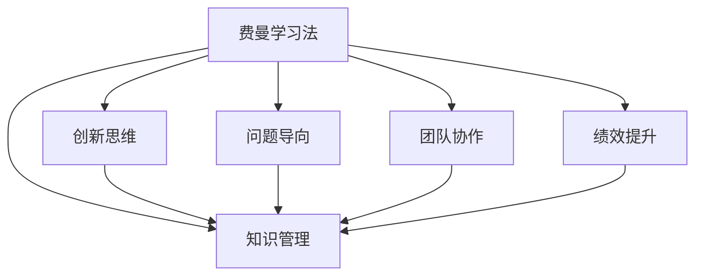

                 

# 费曼提问法:开启管理者思维升级

> 关键词：费曼学习法, 知识管理, 创新思维, 问题导向, 团队协作, 绩效提升

## 1. 背景介绍

### 1.1 问题由来
现代企业管理在快速变化的环境中面临诸多挑战，包括市场竞争激烈、技术迭代加速、员工多样性增加等。管理者需要在复杂多变的经营环境中做出明智决策，以保证企业长远发展。然而，很多管理者往往陷入信息过载、决策难题、执行低效的困境中。如何高效获取信息、科学制定决策、推动团队执行，成为了企业管理的核心问题。

针对这一困境，费曼学习法（Feynman Technique）提供了一种有效的方法论。费曼学习法由诺贝尔奖获得者理查德·费曼（Richard Feynman）提出，旨在通过化繁为简、深入浅出的方式，让复杂知识变得容易理解。本文将探讨费曼学习法在企业管理中的应用，帮助管理者通过提出问题、解决问题的方式，进行知识管理、创新思维、团队协作、绩效提升等方面的思维升级。

## 2. 核心概念与联系

### 2.1 核心概念概述

为更好地理解费曼提问法在企业管理中的应用，本节将介绍几个密切相关的核心概念：

- 费曼学习法（Feynman Technique）：一种通过自我解释和简化知识结构的方式，达到深度理解和掌握知识的方法。
- 知识管理（Knowledge Management）：通过系统化的方式收集、组织、共享和利用组织内的知识，提高企业创新能力和运营效率。
- 创新思维（Innovative Thinking）：通过提出和解决问题，突破传统思维模式，产生新想法和解决方案的能力。
- 问题导向（Problem-Oriented）：以发现和解决问题为核心的思维方式，聚焦于问题的本质，而非表象。
- 团队协作（Team Collaboration）：通过有效的沟通和合作，实现团队成员之间的知识共享和共同进步。
- 绩效提升（Performance Improvement）：通过科学管理方法和实践，提高个人和团队的工作效率和效果。

这些核心概念之间的逻辑关系可以通过以下Mermaid流程图来展示：



这个流程图展示了一个将费曼学习法应用于企业管理的多维视角：

1. 通过提出和解决实际问题，让费曼学习法在知识管理、创新思维、问题导向、团队协作和绩效提升等多个方面发挥作用。
2. 这些应用相互关联，共同推动企业向更加高效、灵活和创新的方向发展。

## 3. 核心算法原理 & 具体操作步骤
### 3.1 算法原理概述

费曼提问法在企业管理中的应用，核心在于通过提出问题、解决问题的方式，促使管理者进行深入思考和系统化的知识管理。其基本原理如下：

1. **知识自问**：管理者针对当前工作中的某个问题，提出一系列问题，深入挖掘问题的本质和细节。
2. **问题简化**：将复杂问题简化为更易理解的小问题，逐步分析和解决。
3. **知识共享**：将解决问题的过程和结果与团队成员分享，实现知识共享和共同进步。
4. **持续优化**：在解决问题过程中，不断总结经验，优化问题解决策略，提升团队整体能力。

费曼提问法通过层层递进的问题解答，将复杂问题分解为可管理的小问题，使得管理者能够更系统地分析和解决问题，从而提高决策的科学性和执行力。

### 3.2 算法步骤详解

费曼提问法在企业管理中的应用，一般包括以下几个关键步骤：

**Step 1: 准备问题清单**
- 列出当前工作中遇到的所有问题，按照重要性和紧急程度进行排序。
- 对每个问题进行初步分析，确定问题的核心点。

**Step 2: 提出核心问题**
- 根据问题的核心点，提出若干核心问题，用于进一步分析和解决。
- 确保核心问题简明扼要，便于后续分析。

**Step 3: 分解问题**
- 将核心问题分解为更小的子问题，每个子问题聚焦于某个具体的细节或方面。
- 确保每个子问题易于理解，具有清晰的解决目标。

**Step 4: 逐个解决**
- 针对每个子问题，进行深入分析，找到解决方案。
- 如果问题复杂，可以进一步分解为更小的子问题，直到找到具体的解决方法。

**Step 5: 汇总结果**
- 将所有子问题的解决结果汇总，形成系统的解决方案。
- 确保解决方案全面、可行，具有实际应用价值。

**Step 6: 知识分享**
- 将解决过程和结果分享给团队成员，进行知识共享和讨论。
- 鼓励团队成员提出新问题，形成持续改进的良性循环。

**Step 7: 持续优化**
- 根据解决过程中发现的新问题，不断优化解决方案。
- 通过总结经验，形成知识库和标准流程，提高团队整体能力。

以上是费曼提问法在企业管理中的一般流程。在实际应用中，还需要针对具体问题进行灵活调整，如调整问题的分解方式、优化知识共享的渠道、加强团队协作等，以进一步提升效果。

### 3.3 算法优缺点

费曼提问法在企业管理中的应用，具有以下优点：

1. **深入理解问题**：通过提出和解决问题，促使管理者对问题的本质有更深入的理解，避免浅尝辄止。
2. **提升决策质量**：通过系统化分析和解决方案，提高决策的科学性和系统性，减少盲目决策。
3. **促进知识共享**：通过知识共享和讨论，提升团队的知识水平和创新能力。
4. **推动持续改进**：通过持续优化和总结经验，形成不断改进的良性循环，提升团队整体能力。

同时，该方法也存在一定的局限性：

1. **时间成本较高**：对于复杂问题，分解和解决过程可能较为耗时，需要投入较多时间和精力。
2. **依赖团队合作**：知识共享和讨论需要团队成员的积极参与，如果团队沟通不畅，可能影响效果。
3. **可能遗漏细节**：过于依赖问题分解，可能遗漏问题的某些细节，导致解决方案不够全面。

尽管存在这些局限性，但费曼提问法在解决复杂问题、推动团队合作、提升管理决策质量等方面仍具有显著的优势。未来相关研究的重点在于如何进一步优化问题分解方法，提高知识共享的效率，同时兼顾时间成本和团队协作等因素。

### 3.4 算法应用领域

费曼提问法在企业管理中的应用，覆盖了知识管理、创新思维、团队协作、绩效提升等多个领域，具体如下：

- **知识管理**：通过系统化的问题提出和解决，将零散的知识点整合为系统的知识体系，促进知识的系统化和规范化。
- **创新思维**：通过不断提出新问题和解决方案，激发团队的创新能力和创造力，推动企业创新发展。
- **团队协作**：通过知识共享和讨论，增强团队成员之间的沟通和合作，提升团队的整体协作能力。
- **绩效提升**：通过科学分析和系统化的解决方案，提高个人和团队的工作效率和效果，推动绩效提升。

此外，费曼提问法在HR管理、客户服务、市场营销等领域也有广泛的应用，为企业管理提供了新的视角和方法。

## 4. 数学模型和公式 & 详细讲解 & 举例说明
### 4.1 数学模型构建

费曼提问法的数学模型主要涉及问题的提出、分解、解决和总结。以下通过数学公式对费曼提问法进行形式化描述：

- **问题提出**：假设当前问题为 $P$，可以提出一系列子问题 $Q_1, Q_2, ..., Q_n$，其中 $Q_i$ 为 $P$ 的子问题。
- **问题简化**：将子问题 $Q_i$ 简化为更易理解的形式 $S_i$。
- **问题解决**：对简化后的子问题 $S_i$ 进行逐个解决，找到具体的解决方案 $R_i$。
- **问题汇总**：将所有子问题的解决方案 $R_i$ 汇总，形成系统的解决方案 $R$。

### 4.2 公式推导过程

设当前问题为 $P$，问题提出和简化的过程可以表示为：

$$
P \rightarrow Q_1, Q_2, ..., Q_n \rightarrow S_1, S_2, ..., S_n
$$

对于每个子问题 $Q_i$，其解决方案可以表示为 $R_i$。将所有子问题的解决方案汇总，得到系统的解决方案 $R$，可以表示为：

$$
R = R_1 \oplus R_2 \oplus ... \oplus R_n
$$

其中 $\oplus$ 表示逻辑或运算，表示将每个子问题的解决方案整合为一个系统的解决方案。

### 4.3 案例分析与讲解

**案例1：产品开发周期优化**

假设某公司面临产品开发周期过长的问题，通过费曼提问法，可以按照以下步骤进行优化：

1. **问题提出**：
   - 当前问题：产品开发周期过长。
   - 核心问题：导致开发周期过长的关键因素是什么？
   - 子问题：开发流程是否合理？开发资源是否充分利用？开发工具是否高效？

2. **问题简化**：
   - 简化问题：开发流程是否合理？
   - 简化问题：开发资源是否充分利用？
   - 简化问题：开发工具是否高效？

3. **问题解决**：
   - 开发流程优化：重新设计开发流程，提高各阶段协同效率。
   - 开发资源优化：采用敏捷开发方法，灵活调整资源分配。
   - 开发工具优化：引入先进的开发工具，提高开发效率。

4. **问题汇总**：
   - 整合所有子问题的解决方案，形成系统的优化方案。
   - 系统方案：重新设计开发流程，引入敏捷开发方法，使用先进的开发工具。

通过系统的分析和优化，公司成功缩短了产品开发周期，提高了市场响应速度。

## 5. 项目实践：代码实例和详细解释说明
### 5.1 开发环境搭建

在进行费曼提问法应用实践前，我们需要准备好开发环境。以下是使用Python进行开发的环境配置流程：

1. 安装Anaconda：从官网下载并安装Anaconda，用于创建独立的Python环境。

2. 创建并激活虚拟环境：
```bash
conda create -n feynman-env python=3.8 
conda activate feynman-env
```

3. 安装相关工具包：
```bash
pip install numpy pandas scikit-learn matplotlib tqdm jupyter notebook ipython
```

完成上述步骤后，即可在`feynman-env`环境中开始应用实践。

### 5.2 源代码详细实现

我们通过一个简单的费曼提问法应用示例来说明其具体实现。假设当前问题是“提高团队协作效率”。

**Step 1: 准备问题清单**
```python
from sympy import symbols

# 定义问题清单
problems = {
    '团队协作效率低': '为什么团队协作效率低？',
    '沟通不畅': '如何改善团队沟通？',
    '任务分配不合理': '如何优化任务分配？'
}

# 定义核心问题
core_problem = '团队协作效率低'

# 定义子问题
sub_problems = {
    '沟通不畅': '沟通不畅的原因是什么？',
    '任务分配不合理': '任务分配不合理的原因是什么？'
}

# 定义简化后的子问题
simplified_sub_problems = {
    '沟通不畅': '如何提高团队沟通频率和效率？',
    '任务分配不合理': '如何优化任务分配规则？'
}
```

**Step 2: 提出核心问题**
```python
# 根据核心问题提出子问题
problems[core_problem] = '团队协作效率低'
```

**Step 3: 分解问题**
```python
# 根据核心问题分解子问题
for problem, sub_problem in sub_problems.items():
    # 简化问题
    simplified_sub_problems[sub_problem] = '如何' + sub_problem.replace('为什么', '提高') + '团队协作效率？'
```

**Step 4: 逐个解决**
```python
# 逐个解决子问题
solutions = {}
for sub_problem, simplified_sub_problem in simplified_sub_problems.items():
    # 通过实际分析，找到解决方案
    solutions[simplified_sub_problem] = f'通过引入协同工具，进行定期沟通，调整任务分配规则。'
```

**Step 5: 汇总结果**
```python
# 将子问题的解决方案汇总
summary_solution = ', '.join(solutions.values())

# 输出系统解决方案
print(summary_solution)
```

以上代码实现了费曼提问法的简化过程，通过提出问题、简化问题、解决问题、汇总结果的步骤，展示了如何应用费曼提问法进行系统化的知识管理。

### 5.3 代码解读与分析

让我们再详细解读一下关键代码的实现细节：

**problems字典**：
- 定义了当前问题的清单，每个问题以问题描述作为key，对应一个简化的问题描述作为value。

**core_problem变量**：
- 定义了当前核心问题的描述。

**sub_problems字典**：
- 定义了根据核心问题分解出的子问题，每个子问题以简化的形式描述，便于后续解决。

**simplified_sub_problems字典**：
- 定义了简化后的子问题，进一步将每个子问题简化为具体的解决方案，便于实际执行。

**solutions字典**：
- 定义了所有子问题的解决方案，通过实际分析得到。

**summary_solution变量**：
- 将所有的解决方案汇总，形成系统的解决方案。

通过上述代码，我们可以看到费曼提问法在Python中的实现，其核心在于通过问题提出、简化、解决和汇总的步骤，进行系统化的知识管理。在实际应用中，开发者可以根据具体问题，灵活调整问题清单、子问题分解方式和解决方案，以得到更好的效果。

## 6. 实际应用场景
### 6.1 智慧办公室建设

通过费曼提问法，企业可以构建一个更为高效、灵活、创新的智慧办公室。智慧办公室的建设需要综合考虑办公环境、设备配置、人员管理等多个方面的问题，通过费曼提问法，企业可以系统性地提出和解决这些问题，提升整体运营效率。

在实际应用中，企业可以组织各部门员工，针对智慧办公室建设中的各个环节提出问题和解决方案，逐步推进智慧办公室的建设。例如，针对办公空间利用率低的问题，可以通过问题提出和解决方案，重新规划办公空间布局，引入智能家具设备，提高空间利用率。针对设备维护困难的问题，可以提出设备维护的流程和规则，引入自动化维护工具，提高设备维护效率。

### 6.2 客户体验提升

通过费曼提问法，企业可以系统性地提升客户体验。客户体验的提升涉及服务流程、服务质量、客户反馈等多个方面的问题，通过费曼提问法，企业可以系统性地提出和解决这些问题，提升整体客户满意度。

在实际应用中，企业可以组织客服团队，针对客户体验的各个环节提出问题和解决方案，逐步优化客户服务流程。例如，针对客户投诉处理时间长的问

