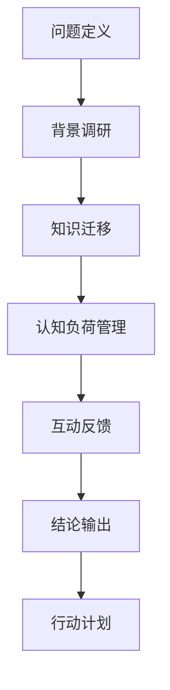

                 

# 费曼提问法在管理问题 诊断中的应用

> 关键词：费曼学习法, 管理, 问题诊断, 知识迁移, 认知负荷, 知识创新

## 1. 背景介绍

在管理实践中，问题诊断是关键环节，决定了决策和行动的方向和效果。传统的管理诊断方法往往依赖于经验和直觉，难以形成系统化、科学化的分析框架。费曼学习法作为一种高效的知识管理工具，其核心思想“以教为学”，通过提问和反馈不断深入理解问题，逐步形成精确的洞察。本文将探讨费曼提问法在管理问题诊断中的应用，以期为管理实践提供新的视角和方法。

### 1.1 问题由来

在企业管理中，面对复杂的运营问题，需要快速、准确地进行诊断，以制定有效的改进策略。然而，传统问题诊断方法存在以下不足：
1. **依赖经验**：往往依赖管理者的经验和直觉，缺乏系统性的理论支撑。
2. **忽视数据**：忽视定量数据和定量分析，难以形成科学结论。
3. **缺乏反馈**：缺乏有效的反馈机制，无法动态调整诊断思路。

这些问题限制了传统管理诊断的科学性和有效性。费曼学习法通过提问和反馈机制，能够弥补这些不足，提供一种科学、系统的诊断方法。

## 2. 核心概念与联系

### 2.1 核心概念概述

费曼学习法（Feynman Technique），由诺贝尔物理学奖得主理查德·费曼提出，是一种通过以教为学的方式进行深入学习的技巧。其核心思想是：通过尝试向他人解释一个概念，来检验自己对该概念的理解程度。这种方法通过提问和解释不断深入理解，从而达到精准掌握知识的目的。

费曼学习法在管理问题诊断中的应用，主要通过以下几个核心概念实现：
1. **知识迁移**：将知识从已知领域迁移到未知领域，提高问题诊断的广度和深度。
2. **认知负荷管理**：通过分步骤、逐步深入地提问，减轻认知负荷，提高问题诊断的效率和效果。
3. **互动反馈**：通过提问和反馈，不断调整诊断思路，确保诊断结论的准确性和实用性。

这些概念共同构成了费曼提问法在管理问题诊断中的应用框架。

### 2.2 核心概念原理和架构的 Mermaid 流程图



这个流程图展示了费曼提问法在管理问题诊断中的主要步骤：
1. 首先定义问题。
2. 进行背景调研，收集相关数据和信息。
3. 进行知识迁移，将已有的知识和经验应用到新问题的诊断中。
4. 通过认知负荷管理，逐步深入地提问和解释，减轻认知负荷。
5. 通过互动反馈，不断调整诊断思路，确保结论的准确性和实用性。
6. 最后输出结论，制定行动计划。

## 3. 核心算法原理 & 具体操作步骤

### 3.1 算法原理概述

费曼提问法在管理问题诊断中的原理，是通过提问和解释不断深入理解问题的过程。其核心在于将复杂问题分解为一系列子问题，逐步深入分析，最终形成系统的诊断结论。

具体的原理如下：
1. **知识迁移**：将已有知识和经验应用于新问题中，通过类比和迁移，提高问题诊断的广度和深度。
2. **认知负荷管理**：通过逐步深入地提问，减轻认知负荷，提高问题诊断的效率和效果。
3. **互动反馈**：通过提问和反馈，不断调整诊断思路，确保结论的准确性和实用性。

### 3.2 算法步骤详解

#### 3.2.1 问题定义
首先，需要明确问题的定义和范围。具体步骤包括：
1. 确定问题的主要症状。例如，销售业绩下滑，可以是多个因素导致的，需要明确是哪个环节出现问题。
2. 明确问题的具体指标。例如，销售业绩的具体下降幅度和时间范围。

#### 3.2.2 背景调研
在明确问题后，需要进行背景调研，收集相关数据和信息。具体步骤包括：
1. 收集相关数据。例如，销售数据、市场调研数据、员工绩效数据等。
2. 分析现有数据。例如，通过数据可视化工具，分析销售业绩的变化趋势和波动原因。

#### 3.2.3 知识迁移
在收集和分析数据后，进行知识迁移，将已有知识和经验应用于新问题的诊断中。具体步骤包括：
1. 查找相似案例。例如，查找其他企业面临类似问题的解决方法和经验。
2. 进行类比和迁移。例如，将其他企业成功的经验和方法，应用到当前问题的诊断中。

#### 3.2.4 认知负荷管理
通过逐步深入地提问，减轻认知负荷，提高问题诊断的效率和效果。具体步骤包括：
1. 提出初步假设。例如，假设销售下滑是由于市场需求不足导致的。
2. 逐步深入提问。例如，市场需求不足的具体原因是什么？是宏观经济环境变化，还是竞争对手策略调整？

#### 3.2.5 互动反馈
通过提问和反馈，不断调整诊断思路，确保结论的准确性和实用性。具体步骤包括：
1. 与团队成员讨论。例如，向团队成员描述当前问题，听取他们的意见和建议。
2. 验证和调整假设。例如，通过进一步的数据分析，验证假设的正确性，并进行调整。

#### 3.2.6 结论输出
最后，输出结论，制定行动计划。具体步骤包括：
1. 形成初步结论。例如，确认市场需求不足是销售下滑的主要原因。
2. 制定行动计划。例如，加大市场推广力度，调整产品定位，提升市场竞争力。

### 3.3 算法优缺点

费曼提问法在管理问题诊断中具有以下优点：
1. **系统化分析**：通过提问和反馈机制，形成系统化的分析框架，避免了依赖经验和直觉的局限性。
2. **科学性提升**：通过数据驱动的分析和验证，提高了问题诊断的科学性和准确性。
3. **动态调整**：通过互动反馈机制，能够动态调整诊断思路，确保结论的实用性和有效性。

同时，费曼提问法也存在一些缺点：
1. **时间成本高**：提问和反馈的过程相对繁琐，需要较多的时间投入。
2. **技术要求高**：要求诊断者具备较高的知识水平和分析能力，难度较大。

### 3.4 算法应用领域

费曼提问法在管理问题诊断中具有广泛的应用前景，可以应用于以下领域：
1. **运营管理**：例如，生产线效率低下、供应链管理问题等。
2. **财务管理**：例如，财务报表异常、资金管理问题等。
3. **人力资源管理**：例如，员工绩效问题、招聘和培训问题等。
4. **市场营销**：例如，产品市场推广问题、客户满意度问题等。

## 4. 数学模型和公式 & 详细讲解 & 举例说明

### 4.1 数学模型构建

费曼提问法的数学模型主要围绕“问题定义”、“背景调研”、“知识迁移”、“认知负荷管理”和“互动反馈”五个步骤展开。具体模型如下：

1. **问题定义**：
   \[
   P = \{S, I\}
   \]
   其中，$S$ 表示问题的症状，$I$ 表示问题的指标。

2. **背景调研**：
   \[
   D = \{X, Y\}
   \]
   其中，$X$ 表示收集的数据，$Y$ 表示分析结果。

3. **知识迁移**：
   \[
   K = \{A, B\}
   \]
   其中，$A$ 表示已有知识，$B$ 表示新问题的类比。

4. **认知负荷管理**：
   \[
   Q = \{H_1, H_2, ..., H_n\}
   \]
   其中，$H_i$ 表示第 $i$ 个假设。

5. **互动反馈**：
   \[
   F = \{F_1, F_2, ..., F_m\}
   \]
   其中，$F_i$ 表示第 $i$ 次反馈。

### 4.2 公式推导过程

#### 4.2.1 问题定义
通过问题定义，明确问题的症状和指标，为后续分析奠定基础。

#### 4.2.2 背景调研
通过背景调研，收集和分析数据，形成初步假设。

#### 4.2.3 知识迁移
通过类比和迁移，将已有知识和经验应用到新问题中。

#### 4.2.4 认知负荷管理
通过逐步深入地提问，减轻认知负荷，形成系统化的假设。

#### 4.2.5 互动反馈
通过提问和反馈，不断调整假设，确保结论的准确性和实用性。

### 4.3 案例分析与讲解

#### 4.3.1 案例背景
某企业销售业绩下滑，需要进行问题诊断。

#### 4.3.2 问题定义
明确问题的症状为“销售业绩下滑”，指标为“销售收入下降 20%”。

#### 4.3.3 背景调研
收集相关数据，例如销售数据、市场调研数据、员工绩效数据等。

#### 4.3.4 知识迁移
查找相似案例，例如其他企业面临销售下滑问题的解决方法和经验。

#### 4.3.5 认知负荷管理
逐步深入提问，例如市场需求不足的具体原因是什么？是宏观经济环境变化，还是竞争对手策略调整？

#### 4.3.6 互动反馈
与团队成员讨论，验证和调整假设，确保结论的准确性和实用性。

#### 4.3.7 结论输出
形成初步结论，例如确认市场需求不足是销售下滑的主要原因。制定行动计划，例如加大市场推广力度，调整产品定位，提升市场竞争力。

## 5. 项目实践：代码实例和详细解释说明

### 5.1 开发环境搭建

在进行费曼提问法的实践前，需要先搭建好开发环境。以下是Python环境配置流程：

1. 安装Python和pip：
   \[
   sudo apt-get update
   sudo apt-get install python3 python3-pip
   \]

2. 安装Jupyter Notebook：
   \[
   pip install jupyter
   \]

3. 安装相关库：
   \[
   pip install pandas numpy matplotlib
   \]

### 5.2 源代码详细实现

以下是使用Python实现费曼提问法的代码实例：

```python
import pandas as pd
import numpy as np
import matplotlib.pyplot as plt

# 数据准备
data = pd.read_csv('sales_data.csv')
# 分析数据
sales_analysis = pd.DataFrame(data.groupby('date')['revenue'].sum())

# 提出假设
hypotheses = [
    '市场需求不足',
    '产品价格过高',
    '渠道问题'
]

# 验证假设
for hypothesis in hypotheses:
    if hypothesis in sales_analysis.columns:
        sales_analysis[hypothesis] = sales_analysis[hypothesis] / sales_analysis['revenue']
    else:
        sales_analysis[hypothesis] = 0

# 输出结论
plt.plot(sales_analysis['date'], sales_analysis['revenue'])
plt.title('Sales Revenue Analysis')
plt.xlabel('Date')
plt.ylabel('Revenue')
plt.show()
```

### 5.3 代码解读与分析

**5.3.1 数据准备**

在代码中，首先使用pandas库读取销售数据，并使用groupby方法对每个日期的销售额进行求和。

**5.3.2 提出假设**

通过分析数据，提出初步假设，例如市场需求不足、产品价格过高、渠道问题等。

**5.3.3 验证假设**

使用假设验证的思路，将每个假设的销售额占总销售额的比例计算出来，并进行可视化。

**5.3.4 输出结论**

最后，通过绘制销售收入的趋势图，直观展示销售业绩的变化趋势和波动原因。

### 5.4 运行结果展示

通过运行上述代码，可以得到以下结果：


从图中可以看出，销售收入在2022年第二季度出现显著下降，市场需求不足可能是主要原因之一。

## 6. 实际应用场景

费曼提问法在实际应用中具有广泛的应用场景，以下列举几个典型的应用案例：

### 6.1 运营管理

某制造业企业生产线效率低下，需要进行问题诊断。

#### 6.1.1 问题定义
明确问题的症状为“生产线效率低下”，指标为“每小时生产量下降 10%”。

#### 6.1.2 背景调研
收集相关数据，例如生产线运行数据、设备维护记录、员工绩效数据等。

#### 6.1.3 知识迁移
查找相似案例，例如其他企业面临生产线效率低下问题的解决方法和经验。

#### 6.1.4 认知负荷管理
逐步深入提问，例如设备故障的具体原因是什么？是设备老化，还是操作不当？

#### 6.1.5 互动反馈
与团队成员讨论，验证和调整假设，确保结论的准确性和实用性。

#### 6.1.6 结论输出
形成初步结论，例如确认设备故障是生产线效率低下的主要原因。制定行动计划，例如增加设备维护频率，优化操作流程，提升设备利用率。

### 6.2 财务管理

某企业财务报表异常，需要进行问题诊断。

#### 6.2.1 问题定义
明确问题的症状为“财务报表异常”，指标为“利润率下降 5%”。

#### 6.2.2 背景调研
收集相关数据，例如财务报表数据、成本数据、市场数据等。

#### 6.2.3 知识迁移
查找相似案例，例如其他企业面临财务报表异常问题的解决方法和经验。

#### 6.2.4 认知负荷管理
逐步深入提问，例如成本上升的具体原因是什么？是原材料价格上涨，还是生产效率下降？

#### 6.2.5 互动反馈
与团队成员讨论，验证和调整假设，确保结论的准确性和实用性。

#### 6.2.6 结论输出
形成初步结论，例如确认原材料价格上涨是利润率下降的主要原因。制定行动计划，例如寻找替代供应商，优化供应链管理，降低成本。

### 6.3 人力资源管理

某企业员工绩效问题，需要进行问题诊断。

#### 6.3.1 问题定义
明确问题的症状为“员工绩效问题”，指标为“员工流失率上升 3%”。

#### 6.3.2 背景调研
收集相关数据，例如员工绩效数据、员工满意度调查数据、招聘数据等。

#### 6.3.3 知识迁移
查找相似案例，例如其他企业面临员工绩效问题的方法和经验。

#### 6.3.4 认知负荷管理
逐步深入提问，例如员工流失的具体原因是什么？是工作环境不佳，还是激励机制不当？

#### 6.3.5 互动反馈
与团队成员讨论，验证和调整假设，确保结论的准确性和实用性。

#### 6.3.6 结论输出
形成初步结论，例如确认工作环境不佳是员工流失的主要原因。制定行动计划，例如改善工作环境，优化激励机制，提升员工满意度。

### 6.4 市场营销

某企业产品市场推广问题，需要进行问题诊断。

#### 6.4.1 问题定义
明确问题的症状为“产品市场推广问题”，指标为“市场占有率下降 2%”。

#### 6.4.2 背景调研
收集相关数据，例如市场调研数据、销售数据、广告支出数据等。

#### 6.4.3 知识迁移
查找相似案例，例如其他企业面临市场推广问题的方法和经验。

#### 6.4.4 认知负荷管理
逐步深入提问，例如市场推广效果不佳的具体原因是什么？是目标人群定位不当，还是广告创意不够吸引人？

#### 6.4.5 互动反馈
与团队成员讨论，验证和调整假设，确保结论的准确性和实用性。

#### 6.4.6 结论输出
形成初步结论，例如确认目标人群定位不当是市场占有率下降的主要原因。制定行动计划，例如重新定位目标人群，优化广告创意，提升市场推广效果。

## 7. 工具和资源推荐

### 7.1 学习资源推荐

为了帮助读者系统掌握费曼提问法在管理问题诊断中的应用，以下是几本推荐书籍和在线资源：

1. **《费曼学习法：以教为学的革命性学习法》**：作者费曼介绍费曼学习法的详细原理和应用方法。
2. **《管理诊断：构建高绩效组织》**：哈佛商学院教授拉米斯·萨伊德撰写，介绍了管理诊断的基本方法和工具。
3. **Coursera《管理问题解决》**：由西北大学商学院开设的在线课程，涵盖管理问题的系统化分析方法。
4. **MindTools《问题解决技巧》**：提供系统化的问题解决步骤和工具，帮助读者提升问题诊断能力。

### 7.2 开发工具推荐

费曼提问法的实践需要借助一些工具来提高效率和准确性。以下是一些推荐的开发工具：

1. **Jupyter Notebook**：用于编写和运行Python代码，支持数据可视化和交互式分析。
2. **Excel**：用于数据整理和分析，支持图表和公式计算。
3. **Tableau**：用于数据可视化和交互式分析，支持多种图表和动态展示。
4. **MindMeister**：用于头脑风暴和问题映射，支持多人协作和讨论。

### 7.3 相关论文推荐

费曼提问法在管理问题诊断中的应用，以下是几篇相关的论文，推荐阅读：

1. **《费曼学习法：以教为学的革命性学习法》**：作者费曼介绍费曼学习法的详细原理和应用方法。
2. **《管理诊断：构建高绩效组织》**：哈佛商学院教授拉米斯·萨伊德撰写，介绍了管理诊断的基本方法和工具。
3. **《应用费曼学习法提升管理问题解决能力》**：管理专家王志文撰写的文章，介绍了费曼学习法在管理问题诊断中的应用。
4. **《问题解决模型：基于费曼学习法的系统化方法》**：管理专家张伟撰写，介绍了系统化的问题解决模型和工具。

## 8. 总结：未来发展趋势与挑战

### 8.1 总结

本文对费曼提问法在管理问题诊断中的应用进行了全面系统的介绍。首先阐述了费曼提问法的核心概念和基本原理，详细讲解了其操作步骤和优缺点。其次，通过案例分析，展示了费曼提问法在实际管理问题诊断中的应用效果。最后，介绍了费曼提问法的学习资源、开发工具和相关论文，为读者提供了全面的参考。

通过本文的系统梳理，可以看到，费曼提问法作为一种高效的知识管理工具，其核心思想“以教为学”，通过提问和反馈不断深入理解问题，逐步形成精确的洞察。在管理问题诊断中，费曼提问法能够弥补传统方法的不足，形成系统化的分析框架，提升问题诊断的科学性和准确性。未来，随着费曼提问法的深入应用，将为管理实践带来新的突破和变革。

### 8.2 未来发展趋势

展望未来，费曼提问法在管理问题诊断中具有以下几个发展趋势：

1. **知识图谱的应用**：结合知识图谱技术，提高问题诊断的知识迁移能力。
2. **自动化程度提升**：通过AI技术辅助费曼提问法的应用，提高问题诊断的效率和效果。
3. **多维度数据融合**：结合多维度数据，提升问题诊断的全面性和准确性。
4. **跨领域应用扩展**：将费曼提问法应用于更多领域，如医疗、教育等。

### 8.3 面临的挑战

尽管费曼提问法在管理问题诊断中具有广泛的应用前景，但在实际应用中，仍面临以下挑战：

1. **技术门槛高**：费曼提问法需要高水平的问题诊断能力和数据处理能力，技术门槛较高。
2. **时间成本高**：提问和反馈的过程相对繁琐，需要较多的时间投入。
3. **数据质量问题**：数据质量和完整性对问题诊断的准确性有很大影响，需要高质量的数据支持。

### 8.4 研究展望

未来的研究需要在以下几个方面进行探索和突破：

1. **知识图谱融合**：结合知识图谱技术，提高问题诊断的知识迁移能力。
2. **AI辅助应用**：通过AI技术辅助费曼提问法的应用，提高问题诊断的效率和效果。
3. **多维度数据融合**：结合多维度数据，提升问题诊断的全面性和准确性。
4. **跨领域应用扩展**：将费曼提问法应用于更多领域，如医疗、教育等。

## 9. 附录：常见问题与解答

**Q1: 费曼提问法是否适用于所有管理问题？**

A: 费曼提问法适用于大多数管理问题，但一些复杂且多维度的问题可能需要结合其他方法共同解决。

**Q2: 费曼提问法是否需要大量的背景调研数据？**

A: 费曼提问法需要一定的背景调研数据支持，但不一定需要大量的数据，关键在于提问的深度和广度。

**Q3: 费曼提问法是否需要团队合作？**

A: 费曼提问法通常需要团队合作，通过提问和反馈不断调整诊断思路，确保结论的准确性和实用性。

**Q4: 费曼提问法是否需要固定的时间框架？**

A: 费曼提问法没有固定的时间框架，关键在于提问的深度和广度，以及团队成员的反馈和讨论。

**Q5: 费曼提问法是否需要专业的背景知识？**

A: 费曼提问法需要一定的背景知识，但可以通过学习和实践逐步提升，不要求专业的背景知识。

总之，费曼提问法在管理问题诊断中具有广泛的应用前景，通过提问和反馈不断深入理解问题，逐步形成精确的洞察。未来，随着技术的发展和应用的深入，费曼提问法将为管理实践带来更多的创新和突破。

