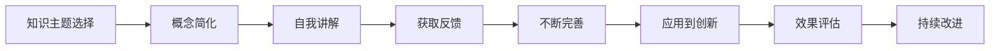

                 

# 费曼提问法提升团队创新能力

> 关键词：费曼学习法, 提问技术, 创新思维, 团队管理, 知识共享

## 1. 背景介绍

在快速迭代、高度不确定的时代，创新能力已成为团队竞争力的核心所在。如何提升团队创新能力，成为科技公司、创业团队乃至各个行业持续发展的关键课题。费曼学习法，即以物理学家理查德·费曼为代表的一种学习方法，通过深度理解和交流传授知识，以促进个人的学习与成长。本文旨在探讨如何将费曼学习法的提问技术应用于团队创新，实现知识的活化与传递，从而激发团队的创新潜力。

## 2. 核心概念与联系

### 2.1 核心概念概述

费曼学习法是一种以理解为基础的学习方法，主张通过向别人解释自己的知识，以检验和巩固个人的理解。核心步骤包括：
- **选择主题**：确定要深入了解的主题或问题。
- **简化概念**：将复杂问题分解为简单、易于理解的部分。
- **自我讲解**：用简洁的语言解释主题，想象自己正在教一个毫无背景知识的听众。
- **接受批评**：获取反馈，修正错误，不断完善解释。

在团队创新过程中，费曼学习法可以应用于知识分享、问题解决、创意激发等多个环节，通过提问技术，鼓励团队成员提出深度问题，推动信息流动和知识碰撞，进而激发新的想法和解决方案。

### 2.2 核心概念原理和架构的 Mermaid 流程图



以上流程图示意了费曼学习法的核心步骤，及其在团队创新中的应用路径。

## 3. 核心算法原理 & 具体操作步骤

### 3.1 算法原理概述

费曼学习法的提问技术，基于深度理解和信息共享的原则，通过构建问题链，引导团队成员深入思考和讨论。具体原理包括：
- **深度问题**：设计能够触及本质、激发思维的深度问题，促使成员深入探究。
- **引导思考**：通过提问，引导成员从不同角度、不同层次思考问题，发现新的解决方案。
- **知识共享**：通过提问和回答，实现知识在不同成员之间的传递与融合，促进创新思维的产生。

### 3.2 算法步骤详解

**Step 1: 知识主题选择**
- 团队成员共同确定一个需要深入了解的主题或问题，如某技术难点、市场需求、用户体验等。
- 选择主题时，应尽量具体、明确，便于后续深入讨论和理解。

**Step 2: 概念简化**
- 将复杂的主题或问题，分解为易于理解的小部分。例如，可以将一个技术难题分解为核心算法、关键实现、性能优化等部分。
- 使用可视化工具或图示，帮助团队成员理解每个小部分的关键要素。

**Step 3: 自我讲解**
- 每个成员轮流以简洁的语言，向团队解释自己理解的部分。
- 讲解过程中，应尽量用易懂的词汇和例子，避免使用专业术语或复杂概念。

**Step 4: 获取反馈**
- 团队成员互相提问，深入探讨每个部分的细节和可能的解决方案。
- 提问应尽量具体、开放，鼓励成员提出挑战性的问题，以促进深度思考。

**Step 5: 不断完善**
- 根据反馈，不断修正和完善个人的理解。
- 讨论中，应鼓励成员提出不同的观点和想法，促进知识的多样性和创新思维的产生。

**Step 6: 应用到创新**
- 将讨论中得到的洞见和解决方案，应用于实际的创新项目中。
- 设置短期目标和里程碑，跟踪创新成果的进展。

**Step 7: 效果评估**
- 定期回顾和评估创新项目的进展和成效。
- 总结成功经验和教训，不断优化提问技术。

**Step 8: 持续改进**
- 通过不断的实践和反思，持续改进提问技术，提升团队创新能力。
- 引入新的提问方法和工具，保持创新的活力和动力。

### 3.3 算法优缺点

费曼学习法的提问技术，具有以下优点：
- **深度理解**：通过提问和讲解，促使团队成员深入理解复杂问题，增强知识的深度和广度。
- **知识共享**：促进知识在不同成员之间的传递与融合，提升团队整体的认知水平。
- **创新激发**：通过深度问题引导思考，激发新的创意和解决方案。

但该方法也存在一定的局限性：
- **时间成本高**：每个成员的讲解和提问环节，可能耗时较长。
- **依赖个人能力**：成员的深度问题设计能力和讲解水平，直接影响方法的效果。
- **文化适应性**：对于某些团队文化或成员性格，该方法可能不够适应。

### 3.4 算法应用领域

费曼学习法的提问技术，可以广泛应用于以下领域：
- **产品设计与开发**：通过提问技术，挖掘用户需求和痛点，激发新的设计思路和产品功能。
- **技术研发与创新**：通过提问技术，解决技术难题，推动技术突破和产品迭代。
- **团队培训与发展**：通过提问技术，提升成员的专业能力，促进团队知识共享和共同进步。
- **项目管理和执行**：通过提问技术，优化项目流程，提升团队协作效率和执行力。
- **市场分析与策略**：通过提问技术，深入了解市场动态和竞争状况，制定更加精准的营销策略。

## 4. 数学模型和公式 & 详细讲解 & 举例说明

### 4.1 数学模型构建

假设一个团队正在探索一个新的技术主题 $T$，可以将其表示为 $T = (S_1, S_2, ..., S_n)$，其中 $S_i$ 为 $T$ 的一个子问题。团队的提问技术可以建模为一系列的深度问题 $Q_i = (Q_{i1}, Q_{i2}, ..., Q_{im})$，其中 $Q_{ij}$ 为针对 $S_i$ 的第 $j$ 个深度问题。通过提问和讲解，团队成员对 $T$ 的理解和认知逐步深化，形成新的洞见和解决方案。

### 4.2 公式推导过程

以技术难题 $T$ 为例，假设团队需要解决 $T$ 中的子问题 $S_i$，可以将其表示为 $S_i = (a_i, b_i, c_i)$，其中 $a_i$、$b_i$、$c_i$ 分别表示 $S_i$ 的三个关键要素。团队成员 $M_j$ 的提问和讲解过程可以表示为：
- 提问：$Q_{i1} = \text{What is the main issue in } a_i？$
- 讲解：$M_j$ 解释 $a_i$ 的现状和影响。
- 反馈：其他成员 $M_k$ 提出问题，如 $Q_{i2} = \text{How can we optimize } a_i？$。
- 完善：$M_j$ 根据反馈，优化和补充 $a_i$ 的解决方案。

通过上述过程，团队成员逐步深化对 $S_i$ 的理解，形成新的解决方案。

### 4.3 案例分析与讲解

**案例一：产品设计与开发**
- 问题：设计一款新的智能手表应用，以提升用户体验。
- 提问技术：
  1. **选择主题**：产品设计需求与用户反馈。
  2. **简化概念**：应用功能模块、界面设计、用户交互等。
  3. **自我讲解**：每个成员解释自己负责的部分。
  4. **获取反馈**：深入探讨功能需求、界面设计等。
  5. **不断完善**：优化用户体验和界面设计。
  6. **应用到创新**：在原型开发中应用新思路。
  7. **效果评估**：用户体验和市场反馈。
  8. **持续改进**：不断优化提问技术。

**案例二：技术研发与创新**
- 问题：提升某项技术的性能和可靠性。
- 提问技术：
  1. **选择主题**：技术瓶颈和优化方向。
  2. **简化概念**：核心算法、关键参数、环境因素等。
  3. **自我讲解**：每个成员解释自己负责的部分。
  4. **获取反馈**：深入探讨算法改进、参数调整等。
  5. **不断完善**：优化技术方案。
  6. **应用到创新**：在新项目中应用新技术。
  7. **效果评估**：性能测试和用户反馈。
  8. **持续改进**：优化提问技术。

## 5. 项目实践：代码实例和详细解释说明

### 5.1 开发环境搭建

为了更好地实践费曼学习法的提问技术，需要使用以下开发工具：
- **Jupyter Notebook**：支持代码和文本的混合编辑，便于团队成员分享和讨论。
- **Zoom/Teams/Miro**：提供远程协作和可视化工具，支持实时讲解和反馈。
- **Git/GitHub**：版本控制工具，便于团队成员共同开发和协作。

### 5.2 源代码详细实现

以下是一个简单的团队协作代码示例，用于记录和跟踪提问和讲解的过程：

```python
# 示例代码：费曼学习法协作工具

from datetime import datetime

class FeynmanNote:
    def __init__(self, theme, subtopics, participants):
        self.theme = theme
        self.subtopics = subtopics
        self.participants = participants
        self.records = []

    def add_record(self, time, participant, question, answer, feedback):
        record = {
            "time": time,
            "participant": participant,
            "question": question,
            "answer": answer,
            "feedback": feedback
        }
        self.records.append(record)

    def __str__(self):
        return f"Theme: {self.theme}\nSubtopics: {self.subtopics}\nParticipants: {self.participants}\nRecords:\n{self.records}"

# 示例使用
note = FeynmanNote("新技术探索", ["核心算法", "数据预处理", "性能优化"], ["Alice", "Bob", "Charlie"])
note.add_record(datetime.now(), "Alice", "How can we improve the core algorithm?", "By optimizing the data preprocessing step.", ["What's the current performance of the data preprocessing?"])
note.add_record(datetime.now(), "Bob", "Can we apply more advanced algorithms?", "We should consider deep learning models.", ["What are the advantages and disadvantages of deep learning models?"])
note.add_record(datetime.now(), "Charlie", "How do we measure performance?", "Using accuracy, precision, recall.", ["Can we use a different evaluation metric?"])
print(note)
```

### 5.3 代码解读与分析

**代码解读**：
- 定义了一个 `FeynmanNote` 类，用于记录团队成员的提问和讲解过程。
- 每个 `FeynmanNote` 对象包含一个主题、子主题、参与者列表和记录列表。
- `add_record` 方法用于添加记录，记录包括时间、参与者、问题和答案及反馈。
- 最后，通过打印 `FeynmanNote` 对象，展示团队成员的协作过程。

**分析**：
- 代码简洁，易于理解，能够记录和跟踪提问和讲解的过程。
- 通过时间戳记录每个记录的时间，便于团队成员追踪讨论的顺序和进展。
- 支持添加多个子主题和参与者，适应不同的讨论场景。

### 5.4 运行结果展示

以下是一个示例输出，展示了团队成员的协作过程：

```
Theme: 新技术探索
Subtopics: ['核心算法', '数据预处理', '性能优化']
Participants: ['Alice', 'Bob', 'Charlie']
Records:
{
    "time": 2023-10-01 15:30:00,
    "participant": 'Alice',
    "question": 'How can we improve the core algorithm?',
    "answer": 'By optimizing the data preprocessing step.',
    "feedback": 'What\'s the current performance of the data preprocessing?'
}
{
    "time": 2023-10-01 15:30:10,
    "participant": 'Bob',
    "question": 'Can we apply more advanced algorithms?',
    "answer": 'We should consider deep learning models.',
    "feedback": 'What are the advantages and disadvantages of deep learning models?'
}
{
    "time": 2023-10-01 15:30:20,
    "participant": 'Charlie',
    "question": 'How do we measure performance?',
    "answer": 'Using accuracy, precision, recall.',
    "feedback": 'Can we use a different evaluation metric?'
}
```

## 6. 实际应用场景

### 6.1 智能客服系统

智能客服系统需要快速响应大量用户的咨询，同时需要具备高准确性和良好的用户体验。通过费曼学习法的提问技术，可以有效地提升客服团队的知识共享和问题解决能力。

**应用场景**：
- 选择主题：用户常见问题与常见反馈。
- 简化概念：问题分类、回答模板、系统性能等。
- 自我讲解：每个客服代表分享自己处理的用户问题。
- 获取反馈：团队成员互相提问，探讨最佳解决方案。
- 不断完善：优化回答模板和系统性能。
- 应用到创新：在新的客服场景中应用新思路。
- 效果评估：用户满意度调查和系统性能测试。
- 持续改进：定期回顾和优化提问技术。

**效果**：
- 提升客服团队的知识共享和问题解决能力。
- 快速响应用户问题，提升用户满意度。
- 优化客服系统性能，提高用户体验。

### 6.2 金融风控系统

金融风控系统需要对大量交易数据进行实时分析和风险评估，以保障金融安全。通过费曼学习法的提问技术，可以有效地提升风控团队的风险识别和应对能力。

**应用场景**：
- 选择主题：交易异常检测与风险评估。
- 简化概念：异常交易特征、风险评估算法、风险等级等。
- 自我讲解：每个成员分享自己分析的交易数据。
- 获取反馈：团队成员互相提问，探讨异常交易的特征和应对策略。
- 不断完善：优化异常交易的识别和风险评估算法。
- 应用到创新：在新的交易场景中应用新思路。
- 效果评估：风险评估的准确性和实时性。
- 持续改进：定期回顾和优化提问技术。

**效果**：
- 提升风控团队的风险识别和应对能力。
- 实时分析交易数据，提高风险评估的准确性。
- 优化交易流程，降低风险。

### 6.3 教育学习平台

教育学习平台需要提供个性化的学习内容和建议，以提升学习效果。通过费曼学习法的提问技术，可以有效地提升教育团队的教学设计和个性化推荐能力。

**应用场景**：
- 选择主题：学习内容设计和个性化推荐。
- 简化概念：学习目标、推荐算法、用户偏好等。
- 自我讲解：每个成员分享自己设计的学习内容。
- 获取反馈：团队成员互相提问，探讨最佳的学习内容和推荐策略。
- 不断完善：优化学习内容和推荐算法。
- 应用到创新：在新的学习场景中应用新思路。
- 效果评估：学习效果和学习满意度。
- 持续改进：定期回顾和优化提问技术。

**效果**：
- 提升教育团队的教学设计和个性化推荐能力。
- 提供个性化的学习内容，提高学习效果。
- 提升用户的学习满意度和平台的用户粘性。

### 6.4 未来应用展望

随着技术的不断进步，费曼学习法的提问技术将在更多领域得到应用，为团队创新带来更大的价值。

在智慧医疗领域，通过提问技术，可以提升医疗团队的诊断能力和治疗方案设计能力。在智慧城市治理中，通过提问技术，可以提升城市管理团队的决策能力和问题解决能力。在智能制造领域，通过提问技术，可以提升生产团队的创新能力和工艺优化能力。

未来，随着人工智能和数据科学的普及，费曼学习法的提问技术将与其他前沿技术进行更深入的融合，如知识图谱、因果推理、强化学习等，推动团队创新的全面升级。

## 7. 工具和资源推荐

### 7.1 学习资源推荐

为了帮助开发者掌握费曼学习法的提问技术，以下是一些优质的学习资源：

1. **《费曼学习法：如何学会学习》**：本书详细介绍了费曼学习法的原理和实践方法，适合科技公司和创业团队的学习。
2. **Coursera《学习科学和教学》课程**：由斯坦福大学开设，探讨学习科学和教学策略，适合教育行业的学习者。
3. **TED演讲《费曼学习法：如何学会学习》**：著名物理学家理查德·费曼的演讲，深入浅出地介绍了费曼学习法的原理和实践。
4. **《深度学习与创新思维》**：结合深度学习和创新思维，探讨如何通过深度问题激发团队创新，适合科技公司的学习。

### 7.2 开发工具推荐

以下是几款用于费曼学习法实践的常用工具：

1. **Jupyter Notebook**：支持代码和文本的混合编辑，便于团队成员分享和讨论。
2. **Zoom/Teams/Miro**：提供远程协作和可视化工具，支持实时讲解和反馈。
3. **Git/GitHub**：版本控制工具，便于团队成员共同开发和协作。
4. **Trello/Asana**：项目管理工具，帮助团队成员跟踪提问和讲解的进度。
5. **Slack/Microsoft Teams**：团队沟通工具，支持实时讨论和知识共享。

### 7.3 相关论文推荐

以下是几篇有关费曼学习法的经典论文，推荐阅读：

1. **《费曼学习法：如何通过提问促进学习》**：探讨费曼学习法的原理和实践方法，适合科技公司和创业团队的学习。
2. **《深度学习与创新思维》**：结合深度学习和创新思维，探讨如何通过深度问题激发团队创新，适合科技公司的学习。
3. **《费曼学习法在教育中的应用》**：探讨费曼学习法在教育领域的应用和效果，适合教育行业的学习者。

## 8. 总结：未来发展趋势与挑战

### 8.1 研究成果总结

本文详细介绍了费曼学习法的提问技术及其在团队创新中的应用。通过提问技术，促使团队成员深入理解问题，激发新的创意和解决方案。费曼学习法具有深度理解、知识共享、创新激发等优点，但也存在时间成本高、依赖个人能力等局限性。

### 8.2 未来发展趋势

费曼学习法的提问技术，在未来将呈现以下几个发展趋势：

1. **智能化工具普及**：随着AI技术的发展，智能化工具将逐步普及，帮助团队成员更高效地提问和讲解。
2. **多样化提问方法**：引入更多提问方法和工具，如因果推理、知识图谱等，提升提问的深度和广度。
3. **跨领域应用拓展**：费曼学习法将在更多领域得到应用，如医疗、金融、教育等，提升团队的综合创新能力。
4. **全球化协作增强**：通过远程协作工具，团队成员可以跨越地理限制，进行实时互动和知识共享。
5. **文化适应性增强**：引入更多文化适应性强的提问技术，提升其在不同文化背景下的应用效果。

### 8.3 面临的挑战

尽管费曼学习法的提问技术在实践中取得了一定的成效，但仍面临以下挑战：

1. **时间成本高**：提问和讲解环节可能耗时较长，影响团队的日常工作节奏。
2. **依赖个人能力**：成员的提问设计能力和讲解水平，直接影响方法的效果。
3. **文化适应性**：对于某些团队文化或成员性格，该方法可能不够适应。
4. **工具依赖性**：智能化工具的普及和适配，需要团队进行一定的学习和技术支持。

### 8.4 研究展望

未来的研究需要在以下几个方面寻求新的突破：

1. **优化提问流程**：引入更多自动化和智能化工具，优化提问和讲解的流程，提高效率。
2. **提升个人能力**：通过培训和引导，提升团队成员的提问设计能力和讲解水平。
3. **文化适应性**：引入更多文化适应性强的提问技术，提升其在不同文化背景下的应用效果。
4. **工具普及度**：加强智能化工具的普及和适配，提升其在团队中的应用效果。

## 9. 附录：常见问题与解答

**Q1: 费曼学习法的提问技术如何适用于不同类型的团队？**

A: 费曼学习法的提问技术可以适用于各种类型的团队，只要团队成员能够理解并接受深度问题和知识共享的理念。对于不同的团队，可以结合实际情况，调整提问的方式和频率，以适应团队的特定需求。例如，在技术研发团队中，可以引入更多的技术细节和算法优化问题；在市场分析团队中，可以引入更多市场趋势和客户需求问题。

**Q2: 如何在团队中实施费曼学习法的提问技术？**

A: 在团队中实施费曼学习法的提问技术，需要以下几个步骤：
1. 确定一个需要深入了解的主题或问题。
2. 将问题分解为小部分，并简化每个部分的概念。
3. 每个成员轮流以简洁的语言，向团队解释自己理解的部分。
4. 团队成员互相提问，深入探讨每个部分，获取反馈。
5. 根据反馈，不断修正和完善个人的理解。
6. 将讨论中得到的洞见和解决方案，应用于实际的创新项目中。

**Q3: 费曼学习法的提问技术如何与其他创新方法结合使用？**

A: 费曼学习法的提问技术可以与其他创新方法结合使用，如设计思维、精益创业等，形成更加综合的创新方法。例如，在设计思维中，可以通过提问技术，深入挖掘用户需求和痛点；在精益创业中，可以通过提问技术，验证市场假设和商业模式。

**Q4: 费曼学习法的提问技术是否适用于非技术团队？**

A: 费曼学习法的提问技术不仅适用于技术团队，也适用于非技术团队，如销售、市场、运营等。通过提问技术，非技术团队可以更好地理解技术和产品细节，提升跨部门协作的效率和效果。

**Q5: 费曼学习法的提问技术如何与其他学习方式结合使用？**

A: 费曼学习法的提问技术可以与其他学习方式结合使用，如在线课程、工作坊、读书会等。通过多种学习方式的结合，可以更全面地提升团队成员的知识水平和创新能力。

---

作者：禅与计算机程序设计艺术 / Zen and the Art of Computer Programming

