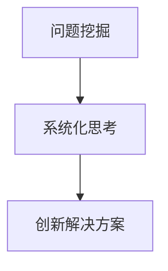

                 

# 费曼提问法激发管理者思考深度

在信息技术快速发展的今天，企业组织的管理者和决策者面临着前所未有的复杂性和不确定性。如何在纷繁复杂的环境下，做出科学的决策，引领企业持续增长，成为每个管理者必须面对的挑战。费曼提问法（Feynman Technique）作为一种科学学习方法，通过提问和深挖问题的本质，可以帮助管理者更好地理解问题，激发思考深度，找到解决问题的创新方法。本文将深入探讨费曼提问法的原理与实践，提供一套系统的方法论框架，助力管理者在复杂环境中做出更为科学和明智的决策。

## 1. 背景介绍

### 1.1 问题由来

在现代企业运营中，信息技术的快速发展和应用极大地改变了企业运营的方式和效率。然而，随之而来的是信息过载和决策复杂性的增加。如何高效地处理海量数据，基于数据驱动做出精准决策，成为了管理者面临的重要挑战。费曼提问法正是在这种背景下，为管理者提供了一种有效的方法，通过深度问题挖掘和系统化思考，提升决策的科学性和有效性。

### 1.2 问题核心关键点

费曼提问法的核心在于通过不断地提问和回答问题，深化对问题的理解，从而激发更深入的思考和创新。关键点包括：

- **问题挖掘**：将复杂问题拆解为具体、可操作的问题，便于深入分析和解决。
- **系统化思考**：采用结构化的思维方式，从多个角度和维度深入挖掘问题的本质和影响因素。
- **创新解决方案**：基于对问题的全面理解，提出创新性的解决方案和策略。

### 1.3 问题研究意义

费曼提问法不仅可以帮助管理者在复杂环境下做出更为精准的决策，还能提升团队创新能力，推动企业持续成长。研究费曼提问法的原理与实践，对于提升企业决策质量，推动企业创新，具有重要意义。

## 2. 核心概念与联系

### 2.1 核心概念概述

费曼提问法基于著名物理学家理查德·费曼的学习方法，通过提问和深度解答，激发思考和理解。以下是几个核心概念：

- **深度理解**：通过深度问题挖掘，帮助管理者全面理解问题的本质和影响因素。
- **结构化思考**：将问题拆分为多个层次和维度，从不同角度深入分析问题。
- **创新解决方案**：基于全面理解，提出创新性的解决方案和策略。

这些概念之间的逻辑关系可以通过以下Mermaid流程图来展示：

这个流程图展示了这个核心方法论的步骤和流程：

1. 将复杂问题拆解为具体、可操作的问题。
2. 从多个角度和维度深入挖掘问题的本质和影响因素。
3. 基于全面理解，提出创新性的解决方案和策略。

这些概念共同构成了费曼提问法的核心框架，帮助管理者在复杂环境中做出更为科学和明智的决策。

## 3. 核心算法原理 & 具体操作步骤

### 3.1 算法原理概述

费曼提问法是一种通过提问和回答，深化对问题理解的方法。其核心思想是将复杂问题拆分为具体、可操作的问题，从多个角度和维度深入挖掘问题的本质和影响因素，最终提出创新性的解决方案。

### 3.2 算法步骤详解

费曼提问法的实施通常包括以下几个步骤：

1. **问题定义**：明确问题的具体内容和背景，定义问题范围和目标。
2. **问题拆解**：将复杂问题拆分为具体、可操作的问题，便于深入分析和解决。
3. **深度提问**：针对每个具体问题，提出一系列深度问题，深入挖掘问题的本质和影响因素。
4. **答案挖掘**：根据深度问题，进行系统化思考，从多个角度和维度深入分析问题。
5. **创新方案**：基于对问题的全面理解，提出创新性的解决方案和策略。

### 3.3 算法优缺点

费曼提问法的主要优点包括：

- **深化理解**：通过深度问题挖掘，帮助管理者全面理解问题的本质和影响因素。
- **结构化思考**：采用结构化的思维方式，从多个角度和维度深入分析问题。
- **创新解决方案**：基于全面理解，提出创新性的解决方案和策略。

其缺点主要在于：

- **实施难度大**：需要系统化、结构化的思维方式，对管理者的素质和能力要求较高。
- **时间成本高**：深度问题挖掘和系统化思考需要大量时间和精力投入。

### 3.4 算法应用领域

费曼提问法不仅适用于企业的决策管理，还广泛应用于科学研究、教育培训等领域。具体应用包括：

- **企业决策**：帮助企业在复杂环境中做出更为精准的决策。
- **项目管理**：提升项目管理和执行效率，推动项目成功。
- **教育培训**：通过深度提问和系统化思考，提升学生和员工的学习效果和理解深度。
- **科学研究**：促进科研团队的深度合作和创新突破。

## 4. 数学模型和公式 & 详细讲解 & 举例说明

### 4.1 数学模型构建

费曼提问法主要依赖于系统化思考和问题拆解，其数学模型构建基于逻辑推理和问题结构化分析。

### 4.2 公式推导过程

假设问题为 $P$，将其拆分为 $n$ 个子问题 $P_1, P_2, ..., P_n$。对于每个子问题 $P_i$，提出深度问题 $Q_1, Q_2, ..., Q_k$，并对其进行系统化思考和分析，最终提出解决方案 $S_i$。整个问题的解决方案为 $S = \{S_1, S_2, ..., S_n\}$。

### 4.3 案例分析与讲解

以企业项目管理为例，项目 $P$ 的目标是按时按质完成一个新产品开发项目。项目拆分后的子问题可能包括市场调研、技术研发、供应链管理等。针对每个子问题，提出深度问题，如市场调研中的 "目标客户群体是什么？"，"市场竞争情况如何？"，"客户需求有哪些？" 等，并进行系统化思考，最终提出创新性的解决方案和策略。

## 5. 项目实践：代码实例和详细解释说明

### 5.1 开发环境搭建

费曼提问法的实践主要依赖于系统化思考和问题拆解，无需编写复杂的代码，主要通过管理工具和问题分析软件来实现。

### 5.2 源代码详细实现

以项目管理为例，使用项目管理工具如JIRA、Trello等，将项目拆分为多个子任务，并针对每个子任务提出深度问题。通过工具的协作和跟踪功能，系统化地分析和解决这些问题。

### 5.3 代码解读与分析

项目管理工具的使用无需编写代码，主要通过管理界面和协作功能实现问题拆解和系统化分析。例如，在JIRA中，可以创建多个任务，针对每个任务提出深度问题，并分配给相应团队成员，协作解决问题，跟踪任务进度。

### 5.4 运行结果展示

通过项目管理工具，可以实时跟踪项目的进展，及时发现和解决问题，确保项目按计划完成。例如，在JIRA中，可以生成甘特图、任务树等，直观展示项目状态和关键路径，便于团队协作和决策。

## 6. 实际应用场景

### 6.1 企业管理

费曼提问法在企业管理中的应用广泛，能够帮助企业领导者系统化思考问题，提升决策的科学性和有效性。

### 6.2 产品开发

在产品开发过程中，通过深度问题挖掘和系统化思考，帮助团队明确产品方向，解决技术难题，提升产品成功率。

### 6.3 市场营销

市场营销中，通过费曼提问法系统化分析市场数据，挖掘潜在客户需求，制定精准营销策略，提升市场竞争力。

### 6.4 未来应用展望

随着企业环境复杂度的增加，费曼提问法将在更多领域得到应用，为管理决策提供科学依据。未来展望包括：

- **数据驱动决策**：通过大数据和系统化分析，提供更精准的决策支持。
- **人工智能应用**：结合人工智能技术，自动化进行问题拆解和分析，提升效率。
- **跨领域融合**：将费曼提问法与其他管理方法如敏捷开发、精益管理等结合，形成全面的管理框架。

## 7. 工具和资源推荐

### 7.1 学习资源推荐

为了帮助管理者系统掌握费曼提问法，这里推荐一些优质的学习资源：

1. **《费曼学习法》**：理查德·费曼的亲传弟子达特茅斯学院教授卡尔·皮克，详细阐述了费曼学习法的核心思想和方法，适用于企业管理者提升学习效果和思考深度。
2. **《深度思考》**：著名心理学家米哈里·契克森米哈赖，深入探讨深度思考的心理学原理和实践方法，帮助管理者提升思考能力。
3. **在线课程**：Coursera、Udemy等平台上的“系统化思考”和“问题解决”课程，提供系统化的学习路径和方法。

### 7.2 开发工具推荐

费曼提问法的实践主要依赖于管理工具和协作软件，以下是几款推荐的工具：

1. **项目管理工具**：JIRA、Trello、Asana等，支持任务拆分和协作跟踪。
2. **问题管理工具**：Miro、Lucidchart等，支持系统化问题分析和可视化展示。
3. **协作平台**：Slack、Microsoft Teams等，支持团队沟通和问题反馈。

### 7.3 相关论文推荐

费曼提问法的研究涉及多个学科，以下是几篇具有代表性的论文，推荐阅读：

1. **费曼学习法研究**：Richard Feynman，《The Art of Physics》
2. **系统化思考**：David A. Novick，《Systems Thinking: Bridging Complexity with Science and Algebra》
3. **问题解决**：Michael B. Neale，《Problem Solving in Organizations: Strategies for Overcoming Barriers》

## 8. 总结：未来发展趋势与挑战

### 8.1 总结

费曼提问法通过深度问题挖掘和系统化思考，帮助管理者在复杂环境中做出更为科学和明智的决策。本文详细介绍了费曼提问法的原理与实践，提供了一套系统的方法论框架，助力管理者在复杂环境中做出更为科学和明智的决策。通过深入探讨费曼提问法的原理与实践，我们看到了其在企业决策、项目管理、市场营销等多个领域的应用潜力。

### 8.2 未来发展趋势

展望未来，费曼提问法将在更多领域得到应用，为管理决策提供科学依据。未来趋势包括：

- **数据驱动决策**：通过大数据和系统化分析，提供更精准的决策支持。
- **人工智能应用**：结合人工智能技术，自动化进行问题拆解和分析，提升效率。
- **跨领域融合**：将费曼提问法与其他管理方法如敏捷开发、精益管理等结合，形成全面的管理框架。

### 8.3 面临的挑战

尽管费曼提问法在多个领域取得了显著成效，但在实践中仍面临一些挑战：

- **实施难度大**：需要系统化、结构化的思维方式，对管理者的素质和能力要求较高。
- **时间成本高**：深度问题挖掘和系统化思考需要大量时间和精力投入。
- **跨部门协作困难**：不同部门之间存在沟通和理解障碍，影响协作效果。

### 8.4 研究展望

针对这些挑战，未来的研究需要在以下几个方面寻求新的突破：

- **系统化工具开发**：开发更为系统化的管理工具和协作平台，降低实施难度和成本。
- **跨部门协作机制**：建立跨部门协作机制，提升团队协同效果。
- **知识管理与共享**：建立知识管理系统，促进知识共享和传播，提升团队整体能力。

## 9. 附录：常见问题与解答

**Q1：费曼提问法的实施步骤是什么？**

A: 费曼提问法的实施步骤主要包括问题定义、问题拆解、深度提问、答案挖掘和创新方案。具体步骤为：
1. 明确问题的具体内容和背景，定义问题范围和目标。
2. 将复杂问题拆分为具体、可操作的问题，便于深入分析和解决。
3. 针对每个具体问题，提出一系列深度问题，深入挖掘问题的本质和影响因素。
4. 根据深度问题，进行系统化思考，从多个角度和维度深入分析问题。
5. 基于对问题的全面理解，提出创新性的解决方案和策略。

**Q2：费曼提问法对管理者有哪些具体帮助？**

A: 费曼提问法对管理者的具体帮助包括：
1. 深化理解：通过深度问题挖掘，帮助管理者全面理解问题的本质和影响因素。
2. 结构化思考：采用结构化的思维方式，从多个角度和维度深入分析问题。
3. 创新解决方案：基于全面理解，提出创新性的解决方案和策略。
4. 提升决策质量：通过系统化思考，帮助管理者做出更为科学和精准的决策。
5. 提升团队能力：通过问题拆解和协作分析，提升团队协作和问题解决能力。

**Q3：如何在实际工作中应用费曼提问法？**

A: 在实际工作中，可以通过以下步骤应用费曼提问法：
1. 明确项目或问题的具体内容和目标。
2. 将问题拆分为具体、可操作的任务或子问题。
3. 针对每个任务或子问题，提出一系列深度问题，深入挖掘问题的本质和影响因素。
4. 根据深度问题，进行系统化思考，从多个角度和维度深入分析问题。
5. 基于对问题的全面理解，提出创新性的解决方案和策略。
6. 在执行过程中，持续跟踪任务进度，及时解决问题，确保项目按计划完成。

**Q4：费曼提问法是否适用于所有问题？**

A: 费曼提问法适用于大部分复杂问题的分析和解决，但对于一些简单和明确的问题，可能过于复杂，不适用。在应用时，需要根据问题的复杂性和需求，灵活选择合适的方法和工具。

**Q5：费曼提问法需要多长时间才能见效？**

A: 费曼提问法的见效时间因问题的复杂性和管理者的实施能力而异。一般而言，需要几周到几个月的时间，才能系统化地解决复杂问题。在实施过程中，需要持续跟踪和优化，逐步见效。

---

作者：禅与计算机程序设计艺术 / Zen and the Art of Computer Programming

