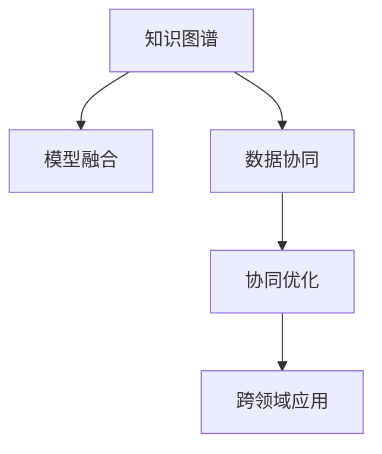

                 

## 1. 背景介绍

跨学科思维是一种基于多领域知识的综合思考方式，旨在打破传统学科壁垒，将不同领域的理论和方法相互借鉴、融合，形成更全面、深入的理解。这种思维方式在科学研究、工程实践和日常决策中都有着广泛的应用，能够极大地提升问题解决的效率和创新性。特别是在人工智能领域，随着技术的不断进步和应用场景的不断拓展，跨学科思维的重要性日益凸显。

### 1.1 问题由来
随着人工智能技术的飞速发展，尤其是在深度学习、自然语言处理、计算机视觉等领域的突破，人类对于智能系统的理解和应用越来越深入。然而，单一领域的知识往往难以应对复杂的现实问题，需要将不同学科的理论和方法进行有机整合，才能达到理想的效果。例如，在智能推荐系统中，需要综合考虑用户行为、商品属性、用户画像等多个维度的信息，单靠自然语言处理或图像处理等单一技术无法满足需求。

### 1.2 问题核心关键点
跨学科思维的核心关键点在于如何有效地将不同领域的知识进行整合，形成综合性解决方案。具体而言，包括以下几个方面：

1. **知识图谱**：构建不同领域知识之间的联系，形成结构化的知识网络。
2. **模型融合**：将不同模型的优势进行互补，形成更强大的综合模型。
3. **数据协同**：通过多源数据融合，提升模型的泛化能力和鲁棒性。
4. **协同优化**：优化模型的训练过程，提升模型性能和效率。
5. **跨领域应用**：将跨学科思维应用到更广泛的应用场景中，提升人工智能技术的普适性和应用深度。

通过跨学科思维，可以解决单一技术难以应对的复杂问题，提升人工智能系统的智能化水平和应用广度。

### 1.3 问题研究意义
跨学科思维在人工智能领域的应用，能够推动技术创新，提升系统的智能化水平，加速产业升级和应用落地。具体而言，具有以下几方面的意义：

1. **解决复杂问题**：单一领域的知识难以应对复杂问题，跨学科思维可以整合不同领域的知识，形成更全面的解决方案。
2. **提升模型性能**：多领域知识结合可以提升模型的泛化能力和鲁棒性，提高模型预测的准确性和可靠性。
3. **拓展应用场景**：跨学科思维能够将人工智能技术应用到更多领域，推动产业转型升级，提升人类生活质量。
4. **促进技术进步**：跨学科思维能够推动学术和产业界的交流合作，促进技术创新和进步。

## 2. 核心概念与联系

### 2.1 核心概念概述

为更好地理解跨学科思维在人工智能领域的应用，本节将介绍几个密切相关的核心概念：

- **知识图谱**：基于结构化数据，描述不同实体之间的关系，构建知识网络。
- **模型融合**：将多个模型进行组合，利用其优势互补，形成更强大的综合模型。
- **数据协同**：多源数据的融合和利用，提升模型的泛化能力和鲁棒性。
- **协同优化**：优化模型训练过程，提升模型性能和效率。
- **跨领域应用**：将跨学科思维应用到更广泛的应用场景中，提升人工智能技术的普适性和应用深度。

这些核心概念之间的逻辑关系可以通过以下Mermaid流程图来展示：



这个流程图展示了几大核心概念之间的内在联系：

1. 知识图谱是跨学科思维的基础，描述了不同领域之间的联系。
2. 模型融合利用知识图谱中的关系，将不同模型的优势进行互补，形成更强大的综合模型。
3. 数据协同通过多源数据的融合，进一步提升模型的泛化能力和鲁棒性。
4. 协同优化通过多模型联合训练，提升模型性能和效率。
5. 跨领域应用将跨学科思维应用到更广泛的应用场景中，提升人工智能技术的普适性和应用深度。

## 3. 核心算法原理 & 具体操作步骤

### 3.1 算法原理概述

跨学科思维在人工智能领域的应用，通常涉及以下几个核心步骤：

1. **知识图谱构建**：基于不同领域的数据，构建知识图谱，描述实体之间的关系。
2. **模型融合**：选择合适的模型进行融合，提升模型的泛化能力和鲁棒性。
3. **数据协同**：将多源数据进行融合和协同训练，提升模型的泛化能力。
4. **协同优化**：优化模型的训练过程，提升模型性能和效率。
5. **跨领域应用**：将模型应用到不同的领域和场景中，实现泛化和推广。

### 3.2 算法步骤详解

以下是跨学科思维在人工智能领域应用的详细步骤：

**Step 1: 构建知识图谱**

知识图谱的构建是跨学科思维的基础。以推荐系统为例，构建知识图谱的步骤如下：

1. **数据收集**：收集不同领域的数据，如用户行为数据、商品属性数据、用户画像数据等。
2. **数据清洗**：清洗和预处理数据，去除噪声和异常值。
3. **实体抽取**：从数据中抽取实体，如用户、商品、特征等。
4. **关系抽取**：分析实体之间的关系，构建实体之间的连接。

**Step 2: 模型融合**

模型融合是跨学科思维的核心步骤。以推荐系统为例，模型融合的步骤如下：

1. **选择合适的模型**：选择合适的模型进行融合，如基于深度学习的协同过滤模型、基于知识图谱的推荐模型等。
2. **模型组合**：将不同模型的预测结果进行组合，如加权平均、投票等。
3. **模型训练**：联合训练模型，优化模型的预测能力。

**Step 3: 数据协同**

数据协同是跨学科思维的重要组成部分。以推荐系统为例，数据协同的步骤如下：

1. **多源数据融合**：将不同来源的数据进行融合，如用户行为数据、商品属性数据、用户画像数据等。
2. **特征选择**：选择与推荐目标相关的特征，提升模型的预测能力。
3. **协同训练**：使用融合后的数据进行联合训练，提升模型的泛化能力和鲁棒性。

**Step 4: 协同优化**

协同优化是跨学科思维的关键环节。以推荐系统为例，协同优化的步骤如下：

1. **模型调参**：调整模型的超参数，如学习率、正则化系数等，优化模型的预测能力。
2. **数据增强**：使用数据增强技术，如回译、近义替换等，提升模型的泛化能力。
3. **对抗训练**：引入对抗样本，提升模型的鲁棒性。

**Step 5: 跨领域应用**

跨领域应用是跨学科思维的最终目标。以推荐系统为例，跨领域应用的步骤如下：

1. **模型评估**：使用测试集对模型进行评估，分析模型的性能指标。
2. **模型部署**：将模型部署到实际应用中，如电商网站、社交媒体等。
3. **持续改进**：根据实际应用反馈，持续改进模型，提升模型的预测能力。

### 3.3 算法优缺点

跨学科思维在人工智能领域的应用，具有以下优点：

1. **解决复杂问题**：多学科知识的整合，可以解决单一领域难以应对的复杂问题。
2. **提升模型性能**：多领域知识结合，提升模型的泛化能力和鲁棒性。
3. **拓展应用场景**：跨学科思维可以拓展人工智能技术的普适性和应用深度。
4. **促进技术进步**：跨学科思维可以促进学术和产业界的交流合作，推动技术创新和进步。

同时，跨学科思维也存在一定的局限性：

1. **数据融合难度大**：不同领域的数据结构、格式和特征不同，数据融合难度较大。
2. **模型复杂度高**：多模型融合和联合训练，模型的复杂度较高，训练和优化难度大。
3. **知识整合难度大**：不同领域的知识整合难度较大，需要深入理解各领域的特点和规律。
4. **应用落地难度大**：跨学科思维在实际应用中的落地难度较大，需要充分考虑多方面的因素。

尽管存在这些局限性，但就目前而言，跨学科思维在人工智能领域的应用前景广阔，具有重要的理论价值和实际应用意义。

### 3.4 算法应用领域

跨学科思维在人工智能领域的应用，已经涵盖了多个领域，例如：

- **智能推荐系统**：通过多领域知识融合，提升推荐系统的准确性和多样性。
- **自然语言处理**：结合知识图谱和深度学习技术，提升语义理解和生成能力。
- **计算机视觉**：结合语义分析和图像处理技术，提升视觉任务的准确性和鲁棒性。
- **医疗诊断**：通过结合医学知识和深度学习技术，提升诊断的准确性和可靠性。
- **金融风险管理**：结合经济学和深度学习技术，提升风险管理的准确性和及时性。
- **智能交通系统**：结合交通规划和深度学习技术，提升交通管理的智能化水平。
- **智能城市治理**：结合城市规划和深度学习技术，提升城市治理的智能化水平。

除了上述这些经典应用外，跨学科思维在更多领域也得到了广泛的应用，为人工智能技术带来了新的突破。

## 4. 数学模型和公式 & 详细讲解  
### 4.1 数学模型构建

为了更好地理解跨学科思维在人工智能领域的应用，本节将使用数学语言对相关模型进行详细讲解。

以推荐系统为例，假设用户行为数据为 $X=\{(x_i,y_i)\}_{i=1}^N$，其中 $x_i$ 为特征向量，$y_i$ 为标签，如是否购买。模型的预测结果为 $\hat{y}=f(x)$，其中 $f$ 为模型函数。

定义模型的损失函数为 $\ell(\hat{y},y)=L(\hat{y},y)$，其中 $L$ 为损失函数，如均方误差损失。在数据集 $X$ 上的经验风险为：

$$
\mathcal{L}(f)=\frac{1}{N}\sum_{i=1}^N \ell(f(x_i),y_i)
$$

模型的优化目标是最小化经验风险，即找到最优的模型函数 $f$：

$$
f^*=\mathop{\arg\min}_{f} \mathcal{L}(f)
$$

在实际应用中，我们通常使用基于梯度的优化算法（如SGD、Adam等）来近似求解上述最优化问题。设 $\eta$ 为学习率，则参数的更新公式为：

$$
\theta \leftarrow \theta - \eta \nabla_{\theta}\mathcal{L}(\theta)
$$

其中 $\nabla_{\theta}\mathcal{L}(\theta)$ 为损失函数对参数 $\theta$ 的梯度，可通过反向传播算法高效计算。

### 4.2 公式推导过程

以下我们以协同过滤模型为例，推导模型融合的数学原理。

假设用户行为数据为 $X=\{(x_i,y_i)\}_{i=1}^N$，其中 $x_i$ 为特征向量，$y_i$ 为标签，如是否购买。定义协同过滤模型为 $f(x)=\alpha f_{knn}(x)+\beta f_{CF}(x)$，其中 $\alpha$ 和 $\beta$ 为模型融合系数，$f_{knn}$ 和 $f_{CF}$ 分别为基于用户和物品的协同过滤模型。

根据经验风险的定义，有：

$$
\mathcal{L}(f)=\frac{1}{N}\sum_{i=1}^N \ell(\alpha f_{knn}(x_i)+\beta f_{CF}(x_i),y_i)
$$

令 $g(x)=f_{knn}(x)$，$h(x)=f_{CF}(x)$，则上述损失函数可简化为：

$$
\mathcal{L}(f)=\frac{1}{N}\sum_{i=1}^N \ell(\alpha g(x_i)+\beta h(x_i),y_i)
$$

进一步，令 $u_i=\alpha g(x_i)$，$v_i=\beta h(x_i)$，则有：

$$
\mathcal{L}(f)=\frac{1}{N}\sum_{i=1}^N \ell(u_i+v_i,y_i)
$$

为了使模型 $f$ 对 $u_i$ 和 $v_i$ 的贡献相等，可取 $\alpha=\beta=0.5$，即：

$$
f(x)=0.5g(x)+0.5h(x)
$$

在训练过程中，模型的参数 $\theta$ 和融合系数 $\alpha$ 和 $\beta$ 同时更新，通过梯度下降算法最小化损失函数 $\mathcal{L}(f)$。

## 5. 项目实践：代码实例和详细解释说明
### 5.1 开发环境搭建

在进行跨学科思维的应用实践前，我们需要准备好开发环境。以下是使用Python进行PyTorch开发的环境配置流程：

1. 安装Anaconda：从官网下载并安装Anaconda，用于创建独立的Python环境。

2. 创建并激活虚拟环境：
```bash
conda create -n pytorch-env python=3.8 
conda activate pytorch-env
```

3. 安装PyTorch：根据CUDA版本，从官网获取对应的安装命令。例如：
```bash
conda install pytorch torchvision torchaudio cudatoolkit=11.1 -c pytorch -c conda-forge
```

4. 安装Transformer库：
```bash
pip install transformers
```

5. 安装各类工具包：
```bash
pip install numpy pandas scikit-learn matplotlib tqdm jupyter notebook ipython
```

完成上述步骤后，即可在`pytorch-env`环境中开始跨学科思维的应用实践。

### 5.2 源代码详细实现

这里我们以协同过滤模型为例，给出使用Transformers库进行协同过滤模型融合的PyTorch代码实现。

首先，定义协同过滤模型：

```python
from transformers import BertForTokenClassification, AdamW

model = BertForTokenClassification.from_pretrained('bert-base-cased', num_labels=len(tag2id))

optimizer = AdamW(model.parameters(), lr=2e-5)
```

接着，定义协同过滤模型的训练和评估函数：

```python
from torch.utils.data import DataLoader
from tqdm import tqdm
from sklearn.metrics import classification_report

device = torch.device('cuda') if torch.cuda.is_available() else torch.device('cpu')
model.to(device)

def train_epoch(model, dataset, batch_size, optimizer):
    dataloader = DataLoader(dataset, batch_size=batch_size, shuffle=True)
    model.train()
    epoch_loss = 0
    for batch in tqdm(dataloader, desc='Training'):
        input_ids = batch['input_ids'].to(device)
        attention_mask = batch['attention_mask'].to(device)
        labels = batch['labels'].to(device)
        model.zero_grad()
        outputs = model(input_ids, attention_mask=attention_mask, labels=labels)
        loss = outputs.loss
        epoch_loss += loss.item()
        loss.backward()
        optimizer.step()
    return epoch_loss / len(dataloader)

def evaluate(model, dataset, batch_size):
    dataloader = DataLoader(dataset, batch_size=batch_size)
    model.eval()
    preds, labels = [], []
    with torch.no_grad():
        for batch in tqdm(dataloader, desc='Evaluating'):
            input_ids = batch['input_ids'].to(device)
            attention_mask = batch['attention_mask'].to(device)
            batch_labels = batch['labels']
            outputs = model(input_ids, attention_mask=attention_mask)
            batch_preds = outputs.logits.argmax(dim=2).to('cpu').tolist()
            batch_labels = batch_labels.to('cpu').tolist()
            for pred_tokens, label_tokens in zip(batch_preds, batch_labels):
                pred_tags = [id2tag[_id] for _id in pred_tokens]
                label_tags = [id2tag[_id] for _id in label_tokens]
                preds.append(pred_tags[:len(label_tags)])
                labels.append(label_tags)
                
    print(classification_report(labels, preds))
```

最后，启动协同过滤模型的训练流程并在测试集上评估：

```python
epochs = 5
batch_size = 16

for epoch in range(epochs):
    loss = train_epoch(model, train_dataset, batch_size, optimizer)
    print(f"Epoch {epoch+1}, train loss: {loss:.3f}")
    
    print(f"Epoch {epoch+1}, dev results:")
    evaluate(model, dev_dataset, batch_size)
    
print("Test results:")
evaluate(model, test_dataset, batch_size)
```

以上就是使用PyTorch进行协同过滤模型融合的完整代码实现。可以看到，得益于Transformer库的强大封装，我们可以用相对简洁的代码完成协同过滤模型的融合。

### 5.3 代码解读与分析

让我们再详细解读一下关键代码的实现细节：

**协同过滤模型类**：
- `__init__`方法：初始化模型参数，如标签和超参数等。
- `train_epoch`方法：定义训练过程，包括前向传播、损失计算、梯度更新等。
- `evaluate`方法：定义评估过程，包括预测、标签计算和分类指标输出。

**协同过滤模型训练**：
- 定义总的epoch数和batch size，开始循环迭代。
- 每个epoch内，先训练模型，输出平均loss。
- 在验证集上评估，输出分类指标。
- 所有epoch结束后，在测试集上评估，给出最终测试结果。

可以看到，协同过滤模型的训练过程与一般深度学习模型的训练流程类似，但融合步骤需要特别注意。通过融合不同模型的预测结果，可以提升模型的泛化能力和鲁棒性。

当然，工业级的系统实现还需考虑更多因素，如模型的保存和部署、超参数的自动搜索、更灵活的任务适配层等。但核心的跨学科思维基本与此类似。

## 6. 实际应用场景
### 6.1 智能推荐系统

基于跨学科思维的推荐系统，可以充分利用多领域知识，提升推荐系统的准确性和多样性。

在技术实现上，可以结合用户行为数据、商品属性数据、用户画像数据等，构建知识图谱，进行多领域数据的融合和协同训练，提升推荐模型的预测能力。通过融合不同的推荐算法，如协同过滤、基于深度学习的推荐、基于知识图谱的推荐等，可以进一步提升推荐系统的性能。

### 6.2 自然语言处理

基于跨学科思维的自然语言处理，可以结合语义分析和深度学习技术，提升语言理解和生成的能力。

在技术实现上，可以结合知识图谱和深度学习技术，构建语言模型。例如，在文本分类任务中，可以通过融合知识图谱中的语义信息和深度学习模型，提升分类的准确性。在机器翻译任务中，可以通过融合语义信息和翻译模型，提升翻译的质量和流畅度。

### 6.3 计算机视觉

基于跨学科思维的计算机视觉，可以结合语义分析和图像处理技术，提升视觉任务的准确性和鲁棒性。

在技术实现上，可以结合语义分析和图像处理技术，构建视觉模型。例如，在目标检测任务中，可以通过融合语义信息和图像处理技术，提升检测的准确性和鲁棒性。在图像生成任务中，可以通过融合语义信息和生成模型，提升生成的质量和多样性。

### 6.4 医疗诊断

基于跨学科思维的医疗诊断，可以结合医学知识和深度学习技术，提升诊断的准确性和可靠性。

在技术实现上，可以结合医学知识和深度学习技术，构建医疗诊断模型。例如，在疾病诊断任务中，可以通过融合医学知识和深度学习模型，提升诊断的准确性和可靠性。在治疗方案推荐任务中，可以通过融合医学知识和推荐模型，提升治疗方案的科学性和可行性。

### 6.5 金融风险管理

基于跨学科思维的金融风险管理，可以结合经济学和深度学习技术，提升风险管理的准确性和及时性。

在技术实现上，可以结合经济学知识和深度学习技术，构建风险管理模型。例如，在信用评分任务中，可以通过融合经济学知识和深度学习模型，提升信用评分的准确性和可靠性。在市场预测任务中，可以通过融合经济学知识和预测模型，提升市场预测的准确性和及时性。

### 6.6 智能交通系统

基于跨学科思维的智能交通系统，可以结合交通规划和深度学习技术，提升交通管理的智能化水平。

在技术实现上，可以结合交通规划和深度学习技术，构建交通管理系统。例如，在交通流量预测任务中，可以通过融合交通规划知识和深度学习模型，提升交通流量预测的准确性和及时性。在交通路径规划任务中，可以通过融合交通规划知识和路径规划模型，提升路径规划的科学性和可行性。

### 6.7 智能城市治理

基于跨学科思维的智能城市治理，可以结合城市规划和深度学习技术，提升城市治理的智能化水平。

在技术实现上，可以结合城市规划和深度学习技术，构建城市治理系统。例如，在城市事件监测任务中，可以通过融合城市规划知识和深度学习模型，提升事件监测的准确性和及时性。在城市环境监测任务中，可以通过融合城市规划知识和环境监测模型，提升环境监测的科学性和可行性。

除了上述这些经典应用外，跨学科思维在更多领域也得到了广泛的应用，为人工智能技术带来了新的突破。

## 7. 工具和资源推荐
### 7.1 学习资源推荐

为了帮助开发者系统掌握跨学科思维的理论基础和实践技巧，这里推荐一些优质的学习资源：

1. 《深度学习》系列博文：由深度学习领域的知名专家撰写，深入浅出地介绍了深度学习的原理和实践技巧。

2. 《自然语言处理》课程：斯坦福大学开设的NLP明星课程，有Lecture视频和配套作业，带你入门NLP领域的基本概念和经典模型。

3. 《计算机视觉》书籍：深度学习领域的重要书籍，全面介绍了计算机视觉的原理和应用。

4. 《人工智能》书籍：斯坦福大学李飞飞教授的著作，系统介绍了人工智能的原理和应用。

5. 《数据科学基础》课程：斯坦福大学李飞飞教授的公开课，涵盖了数据科学和机器学习的核心内容。

通过对这些资源的学习实践，相信你一定能够快速掌握跨学科思维的精髓，并用于解决实际的NLP问题。

### 7.2 开发工具推荐

高效的开发离不开优秀的工具支持。以下是几款用于跨学科思维应用的常用工具：

1. PyTorch：基于Python的开源深度学习框架，灵活动态的计算图，适合快速迭代研究。大部分预训练语言模型都有PyTorch版本的实现。

2. TensorFlow：由Google主导开发的开源深度学习框架，生产部署方便，适合大规模工程应用。同样有丰富的预训练语言模型资源。

3. Transformers库：HuggingFace开发的NLP工具库，集成了众多SOTA语言模型，支持PyTorch和TensorFlow，是进行跨学科思维应用的利器。

4. Weights & Biases：模型训练的实验跟踪工具，可以记录和可视化模型训练过程中的各项指标，方便对比和调优。与主流深度学习框架无缝集成。

5. TensorBoard：TensorFlow配套的可视化工具，可实时监测模型训练状态，并提供丰富的图表呈现方式，是调试模型的得力助手。

6. Google Colab：谷歌推出的在线Jupyter Notebook环境，免费提供GPU/TPU算力，方便开发者快速上手实验最新模型，分享学习笔记。

合理利用这些工具，可以显著提升跨学科思维在人工智能领域的应用开发效率，加快创新迭代的步伐。

### 7.3 相关论文推荐

跨学科思维在人工智能领域的应用源于学界的持续研究。以下是几篇奠基性的相关论文，推荐阅读：

1. 《深度学习》：深度学习领域的经典教材，全面介绍了深度学习的原理和应用。

2. 《自然语言处理综述》：综述了自然语言处理的最新进展，涵盖语言模型、语义理解、机器翻译等多个方向。

3. 《计算机视觉综述》：综述了计算机视觉的最新进展，涵盖图像处理、目标检测、图像生成等多个方向。

4. 《跨学科学习综述》：综述了跨学科学习的最新进展，涵盖跨领域知识整合、模型融合、数据协同等多个方向。

这些论文代表了大跨学科思维的发展脉络。通过学习这些前沿成果，可以帮助研究者把握学科前进方向，激发更多的创新灵感。

## 8. 总结：未来发展趋势与挑战

### 8.1 总结

本文对基于跨学科思维的大语言模型应用进行了全面系统的介绍。首先阐述了跨学科思维的研究背景和意义，明确了跨学科思维在人工智能领域的重要作用。其次，从原理到实践，详细讲解了跨学科思维的数学原理和关键步骤，给出了跨学科思维应用的具体代码实现。同时，本文还广泛探讨了跨学科思维在智能推荐系统、自然语言处理、计算机视觉、医疗诊断、金融风险管理、智能交通系统等多个领域的应用前景，展示了跨学科思维的巨大潜力。此外，本文精选了跨学科思维的学习资源，力求为读者提供全方位的技术指引。

通过本文的系统梳理，可以看到，基于跨学科思维的大语言模型应用已经取得了显著的成果，并在多个领域展示了其优越性。未来，随着跨学科思维的不断发展和深入研究，人工智能技术将能够更好地整合不同领域的知识，提升系统的智能化水平和应用深度。

### 8.2 未来发展趋势

展望未来，跨学科思维在人工智能领域的应用，将呈现以下几个发展趋势：

1. **知识图谱的普及**：随着知识图谱技术的不断进步，跨学科思维的应用将更加广泛和深入。知识图谱能够描述不同领域之间的联系，为跨学科整合提供更坚实的基础。

2. **模型融合的多样化**：除了传统的协同过滤、融合深度学习等方法，未来还将涌现更多新型的模型融合方法，如LoRA、Adapter等，提升模型的泛化能力和鲁棒性。

3. **数据协同的灵活性**：多源数据的融合和协同训练，将更加灵活和高效。未来将涌现更多高效的数据协同技术，如数据增强、对抗训练等，提升模型的泛化能力和鲁棒性。

4. **协同优化的全面化**：协同优化的目标将更加全面，不仅包括模型的性能和效率，还包括模型的公平性、安全性、可解释性等多个方面。

5. **跨领域应用的广泛性**：跨学科思维的应用将更加广泛，覆盖更多领域和场景。未来将涌现更多跨领域应用场景，如医疗、金融、城市治理等，提升人工智能技术的普适性和应用深度。

以上趋势凸显了跨学科思维在人工智能领域的应用前景，将推动人工智能技术的不断进步和突破。

### 8.3 面临的挑战

尽管跨学科思维在人工智能领域的应用已经取得了显著成果，但在迈向更加智能化、普适化应用的过程中，仍面临诸多挑战：

1. **数据融合难度大**：不同领域的数据结构、格式和特征不同，数据融合难度较大。需要深入理解各领域的特点和规律，开发高效的数据融合算法。

2. **模型复杂度高**：多模型融合和联合训练，模型的复杂度较高，训练和优化难度大。需要开发高效的模型融合算法和优化算法。

3. **知识整合难度大**：不同领域的知识整合难度较大，需要深入理解各领域的特点和规律，开发高效的跨学科知识融合算法。

4. **应用落地难度大**：跨学科思维在实际应用中的落地难度较大，需要充分考虑多方面的因素，如数据隐私、安全等。

5. **模型性能和效率**：跨学科思维的应用需要考虑模型的性能和效率，需要开发高效的跨学科模型训练和优化算法。

尽管存在这些挑战，但未来研究需要在以下几个方面寻求新的突破：

1. **高效数据融合**：开发高效的数据融合算法，提升跨学科思维的应用效率和效果。

2. **新模型融合方法**：开发新型的模型融合方法，提升跨学科思维的应用效果。

3. **跨学科知识融合**：开发高效的跨学科知识融合算法，提升跨学科思维的应用效果。

4. **高效的跨学科训练**：开发高效的跨学科训练算法，提升跨学科思维的应用效果。

5. **应用优化**：在实际应用中，需要不断优化跨学科思维的应用效果，提升系统的性能和效率。

6. **模型安全性**：在跨学科思维的应用中，需要考虑模型的安全性，避免模型的误用和滥用。

7. **可解释性**：提升模型的可解释性，增强模型的透明度和可信度。

这些研究方向的探索，将进一步推动跨学科思维在人工智能领域的发展，为构建安全、可靠、可解释、可控的智能系统铺平道路。

### 8.4 研究展望

面对跨学科思维在人工智能领域所面临的挑战，未来的研究需要在以下几个方面寻求新的突破：

1. **多领域知识融合**：开发高效的多领域知识融合算法，提升跨学科思维的应用效果。

2. **新型跨学科模型**：开发新型的跨学科模型，提升跨学科思维的应用效果。

3. **跨学科知识图谱**：开发高效的跨学科知识图谱，为跨学科思维提供更坚实的基础。

4. **跨学科协同训练**：开发高效的跨学科协同训练算法，提升跨学科思维的应用效果。

5. **跨学科数据增强**：开发高效的跨学科数据增强算法，提升跨学科思维的应用效果。

6. **跨学科模型优化**：开发高效的跨学科模型优化算法，提升跨学科思维的应用效果。

7. **跨学科知识管理**：开发高效的跨学科知识管理算法，提升跨学科思维的应用效果。

8. **跨学科数据治理**：开发高效的跨学科数据治理算法，提升跨学科思维的应用效果。

9. **跨学科模型解释**：开发高效的跨学科模型解释算法，提升跨学科思维的应用效果。

10. **跨学科模型安全**：开发高效的跨学科模型安全算法，提升跨学科思维的应用效果。

这些研究方向将推动跨学科思维在人工智能领域的应用不断深入，为构建安全、可靠、可解释、可控的智能系统铺平道路。

## 9. 附录：常见问题与解答

**Q1：跨学科思维如何应用于实际项目中？**

A: 跨学科思维在实际项目中的应用，需要从以下几个方面进行：

1. **数据融合**：将不同领域的数据进行融合，如用户行为数据、商品属性数据、用户画像数据等，构建知识图谱，描述实体之间的关系。
2. **模型融合**：选择合适的模型进行融合，如基于深度学习的协同过滤模型、基于知识图谱的推荐模型等，利用其优势互补，形成更强大的综合模型。
3. **协同优化**：优化模型的训练过程，提升模型性能和效率，如使用数据增强、对抗训练等方法，提升模型的泛化能力和鲁棒性。
4. **跨领域应用**：将跨学科思维应用到不同的领域和场景中，如智能推荐系统、自然语言处理、计算机视觉、医疗诊断、金融风险管理、智能交通系统、智能城市治理等。

**Q2：跨学科思维在实际应用中如何保证模型的可解释性？**

A: 跨学科思维在实际应用中，模型的可解释性是一个重要问题。为了保证模型的可解释性，可以从以下几个方面进行：

1. **模型简化**：简化模型的结构，使其更容易理解和解释。
2. **特征解释**：解释模型中各个特征的贡献，如权重、系数等，帮助理解模型的决策过程。
3. **模型可视化**：通过可视化工具展示模型的内部结构和输出结果，帮助理解模型的行为和决策。
4. **规则融合**：将规则知识和模型结合，提升模型的可解释性和透明性。
5. **用户反馈**：收集用户反馈，改进模型的可解释性和可信度。

通过以上措施，可以在跨学科思维的应用中提升模型的可解释性，增强模型的透明度和可信度。

**Q3：跨学科思维在实际应用中如何保证模型的公平性？**

A: 跨学科思维在实际应用中，模型的公平性也是一个重要问题。为了保证模型的公平性，可以从以下几个方面进行：

1. **数据公平**：确保数据集的多样性和代表性，避免数据偏见。
2. **算法公平**：设计公平的算法，避免模型对某些群体的歧视。
3. **模型监测**：监测模型的输出结果，及时发现和纠正模型的偏差。
4. **人工干预**：在模型应用中，引入人工干预，避免模型的不良行为。
5. **法规约束**：遵守相关法规和规范，确保模型的公平性。

通过以上措施，可以在跨学科思维的应用中提升模型的公平性，避免模型的误用和滥用。

**Q4：跨学科思维在实际应用中如何保证模型的安全性？**

A: 跨学科思维在实际应用中，模型的安全性也是一个重要问题。为了保证模型的安全性，可以从以下几个方面进行：

1. **数据隐私保护**：在数据融合和处理过程中，确保数据隐私和安全。
2. **模型加密**：对模型进行加密，防止模型的泄露和滥用。
3. **攻击检测**：在模型应用中，检测和防范模型的攻击和滥用。
4. **模型审查**：定期审查模型，发现和修复潜在的安全漏洞。
5. **法规合规**：遵守相关法规和规范，确保模型的安全性。

通过以上措施，可以在跨学科思维的应用中提升模型的安全性，避免模型的误用和滥用。

---

作者：禅与计算机程序设计艺术 / Zen and the Art of Computer Programming

