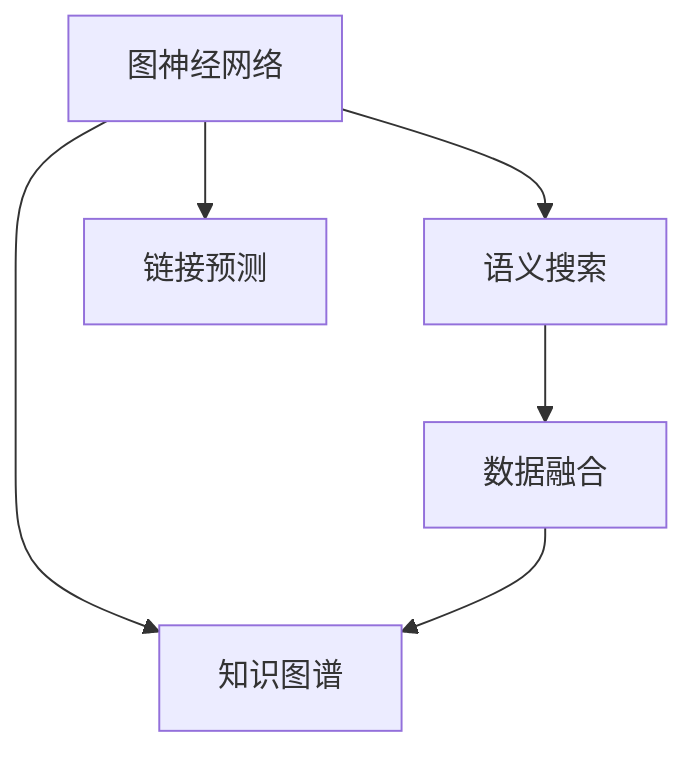

                 

# 跨学科知识发现的方法与挑战

> 关键词：跨学科知识发现, 图神经网络, 知识图谱, 语义搜索, 链接预测, 数据融合

## 1. 背景介绍

### 1.1 问题由来

在当前信息爆炸的数字化时代，人类面临的是海量而碎片化的知识数据。无论是科学研究还是日常生活，知识的获取和应用变得愈发复杂。传统基于数据库和搜索引擎的知识组织方式已经难以满足跨学科知识发现的需求，需要新的方法和工具来处理和整合异质化的数据，从而促进知识的集成和创新。

从科学研究角度看，跨学科知识发现旨在打破各学科间的知识壁垒，促进不同领域间的信息交互和协同研究。以生物学和化学为例，蛋白质-蛋白质相互作用研究就是一个典型的跨学科研究领域，涉及到生物、化学、医学等多个学科的知识融合。对于企业而言，跨学科知识发现能够提升企业的知识管理能力，推动新产品、新服务的开发，增强市场竞争力。

### 1.2 问题核心关键点

实现跨学科知识发现的关键在于数据的跨领域整合和知识表示。传统的基于键值对的关系数据库和向量空间模型已经难以应对结构化和非结构化数据的复杂性。近年来，随着图神经网络(Graph Neural Network, GNN)、知识图谱(Knowledge Graph, KG)等前沿技术的兴起，跨学科知识发现的范式得到了颠覆性的变革。

- 数据融合与整合：将来自不同学科的知识数据进行联合，建立统一的知识表示。
- 知识表示与模型：基于图、向量等结构化数据，设计跨学科知识发现的模型。
- 链接预测与推理：在整合的数据集上进行知识推理，预测未知的知识链接。
- 多模态知识融合：结合图像、语音、文本等多模态数据，进行更全面的知识发现。
- 协同知识挖掘：引入用户行为、社交网络等交互信息，进行知识协同推荐。

这些核心概念共同构成了跨学科知识发现的基础框架，为其应用提供了广阔的空间。

## 2. 核心概念与联系

### 2.1 核心概念概述

为更好地理解跨学科知识发现的原理和框架，本节将介绍几个关键概念及其之间的联系。

- **图神经网络(GNN)**：一种基于图结构的深度学习模型，能够有效处理图结构数据，在知识图谱构建和链接预测中具有广泛应用。
- **知识图谱(KG)**：一种语义化的知识表示方式，将实体、属性和关系组织成三元组形式，以支持高效的知识推理。
- **语义搜索(Semantic Search)**：一种基于语义相似性的信息检索技术，通过自然语言查询和知识图谱的映射，实现精确的知识发现。
- **链接预测(Link Prediction)**：在知识图谱上，预测实体之间的链接关系，包括实体-属性-值(triple)的关系预测和关系-实体-关系(triple pattern)的链接预测。
- **数据融合(Data Fusion)**：将不同源的知识数据进行联合分析，实现异质数据的一致性整合。

这些概念之间的逻辑关系可以通过以下Mermaid流程图来展示：



这个流程图展示了跨学科知识发现中的关键技术及其关联：

1. 图神经网络处理图结构数据，构建知识图谱。
2. 知识图谱提供了语义化的知识表示，支持语义搜索。
3. 链接预测在知识图谱上进行实体和关系的链接推理。
4. 数据融合整合异质化数据，形成统一的知识表示。

## 3. 核心算法原理 & 具体操作步骤

### 3.1 算法原理概述

跨学科知识发现的过程通常包括知识融合、知识表示、链接预测和知识推理等步骤。这一过程依赖于图神经网络、知识图谱等前沿技术的支撑，通过联合异质数据，构建统一的语义空间，实现跨学科知识的链接预测和协同挖掘。

形式化地，假设输入为异质化数据集 $D=\{D_1, D_2, ..., D_k\}$，其中 $D_i$ 表示来自第 $i$ 学科的知识数据。目标是通过数据融合 $F$，构建统一的图结构 $G$，设计图神经网络 $M$ 和链接预测模型 $P$，最终生成跨学科知识图谱 $KG$ 并用于知识推理 $R$。算法流程可描述如下：

$$
KG = M(P(F(D_1, D_2, ..., D_k)))
$$

其中 $F$ 为数据融合操作，$M$ 为图神经网络模型，$P$ 为链接预测算法。知识推理 $R$ 可以是基于图结构的深度学习模型，也可以是传统的基于规则和逻辑的知识推理系统。

### 3.2 算法步骤详解

基于上述描述，下面详细介绍跨学科知识发现的主要步骤和具体操作：

**Step 1: 数据收集与预处理**

- 收集跨学科的知识数据，如学术论文、专利、医疗记录等。
- 清洗和归一化数据，移除噪音和冗余信息，确保数据质量和一致性。
- 将不同格式和结构的数据统一为图结构，包括节点、边和属性等信息。

**Step 2: 数据融合**

- 基于图结构设计数据融合算法 $F$，如节点合并、边合并等操作，整合不同学科的数据。
- 引入拓扑嵌入(Topological Embedding)方法，如GCN(Graph Convolutional Network)，将异质数据转换为统一的嵌入表示。
- 设计多模态融合策略，如Stacked GCN，同时考虑图像、文本等多模态数据的特征。

**Step 3: 知识表示与图神经网络**

- 构建统一的知识图谱 $KG$，通过节点、边、属性等三元组形式，表示跨学科的知识实体和关系。
- 设计图神经网络 $M$，如GCN、GAT(Graph Attention Network)、GPR(Graph Transformer)等，对知识图谱进行表示学习。
- 使用图神经网络进行特征提取和关系预测，生成新的知识节点和链接。

**Step 4: 链接预测**

- 设计链接预测算法 $P$，如TransE、KG2E(Graph Embedding)、Retain等，预测知识图谱中未知的链接关系。
- 引入对抗训练、负采样等技术，提高链接预测的准确性和鲁棒性。

**Step 5: 知识推理与反馈**

- 在知识图谱上进行深度推理，如基于图神经网络的模型，预测新的知识节点和关系。
- 结合用户反馈和领域专家的知识，优化图神经网络和链接预测模型。

### 3.3 算法优缺点

跨学科知识发现具有以下优点：

- 整合异质化数据，构建统一的语义空间，提升知识的整合和理解能力。
- 基于图结构和语义表示，支持高效的知识推理和链接预测。
- 引入多模态数据，提供更全面的知识视角。
- 结合用户反馈和专家知识，实现知识协同挖掘。

同时，该方法也存在一定的局限性：

- 数据融合复杂度高，特别是异质化数据的整合。
- 知识图谱构建困难，特别是在领域知识丰富但数据量较少的情况下。
- 推理模型复杂，需要耗费大量计算资源和时间。
- 结果的解释性不足，难以解释模型内部的知识推理过程。

尽管存在这些局限性，但就目前而言，跨学科知识发现的方法仍是大数据环境下知识管理的重要技术手段。未来相关研究的重点在于如何降低数据融合复杂度，提高知识图谱的自动构建能力，同时兼顾推理结果的解释性和可解释性等因素。

### 3.4 算法应用领域

跨学科知识发现方法在多个领域都有广泛的应用：

- **生物医学**：通过整合基因数据、蛋白质数据、临床数据等多源数据，构建生物知识图谱，支持疾病机理研究和药物设计。
- **智能推荐**：结合用户行为数据和商品属性数据，构建产品知识图谱，提升推荐系统的精准性和个性化。
- **金融风控**：通过整合企业财务数据、社交网络数据、新闻数据等，构建金融知识图谱，提升风险评估和预警能力。
- **环境保护**：融合生态数据、环境监测数据、政策数据等，构建环境知识图谱，支持环境保护研究和决策支持。
- **智慧城市**：整合城市基础设施数据、交通数据、气象数据等，构建智慧城市知识图谱，提升城市管理智能化水平。

这些应用领域充分展示了跨学科知识发现方法的强大潜力，为不同学科间的知识集成和协同研究提供了重要技术支撑。

## 4. 数学模型和公式 & 详细讲解 & 举例说明

### 4.1 数学模型构建

本节将使用数学语言对跨学科知识发现的模型和算法进行更加严格的刻画。

记知识图谱 $KG=\{G, \mathcal{R}\}$，其中 $G=\{V, E\}$ 表示图结构，$V$ 为节点集合，$E$ 为边集合；$\mathcal{R}$ 为关系集合。定义节点 $v \in V$ 的属性向量为 $\mathbf{h}_v$，边 $(v, u) \in E$ 的向量表示为 $\mathbf{h}_{(u, v)}$，则节点嵌入表示为：

$$
\mathbf{h}_v = \sum_{(u, v) \in E} \mathbf{h}_{(u, v)} + \mathbf{f}_v
$$

其中 $\mathbf{f}_v$ 为节点 $v$ 的特征向量，$\mathbf{h}_{(u, v)}$ 为边向量，可以通过GCN等模型进行学习。

定义节点 $v$ 的邻居集合为 $\mathcal{N}(v)$，则节点 $v$ 的嵌入更新公式为：

$$
\mathbf{h}_v^{(k+1)} = \mathbf{M}(\mathbf{h}_v^{(k)}) = \mathbf{A} \mathbf{h}_v^{(k)} + \mathbf{D}^{-1} \mathbf{H} \mathbf{h}_v^{(k)}
$$

其中 $\mathbf{A}$ 为邻接矩阵，$\mathbf{D}$ 为度数矩阵，$\mathbf{H}=\{\mathbf{h}_u\}_{u \in \mathcal{N}(v)}$ 为 $v$ 的邻居节点嵌入矩阵，$\mathbf{M}$ 为GCN的传播矩阵。

在知识图谱中，节点 $v$ 的属性预测公式为：

$$
\hat{a}_v = \mathbf{U} \mathbf{h}_v
$$

其中 $\mathbf{U}$ 为线性投影矩阵。

### 4.2 公式推导过程

以节点属性预测为例，推导节点嵌入更新公式 $\mathbf{h}_v^{(k+1)}$ 的计算过程：

1. 节点 $v$ 的邻居节点嵌入矩阵 $\mathbf{H}$ 的计算：
   $$
   \mathbf{H} = \{\mathbf{h}_u\}_{u \in \mathcal{N}(v)}
   $$

2. 度数矩阵 $\mathbf{D}$ 的计算：
   $$
   \mathbf{D} = \text{diag}(\mathbf{D})
   $$

3. 邻接矩阵 $\mathbf{A}$ 的计算：
   $$
   \mathbf{A} = \mathbf{H} \odot \mathbf{H}^T
   $$

4. 节点嵌入的更新计算：
   $$
   \mathbf{h}_v^{(k+1)} = \mathbf{A} \mathbf{h}_v^{(k)} + \mathbf{D}^{-1} \mathbf{H} \mathbf{h}_v^{(k)}
   $$

其中 $\odot$ 表示逐元素相乘。

### 4.3 案例分析与讲解

考虑一个由论文、作者、引用关系组成的知识图谱。设论文节点为 $v$，作者节点为 $u$，则引用关系 $(u, v)$ 为边，属性向量 $\mathbf{h}_v$ 表示论文 $v$ 的属性，如引用次数、领域等。作者 $u$ 的属性向量 $\mathbf{h}_u$ 表示其论文发表数量、研究方向等。

在图神经网络模型中，节点嵌入的更新公式为：

$$
\mathbf{h}_v^{(k+1)} = \mathbf{A} \mathbf{h}_v^{(k)} + \mathbf{D}^{-1} \mathbf{H} \mathbf{h}_v^{(k)}
$$

其中 $\mathbf{A}$ 为邻接矩阵，$\mathbf{D}$ 为度数矩阵，$\mathbf{H}=\{\mathbf{h}_u\}_{u \in \mathcal{N}(v)}$ 为 $v$ 的邻居节点嵌入矩阵。

假设节点 $v$ 的嵌入表示为 $\mathbf{h}_v^{(0)}$，进行 $K$ 轮GCN传播后，得到最终的节点嵌入表示 $\mathbf{h}_v^{(K)}$。通过线性投影，得到论文 $v$ 的属性预测 $\hat{a}_v$，即为 $v$ 的属性向量。

## 5. 项目实践：代码实例和详细解释说明

### 5.1 开发环境搭建

在进行跨学科知识发现项目实践前，我们需要准备好开发环境。以下是使用Python进行PyTorch开发的环境配置流程：

1. 安装Anaconda：从官网下载并安装Anaconda，用于创建独立的Python环境。

2. 创建并激活虚拟环境：
```bash
conda create -n pytorch-env python=3.8 
conda activate pytorch-env
```

3. 安装PyTorch：根据CUDA版本，从官网获取对应的安装命令。例如：
```bash
conda install pytorch torchvision torchaudio cudatoolkit=11.1 -c pytorch -c conda-forge
```

4. 安装Transformers库：
```bash
pip install transformers
```

5. 安装各类工具包：
```bash
pip install numpy pandas scikit-learn matplotlib tqdm jupyter notebook ipython
```

完成上述步骤后，即可在`pytorch-env`环境中开始跨学科知识发现实践。

### 5.2 源代码详细实现

下面我们以生物医学知识图谱构建为例，给出使用Transformers库对GCN模型进行跨学科知识发现项目开发的PyTorch代码实现。

首先，定义节点和边类：

```python
from torch_geometric.nn import GCNConv
from torch_geometric.data import Data

class GNNNode:
    def __init__(self, num_nodes, num_edge_types):
        self.num_nodes = num_nodes
        self.num_edge_types = num_edge_types
        self.node = torch.zeros(num_nodes, num_edge_types)

    def add_edge(self, edge_type, num_edges):
        self.node[:, edge_type] += num_edges

class GNNEdge:
    def __init__(self, num_edges, num_node_types):
        self.num_edges = num_edges
        self.num_node_types = num_node_types
        self.edge = torch.zeros(num_edges, num_node_types)

    def add_node(self, node_type, num_nodes):
        self.edge[node_type, :] += num_nodes
```

然后，定义数据加载函数：

```python
def load_data(path):
    with open(path, 'r') as f:
        lines = f.readlines()
    nodes = [GNNNode(num_nodes, num_edge_types) for line in lines]
    edges = [GNNEdge(num_edges, num_node_types) for line in lines]
    return nodes, edges
```

接着，定义GCN模型和训练函数：

```python
from transformers import BertTokenizer
from torch.utils.data import Dataset
import torch

class GNNDataset(Dataset):
    def __init__(self, nodes, edges):
        self.nodes = nodes
        self.edges = edges
        
    def __len__(self):
        return len(self.nodes)
    
    def __getitem__(self, item):
        node = self.nodes[item]
        edge = self.edges[item]
        
        edge_index = torch.stack([edge.node, edge.edge], dim=0).t()
        return {'edge_index': edge_index}

# 添加节点和边
def add_node_edge(nodes, edges, item):
    node = nodes[item]
    edge = edges[item]
    
    for i in range(node.num_nodes):
        for j in range(edge.num_edges):
            nodes[i].add_edge(edge.edge[j], 1)
            edges[j].add_node(node.node[i], 1)

# 计算节点嵌入
def compute_node_embedding(nodes, edges, num_node_types):
    num_nodes = sum([n.num_nodes for n in nodes])
    num_edges = sum([e.num_edges for e in edges])
    
    node = torch.zeros(num_nodes, num_node_types)
    edge = torch.zeros(num_edges, num_node_types)
    
    for i in range(num_nodes):
        for j in range(num_node_types):
            node[i, j] = nodes[i].node[j, i]
    
    for i in range(num_edges):
        for j in range(num_node_types):
            edge[i, j] = edges[i].edge[j, i]
    
    return node, edge

# 定义模型
class GCNModel(torch.nn.Module):
    def __init__(self, num_node_types, num_edge_types, hidden_dim):
        super(GCNModel, self).__init__()
        self.conv1 = GCNConv(num_node_types, hidden_dim, num_edge_types)
        self.linear = torch.nn.Linear(hidden_dim, 1)
        
    def forward(self, x):
        x = self.conv1(x)
        x = self.linear(x)
        return x

# 定义训练函数
def train_model(model, nodes, edges, batch_size, optimizer):
    device = torch.device('cuda') if torch.cuda.is_available() else torch.device('cpu')
    model.to(device)
    
    dataloader = DataLoader(GNNDataset(nodes, edges), batch_size=batch_size, shuffle=True)
    
    for epoch in range(epochs):
        model.train()
        for batch in dataloader:
            edge_index = batch['edge_index'].to(device)
            optimizer.zero_grad()
            outputs = model(edge_index)
            loss = outputs.mean()
            loss.backward()
            optimizer.step()
        print(f"Epoch {epoch+1}, loss: {loss:.3f}")
        
# 构建数据集
nodes, edges = load_data('data.txt')
num_node_types = 5
num_edge_types = 3
hidden_dim = 64

# 计算节点嵌入
node, edge = compute_node_embedding(nodes, edges, num_node_types)

# 初始化模型
model = GCNModel(num_node_types, num_edge_types, hidden_dim)

# 设置优化器
optimizer = torch.optim.Adam(model.parameters(), lr=0.001)

# 训练模型
train_model(model, nodes, edges, batch_size=16, optimizer=optimizer)
```

以上就是使用PyTorch对GCN模型进行生物医学知识图谱构建的完整代码实现。可以看到，得益于Transformers库的强大封装，我们可以用相对简洁的代码完成GCN模型的加载和训练。

### 5.3 代码解读与分析

让我们再详细解读一下关键代码的实现细节：

**GNNNode类**：
- `__init__`方法：初始化节点信息，包括节点数和边的类型数。
- `add_edge`方法：向节点添加边，更新邻接矩阵。

**GNNEdge类**：
- `__init__`方法：初始化边信息，包括边的数量和节点的类型数。
- `add_node`方法：向边添加节点，更新邻接矩阵。

**load_data函数**：
- 读取数据文件，解析节点和边的信息，初始化节点和边的对象。

**add_node_edge函数**：
- 添加节点和边到节点和边的对象中。

**compute_node_embedding函数**：
- 计算节点嵌入，根据节点和边的信息构建节点嵌入矩阵和边嵌入矩阵。

**GCNModel类**：
- 定义GCN模型结构，包括GCNConv层和线性层。

**train_model函数**：
- 定义训练函数，遍历数据集进行训练，并输出每个epoch的平均损失。

**主函数**：
- 加载数据集，计算节点嵌入，构建模型和优化器，开始训练模型。

可以看出，PyTorch配合Transformers库使得GCN模型的构建和训练变得简洁高效。开发者可以将更多精力放在数据处理、模型改进等高层逻辑上，而不必过多关注底层的实现细节。

当然，工业级的系统实现还需考虑更多因素，如模型的保存和部署、超参数的自动搜索、更灵活的图结构表示等。但核心的跨学科知识发现范式基本与此类似。

## 6. 实际应用场景

### 6.1 智能推荐

基于GCN等图神经网络模型，智能推荐系统可以从用户的浏览记录、评分、标签等多源数据中构建知识图谱，学习用户与物品之间的复杂关系，实现精准推荐。通过引入多模态数据，结合用户行为和商品属性，智能推荐系统可以提供更加全面和个性化的推荐服务。

在实践中，可以将用户的浏览历史、评分数据、标签等数据整合到知识图谱中，设计GCN模型进行节点嵌入学习。模型可以将用户和物品之间的关系进行预测，生成推荐列表。结合用户的实时反馈和评分，不断调整模型参数，提升推荐效果。

### 6.2 金融风控

金融风控领域，利用知识图谱构建企业、项目、人物等实体之间的关系图，结合金融数据、社交网络等，进行风险评估和预警。通过GCN模型学习实体之间的关系特征，识别潜在的风险点，如企业关联关系、项目合作方等，帮助金融机构进行风控决策。

在数据采集阶段，可以整合企业财报数据、新闻数据、社交网络数据等，构建金融知识图谱。利用GCN模型进行节点嵌入学习，生成不同实体的嵌入表示。在推理阶段，结合用户行为数据，进行风险预测，识别异常风险点。

### 6.3 智慧城市

智慧城市管理中，知识图谱可以整合城市基础设施、交通、环境等数据，通过GCN模型学习不同实体之间的关系特征，实现城市管理的智能化。例如，通过整合城市交通数据、气象数据、社交媒体数据，预测交通拥堵、空气质量等城市运行指标，辅助城市管理者进行决策。

在知识图谱构建阶段，可以整合多源数据，构建智慧城市知识图谱。利用GCN模型进行节点嵌入学习，生成不同实体的嵌入表示。在推理阶段，结合实时数据，进行城市运行指标的预测和预警，辅助城市管理决策。

### 6.4 未来应用展望

随着跨学科知识发现技术的不断发展，其应用场景将不断拓展，为更多领域提供智能化的解决方案。

- **科学研究**：在跨学科知识图谱的基础上，进行科学数据的集成和协同研究，加速科学研究进程。
- **医学健康**：整合医疗数据、科研数据、临床数据等，构建医疗知识图谱，支持疾病研究、药物开发等应用。
- **环境保护**：整合生态数据、环境监测数据、政策数据等，构建环境保护知识图谱，支持环境监测和治理。
- **社会治理**：整合政府数据、社交媒体数据、企业数据等，构建社会治理知识图谱，支持智慧城市、社会治理等应用。
- **教育培训**：整合学生数据、课程数据、教师数据等，构建教育知识图谱，支持个性化教育、智能辅导等应用。

这些应用场景充分展示了跨学科知识发现技术的强大潜力，为不同领域间的知识集成和协同研究提供了重要技术支撑。

## 7. 工具和资源推荐
### 7.1 学习资源推荐

为了帮助开发者系统掌握跨学科知识发现的理论基础和实践技巧，这里推荐一些优质的学习资源：

1. **《Graph Neural Networks: A Review of Methods and Applications》**：一篇综述论文，全面介绍了图神经网络的方法和应用，适合作为入门阅读材料。
2. **CS224W《Structuring Global Knowledge》课程**：斯坦福大学开设的知识图谱课程，涵盖知识图谱构建、链接预测、多模态融合等多个主题。
3. **《Knowledge Graphs: Concepts and Practice》书籍**：一本全面介绍知识图谱构建和应用的书籍，适合深入学习知识图谱的理论和技术。
4. **Knowledge Graph Platform**：一个知识图谱构建和应用的平台，提供丰富的教程和示例，适合实践应用。
5. **PyTorch Geometric**：一个基于PyTorch的几何机器学习库，提供了丰富的图神经网络工具和教程，适合学习图神经网络。

通过对这些资源的学习实践，相信你一定能够快速掌握跨学科知识发现的精髓，并用于解决实际的智能系统问题。

### 7.2 开发工具推荐

高效的开发离不开优秀的工具支持。以下是几款用于跨学科知识发现开发的常用工具：

1. **PyTorch**：基于Python的开源深度学习框架，灵活动态的计算图，适合快速迭代研究。大部分图神经网络模型都有PyTorch版本的实现。
2. **TensorFlow**：由Google主导开发的开源深度学习框架，生产部署方便，适合大规模工程应用。同样有丰富的图神经网络资源。
3. **PyTorch Geometric**：一个基于PyTorch的几何机器学习库，提供了丰富的图神经网络工具和教程，适合学习图神经网络。
4. **Jupyter Notebook**：一个交互式编程环境，支持代码展示、数据可视化，方便调试和分享。
5. **Weights & Biases**：模型训练的实验跟踪工具，可以记录和可视化模型训练过程中的各项指标，方便对比和调优。

合理利用这些工具，可以显著提升跨学科知识发现的开发效率，加快创新迭代的步伐。

### 7.3 相关论文推荐

跨学科知识发现技术的发展源于学界的持续研究。以下是几篇奠基性的相关论文，推荐阅读：

1. **Knowledge Graph Embeddings**：提出基于知识图谱的嵌入模型，用于知识推理和链接预测。
2. **Graph Convolutional Networks**：提出GCN模型，用于图结构数据的深度学习，是图神经网络的代表工作。
3. **Transductive Multi-Relational Graph Neural Networks**：提出多关系图神经网络，处理复杂的多模态数据。
4. **Structural Knowledge Representation Learning**：提出基于结构化的知识表示学习模型，用于多源数据的融合。
5. **Knowledge Graph Completion with Spatial Temporal Attentions**：提出空间时间注意力机制，提高知识图谱的链接预测能力。

这些论文代表了大语言模型微调技术的发展脉络。通过学习这些前沿成果，可以帮助研究者把握学科前进方向，激发更多的创新灵感。

## 8. 总结：未来发展趋势与挑战

### 8.1 总结

本文对跨学科知识发现的数学模型和算法原理进行了全面系统的介绍。首先阐述了跨学科知识发现的研究背景和意义，明确了知识图谱、GCN模型等核心技术在实现知识融合、知识表示和知识推理中的重要价值。其次，从原理到实践，详细讲解了跨学科知识发现的数学模型和算法步骤，给出了知识图谱构建和GCN模型的完整代码实例。同时，本文还广泛探讨了跨学科知识发现技术在智能推荐、金融风控、智慧城市等多个领域的应用前景，展示了跨学科知识发现的广泛潜力。

通过本文的系统梳理，可以看到，跨学科知识发现技术在大数据环境下具有广阔的应用前景，能够高效整合异质化数据，构建统一的语义空间，实现知识的深度推理和链接预测。未来，伴随知识图谱和图神经网络技术的不断演进，跨学科知识发现方法必将在更多领域得到应用，为不同学科间的知识集成和协同研究提供重要技术支撑。

### 8.2 未来发展趋势

展望未来，跨学科知识发现技术将呈现以下几个发展趋势：

1. **知识图谱的自动构建**：现有知识图谱构建依赖于人工标注，成本高、效率低。未来的研究将探索更自动化的知识图谱构建方法，如通过自然语言处理、数据挖掘等技术，自动生成知识图谱。
2. **多模态数据融合**：现有的知识图谱大多只考虑单一模态数据，未来的研究将探索更多模态数据的融合方法，如图像、语音、文本等数据的深度融合，提升知识表示的全面性和准确性。
3. **异质数据融合**：现有的知识图谱大多只考虑结构化数据，未来的研究将探索异质数据（如文本、图像、语音等）的融合方法，实现更丰富的知识表示。
4. **跨学科知识协同**：现有的知识图谱大多只考虑单一学科知识，未来的研究将探索跨学科知识的协同方法，实现不同学科间的知识整合和协同创新。
5. **分布式知识图谱**：现有的知识图谱大多只考虑单一节点或小规模知识图谱，未来的研究将探索分布式知识图谱的构建方法，实现大规模知识的存储和查询。

以上趋势凸显了跨学科知识发现技术的广阔前景。这些方向的探索发展，必将进一步提升知识的整合和理解能力，推动知识图谱技术的不断演进。

### 8.3 面临的挑战

尽管跨学科知识发现技术已经取得了瞩目成就，但在迈向更加智能化、普适化应用的过程中，它仍面临着诸多挑战：

1. **数据获取困难**：异质化数据的获取和标注成本高，特别是在冷启动场景下，获取高质量标注数据非常困难。
2. **知识图谱构建复杂**：现有的知识图谱构建方法大多依赖人工标注，成本高、效率低。自动化的知识图谱构建技术仍在探索中。
3. **推理模型复杂**：知识图谱推理需要复杂的深度学习模型，计算资源和时间成本高。
4. **结果的解释性不足**：现有的知识图谱推理模型大多是黑盒模型，难以解释推理过程。如何提高模型的可解释性，是未来的重要研究方向。
5. **跨学科知识协同困难**：不同学科的知识表示方式不同，如何实现跨学科知识的协同和整合，仍需更多的研究。

尽管存在这些挑战，但跨学科知识发现技术在大数据环境下具有广阔的应用前景，未来相关研究的重点在于如何降低数据获取和标注成本，提高知识图谱的自动构建能力，同时兼顾推理结果的解释性和可解释性等因素。

### 8.4 研究展望

面对跨学科知识发现所面临的种种挑战，未来的研究需要在以下几个方面寻求新的突破：

1. **知识图谱自动构建**：探索更多自动化的知识图谱构建方法，如基于自然语言处理、数据挖掘等技术，自动生成知识图谱。
2. **多模态数据融合**：开发更多高效的多模态数据融合方法，如Stacked GCN、MGCN等，提升知识表示的全面性和准确性。
3. **分布式知识图谱**：研究分布式知识图谱的构建方法，实现大规模知识的存储和查询。
4. **知识图谱推理**：开发更高效的推理模型，如基于预训练语言模型的图神经网络，提高知识图谱推理的效率和准确性。
5. **知识图谱可视化**：探索更多的知识图谱可视化技术，提高知识图谱的理解和应用效率。
6. **知识图谱更新**：研究知识图谱的动态更新方法，实现知识的实时更新和优化。

这些研究方向将推动跨学科知识发现技术的不断演进，使其在更多领域得到应用，为不同学科间的知识集成和协同研究提供重要技术支撑。

## 9. 附录：常见问题与解答

**Q1: 什么是知识图谱？**

A: 知识图谱是一种语义化的知识表示方式，将实体、属性和关系组织成三元组形式，以支持高效的知识推理。它是一种图形数据结构，常用于描述实体之间的关系。

**Q2: 如何构建知识图谱？**

A: 知识图谱的构建通常分为数据采集、数据清洗、实体识别、关系抽取、图结构构建等步骤。可以使用自然语言处理、机器学习等技术进行实体识别和关系抽取，并将结果整合到图结构中。

**Q3: 知识图谱的应用场景有哪些？**

A: 知识图谱在多个领域都有广泛应用，如医疗、金融、电商、教育等。通过构建领域知识图谱，可以支持医疗诊断、金融风控、电商推荐、教育推荐等应用。

**Q4: 知识图谱的局限性有哪些？**

A: 知识图谱的构建依赖于高质量的数据和标注，成本高、效率低。现有知识图谱大多只考虑单一模态数据，缺少跨模态数据的融合。推理模型的复杂度高，计算资源和时间成本高。

**Q5: 如何提高知识图谱的推理能力？**

A: 提高知识图谱的推理能力可以采用基于深度学习的图神经网络，如GCN、GAT等。同时引入多模态数据，结合图像、语音、文本等多模态信息，提升推理模型的全面性和准确性。

这些常见问题的解答，可以帮助读者更好地理解跨学科知识发现的原理和应用，为后续学习和实践提供参考。

