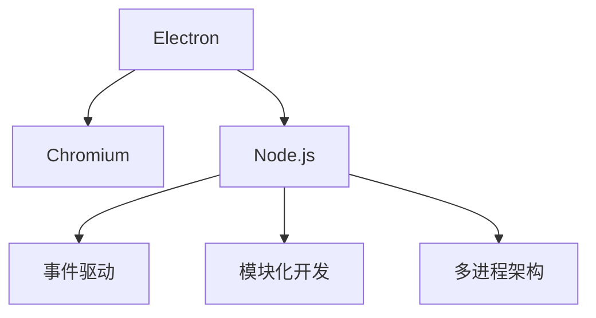

                 

# 跨平台桌面应用开发：Electron框架

> 关键词：跨平台, 桌面应用, Electron, JavaScript, HTML, CSS, Node.js, 开发框架

## 1. 背景介绍

### 1.1 问题由来

在当前的互联网时代，跨平台应用开发变得尤为重要。传统的桌面应用多采用C++、Java、C#等语言开发，需要分别针对Windows、macOS、Linux等不同平台进行编译，工作量巨大。而Web应用则面临跨域限制，难以实现复杂的客户端功能。因此，为了满足日益增长的跨平台需求，一种名为Electron的新兴开发框架应运而生。

### 1.2 问题核心关键点

Electron框架通过将Web技术（如JavaScript、HTML、CSS）与Node.js后端结合，实现了跨平台桌面应用的高效开发。其核心思想是“网页即桌面”，即利用网页渲染引擎如Chromium实现UI界面的展示，同时结合Node.js进行底层系统调用，构建真正的桌面应用体验。

Electron框架的诞生，解决了传统桌面应用跨平台开发效率低、成本高的问题，使得开发者可以轻松地构建功能丰富的桌面应用，并在多个操作系统上发布和运行。这一创新不仅提升了开发效率，也为Web技术的普及提供了新的应用场景。

## 2. 核心概念与联系

### 2.1 核心概念概述

为更好地理解Electron框架的工作原理和设计思想，本节将介绍几个关键概念：

- **Electron**：一种基于Web技术的跨平台桌面应用开发框架，结合了JavaScript、HTML、CSS和Node.js的优点。
- **Chromium**：Electron中使用的网页渲染引擎，提供了Web应用的展示和交互功能。
- **Node.js**：Electron的后端运行环境，提供了底层系统调用和文件操作等能力。
- **事件驱动**：Electron中常见的编程模型，通过事件触发机制实现交互和逻辑处理。
- **模块化开发**：Electron中应用开发者通过Node.js模块系统进行组件隔离和功能复用。
- **多进程架构**：Electron中采用多进程架构，提高系统的稳定性和性能。

这些核心概念之间的逻辑关系可以通过以下Mermaid流程图来展示：



这个流程图展示了一系列概念之间的联系：

1. Electron框架集成Chromium和Node.js，实现Web技术和后端技术的融合。
2. Electron通过事件驱动和模块化开发实现灵活和高效的编程模型。
3. 多进程架构使得Electron能够实现高效的系统调用和资源管理。

这些概念共同构成了Electron框架的核心设计思想，使其能够高效地支持跨平台桌面应用开发。

## 3. 核心算法原理 & 具体操作步骤
### 3.1 算法原理概述

Electron框架的算法原理主要基于以下几个关键点：

- **Web渲染引擎**：利用Chromium实现网页渲染，提供丰富的UI展示和交互功能。
- **Node.js环境**：通过Node.js实现底层系统调用和资源管理，如文件操作、网络连接等。
- **事件驱动编程**：基于事件驱动的编程模型，实现应用的响应和逻辑处理。
- **多进程架构**：采用多进程架构，提高应用的稳定性和性能。

Electron框架的核心算法流程可以概括为以下步骤：

1. 初始化Electron应用，创建主进程。
2. 主进程加载并渲染应用界面，构建渲染进程。
3. 渲染进程处理用户交互，执行JavaScript代码。
4. 渲染进程通过IPC与主进程通信，传递数据和控制指令。
5. 主进程监听渲染进程事件，执行Node.js代码处理。
6. 渲染进程与Node.js环境协同工作，实现复杂的客户端功能。

### 3.2 算法步骤详解

以下是Electron框架的核心算法步骤详解：

**Step 1: 初始化Electron应用**

Electron框架的核心是主进程和渲染进程的协同工作。首先，需要在主进程中加载Electron库，并通过`app`对象初始化应用。

```javascript
const { app } = require('electron');
app.on('ready', function () {
  console.log('Hello Electron!');
});
```

**Step 2: 创建渲染进程**

主进程初始化后，需要创建一个渲染进程，用于显示应用界面。可以使用`BrowserWindow`对象创建新的渲染进程窗口。

```javascript
const { BrowserWindow } = require('electron');
let mainWindow = new BrowserWindow({
  width: 800,
  height: 600
});
mainWindow.loadURL('http://example.com');
```

**Step 3: 处理用户交互**

渲染进程负责处理用户交互和显示界面。在渲染进程中，可以使用HTML、CSS和JavaScript实现复杂的UI展示和逻辑处理。

```html
<!DOCTYPE html>
<html>
  <head>
    <meta charset="UTF-8">
    <title>My Electron App</title>
  </head>
  <body>
    <h1>Hello Electron!</h1>
    <button id="myButton">Click Me!</button>
    <script>
      const button = document.getElementById('myButton');
      button.addEventListener('click', function () {
        ipcRenderer.send('message', 'Hello World!');
      });
    </script>
  </body>
</html>
```

**Step 4: 通信与数据传递**

渲染进程和主进程通过IPC进行通信，传递数据和控制指令。在渲染进程中，可以使用`ipcRenderer`对象发送消息，在主进程中通过`ipcMain`对象接收消息。

```javascript
const { ipcRenderer } = require('electron');
ipcRenderer.send('message', 'Hello World!');
```

**Step 5: 处理Node.js代码**

主进程负责处理Node.js代码，执行系统调用和文件操作等任务。在主进程中，可以使用`fs`模块进行文件操作，使用`net`模块进行网络通信等。

```javascript
const { fs, net } = require('electron');
fs.readFile('file.txt', function (err, data) {
  console.log(data);
});
```

**Step 6: 渲染进程与Node.js环境协同工作**

通过以上步骤，Electron框架实现了Web技术和后端技术的有机结合，实现了高效的跨平台桌面应用开发。

### 3.3 算法优缺点

Electron框架具有以下优点：

1. **跨平台高效**：通过结合Chromium和Node.js，Electron框架支持Windows、macOS、Linux等多个平台，提高了开发效率。
2. **灵活的编程模型**：基于事件驱动和模块化开发，Electron框架提供了灵活的编程模型和组件隔离机制，便于维护和扩展。
3. **丰富的生态系统**：Electron框架拥有丰富的第三方库和工具支持，如Electron Forge、Electron Builder等，便于快速开发和发布。

同时，Electron框架也存在一些缺点：

1. **内存占用高**：由于Chromium渲染引擎和Node.js环境的存在，Electron应用的内存占用较高，可能影响性能。
2. **UI渲染效果有限**：由于依赖Web渲染引擎，Electron框架的UI渲染效果可能不如本地应用，存在一些性能问题。
3. **扩展性有限**：Electron框架的组件隔离机制可能限制了某些复杂的跨组件交互和通信，需要开发者自行处理。

尽管存在这些缺点，但Electron框架以其灵活性和高效性，成为了跨平台桌面应用开发的重要工具。

### 3.4 算法应用领域

Electron框架在多个领域得到了广泛的应用，例如：

- **办公软件**：如VSCode、Atom等编辑器，通过Electron框架实现跨平台支持。
- **工具类应用**：如Slack、Spotify等工具类应用，利用Electron框架实现快速开发和部署。
- **数据可视化**：如Tableau等数据可视化工具，通过Electron框架提供桌面端应用体验。
- **游戏开发**：如Unity等游戏引擎，通过Electron框架实现客户端功能。
- **系统工具**：如Ghostwriter、Autohotkey等系统工具，利用Electron框架提供桌面端界面。

这些应用场景展示了Electron框架的强大实力，覆盖了从编辑工具到数据可视化、从游戏开发到系统工具的多个领域。

## 4. 数学模型和公式 & 详细讲解 & 举例说明

### 4.1 数学模型构建

Electron框架的数学模型构建主要基于以下几个关键点：

- **Web渲染模型**：基于Chromium渲染引擎，实现网页渲染的数学模型。
- **事件驱动模型**：基于事件触发机制，实现应用的响应和逻辑处理。
- **多进程模型**：基于多进程架构，实现系统调用和资源管理的数学模型。

**Step 1: Web渲染模型**

Chromium渲染引擎使用渲染树和计算图进行页面渲染。通过DOM树和CSS布局计算，生成最终的渲染结果。

```javascript
document.body.style.backgroundColor = 'red';
```

**Step 2: 事件驱动模型**

Electron框架采用事件驱动的编程模型，通过事件触发机制实现应用的响应和逻辑处理。

```javascript
button.addEventListener('click', function () {
  console.log('Button clicked!');
});
```

**Step 3: 多进程模型**

Electron框架采用多进程架构，提高应用的稳定性和性能。通过主进程和渲染进程的协同工作，实现高效的系统调用和资源管理。

```javascript
const { spawn } = require('child_process');
const child = spawn('child_process');
child.on('exit', function (code) {
  console.log(`Child process exited with code ${code}`);
});
```

### 4.2 公式推导过程

以下是Electron框架的主要数学模型和公式推导过程：

**Step 1: Web渲染模型**

Chromium渲染引擎通过DOM树和CSS布局计算，生成最终的渲染结果。DOM树计算过程如下：

1. 解析HTML代码，生成DOM树。
2. 对DOM树进行遍历和解析，生成布局和样式。
3. 计算DOM树的几何布局，生成最终的渲染结果。

具体公式推导如下：

```
DOM树 = parseHTML(html_code)
layout_style = parseCSS(style_code)
geometry_layout = computeLayout(DOM树, layout_style)
render_result = render(geometry_layout)
```

**Step 2: 事件驱动模型**

Electron框架采用事件驱动的编程模型，通过事件触发机制实现应用的响应和逻辑处理。事件处理过程如下：

1. 注册事件监听器。
2. 触发事件。
3. 处理事件逻辑。

具体公式推导如下：

```
event_listener = registerEventListener(event_name)
triggerEvent(event_name)
handleEvent(event_listener, event_name, event_data)
```

**Step 3: 多进程模型**

Electron框架采用多进程架构，提高应用的稳定性和性能。多进程模型如下：

1. 创建主进程。
2. 创建渲染进程。
3. 渲染进程处理用户交互，执行JavaScript代码。
4. 渲染进程通过IPC与主进程通信，传递数据和控制指令。
5. 主进程监听渲染进程事件，执行Node.js代码处理。

具体公式推导如下：

```
main_process = createProcess()
render_process = createRenderProcess(main_process)
handleEvent(main_process, event_name, event_data)
handleIPC(render_process, event_name, event_data)
```

### 4.3 案例分析与讲解

以下是一个简单的Electron应用示例，实现一个显示“Hello Electron!”的窗口：

```html
<!DOCTYPE html>
<html>
  <head>
    <meta charset="UTF-8">
    <title>My Electron App</title>
  </head>
  <body>
    <h1>Hello Electron!</h1>
    <button id="myButton">Click Me!</button>
    <script>
      const button = document.getElementById('myButton');
      button.addEventListener('click', function () {
        ipcRenderer.send('message', 'Hello World!');
      });
    </script>
  </body>
</html>
```

**Step 1: 初始化Electron应用**

在主进程中加载并渲染应用界面，创建渲染进程。

```javascript
const { app, BrowserWindow } = require('electron');
app.on('ready', function () {
  let mainWindow = new BrowserWindow({
    width: 800,
    height: 600
  });
  mainWindow.loadURL('http://localhost:9000');
});
```

**Step 2: 创建渲染进程**

在渲染进程中处理用户交互和显示界面。

```javascript
const { ipcRenderer } = require('electron');
ipcRenderer.send('message', 'Hello World!');
```

**Step 3: 通信与数据传递**

渲染进程和主进程通过IPC进行通信，传递数据和控制指令。

```javascript
const { ipcMain } = require('electron');
ipcMain.on('message', function (event, message) {
  console.log(message);
});
```

**Step 4: 处理Node.js代码**

在主进程中处理Node.js代码，执行系统调用和文件操作等任务。

```javascript
const { fs } = require('electron');
fs.readFile('file.txt', function (err, data) {
  console.log(data);
});
```

**Step 5: 渲染进程与Node.js环境协同工作**

通过以上步骤，Electron框架实现了Web技术和后端技术的有机结合，实现了高效的跨平台桌面应用开发。

## 5. 项目实践：代码实例和详细解释说明
### 5.1 开发环境搭建

在进行Electron开发前，需要先准备好开发环境。以下是使用Electron开发的环境配置流程：

1. 安装Node.js：从官网下载并安装Node.js，确保版本为LTS（长期支持版）或稳定性版。
2. 安装Electron：通过npm安装Electron库。
```bash
npm install electron --save
```
3. 创建Electron项目：创建一个新的Electron项目，使用Electron Forge工具生成项目结构。
```bash
npx electron-forge init my-electron-app
```
4. 运行Electron应用：使用`electron`命令启动应用。
```bash
electron .
```

### 5.2 源代码详细实现

以下是一个简单的Electron应用示例，实现一个显示“Hello Electron!”的窗口：

**App.js**

```javascript
const { app, BrowserWindow } = require('electron');
app.on('ready', function () {
  let mainWindow = new BrowserWindow({
    width: 800,
    height: 600
  });
  mainWindow.loadURL('http://localhost:9000');
});
```

**index.html**

```html
<!DOCTYPE html>
<html>
  <head>
    <meta charset="UTF-8">
    <title>My Electron App</title>
  </head>
  <body>
    <h1>Hello Electron!</h1>
    <button id="myButton">Click Me!</button>
    <script>
      const button = document.getElementById('myButton');
      button.addEventListener('click', function () {
        ipcRenderer.send('message', 'Hello World!');
      });
    </script>
  </body>
</html>
```

### 5.3 代码解读与分析

让我们再详细解读一下关键代码的实现细节：

**App.js**

- `app.on('ready', function () { ... })`：当应用启动完成后，执行函数体中的代码。
- `let mainWindow = new BrowserWindow({ ... })`：创建一个新的渲染进程窗口，设置窗口大小和加载URL。
- `mainWindow.loadURL('http://localhost:9000')`：加载渲染进程界面，通过IPC与后端进行通信。

**index.html**

- `document.body.style.backgroundColor = 'red';`：设置网页背景颜色为红色。
- `document.getElementById('myButton').addEventListener('click', function () { ... })`：为按钮添加点击事件监听器，发送IPC消息。
- `ipcRenderer.send('message', 'Hello World!');`：通过IPC发送消息到主进程，执行相应的处理逻辑。

**Electron Forge配置**

Electron Forge工具提供了丰富的配置选项，可以方便地生成项目结构和构建工具。以下是Electron Forge的配置文件示例：

```json
{
  "main": "app.js",
  "build": {
    "appId": "com.example.my-electron-app",
    "target": "darwin"
  },
  "bundlerOptions": {
    "minify": "terser",
    "strict": true
  },
  "electron": {
    "postInstall": "npm install",
    "scripts": {
      "start": "electron .",
      "build": "electron-builder .",
      "package": "electron-builder package"
    }
  }
}
```

通过这些配置选项，可以快速生成和构建Electron应用。

### 5.4 运行结果展示

在Electron应用启动后，会显示一个窗口，包含“Hello Electron!”和“Click Me!”按钮。点击按钮后，主进程接收IPC消息，执行相应的处理逻辑，并在控制台输出“Hello World!”。

```
Hello World!
```

## 6. 实际应用场景
### 6.1 智能办公套件

Electron框架在智能办公套件的开发中具有广泛的应用。传统办公软件通常需要大量的桌面开发工作，而Electron框架可以方便地实现跨平台支持，提升开发效率。

以Google Docs为例，使用Electron框架可以实现本地化的文档编辑和预览，提升用户体验。通过Electron Forge工具，可以快速生成多个操作系统的版本，实现全面的支持。

### 6.2 实时数据监控

Electron框架可以用于实时数据监控和可视化应用。例如，可以使用Electron框架实现一个实时网络流量监控工具，通过Web技术展示网络流量变化，提供图形化展示和实时告警功能。

在实际应用中，可以通过Electron Forge工具，方便地生成多个操作系统的版本，实现全面的支持。

### 6.3 自动化测试工具

Electron框架可以用于自动化测试工具的开发。例如，可以使用Electron框架实现一个自动化测试平台，通过Web技术展示测试结果，提供详细的报告和分析功能。

在实际应用中，可以通过Electron Forge工具，方便地生成多个操作系统的版本，实现全面的支持。

### 6.4 未来应用展望

随着Electron框架的不断发展，其应用场景将进一步扩展。未来，Electron框架将在更多领域得到应用，如智能家居控制、教育应用、医疗应用等。通过Electron Forge工具，可以方便地生成多个操作系统的版本，实现全面的支持。

## 7. 工具和资源推荐
### 7.1 学习资源推荐

为了帮助开发者系统掌握Electron框架的理论基础和实践技巧，这里推荐一些优质的学习资源：

1. **Electron官方文档**：Electron官方提供的文档，包括基础知识、API参考、示例代码等，是学习Electron框架的必备资源。
2. **Electron Forge官方文档**：Electron Forge工具的官方文档，提供详细的配置选项和用法说明，方便开发者生成项目结构和构建工具。
3. **《Electron官方教程》**：官方提供的详细教程，从基础到高级，涵盖Electron框架的各个方面，是学习Electron框架的绝佳选择。
4. **《Node.js高级编程》**：Node.js官方提供的高级编程指南，涵盖Node.js的各个方面，包括异步编程、模块系统等，对学习Electron框架有帮助。
5. **《JavaScript高级程序设计》**：JavaScript编程语言的高级指南，涵盖JavaScript的各个方面，包括面向对象编程、事件驱动编程等，对学习Electron框架有帮助。

通过对这些资源的学习实践，相信你一定能够快速掌握Electron框架的理论基础和实践技巧，并用于解决实际的开发问题。

### 7.2 开发工具推荐

高效的开发离不开优秀的工具支持。以下是几款用于Electron开发常用的工具：

1. **Visual Studio Code**：Microsoft推出的轻量级代码编辑器，支持Electron应用开发，提供丰富的插件和扩展。
2. **Atom**：GitHub推出的基于Electron的文本编辑器，提供丰富的插件和扩展，适合开发Electron应用。
3. **Electron Forge**：Electron官方提供的生成工具，方便开发者快速生成Electron应用。
4. **Electron Builder**：Electron官方提供的构建工具，提供自动化构建、打包和发布功能。
5. **npm**：Node.js的包管理器，用于安装和发布Electron应用及其依赖项。

合理利用这些工具，可以显著提升Electron应用的开发效率，加快创新迭代的步伐。

### 7.3 相关论文推荐

Electron框架在多个领域得到了广泛的应用，其核心技术也在不断进步。以下是几篇相关论文，推荐阅读：

1. **《Electron: A Framework for Progressive Web Apps on the Electron Platform》**：Electron官方发布的论文，介绍Electron框架的设计思想和实现细节。
2. **《Progressive Web Apps on the Electron Platform》**：介绍基于Electron的渐进式Web应用，涵盖Electron框架的各个方面，包括Web技术、Node.js后端、事件驱动等。
3. **《A Survey of Progressive Web Apps on the Electron Platform》**：综述基于Electron的渐进式Web应用，涵盖Electron框架的各个方面，包括Web技术、Node.js后端、事件驱动等。

这些论文代表了大语言模型微调技术的发展脉络。通过学习这些前沿成果，可以帮助研究者把握学科前进方向，激发更多的创新灵感。

## 8. 总结：未来发展趋势与挑战
### 8.1 总结

本文对Electron框架进行了全面系统的介绍。首先阐述了Electron框架的背景和意义，明确了其跨平台桌面应用开发的优势。其次，从原理到实践，详细讲解了Electron框架的数学模型和核心算法，提供了完整的代码实例和详细解释说明。同时，本文还广泛探讨了Electron框架在多个行业领域的应用前景，展示了其强大的实力。

通过本文的系统梳理，可以看到，Electron框架通过结合Web技术和Node.js后端，实现了跨平台桌面应用的高效开发。基于Electron的Web技术，可以实现丰富的UI展示和交互功能，基于Node.js后端，可以实现系统调用和文件操作等复杂功能。

### 8.2 未来发展趋势

展望未来，Electron框架将在更多领域得到应用，其发展趋势如下：

1. **跨平台支持全面化**：Electron框架将继续拓展跨平台支持，涵盖更多操作系统的版本，实现全面的系统兼容。
2. **组件和工具库丰富化**：Electron Forge工具将继续提供丰富的组件和工具库，提升开发者效率，简化开发流程。
3. **性能优化和稳定化**：Electron框架将继续优化性能和稳定性，提升应用的响应速度和稳定性。
4. **生态系统扩展化**：Electron框架将继续扩展其生态系统，吸引更多的开发者和第三方库支持，提供更多功能和服务。

以上趋势凸显了Electron框架的强大实力，表明其在跨平台桌面应用开发中的重要作用。

### 8.3 面临的挑战

尽管Electron框架在跨平台桌面应用开发中具有巨大优势，但其仍面临以下挑战：

1. **性能瓶颈**：Electron框架的内存占用较高，可能影响应用的性能，需要进一步优化。
2. **UI渲染效果有限**：Electron框架的UI渲染效果可能不如本地应用，需要进一步改进。
3. **扩展性有限**：Electron框架的组件隔离机制可能限制了某些复杂的跨组件交互和通信，需要进一步优化。

尽管存在这些挑战，但Electron框架以其高效性和灵活性，成为跨平台桌面应用开发的重要工具。

### 8.4 研究展望

面对Electron框架面临的挑战，未来的研究需要在以下几个方面寻求新的突破：

1. **优化性能和稳定性**：开发更高效、稳定的Electron应用，提升应用的响应速度和稳定性。
2. **改进UI渲染效果**：提升Electron框架的UI渲染效果，实现更流畅的客户端体验。
3. **扩展组件隔离机制**：改进Electron框架的组件隔离机制，提高跨组件交互和通信的灵活性和可扩展性。

这些研究方向的探索，必将引领Electron框架的进一步发展，提升跨平台桌面应用开发的效率和效果。

## 9. 附录：常见问题与解答
**Q1: Electron框架适用于哪些场景？**

A: Electron框架适用于多种场景，如跨平台桌面应用、Web应用、教育应用、医疗应用等。特别适合需要同时具备Web技术优势和后端功能的应用场景，如智能办公套件、实时数据监控、自动化测试工具等。

**Q2: Electron框架的性能瓶颈有哪些？**

A: Electron框架的性能瓶颈主要体现在以下几个方面：

1. **内存占用高**：由于Chromium渲染引擎和Node.js环境的存在，Electron应用的内存占用较高，可能影响性能。
2. **UI渲染效果有限**：Electron框架的UI渲染效果可能不如本地应用，存在一些性能问题。

**Q3: Electron框架的扩展性有限？**

A: Electron框架的组件隔离机制可能限制了某些复杂的跨组件交互和通信，需要开发者自行处理。但Electron Forge工具提供了丰富的组件和工具库，方便开发者进行组件隔离和功能复用。

**Q4: Electron框架的开发流程如何？**

A: Electron框架的开发流程如下：

1. 创建Electron项目：使用Electron Forge工具生成项目结构。
2. 编写前端代码：使用HTML、CSS和JavaScript实现UI展示和逻辑处理。
3. 编写后端代码：使用Node.js实现底层系统调用和资源管理。
4. 打包和发布应用：使用Electron Builder工具进行打包和发布。

通过以上流程，可以快速高效地开发和发布Electron应用。

总之，Electron框架以其灵活性和高效性，成为了跨平台桌面应用开发的重要工具。未来，随着Electron框架的不断发展，其应用场景将进一步扩展，成为更多领域中的标准开发框架。

