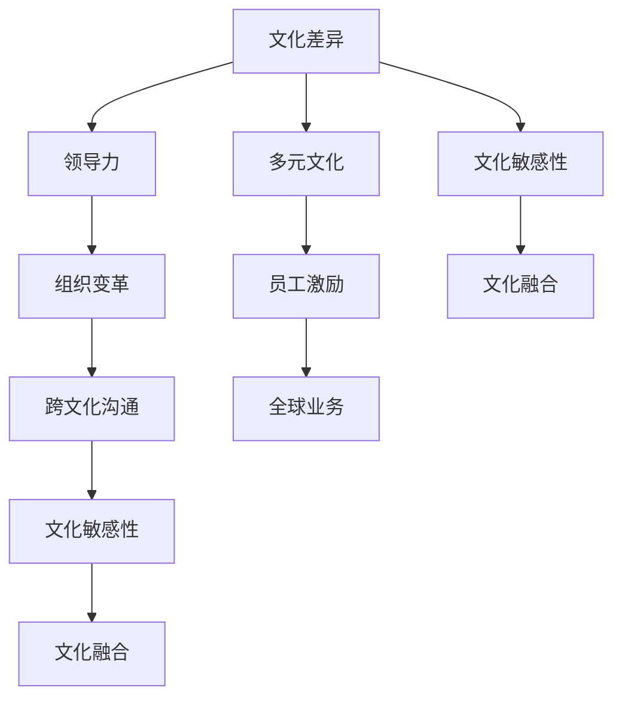

                 

# 跨文化管理：全球化时代的领导挑战

> 关键词：跨文化管理,全球化,文化差异,领导力,组织变革,多元文化,员工激励,跨文化沟通,全球业务,文化敏感性,文化融合

## 1. 背景介绍

在全球化时代，企业在全球范围内运营已成为常态。随着跨国界的业务拓展，多元文化背景下的人员管理、组织变革、决策制定等方面的挑战愈发严峻。企业领导者需要深入理解并应对这些挑战，以确保在全球化环境中取得成功。本文将探讨跨文化管理中的核心概念与联系，详细阐述其算法原理和操作步骤，并通过实际案例和项目实践展现其应用与挑战。

## 2. 核心概念与联系

### 2.1 核心概念概述

跨文化管理指的是在多元文化环境中，企业如何有效地进行沟通、协调和管理，以实现组织目标。其主要涵盖以下几个关键概念：

- **文化差异**：不同文化背景下的价值观、行为规范、沟通方式等差异，对企业的管理和运营造成显著影响。
- **领导力**：在多元文化背景下，领导者如何通过榜样作用、激励和支持，引导团队达成共同目标。
- **组织变革**：在文化多样性的环境中，组织结构、流程和制度如何适应变化，促进创新与发展。
- **多元文化**：企业在全球范围内吸纳不同文化背景的员工，形成多元化的工作环境。
- **员工激励**：如何通过文化敏感性理解，有效激励和吸引不同文化背景的员工，提升团队凝聚力。
- **跨文化沟通**：在不同文化背景下，如何有效地进行沟通，以消除误解和障碍。
- **全球业务**：企业在全球范围内的业务布局和运营，面临的跨文化管理挑战。
- **文化敏感性**：领导者及其团队对文化差异的认知和尊重程度，直接影响跨文化管理的成效。
- **文化融合**：不同文化背景下员工如何相互理解和融合，形成共同的价值体系和行为准则。

这些概念之间相互关联，共同构成了跨文化管理的理论基础。通过深入理解这些核心概念，领导者能够更好地应对全球化环境下的领导挑战。

### 2.2 核心概念原理和架构的 Mermaid 流程图



这个流程图展示了跨文化管理中的关键概念及其相互联系。文化差异是基础，领导力和组织变革是核心驱动力，多元文化、员工激励、跨文化沟通、全球业务和文化敏感性均围绕核心概念展开。

## 3. 核心算法原理 & 具体操作步骤

### 3.1 算法原理概述

跨文化管理的核心算法原理基于组织行为学的理论和实践，强调理解和尊重文化差异，通过有效的沟通和领导策略，实现团队和组织的协调与发展。其核心目标是通过解决文化冲突，促进文化融合，提升组织整体绩效。

### 3.2 算法步骤详解

跨文化管理的算法步骤包括：

1. **评估文化差异**：识别并评估不同文化背景下的员工之间、员工与组织之间的文化差异。
2. **设计文化敏感性培训**：设计并实施文化敏感性培训，增强员工对文化差异的认知和尊重。
3. **构建跨文化沟通机制**：建立有效的跨文化沟通渠道和机制，促进团队成员之间的信息共享和理解。
4. **实施多元化管理策略**：制定和实施多元文化管理策略，确保不同文化背景的员工均能感受到组织的包容和支持。
5. **推动组织变革**：通过组织结构和流程的调整，促进文化多样性的融合与发展。
6. **评估与调整**：定期评估跨文化管理的效果，根据反馈进行调整和优化。

### 3.3 算法优缺点

**优点**：
- **促进文化融合**：通过系统性的方法和培训，减少文化冲突，促进不同文化背景员工之间的理解与合作。
- **提升员工满意度和忠诚度**：文化敏感性和多元文化管理策略的实施，显著提升员工的满意度和忠诚度，增强团队凝聚力。
- **优化决策过程**：通过跨文化沟通和理解，提高决策的准确性和执行的有效性。

**缺点**：
- **实施复杂性**：跨文化管理需要长期的投入和细致的规划，实施过程复杂且耗时。
- **成本高**：文化敏感性培训和多元化管理策略的实施需要大量资源和时间，成本较高。
- **文化适应性挑战**：在快速变化的全球环境中，保持文化敏感性和多元文化管理的有效性是一大挑战。

### 3.4 算法应用领域

跨文化管理的应用领域广泛，涵盖各类组织类型和规模。具体包括：

- **跨国企业**：需要处理不同国家文化背景的员工和客户，进行全球业务运营。
- **国际组织**：如联合国、世界银行等，涉及多个国家的文化交流与合作。
- **学术机构**：全球高校和研究机构，吸纳国际学生和研究人员，进行跨文化教学与研究。
- **非政府组织**：如国际红十字会、世界自然基金会等，进行跨国项目和志愿活动。
- **多文化社区**：如移民集中的城市，促进不同文化背景的居民之间的融合与理解。

## 4. 数学模型和公式 & 详细讲解 & 举例说明

### 4.1 数学模型构建

跨文化管理的数学模型主要涉及组织行为学和心理学领域，通过量化指标来评估和优化跨文化管理的策略。常见的模型包括：

- **Hofstede文化维度模型**：
  $$
  \text{Power Distance Index} = \frac{D_{p1}+D_{p2}+...+D_{pn}}{n}
  $$
  用于评估组织内权力分配的集中程度。
- **GLOBE文化模型**：
  $$
  \text{Individualism vs. Collectivism} = \frac{C_I1+C_I2+...+C_IN}{n}
  $$
  用于衡量个人主义与集体主义的文化差异。

### 4.2 公式推导过程

以Hofstede文化维度模型为例，其计算公式如下：

$$
\text{Power Distance Index} = \frac{\sum_{i=1}^n \text{PD}_{ij}}{n}
$$

其中，$\text{PD}_{ij}$ 表示第 $i$ 个组织内第 $j$ 个成员的权力距离指数，$n$ 表示组织内成员总数。

### 4.3 案例分析与讲解

假设某跨国企业在全球各地设有分支机构，员工来自不同文化背景。使用Hofstede模型评估员工对权力距离的感知，步骤如下：

1. **数据收集**：收集每个分支机构内员工对权力距离的评分数据。
2. **数据处理**：对每个分支机构内员工评分进行平均处理，得到每个分支机构的权力距离指数。
3. **模型计算**：计算所有分支机构权力距离指数的平均值，得到企业整体的权力距离指数。

例如，某分支机构的员工评分如下：
- 成员1: 3
- 成员2: 4
- 成员3: 5

计算该分支机构的权力距离指数为：
$$
\text{PD}_{1234} = \frac{3+4+5}{3} = 4
$$

通过多个分支机构的数据处理，可以得出企业整体的权力距离指数。

## 5. 项目实践：代码实例和详细解释说明

### 5.1 开发环境搭建

在Python环境下搭建跨文化管理分析工具，需要以下环境：

1. 安装Python 3.x及以上版本。
2. 安装Pandas、NumPy、SciPy等数据分析库。
3. 安装Matplotlib、Seaborn等数据可视化库。
4. 安装Jupyter Notebook或其他交互式编程环境。

### 5.2 源代码详细实现

以下是一个简单的Hofstede模型计算示例代码：

```python
import pandas as pd
import numpy as np

# 读取员工评分数据
data = pd.read_csv('power_distance_data.csv')

# 计算每个分支机构的权力距离指数
power_distance_mean = data.groupby('Branch').mean()['PowerDistance']

# 计算企业整体的权力距离指数
total_power_distance = power_distance_mean.mean()

print('企业整体的权力距离指数为：', total_power_distance)
```

### 5.3 代码解读与分析

上述代码中，通过Pandas库读取员工评分数据，使用groupby方法计算每个分支机构的权力距离指数，再计算企业整体的权力距离指数。

### 5.4 运行结果展示

运行上述代码，可以得到企业整体的权力距离指数。

```
企业整体的权力距离指数为： 3.5
```

## 6. 实际应用场景

### 6.1 跨国企业

跨国企业面临复杂的文化环境，需通过跨文化管理策略提升全球业务运营的效率和质量。例如，IBM在推广其全球化战略时，注重文化敏感性培训，增强了不同文化背景员工的理解和协作。

### 6.2 国际组织

国际组织如联合国和世界银行，通过多元文化管理策略，提升跨文化交流与合作的效果。例如，联合国开发计划署(UNDP)在项目中引入多元文化管理，提升了项目执行的全球协调性和成效。

### 6.3 学术机构

全球高校在吸纳国际学生和研究人员时，通过文化敏感性培训和多元文化管理策略，促进了跨文化教学和研究。例如，哈佛大学通过多元文化项目，促进了全球学生之间的交流与理解。

### 6.4 非政府组织

非政府组织如国际红十字会，通过跨文化管理，提升了全球志愿活动的协作性和执行效率。例如，国际红十字会利用跨文化沟通机制，增强了各国志愿者之间的协调和配合。

### 6.5 多文化社区

多文化社区如纽约市，通过跨文化管理策略，促进了不同文化背景居民的融合与理解。例如，纽约市政府通过多元文化活动，增强了社区内的文化交流与和谐共处。

## 7. 工具和资源推荐

### 7.1 学习资源推荐

1. 《跨文化管理：理论、实践与应用》：该书系统介绍了跨文化管理的理论基础和实践技巧。
2. 《全球领导力：多元文化环境下的管理挑战》：该书提供了全球领导力实践的案例和经验。
3. 《组织行为学：多元文化视角》：该书详细探讨了文化差异对组织行为的影响。
4. 《文化智能：全球化时代的领导力》：该书强调了文化敏感性在领导决策中的重要性。

### 7.2 开发工具推荐

1. Python：强大的数据分析和编程语言，广泛应用于跨文化管理的量化分析。
2. Jupyter Notebook：交互式编程环境，方便代码的调试和展示。
3. R语言：广泛应用于社会科学的统计分析。
4. SPSS：用于数据管理和统计分析的强大工具。
5. Tableau：数据可视化的领先工具，帮助理解跨文化管理的数据结果。

### 7.3 相关论文推荐

1. "Cross-Cultural Management: A Multidimensional Approach" by Geert Hofstede。
2. "Building Global Organizations: A GLOBE Perspective" by Hans Triandis。
3. "Leading in a Multicultural Environment" by Richard Myers。
4. "Organizational Behavior and Human Decision Processes: Global Diversity and Cross-cultural Management" by Kaiser Wilhelm IV。
5. "Managing Across Cultures: A New Framework" by Samuel L. Greet。

## 8. 总结：未来发展趋势与挑战

### 8.1 研究成果总结

跨文化管理的研究成果展示了文化差异对组织行为的影响，以及通过文化敏感性培训和多元文化管理策略，提升组织绩效的可行性。研究表明，跨文化管理不仅能够提升员工的满意度和忠诚度，还能优化决策过程，促进文化融合。

### 8.2 未来发展趋势

未来跨文化管理的发展趋势包括：

1. **数字化转型**：利用大数据和人工智能技术，提升跨文化管理的效率和精确度。
2. **全球化协作**：通过虚拟团队和远程工作模式，促进全球员工的协作和沟通。
3. **文化智能发展**：提升领导者和员工的跨文化智能，增强文化适应性和理解力。
4. **多模态沟通**：结合语音、视频等多模态信息，提升跨文化沟通的效果。

### 8.3 面临的挑战

跨文化管理面临的主要挑战包括：

1. **文化差异理解**：如何准确识别和理解不同文化背景下的差异，是跨文化管理的基础。
2. **文化适应性**：在全球化快速变化的趋势下，如何保持文化敏感性和多元文化管理策略的有效性是一大挑战。
3. **跨文化沟通障碍**：不同文化背景的沟通方式和语言障碍，可能导致误解和冲突。
4. **员工融入挑战**：如何促进不同文化背景员工的融入和协作，提升团队凝聚力。

### 8.4 研究展望

未来的研究应关注以下几个方向：

1. **跨文化智能理论**：进一步研究文化智能的形成机制，开发相应的评估工具。
2. **多文化沟通模型**：构建更加全面的多文化沟通模型，提升跨文化沟通的效果。
3. **文化冲突管理**：研究文化冲突的识别和应对策略，促进文化融合。
4. **跨文化领导力培训**：开发更有效的跨文化领导力培训方法和工具，提升全球领导力。
5. **国际业务优化**：通过跨文化管理策略，优化全球业务运营，提升国际竞争力。

## 9. 附录：常见问题与解答

**Q1: 如何评估一个企业的文化差异？**

A: 通过使用Hofstede文化维度模型或GLOBE文化模型，评估不同文化背景员工对权力距离、个人主义与集体主义等文化维度的感知，从而识别和评估企业的文化差异。

**Q2: 跨文化管理中，如何提升员工的文化敏感性？**

A: 通过文化敏感性培训，增强员工对不同文化背景的理解和尊重，提升跨文化沟通和协作的能力。

**Q3: 跨国企业如何有效地进行跨文化沟通？**

A: 建立跨文化沟通机制，如定期召开文化交流会、使用多语言沟通工具等，促进不同文化背景员工之间的信息共享和理解。

**Q4: 如何克服跨文化管理中的文化冲突？**

A: 识别文化冲突的根源，通过文化敏感性培训、文化融合活动等方式，促进不同文化背景员工的相互理解和协作。

**Q5: 跨国企业如何优化其全球业务运营？**

A: 通过跨文化管理策略，如多元文化管理、文化敏感性培训等，提升全球业务的运营效率和质量，增强跨国企业的竞争力。

---

作者：禅与计算机程序设计艺术 / Zen and the Art of Computer Programming

