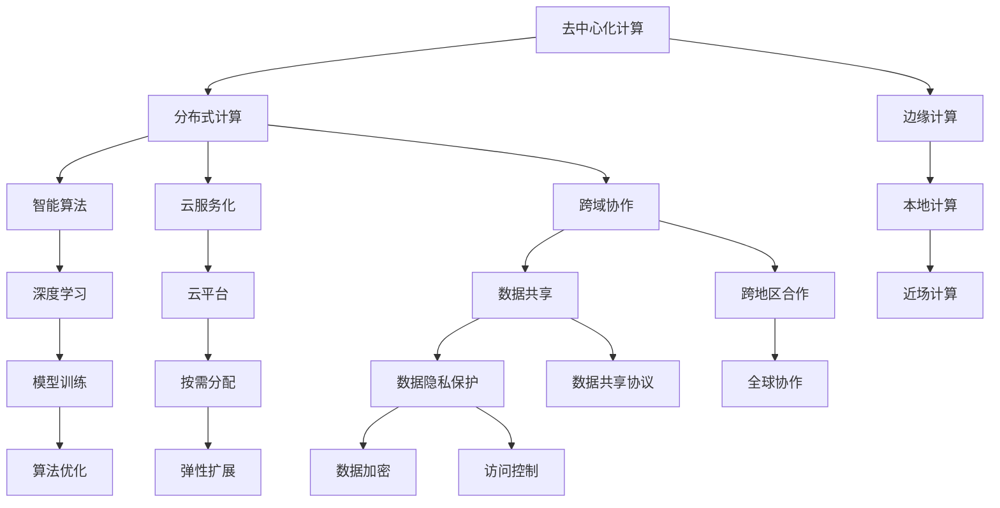
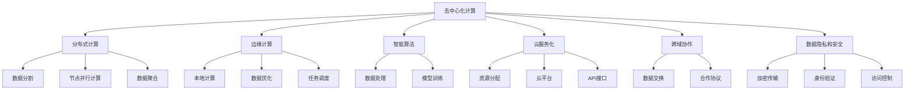

                 

## 1. 背景介绍

### 1.1 问题由来
在全球化信息爆炸的时代，海量数据、庞大网络、多元化计算资源构成了人类计算的基础。以互联网为核心的分布式计算体系，不仅推动了科技的迅速发展，也促进了社会的全面进步。与此同时，计算系统的可靠性、安全性、自动化程度和智能化水平也在不断提升，对全球经济和社会的影响也愈发深远。

在AI和云计算等新兴技术的推动下，全球计算正在从集中式向分散式转型，计算资源分布愈发扁平化。随着各种新的计算框架和算法模型的不断涌现，人类计算的潜力和影响力正在逐步释放。

### 1.2 问题核心关键点
当前，全球计算正处于一个重要变革阶段，其核心关键点包括：

1. **去中心化计算**：分布式计算、区块链等技术的应用，使得计算资源从集中式走向去中心化。
2. **大规模数据管理**：海量数据的海量存储、处理和管理，对计算资源的需求和存储能力提出了新的挑战。
3. **边缘计算**：将计算任务分布到边缘设备，如IoT设备、智能手机等，提升计算效率和响应速度。
4. **云服务化**：云计算的广泛应用，使得计算能力通过云服务方式按需分配，提升资源利用率。
5. **跨域协作**：全球协同计算，促进跨地区、跨领域的资源整合与共享。
6. **智能自动化**：智能算法和机器学习模型的应用，使得计算资源能够自动高效地完成任务。
7. **安全与隐私保护**：计算资源的分布式特性，对安全与隐私保护提出了更高要求。

## 2. 核心概念与联系

### 2.1 核心概念概述

为了更好地理解人类计算的全球影响力，本节将介绍几个关键概念：

- **去中心化计算**：分布式计算技术，通过将计算任务分解为多个子任务，在多个计算节点上并行计算，然后汇总结果。
- **边缘计算**：将计算资源分布到靠近数据源的边缘设备，减少数据传输的延迟和带宽需求，提升计算效率。
- **智能算法**：基于机器学习、深度学习等技术构建的算法，能够高效处理和分析海量数据。
- **云服务化**：计算资源通过云服务形式按需分配，提供弹性和可扩展性。
- **跨域协作**：不同地区和领域的计算资源和数据共享合作，提高计算效率和成果利用率。
- **数据隐私和安全**：保护数据不被未经授权访问和篡改，确保计算过程的安全可靠。

这些核心概念之间的逻辑关系可以通过以下Mermaid流程图来展示：



### 2.2 核心概念原理和架构的 Mermaid 流程图



## 3. 核心算法原理 & 具体操作步骤

### 3.1 算法原理概述

人类计算的核心算法通常基于分布式计算模型，结合智能算法和云服务化技术。其核心思想是通过多个计算节点协同工作，高效处理海量数据，提升计算性能和效率。

形式化地，假设计算任务可以分解为 $n$ 个子任务 $T_1, T_2, \ldots, T_n$，每个子任务由不同计算节点并行执行。每个节点 $C_i$ 可以执行的子任务数为 $T_i$，则整个计算任务的完成时间为：

$$
T = \sum_{i=1}^n \frac{T_i}{C_i}
$$

其中 $C_i$ 表示节点 $C_i$ 的计算能力。

### 3.2 算法步骤详解

基于人类计算的分布式计算算法通常包括以下几个关键步骤：

**Step 1: 任务分解**
- 将计算任务分解为多个子任务，每个子任务可以被单个计算节点执行。

**Step 2: 任务调度**
- 根据计算节点的工作负载和计算能力，合理调度子任务到不同的节点。

**Step 3: 并行计算**
- 各个计算节点并行执行子任务，实现任务加速。

**Step 4: 数据聚合**
- 汇总各个节点的计算结果，得到最终结果。

**Step 5: 反馈优化**
- 根据任务执行情况和节点状态，动态调整任务分解和调度策略，优化计算性能。

### 3.3 算法优缺点

基于人类计算的分布式计算算法具有以下优点：

1. 高效性：通过多节点协同计算，能够显著提升计算效率。
2. 可扩展性：计算节点可以动态扩展，满足不同规模的计算需求。
3. 可靠性：多个节点共同执行任务，提升计算系统的容错能力。
4. 灵活性：可以根据任务特点，灵活调整任务分解和调度策略。

同时，这种算法也存在一些局限性：

1. 通信开销：节点间数据传输和通信可能消耗大量时间和带宽。
2. 同步开销：节点间同步计算结果和状态可能造成一定的延迟。
3. 管理复杂性：任务调度和节点管理需要较高的技术水平。
4. 资源分配不均：不同节点计算能力差异可能导致资源分配不均衡。

### 3.4 算法应用领域

基于人类计算的分布式计算算法已经广泛应用于多个领域：

- **云计算**：通过云平台提供弹性的计算资源，支持大规模数据处理和存储。
- **物联网**：将边缘计算设备融入计算网络，提升实时性和响应速度。
- **大数据**：分布式计算框架如Hadoop、Spark等，支持海量数据的存储和分析。
- **人工智能**：基于分布式计算的智能算法和模型训练，提升AI应用的计算效率。
- **工业自动化**：分布式计算技术支持工业自动化系统的高效协同工作。

## 4. 数学模型和公式 & 详细讲解

### 4.1 数学模型构建

假设计算任务可以分解为 $n$ 个子任务 $T_1, T_2, \ldots, T_n$，每个子任务需要计算时间 $T_i$，各个节点的计算能力分别为 $C_1, C_2, \ldots, C_n$，则整个计算任务的完成时间 $T$ 可以表示为：

$$
T = \sum_{i=1}^n \frac{T_i}{C_i}
$$

假设每个节点的计算能力 $C_i$ 相同，则有：

$$
T = n \times \frac{T_i}{C_i} = \frac{T_i}{C_i} \times n
$$

其中 $n$ 为计算节点数量。

### 4.2 公式推导过程

在计算任务分解后，假设任务并行度为 $p$，则计算任务的总时间为：

$$
T = \frac{T_i}{C_i} \times n \times p
$$

其中 $p$ 为并行度，即同时执行的子任务数量。

在实际应用中，通常需要考虑节点通信和同步开销，因此有：

$$
T = \frac{T_i}{C_i} \times n \times p + t_{\text{comm}} + t_{\text{sync}}
$$

其中 $t_{\text{comm}}$ 为节点间通信开销，$t_{\text{sync}}$ 为节点间同步开销。

### 4.3 案例分析与讲解

考虑一个包含 $m$ 个数据点的数据集，每个节点可以处理 $k$ 个数据点。任务并行度为 $p$，节点通信和同步开销分别为 $t_{\text{comm}}$ 和 $t_{\text{sync}}$，则总计算时间为：

$$
T = \frac{m}{k} \times n \times p + t_{\text{comm}} + t_{\text{sync}}
$$

通过合理设置 $n$、$p$、$k$ 等参数，可以优化总计算时间。例如，当数据规模 $m$ 固定时，增加并行度 $p$ 可以提升计算效率，但也会增加通信和同步开销。因此，需要权衡不同参数的影响，选择最优的计算策略。

## 5. 项目实践：代码实例和详细解释说明

### 5.1 开发环境搭建

在进行人类计算项目开发前，我们需要准备好开发环境。以下是使用Python进行Hadoop和Spark开发的常见环境配置流程：

1. 安装Anaconda：从官网下载并安装Anaconda，用于创建独立的Python环境。

2. 创建并激活虚拟环境：
```bash
conda create -n spark-env python=3.8 
conda activate spark-env
```

3. 安装Hadoop和Spark：根据操作系统，从官网获取对应的安装包，安装并配置Hadoop和Spark。

4. 安装必要的Python库：
```bash
pip install pyspark pyspark-shell pyspark-context
```

5. 启动Spark Shell：
```bash
spark-shell
```

### 5.2 源代码详细实现

这里我们以Spark进行大数据计算为例，给出完整的代码实现。

```python
from pyspark import SparkContext

# 初始化Spark Context
sc = SparkContext('local', 'Human Computating')

# 创建RDD对象
data = sc.parallelize([(1, 'A'), (2, 'B'), (3, 'C')])

# 定义计算任务
def calculate_task(x):
    return (x[0] * 2, x[1])

# 计算结果
result = data.map(calculate_task).collect()

print(result)
```

### 5.3 代码解读与分析

让我们再详细解读一下关键代码的实现细节：

**初始化Spark Context**：
- 创建Spark Context对象，指定运行模式为本地模式。

**创建RDD对象**：
- 使用parallelize方法创建RDD对象，将本地数据转化为分布式数据集。

**定义计算任务**：
- 定义计算函数，将输入数据进行加倍操作，返回计算结果。

**计算结果**：
- 使用map方法对RDD进行计算，将结果转化为新的RDD。
- 使用collect方法将RDD结果收集到本地，输出计算结果。

**Spark的并行处理**：
- 在Spark中，RDD是分布式数据集，能够自动进行数据分区和任务调度，支持并行计算。
- 通过map方法，将计算任务分解为多个小任务，并行执行，实现任务加速。

**Spark的弹性伸缩**：
- Spark能够根据任务需求动态扩展计算节点，满足不同规模的计算需求。

## 6. 实际应用场景

### 6.1 智慧城市

基于人类计算技术，智慧城市能够实现数据的实时采集、分析和应用。通过分布式计算和云计算，城市管理部门可以高效处理海量数据，优化交通、环境、能源等各个方面。

在实际应用中，可以构建智慧交通系统，通过智能算法和大数据技术，实时监测道路交通状况，优化交通信号控制，减少拥堵，提升通行效率。同时，可以通过边缘计算和数据共享，提升数据传输和处理效率，实现更加智能化的城市管理。

### 6.2 智能医疗

智能医疗是全球计算技术的典型应用之一。通过分布式计算和云计算，医疗数据能够得到高效处理和分析，提升诊断和治疗的精准度和效率。

在智能医疗中，可以构建智能诊断系统，通过大数据分析和机器学习算法，对海量医疗数据进行挖掘和分析，实现疾病的早期预警和精准诊断。同时，可以通过分布式计算技术，加速数据处理和模型训练，提升诊断和治疗的效率。

### 6.3 金融科技

金融科技是全球计算技术的重要应用领域。通过分布式计算和云计算，金融机构能够高效处理海量交易数据，提升风险管理和决策支持能力。

在金融科技中，可以构建智能风控系统，通过大数据分析和机器学习算法，对交易数据进行实时监测和分析，实现风险的精准识别和控制。同时，可以通过分布式计算技术，加速数据处理和模型训练，提升风控和决策的效率。

## 7. 工具和资源推荐

### 7.1 学习资源推荐

为了帮助开发者系统掌握人类计算技术，这里推荐一些优质的学习资源：

1. 《Hadoop核心技术》系列博文：由Hadoop专家撰写，深入浅出地介绍了Hadoop原理和实践技巧。

2. 《Spark权威指南》书籍：Spark官方推荐读物，详细介绍了Spark的核心技术和应用场景。

3. 《Python大数据与机器学习》课程：由知名教育平台开设，系统讲解了Python与大数据、机器学习的结合应用。

4. Coursera《大数据与机器学习》课程：由斯坦福大学开设，涵盖大数据技术和机器学习算法的综合应用。

5. GitHub《Hadoop和Spark项目》：包含大量开源项目和示例代码，助力开发者实践学习。

通过对这些资源的学习实践，相信你一定能够快速掌握人类计算技术，并用于解决实际的计算问题。

### 7.2 开发工具推荐

高效的开发离不开优秀的工具支持。以下是几款用于人类计算开发的常用工具：

1. Hadoop：Apache开发的分布式计算框架，支持海量数据的存储和处理。

2. Spark：Apache开发的快速、通用、可扩展的分布式计算引擎，支持多种编程语言。

3. Flink：Apache开发的流式处理框架，支持实时数据处理和分析。

4. Hive：基于Hadoop的数据仓库技术，支持SQL查询和数据处理。

5. Spark SQL：Spark的SQL查询引擎，支持快速的大数据处理和分析。

6. Google Cloud BigQuery：基于云计算的数据仓库，支持大规模数据存储和分析。

合理利用这些工具，可以显著提升人类计算任务的开发效率，加快创新迭代的步伐。

### 7.3 相关论文推荐

人类计算技术的发展源于学界的持续研究。以下是几篇奠基性的相关论文，推荐阅读：

1. MapReduce：简明地介绍MapReduce模型及其在大数据处理中的应用。

2. GFS：Google文件系统，介绍海量数据的分布式存储技术。

3. YARN：Yahoo资源管理器，介绍资源调度和管理技术。

4. Spark：Spark系统概述及其核心组件。

5. AI-ML：人工智能和机器学习技术在大数据中的应用。

这些论文代表了大数据和分布式计算技术的发展脉络。通过学习这些前沿成果，可以帮助研究者把握学科前进方向，激发更多的创新灵感。

## 8. 总结：未来发展趋势与挑战

### 8.1 总结

本文对人类计算技术进行了全面系统的介绍。首先阐述了人类计算技术的研究背景和意义，明确了其在智慧城市、智能医疗、金融科技等领域的广泛应用。其次，从原理到实践，详细讲解了分布式计算、智能算法和云服务化技术，给出了具体的代码实现。同时，本文还探讨了人类计算技术面临的挑战和未来发展趋势。

通过本文的系统梳理，可以看到，人类计算技术正在成为大数据和分布式计算领域的重要范式，极大地提升了数据处理和分析的效率。随着技术的不断演进，人类计算技术还将进一步拓展其应用范围，推动各行业的智能化转型。

### 8.2 未来发展趋势

展望未来，人类计算技术将呈现以下几个发展趋势：

1. 边缘计算兴起：随着物联网设备的普及，边缘计算技术将得到广泛应用，提升数据处理和实时响应的效率。
2. 区块链融合：区块链技术将应用于数据安全和去中心化计算，提升计算系统的可信度和安全性。
3. 人工智能深度融合：AI算法将与分布式计算技术深度结合，提升计算系统的智能化水平。
4. 云计算扩展：云平台将提供更加高效、灵活、弹性的计算资源，支持更复杂的计算任务。
5. 数据湖和数据流处理：通过构建数据湖和数据流处理框架，实现数据的集中存储和实时处理。
6. 跨领域协同：不同领域和行业的计算资源和数据将进一步整合，提升整体计算效率。
7. 隐私保护和伦理考量：数据隐私和安全保护将得到更严格的重视，伦理考量将更加深入。

以上趋势凸显了人类计算技术的广阔前景。这些方向的探索发展，必将进一步提升计算系统的性能和应用范围，为各行各业带来新的变革。

### 8.3 面临的挑战

尽管人类计算技术已经取得了瞩目成就，但在迈向更加智能化、普适化应用的过程中，它仍面临着诸多挑战：

1. 数据隐私和安全：数据隐私和安全保护始终是计算系统的关键问题。如何确保数据在分布式计算过程中不被泄露和篡改，是未来需要解决的重要挑战。
2. 计算资源管理：海量数据的存储和处理需要高效的计算资源管理机制，如何优化资源分配和调度，提高计算系统的效率和弹性，需要更多的研究和实践。
3. 跨域协作复杂性：不同地域和领域之间的数据共享和协作，需要建立标准化的合作机制，避免数据孤岛和信息壁垒。
4. 计算成本和能耗：大规模计算任务对计算资源的需求和能耗问题，也需要更多的解决方案和优化措施。
5. 系统复杂度：随着计算任务的复杂度增加，系统的设计和维护将变得越来越困难，需要更多工程实践和技术积累。

这些挑战需要我们共同努力，不断创新和优化，才能实现人类计算技术的可持续发展。

### 8.4 研究展望

未来，人类计算技术的研究将围绕以下几个方向展开：

1. 分布式计算和边缘计算的深度融合：结合物联网设备，提升计算系统的实时性和响应能力。
2. 智能算法和大数据技术的结合：通过AI算法优化数据处理和分析过程，提升计算系统的智能化水平。
3. 区块链技术和去中心化计算的结合：提升计算系统的安全性和可信度，减少数据泄露和篡改的风险。
4. 云计算与边缘计算的协同：构建云-边协同计算架构，优化数据存储和处理过程，提升计算系统的弹性。
5. 数据隐私和伦理保护：建立数据隐私和安全保护机制，确保计算系统的伦理性和安全性。
6. 跨领域计算资源的整合：构建跨领域、跨行业的计算资源池，提升整体计算效率和应用价值。

这些研究方向的探索，必将引领人类计算技术迈向更高的台阶，为构建更加智能、安全和高效的计算系统铺平道路。面向未来，人类计算技术需要与AI、大数据、区块链等新兴技术进行更深入的融合，多路径协同发力，共同推动全球计算的变革和进步。

## 9. 附录：常见问题与解答

**Q1：人类计算技术是否适用于所有计算场景？**

A: 人类计算技术适用于需要处理海量数据、需要实时响应和计算效率的场景。对于一些计算量较小、实时性要求不高的场景，集中式计算仍然是更优的选择。

**Q2：如何优化人类计算系统的资源管理？**

A: 优化资源管理可以从以下几个方面入手：
1. 动态资源调度：根据计算任务的负载，动态调整计算节点的数量和分配。
2. 数据本地化：尽量将计算任务和数据存储在同一节点，减少数据传输开销。
3. 异构资源管理：支持不同类型计算资源的管理和调度，提升计算系统的灵活性。
4. 资源池管理：构建统一的资源池，支持多种计算任务的灵活分配和调度。

**Q3：人类计算技术在数据隐私和安全保护方面需要注意什么？**

A: 数据隐私和安全保护是计算系统的核心问题，需要注意以下几点：
1. 数据加密：在数据传输和存储过程中，采用加密技术保护数据安全。
2. 访问控制：限制对数据和计算资源的访问权限，确保数据的安全性。
3. 数据匿名化：对数据进行匿名化处理，保护用户隐私。
4. 审计和监控：建立数据访问和操作的审计机制，确保系统的安全性。

**Q4：人类计算技术在实际应用中如何提升系统效率？**

A: 提升系统效率可以从以下几个方面入手：
1. 数据预处理：对数据进行预处理，去除无用数据，减少计算量。
2. 算法优化：优化算法模型，提高计算效率。
3. 任务并行化：通过分布式计算和并行计算，提升计算效率。
4. 边缘计算：将计算任务分布到边缘设备，提升计算效率和响应速度。

**Q5：人类计算技术在实际应用中如何处理跨域协作问题？**

A: 处理跨域协作问题可以从以下几个方面入手：
1. 建立标准化的数据共享协议：确保不同地域和领域的数据能够顺利共享。
2. 构建统一的数据平台：通过统一的数据平台，实现数据和计算资源的整合。
3. 选择合适的合作机制：选择合适的合作机制，确保不同地域和领域的数据和计算资源能够高效协作。

---

作者：禅与计算机程序设计艺术 / Zen and the Art of Computer Programming

