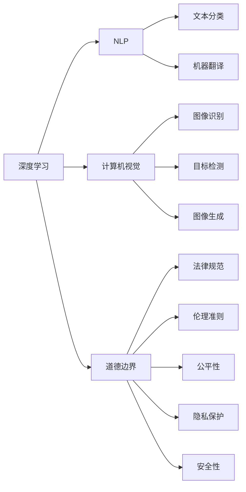

                 

# 道德边界：AI 发展面临的挑战

## 1. 背景介绍

随着人工智能(AI)技术的飞速发展，深度学习、自然语言处理(NLP)、计算机视觉等领域取得了显著进展，这些技术在各行各业中的应用不断深化，正在重塑人类社会的生产方式和日常生活。然而，与此同时，AI技术的广泛应用也引发了诸多道德和伦理问题，这些问题不仅影响技术的可持续发展，也关乎人类社会的健康和公正。

本文将探讨AI发展中面临的主要道德边界问题，并深入分析这些问题背后的原因，为制定合理有效的政策规范提供参考，保障AI技术的健康发展。

## 2. 核心概念与联系

### 2.1 核心概念概述

- **人工智能(AI)**：使用计算机系统模拟人类智能行为，包括感知、学习、推理、决策等。
- **深度学习(Deep Learning)**：一种模拟人类神经网络结构的机器学习方法，擅长处理大规模复杂数据，具有自适应学习能力。
- **自然语言处理(NLP)**：使计算机能够理解和处理自然语言的能力，涉及语言模型、文本分类、机器翻译等任务。
- **计算机视觉(Computer Vision)**：使计算机能够识别和理解图像和视频的能力，涉及图像识别、目标检测、图像生成等任务。
- **道德边界(Moral Boundary)**：AI技术在应用过程中，需要遵循的伦理准则和法律规范，以避免对人类造成伤害和负面影响。

这些概念之间具有密切联系。深度学习和NLP、CV等技术构成了AI的核心，而道德边界问题涉及AI技术的应用场景和原则。本文将通过一系列具体案例，分析这些概念如何相互交织，共同影响AI技术的伦理挑战。

### 2.2 核心概念原理和架构的 Mermaid 流程图



## 3. 核心算法原理 & 具体操作步骤

### 3.1 算法原理概述

AI技术的算法原理基于大量的数据训练，通过优化模型参数以实现特定的功能。然而，这些算法在训练和应用过程中，可能会遇到一些道德边界问题，如数据偏见、算法透明性、隐私保护等。

### 3.2 算法步骤详解

AI算法的典型步骤包括数据准备、模型训练、模型评估和模型部署。在每个阶段，都可能面临不同的道德边界问题。以下是详细的步骤分析：

#### 3.2.1 数据准备

数据是训练AI模型的基础，但数据集往往存在偏见、不完整、不平衡等问题。这些问题可能导致算法输出不公平、有偏见的结果。

- **数据采集**：确保数据采集过程的透明性，避免数据偏见。可以通过多源数据收集、数据平衡等方法缓解问题。
- **数据清洗**：去除数据中的错误、噪声和不必要信息，保证数据质量。
- **数据标注**：确保标注过程的准确性和公正性，避免标注偏见。

#### 3.2.2 模型训练

在模型训练阶段，可能需要大规模计算资源，而这些资源往往集中在大型科技公司手中，可能引发数据和算力垄断问题。

- **算力资源分配**：合理分配算力资源，避免资源集中带来的不公平。
- **模型参数优化**：优化模型参数，避免过度拟合或欠拟合，提高模型公平性和鲁棒性。

#### 3.2.3 模型评估

模型评估阶段需要评估模型的性能和泛化能力，但评估标准可能存在多样性，导致不同的评估结果。

- **公平性评估**：使用公平性指标，如差异处理率、准确率、召回率等，确保模型在不同群体中表现一致。
- **隐私保护评估**：评估模型对用户隐私的影响，确保模型不泄露个人敏感信息。

#### 3.2.4 模型部署

模型部署是将训练好的模型应用于实际场景中，这一阶段可能面临隐私泄露、安全性等问题。

- **隐私保护**：采用差分隐私、联邦学习等技术，确保模型在保护用户隐私的同时，提供高质量的服务。
- **安全性保障**：确保模型部署在安全的网络环境中，防止模型被攻击或篡改。

### 3.3 算法优缺点

#### 3.3.1 优点

AI算法具有以下优点：

- **高效性**：大规模数据训练和模型优化，可以快速处理大量复杂任务。
- **自适应能力**：通过深度学习和NLP等技术，AI算法具有较强的自适应和自我优化能力。
- **广泛应用**：AI技术在医疗、金融、交通等多个领域具有广泛应用前景。

#### 3.3.2 缺点

AI算法也存在以下缺点：

- **数据依赖性高**：依赖高质量、大规模的数据集，数据偏见和噪声可能导致模型输出不公平。
- **透明性不足**：模型决策过程复杂，缺乏透明性，难以解释和调试。
- **安全性和隐私问题**：大规模数据和模型部署可能引发数据泄露和隐私侵害问题。

### 3.4 算法应用领域

AI算法在多个领域得到广泛应用，例如：

- **医疗健康**：用于医学影像分析、疾病预测、个性化医疗等。
- **金融服务**：用于信用评估、风险管理、欺诈检测等。
- **智能交通**：用于交通流量预测、自动驾驶、智能调度等。
- **环境保护**：用于环境监测、污染预测、资源管理等。
- **教育培训**：用于智能辅导、在线教育、考试评估等。

这些应用领域展示了AI技术的广泛前景，但同时也带来了诸多道德和伦理挑战。如何在这些应用中平衡技术效益和社会影响，是当前的重要课题。

## 4. 数学模型和公式 & 详细讲解 & 举例说明

### 4.1 数学模型构建

AI模型的数学模型通常基于概率论和统计学，通过优化算法（如梯度下降、Adam等）进行参数调整，以最小化损失函数。

- **损失函数**：衡量模型输出与真实标签之间的差异，如交叉熵损失、均方误差损失等。
- **优化算法**：通过迭代更新模型参数，最小化损失函数，如梯度下降、Adam、Adagrad等。

### 4.2 公式推导过程

以二分类任务为例，推导常用的逻辑回归损失函数及其梯度计算公式。

- **逻辑回归损失函数**：

$$
L(y,\hat{y}) = -\frac{1}{N}\sum_{i=1}^N [y_i\log \hat{y_i} + (1-y_i)\log (1-\hat{y_i})]
$$

其中，$y_i$ 为真实标签，$\hat{y_i}$ 为模型预测的概率。

- **梯度计算公式**：

$$
\frac{\partial L}{\partial \theta_k} = -\frac{1}{N}\sum_{i=1}^N \left[\frac{y_i}{\hat{y_i}}-\frac{1-y_i}{1-\hat{y_i}}\right] \frac{\partial \hat{y_i}}{\partial \theta_k}
$$

其中，$\frac{\partial \hat{y_i}}{\partial \theta_k}$ 可以通过链式法则和前向传播计算得到。

### 4.3 案例分析与讲解

#### 案例分析：公平性问题

在医疗健康领域，AI算法可能存在数据偏见，导致模型输出不公平。例如，使用大规模电子健康记录数据训练的预测模型，可能对某些性别或种族的疾病预测不准确。

- **数据收集**：确保数据采集过程的多样性和代表性，避免数据偏见。
- **模型训练**：在训练模型时，使用公平性约束和平衡数据策略，确保模型输出公平。
- **模型评估**：使用公平性指标，如差异处理率、准确率等，评估模型在各群体中的表现，确保公平性。

## 5. 项目实践：代码实例和详细解释说明

### 5.1 开发环境搭建

在进行AI项目实践前，我们需要准备好开发环境。以下是使用Python进行TensorFlow开发的环境配置流程：

1. 安装Anaconda：从官网下载并安装Anaconda，用于创建独立的Python环境。

2. 创建并激活虚拟环境：
```bash
conda create -n tf-env python=3.8 
conda activate tf-env
```

3. 安装TensorFlow：根据CUDA版本，从官网获取对应的安装命令。例如：
```bash
conda install tensorflow -c conda-forge
```

4. 安装TensorFlow Addons：用于增强TensorFlow的功能。
```bash
pip install tensorflow-addons
```

5. 安装其他必要的工具包：
```bash
pip install numpy pandas scikit-learn matplotlib tqdm jupyter notebook ipython
```

完成上述步骤后，即可在`tf-env`环境中开始AI项目实践。

### 5.2 源代码详细实现

这里我们以一个简单的图像分类任务为例，给出使用TensorFlow和TensorFlow Addons进行AI项目开发的代码实现。

首先，定义模型和数据集：

```python
import tensorflow as tf
import tensorflow_addons as tfa

from tensorflow.keras import layers

# 定义模型
model = tf.keras.Sequential([
    layers.Conv2D(32, (3, 3), activation='relu', input_shape=(28, 28, 1)),
    layers.MaxPooling2D((2, 2)),
    layers.Conv2D(64, (3, 3), activation='relu'),
    layers.MaxPooling2D((2, 2)),
    layers.Flatten(),
    layers.Dense(64, activation='relu'),
    layers.Dense(10)
])

# 定义数据集
(train_images, train_labels), (test_images, test_labels) = tf.keras.datasets.mnist.load_data()
train_images = train_images.reshape((60000, 28, 28, 1))
train_images = train_images / 255.0
test_images = test_images.reshape((10000, 28, 28, 1))
test_images = test_images / 255.0
```

然后，定义训练函数：

```python
# 定义优化器和损失函数
optimizer = tf.keras.optimizers.Adam(learning_rate=0.001)
loss_fn = tf.keras.losses.SparseCategoricalCrossentropy(from_logits=True)

# 定义训练函数
@tf.function
def train_step(images, labels):
    with tf.GradientTape() as tape:
        logits = model(images, training=True)
        loss = loss_fn(labels, logits)
    grads = tape.gradient(loss, model.trainable_variables)
    optimizer.apply_gradients(zip(grads, model.trainable_variables))

# 定义训练循环
num_epochs = 5
for epoch in range(num_epochs):
    for images, labels in train_dataset:
        train_step(images, labels)
```

最后，启动训练流程：

```python
# 启动训练循环
for epoch in range(num_epochs):
    for images, labels in train_dataset:
        train_step(images, labels)
    # 在测试集上评估模型性能
    test_loss, test_acc = model.evaluate(test_images, test_labels)
    print(f'Epoch {epoch+1}, Test Accuracy: {test_acc}')
```

以上就是使用TensorFlow和TensorFlow Addons进行图像分类任务微调的完整代码实现。可以看到，TensorFlow和TensorFlow Addons提供了强大的计算图和模型优化功能，开发者可以快速构建和训练AI模型。

### 5.3 代码解读与分析

让我们再详细解读一下关键代码的实现细节：

**模型定义**：
- 使用Keras API定义了卷积神经网络，包括卷积层、池化层、全连接层等。
- 使用`tf.function`装饰器优化训练函数，使其成为可调度的函数，提高性能。

**数据准备**：
- 使用TensorFlow内置的MNIST数据集，加载并预处理图像数据。
- 将图像数据归一化到0-1之间，确保模型能够正确处理。

**训练函数**：
- 定义优化器和损失函数，用于训练和评估模型。
- 使用`tf.GradientTape`自动求导，优化模型参数。
- 在训练集上迭代训练，每个epoch更新一次模型权重。

**训练循环**：
- 在每个epoch内，对训练集进行迭代训练。
- 在每个epoch结束后，在测试集上评估模型性能。
- 使用`model.evaluate`方法计算模型在测试集上的准确率。

可以看到，TensorFlow提供了便捷的API和工具，大大简化了AI模型的开发和训练过程。开发者可以更多地关注算法和数据处理，而不必过多考虑底层的实现细节。

当然，工业级的系统实现还需考虑更多因素，如模型的保存和部署、超参数的自动搜索、更灵活的任务适配层等。但核心的模型训练过程基本与此类似。

## 6. 实际应用场景

### 6.1 智能医疗

在智能医疗领域，AI技术被广泛应用于疾病预测、诊断、治疗方案推荐等。例如，使用深度学习模型对医学影像进行分析和诊断，可以显著提升诊断准确性和效率。

然而，医疗领域的数据往往涉及敏感信息，如病人的个人隐私和健康数据。因此，如何在保障数据隐私和安全的同时，提供高质量的医疗服务，是当前的重要课题。

- **数据隐私保护**：采用差分隐私、联邦学习等技术，确保数据在保护隐私的同时，参与模型训练。
- **模型公平性**：确保模型在各群体中的表现一致，避免数据偏见导致的诊断误差。

### 6.2 金融风控

在金融领域，AI技术被广泛应用于信用评估、风险管理、欺诈检测等。例如，使用深度学习模型对客户行为进行分析，可以实时识别潜在的欺诈行为，保障金融系统的安全。

然而，金融领域的数据往往涉及个人财务信息，如信用卡消费记录、银行账户余额等。因此，如何在保护数据隐私的同时，提供高效、准确的风险评估服务，是当前的重要课题。

- **数据隐私保护**：采用差分隐私、联邦学习等技术，确保数据在保护隐私的同时，参与模型训练。
- **模型透明度**：确保模型决策过程透明，可解释性强，便于监管和审计。

### 6.3 智能交通

在智能交通领域，AI技术被广泛应用于交通流量预测、自动驾驶、智能调度等。例如，使用深度学习模型对交通数据进行分析，可以实时预测交通流量，优化交通调度，提高道路通行效率。

然而，交通数据涉及大量的实时信息，如车辆位置、速度、交通信号等。因此，如何在保障数据隐私和安全的同时，提供实时、准确的交通服务，是当前的重要课题。

- **数据隐私保护**：采用差分隐私、联邦学习等技术，确保数据在保护隐私的同时，参与模型训练。
- **模型鲁棒性**：确保模型在面对异常情况时，仍能提供稳定、准确的服务。

### 6.4 未来应用展望

随着AI技术的不断进步，未来AI技术将在更多领域得到应用，为各行各业带来变革性影响。

在智慧城市治理中，AI技术被广泛应用于城市事件监测、舆情分析、应急指挥等环节，提高城市管理的自动化和智能化水平，构建更安全、高效的未来城市。

在教育培训领域，AI技术被广泛应用于智能辅导、在线教育、考试评估等，因材施教，促进教育公平，提高教学质量。

在环境保护领域，AI技术被广泛应用于环境监测、污染预测、资源管理等，推动可持续发展，保护生态环境。

## 7. 工具和资源推荐

### 7.1 学习资源推荐

为了帮助开发者系统掌握AI技术的理论基础和实践技巧，这里推荐一些优质的学习资源：

1. **《深度学习》课程**：斯坦福大学开设的深度学习课程，由Andrew Ng教授主讲，涵盖深度学习的基础知识和应用。

2. **《TensorFlow教程》**：TensorFlow官方提供的教程，详细介绍了TensorFlow的使用方法和最佳实践。

3. **《TensorFlow Addons教程》**：TensorFlow Addons官方提供的教程，介绍了TensorFlow Addons的功能和用法。

4. **《TensorFlow模型库》**：TensorFlow提供的模型库，包含大量预训练模型和微调样例代码，是实践的必备资料。

5. **《自然语言处理》课程**：斯坦福大学开设的自然语言处理课程，涵盖了自然语言处理的各类任务和算法。

6. **《计算机视觉》课程**：斯坦福大学开设的计算机视觉课程，介绍了计算机视觉的基础知识和应用。

通过对这些资源的学习实践，相信你一定能够快速掌握AI技术的精髓，并用于解决实际的NLP问题。

### 7.2 开发工具推荐

高效的开发离不开优秀的工具支持。以下是几款用于AI项目开发的常用工具：

1. **TensorFlow**：Google主导开发的深度学习框架，提供了丰富的API和工具，支持大规模模型训练和推理。

2. **PyTorch**：Facebook主导开发的深度学习框架，提供了灵活的计算图和自动微分功能，适合快速迭代研究。

3. **Jupyter Notebook**：轻量级开发环境，支持Python脚本和R脚本，便于展示和分享学习笔记。

4. **Weights & Biases**：模型训练的实验跟踪工具，可以记录和可视化模型训练过程中的各项指标，方便对比和调优。

5. **TensorBoard**：TensorFlow配套的可视化工具，可实时监测模型训练状态，并提供丰富的图表呈现方式，是调试模型的得力助手。

6. **Keras**：高层次的神经网络API，简化了深度学习模型的开发和训练过程。

合理利用这些工具，可以显著提升AI项目开发的效率，加快创新迭代的步伐。

### 7.3 相关论文推荐

AI技术的发展源于学界的持续研究。以下是几篇奠基性的相关论文，推荐阅读：

1. **《深度学习》论文**：Hinton等人发表的深度学习论文，介绍了深度学习的原理和应用。

2. **《TensorFlow论文》**：Google发表的TensorFlow论文，介绍了TensorFlow的设计理念和功能。

3. **《TensorFlow Addons论文》**：TensorFlow Addons论文，介绍了TensorFlow Addons的功能和实现。

4. **《计算机视觉》论文**：Goodfellow等人发表的计算机视觉论文，介绍了计算机视觉的原理和应用。

5. **《自然语言处理》论文**：Mikolov等人发表的自然语言处理论文，介绍了自然语言处理的原理和应用。

这些论文代表了大数据和深度学习技术的发展脉络，为研究者提供了宝贵的知识和灵感。

## 8. 总结：未来发展趋势与挑战

### 8.1 研究成果总结

本文对AI技术发展中面临的道德边界问题进行了全面系统的介绍。首先阐述了AI技术的应用前景和潜在风险，明确了道德边界问题在技术发展中的重要性。其次，从数据准备、模型训练、模型评估和模型部署等多个环节，详细讲解了道德边界问题的处理方法和具体案例。

通过本文的系统梳理，可以看到，AI技术在应用过程中，需要严格遵循道德和伦理准则，以避免对人类造成伤害和负面影响。只有从数据、算法、工程、业务等多个维度协同发力，才能真正实现AI技术的健康发展。

### 8.2 未来发展趋势

展望未来，AI技术将继续在各个领域发挥重要作用，但也面临着诸多挑战：

1. **数据隐私保护**：随着数据量的不断增长，数据隐私保护将成为AI技术发展的重要课题。

2. **模型透明性**：提高AI模型的透明性，增强模型的可解释性，有助于减少误解和偏见。

3. **公平性和公正性**：确保AI模型在不同群体中的公平性和公正性，避免数据偏见带来的不公。

4. **鲁棒性和安全性**：提高AI模型的鲁棒性和安全性，防止模型被攻击或篡改。

5. **可持续发展**：确保AI技术的可持续发展，避免对环境和社会的负面影响。

### 8.3 面临的挑战

尽管AI技术已经取得了瞩目成就，但在迈向更加智能化、普适化应用的过程中，仍面临诸多挑战：

1. **数据依赖性高**：依赖高质量、大规模的数据集，数据偏见和噪声可能导致模型输出不公平。

2. **透明性不足**：模型决策过程复杂，缺乏透明性，难以解释和调试。

3. **安全性和隐私问题**：大规模数据和模型部署可能引发数据泄露和隐私侵害问题。

4. **伦理和法律问题**：AI技术的应用需要遵循伦理和法律准则，避免对人类造成伤害。

5. **模型偏见**：模型可能在数据中学习到有偏见的信息，导致输出结果不公平。

### 8.4 研究展望

面对AI技术发展中的挑战，未来的研究需要在以下几个方面寻求新的突破：

1. **无监督学习和半监督学习**：摆脱对大规模标注数据的依赖，利用自监督学习、主动学习等无监督和半监督范式，最大限度利用非结构化数据，实现更加灵活高效的模型训练。

2. **模型解释和透明性**：引入可解释性技术，如模型解释器、可视化工具等，增强模型的透明性和可解释性。

3. **公平性和公正性**：开发公平性约束和平衡数据策略，确保模型在不同群体中的公平性和公正性。

4. **鲁棒性和安全性**：研究鲁棒性提升技术，防止模型被攻击或篡改，确保模型在面对异常情况时，仍能提供稳定、准确的服务。

5. **隐私保护和数据安全**：采用差分隐私、联邦学习等技术，确保数据在保护隐私的同时，参与模型训练。

6. **模型压缩和优化**：开发模型压缩和优化技术，减少模型大小和计算资源消耗，提高模型效率。

这些研究方向将引领AI技术的未来发展，为构建安全、可靠、可解释、可控的智能系统铺平道路。面向未来，AI技术需要在保障技术效益的同时，严格遵循道德和伦理准则，以实现可持续发展。

## 9. 附录：常见问题与解答

**Q1：AI技术在应用过程中，如何确保数据隐私和安全？**

A: 数据隐私和安全是AI技术应用中的重要问题，以下是一些常见的方法：

1. **差分隐私**：在数据处理和分析过程中，使用差分隐私技术，确保个人数据不被泄露。
2. **联邦学习**：将数据分布在多个设备上，只共享模型参数，不共享原始数据。
3. **数据加密**：对数据进行加密处理，确保数据在传输和存储过程中不被窃取。
4. **访问控制**：对数据和模型进行访问控制，确保只有授权人员能够访问。

**Q2：AI技术在应用过程中，如何确保模型公平性和公正性？**

A: 模型公平性和公正性是AI技术应用中的重要问题，以下是一些常见的方法：

1. **数据平衡**：在数据采集和标注过程中，确保数据平衡，避免数据偏见。
2. **公平性约束**：在模型训练过程中，使用公平性约束和平衡数据策略，确保模型输出公平。
3. **公平性指标**：在模型评估过程中，使用公平性指标，如差异处理率、准确率等，确保模型在各群体中的表现一致。

**Q3：AI技术在应用过程中，如何提高模型透明性和可解释性？**

A: 模型透明性和可解释性是AI技术应用中的重要问题，以下是一些常见的方法：

1. **模型解释器**：使用模型解释器，分析模型的决策过程和输出结果。
2. **可视化工具**：使用可视化工具，展示模型在训练过程中的参数变化和梯度分布。
3. **可解释性技术**：使用可解释性技术，如LIME、SHAP等，增强模型的透明性和可解释性。

**Q4：AI技术在应用过程中，如何应对模型偏见？**

A: 模型偏见是AI技术应用中的重要问题，以下是一些常见的方法：

1. **数据清洗**：在数据采集和标注过程中，确保数据干净，去除偏见数据。
2. **平衡数据**：在数据处理过程中，确保数据平衡，避免数据偏见。
3. **公平性约束**：在模型训练过程中，使用公平性约束和平衡数据策略，确保模型输出公平。
4. **模型监控**：在模型部署过程中，持续监控模型的输出结果，及时发现和纠正偏见问题。

**Q5：AI技术在应用过程中，如何应对模型鲁棒性问题？**

A: 模型鲁棒性是AI技术应用中的重要问题，以下是一些常见的方法：

1. **对抗样本训练**：在模型训练过程中，使用对抗样本训练，增强模型的鲁棒性。
2. **鲁棒性评估**：在模型评估过程中，使用鲁棒性评估指标，如 robustness score等，评估模型的鲁棒性。
3. **模型优化**：在模型部署过程中，优化模型结构，减少参数量，提高模型的泛化能力。

通过这些方法和技术，AI技术可以在保障数据隐私、模型透明性、公平性和公正性的同时，提供高效、准确、可靠的服务。

