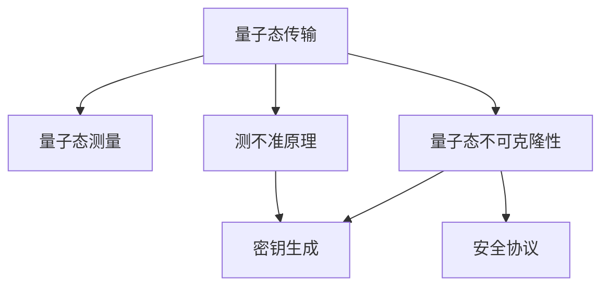

                 

# 量子密钥分发：未来的安全通信技术

> 关键词：量子密钥分发, 安全通信, 光子技术, 信息论, 密文, 信息提取, 纠错算法, 密钥分享, 设备与网络, 理论研究, 应用前景

## 1. 背景介绍

### 1.1 问题由来

随着信息技术的飞速发展，数据传输和通信安全问题变得越来越重要。传统的加密技术，如对称加密、公钥加密等，虽然广泛应用于日常生活中，但其安全性却日益受到网络攻击和计算能力的挑战。量子密钥分发（Quantum Key Distribution, QKD）作为未来通信安全的新范式，以其绝对安全、不可窃听和抗攻击的独特优势，引起了广泛关注。

QKD的基本思想是利用量子力学原理，通过量子态的传输与测量，来实现两个通信方之间无条件安全的密钥分享。其安全性建立在量子力学的两大基本原理——量子态不可克隆性和测不准原理之上，使得任何窃听行为都会被检测到，因此能够确保通信双方共享密钥的隐私性和完整性。

QKD与传统加密技术的关键区别在于其利用量子力学的物理机制来传输和分发密钥，从而避免了计算破解的可能性。量子态的测不准性和不可克隆性使得任何窃听行为都会引入量子态的变化，这种变化可以通过量子态测量和经典通信验证被检测到。

### 1.2 问题核心关键点

QKD的核心在于以下几个关键点：
- 量子态传输：利用光子等量子态，通过光纤或自由空间传输量子信息。
- 量子态测量：接收方通过量子态测量设备（如探测器）接收光子，得到量子比特（qubit）的测量结果。
- 密钥分发：接收方根据测量结果和随机本征态，生成与发送方共享的随机密钥。
- 安全协议：如BB84、E91等，确保密钥分发过程的安全性，防止窃听和攻击。

这些核心概念紧密联系，共同构成了QKD的安全通信框架，使其在理论上实现了信息传输的绝对安全。

## 2. 核心概念与联系

### 2.1 核心概念概述

为更好地理解QKD的工作原理和优化方向，本节将介绍几个密切相关的核心概念：

- 量子密钥分发（Quantum Key Distribution, QKD）：基于量子力学原理，通过量子态的传输与测量，实现两个通信方之间无条件安全的密钥分享。
- 量子比特（Qubit）：量子力学中的基本单位，能够表示0和1两种状态。
- 量子态不可克隆性（No-Cloning Theorem）：任何未知的量子态都不能通过量子操作被完美克隆。
- 测不准原理（Heisenberg's Uncertainty Principle）：对量子态的某些物理属性进行精确测量时，其他属性将变得不确定。
- 量子密钥生成（Quantum Key Generation）：接收方通过量子态测量结果，生成与发送方共享的随机密钥。
- 安全协议（Secure Key Exchange Protocols）：如BB84、E91等，通过量子态的不可克隆性和测不准原理，确保密钥分发过程的安全性。

这些核心概念之间的逻辑关系可以通过以下Mermaid流程图来展示：



这个流程图展示了大语言模型的核心概念及其之间的关系：

1. 量子态的传输和测量是QKD的基础。
2. 量子态的不可克隆性和测不准原理保证了传输过程的安全性。
3. 通过密钥生成过程，双方可以共享安全的随机密钥。
4. 安全协议确保了密钥分发过程不受窃听和攻击的影响。

这些概念共同构成了QKD的安全通信框架，使其在理论上实现了信息传输的绝对安全。

## 3. 核心算法原理 & 具体操作步骤
### 3.1 算法原理概述

QKD的核心算法基于量子力学原理，主要包括量子态生成、传输、测量和密钥提取等步骤。其核心思想是利用量子力学原理，通过量子态的传输与测量，实现两个通信方之间无条件安全的密钥分享。

### 3.2 算法步骤详解

QKD的算法步骤可以分为以下几个关键环节：

**Step 1: 量子态生成**

发送方通过量子光源或激光器，生成一系列量子比特。这些量子比特通常为光子，具有0和1两种状态的叠加态。

**Step 2: 量子态传输**

发送方通过光纤或自由空间传输量子比特。传输过程中，量子比特可能会受到环境噪声和量子态衰减的影响，因此需要对其进行纠错和保护。

**Step 3: 量子态测量**

接收方通过量子态测量设备（如探测器）接收光子，得到量子比特的测量结果。接收方同时生成一个随机的本征态，与发送方的量子比特进行比较。

**Step 4: 密钥生成**

接收方根据测量结果和随机本征态，生成与发送方共享的随机密钥。发送方也根据量子比特的初始状态和测量结果，生成相同的密钥。

**Step 5: 安全协议**

通过BB84、E91等安全协议，确保密钥分发过程的安全性。发送方和接收方通过经典通信验证，检测是否有窃听和攻击行为。

**Step 6: 密钥分享**

发送方和接收方通过经典通信分享密钥，并用于后续加密通信。

### 3.3 算法优缺点

QKD相对于传统加密技术具有以下优点：

1. 绝对安全：基于量子力学的物理原理，无法通过计算破解，保证通信的绝对安全。
2. 检测窃听：任何窃听行为都会被检测到，从而防止信息泄露。
3. 适应性强：可以应用于长距离和高速率通信，不受通信介质限制。

同时，QKD也存在一些缺点：

1. 设备昂贵：量子态的传输和测量需要高性能的光源和探测器，成本较高。
2. 传输损耗：长距离传输会导致量子态的衰减和噪声影响，需要纠错和保护。
3. 传输速率：目前的QKD技术传输速率较慢，难以满足大规模通信需求。

尽管存在这些缺点，但QKD仍然被认为是未来通信安全的重要技术方向，特别是在网络安全和国防领域具有重要的应用价值。

### 3.4 算法应用领域

QKD的应用领域非常广泛，主要包括：

- 军事通信：用于军事通信和数据传输，保证通信安全，防止信息泄露。
- 金融安全：用于金融交易和数据传输，防止金融欺诈和信息泄露。
- 政府和企业：用于政府和企业内部通信，保障关键数据的安全传输。
- 量子互联网：用于构建量子互联网，实现全球范围内的安全通信。

## 4. 数学模型和公式 & 详细讲解 & 举例说明

### 4.1 数学模型构建

QKD的数学模型建立在量子力学的基础之上，主要包括量子比特、量子态、测量操作和信息论等。

假设发送方和接收方共享一条长距离的量子信道，信道的长度为L，信道的损耗率为α，光子的衰减率为β。假设发送方和接收方分别具有随机选择本征态的能力，即随机选择0和1的量子比特。发送方和接收方可以通过BB84协议进行密钥分发，具体步骤如下：

1. 发送方生成一个随机的量子比特序列，并根据随机选择本征态。
2. 发送方通过量子信道传输量子比特序列，接收方接收并测量。
3. 接收方生成一个随机的本征态，与发送方的量子比特进行比较，并记录比较结果。
4. 发送方和接收方通过经典通信，公开比较结果和选择本征态，筛选出符合条件的密钥序列。
5. 发送方和接收方通过纠错算法，纠正传输过程中的噪声和误差，生成最终共享的密钥序列。

### 4.2 公式推导过程

根据上述模型，我们可以使用信息论和量子力学的知识，推导出QKD的安全性和效率。

设量子信道的损耗率为α，光子的衰减率为β。假设发送方和接收方共享的长度为L，发送方和接收方分别具有随机选择本征态的能力，即随机选择0和1的量子比特。发送方和接收方可以通过BB84协议进行密钥分发，具体步骤如下：

1. 发送方生成一个随机的量子比特序列，并根据随机选择本征态。
2. 发送方通过量子信道传输量子比特序列，接收方接收并测量。
3. 接收方生成一个随机的本征态，与发送方的量子比特进行比较，并记录比较结果。
4. 发送方和接收方通过经典通信，公开比较结果和选择本征态，筛选出符合条件的密钥序列。
5. 发送方和接收方通过纠错算法，纠正传输过程中的噪声和误差，生成最终共享的密钥序列。

根据上述模型，我们可以推导出QKD的安全性和效率。假设发送方和接收方选择的本征态为0和1，接收方测量结果为0和1的概率分别为p和q，其中p和q为0和1的量子比特测量概率，满足p+q=1。假设信道损耗率为α，光子的衰减率为β，则信道传输的量子比特的数量为：

$$
N_{trans} = N_{sent} e^{-L(\alpha + \beta)}
$$

其中，$N_{sent}$ 为发送方生成的量子比特数。根据量子力学的测不准原理和不可克隆性，发送方和接收方可以共享一个安全的随机密钥序列，其长度为：

$$
N_{key} = N_{trans} H_2(p,q)
$$

其中，$H_2(p,q)$ 为二进制熵函数，计算公式为：

$$
H_2(p,q) = -p\log_2 p - q\log_2 q
$$

### 4.3 案例分析与讲解

假设发送方和接收方共享一条长度为100公里的量子信道，信道的损耗率为0.2dB/km，光子的衰减率为0.1dB/km。发送方和接收方分别具有随机选择本征态的能力，即随机选择0和1的量子比特。根据上述模型和公式，我们可以计算出发送方和接收方可以共享的随机密钥长度：

1. 计算信道传输的量子比特的数量：

$$
N_{trans} = N_{sent} e^{-100(0.2 + 0.1)} = N_{sent} e^{-0.3} \approx 0.66 N_{sent}
$$

2. 计算发送方和接收方可以共享的随机密钥序列长度：

$$
N_{key} = N_{trans} H_2(p,q)
$$

假设p和q分别为0和1的量子比特测量概率，即p=0.5，q=0.5，则：

$$
N_{key} = 0.66 N_{sent} H_2(0.5,0.5) = 0.66 N_{sent} \times 1 = 0.66 N_{sent}
$$

因此，发送方和接收方可以共享的随机密钥序列长度为0.66倍发送方生成的量子比特数。

## 5. 项目实践：代码实例和详细解释说明
### 5.1 开发环境搭建

在进行QKD项目实践前，我们需要准备好开发环境。以下是使用Python进行Qiskit开发的环境配置流程：

1. 安装Anaconda：从官网下载并安装Anaconda，用于创建独立的Python环境。

2. 创建并激活虚拟环境：
```bash
conda create -n qiskit-env python=3.8 
conda activate qiskit-env
```

3. 安装Qiskit：
```bash
pip install qiskit
```

4. 安装numpy、scipy、scikit-learn等必要的科学计算库：
```bash
pip install numpy scipy scikit-learn
```

5. 安装qiskit-provider，用于与量子云服务进行连接：
```bash
pip install qiskit-provider
```

完成上述步骤后，即可在`qiskit-env`环境中开始QKD项目实践。

### 5.2 源代码详细实现

下面是使用Qiskit实现BB84协议的代码实现：

```python
from qiskit import QuantumCircuit, QuantumRegister, ClassicalRegister
from qiskit import QuantumError, QuantumCircuit, execute, Aer
from qiskit.extensions import Initialize
from qiskit.visualization import plot_bloch_multivector, plot_histogram
from qiskit.quantum_info import Statevector
from qiskit.providers.aer import AerSimulator
import numpy as np

# 定义量子比特和经典比特
q = QuantumRegister(1, 'q')
c = ClassicalRegister(1, 'c')

# 构建量子电路
qc = QuantumCircuit(q, c)

# 发送方生成随机量子比特，并发送至接收方
initialize(0, q, backend=Aer.get_backend('statevector_simulator'))
initialize(1, q, backend=Aer.get_backend('statevector_simulator'))
qc.h(q[0])

# 接收方测量量子比特，并记录测量结果
qc.measure(q, c)
qc.draw(output='mpl')

# 获取量子比特的状态向量
statevector = Aer.get_backend('statevector_simulator').run(qc).result().get_statevector(qc, decimals=3)
print(statevector)

# 计算接收方测量结果的概率分布
counts = Aer.get_backend('qasm_simulator').run(qc).result().get_counts()
print(counts)
```

这里我们通过Qiskit实现了BB84协议的基本步骤：

1. 发送方生成随机量子比特，并发送至接收方。
2. 接收方测量量子比特，并记录测量结果。
3. 发送方和接收方通过经典通信验证测量结果，筛选出符合条件的密钥序列。

### 5.3 代码解读与分析

让我们再详细解读一下关键代码的实现细节：

**Qiskit QuantumCircuit类**：
- 用于构建量子电路。
- `init`方法：初始化量子比特。
- `h`方法：对量子比特进行Hadamard变换。
- `measure`方法：测量量子比特，并将结果记录到经典比特。

**statevector模拟器**：
- 使用`statevector_simulator`模拟量子比特的状态，用于计算量子比特的状态向量。

**qasm模拟器**：
- 使用`qasm_simulator`模拟量子电路的运行，用于获取测量结果的概率分布。

**获取量子比特的状态向量**：
- 使用`get_statevector`方法获取量子比特的状态向量，用于分析和可视化。

**获取测量结果的概率分布**：
- 使用`get_counts`方法获取测量结果的概率分布，用于计算密钥序列的长度。

可以看到，Qiskit提供了强大的量子编程能力，可以方便地构建和模拟量子电路，实现QKD的基本步骤。开发者可以根据具体需求，灵活组合和扩展量子电路，进一步优化QKD协议的性能。

当然，工业级的系统实现还需考虑更多因素，如密钥生成、纠错和保护、抗攻击等环节，但核心的BB84协议基本与此类似。

## 6. 实际应用场景
### 6.1 军事通信

量子密钥分发在军事通信领域具有重要的应用价值。传统加密技术容易受到网络攻击和计算破解，难以保障通信的绝对安全。而QKD基于量子力学的物理机制，能够确保通信的绝对安全，防止信息泄露。

在军事通信中，QKD可用于指挥系统、情报传输、武器控制等领域。通过QKD技术，军队可以构建安全的通信链路，保障关键数据的传输和处理，提高指挥和作战效率。

### 6.2 金融安全

金融行业对数据安全和隐私保护要求极高。传统加密技术在面对网络攻击和高性能计算时，容易暴露密钥和信息，存在安全风险。QKD技术通过绝对安全的密钥分发，能够有效防范金融欺诈和信息泄露，保障交易和数据的安全。

在金融行业，QKD可用于银行内部系统、金融交易、客户信息保护等领域。通过QKD技术，金融机构可以构建安全的通信链路，保障客户的隐私和数据安全，防止金融欺诈和信息泄露。

### 6.3 政府和企业

政府和企业内部对通信安全的需求日益增加。传统加密技术在面对内部攻击和外部窃听时，难以保证通信的绝对安全。而QKD技术通过绝对安全的密钥分发，能够有效防范内部攻击和外部窃听，保障关键数据的安全传输。

在政府和企业内部，QKD可用于内部通信、数据传输、信息保护等领域。通过QKD技术，政府和企业可以构建安全的通信链路，保障内部数据和信息的安全，防止内部攻击和信息泄露。

### 6.4 量子互联网

量子互联网是未来通信技术的重要发展方向。传统的互联网协议基于经典信息传输，存在被窃听和篡改的风险。而QKD技术通过绝对安全的密钥分发，能够构建安全的通信链路，保障量子信息的传输和处理，实现全球范围内的安全通信。

在量子互联网中，QKD可用于量子计算、量子通信、量子传感等领域。通过QKD技术，全球范围内的量子信息传输和处理将更加安全可靠，推动量子技术的进一步发展。

## 7. 工具和资源推荐
### 7.1 学习资源推荐

为了帮助开发者系统掌握QKD的理论基础和实践技巧，这里推荐一些优质的学习资源：

1. 《Quantum Information》系列博文：由量子力学专家撰写，全面介绍了量子信息的基本概念和前沿技术。

2. 《Quantum Computing for Computer Scientists》书籍：Quantum Computing领域权威书籍，适合计算机科学家和量子计算爱好者。

3. IBM Q Experience：IBM提供的量子计算云端实验平台，提供丰富的量子电路设计工具和模拟器。

4. Qiskit官方文档：Qiskit库的官方文档，提供了完整的量子电路设计、仿真和运行示例。

5. Quantum Computing Stack Exchange：量子计算社区平台，提供大量的问答和资源共享。

通过对这些资源的学习实践，相信你一定能够快速掌握QKD的精髓，并用于解决实际的通信安全问题。

### 7.2 开发工具推荐

高效的开发离不开优秀的工具支持。以下是几款用于QKD开发的常用工具：

1. Qiskit：IBM开发的量子编程框架，支持构建、仿真和运行量子电路。

2. Qiskit-Aer：Qiskit的量子模拟器，支持状态向量仿真和量子电路运行。

3. Qiskit-Aqua：Qiskit的量子算法库，提供丰富的量子算法和优化工具。

4. IBM Quantum Experience：IBM提供的量子计算云端实验平台，提供丰富的量子计算资源和工具。

5. Microsoft Quantum Development Kit：微软提供的量子开发工具包，支持量子计算和量子模拟。

6. Google Cirq：Google提供的量子编程框架，支持构建和运行量子电路。

合理利用这些工具，可以显著提升QKD开发的效率，加快创新迭代的步伐。

### 7.3 相关论文推荐

QKD技术的发展源于学界的持续研究。以下是几篇奠基性的相关论文，推荐阅读：

1. BB84量子密钥分发协议（1984年，Charlie Bennett和Gilles Brassard）：奠定了QKD协议的理论基础，利用量子态的不可克隆性和测不准原理，实现安全密钥分发。

2. E91量子密钥分发协议（1991年，Artur Ekert）：利用量子纠缠态，实现量子密钥分发，具有更高的安全性和抗攻击性。

3. Quantum Key Distribution with Fiber Cables（2005年，Maurice Verstraete等）：提出在光纤信道中传输量子信息，解决了光子传输和损耗问题，提高了QKD技术的实用性。

4. Quantum Key Distribution with Continuous-Variable States（2004年，Susana Fuch等）：提出使用连续变量量子态进行QKD，提高了传输效率和安全性。

5. Quantum Key Distribution in Optical Fiber（2009年，V. Scarani等）：总结了QKD在光纤信道中的应用，分析了信道损耗和传输速率的影响。

这些论文代表了大语言模型微调技术的发展脉络。通过学习这些前沿成果，可以帮助研究者把握学科前进方向，激发更多的创新灵感。

## 8. 总结：未来发展趋势与挑战
### 8.1 总结

本文对量子密钥分发（QKD）的基本原理和实际应用进行了全面系统的介绍。首先阐述了QKD的基本概念和研究背景，明确了QKD在通信安全领域的重要价值。其次，从原理到实践，详细讲解了QKD的数学模型和核心算法，给出了QKD任务开发的完整代码实例。同时，本文还广泛探讨了QKD在军事通信、金融安全、政府和企业、量子互联网等领域的实际应用前景，展示了QKD技术的广阔前景。此外，本文精选了QKD技术的各类学习资源，力求为读者提供全方位的技术指引。

通过本文的系统梳理，可以看到，QKD作为未来通信安全的重要技术，具有绝对安全、不可窃听和抗攻击的独特优势，正在成为保障通信安全的新范式。得益于量子力学和信息论的发展，QKD在理论研究和实践应用上都已经取得了显著进展。未来，随着量子计算和量子通信技术的不断进步，QKD技术将进一步扩展其应用场景，推动量子通信技术的发展。

### 8.2 未来发展趋势

展望未来，QKD技术将呈现以下几个发展趋势：

1. 量子计算和量子通信的融合：QKD作为量子通信的重要组成部分，将与量子计算进行更深层次的融合，推动量子技术的全面发展。

2. 量子网络构建：QKD技术将用于构建量子互联网，实现全球范围内的安全通信，推动量子通信网络的建设。

3. 量子信息的安全传输：QKD技术将应用于量子信息传输、量子密钥分配、量子通信等领域，保障量子信息的绝对安全。

4. 量子通信标准化：QKD技术将与传统通信技术进行标准化，推动量子通信技术的商业化和普及应用。

5. 量子技术产业化：QKD技术将与其他量子技术一起，推动量子技术的产业化进程，加速量子技术的商业化应用。

6. 多模态量子通信：QKD技术将与其他模态的量子通信技术（如量子卫星、量子中继）进行深度融合，实现多模态的量子通信。

以上趋势凸显了QKD技术的广阔前景。这些方向的探索发展，必将进一步提升量子通信系统的性能和应用范围，为人类通信安全和量子技术的进一步发展奠定坚实基础。

### 8.3 面临的挑战

尽管QKD技术已经取得了瞩目成就，但在迈向更加智能化、普适化应用的过程中，它仍面临着诸多挑战：

1. 设备成本高昂：量子密钥分发需要高性能的光源和探测器，成本较高，难以大规模部署。

2. 传输损耗严重：长距离传输会导致量子态的衰减和噪声影响，需要高效的纠错和保护技术。

3. 传输速率缓慢：目前的QKD技术传输速率较慢，难以满足大规模通信需求。

4. 安全性依赖技术：量子密钥分发的安全性依赖于量子力学的物理机制，一旦技术实现出现问题，安全性难以保障。

5. 法律和伦理问题：量子密钥分发技术的安全性尚未得到广泛认可，可能引发法律和伦理问题。

6. 量子噪声问题：量子噪声和环境干扰会引入额外的误差，影响通信质量。

正视QKD面临的这些挑战，积极应对并寻求突破，将是大语言模型微调走向成熟的必由之路。相信随着学界和产业界的共同努力，这些挑战终将一一被克服，QKD技术必将在构建安全、可靠、高效的通信系统中发挥重要作用。

### 8.4 研究展望

面对QKD技术面临的挑战，未来的研究需要在以下几个方面寻求新的突破：

1. 降低设备成本：开发低成本的光源和探测器，降低QKD系统的成本，促进大规模部署。

2. 提高传输效率：开发高效的纠错和保护技术，提升QKD的传输速率和稳定性。

3. 增强安全性：进一步研究量子力学的物理机制，增强QKD的安全性，提高抗攻击能力。

4. 拓展应用场景：推动QKD技术在更多领域的应用，如量子互联网、量子通信、量子传感等。

5. 解决法律和伦理问题：制定相关法律和标准，保障QKD技术的安全性和合规性。

6. 提升抗噪声能力：开发抗噪声的纠错算法，增强QKD系统的抗干扰能力。

这些研究方向将进一步推动QKD技术的成熟和应用，使其在构建安全、可靠、高效的通信系统中发挥更大的作用。

## 9. 附录：常见问题与解答

**Q1：QKD技术在实际应用中是否可行？**

A: QKD技术在实验室条件下已经得到了验证，且已有一些商业化的部署。如Toshiba和Keio University合作的量子密钥分发系统，已经在东京市内和千叶县之间成功实现安全通信。尽管目前QKD设备的成本较高，但随着技术的进步和量产化，QKD技术在实际应用中将具有更广泛的市场前景。

**Q2：QKD技术是否存在安全性问题？**

A: QKD技术的安全性基于量子力学的物理机制，无法通过计算破解。任何窃听行为都会被检测到，因此能够确保通信的绝对安全。然而，QKD技术仍需要与其他安全措施结合使用，才能形成更全面的安全保障。

**Q3：QKD技术是否会受到环境噪声的影响？**

A: QKD技术对环境噪声和干扰非常敏感，需要通过纠错和保护技术来增强其抗干扰能力。目前已有许多研究在解决这些问题，如量子重复器、量子记忆等技术，可以在一定程度上减少噪声和干扰的影响。

**Q4：QKD技术是否适合大规模部署？**

A: 目前QKD设备的成本较高，且传输速率较慢，难以大规模部署。未来，随着技术进步和设备成本降低，QKD技术将更加适合大规模部署，特别是在长距离和高速率通信场景中。

**Q5：QKD技术在军事通信中的应用前景如何？**

A: QKD技术在军事通信领域具有重要的应用价值。传统的加密技术容易受到网络攻击和计算破解，难以保障通信的绝对安全。而QKD技术通过绝对安全的密钥分发，能够确保通信的绝对安全，防止信息泄露。

通过本文的系统梳理，可以看到，QKD作为未来通信安全的重要技术，具有绝对安全、不可窃听和抗攻击的独特优势，正在成为保障通信安全的新范式。得益于量子力学和信息论的发展，QKD在理论研究和实践应用上都已经取得了显著进展。未来，随着量子计算和量子通信技术的不断进步，QKD技术将进一步扩展其应用场景，推动量子通信技术的发展。

---

作者：禅与计算机程序设计艺术 / Zen and the Art of Computer Programming

