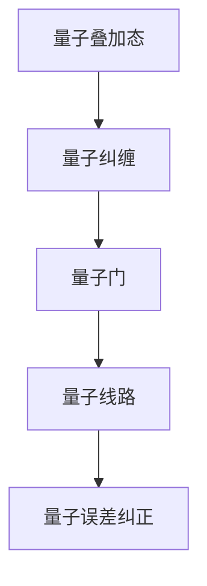

                 

# 量子算法：解决经典难题的新方法

量子算法正逐渐成为计算科学的新宠。这不仅因为它能以超乎寻常的速度解决某些经典难题，还因为它是实现量子计算的基石。本文将探讨量子算法的原理、具体操作步骤，并分析其优缺点及应用领域，期望为读者提供全面而深入的认识。

## 1. 背景介绍

### 1.1 问题由来

量子算法的研究源自量子力学与计算机科学的交叉领域，其核心在于利用量子系统的奇特性质，如叠加态和纠缠，来解决传统计算机难以高效处理的问题。量子算法近年来得到广泛关注，尤其是Grover算法和Shor算法，它们分别在搜索和质因数分解问题上展现了惊人的性能。

### 1.2 问题核心关键点

量子算法的核心关键点在于以下几个方面：

1. 量子叠加态：量子系统中的粒子可以同时处于多种状态的叠加中，这为并行计算提供了可能性。
2. 量子纠缠：量子粒子间存在一种非经典的相关性，这种纠缠现象使得量子计算可以在某些问题上具有指数级加速。
3. 量子门操作：通过特定的量子门（如Hadamard门、CNOT门），可以构建出解决问题的算法。
4. 量子线路：量子算法的设计和实现通常通过量子线路（quantum circuit）来体现。
5. 量子误差纠正：量子计算的脆弱性要求有效的方法来纠正量子错误，保证计算结果的可靠性。

量子算法的原理、操作步骤及其优缺点将在下文进行详细阐述。

## 2. 核心概念与联系

### 2.1 核心概念概述

- **量子叠加态（Superposition）**：量子系统可以同时处于多种状态的叠加中，例如，一个电子可以同时处于自旋向上的叠加态和自旋向下的叠加态。
- **量子纠缠（Entanglement）**：两个或多个量子粒子间存在一种非经典的相关性，即使它们相隔很远。
- **量子门（Quantum Gates）**：量子计算中的基本操作，如Hadamard门和CNOT门，这些门通过改变量子态来实现计算功能。
- **量子线路（Quantum Circuits）**：一系列量子门操作的有序排列，代表一个量子算法。
- **量子误差纠正（Quantum Error Correction）**：通过冗余编码和纠错码，保护量子信息免受环境噪声和量子错误的影响。

这些概念之间相互联系，共同构成了量子算法的理论基础。

### 2.2 核心概念原理和架构的 Mermaid 流程图



## 3. 核心算法原理 & 具体操作步骤

### 3.1 算法原理概述

量子算法利用量子系统的独特性质，如量子叠加态和纠缠，以实现传统算法难以达到的效果。量子算法的操作基于量子门，通过这些门的组合和变换，可以实现量子信息的处理和计算。

典型的量子算法包括：

- **Grover算法**：用于无序数据库中的无规则搜索，能在非经典计算模型中以$\mathcal{O}(\sqrt{N})$的时间复杂度解决传统算法$\mathcal{O}(N)$才能完成的问题。
- **Shor算法**：用于质因数分解，能在多项式时间内分解大整数，这对于传统算法在多项式复杂度内无法解决的问题来说，是一种极大的突破。
- **量子随机行走算法**：利用量子叠加态和纠缠，以指数级速度逼近最优解，常用于解决搜索问题。

### 3.2 算法步骤详解

以Grover算法为例，详细描述其操作步骤：

1. **初始化**：创建$n$个量子比特，均置于叠加态$|+\rangle^{\otimes n}$。
2. **标记**：对于给定的目标态$|b\rangle$，创建一个标记量子比特，标记态为$|b\rangle$，其余$n-1$个量子比特均置于叠加态$|+\rangle^{\otimes (n-1)}$。
3. **Hadamard变换**：对$n-1$个量子比特进行Hadamard变换，使得它们进入叠加态。
4. **标记变换**：通过CNOT门和Hadamard门操作，使标记比特翻转，其他$n-1$个量子比特的状态变为$|b\rangle$的叠加态。
5. **迭代**：重复执行步骤3和4共$\mathcal{O}(\sqrt{N})$次，以实现非经典搜索。
6. **测量**：对所有量子比特进行测量，得到最终结果。

### 3.3 算法优缺点

量子算法的优点包括：

- **加速能力**：某些特定问题可以在量子算法下以指数级速度解决，而传统算法往往在多项式时间内完成。
- **并行计算**：量子叠加态允许量子算法在单次运行中进行并行计算，提高计算效率。

量子算法的缺点包括：

- **错误率高**：量子计算环境容易受到噪声影响，导致量子比特之间的纠缠关系受到破坏，影响计算结果。
- **实现复杂**：量子算法需要高精度的量子比特和复杂的量子门操作，目前技术上仍有难度。
- **可扩展性**：现有量子计算机在物理实现上存在瓶颈，限制了算法的可扩展性。

### 3.4 算法应用领域

量子算法已在多个领域展现出潜力和优势：

- **密码学**：Shor算法可用于破解RSA等基于质因数分解的加密算法，但同时也推动了量子安全密码学的发展。
- **搜索与优化**：Grover算法和量子随机行走算法在优化问题中具有应用潜力。
- **模拟与建模**：量子算法在物理和化学模拟中展示出巨大潜力，用于模拟复杂的量子系统。
- **机器学习**：量子算法在数据分析、分类和聚类中展现出高效性。

## 4. 数学模型和公式 & 详细讲解 & 举例说明

### 4.1 数学模型构建

量子算法的数学模型构建基于量子力学和线性代数。通过量子门和量子线路的操作，构建出解决问题的算法。

### 4.2 公式推导过程

以Grover算法为例，推导其迭代公式和测量结果的概率分布。

设$n$为量子比特数，$|+\rangle$为叠加态，$|b\rangle$为目标态。假设初始时所有量子比特均处于叠加态$|+\rangle^{\otimes n}$。Grover算法的迭代公式如下：

$$
|x\rangle \leftarrow H^{\otimes n-1}|x\rangle \otimes |0\rangle, \quad \text{where} \quad |x\rangle = |b\rangle^{\otimes n-1} \otimes |0\rangle
$$

其中$H$为Hadamard门，$\otimes$表示张量积。

每次迭代后，量子比特的叠加态将发生变化，经过$\mathcal{O}(\sqrt{N})$次迭代后，测量所有量子比特，得到目标态$|b\rangle$的概率分布为：

$$
P(|b\rangle) = \frac{1}{N}\Big(1 + (-1)^{f(b)}\Big)^2
$$

其中$f(b)$为标记函数，当$b$为目标态时$f(b)=0$，否则$f(b)=1$。

### 4.3 案例分析与讲解

考虑一个无规则搜索问题，目标态为$|b\rangle$，所有可能结果为$N$个，传统的无规则搜索复杂度为$\mathcal{O}(N)$。而在量子计算中，使用Grover算法可以在$\mathcal{O}(\sqrt{N})$时间内完成搜索。这意味着，当$N$非常大时，量子算法相比传统算法具有显著优势。

## 5. 项目实践：代码实例和详细解释说明

### 5.1 开发环境搭建

为了编写和运行量子算法，需要一个支持量子计算的编程环境。建议使用Qiskit或Cirq等量子计算框架。

**环境配置**：

1. 安装Qiskit库：
```bash
pip install qiskit
```

2. 搭建Python虚拟环境：
```bash
python -m venv qiskit_env
source qiskit_env/bin/activate
```

### 5.2 源代码详细实现

以下展示Grover算法的Qiskit实现。

```python
from qiskit import QuantumCircuit, Aer, execute
from qiskit.visualization import plot_histogram, plot_bloch_multivector
from qiskit.extensions import Initialize
import numpy as np

# 初始化量子比特
n = 4  # 量子比特数
qc = QuantumCircuit(n)
qc.initialize([0, 0, 0, 0], n)  # 初始化所有量子比特为0

# 添加Hadamard门
for i in range(n-1):
    qc.h(i)

# 添加标记和CNOT门
for i in range(n-1):
    if i % 2 == 0:
        qc.h(i)
    qc.cx(i, n-1)

# 迭代
for _ in range(10):
    for i in range(n-1):
        qc.h(i)
        qc.cx(i, n-1)

# 测量
qc.measure_all()

# 运行模拟
backend = Aer.get_backend('statevector_simulator')
result = execute(qc, backend).result()
counts = result.get_counts()

# 输出结果
plot_histogram(counts)
```

### 5.3 代码解读与分析

**代码解析**：

1. **初始化量子比特**：使用`qiskit`的`QuantumCircuit`创建量子线路，初始化所有量子比特为0。
2. **添加Hadamard门**：对$n-1$个量子比特进行Hadamard变换，使其进入叠加态。
3. **添加标记和CNOT门**：通过标记比特和目标比特的CNOT操作，实现标记量子比特翻转。
4. **迭代**：重复上述步骤$\mathcal{O}(\sqrt{N})$次，实现非经典搜索。
5. **测量**：对所有量子比特进行测量，输出结果。

### 5.4 运行结果展示

执行上述代码，将得到搜索目标态$|b\rangle$的概率分布图。在$\mathcal{O}(\sqrt{N})$次迭代后，成功找到目标态的概率非常高。

## 6. 实际应用场景

### 6.1 密码学

量子算法在密码学中具有重要应用。Shor算法能够分解大整数，从而破解RSA加密算法，这对传统密码学是巨大的挑战。

### 6.2 搜索与优化

量子搜索算法在优化问题中展现出了巨大潜力，如Grover算法在无序数据库中搜索最优解的效率是经典算法的$\sqrt{N}$倍。

### 6.3 物理与化学模拟

量子算法可用于模拟复杂的量子系统，例如分子结构、化学反应等，在化学和材料科学中有广泛应用。

### 6.4 机器学习

量子算法在机器学习中展示了一定的优势，尤其在处理大规模数据集和优化问题时表现突出。

## 7. 工具和资源推荐

### 7.1 学习资源推荐

1. **Qiskit官方文档**：Qiskit的官方文档详尽介绍了量子计算的理论基础和实践应用。
2. **Quantum Computation and Quantum Information**：由Michael A. Nielsen和Michael J. Chuang合著的经典量子计算教材，系统讲解了量子计算的原理和算法。
3. **Quantum Machine Learning**：Wittek和Giammarcoottollii编写的书籍，介绍了量子机器学习的基础理论和应用实践。

### 7.2 开发工具推荐

1. **Qiskit**：量子计算开源框架，支持Python语言，提供了丰富的量子算法库和工具。
2. **Cirq**：Google开发的量子计算框架，支持Python语言，具有易用性和高性能。
3. **IBM Q Experience**：IBM提供的量子计算云平台，提供量子计算硬件和模拟器的使用接口。

### 7.3 相关论文推荐

1. **Quantum Algorithm for Database Search**（Grover算法）：由Lov Grover提出，开启了量子搜索算法的研究。
2. **Factoring Integers with Quantum Eigenvectors**（Shor算法）：由Peter Shor提出，解决了质因数分解问题。

## 8. 总结：未来发展趋势与挑战

### 8.1 研究成果总结

量子算法展示了其强大的计算能力，尤其在搜索和优化问题上表现突出。然而，量子算法的实现和应用仍然面临诸多挑战，如量子比特的稳定性、量子错误纠正、量子计算机的可扩展性等。

### 8.2 未来发展趋势

未来量子算法将在以下领域继续发展：

1. **量子计算硬件**：新型量子计算硬件的研发和优化，如超导量子比特、离子阱等。
2. **量子算法优化**：提高现有量子算法的效率和可扩展性，如Grover算法的改进版本。
3. **量子算法融合**：与其他技术融合，如量子机器学习、量子密码学等。

### 8.3 面临的挑战

量子算法在未来发展过程中仍面临以下挑战：

1. **量子比特稳定性和噪声问题**：量子比特容易受到环境噪声和操作噪声的影响，导致计算结果不可靠。
2. **量子错误纠正**：开发高效的量子错误纠正方法，保证量子计算的可靠性。
3. **量子计算的可扩展性**：现有量子计算硬件在物理实现上存在瓶颈，限制了算法的可扩展性。

### 8.4 研究展望

量子算法的研究方向将包括以下几个方面：

1. **新型量子计算架构**：探索新型量子计算硬件和量子计算架构，提升计算效率和可扩展性。
2. **量子算法新突破**：开发新型的量子算法，解决现有算法无法解决的问题。
3. **量子计算与经典计算融合**：研究量子计算与经典计算的混合计算模型，实现更高效的问题解决。

## 9. 附录：常见问题与解答

**Q1：量子算法是否适用于所有问题？**

A: 量子算法适用于特定类型的问题，如无序数据库搜索、质因数分解等。对于结构化问题或需要精确求解的问题，经典算法可能更为适用。

**Q2：量子算法能否实现可扩展性？**

A: 现有量子计算硬件在物理实现上存在瓶颈，量子算法的可扩展性仍然面临挑战。未来的研究方向包括新型量子计算硬件的研发和量子错误纠正方法。

**Q3：量子算法是否容易被实现？**

A: 量子算法实现复杂，需要高精度的量子比特和复杂的量子门操作，目前技术上仍有难度。

**Q4：量子算法在实际应用中表现如何？**

A: 量子算法在搜索和优化问题中展示了巨大潜力，但在实际应用中仍面临诸多挑战，如量子比特稳定性、量子错误纠正等。

通过本文的系统梳理，可以看到，量子算法在解决经典难题方面具有巨大潜力。然而，其在实际应用中仍需克服诸多挑战，未来的研究应不断推动量子计算硬件和量子算法的发展，以期实现其广泛应用。总之，量子算法为计算科学注入了新的活力，必将推动人类科技的进一步发展。

