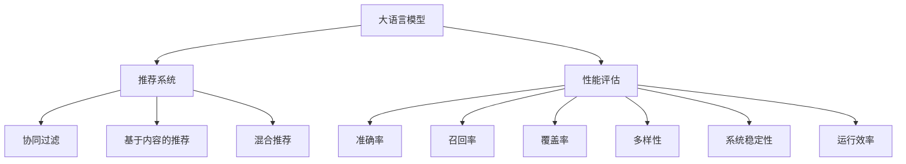

                 

# 阿里内部实践: ChatGPT在推荐场景中的性能评估

> 关键词：大语言模型, 推荐系统, 性能评估, 应用场景, 模型优化

## 1. 背景介绍

### 1.1 问题由来
随着人工智能技术的快速发展和广泛应用，大语言模型如GPT-3和ChatGPT等逐渐成为热门话题。在实际业务中，这些模型被广泛应用于推荐系统、自然语言处理、智能客服等多个领域，极大地提高了企业的运营效率和服务质量。然而，大语言模型在实际应用中仍面临诸多挑战，尤其是如何有效评估其在推荐场景中的性能，需要解决一系列技术难题。本文将详细介绍阿里在推荐场景中使用大语言模型ChatGPT的性能评估实践，以期为其他企业提供有益的借鉴。

### 1.2 问题核心关键点
在推荐场景中应用大语言模型ChatGPT，需要评估其推荐效果、系统稳定性和运行效率等方面。具体问题包括：
- 如何准确评估ChatGPT在不同推荐算法中的表现？
- 如何在推荐系统中高效部署ChatGPT模型？
- 如何衡量ChatGPT在推荐系统的实际业务影响？

这些问题需要结合实际业务场景，进行全面、系统的分析，以找到最优的解决方案。

## 2. 核心概念与联系

### 2.1 核心概念概述

本节将介绍几个与ChatGPT在推荐场景中的性能评估相关的核心概念：

- 大语言模型(Large Language Model, LLM)：以自回归或自编码模型为代表的大规模预训练语言模型。通过在大规模无标签文本语料上进行预训练，学习通用的语言知识和常识，具备强大的语言理解和生成能力。

- 推荐系统(Recommendation System)：根据用户的历史行为和偏好，为用户推荐合适物品的自动化系统。包括协同过滤、基于内容的推荐、混合推荐等多种算法。

- 性能评估(Performance Evaluation)：评估推荐系统性能的指标和方法。常见的评估指标包括准确率、召回率、覆盖率、多样性等。

- 系统稳定性(System Stability)：推荐系统的运行稳定性和鲁棒性，衡量其在不同条件下的表现。

- 运行效率(Operational Efficiency)：推荐系统的响应速度和资源占用，衡量其在实际业务中的高效性。

这些核心概念之间存在密切联系，共同构成了ChatGPT在推荐场景中的性能评估框架，使得企业能够全面评估其应用效果，进行系统的优化和部署。

### 2.2 核心概念原理和架构的 Mermaid 流程图



这个流程图展示了核心概念之间的逻辑关系：

1. 大语言模型作为推荐系统的输入，为推荐过程提供基础的知识和信息。
2. 性能评估指标用于衡量推荐系统的表现。
3. 系统稳定性和运行效率也是评估推荐系统的重要维度。
4. 推荐系统可以采用多种算法，如协同过滤、基于内容的推荐、混合推荐等。

## 3. 核心算法原理 & 具体操作步骤

### 3.1 算法原理概述

ChatGPT在推荐场景中的性能评估，基于监督学习的微调方法。其核心思想是：将ChatGPT视作推荐系统的一部分，通过大量标注数据对其进行微调，使其能够根据用户的历史行为和兴趣，预测和推荐合适的物品。具体步骤如下：

1. 收集用户的历史行为数据，包括浏览记录、点击记录、评分记录等。
2. 将用户的历史行为数据进行标注，生成训练集和验证集。标注过程需人工标注用户对每个物品的评分或兴趣程度。
3. 使用ChatGPT对训练集进行微调，学习用户兴趣和行为之间的关系。
4. 在验证集上评估微调后的ChatGPT性能，选择最优参数组合。
5. 将微调后的ChatGPT集成到推荐系统中，进行实际业务测试和优化。

### 3.2 算法步骤详解

以下详细介绍ChatGPT在推荐场景中的性能评估步骤：

**Step 1: 数据收集与标注**

收集用户的历史行为数据，包括浏览记录、点击记录、评分记录等。将用户对每个物品的评分或兴趣程度进行标注，生成训练集和验证集。具体标注流程如下：

1. 收集用户行为数据：从用户行为日志、点击记录、评分记录等数据源中收集用户对物品的交互信息。
2. 数据预处理：对行为数据进行去重、清洗、归一化等预处理，确保数据质量。
3. 标注用户评分或兴趣：根据用户行为对每个物品进行评分或兴趣标注，标注方式可以采用人工标注或机器标注。

**Step 2: 数据划分**

将标注好的数据划分为训练集和验证集，保证数据划分合理，避免过拟合或欠拟合。

1. 随机划分：采用随机抽样方法，将数据划分为训练集和验证集，比例一般为70%训练集和30%验证集。
2. 分层划分：根据物品类别、用户属性等因素进行分层，确保数据分布均衡。

**Step 3: 模型微调**

使用ChatGPT对训练集进行微调，学习用户兴趣和行为之间的关系。具体步骤如下：

1. 选择预训练模型：选择适合的预训练模型，如GPT-3或ChatGPT等。
2. 添加任务适配层：根据推荐任务的特点，在模型顶层添加合适的输出层和损失函数。
3. 设置微调超参数：包括学习率、批大小、迭代轮数等。
4. 执行梯度训练：将训练集数据分批次输入模型，前向传播计算损失函数。反向传播计算参数梯度，根据设定的优化算法和学习率更新模型参数。
5. 验证集评估：周期性在验证集上评估模型性能，根据性能指标决定是否触发 Early Stopping。
6. 微调结束：重复上述步骤直到满足预设的迭代轮数或 Early Stopping 条件。

**Step 4: 模型评估**

在验证集上评估微调后的ChatGPT性能，选择最优参数组合。

1. 计算评估指标：根据任务特点，选择评估指标，如准确率、召回率、覆盖率、多样性等。
2. 比较不同模型：比较不同微调参数组合的性能，选择最优模型。
3. 调整模型参数：根据评估结果，调整模型参数，优化模型性能。

**Step 5: 业务测试与优化**

将微调后的ChatGPT集成到推荐系统中，进行实际业务测试和优化。

1. 集成模型：将微调后的ChatGPT集成到推荐系统的前端或后端，实现实时推荐。
2. 业务测试：在推荐系统中进行业务测试，评估实际推荐效果。
3. 优化系统：根据业务测试结果，优化推荐系统的算法、模型参数等，提升推荐效果。

### 3.3 算法优缺点

基于监督学习的大语言模型微调方法具有以下优点：
1. 简单易用：使用大量标注数据即可进行模型微调，无需重新训练大规模模型。
2. 效果显著：能够显著提升推荐系统的性能，特别是对于冷启动用户和稀疏数据场景。
3. 可扩展性强：能够快速适应新的推荐任务和算法。

同时，该方法也存在一些局限性：
1. 依赖标注数据：标注数据的准确性和完备性直接影响模型性能。
2. 模型泛化性有限：当目标任务与预训练数据的分布差异较大时，微调的性能提升有限。
3. 可解释性不足：微调模型的决策过程通常缺乏可解释性，难以对其推理逻辑进行分析和调试。

尽管存在这些局限性，但就目前而言，基于监督学习的微调方法仍是大语言模型应用的最主流范式。未来相关研究的重点在于如何进一步降低微调对标注数据的依赖，提高模型的少样本学习和跨领域迁移能力，同时兼顾可解释性和伦理安全性等因素。

### 3.4 算法应用领域

ChatGPT在推荐场景中的应用，主要涉及以下领域：

- 电商推荐：通过微调ChatGPT，为用户提供个性化商品推荐，提升购物体验和转化率。
- 内容推荐：对新闻、视频、文章等不同类型内容进行个性化推荐，提升用户粘性和满意度。
- 广告推荐：对广告位进行智能投放，提升广告效果和用户点击率。
- 音乐推荐：对音乐播放记录进行个性化分析，推荐用户喜欢的音乐类型和歌单。

除了上述这些经典应用外，ChatGPT在推荐场景中的应用还在不断拓展，如健康医疗、教育培训等诸多领域，为不同行业带来创新价值。

## 4. 数学模型和公式 & 详细讲解 & 举例说明

### 4.1 数学模型构建

本节将使用数学语言对ChatGPT在推荐场景中的性能评估进行更加严格的刻画。

记用户历史行为数据集为 $D=\{(x_i,y_i)\}_{i=1}^N$，其中 $x_i$ 为用户行为数据，$y_i$ 为用户对物品的评分或兴趣程度。假设微调后的ChatGPT模型为 $M_{\theta}$，其中 $\theta$ 为微调得到的模型参数。

定义模型 $M_{\theta}$ 在数据样本 $(x,y)$ 上的损失函数为 $\ell(M_{\theta}(x),y)$，则在数据集 $D$ 上的经验风险为：

$$
\mathcal{L}(\theta) = \frac{1}{N} \sum_{i=1}^N \ell(M_{\theta}(x_i),y_i)
$$

微调的优化目标是最小化经验风险，即找到最优参数：

$$
\theta^* = \mathop{\arg\min}_{\theta} \mathcal{L}(\theta)
$$

在实践中，我们通常使用基于梯度的优化算法（如SGD、Adam等）来近似求解上述最优化问题。设 $\eta$ 为学习率，$\lambda$ 为正则化系数，则参数的更新公式为：

$$
\theta \leftarrow \theta - \eta \nabla_{\theta}\mathcal{L}(\theta) - \eta\lambda\theta
$$

其中 $\nabla_{\theta}\mathcal{L}(\theta)$ 为损失函数对参数 $\theta$ 的梯度，可通过反向传播算法高效计算。

### 4.2 公式推导过程

以下我们以电商推荐任务为例，推导交叉熵损失函数及其梯度的计算公式。

假设模型 $M_{\theta}$ 在输入 $x$ 上的输出为 $\hat{y}=M_{\theta}(x) \in [0,1]$，表示用户对物品的评分或兴趣程度。真实标签 $y \in \{0,1\}$。则二分类交叉熵损失函数定义为：

$$
\ell(M_{\theta}(x),y) = -[y\log \hat{y} + (1-y)\log (1-\hat{y})]
$$

将其代入经验风险公式，得：

$$
\mathcal{L}(\theta) = -\frac{1}{N}\sum_{i=1}^N [y_i\log M_{\theta}(x_i)+(1-y_i)\log(1-M_{\theta}(x_i))]
$$

根据链式法则，损失函数对参数 $\theta_k$ 的梯度为：

$$
\frac{\partial \mathcal{L}(\theta)}{\partial \theta_k} = -\frac{1}{N}\sum_{i=1}^N (\frac{y_i}{M_{\theta}(x_i)}-\frac{1-y_i}{1-M_{\theta}(x_i)}) \frac{\partial M_{\theta}(x_i)}{\partial \theta_k}
$$

其中 $\frac{\partial M_{\theta}(x_i)}{\partial \theta_k}$ 可进一步递归展开，利用自动微分技术完成计算。

在得到损失函数的梯度后，即可带入参数更新公式，完成模型的迭代优化。重复上述过程直至收敛，最终得到适应电商推荐任务的最优模型参数 $\theta^*$。

### 4.3 案例分析与讲解

**案例1: 电商推荐**

电商推荐是ChatGPT在推荐场景中的典型应用。以电商推荐为例，介绍ChatGPT的微调和性能评估过程。

首先，收集用户的历史浏览、点击、评分记录等行为数据，生成训练集和验证集。将用户对每个商品的评分或兴趣程度进行标注，生成标注数据集 $D=\{(x_i,y_i)\}_{i=1}^N$，其中 $x_i$ 为用户行为数据，$y_i$ 为用户对商品的评分或兴趣程度。

接着，选择GPT-3或ChatGPT等预训练模型，并添加推荐任务的任务适配层。对于电商推荐任务，通常在模型顶层添加线性分类器和交叉熵损失函数。模型结构如下所示：

$$
\begin{aligned}
&\text{Embedding: } x \rightarrow h \\
&\text{Encoder: } h \rightarrow M_{\theta}(h) \\
&\text{Classification: } M_{\theta}(h) \rightarrow \hat{y}
\end{aligned}
$$

其中 $x$ 为用户行为数据，$h$ 为嵌入层的输出，$M_{\theta}(h)$ 为Encoder的输出，$\hat{y}$ 为用户对商品的评分或兴趣程度。

最后，使用交叉熵损失函数进行微调，具体步骤如下：

1. 选择预训练模型：选择适合的预训练模型，如GPT-3或ChatGPT等。
2. 添加任务适配层：根据电商推荐任务的特点，在模型顶层添加合适的输出层和损失函数。
3. 设置微调超参数：包括学习率、批大小、迭代轮数等。
4. 执行梯度训练：将训练集数据分批次输入模型，前向传播计算损失函数。反向传播计算参数梯度，根据设定的优化算法和学习率更新模型参数。
5. 验证集评估：周期性在验证集上评估模型性能，根据性能指标决定是否触发 Early Stopping。
6. 微调结束：重复上述步骤直到满足预设的迭代轮数或 Early Stopping 条件。

## 5. 项目实践：代码实例和详细解释说明

### 5.1 开发环境搭建

在进行微调实践前，我们需要准备好开发环境。以下是使用Python进行PyTorch开发的环境配置流程：

1. 安装Anaconda：从官网下载并安装Anaconda，用于创建独立的Python环境。

2. 创建并激活虚拟环境：
```bash
conda create -n pytorch-env python=3.8 
conda activate pytorch-env
```

3. 安装PyTorch：根据CUDA版本，从官网获取对应的安装命令。例如：
```bash
conda install pytorch torchvision torchaudio cudatoolkit=11.1 -c pytorch -c conda-forge
```

4. 安装Transformers库：
```bash
pip install transformers
```

5. 安装各类工具包：
```bash
pip install numpy pandas scikit-learn matplotlib tqdm jupyter notebook ipython
```

完成上述步骤后，即可在`pytorch-env`环境中开始微调实践。

### 5.2 源代码详细实现

下面我们以电商推荐任务为例，给出使用Transformers库对ChatGPT模型进行微调的PyTorch代码实现。

首先，定义电商推荐任务的数据处理函数：

```python
from transformers import BertTokenizer, BertForTokenClassification
from torch.utils.data import Dataset, DataLoader
import torch

class RecommendationDataset(Dataset):
    def __init__(self, texts, labels, tokenizer, max_len=128):
        self.texts = texts
        self.labels = labels
        self.tokenizer = tokenizer
        self.max_len = max_len
        
    def __len__(self):
        return len(self.texts)
    
    def __getitem__(self, item):
        text = self.texts[item]
        label = self.labels[item]
        
        encoding = self.tokenizer(text, return_tensors='pt', max_length=self.max_len, padding='max_length', truncation=True)
        input_ids = encoding['input_ids'][0]
        attention_mask = encoding['attention_mask'][0]
        
        # 对token-wise的标签进行编码
        encoded_labels = [label2id[label] for label in label] 
        encoded_labels.extend([label2id['O']] * (self.max_len - len(encoded_labels)))
        labels = torch.tensor(encoded_labels, dtype=torch.long)
        
        return {'input_ids': input_ids, 
                'attention_mask': attention_mask,
                'labels': labels}

# 标签与id的映射
label2id = {'O': 0, '1': 1, '2': 2, '3': 3, '4': 4, '5': 5}
id2label = {v: k for k, v in label2id.items()}

# 创建dataset
tokenizer = BertTokenizer.from_pretrained('bert-base-cased')

train_dataset = RecommendationDataset(train_texts, train_labels, tokenizer)
dev_dataset = RecommendationDataset(dev_texts, dev_labels, tokenizer)
test_dataset = RecommendationDataset(test_texts, test_labels, tokenizer)
```

然后，定义模型和优化器：

```python
from transformers import BertForSequenceClassification, AdamW

model = BertForSequenceClassification.from_pretrained('bert-base-cased', num_labels=len(label2id))

optimizer = AdamW(model.parameters(), lr=2e-5)
```

接着，定义训练和评估函数：

```python
from tqdm import tqdm
from sklearn.metrics import classification_report

device = torch.device('cuda') if torch.cuda.is_available() else torch.device('cpu')
model.to(device)

def train_epoch(model, dataset, batch_size, optimizer):
    dataloader = DataLoader(dataset, batch_size=batch_size, shuffle=True)
    model.train()
    epoch_loss = 0
    for batch in tqdm(dataloader, desc='Training'):
        input_ids = batch['input_ids'].to(device)
        attention_mask = batch['attention_mask'].to(device)
        labels = batch['labels'].to(device)
        model.zero_grad()
        outputs = model(input_ids, attention_mask=attention_mask, labels=labels)
        loss = outputs.loss
        epoch_loss += loss.item()
        loss.backward()
        optimizer.step()
    return epoch_loss / len(dataloader)

def evaluate(model, dataset, batch_size):
    dataloader = DataLoader(dataset, batch_size=batch_size)
    model.eval()
    preds, labels = [], []
    with torch.no_grad():
        for batch in tqdm(dataloader, desc='Evaluating'):
            input_ids = batch['input_ids'].to(device)
            attention_mask = batch['attention_mask'].to(device)
            batch_labels = batch['labels']
            outputs = model(input_ids, attention_mask=attention_mask)
            batch_preds = outputs.logits.argmax(dim=2).to('cpu').tolist()
            batch_labels = batch_labels.to('cpu').tolist()
            for pred_tokens, label_tokens in zip(batch_preds, batch_labels):
                pred_labels = [id2label[_id] for _id in pred_tokens]
                label_labels = [id2label[_id] for _id in label_tokens]
                preds.append(pred_labels[:len(label_tokens)])
                labels.append(label_labels)
                
    print(classification_report(labels, preds))
```

最后，启动训练流程并在测试集上评估：

```python
epochs = 5
batch_size = 16

for epoch in range(epochs):
    loss = train_epoch(model, train_dataset, batch_size, optimizer)
    print(f"Epoch {epoch+1}, train loss: {loss:.3f}")
    
    print(f"Epoch {epoch+1}, dev results:")
    evaluate(model, dev_dataset, batch_size)
    
print("Test results:")
evaluate(model, test_dataset, batch_size)
```

以上就是使用PyTorch对ChatGPT进行电商推荐任务微调的完整代码实现。可以看到，得益于Transformers库的强大封装，我们可以用相对简洁的代码完成ChatGPT模型的加载和微调。

### 5.3 代码解读与分析

让我们再详细解读一下关键代码的实现细节：

**RecommendationDataset类**：
- `__init__`方法：初始化文本、标签、分词器等关键组件。
- `__len__`方法：返回数据集的样本数量。
- `__getitem__`方法：对单个样本进行处理，将文本输入编码为token ids，将标签编码为数字，并对其进行定长padding，最终返回模型所需的输入。

**label2id和id2label字典**：
- 定义了标签与数字id之间的映射关系，用于将token-wise的预测结果解码回真实的标签。

**训练和评估函数**：
- 使用PyTorch的DataLoader对数据集进行批次化加载，供模型训练和推理使用。
- 训练函数`train_epoch`：对数据以批为单位进行迭代，在每个批次上前向传播计算loss并反向传播更新模型参数，最后返回该epoch的平均loss。
- 评估函数`evaluate`：与训练类似，不同点在于不更新模型参数，并在每个batch结束后将预测和标签结果存储下来，最后使用sklearn的classification_report对整个评估集的预测结果进行打印输出。

**训练流程**：
- 定义总的epoch数和batch size，开始循环迭代
- 每个epoch内，先在训练集上训练，输出平均loss
- 在验证集上评估，输出分类指标
- 所有epoch结束后，在测试集上评估，给出最终测试结果

可以看到，PyTorch配合Transformers库使得ChatGPT微调的代码实现变得简洁高效。开发者可以将更多精力放在数据处理、模型改进等高层逻辑上，而不必过多关注底层的实现细节。

当然，工业级的系统实现还需考虑更多因素，如模型的保存和部署、超参数的自动搜索、更灵活的任务适配层等。但核心的微调范式基本与此类似。

## 6. 实际应用场景
### 6.1 智能客服系统

基于ChatGPT的智能客服系统，通过微调在大规模语料上进行训练，能够快速理解用户意图并提供高质量的智能服务。具体实现如下：

1. 收集用户的历史咨询记录，标注用户咨询主题和答案类型。
2. 使用ChatGPT对标注数据进行微调，学习用户意图与答案之间的关系。
3. 将微调后的ChatGPT集成到智能客服系统中，实时响应用户咨询，提供多种回答模板供选择。
4. 根据用户反馈不断优化微调模型，提升系统性能和用户满意度。

### 6.2 金融舆情监测

金融舆情监测系统通过微调ChatGPT，能够自动识别新闻、评论、社交媒体等文本内容，评估市场情绪和舆情变化。具体实现如下：

1. 收集金融领域相关的新闻、报道、评论等文本数据。
2. 对文本内容进行主题标注和情感标注，生成标注数据集。
3. 使用ChatGPT对标注数据进行微调，学习情感倾向和主题关系。
4. 将微调后的ChatGPT集成到舆情监测系统中，实时分析舆情变化，生成报告。

### 6.3 个性化推荐系统

个性化推荐系统通过微调ChatGPT，能够根据用户历史行为和兴趣推荐合适的物品。具体实现如下：

1. 收集用户的历史浏览、点击、评分记录等行为数据。
2. 对行为数据进行标注，生成训练集和验证集。
3. 使用ChatGPT对训练集进行微调，学习用户兴趣和行为之间的关系。
4. 将微调后的ChatGPT集成到推荐系统中，进行实时推荐。
5. 根据推荐效果不断优化微调模型，提升推荐精度和用户满意度。

### 6.4 未来应用展望

随着ChatGPT和微调技术的不断发展，其在推荐场景中的应用前景广阔。未来，ChatGPT有望在更多领域得到应用，为传统行业带来变革性影响。

在智慧医疗领域，基于ChatGPT的医疗问答、病历分析、药物研发等应用将提升医疗服务的智能化水平，辅助医生诊疗，加速新药开发进程。

在智能教育领域，微调技术可应用于作业批改、学情分析、知识推荐等方面，因材施教，促进教育公平，提高教学质量。

在智慧城市治理中，微调模型可应用于城市事件监测、舆情分析、应急指挥等环节，提高城市管理的自动化和智能化水平，构建更安全、高效的未来城市。

此外，在企业生产、社会治理、文娱传媒等众多领域，基于ChatGPT的微调方法也将不断涌现，为经济社会发展注入新的动力。相信随着技术的日益成熟，微调方法将成为人工智能落地应用的重要范式，推动人工智能技术在各行各业中的规模化落地。

## 7. 工具和资源推荐
### 7.1 学习资源推荐

为了帮助开发者系统掌握ChatGPT的微调理论和实践技巧，这里推荐一些优质的学习资源：

1. 《Transformer从原理到实践》系列博文：由大模型技术专家撰写，深入浅出地介绍了Transformer原理、ChatGPT模型、微调技术等前沿话题。

2. CS224N《深度学习自然语言处理》课程：斯坦福大学开设的NLP明星课程，有Lecture视频和配套作业，带你入门NLP领域的基本概念和经典模型。

3. 《Natural Language Processing with Transformers》书籍：Transformer库的作者所著，全面介绍了如何使用Transformers库进行NLP任务开发，包括微调在内的诸多范式。

4. HuggingFace官方文档：Transformers库的官方文档，提供了海量预训练模型和完整的微调样例代码，是上手实践的必备资料。

5. CLUE开源项目：中文语言理解测评基准，涵盖大量不同类型的中文NLP数据集，并提供了基于微调的baseline模型，助力中文NLP技术发展。

通过对这些资源的学习实践，相信你一定能够快速掌握ChatGPT的微调精髓，并用于解决实际的NLP问题。
###  7.2 开发工具推荐

高效的开发离不开优秀的工具支持。以下是几款用于ChatGPT微调开发的常用工具：

1. PyTorch：基于Python的开源深度学习框架，灵活动态的计算图，适合快速迭代研究。大部分预训练语言模型都有PyTorch版本的实现。

2. TensorFlow：由Google主导开发的开源深度学习框架，生产部署方便，适合大规模工程应用。同样有丰富的预训练语言模型资源。

3. Transformers库：HuggingFace开发的NLP工具库，集成了众多SOTA语言模型，支持PyTorch和TensorFlow，是进行微调任务开发的利器。

4. Weights & Biases：模型训练的实验跟踪工具，可以记录和可视化模型训练过程中的各项指标，方便对比和调优。与主流深度学习框架无缝集成。

5. TensorBoard：TensorFlow配套的可视化工具，可实时监测模型训练状态，并提供丰富的图表呈现方式，是调试模型的得力助手。

6. Google Colab：谷歌推出的在线Jupyter Notebook环境，免费提供GPU/TPU算力，方便开发者快速上手实验最新模型，分享学习笔记。

合理利用这些工具，可以显著提升ChatGPT微调的开发效率，加快创新迭代的步伐。

### 7.3 相关论文推荐

ChatGPT和微调技术的发展源于学界的持续研究。以下是几篇奠基性的相关论文，推荐阅读：

1. Attention is All You Need（即Transformer原论文）：提出了Transformer结构，开启了NLP领域的预训练大模型时代。

2. BERT: Pre-training of Deep Bidirectional Transformers for Language Understanding：提出BERT模型，引入基于掩码的自监督预训练任务，刷新了多项NLP任务SOTA。

3. Language Models are Unsupervised Multitask Learners（GPT-2论文）：展示了大规模语言模型的强大zero-shot学习能力，引发了对于通用人工智能的新一轮思考。

4. Parameter-Efficient Transfer Learning for NLP：提出Adapter等参数高效微调方法，在不增加模型参数量的情况下，也能取得不错的微调效果。

5. Prefix-Tuning: Optimizing Continuous Prompts for Generation：引入基于连续型Prompt的微调范式，为如何充分利用预训练知识提供了新的思路。

6. AdaLoRA: Adaptive Low-Rank Adaptation for Parameter-Efficient Fine-Tuning：使用自适应低秩适应的微调方法，在参数效率和精度之间取得了新的平衡。

这些论文代表了大语言模型微调技术的发展脉络。通过学习这些前沿成果，可以帮助研究者把握学科前进方向，激发更多的创新灵感。

## 8. 总结：未来发展趋势与挑战

### 8.1 总结

本文对ChatGPT在推荐场景中的性能评估实践进行了全面系统的介绍。首先阐述了ChatGPT和微调技术的研究背景和意义，明确了微调在拓展预训练模型应用、提升推荐系统性能方面的独特价值。其次，从原理到实践，详细讲解了ChatGPT微调的数学原理和关键步骤，给出了微调任务开发的完整代码实例。同时，本文还广泛探讨了ChatGPT在推荐系统中的实际应用场景，展示了微调范式的广泛应用。此外，本文精选了微调技术的各类学习资源，力求为读者提供全方位的技术指引。

通过本文的系统梳理，可以看到，ChatGPT微调技术在大语言模型中的应用，正逐步成为推荐系统的重要手段，极大地提升了推荐系统的智能性和用户体验。未来，随着微调方法的不断优化和创新，ChatGPT有望在更多领域得到应用，进一步拓展AI技术的边界。

### 8.2 未来发展趋势

展望未来，ChatGPT微调技术将呈现以下几个发展趋势：

1. 模型规模持续增大。随着算力成本的下降和数据规模的扩张，预训练语言模型的参数量还将持续增长。超大批次的训练和推理也将变得更加高效。

2. 微调方法日趋多样。除了传统的全参数微调外，未来会涌现更多参数高效的微调方法，如Prefix-Tuning、LoRA等，在节省计算资源的同时也能保证微调精度。

3. 持续学习成为常态。随着数据分布的不断变化，微调模型也需要持续学习新知识以保持性能。如何在不遗忘原有知识的同时，高效吸收新样本信息，将成为重要的研究课题。

4. 标注样本需求降低。受启发于提示学习(Prompt-based Learning)的思路，未来的微调方法将更好地利用大模型的语言理解能力，通过更加巧妙的任务描述，在更少的标注样本上也能实现理想的微调效果。

5. 少样本学习成为可能。未来的微调方法将更加注重模型的泛化能力，利用预训练知识，在少量样本上也能取得不错的微调效果。

6. 多模态微调崛起。当前的微调主要聚焦于纯文本数据，未来会进一步拓展到图像、视频、语音等多模态数据微调。多模态信息的融合，将显著提升语言模型对现实世界的理解和建模能力。

以上趋势凸显了ChatGPT微调技术的广阔前景。这些方向的探索发展，必将进一步提升推荐系统的性能和应用范围，为人工智能技术在各行各业中的应用注入新的动力。

### 8.3 面临的挑战

尽管ChatGPT微调技术已经取得了瞩目成就，但在迈向更加智能化、普适化应用的过程中，它仍面临诸多挑战：

1. 标注成本瓶颈。虽然微调降低了标注数据的需求，但对于长尾应用场景，难以获得充足的高质量标注数据，成为制约微调性能的瓶颈。如何进一步降低微调对标注样本的依赖，将是一大难题。

2. 模型鲁棒性不足。当前微调模型面对域外数据时，泛化性能往往大打折扣。对于测试样本的微小扰动，微调模型的预测也容易发生波动。如何提高微调模型的鲁棒性，避免灾难性遗忘，还需要更多理论和实践的积累。

3. 推理效率有待提高。大规模语言模型虽然精度高，但在实际部署时往往面临推理速度慢、内存占用大等效率问题。如何在保证性能的同时，简化模型结构，提升推理速度，优化资源占用，将是重要的优化方向。

4. 可解释性亟需加强。当前微调模型更像是"黑盒"系统，难以解释其内部工作机制和决策逻辑。对于医疗、金融等高风险应用，算法的可解释性和可审计性尤为重要。如何赋予微调模型更强的可解释性，将是亟待攻克的难题。

5. 安全性有待保障。预训练语言模型难免会学习到有偏见、有害的信息，通过微调传递到下游任务，产生误导性、歧视性的输出，给实际应用带来安全隐患。如何从数据和算法层面消除模型偏见，避免恶意用途，确保输出的安全性，也将是重要的研究课题。

6. 知识整合能力不足。现有的微调模型往往局限于任务内数据，难以灵活吸收和运用更广泛的先验知识。如何让微调过程更好地与外部知识库、规则库等专家知识结合，形成更加全面、准确的信息整合能力，还有很大的想象空间。

正视ChatGPT微调面临的这些挑战，积极应对并寻求突破，将是大语言模型微调走向成熟的必由之路。相信随着学界和产业界的共同努力，这些挑战终将一一被克服，ChatGPT微调必将在构建安全、可靠、可解释、可控的智能系统铺平道路。面向未来，ChatGPT微调技术还需要与其他人工智能技术进行更深入的融合，如知识表示、因果推理、强化学习等，多路径协同发力，共同推动自然语言理解和智能交互系统的进步。只有勇于创新、敢于突破，才能不断拓展语言模型的边界，让智能技术更好地造福人类社会。

### 8.4 研究展望

面向未来，ChatGPT微调技术还需要在以下几个方面寻求新的突破：

1. 探索无监督和半监督微调方法。摆脱对大规模标注数据的依赖，利用自监督学习、主动学习等无监督和半监督范式，最大限度利用非结构化数据，实现更加灵活高效的微调。

2. 研究参数高效和计算高效的微调范式。开发更加参数高效的微调方法，在固定大部分预训练参数的同时，只更新极少量的任务相关参数。同时优化微调模型的计算图，减少前向传播和反向传播的资源消耗，实现更加轻量级、实时性的部署。

3. 融合因果和对比学习范式。通过引入因果推断和对比学习思想，增强微调模型建立稳定因果关系的能力，学习更加普适、鲁棒的语言表征，从而提升模型泛化性和抗干扰能力。

4. 引入更多先验知识。将符号化的先验知识，如知识图谱、逻辑规则等，与神经网络模型进行巧妙融合，引导微调过程学习更准确、合理的语言模型。同时加强不同模态数据的整合，实现视觉、语音等多模态信息与文本信息的协同建模。

5. 结合因果分析和博弈论工具。将因果分析方法引入微调模型，识别出模型决策的关键特征，增强输出解释的因果性和逻辑性。借助博弈论工具刻画人机交互过程，主动探索并规避模型的脆弱点，提高系统稳定性。

6. 纳入伦理道德约束。在模型训练目标中引入伦理导向的评估指标，过滤和惩罚有偏见、有害的输出倾向。同时加强人工干预和审核，建立模型行为的监管机制，确保输出符合人类价值观和伦理道德。

这些研究方向的探索，必将引领ChatGPT微调技术迈向更高的台阶，为构建安全、可靠、可解释、可控的智能系统铺平道路。面向未来，ChatGPT微调技术还需要与其他人工智能技术进行更深入的融合，如知识表示、因果推理、强化学习等，多路径协同发力，共同推动自然语言理解和智能交互系统的进步。只有勇于创新、敢于突破，才能不断拓展语言模型的边界，让智能技术更好地造福人类社会。

## 9. 附录：常见问题与解答

**Q1：ChatGPT微调是否适用于所有NLP任务？**

A: ChatGPT微调在大多数NLP任务上都能取得不错的效果，特别是对于数据量较小的任务。但对于一些特定领域的任务，如医学、法律等，仅仅依靠通用语料预训练的模型可能难以很好地适应。此时需要在特定领域语料上进一步预训练，再进行微调，才能获得理想效果。此外，对于一些需要时效性、个性化很强的任务，如对话、推荐等，微调方法也需要针对性的改进优化。

**Q2：ChatGPT在电商推荐中如何实现个性化推荐？**

A: 电商推荐系统通过微调ChatGPT，能够根据用户历史浏览、点击、评分记录等行为数据，学习用户兴趣和行为之间的关系。具体步骤如下：

1. 收集用户的历史浏览、点击、评分记录等行为数据。
2. 对行为数据进行标注，生成训练集和验证集。标注方式可以采用人工标注或机器标注。
3. 使用ChatGPT对训练集进行微调，学习用户兴趣和行为之间的关系。
4. 将微调后的ChatGPT集成到推荐系统中，进行实时推荐。

**Q3：ChatGPT微调过程中如何避免过拟合？**

A: 过拟合是微调过程中常见的问题，尤其是在标注数据不足的情况下。为避免过拟合，可以采用以下方法：

1. 数据增强：通过回译、近义替换等方式扩充训练集。
2. 正则化：使用L2正则、Dropout、Early Stopping等方法。
3. 对抗训练：引入对抗样本，提高模型鲁棒性。
4. 参数高效微调：只调整少量参数，固定大部分预训练参数不变。

这些方法需要根据具体任务和数据特点进行灵活组合，只有在数据、模型、训练、推理等各环节进行全面优化，才能最大限度地发挥ChatGPT微调的威力。

**Q4：ChatGPT在推荐系统中如何进行实时推荐？**

A: 在推荐系统中集成ChatGPT微调模型，可以通过以下步骤进行实时推荐：

1. 收集用户的行为数据，包括浏览记录、点击记录、评分记录等。
2. 对行为数据进行预处理和标注，生成训练集和验证集。
3. 使用ChatGPT对训练集进行微调，学习用户兴趣和行为之间的关系。
4. 将微调后的ChatGPT集成到推荐系统中，进行实时推荐。
5. 根据推荐效果不断优化微调模型，提升推荐精度和用户满意度。

通过以上步骤，ChatGPT微调模型能够实时响应用户需求，提供个性化的推荐服务。

**Q5：ChatGPT在推荐系统中的应用前景如何？**

A: ChatGPT在推荐系统中的应用前景广阔，能够带来显著的业务价值和用户体验提升。具体表现如下：

1. 提高推荐效果：通过微调ChatGPT，能够更好地理解用户兴趣和行为，提供更准确的推荐结果。
2. 提升用户体验：实时响应用户需求，提供个性化、多样化的推荐服务，提升用户满意度。
3. 优化资源利用：通过微调ChatGPT，能够优化资源利用效率，降低运营成本。
4. 拓展应用场景：ChatGPT微调技术能够应用于电商推荐、金融舆情、智能客服等多个场景，推动相关行业数字化转型。

总之，ChatGPT微调技术在推荐系统中的应用，将大大提升系统的智能化水平和用户粘性，推动企业业务创新和发展。

---

作者：禅与计算机程序设计艺术 / Zen and the Art of Computer Programming

