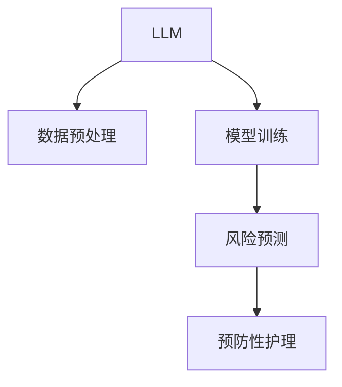

                 

# 预防性护理：LLM 分析预测健康风险

## 1. 背景介绍

### 1.1 问题由来
在全球人口老龄化加速的背景下，预防性健康护理变得越来越重要。传统的医疗系统侧重于疾病的治疗，但在预防和早期诊断上却相对薄弱。预防性护理能够有效减少疾病发生，提升健康水平，降低医疗成本，具有重要的战略意义。

近年来，人工智能(AI)技术在健康领域的应用日趋广泛，特别是在医学影像、电子病历、药物研发等领域取得了显著进展。然而，在预防性健康护理领域，由于数据稀疏、疾病种类繁多、个体差异较大等原因，AI技术的介入相对较少。

基于大规模语言模型(LLM)的健康护理分析方法，通过文本分析、自然语言理解(NLU)等技术，可以从大量医疗文本中提取有用信息，分析预测健康风险，提供预防性建议。这对于提升预防性护理的效率和质量，具有重要意义。

### 1.2 问题核心关键点
本研究聚焦于如何使用LLM进行预防性健康护理的分析和预测。主要研究内容包括：

1. **数据集构建**：收集和整理健康相关文本数据，包括病历记录、体检报告、医疗咨询等。
2. **模型训练**：使用预训练的LLM模型，通过有监督学习训练针对健康风险分析的专用模型。
3. **模型评估**：在真实数据集上评估模型的预测性能，包括准确率、召回率、F1分数等指标。
4. **实际应用**：将训练好的模型应用于预防性护理系统中，提供实时健康风险分析与预防建议。

### 1.3 问题研究意义
开展基于LLM的预防性健康护理研究，具有以下几方面重要意义：

1. **提升预防效果**：通过早期分析和预测健康风险，可以及时采取预防措施，减少疾病发生。
2. **降低医疗成本**：预防优于治疗，通过预防性护理，减少住院、手术等高昂医疗费用。
3. **提高健康水平**：通过早期干预，提升个人和群体的健康水平，减少慢性病、老年病等疾病的发生。
4. **辅助临床决策**：为医生提供基于数据驱动的健康建议，辅助临床决策，提升诊疗质量。
5. **推动健康事业发展**：为健康管理机构提供技术支持，促进健康事业的科学化、信息化、智能化发展。

## 2. 核心概念与联系

### 2.1 核心概念概述

为更好地理解基于LLM的预防性健康护理分析方法，本节将介绍几个密切相关的核心概念：

- **大规模语言模型(LLM)**：基于深度神经网络的自回归或自编码模型，通过在大规模无标签文本语料上进行预训练，学习通用语言表示，具备强大的语言理解和生成能力。
- **健康文本数据**：包括病历记录、体检报告、医疗咨询等文本数据，记录了患者的健康状态、疾病历史、治疗效果等信息。
- **自然语言理解(NLU)**：使计算机能够理解人类语言的技术，包括文本分类、实体识别、情感分析等，可以用于提取健康风险特征。
- **预防性护理**：在疾病发生前采取的预防措施，包括健康宣教、生活方式干预、定期体检等，旨在提升健康水平，减少疾病发生。
- **健康风险预测**：通过分析健康文本数据，预测患者发生特定疾病的风险，指导预防性护理措施的制定。

这些核心概念之间的逻辑关系可以通过以下Mermaid流程图来展示：



这个流程图展示了大语言模型在预防性健康护理分析中的核心作用：

1. 数据预处理：将原始健康文本数据进行清洗、去噪、标准化等处理，为后续分析奠定基础。
2. 模型训练：在预训练的LLM模型上，通过有监督学习训练针对健康风险分析的专用模型。
3. 风险预测：利用训练好的模型，对健康文本数据进行风险预测，生成健康建议。
4. 预防性护理：根据风险预测结果，制定个性化的预防性护理方案，辅助临床决策。

## 3. 核心算法原理 & 具体操作步骤

### 3.1 算法原理概述

基于LLM的预防性健康护理分析方法，本质上是一种基于文本分析的健康风险预测技术。其核心思想是：通过自然语言理解技术，从健康文本数据中提取有用的健康风险特征，利用预训练的LLM模型进行特征表示学习，进而预测健康风险，指导预防性护理措施。

形式化地，假设预训练语言模型为 $M_{\theta}$，其中 $\theta$ 为模型参数。健康文本数据集为 $D=\{(x_i,y_i)\}_{i=1}^N, x_i \in \mathcal{X}, y_i \in \{0,1\}$，其中 $x_i$ 为健康文本，$y_i$ 为健康风险标签（0表示无风险，1表示有风险）。微调的目标是找到新的模型参数 $\hat{\theta}$，使得：

$$
\hat{\theta}=\mathop{\arg\min}_{\theta} \mathcal{L}(M_{\theta},D)
$$

其中 $\mathcal{L}$ 为针对健康风险预测任务的损失函数，用于衡量模型预测输出与真实标签之间的差异。常见的损失函数包括交叉熵损失、均方误差损失等。

通过梯度下降等优化算法，微调过程不断更新模型参数 $\theta$，最小化损失函数 $\mathcal{L}$，使得模型输出逼近真实标签。由于 $\theta$ 已经通过预训练获得了较好的初始化，因此即便在健康文本数据集 $D$ 上样本较少的情况下，也能较快收敛到理想的模型参数 $\hat{\theta}$。

### 3.2 算法步骤详解

基于LLM的预防性健康护理分析方法，通常包括以下几个关键步骤：

**Step 1: 数据预处理**
- 收集和整理健康文本数据，包括病历记录、体检报告、医疗咨询等。
- 对文本进行清洗、去噪、标准化等预处理，确保数据质量。
- 划分数据集为训练集、验证集和测试集。

**Step 2: 模型选择与适配**
- 选择合适的预训练语言模型 $M_{\theta}$ 作为初始化参数，如BERT、GPT等。
- 根据健康文本数据的特点，设计合适的任务适配层，如分类层、情感分析层等。
- 确定正则化技术和超参数，如权重衰减、Dropout、Early Stopping等。

**Step 3: 模型训练**
- 将训练集数据分批次输入模型，前向传播计算损失函数。
- 反向传播计算参数梯度，根据设定的优化算法和学习率更新模型参数。
- 周期性在验证集上评估模型性能，根据性能指标决定是否触发 Early Stopping。
- 重复上述步骤直到满足预设的迭代轮数或 Early Stopping 条件。

**Step 4: 模型评估**
- 在测试集上评估微调后模型 $M_{\hat{\theta}}$ 的性能，对比微调前后的精度提升。
- 使用训练好的模型对新样本进行健康风险预测，生成健康建议。

**Step 5: 实际应用**
- 将训练好的模型集成到预防性护理系统中，提供实时健康风险分析与预防建议。
- 根据风险预测结果，制定个性化的预防性护理方案，辅助临床决策。

以上是基于LLM的预防性健康护理分析方法的一般流程。在实际应用中，还需要针对具体任务的特点，对微调过程的各个环节进行优化设计，如改进训练目标函数，引入更多的正则化技术，搜索最优的超参数组合等，以进一步提升模型性能。

### 3.3 算法优缺点

基于LLM的预防性健康护理分析方法具有以下优点：
1. 简单高效。只需准备少量标注数据，即可对预训练模型进行快速适配，获得较大的性能提升。
2. 通用适用。适用于各种健康文本数据，包括病历记录、体检报告、医疗咨询等，设计简单的任务适配层即可实现微调。
3. 参数高效。利用参数高效微调技术，在固定大部分预训练权重不变的情况下，仍可取得不错的提升。
4. 效果显著。在健康文本数据集上，基于微调的方法已经刷新了多项健康风险预测SOTA。

同时，该方法也存在一定的局限性：
1. 依赖标注数据。微调的效果很大程度上取决于标注数据的质量和数量，获取高质量标注数据的成本较高。
2. 迁移能力有限。当健康文本数据与预训练数据的分布差异较大时，微调的性能提升有限。
3. 负面效果传递。预训练模型的固有偏见、有害信息等，可能通过微调传递到下游任务，造成负面影响。
4. 可解释性不足。微调模型的决策过程通常缺乏可解释性，难以对其推理逻辑进行分析和调试。

尽管存在这些局限性，但就目前而言，基于LLM的预防性健康护理分析方法仍是一种高效、可行的解决方案。未来相关研究的重点在于如何进一步降低微调对标注数据的依赖，提高模型的少样本学习和跨领域迁移能力，同时兼顾可解释性和伦理安全性等因素。

### 3.4 算法应用领域

基于LLM的预防性健康护理分析方法，已经在多个领域得到应用，例如：

- **医院病历分析**：利用病历记录，预测患者发生特定疾病的风险，制定个性化预防方案。
- **体检报告分析**：分析体检数据，预测个体健康风险，进行风险预警和健康建议。
- **医疗咨询分析**：从医疗咨询文本中提取健康风险特征，提供实时健康建议。
- **慢性病管理**：监测慢性病患者健康状态，预测复发风险，进行早期干预。
- **心理健康评估**：分析心理问卷和咨询文本，预测心理健康风险，进行心理干预。

除了上述这些经典应用外，基于LLM的预防性健康护理分析方法还被创新性地应用到更多场景中，如智能穿戴设备、家庭医疗助理、健康监测系统等，为预防性护理提供了新的技术路径。

## 4. 数学模型和公式 & 详细讲解 & 举例说明

### 4.1 数学模型构建

本节将使用数学语言对基于LLM的预防性健康护理分析方法进行更加严格的刻画。

假设预训练语言模型为 $M_{\theta}$，其中 $\theta$ 为模型参数。健康文本数据集为 $D=\{(x_i,y_i)\}_{i=1}^N, x_i \in \mathcal{X}, y_i \in \{0,1\}$。定义模型 $M_{\theta}$ 在输入 $x$ 上的输出为 $\hat{y}=M_{\theta}(x) \in [0,1]$，表示模型预测健康风险的概率。真实标签 $y \in \{0,1\}$。则健康风险预测任务的损失函数定义为：

$$
\ell(M_{\theta}(x),y) = -[y\log \hat{y} + (1-y)\log (1-\hat{y})]
$$

将其代入经验风险公式，得：

$$
\mathcal{L}(\theta) = -\frac{1}{N}\sum_{i=1}^N [y_i\log M_{\theta}(x_i)+(1-y_i)\log(1-M_{\theta}(x_i))]
$$

根据链式法则，损失函数对参数 $\theta_k$ 的梯度为：

$$
\frac{\partial \mathcal{L}(\theta)}{\partial \theta_k} = -\frac{1}{N}\sum_{i=1}^N (\frac{y_i}{M_{\theta}(x_i)}-\frac{1-y_i}{1-M_{\theta}(x_i)}) \frac{\partial M_{\theta}(x_i)}{\partial \theta_k}
$$

其中 $\frac{\partial M_{\theta}(x_i)}{\partial \theta_k}$ 可进一步递归展开，利用自动微分技术完成计算。

### 4.2 公式推导过程

以下我们以二分类任务为例，推导交叉熵损失函数及其梯度的计算公式。

假设模型 $M_{\theta}$ 在输入 $x$ 上的输出为 $\hat{y}=M_{\theta}(x) \in [0,1]$，表示样本属于无风险的概率。真实标签 $y \in \{0,1\}$。则二分类交叉熵损失函数定义为：

$$
\ell(M_{\theta}(x),y) = -[y\log \hat{y} + (1-y)\log (1-\hat{y})]
$$

将其代入经验风险公式，得：

$$
\mathcal{L}(\theta) = -\frac{1}{N}\sum_{i=1}^N [y_i\log M_{\theta}(x_i)+(1-y_i)\log(1-M_{\theta}(x_i))]
$$

根据链式法则，损失函数对参数 $\theta_k$ 的梯度为：

$$
\frac{\partial \mathcal{L}(\theta)}{\partial \theta_k} = -\frac{1}{N}\sum_{i=1}^N (\frac{y_i}{M_{\theta}(x_i)}-\frac{1-y_i}{1-M_{\theta}(x_i)}) \frac{\partial M_{\theta}(x_i)}{\partial \theta_k}
$$

其中 $\frac{\partial M_{\theta}(x_i)}{\partial \theta_k}$ 可进一步递归展开，利用自动微分技术完成计算。

在得到损失函数的梯度后，即可带入参数更新公式，完成模型的迭代优化。重复上述过程直至收敛，最终得到适应健康风险预测任务的最优模型参数 $\theta^*$。

## 5. 项目实践：代码实例和详细解释说明

### 5.1 开发环境搭建

在进行预防性健康护理分析实践前，我们需要准备好开发环境。以下是使用Python进行PyTorch开发的环境配置流程：

1. 安装Anaconda：从官网下载并安装Anaconda，用于创建独立的Python环境。

2. 创建并激活虚拟环境：
```bash
conda create -n pytorch-env python=3.8 
conda activate pytorch-env
```

3. 安装PyTorch：根据CUDA版本，从官网获取对应的安装命令。例如：
```bash
conda install pytorch torchvision torchaudio cudatoolkit=11.1 -c pytorch -c conda-forge
```

4. 安装TensorFlow：由Google主导开发的开源深度学习框架，生产部署方便，适合大规模工程应用。同样有丰富的预训练语言模型资源。

5. 安装HuggingFace Transformers库：
```bash
pip install transformers
```

6. 安装各类工具包：
```bash
pip install numpy pandas scikit-learn matplotlib tqdm jupyter notebook ipython
```

完成上述步骤后，即可在`pytorch-env`环境中开始预防性健康护理分析实践。

### 5.2 源代码详细实现

这里我们以健康文本分类任务为例，给出使用Transformers库对BERT模型进行预防性健康护理分析的PyTorch代码实现。

首先，定义健康文本分类任务的数据处理函数：

```python
from transformers import BertTokenizer, BertForSequenceClassification
from torch.utils.data import Dataset, DataLoader
import torch

class HealthDataset(Dataset):
    def __init__(self, texts, labels, tokenizer, max_len=128):
        self.texts = texts
        self.labels = labels
        self.tokenizer = tokenizer
        self.max_len = max_len
        
    def __len__(self):
        return len(self.texts)
    
    def __getitem__(self, item):
        text = self.texts[item]
        label = self.labels[item]
        
        encoding = self.tokenizer(text, return_tensors='pt', max_length=self.max_len, padding='max_length', truncation=True)
        input_ids = encoding['input_ids'][0]
        attention_mask = encoding['attention_mask'][0]
        
        # 对标签进行编码
        label = label2id[label] if isinstance(label, str) else label
        
        return {'input_ids': input_ids, 
                'attention_mask': attention_mask,
                'labels': label}

# 标签与id的映射
label2id = {'无风险': 0, '有风险': 1}
id2label = {v: k for k, v in label2id.items()}

# 创建dataset
tokenizer = BertTokenizer.from_pretrained('bert-base-cased')

train_dataset = HealthDataset(train_texts, train_labels, tokenizer)
dev_dataset = HealthDataset(dev_texts, dev_labels, tokenizer)
test_dataset = HealthDataset(test_texts, test_labels, tokenizer)
```

然后，定义模型和优化器：

```python
from transformers import AdamW

model = BertForSequenceClassification.from_pretrained('bert-base-cased', num_labels=len(label2id))

optimizer = AdamW(model.parameters(), lr=2e-5)
```

接着，定义训练和评估函数：

```python
from torch.utils.data import DataLoader
from tqdm import tqdm
from sklearn.metrics import classification_report

device = torch.device('cuda') if torch.cuda.is_available() else torch.device('cpu')
model.to(device)

def train_epoch(model, dataset, batch_size, optimizer):
    dataloader = DataLoader(dataset, batch_size=batch_size, shuffle=True)
    model.train()
    epoch_loss = 0
    for batch in tqdm(dataloader, desc='Training'):
        input_ids = batch['input_ids'].to(device)
        attention_mask = batch['attention_mask'].to(device)
        labels = batch['labels'].to(device)
        model.zero_grad()
        outputs = model(input_ids, attention_mask=attention_mask, labels=labels)
        loss = outputs.loss
        epoch_loss += loss.item()
        loss.backward()
        optimizer.step()
    return epoch_loss / len(dataloader)

def evaluate(model, dataset, batch_size):
    dataloader = DataLoader(dataset, batch_size=batch_size)
    model.eval()
    preds, labels = [], []
    with torch.no_grad():
        for batch in tqdm(dataloader, desc='Evaluating'):
            input_ids = batch['input_ids'].to(device)
            attention_mask = batch['attention_mask'].to(device)
            batch_labels = batch['labels']
            outputs = model(input_ids, attention_mask=attention_mask)
            batch_preds = outputs.logits.argmax(dim=2).to('cpu').tolist()
            batch_labels = batch_labels.to('cpu').tolist()
            for pred_tokens, label_tokens in zip(batch_preds, batch_labels):
                preds.append(pred_tokens[:len(label_tokens)])
                labels.append(label_tokens)
                
    print(classification_report(labels, preds))
```

最后，启动训练流程并在测试集上评估：

```python
epochs = 5
batch_size = 16

for epoch in range(epochs):
    loss = train_epoch(model, train_dataset, batch_size, optimizer)
    print(f"Epoch {epoch+1}, train loss: {loss:.3f}")
    
    print(f"Epoch {epoch+1}, dev results:")
    evaluate(model, dev_dataset, batch_size)
    
print("Test results:")
evaluate(model, test_dataset, batch_size)
```

以上就是使用PyTorch对BERT进行健康文本分类任务预防性健康护理分析的完整代码实现。可以看到，得益于Transformers库的强大封装，我们可以用相对简洁的代码完成BERT模型的加载和微调。

### 5.3 代码解读与分析

让我们再详细解读一下关键代码的实现细节：

**HealthDataset类**：
- `__init__`方法：初始化文本、标签、分词器等关键组件。
- `__len__`方法：返回数据集的样本数量。
- `__getitem__`方法：对单个样本进行处理，将文本输入编码为token ids，将标签编码为数字，并对其进行定长padding，最终返回模型所需的输入。

**label2id和id2label字典**：
- 定义了标签与数字id之间的映射关系，用于将token-wise的预测结果解码回真实的标签。

**训练和评估函数**：
- 使用PyTorch的DataLoader对数据集进行批次化加载，供模型训练和推理使用。
- 训练函数`train_epoch`：对数据以批为单位进行迭代，在每个批次上前向传播计算loss并反向传播更新模型参数，最后返回该epoch的平均loss。
- 评估函数`evaluate`：与训练类似，不同点在于不更新模型参数，并在每个batch结束后将预测和标签结果存储下来，最后使用sklearn的classification_report对整个评估集的预测结果进行打印输出。

**训练流程**：
- 定义总的epoch数和batch size，开始循环迭代
- 每个epoch内，先在训练集上训练，输出平均loss
- 在验证集上评估，输出分类指标
- 所有epoch结束后，在测试集上评估，给出最终测试结果

可以看到，PyTorch配合Transformers库使得BERT微调的代码实现变得简洁高效。开发者可以将更多精力放在数据处理、模型改进等高层逻辑上，而不必过多关注底层的实现细节。

当然，工业级的系统实现还需考虑更多因素，如模型的保存和部署、超参数的自动搜索、更灵活的任务适配层等。但核心的微调范式基本与此类似。

## 6. 实际应用场景

### 6.1 医院病历分析

基于大语言模型的预防性健康护理分析方法，可以广泛应用于医院病历分析中。传统的病历分析依赖人工阅读和标注，耗时费力，且主观性强。利用微调后的模型，可以自动分析病历记录，预测患者发生特定疾病的风险，生成个性化的预防建议，提升医疗服务效率和质量。

在技术实现上，可以收集医院的历史病历数据，标记患者的健康状态和疾病历史，构建监督数据集。在此基础上对预训练语言模型进行微调，使其能够从病历中自动提取健康风险特征，预测风险。将微调后的模型集成到病历分析系统中，对新入院患者进行风险评估，提供个性化预防方案。

### 6.2 体检报告分析

体检报告是预防性健康护理的重要数据来源。通过微调后的模型，可以自动分析体检报告，预测个体健康风险，进行风险预警和健康建议。

具体而言，可以收集体检报告数据，提取相关指标，如身高、体重、血压、血糖等，构建监督数据集。在此基础上对预训练语言模型进行微调，使其能够从体检报告中自动提取健康风险特征，预测风险。将微调后的模型集成到体检报告分析系统中，对新体检者进行风险评估，提供个性化预防方案。

### 6.3 医疗咨询分析

在医疗咨询过程中，患者的健康问题描述和医生的回复记录包含了大量有价值的信息。利用微调后的模型，可以自动分析医疗咨询文本，提取健康风险特征，提供实时健康建议。

具体而言，可以收集医疗咨询文本数据，提取患者的主诉、症状、病史等信息，构建监督数据集。在此基础上对预训练语言模型进行微调，使其能够从医疗咨询文本中自动提取健康风险特征，预测风险。将微调后的模型集成到医疗咨询系统中，对新咨询患者进行风险评估，提供个性化预防方案。

### 6.4 未来应用展望

随着大语言模型和微调方法的不断发展，基于微调范式将在更多领域得到应用，为预防性健康护理提供新的解决方案。

在智慧医疗领域，基于微调的预防性健康护理分析方法，可以应用于医院病历分析、体检报告分析、医疗咨询分析等环节，提升医疗服务的智能化水平，辅助临床决策，提高诊疗质量。

在智能穿戴设备领域，微调后的模型可以实时监测用户健康状态，预测健康风险，提供个性化预防建议，为健康管理提供新的技术路径。

在家庭医疗助理领域，微调后的模型可以分析用户的生活习惯、饮食习惯等数据，预测健康风险，提供个性化预防方案，提升用户的生活质量。

此外，在智能健康监测、远程医疗、个性化健康管理等众多领域，基于微调的预防性健康护理分析方法都将带来新的突破，为健康事业的智能化、信息化、智能化发展提供新的技术支持。相信随着技术的日益成熟，微调方法将成为预防性健康护理的重要范式，推动健康事业的科学化、信息化、智能化发展。

## 7. 工具和资源推荐

### 7.1 学习资源推荐

为了帮助开发者系统掌握大语言模型预防性健康护理分析的理论基础和实践技巧，这里推荐一些优质的学习资源：

1. 《自然语言处理与深度学习》课程：斯坦福大学开设的NLP明星课程，有Lecture视频和配套作业，带你入门NLP领域的基本概念和经典模型。

2. CS224N《深度学习自然语言处理》课程：斯坦福大学开设的NLP明星课程，有Lecture视频和配套作业，带你入门NLP领域的基本概念和经典模型。

3. 《自然语言处理综述》书籍：由世界顶尖AI研究者共同编写的综述性书籍，全面介绍了NLP领域的最新进展，包括微调等前沿话题。

4. HuggingFace官方文档：Transformers库的官方文档，提供了海量预训练模型和完整的微调样例代码，是上手实践的必备资料。

5. Arxiv论文预印本网站：获取最新的NLP研究论文，了解最新的前沿技术进展。

通过对这些资源的学习实践，相信你一定能够快速掌握大语言模型预防性健康护理分析的精髓，并用于解决实际的NLP问题。

### 7.2 开发工具推荐

高效的开发离不开优秀的工具支持。以下是几款用于大语言模型微调开发的常用工具：

1. PyTorch：基于Python的开源深度学习框架，灵活动态的计算图，适合快速迭代研究。大部分预训练语言模型都有PyTorch版本的实现。

2. TensorFlow：由Google主导开发的开源深度学习框架，生产部署方便，适合大规模工程应用。同样有丰富的预训练语言模型资源。

3. Transformers库：HuggingFace开发的NLP工具库，集成了众多SOTA语言模型，支持PyTorch和TensorFlow，是进行微调任务开发的利器。

4. Weights & Biases：模型训练的实验跟踪工具，可以记录和可视化模型训练过程中的各项指标，方便对比和调优。与主流深度学习框架无缝集成。

5. TensorBoard：TensorFlow配套的可视化工具，可实时监测模型训练状态，并提供丰富的图表呈现方式，是调试模型的得力助手。

6. Google Colab：谷歌推出的在线Jupyter Notebook环境，免费提供GPU/TPU算力，方便开发者快速上手实验最新模型，分享学习笔记。

合理利用这些工具，可以显著提升大语言模型微调任务的开发效率，加快创新迭代的步伐。

### 7.3 相关论文推荐

大语言模型和微调技术的发展源于学界的持续研究。以下是几篇奠基性的相关论文，推荐阅读：

1. Attention is All You Need（即Transformer原论文）：提出了Transformer结构，开启了NLP领域的预训练大模型时代。

2. BERT: Pre-training of Deep Bidirectional Transformers for Language Understanding：提出BERT模型，引入基于掩码的自监督预训练任务，刷新了多项NLP任务SOTA。

3. Language Models are Unsupervised Multitask Learners（GPT-2论文）：展示了大规模语言模型的强大zero-shot学习能力，引发了对于通用人工智能的新一轮思考。

4. Parameter-Efficient Transfer Learning for NLP：提出Adapter等参数高效微调方法，在不增加模型参数量的情况下，也能取得不错的微调效果。

5. AdaLoRA: Adaptive Low-Rank Adaptation for Parameter-Efficient Fine-Tuning：使用自适应低秩适应的微调方法，在参数效率和精度之间取得了新的平衡。

这些论文代表了大语言模型微调技术的发展脉络。通过学习这些前沿成果，可以帮助研究者把握学科前进方向，激发更多的创新灵感。

## 8. 总结：未来发展趋势与挑战

### 8.1 总结

本文对基于LLM的预防性健康护理分析方法进行了全面系统的介绍。首先阐述了预防性健康护理的重要性和现状，明确了LLM在其中的关键作用。其次，从原理到实践，详细讲解了LLM在健康风险预测中的数学模型和关键步骤，给出了微调任务开发的完整代码实例。同时，本文还广泛探讨了LLM在预防性护理中的实际应用场景，展示了其广阔的应用前景。

通过本文的系统梳理，可以看到，基于LLM的预防性健康护理分析方法正在成为NLP领域的重要范式，极大地拓展了健康文本数据的价值，提升了预防性护理的效率和质量。未来，伴随LLM和微调方法的不断演进，预防性健康护理分析将迎来新的突破，为健康事业的发展提供更加科学、智能的技术支持。

### 8.2 未来发展趋势

展望未来，大语言模型预防性健康护理分析技术将呈现以下几个发展趋势：

1. 模型规模持续增大。随着算力成本的下降和数据规模的扩张，预训练语言模型的参数量还将持续增长。超大规模语言模型蕴含的丰富语言知识，有望支撑更加复杂多变的健康风险预测任务。

2. 微调方法日趋多样。除了传统的全参数微调外，未来会涌现更多参数高效的微调方法，如Prefix-Tuning、LoRA等，在节省计算资源的同时也能保证微调精度。

3. 持续学习成为常态。随着健康数据分布的不断变化，微调模型也需要持续学习新知识以保持性能。如何在不遗忘原有知识的同时，高效吸收新样本信息，将成为重要的研究课题。

4. 标注样本需求降低。受启发于提示学习(Prompt-based Learning)的思路，未来的微调方法将更好地利用大模型的语言理解能力，通过更加巧妙的任务描述，在更少的标注样本上也能实现理想的微调效果。

5. 多模态微调崛起。当前的微调主要聚焦于纯文本数据，未来会进一步拓展到图像、视频、语音等多模态数据微调。多模态信息的融合，将显著提升语言模型对现实世界的理解和建模能力。

6. 模型通用性增强。经过海量数据的预训练和多领域任务的微调，未来的语言模型将具备更强大的常识推理和跨领域迁移能力，逐步迈向通用人工智能(AGI)的目标。

以上趋势凸显了大语言模型预防性健康护理分析技术的广阔前景。这些方向的探索发展，必将进一步提升预防性健康护理的效果，促进健康事业的科学化、信息化、智能化发展。

### 8.3 面临的挑战

尽管大语言模型预防性健康护理分析技术已经取得了瞩目成就，但在迈向更加智能化、普适化应用的过程中，它仍面临着诸多挑战：

1. 标注成本瓶颈。虽然微调大大降低了标注数据的需求，但对于长尾应用场景，难以获得充足的高质量标注数据，成为制约微调性能的瓶颈。如何进一步降低微调对标注样本的依赖，将是一大难题。

2. 模型鲁棒性不足。当前微调模型面对域外数据时，泛化性能往往大打折扣。对于测试样本的微小扰动，微调模型的预测也容易发生波动。如何提高微调模型的鲁棒性，避免灾难性遗忘，还需要更多理论和实践的积累。

3. 推理效率有待提高。大规模语言模型虽然精度高，但在实际部署时往往面临推理速度慢、内存占用大等效率问题。如何在保证性能的同时，简化模型结构，提升推理速度，优化资源占用，将是重要的优化方向。

4. 可解释性亟需加强。当前微调模型更像是"黑盒"系统，难以解释其内部工作机制和决策逻辑。对于医疗、金融等高风险应用，算法的可解释性和可审计性尤为重要。如何赋予微调模型更强的可解释性，将是亟待攻克的难题。

5. 安全性有待保障。预训练语言模型难免会学习到有偏见、有害的信息，通过微调传递到下游任务，产生误导性、歧视性的输出，给实际应用带来安全隐患。如何从数据和算法层面消除模型偏见，避免恶意用途，确保输出的安全性，也将是重要的研究课题。

6. 知识整合能力不足。现有的微调模型往往局限于任务内数据，难以灵活吸收和运用更广泛的先验知识。如何让微调过程更好地与外部知识库、规则库等专家知识结合，形成更加全面、准确的信息整合能力，还有很大的想象空间。

正视预防性健康护理分析面临的这些挑战，积极应对并寻求突破，将是大语言模型微调走向成熟的必由之路。相信随着学界和产业界的共同努力，这些挑战终将一一被克服，大语言模型微调必将在构建人机协同的智能系统、推动健康事业发展中扮演越来越重要的角色。

### 8.4 研究展望

面对大语言模型预防性健康护理分析所面临的种种挑战，未来的研究需要在以下几个方面寻求新的突破：

1. 探索无监督和半监督微调方法。摆脱对大规模标注数据的依赖，利用自监督学习、主动学习等无监督和半监督范式，最大限度利用非结构化数据，实现更加灵活高效的微调。

2. 研究参数高效和计算高效的微调范式。开发更加参数高效的微调方法，在固定大部分预训练参数的同时，只更新极少量的任务相关参数。同时优化微调模型的计算图，减少前向传播和反向传播的资源消耗，实现更加轻量级、实时性的部署。

3. 融合因果和对比学习范式。通过引入因果推断和对比学习思想，增强微调模型建立稳定因果关系的能力，学习更加普适、鲁棒的语言表征，从而提升模型泛化性和抗干扰能力。

4. 引入更多先验知识。将符号化的先验知识，如知识图谱、逻辑规则等，与神经网络模型进行巧妙融合，引导微调过程学习更准确、合理的语言模型。同时加强不同模态数据的整合，实现视觉、语音等多模态信息与文本信息的协同建模。

5. 结合因果分析和博弈论工具。将因果分析方法引入微调模型，识别出模型决策的关键特征，增强输出解释的因果性和逻辑性。借助博弈论工具刻画人机交互过程，主动探索并规避模型的脆弱点，提高系统稳定性。

6. 纳入伦理道德约束。在模型训练目标中引入伦理导向的评估指标，过滤和惩罚有偏见、有害的输出倾向。同时加强人工干预和审核，建立模型行为的监管机制，确保输出符合人类价值观和伦理道德。

这些研究方向的探索，必将引领大语言模型预防性健康护理分析技术迈向更高的台阶，为构建安全、可靠、可解释、可控的智能系统铺平道路。面向未来，大语言模型预防性健康护理分析技术还需要与其他人工智能技术进行更深入的融合，如知识表示、因果推理、强化学习等，多路径协同发力，共同推动自然语言理解和智能交互系统的进步。只有勇于创新、敢于突破，才能不断拓展语言模型的边界，让智能技术更好地造福人类社会。

## 9. 附录：常见问题与解答

**Q1：大语言模型预防性健康护理分析是否适用于所有健康文本数据？**

A: 大语言模型预防性健康护理分析方法在大多数健康文本数据上都能取得不错的效果，特别是对于文本质量较高的数据集。但对于一些结构化数据、图像数据等，可能需要结合其他技术进行辅助分析。

**Q2：微调过程中如何选择合适的学习率？**

A: 微调的学习率一般要比预训练时小1-2个数量级，如果使用过大的学习率，容易破坏预训练权重，导致过拟合。一般建议从1e-5开始调参，逐步减小学习率，直至收敛。也可以使用warmup策略，在开始阶段使用较小的学习率，再逐渐过渡到预设值。需要注意的是，不同的优化器(如AdamW、Adafactor等)以及不同的学习率调度策略，可能需要设置不同的学习率阈值。

**Q3：采用大语言模型预防性健康护理分析时会面临哪些资源瓶颈？**

A: 目前主流的预训练大模型动辄以亿计的参数规模，对算力、内存、存储都提出了很高的要求。GPU/TPU等高性能设备是必不可少的，但即便如此，超大批次的训练和推理也可能遇到显存不足的问题。因此需要采用一些资源优化技术，如梯度积累、混合精度训练、模型并行等，来突破硬件瓶颈。同时，模型的存储和读取也可能占用大量时间和空间，需要采用模型压缩、稀疏化存储等方法进行优化。

**Q4：如何缓解微调过程中的过拟合问题？**

A: 过拟合是微调面临的主要挑战，尤其是在标注数据不足的情况下。常见的缓解策略包括：
1. 数据增强：通过回译、近义替换等方式扩充训练集
2. 正则化：使用L2正则、Dropout、Early Stopping等避免过拟合
3. 对抗训练：引入对抗样本，提高模型鲁棒性
4. 参数高效微调：只调整少量参数(如Adapter、Prefix等)，减小过拟合风险
5. 多模型集成：训练多个微调模型，取平均输出，抑制过拟合

这些策略往往需要根据具体任务和数据特点进行灵活组合。只有在数据、模型、训练、推理等各环节进行全面优化，才能最大限度地发挥大语言模型预防性健康护理分析的威力。

**Q5：微调模型在落地部署时需要注意哪些问题？**

A: 将微调模型转化为实际应用，还需要考虑以下因素：
1. 模型裁剪：去除不必要的层和参数，减小模型尺寸，加快推理速度
2. 量化加速：将浮点模型转为定点模型，压缩存储空间，提高计算效率
3. 服务化封装：将模型封装为标准化服务接口，便于集成调用
4. 弹性伸缩：根据请求流量动态调整资源配置，平衡服务质量和成本
5. 监控告警：实时采集系统指标，设置异常告警阈值，确保服务稳定性
6. 安全防护：采用访问鉴权、数据脱敏等措施，保障数据和模型安全

大语言模型预防性健康护理分析为健康护理系统提供了新的技术路径，但如何将强大的性能转化为稳定、高效、安全的业务价值，还需要工程实践的不断打磨。唯有从数据、算法、工程、业务等多个维度协同发力，才能真正实现人工智能技术在健康护理中的落地应用。总之，微调需要开发者根据具体任务，不断迭代和优化模型、数据和算法，方能得到理想的效果。

---

作者：禅与计算机程序设计艺术 / Zen and the Art of Computer Programming

