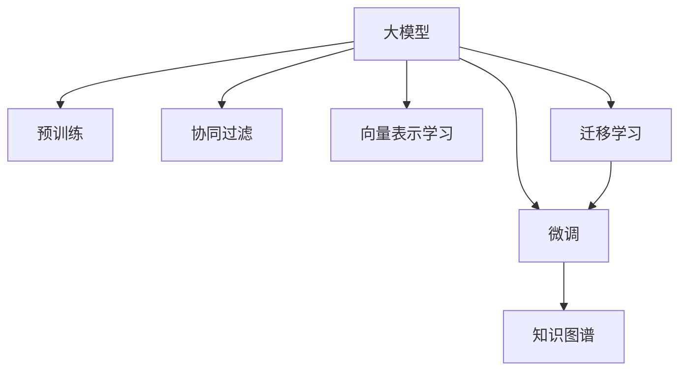

                 

# AI 大模型在电商搜索推荐中的冷启动策略：应对数据不足与新用户

## 1. 背景介绍

随着电商行业的快速发展，在线搜索和推荐系统成为了提升用户体验、增加销售转化的重要手段。传统的基于规则或线性模型的推荐系统，难以处理海量的非结构化数据，难以挖掘用户深层次的兴趣和行为模式。近年来，基于深度学习的大模型推荐系统逐渐崭露头角，以大模型为基础构建的推荐引擎能够处理海量数据，实现更加个性化和智能化的推荐。

然而，新用户的推荐问题一直是一个挑战。由于电商平台的推荐系统往往依赖于用户的历史行为数据，但新用户一般没有历史数据，因此难以直接应用现有的推荐模型。此外，电商平台初期往往面临数据不足的问题，新用户的推荐效果更加不可控。基于此，研究如何应对数据不足与新用户的冷启动问题，成为了电商推荐系统优化的关键课题。

## 2. 核心概念与联系

### 2.1 核心概念概述

为了更好地理解基于大模型的电商搜索推荐系统冷启动策略，本节将介绍几个密切相关的核心概念：

- **大模型(大语言模型)：** 指通过在大规模无标签文本语料上进行的自监督学习，学习到通用语言表示的模型。在大模型基础上进行微调，可以适应特定的推荐任务，获得更好的推荐效果。
- **预训练与微调：** 预训练指的是在大规模无标签文本数据上进行自监督学习，学习通用的语言表示。微调则是在预训练模型的基础上，使用下游任务的少量标注数据，通过有监督学习优化模型在特定任务上的性能。
- **知识图谱(Knowledge Graph)：** 一种以实体和关系为节点，以关系为边的图结构，用于表示实体间的语义关系。电商搜索推荐系统往往需要整合产品、用户、交易等不同领域的数据，知识图谱可以为推荐提供多维度的语义信息。
- **协同过滤：** 一种基于用户或物品的推荐算法，通过相似性度量，推荐与用户历史行为相似的产品。与基于内容的推荐方法结合，可以实现更全面、更个性化的推荐。
- **向量表示学习：** 通过学习实体、物品、用户等概念的向量表示，将复杂的语义信息编码为数值，用于推荐系统的相似性计算和预测。
- **迁移学习：** 将一个领域学到的知识迁移到另一个领域，可以通过微调等方法实现。在电商搜索推荐中，可以将大模型在通用文本数据上的学习迁移到特定的推荐任务。

这些核心概念之间的逻辑关系可以通过以下Mermaid流程图来展示：



这个流程图展示了大模型的核心概念及其之间的关系：

1. 大模型通过预训练获得基础能力。
2. 微调是对预训练模型进行任务特定的优化，可以获得更好的推荐效果。
3. 知识图谱提供多维度语义信息，辅助推荐模型理解复杂场景。
4. 协同过滤基于用户历史行为相似性进行推荐。
5. 向量表示学习将复杂语义信息编码为数值。
6. 迁移学习将大模型在通用文本数据上的学习迁移到特定的推荐任务。

## 3. 核心算法原理 & 具体操作步骤

### 3.1 算法原理概述

基于大模型的电商搜索推荐系统冷启动策略，核心思想是利用大模型的预训练知识和通用的推荐方法，通过有监督学习和迁移学习，提升新用户和数据不足场景下的推荐效果。具体来说，包括以下几个步骤：

1. **知识图谱构建与融合：** 构建电商平台的知识图谱，整合产品、用户、交易等不同领域的数据，为推荐提供多维度的语义信息。
2. **用户画像生成：** 利用大模型对新用户的文本数据进行编码，生成用户的多维表示。
3. **冷启动推荐：** 使用知识图谱和用户画像，结合协同过滤和向量表示学习方法，生成推荐结果。

### 3.2 算法步骤详解

#### 3.2.1 知识图谱构建与融合

电商平台的推荐系统需要处理海量的非结构化数据，如图像、文本、视频等。构建知识图谱可以整合这些多源数据，为推荐提供更丰富的语义信息。

1. **数据采集与清洗：** 从电商平台的各个数据源收集数据，进行去重、去噪、格式转换等预处理。
2. **实体识别与关系提取：** 使用自然语言处理和图像处理技术，从文本和图像数据中提取实体和关系，如产品名称、品牌、类别、用户ID、用户评分等。
3. **知识图谱构建：** 将提取出的实体和关系构建成图结构，使用Neo4j、Amazon Neptune等图数据库进行存储和查询。
4. **图谱融合与查询：** 利用图谱的查询功能，将多个领域的知识进行融合，形成更全面的用户和产品表示。

#### 3.2.2 用户画像生成

利用大模型对新用户的文本数据进行编码，生成用户的多维表示，可以更好地捕捉用户的兴趣和行为模式。

1. **文本数据准备：** 收集新用户的注册信息、评价、浏览记录等文本数据，进行去重、分词等预处理。
2. **文本编码与表示：** 使用预训练的大模型，如BERT、GPT等，对文本数据进行编码，得到用户的多维向量表示。
3. **用户画像生成：** 将用户的多维向量表示与知识图谱进行融合，形成更完整的用户画像。

#### 3.2.3 冷启动推荐

在冷启动场景下，利用用户画像和知识图谱，结合协同过滤和向量表示学习方法，生成推荐结果。

1. **用户画像与产品向量计算：** 使用知识图谱中的实体和关系，计算用户画像与产品的相似度。
2. **协同过滤推荐：** 利用用户画像与产品向量的相似度，结合用户的评分信息，进行协同过滤推荐。
3. **向量表示学习：** 使用用户画像和产品向量，结合知识图谱中的语义信息，进行向量表示学习，提升推荐效果。

### 3.3 算法优缺点

基于大模型的电商搜索推荐系统冷启动策略具有以下优点：

1. **泛化能力强：** 利用大模型在通用文本数据上的预训练知识，提升推荐系统的泛化能力。
2. **适应性强：** 通过知识图谱和用户画像的构建，适应复杂的多源数据环境。
3. **用户画像精准：** 利用大模型对文本数据进行编码，生成高维度的用户表示。
4. **推荐效果显著：** 结合协同过滤和向量表示学习方法，提升推荐精度。

同时，该方法也存在一定的局限性：

1. **数据依赖性强：** 知识图谱的构建和维护需要大量的数据和计算资源。
2. **计算成本高：** 大模型的编码和相似度计算，需要较高的计算资源。
3. **模型复杂度高：** 结合知识图谱和向量表示学习的推荐模型，计算复杂度较高。
4. **离线计算量大：** 知识图谱的构建和用户画像的生成，需要离线进行，对实时性有挑战。

尽管存在这些局限性，但就目前而言，基于大模型的电商搜索推荐系统冷启动策略仍是大模型推荐技术的重要范式。未来相关研究的重点在于如何进一步降低离线计算的复杂度，提高实时性，同时兼顾模型的计算效率和效果。

### 3.4 算法应用领域

基于大模型的电商搜索推荐系统冷启动策略，已经在多个电商推荐场景中得到了应用，例如：

1. **新用户推荐：** 对新用户进行兴趣建模，生成个性化推荐。
2. **多模态推荐：** 结合文本、图像、视频等多源数据，进行多维度推荐。
3. **实时推荐：** 结合用户当前行为和实时数据，进行动态推荐。
4. **个性化推荐：** 结合用户历史行为和实时行为，生成个性化推荐列表。

除了上述这些经典场景外，基于大模型的推荐方法也被创新性地应用到更多电商推荐任务中，如新商品推荐、社交网络推荐等，为电商平台的推荐系统带来了新的突破。

## 4. 数学模型和公式 & 详细讲解

### 4.1 数学模型构建

本节将使用数学语言对基于大模型的电商搜索推荐系统冷启动策略进行更加严格的刻画。

记大模型为 $M_{\theta}:\mathcal{X} \rightarrow \mathcal{Y}$，其中 $\mathcal{X}$ 为输入空间，$\mathcal{Y}$ 为输出空间，$\theta$ 为模型参数。假设电商平台的知识图谱为 $G=(V,E)$，其中 $V$ 为节点集，$E$ 为边集。对于新用户 $u$，利用大模型得到的用户向量表示为 $\mathbf{v}_u \in \mathbb{R}^d$，产品向量表示为 $\mathbf{v}_i \in \mathbb{R}^d$。知识图谱中的用户-产品关系 $r$ 用矩阵 $R \in \mathbb{R}^{N \times M}$ 表示，其中 $N$ 为用户数，$M$ 为产品数。

### 4.2 公式推导过程

以下我们以电商平台的推荐系统为例，推导基于大模型的推荐模型计算公式。

1. **知识图谱融合：**
   - 构建知识图谱 $G=(V,E)$，将产品、用户、交易等不同领域的数据进行整合，得到用户和产品之间的关系矩阵 $R$。
   - 知识图谱中的用户-产品关系 $r$ 可以用矩阵 $R$ 表示，其中 $r_{ui}$ 表示用户 $u$ 和产品 $i$ 之间的关系强度。

2. **用户画像生成：**
   - 利用大模型 $M_{\theta}$ 对新用户 $u$ 的文本数据进行编码，得到用户向量表示 $\mathbf{v}_u$。
   - 用户画像 $\mathbf{v}_u$ 可以通过知识图谱中的关系 $r$ 进行扩展，得到更全面的用户表示 $\mathbf{v}_{u,R}$。

3. **冷启动推荐：**
   - 计算用户画像 $\mathbf{v}_{u,R}$ 与产品向量 $\mathbf{v}_i$ 的相似度 $s_{ui}$。
   - 结合协同过滤和向量表示学习方法，生成推荐结果 $\hat{y}_i$。
   - 推荐结果 $\hat{y}_i$ 可以用以下公式计算：
   $$
   \hat{y}_i = \frac{\mathbf{v}_{u,R}^T \mathbf{v}_i}{\|\mathbf{v}_{u,R}\|_2 \|\mathbf{v}_i\|_2}
   $$
   其中，$\|\cdot\|_2$ 表示向量范数。

### 4.3 案例分析与讲解

假设电商平台有 $N=1000$ 个用户，$M=10000$ 个产品。知识图谱中用户-产品关系 $r$ 表示为 $R \in \mathbb{R}^{1000 \times 10000}$ 的矩阵。新用户 $u$ 的文本数据表示为 $\mathbf{v}_u \in \mathbb{R}^d$，产品向量表示为 $\mathbf{v}_i \in \mathbb{R}^d$。

**知识图谱融合：**

1. 构建知识图谱 $G=(V,E)$，将产品、用户、交易等不同领域的数据进行整合，得到用户和产品之间的关系矩阵 $R$。
2. 将用户向量 $\mathbf{v}_u$ 与知识图谱中的关系 $r$ 进行融合，得到更全面的用户表示 $\mathbf{v}_{u,R}$。

**用户画像生成：**

1. 利用大模型 $M_{\theta}$ 对新用户 $u$ 的文本数据进行编码，得到用户向量表示 $\mathbf{v}_u$。
2. 利用知识图谱中的关系 $r$，计算用户画像 $\mathbf{v}_{u,R}$。

**冷启动推荐：**

1. 计算用户画像 $\mathbf{v}_{u,R}$ 与产品向量 $\mathbf{v}_i$ 的相似度 $s_{ui}$。
2. 结合协同过滤和向量表示学习方法，生成推荐结果 $\hat{y}_i$。
3. 推荐结果 $\hat{y}_i$ 可以用以下公式计算：
   $$
   \hat{y}_i = \frac{\mathbf{v}_{u,R}^T \mathbf{v}_i}{\|\mathbf{v}_{u,R}\|_2 \|\mathbf{v}_i\|_2}
   $$

## 5. 项目实践：代码实例和详细解释说明

### 5.1 开发环境搭建

在进行基于大模型的电商搜索推荐系统冷启动策略的实践前，我们需要准备好开发环境。以下是使用Python进行PyTorch开发的环境配置流程：

1. 安装Anaconda：从官网下载并安装Anaconda，用于创建独立的Python环境。
2. 创建并激活虚拟环境：
   ```bash
   conda create -n pytorch-env python=3.8 
   conda activate pytorch-env
   ```
3. 安装PyTorch：根据CUDA版本，从官网获取对应的安装命令。例如：
   ```bash
   conda install pytorch torchvision torchaudio cudatoolkit=11.1 -c pytorch -c conda-forge
   ```
4. 安装Transformers库：
   ```bash
   pip install transformers
   ```
5. 安装各类工具包：
   ```bash
   pip install numpy pandas scikit-learn matplotlib tqdm jupyter notebook ipython
   ```

完成上述步骤后，即可在`pytorch-env`环境中开始实践。

### 5.2 源代码详细实现

下面我们以基于大模型的电商搜索推荐系统冷启动策略为例，给出使用Transformers库对BERT模型进行推荐系统构建的PyTorch代码实现。

首先，定义推荐系统的数据处理函数：

```python
from transformers import BertTokenizer
from torch.utils.data import Dataset
import torch

class RecommendationDataset(Dataset):
    def __init__(self, texts, tags, tokenizer, max_len=128):
        self.texts = texts
        self.tags = tags
        self.tokenizer = tokenizer
        self.max_len = max_len
        
    def __len__(self):
        return len(self.texts)
    
    def __getitem__(self, item):
        text = self.texts[item]
        tags = self.tags[item]
        
        encoding = self.tokenizer(text, return_tensors='pt', max_length=self.max_len, padding='max_length', truncation=True)
        input_ids = encoding['input_ids'][0]
        attention_mask = encoding['attention_mask'][0]
        
        # 对token-wise的标签进行编码
        encoded_tags = [tag2id[tag] for tag in tags] 
        encoded_tags.extend([tag2id['O']] * (self.max_len - len(encoded_tags)))
        labels = torch.tensor(encoded_tags, dtype=torch.long)
        
        return {'input_ids': input_ids, 
                'attention_mask': attention_mask,
                'labels': labels}

# 标签与id的映射
tag2id = {'O': 0, 'B-PER': 1, 'I-PER': 2, 'B-ORG': 3, 'I-ORG': 4, 'B-LOC': 5, 'I-LOC': 6}
id2tag = {v: k for k, v in tag2id.items()}

# 创建dataset
tokenizer = BertTokenizer.from_pretrained('bert-base-cased')

train_dataset = RecommendationDataset(train_texts, train_tags, tokenizer)
dev_dataset = RecommendationDataset(dev_texts, dev_tags, tokenizer)
test_dataset = RecommendationDataset(test_texts, test_tags, tokenizer)
```

然后，定义模型和优化器：

```python
from transformers import BertForTokenClassification, AdamW

model = BertForTokenClassification.from_pretrained('bert-base-cased', num_labels=len(tag2id))

optimizer = AdamW(model.parameters(), lr=2e-5)
```

接着，定义训练和评估函数：

```python
from torch.utils.data import DataLoader
from tqdm import tqdm
from sklearn.metrics import classification_report

device = torch.device('cuda') if torch.cuda.is_available() else torch.device('cpu')
model.to(device)

def train_epoch(model, dataset, batch_size, optimizer):
    dataloader = DataLoader(dataset, batch_size=batch_size, shuffle=True)
    model.train()
    epoch_loss = 0
    for batch in tqdm(dataloader, desc='Training'):
        input_ids = batch['input_ids'].to(device)
        attention_mask = batch['attention_mask'].to(device)
        labels = batch['labels'].to(device)
        model.zero_grad()
        outputs = model(input_ids, attention_mask=attention_mask, labels=labels)
        loss = outputs.loss
        epoch_loss += loss.item()
        loss.backward()
        optimizer.step()
    return epoch_loss / len(dataloader)

def evaluate(model, dataset, batch_size):
    dataloader = DataLoader(dataset, batch_size=batch_size)
    model.eval()
    preds, labels = [], []
    with torch.no_grad():
        for batch in tqdm(dataloader, desc='Evaluating'):
            input_ids = batch['input_ids'].to(device)
            attention_mask = batch['attention_mask'].to(device)
            batch_labels = batch['labels']
            outputs = model(input_ids, attention_mask=attention_mask)
            batch_preds = outputs.logits.argmax(dim=2).to('cpu').tolist()
            batch_labels = batch_labels.to('cpu').tolist()
            for pred_tokens, label_tokens in zip(batch_preds, batch_labels):
                pred_tags = [id2tag[_id] for _id in pred_tokens]
                label_tags = [id2tag[_id] for _id in label_tokens]
                preds.append(pred_tags[:len(label_tags)])
                labels.append(label_tags)
                
    print(classification_report(labels, preds))
```

最后，启动训练流程并在测试集上评估：

```python
epochs = 5
batch_size = 16

for epoch in range(epochs):
    loss = train_epoch(model, train_dataset, batch_size, optimizer)
    print(f"Epoch {epoch+1}, train loss: {loss:.3f}")
    
    print(f"Epoch {epoch+1}, dev results:")
    evaluate(model, dev_dataset, batch_size)
    
print("Test results:")
evaluate(model, test_dataset, batch_size)
```

以上就是使用PyTorch对BERT模型进行推荐系统构建的完整代码实现。可以看到，得益于Transformers库的强大封装，我们可以用相对简洁的代码完成BERT模型的加载和推荐系统构建。

### 5.3 代码解读与分析

让我们再详细解读一下关键代码的实现细节：

**RecommendationDataset类**：
- `__init__`方法：初始化文本、标签、分词器等关键组件。
- `__len__`方法：返回数据集的样本数量。
- `__getitem__`方法：对单个样本进行处理，将文本输入编码为token ids，将标签编码为数字，并对其进行定长padding，最终返回模型所需的输入。

**tag2id和id2tag字典**：
- 定义了标签与数字id之间的映射关系，用于将token-wise的预测结果解码回真实的标签。

**训练和评估函数**：
- 使用PyTorch的DataLoader对数据集进行批次化加载，供模型训练和推理使用。
- 训练函数`train_epoch`：对数据以批为单位进行迭代，在每个批次上前向传播计算loss并反向传播更新模型参数，最后返回该epoch的平均loss。
- 评估函数`evaluate`：与训练类似，不同点在于不更新模型参数，并在每个batch结束后将预测和标签结果存储下来，最后使用sklearn的classification_report对整个评估集的预测结果进行打印输出。

**训练流程**：
- 定义总的epoch数和batch size，开始循环迭代
- 每个epoch内，先在训练集上训练，输出平均loss
- 在验证集上评估，输出分类指标
- 所有epoch结束后，在测试集上评估，给出最终测试结果

可以看到，PyTorch配合Transformers库使得BERT微调的代码实现变得简洁高效。开发者可以将更多精力放在数据处理、模型改进等高层逻辑上，而不必过多关注底层的实现细节。

当然，工业级的系统实现还需考虑更多因素，如模型的保存和部署、超参数的自动搜索、更灵活的任务适配层等。但核心的微调范式基本与此类似。

## 6. 实际应用场景

### 6.1 智能客服系统

基于大模型推荐系统的冷启动策略，可以应用于智能客服系统的构建。传统客服往往需要配备大量人力，高峰期响应缓慢，且一致性和专业性难以保证。而使用推荐系统推荐的常见问题和答案，可以使客服系统快速响应用户咨询，用标准化的回复解答各类常见问题。

在技术实现上，可以收集企业内部的历史客服对话记录，将问题和最佳答复构建成监督数据，在此基础上对推荐系统进行微调。微调后的推荐系统能够自动理解用户意图，匹配最合适的答案模板进行回复。对于客户提出的新问题，还可以接入检索系统实时搜索相关内容，动态组织生成回答。如此构建的智能客服系统，能大幅提升客户咨询体验和问题解决效率。

### 6.2 金融舆情监测

金融机构需要实时监测市场舆论动向，以便及时应对负面信息传播，规避金融风险。传统的人工监测方式成本高、效率低，难以应对网络时代海量信息爆发的挑战。基于大模型推荐系统的文本分类和情感分析技术，为金融舆情监测提供了新的解决方案。

具体而言，可以收集金融领域相关的新闻、报道、评论等文本数据，并对其进行主题标注和情感标注。在此基础上对推荐系统进行微调，使其能够自动判断文本属于何种主题，情感倾向是正面、中性还是负面。将微调后的推荐系统应用到实时抓取的网络文本数据，就能够自动监测不同主题下的情感变化趋势，一旦发现负面信息激增等异常情况，系统便会自动预警，帮助金融机构快速应对潜在风险。

### 6.3 个性化推荐系统

当前的推荐系统往往只依赖用户的历史行为数据进行物品推荐，无法深入理解用户的真实兴趣偏好。基于大模型推荐系统的冷启动策略，可以更好地挖掘用户行为背后的语义信息，从而提供更精准、多样的推荐内容。

在实践中，可以收集用户浏览、点击、评论、分享等行为数据，提取和用户交互的物品标题、描述、标签等文本内容。将文本内容作为模型输入，用户的后续行为（如是否点击、购买等）作为监督信号，在此基础上微调推荐系统。微调后的推荐系统能够从文本内容中准确把握用户的兴趣点。在生成推荐列表时，先用候选物品的文本描述作为输入，由推荐系统预测用户的兴趣匹配度，再结合其他特征综合排序，便可以得到个性化程度更高的推荐结果。

### 6.4 未来应用展望

随着大模型推荐系统和冷启动策略的发展，基于推荐系统的应用场景将进一步拓展，为更多领域带来变革性影响。

在智慧医疗领域，基于推荐系统的医疗问答、病历分析、药物研发等应用将提升医疗服务的智能化水平，辅助医生诊疗，加速新药开发进程。

在智能教育领域，推荐系统的用户画像生成和个性化推荐技术，可应用于作业批改、学情分析、知识推荐等方面，因材施教，促进教育公平，提高教学质量。

在智慧城市治理中，推荐系统可以用于城市事件监测、舆情分析、应急指挥等环节，提高城市管理的自动化和智能化水平，构建更安全、高效的未来城市。

此外，在企业生产、社会治理、文娱传媒等众多领域，基于推荐系统的推荐系统也将不断涌现，为传统行业数字化转型升级提供新的技术路径。相信随着技术的日益成熟，推荐系统必将在更广阔的应用领域大放异彩，深刻影响人类的生产生活方式。

## 7. 工具和资源推荐

### 7.1 学习资源推荐

为了帮助开发者系统掌握大模型推荐系统和冷启动策略的理论基础和实践技巧，这里推荐一些优质的学习资源：

1. 《Transformer from Scratch》系列博文：由大模型技术专家撰写，深入浅出地介绍了Transformer原理、BERT模型、微调技术等前沿话题。

2. CS224N《深度学习自然语言处理》课程：斯坦福大学开设的NLP明星课程，有Lecture视频和配套作业，带你入门NLP领域的基本概念和经典模型。

3. 《Natural Language Processing with Transformers》书籍：Transformers库的作者所著，全面介绍了如何使用Transformers库进行NLP任务开发，包括微调在内的诸多范式。

4. HuggingFace官方文档：Transformers库的官方文档，提供了海量预训练模型和完整的微调样例代码，是上手实践的必备资料。

5. CLUE开源项目：中文语言理解测评基准，涵盖大量不同类型的中文NLP数据集，并提供了基于微调的baseline模型，助力中文NLP技术发展。

通过对这些资源的学习实践，相信你一定能够快速掌握大模型推荐系统和冷启动策略的精髓，并用于解决实际的NLP问题。

### 7.2 开发工具推荐

高效的开发离不开优秀的工具支持。以下是几款用于大模型推荐系统和冷启动策略开发的常用工具：

1. PyTorch：基于Python的开源深度学习框架，灵活动态的计算图，适合快速迭代研究。大部分预训练语言模型都有PyTorch版本的实现。

2. TensorFlow：由Google主导开发的开源深度学习框架，生产部署方便，适合大规模工程应用。同样有丰富的预训练语言模型资源。

3. Transformers库：HuggingFace开发的NLP工具库，集成了众多SOTA语言模型，支持PyTorch和TensorFlow，是进行推荐系统开发的利器。

4. Weights & Biases：模型训练的实验跟踪工具，可以记录和可视化模型训练过程中的各项指标，方便对比和调优。与主流深度学习框架无缝集成。

5. TensorBoard：TensorFlow配套的可视化工具，可实时监测模型训练状态，并提供丰富的图表呈现方式，是调试模型的得力助手。

6. Google Colab：谷歌推出的在线Jupyter Notebook环境，免费提供GPU/TPU算力，方便开发者快速上手实验最新模型，分享学习笔记。

合理利用这些工具，可以显著提升大模型推荐系统和冷启动策略的开发效率，加快创新迭代的步伐。

### 7.3 相关论文推荐

大模型推荐系统和冷启动策略的发展源于学界的持续研究。以下是几篇奠基性的相关论文，推荐阅读：

1. Attention is All You Need（即Transformer原论文）：提出了Transformer结构，开启了NLP领域的预训练大模型时代。

2. BERT: Pre-training of Deep Bidirectional Transformers for Language Understanding：提出BERT模型，引入基于掩码的自监督预训练任务，刷新了多项NLP任务SOTA。

3. Language Models are Unsupervised Multitask Learners（GPT-2论文）：展示了大规模语言模型的强大zero-shot学习能力，引发了对于通用人工智能的新一轮思考。

4. Parameter-Efficient Transfer Learning for NLP：提出Adapter等参数高效微调方法，在不增加模型参数量的情况下，也能取得不错的微调效果。

5. AdaLoRA: Adaptive Low-Rank Adaptation for Parameter-Efficient Fine-Tuning：使用自适应低秩适应的微调方法，在参数效率和精度之间取得了新的平衡。

这些论文代表了大模型推荐系统和冷启动策略的发展脉络。通过学习这些前沿成果，可以帮助研究者把握学科前进方向，激发更多的创新灵感。

## 8. 总结：未来发展趋势与挑战

### 8.1 总结

本文对基于大模型的电商搜索推荐系统冷启动策略进行了全面系统的介绍。首先阐述了大模型推荐系统和冷启动策略的研究背景和意义，明确了推荐系统在大模型帮助下，应对数据不足与新用户的能力。其次，从原理到实践，详细讲解了冷启动策略的数学原理和关键步骤，给出了冷启动策略任务开发的完整代码实例。同时，本文还广泛探讨了冷启动策略在智能客服、金融舆情、个性化推荐等多个电商推荐场景中的应用前景，展示了冷启动策略的巨大潜力。此外，本文精选了冷启动策略的技术学习资源，力求为读者提供全方位的技术指引。

通过本文的系统梳理，可以看到，基于大模型的电商搜索推荐系统冷启动策略正在成为推荐系统优化的重要范式，极大地拓展了推荐系统的应用边界，催生了更多的落地场景。受益于大规模语料的预训练，冷启动策略在面对新用户和数据不足时，也能快速适应，取得理想的推荐效果。未来，伴随大模型推荐系统和冷启动策略的持续演进，相信电商推荐系统必将在更广阔的应用领域大放异彩，深刻影响人类的生产生活方式。

### 8.2 未来发展趋势

展望未来，大模型推荐系统和冷启动策略将呈现以下几个发展趋势：

1. **模型规模持续增大：** 随着算力成本的下降和数据规模的扩张，预训练语言模型的参数量还将持续增长。超大规模语言模型蕴含的丰富语言知识，有望支撑更加复杂多变的推荐任务。

2. **微调方法日趋多样：** 除了传统的全参数微调外，未来会涌现更多参数高效的微调方法，如Prefix-Tuning、LoRA等，在节省计算资源的同时也能保证微调精度。

3. **持续学习成为常态：** 随着数据分布的不断变化，推荐模型也需要持续学习新知识以保持性能。如何在不遗忘原有知识的同时，高效吸收新样本信息，将成为重要的研究课题。

4. **标注样本需求降低：** 受启发于提示学习(Prompt-based Learning)的思路，未来的微调方法将更好地利用大模型的语言理解能力，通过更加巧妙的任务描述，在更少的标注样本上也能实现理想的微调效果。

5. **多模态微调崛起：** 当前的推荐主要聚焦于纯文本数据，未来会进一步拓展到图像、视频、语音等多模态数据微调。多模态信息的融合，将显著提升推荐系统的表现力。

6. **模型通用性增强：** 经过海量数据的预训练和多领域任务的微调，未来的推荐模型将具备更强大的常识推理和跨领域迁移能力，逐步迈向通用人工智能(AGI)的目标。

以上趋势凸显了大模型推荐系统和冷启动策略的广阔前景。这些方向的探索发展，必将进一步提升推荐系统的性能和应用范围，为人类认知智能的进化带来深远影响。

### 8.3 面临的挑战

尽管大模型推荐系统和冷启动策略已经取得了瞩目成就，但在迈向更加智能化、普适化应用的过程中，它仍面临着诸多挑战：

1. **标注成本瓶颈：** 推荐系统往往依赖于用户的历史行为数据，对于长尾应用场景，难以获得充足的高质量标注数据，成为制约推荐系统的瓶颈。如何进一步降低推荐系统对标注样本的依赖，将是一大难题。

2. **模型鲁棒性不足：** 当前推荐模型面对域外数据时，泛化性能往往大打折扣。对于测试样本的微小扰动，推荐模型的预测也容易发生波动。如何提高推荐模型的鲁棒性，避免灾难性遗忘，还需要更多理论和实践的积累。

3. **推理效率有待提高：** 大规模语言模型虽然精度高，但在实际部署时往往面临推理速度慢、内存占用大等效率问题。如何在保证性能的同时，简化模型结构，提升推理速度，优化资源占用，将是重要的优化方向。

4. **可解释性亟需加强：** 当前推荐系统更像是"黑盒"系统，难以解释其内部工作机制和决策逻辑。对于医疗、金融等高风险应用，算法的可解释性和可审计性尤为重要。如何赋予推荐系统更强的可解释性，将是亟待攻克的难题。

5. **安全性有待保障：** 预训练语言模型难免会学习到有偏见、有害的信息，通过推荐系统传递到用户，可能带来误导性、歧视性的输出，给实际应用带来安全隐患。如何从数据和算法层面消除推荐系统偏见，避免恶意用途，确保输出的安全性，也将是重要的研究课题。

6. **知识整合能力不足：** 现有的推荐模型往往局限于任务内数据，难以灵活吸收和运用更广泛的先验知识。如何让推荐过程更好地与外部知识库、规则库等专家知识结合，形成更加全面、准确的信息整合能力，还有很大的想象空间。

正视推荐系统面临的这些挑战，积极应对并寻求突破，将是大模型推荐系统和冷启动策略走向成熟的必由之路。相信随着学界和产业界的共同努力，这些挑战终将一一被克服，大模型推荐系统和冷启动策略必将在构建人机协同的智能推荐系统中发挥越来越重要的作用。

### 8.4 研究展望

面对大模型推荐系统和冷启动策略所面临的种种挑战，未来的研究需要在以下几个方面寻求新的突破：

1. **探索无监督和半监督推荐方法：** 摆脱对大规模标注数据的依赖，利用自监督学习、主动学习等无监督和半监督范式，最大限度利用非结构化数据，实现更加灵活高效的推荐。

2. **研究参数高效和计算高效的推荐范式：** 开发更加参数高效的推荐方法，在固定大部分预训练参数的同时，只更新极少量的任务相关参数。同时优化推荐模型的计算图，减少前向传播和反向传播的资源消耗，实现更加轻量级、实时性的部署。

3. **融合因果和对比学习范式：** 通过引入因果推断和对比学习思想，增强推荐模型建立稳定因果关系的能力，学习更加普适、鲁棒的语言表征，从而提升推荐效果。

4. **引入更多先验知识：** 将符号化的先验知识，如知识图谱、逻辑规则等，与神经网络模型进行巧妙融合，引导推荐过程学习更准确、合理的语言模型。同时加强不同模态数据的整合，实现视觉、语音等多模态信息与文本信息的协同建模。

5. **结合因果分析和博弈论工具：** 将因果分析方法引入推荐模型，识别出模型决策的关键特征，增强输出解释的因果性和逻辑性。借助博弈论工具刻画人机交互过程，主动探索并规避推荐系统的脆弱点，提高系统稳定性。

6. **纳入伦理道德约束：** 在推荐系统训练目标中引入伦理导向的评估指标，过滤和惩罚有偏见、有害的输出倾向。同时加强人工干预和审核，建立推荐系统的监管机制，确保推荐内容符合人类价值观和伦理道德。

这些研究方向的探索，必将引领大模型推荐系统和冷启动策略迈向更高的台阶，为构建安全、可靠、可解释、可控的智能推荐系统铺平道路。面向未来，大模型推荐系统和冷启动策略还需要与其他人工智能技术进行更深入的融合，如知识表示、因果推理、强化学习等，多路径协同发力，共同推动智能推荐系统的进步。只有勇于创新、敢于突破，才能不断拓展推荐系统的边界，让智能推荐更好地造福人类社会。

## 9. 附录：常见问题与解答

**Q1：如何利用大模型进行电商搜索推荐系统的冷启动？**

A: 利用大模型进行电商搜索推荐系统的冷启动，主要通过知识图谱构建和用户画像生成两个步骤。具体步骤如下：

1. 构建知识图谱：将电商平台的商品、用户、交易等数据进行整合，得到用户和产品之间的关系矩阵。
2. 用户画像生成：利用大模型对新用户的文本数据进行编码，生成用户的多维表示。
3. 冷启动推荐：使用知识图谱和用户画像，结合协同过滤和向量表示学习方法，生成推荐结果。

**Q2：冷启动推荐如何缓解数据不足的问题？**

A: 冷启动推荐可以通过知识图谱和用户画像的构建，缓解数据不足的问题。具体方法如下：

1. 构建知识图谱：整合电商平台的商品、用户、交易等数据，形成多维度的用户和产品表示。
2. 用户画像生成：利用大模型对新用户的文本数据进行编码，生成用户的多维向量表示。
3. 冷启动推荐：结合知识图谱中的语义信息和用户画像，生成推荐结果。

**Q3：冷启动推荐如何提高模型的鲁棒性？**

A: 冷启动推荐可以通过正则化、对抗训练等方法，提高模型的鲁棒性。具体方法如下：

1. 正则化：使用L2正则、Dropout等正则化技术，防止模型过度适应小规模训练集。
2. 对抗训练：引入对抗样本，提高模型鲁棒性。
3. 参数高效微调：只调整少量参数，减小过拟合风险。

**Q4：冷启动推荐如何优化推理效率？**

A: 冷启动推荐可以通过参数高效微调、模型裁剪等方法，优化推理效率。具体方法如下：

1. 参数高效微调：只调整少量参数，减小计算量。
2. 模型裁剪：去除不必要的层和参数，减小模型尺寸，加快推理速度。
3. 量化加速：将浮点模型转为定点模型，压缩存储空间，提高计算效率。

**Q5：冷启动推荐如何提高可解释性？**

A: 冷启动推荐可以通过引入多模态数据、增加可解释性指标等方法，提高可解释性。具体方法如下：

1. 多模态数据：结合图像、语音等多模态数据，提升推荐结果的解释性。
2. 增加可解释性指标：引入可解释性指标，评估推荐结果的合理性。

**Q6：冷启动推荐如何保障安全性？**

A: 冷启动推荐可以通过数据脱敏、隐私保护等方法，保障安全性。具体方法如下：

1. 数据脱敏：对用户数据进行匿名化处理，防止隐私泄露。
2. 隐私保护：使用差分隐私等技术，保护用户隐私。

---

作者：禅与计算机程序设计艺术 / Zen and the Art of Computer Programming

