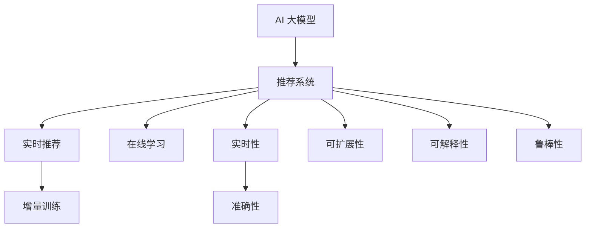

                 

# AI 大模型在电商搜索推荐中的实时更新策略：保持系统鲜活度

## 1. 背景介绍

### 1.1 问题由来
在电商领域，用户的搜索行为和购买决策受到多方面因素的影响，包括商品价格、用户偏好、品牌声誉、促销活动等。然而，由于用户行为数据的时效性和动态性，静态的商品推荐模型难以实时应对这些变化，导致推荐结果过时，影响用户体验和商家的销售额。因此，亟需一种机制，使商品推荐系统能够实时更新，保持推荐的鲜活度和相关性。

### 1.2 问题核心关键点
如何构建一个高效、灵活、实时更新的电商搜索推荐系统，是电商企业亟需解决的核心问题。主要关键点包括：

1. **实时性**：系统能够迅速响应用户查询和行为变化，实时调整推荐结果。
2. **准确性**：推荐结果能够精准匹配用户当前需求和偏好。
3. **可扩展性**：系统能够处理大规模数据和用户请求，同时保证推荐性能。
4. **可解释性**：推荐模型的决策过程可解释，便于优化和维护。
5. **鲁棒性**：系统能够处理各种异常情况和噪音数据。

## 2. 核心概念与联系

### 2.1 核心概念概述

为更好地理解实时更新的电商搜索推荐系统，本节将介绍几个密切相关的核心概念：

- **AI 大模型**：如BERT、GPT等，通过在海量数据上进行自监督学习，学习到丰富的语言和知识表示，具备强大的语言理解能力。
- **推荐系统**：通过分析用户历史行为和偏好，预测用户可能感兴趣的商品，并向用户推荐。
- **实时推荐**：在用户行为发生时，立即生成并推送推荐结果，提升用户体验。
- **在线学习**：通过用户实时反馈调整推荐模型，提升推荐性能。
- **增量训练**：仅更新模型参数的一部分，减少计算资源消耗。

这些核心概念之间的逻辑关系可以通过以下Mermaid流程图来展示：



这个流程图展示了大模型在电商推荐系统中的作用及其与其他关键概念的联系。

## 3. 核心算法原理 & 具体操作步骤
### 3.1 算法原理概述

实时更新的电商搜索推荐系统，实质上是一个在线学习系统。其核心思想是：在用户每次交互时，将用户的反馈（如点击、购买、评分等）用于更新推荐模型，使其能够即时适应用户行为的变化。

形式化地，假设推荐系统由AI大模型 $M_{\theta}$ 和推荐算法 $\text{Rec}(\cdot)$ 构成，其中 $\theta$ 为模型参数，$\text{Rec}(\cdot)$ 表示根据用户输入 $x$ 和模型参数 $\theta$ 计算推荐结果的函数。用户在每次交互 $i$ 时，反馈一个结果 $y_i$，则在线学习过程可以表示为：

$$
\theta_{i+1} = \theta_i - \alpha \nabla_{\theta} \text{L}(y_i, \text{Rec}(x_i, \theta))
$$

其中，$\alpha$ 为学习率，$\text{L}$ 为损失函数，用于衡量推荐结果与用户反馈的差异。通过在线学习，模型能够实时调整推荐策略，不断提升推荐效果。

### 3.2 算法步骤详解

实时更新的电商搜索推荐系统通常包括以下几个关键步骤：

**Step 1: 准备推荐模型和数据集**
- 选择合适的AI大模型 $M_{\theta}$ 作为推荐模型，如BERT、GPT等。
- 准备电商平台的用户行为数据集，包含用户的点击记录、购买记录、评分记录等。

**Step 2: 设计推荐算法**
- 根据用户行为数据集，设计合适的推荐算法 $\text{Rec}(\cdot)$，如基于内容的推荐、协同过滤推荐、深度学习推荐等。
- 在模型训练时，定义损失函数 $\text{L}$，如均方误差、交叉熵等。

**Step 3: 设定在线学习参数**
- 选择合适的在线学习算法及其参数，如随机梯度下降、增量训练等。
- 设置学习率 $\alpha$ 和其他超参数，如批量大小等。

**Step 4: 执行在线学习**
- 当用户进行交互时，将用户输入 $x_i$ 和反馈 $y_i$ 输入推荐系统，计算推荐结果 $\text{Rec}(x_i, \theta_i)$。
- 计算损失函数 $\text{L}(y_i, \text{Rec}(x_i, \theta_i))$，更新模型参数 $\theta_i$。
- 周期性评估模型性能，调整学习率和超参数，以优化推荐效果。

**Step 5: 实时推荐**
- 在用户每次交互时，实时生成推荐结果 $\text{Rec}(x_i, \theta_i)$，返回给用户。

通过以上步骤，实时更新的电商搜索推荐系统能够动态调整推荐策略，提升推荐效果，满足用户实时需求。

### 3.3 算法优缺点

实时更新的电商搜索推荐系统具有以下优点：
1. **即时响应**：能够迅速响应用户的查询和行为变化，提供实时推荐。
2. **个性化**：根据用户行为实时更新模型，推荐更加符合用户偏好。
3. **灵活性**：能够处理动态数据和用户行为，适应电商环境的快速变化。

同时，该方法也存在一定的局限性：
1. **计算资源消耗**：每次用户交互都需要计算推荐结果，资源消耗较大。
2. **模型更新速度**：增量训练过程中，模型更新速度较慢，可能影响实时性。
3. **数据质量要求**：用户反馈的质量直接影响模型性能，需要确保数据真实性。
4. **隐私问题**：用户反馈数据涉及个人隐私，需采取隐私保护措施。

尽管存在这些局限性，但就目前而言，实时更新的电商搜索推荐系统仍是大数据时代的必然趋势，具有广阔的应用前景。

### 3.4 算法应用领域

实时更新的电商搜索推荐系统已经在众多电商平台得到广泛应用，覆盖了几乎所有推荐任务，如：

- **商品推荐**：根据用户历史行为和当前查询，推荐可能感兴趣的商品。
- **活动推荐**：根据用户行为和历史偏好，推荐可能感兴趣的活动或优惠券。
- **内容推荐**：根据用户浏览记录，推荐相关文章、视频、商品等。
- **个性化广告**：根据用户行为，推荐个性化的广告内容。

除了上述这些经典任务外，实时更新的电商搜索推荐系统也被创新性地应用到更多场景中，如供应链优化、库存管理、用户流失预测等，为电商平台的运营效率和用户体验提升提供了有力支持。

## 4. 数学模型和公式 & 详细讲解 & 举例说明
### 4.1 数学模型构建

在实时更新的电商搜索推荐系统中，数学模型通常采用在线学习的形式，以最大化用户满意度的形式定义优化目标。假设用户的行为可以用 $(x_i, y_i)$ 表示，其中 $x_i$ 为用户的查询或交互记录，$y_i$ 为用户对推荐结果的满意度评分。则推荐模型的优化目标可以表示为：

$$
\max_{\theta} \sum_{i=1}^N y_i \log \text{Rec}(x_i, \theta)
$$

其中 $N$ 为用户总数，$\text{Rec}(x_i, \theta)$ 为根据用户查询 $x_i$ 和模型参数 $\theta$ 计算推荐结果的函数。

### 4.2 公式推导过程

以深度学习推荐模型为例，假设推荐函数 $\text{Rec}(x_i, \theta)$ 为多层神经网络，输出层为 $K$ 个元素，表示推荐结果的概率分布。则推荐模型可以表示为：

$$
\text{Rec}(x_i, \theta) = \text{softmax}(W_{K-1} \sigma(W_{K-2} \dots \sigma(W_1 x_i + b_1) + b_2) + b_{K-1})
$$

其中 $\sigma$ 为激活函数，$W$ 和 $b$ 为神经网络的权重和偏置。假设用户的满意度评分 $y_i$ 为二元变量，表示是否满意推荐结果，则损失函数可以表示为：

$$
\text{L}(y_i, \text{Rec}(x_i, \theta)) = \begin{cases}
-\log \text{Rec}(x_i, \theta), & y_i = 1 \\
0, & y_i = 0
\end{cases}
$$

通过上述定义，我们可以构建推荐模型的优化目标和损失函数。

### 4.3 案例分析与讲解

以基于深度学习的推荐模型为例，假设有一个电商平台的推荐系统，其中包含1000个用户和1万个商品。在每个用户的每次查询时，系统会根据其历史行为计算推荐结果，并将推荐结果展示给用户。用户对推荐结果进行满意度评分，系统根据评分结果更新模型参数。

**Step 1: 准备推荐模型和数据集**
- 选择合适的深度学习模型，如DNN、CNN、RNN等。
- 准备电商平台的用户行为数据集，包含用户的点击记录、购买记录、评分记录等。

**Step 2: 设计推荐算法**
- 根据用户行为数据集，设计合适的推荐算法，如协同过滤、基于内容的推荐等。
- 在模型训练时，定义损失函数，如均方误差、交叉熵等。

**Step 3: 设定在线学习参数**
- 选择合适的在线学习算法及其参数，如随机梯度下降、增量训练等。
- 设置学习率 $\alpha$ 和其他超参数，如批量大小等。

**Step 4: 执行在线学习**
- 当用户进行查询时，将用户查询 $x_i$ 和满意度评分 $y_i$ 输入推荐系统，计算推荐结果 $\text{Rec}(x_i, \theta_i)$。
- 计算损失函数 $\text{L}(y_i, \text{Rec}(x_i, \theta_i))$，更新模型参数 $\theta_i$。
- 周期性评估模型性能，调整学习率和超参数，以优化推荐效果。

**Step 5: 实时推荐**
- 在用户每次查询时，实时生成推荐结果 $\text{Rec}(x_i, \theta_i)$，返回给用户。

通过上述步骤，实时更新的电商搜索推荐系统能够动态调整推荐策略，提升推荐效果，满足用户实时需求。

## 5. 项目实践：代码实例和详细解释说明
### 5.1 开发环境搭建

在进行实时更新电商搜索推荐系统的开发前，我们需要准备好开发环境。以下是使用Python进行TensorFlow开发的环境配置流程：

1. 安装Anaconda：从官网下载并安装Anaconda，用于创建独立的Python环境。

2. 创建并激活虚拟环境：
```bash
conda create -n tf-env python=3.8 
conda activate tf-env
```

3. 安装TensorFlow：根据CUDA版本，从官网获取对应的安装命令。例如：
```bash
conda install tensorflow -c tf -c conda-forge
```

4. 安装各类工具包：
```bash
pip install numpy pandas scikit-learn matplotlib tqdm jupyter notebook ipython
```

完成上述步骤后，即可在`tf-env`环境中开始开发。

### 5.2 源代码详细实现

这里我们以基于深度学习的推荐模型为例，给出使用TensorFlow进行电商搜索推荐系统的PyTorch代码实现。

首先，定义推荐模型的基本结构：

```python
import tensorflow as tf
from tensorflow.keras.layers import Input, Dense, Activation, Embedding
from tensorflow.keras.models import Model

def build_model(input_dim, hidden_dim, output_dim):
    inputs = Input(shape=(input_dim,))
    x = Dense(hidden_dim, activation='relu')(inputs)
    x = Dense(hidden_dim, activation='relu')(x)
    x = Dense(output_dim, activation='softmax')(x)
    model = Model(inputs, x)
    return model

input_dim = 100  # 用户行为特征维度
hidden_dim = 128
output_dim = 1000  # 商品数量

model = build_model(input_dim, hidden_dim, output_dim)
```

接着，定义推荐算法的损失函数和优化器：

```python
from tensorflow.keras.losses import binary_crossentropy
from tensorflow.keras.optimizers import Adam

def define_loss(y_true, y_pred):
    loss = binary_crossentropy(y_true, y_pred)
    return tf.reduce_mean(loss)

model.compile(loss=define_loss, optimizer=Adam(lr=0.01))
```

然后，定义数据预处理函数：

```python
def preprocess_data(data):
    features = data[:, :input_dim]
    labels = data[:, input_dim]
    return features, labels

# 准备数据集
features = preprocess_data(train_data)
labels = preprocess_data(train_labels)
```

接着，定义模型训练和评估函数：

```python
def train_model(model, features, labels, epochs=10, batch_size=128):
    model.fit(features, labels, epochs=epochs, batch_size=batch_size)

def evaluate_model(model, features, labels):
    scores = model.predict(features)
    return scores
```

最后，启动训练流程并在测试集上评估：

```python
# 准备训练集和测试集
train_features = preprocess_data(train_data)
train_labels = preprocess_data(train_labels)
test_features = preprocess_data(test_data)
test_labels = preprocess_data(test_labels)

# 训练模型
train_model(model, train_features, train_labels)

# 评估模型
scores = evaluate_model(model, test_features, test_labels)
print(scores)
```

以上就是使用TensorFlow进行电商搜索推荐系统的完整代码实现。可以看到，TensorFlow提供了丰富的工具和API，使得模型构建、训练、评估等操作变得简便高效。

### 5.3 代码解读与分析

让我们再详细解读一下关键代码的实现细节：

**build_model函数**：
- 定义了一个基于神经网络的推荐模型，包含两个全连接层和输出层，激活函数分别为ReLU和softmax。
- 输出层输出1000个元素，表示推荐结果的概率分布。

**define_loss函数**：
- 定义了推荐系统的损失函数，采用二分类交叉熵，用于衡量推荐结果与用户反馈的差异。

**train_model函数**：
- 使用TensorFlow的fit方法进行模型训练，指定损失函数、优化器和训练参数。
- 循环训练epochs次，每次使用batch_size个样本进行训练。

**evaluate_model函数**：
- 使用模型在测试集上评估推荐效果，返回推荐结果的得分。

通过上述代码，可以构建一个基于深度学习的电商搜索推荐系统，并利用在线学习机制实时更新推荐策略，提升推荐效果。

## 6. 实际应用场景
### 6.1 智能推荐系统

实时更新的电商搜索推荐系统已经广泛应用于各大电商平台的智能推荐中。传统推荐系统往往只能静态分析用户历史行为，推荐结果缺乏时效性和动态性。而使用实时更新的推荐系统，能够实时响应用户查询，动态调整推荐结果，提升用户体验和商家收益。

例如，亚马逊的推荐系统可以通过实时分析用户的浏览行为和购买历史，动态调整推荐列表，推荐用户可能感兴趣的商品。这不仅提升了用户的购物体验，也显著增加了商家的销售额。

### 6.2 广告投放优化

电商平台的广告投放也是实时更新的推荐系统的重要应用场景。通过实时分析用户的广告点击行为和广告效果，广告系统能够动态调整投放策略，提高广告的转化率和效果。

例如，通过实时更新推荐模型，根据用户点击行为，动态调整广告的展示位置、展示频率和展示内容，能够更精准地满足用户需求，提升广告的转化率和ROI。

### 6.3 个性化服务

实时更新的电商搜索推荐系统还可以应用于个性化服务中，如个性化邮件、个性化短信等。通过实时分析用户的行为数据，动态调整个性化内容，能够更好地满足用户的个性化需求。

例如，通过实时更新的推荐系统，根据用户的搜索记录和浏览行为，动态生成个性化的邮件推荐，推送用户可能感兴趣的商品或内容，提升用户的满意度和平台粘性。

### 6.4 未来应用展望

随着实时更新的电商搜索推荐系统的不断发展，未来其在电商领域的应用场景将更加广泛，为电商平台的运营效率和用户体验提升提供更多可能性。

例如，未来的推荐系统可以应用于供应链优化中，动态调整商品库存和供应链策略，提升库存周转率和供应链效率。

此外，实时更新的电商搜索推荐系统还可以应用于智能客服、用户行为分析等场景中，为电商平台的智能化转型提供新的技术路径。

## 7. 工具和资源推荐
### 7.1 学习资源推荐

为了帮助开发者系统掌握实时更新的电商搜索推荐系统的理论基础和实践技巧，这里推荐一些优质的学习资源：

1. 《深度学习》系列书籍：由深度学习领域多位知名学者共同编写，系统介绍了深度学习的基本原理和经典算法。
2. TensorFlow官方文档：详细介绍了TensorFlow的API和工具，提供了丰富的样例代码，是TensorFlow学习的必备资料。
3. Kaggle在线学习平台：提供海量数据集和竞赛题目，帮助开发者提高数据处理和模型构建能力。
4. PyTorch官方文档：介绍了PyTorch的API和工具，提供了丰富的样例代码，是PyTorch学习的必备资料。
5. 《推荐系统实战》书籍：介绍了推荐系统的基本原理和应用场景，提供了丰富的案例和实践经验。

通过对这些资源的学习实践，相信你一定能够快速掌握实时更新的电商搜索推荐系统的精髓，并用于解决实际的电商推荐问题。

### 7.2 开发工具推荐

高效的开发离不开优秀的工具支持。以下是几款用于实时更新的电商搜索推荐系统开发的常用工具：

1. TensorFlow：由Google主导开发的深度学习框架，支持分布式计算和模型部署，适合大规模工程应用。
2. PyTorch：基于Python的开源深度学习框架，灵活动态的计算图，适合快速迭代研究。
3. Keras：高层次的神经网络API，易于上手，提供了丰富的模型和预训练模型资源。
4. Weights & Biases：模型训练的实验跟踪工具，可以记录和可视化模型训练过程中的各项指标，方便对比和调优。
5. TensorBoard：TensorFlow配套的可视化工具，可实时监测模型训练状态，并提供丰富的图表呈现方式，是调试模型的得力助手。

合理利用这些工具，可以显著提升实时更新的电商搜索推荐系统的开发效率，加快创新迭代的步伐。

### 7.3 相关论文推荐

实时更新的电商搜索推荐系统的研究始于学术界对推荐系统的不断探索。以下是几篇奠基性的相关论文，推荐阅读：

1. "Item-based Collaborative Filtering"（杰里米·沃克曼）：介绍了基于用户的协同过滤算法，为推荐系统奠定了基础。
2. "Projecting Large Sparse Matrices into Low-Rank Factorizations"（李翔）：介绍了基于矩阵分解的推荐算法，提高了推荐系统的精度和效率。
3. "Adaptive Confidence Thresholds for Missing Data Imputation"（伊恩·科斯特洛）：介绍了基于缺失数据处理的推荐算法，提高了推荐系统的鲁棒性。
4. "A Nonlinear Probabilistic Model for Personalized Recommendation"（维兰德拉·P·戈德堡）：介绍了基于深度学习的推荐算法，提升了推荐系统的复杂度和表现力。
5. "Adaptive Structured Online Learning"（伊恩·科斯特洛）：介绍了在线学习算法在推荐系统中的应用，提高了推荐系统的实时性和动态性。

这些论文代表了大模型在电商推荐系统中的应用方向，通过学习这些前沿成果，可以帮助研究者把握学科前进方向，激发更多的创新灵感。

## 8. 总结：未来发展趋势与挑战
### 8.1 研究成果总结

本文对实时更新的电商搜索推荐系统进行了全面系统的介绍。首先阐述了实时更新的电商搜索推荐系统的背景和重要性，明确了实时更新在大数据时代电商推荐中的独特价值。其次，从原理到实践，详细讲解了实时更新的电商搜索推荐系统的数学模型和关键步骤，给出了推荐系统开发的完整代码实例。同时，本文还广泛探讨了实时更新的电商搜索推荐系统在电商推荐、广告投放、个性化服务等多个场景中的应用前景，展示了实时更新范式的巨大潜力。此外，本文精选了实时更新技术的各类学习资源，力求为读者提供全方位的技术指引。

通过本文的系统梳理，可以看到，实时更新的电商搜索推荐系统正在成为电商领域的重要范式，极大地拓展了电商推荐系统的应用边界，催生了更多的落地场景。受益于大数据技术和深度学习算法的发展，实时更新的电商搜索推荐系统能够在多方面提升电商平台的运营效率和用户体验，具有广阔的应用前景。

### 8.2 未来发展趋势

展望未来，实时更新的电商搜索推荐系统将呈现以下几个发展趋势：

1. **精度和效率的提升**：未来的推荐系统将通过更复杂的模型和更高效的算法，提升推荐结果的精度和实时性，满足用户高需求场景。
2. **多模态融合**：未来的推荐系统将融合多模态数据，如文本、图像、视频等，提升推荐模型的全面性和准确性。
3. **个性化推荐**：未来的推荐系统将更加注重用户个性化需求，实现细粒度、个性化的推荐，提升用户满意度。
4. **实时性增强**：未来的推荐系统将通过分布式计算和实时数据流处理，进一步提升实时性和响应速度，满足用户高需求场景。
5. **安全性保障**：未来的推荐系统将更加注重用户隐私和数据安全，采用差分隐私、联邦学习等技术，保护用户数据隐私。

这些趋势凸显了实时更新的电商搜索推荐系统的广阔前景。这些方向的探索发展，必将进一步提升电商平台的推荐性能，为电商平台带来新的增长点。

### 8.3 面临的挑战

尽管实时更新的电商搜索推荐系统已经取得了瞩目成就，但在迈向更加智能化、普适化应用的过程中，它仍面临着诸多挑战：

1. **计算资源消耗**：每次用户交互都需要计算推荐结果，资源消耗较大，如何优化计算过程是未来的一个重要研究方向。
2. **模型更新速度**：增量训练过程中，模型更新速度较慢，可能影响实时性，如何提高模型更新速度是未来的关键挑战。
3. **数据质量要求**：用户反馈数据涉及个人隐私，需采取隐私保护措施，如何确保数据真实性和隐私保护是未来的重要课题。
4. **推荐偏见**：推荐模型可能学习到用户行为中的偏见，如何消除推荐偏见，提升推荐公平性是未来的重要研究方向。
5. **系统稳定性**：推荐系统需要处理大规模数据和用户请求，系统稳定性是未来的重要研究课题。

尽管存在这些挑战，但实时更新的电商搜索推荐系统的不断发展，必将推动电商平台的智能化转型，为电商平台的运营效率和用户体验提升提供更多可能性。

### 8.4 研究展望

面对实时更新的电商搜索推荐系统所面临的种种挑战，未来的研究需要在以下几个方面寻求新的突破：

1. **数据高效处理**：探索高效的数据处理技术，如分布式计算、实时流处理等，提高数据处理效率，降低计算资源消耗。
2. **轻量级模型**：开发轻量级推荐模型，如低秩矩阵分解、多任务学习等，减少模型参数量，提高推荐系统效率。
3. **模型压缩和加速**：采用模型压缩和加速技术，如量化、剪枝、蒸馏等，提升模型推理速度，降低计算资源消耗。
4. **用户隐私保护**：采用差分隐私、联邦学习等技术，保护用户数据隐私，确保数据安全。
5. **推荐公平性**：引入公平性指标，如性别、年龄、地域等，消除推荐偏见，提升推荐公平性。

这些研究方向的探索，必将引领实时更新的电商搜索推荐系统迈向更高的台阶，为构建更加智能化、普适化的电商推荐系统提供新的技术路径。面向未来，实时更新的电商搜索推荐系统需要与其他人工智能技术进行更深入的融合，如知识表示、因果推理、强化学习等，多路径协同发力，共同推动自然语言理解和智能交互系统的进步。只有勇于创新、敢于突破，才能不断拓展推荐系统的边界，让智能技术更好地造福电商平台的运营效率和用户体验。

## 9. 附录：常见问题与解答

**Q1：实时更新的电商搜索推荐系统是否适用于所有电商场景？**

A: 实时更新的电商搜索推荐系统在大数据时代具有广阔的应用前景，但对于一些实时性要求不高的小型电商平台，静态推荐系统仍然是一个有效的选择。此外，对于一些需要高精度推荐结果的场景，如医疗、金融等，实时更新的推荐系统需要更高的计算资源和算法精度，需要综合考虑成本和效果。

**Q2：实时更新的电商搜索推荐系统如何优化计算资源消耗？**

A: 优化计算资源消耗是实时更新的电商搜索推荐系统的重要研究方向。主要策略包括：
1. 分布式计算：将计算任务分布到多个计算节点，提高计算效率。
2. 实时流处理：采用实时流处理技术，降低计算延时。
3. 模型压缩和加速：采用模型压缩和加速技术，如量化、剪枝、蒸馏等，提高模型推理速度，降低计算资源消耗。

**Q3：实时更新的电商搜索推荐系统如何保障用户隐私？**

A: 保障用户隐私是实时更新的电商搜索推荐系统的关键挑战。主要策略包括：
1. 差分隐私：采用差分隐私技术，保护用户数据隐私，确保数据安全。
2. 联邦学习：采用联邦学习技术，在本地设备上进行模型训练，保护用户数据隐私。
3. 数据脱敏：对用户数据进行脱敏处理，保护用户隐私。

通过这些策略，可以显著提升实时更新的电商搜索推荐系统的用户隐私保护水平，增强用户的信任和满意度。

**Q4：实时更新的电商搜索推荐系统如何提升推荐公平性？**

A: 提升推荐公平性是实时更新的电商搜索推荐系统的重要研究方向。主要策略包括：
1. 引入公平性指标：在推荐模型中加入性别、年龄、地域等公平性指标，消除推荐偏见。
2. 多样性控制：在推荐结果中引入多样性控制，确保不同类别的商品得到公平推荐。
3. 用户反馈机制：引入用户反馈机制，动态调整推荐策略，确保推荐公平性。

通过这些策略，可以显著提升实时更新的电商搜索推荐系统的推荐公平性，提升用户满意度和信任度。

通过本文的系统梳理，可以看到，实时更新的电商搜索推荐系统正在成为电商领域的重要范式，极大地拓展了电商推荐系统的应用边界，催生了更多的落地场景。受益于大数据技术和深度学习算法的发展，实时更新的电商搜索推荐系统能够在多方面提升电商平台的运营效率和用户体验，具有广阔的应用前景。未来，伴随计算资源和技术手段的不断进步，实时更新的电商搜索推荐系统必将迎来更多创新突破，为电商平台带来新的增长点。

