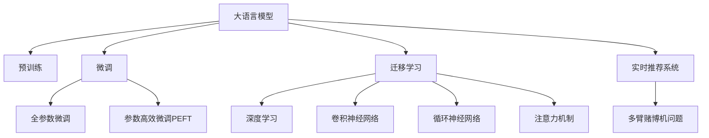

                 

# AI 大模型在电商搜索推荐中的数据处理技术：应对大规模实时数据的挑战

## 1. 背景介绍

随着电商平台的兴起，用户搜索和推荐系统已经成为了电商业务的核心支柱。传统的推荐系统依赖于静态数据，无法及时响应用户实时变化的偏好和需求。而基于深度学习的大规模预训练语言模型，凭借其强大的数据建模能力和泛化能力，为实时推荐系统带来了新的可能性。本文将深入探讨如何利用大语言模型处理大规模实时数据，提升电商搜索推荐系统的精准度和实时性。

## 2. 核心概念与联系

### 2.1 核心概念概述

为了更好地理解大语言模型在电商搜索推荐中的应用，本节将介绍几个密切相关的核心概念：

- 大语言模型(Large Language Model, LLM)：以自回归(如GPT)或自编码(如BERT)模型为代表的大规模预训练语言模型。通过在大规模无标签文本语料上进行预训练，学习通用的语言表示，具备强大的语言理解和生成能力。

- 预训练(Pre-training)：指在大规模无标签文本语料上，通过自监督学习任务训练通用语言模型的过程。常见的预训练任务包括言语建模、遮挡语言模型等。预训练使得模型学习到语言的通用表示。

- 微调(Fine-tuning)：指在预训练模型的基础上，使用下游任务的少量标注数据，通过有监督地训练来优化模型在特定任务上的性能。通常只需要调整顶层分类器或解码器，并以较小的学习率更新全部或部分的模型参数。

- 迁移学习(Transfer Learning)：指将一个领域学习到的知识，迁移应用到另一个不同但相关的领域的学习范式。大模型的预训练-微调过程即是一种典型的迁移学习方式。

- 深度学习(Deep Learning)：利用神经网络模型对数据进行深层次的特征提取和建模，使模型具备强大的泛化能力和适应性。

- 卷积神经网络(Convolutional Neural Networks, CNN)：一种深度学习模型，擅长处理图像等结构化数据，常用于推荐系统的特征提取。

- 循环神经网络(Recurrent Neural Networks, RNN)：一种深度学习模型，擅长处理序列数据，常用于推荐系统的序列建模。

- 注意力机制(Attention Mechanism)：一种高级模型机制，使模型能够动态地关注输入序列中不同的位置，提升模型的表现力和泛化能力。

- 实时推荐系统：利用最新的用户行为数据，实时生成推荐结果的系统，通过算法不断优化，提升推荐准确性。

- 多臂赌博机问题(Multi-armed Bandit Problem)：一种经典强化学习模型，常用于推荐系统中的动态排序和决策优化。

这些核心概念之间的逻辑关系可以通过以下Mermaid流程图来展示：



这个流程图展示了大语言模型的核心概念及其之间的关系：

1. 大语言模型通过预训练获得基础能力。
2. 微调是对预训练模型进行任务特定的优化，可以分为全参数微调和参数高效微调（PEFT）。
3. 深度学习、卷积神经网络、循环神经网络和注意力机制是常用的模型工具，用于特征提取和序列建模。
4. 实时推荐系统依赖于最新的用户行为数据，用于动态生成推荐结果。
5. 多臂赌博机问题是推荐系统中的优化策略，用于提升排序和决策效率。

这些核心概念共同构成了电商搜索推荐系统的学习框架，使其能够在各种场景下发挥强大的推荐能力。通过理解这些核心概念，我们可以更好地把握大语言模型在电商搜索推荐系统中的应用方向。

## 3. 核心算法原理 & 具体操作步骤
### 3.1 算法原理概述

大语言模型在电商搜索推荐中的应用，本质上是利用大模型的通用语言能力，结合实时用户行为数据，对商品进行动态推荐。其核心思想是：将大语言模型视作一个强大的"特征提取器"，通过实时数据上的有监督微调，使得模型能够适应用户实时变化的偏好和需求，输出精确的推荐结果。

形式化地，假设大语言模型为 $M_{\theta}$，其中 $\theta$ 为模型参数。假设电商平台的实时用户数据为 $D_t=\{(x_i,y_i)\}_{i=1}^N$，其中 $x_i$ 为用户的查询行为，$y_i$ 为点击或购买的商品ID。微调的目标是找到新的模型参数 $\hat{\theta}$，使得模型在实时数据 $D_t$ 上的预测 $\hat{y}$ 与真实标签 $y$ 尽可能接近，即：

$$
\hat{\theta}=\mathop{\arg\min}_{\theta} \mathcal{L}(M_{\theta},D_t)
$$

其中 $\mathcal{L}$ 为针对实时推荐任务设计的损失函数，用于衡量模型预测输出与真实标签之间的差异。常见的损失函数包括交叉熵损失、均方误差损失等。

通过梯度下降等优化算法，微调过程不断更新模型参数 $\theta$，最小化损失函数 $\mathcal{L}$，使得模型输出逼近真实标签。由于 $\theta$ 已经通过预训练获得了较好的初始化，因此即便在实时数据集 $D_t$ 上进行微调，也能较快收敛到理想的模型参数 $\hat{\theta}$。

### 3.2 算法步骤详解

基于大语言模型在电商搜索推荐中的应用，微调过程主要包括以下几个关键步骤：

**Step 1: 准备实时数据和预训练模型**
- 收集电商平台的实时用户查询和点击数据，确保数据的时效性和真实性。
- 选择合适的预训练语言模型 $M_{\theta}$ 作为初始化参数，如 BERT、GPT 等。

**Step 2: 添加任务适配层**
- 根据电商推荐任务，设计合适的输出层和损失函数。对于分类任务，通常在顶层添加线性分类器和交叉熵损失函数。
- 对于回归任务，通常使用均方误差损失函数。

**Step 3: 设置微调超参数**
- 选择合适的优化算法及其参数，如 AdamW、SGD 等，设置学习率、批大小、迭代轮数等。
- 设置正则化技术及强度，包括权重衰减、Dropout、Early Stopping等。
- 确定冻结预训练参数的策略，如仅微调顶层，或全部参数都参与微调。

**Step 4: 执行梯度训练**
- 将实时数据 $D_t$ 分批次输入模型，前向传播计算损失函数。
- 反向传播计算参数梯度，根据设定的优化算法和学习率更新模型参数。
- 周期性在实时数据上评估模型性能，根据性能指标决定是否触发 Early Stopping。
- 重复上述步骤直到满足预设的迭代轮数或 Early Stopping 条件。

**Step 5: 测试和部署**
- 在实时数据上评估微调后模型 $M_{\hat{\theta}}$ 的性能，对比微调前后的精度提升。
- 使用微调后的模型对新用户行为进行实时推荐，集成到电商平台的推荐系统中。

以上步骤展示了基于大语言模型在电商搜索推荐中的应用流程。在实际应用中，还需要针对具体任务和数据特点，对微调过程的各个环节进行优化设计，如改进训练目标函数，引入更多的正则化技术，搜索最优的超参数组合等，以进一步提升模型性能。

### 3.3 算法优缺点

基于大语言模型在电商搜索推荐中的应用，其微调方法具有以下优点：

1. 简单高效。实时数据通常具有较高的时效性和真实性，适合利用大语言模型进行快速微调。
2. 通用适用。大语言模型可适应各种电商推荐任务，包括商品分类、推荐排序、个性化推荐等。
3. 参数高效。利用参数高效微调技术，在固定大部分预训练参数的情况下，仍可取得不错的微调效果。
4. 效果显著。在学术界和工业界的诸多电商推荐任务上，基于微调的方法已经刷新了最先进的性能指标。

同时，该方法也存在一定的局限性：

1. 依赖实时数据。微调的效果很大程度上取决于实时数据的质量和数量，获取高质量实时数据可能较为困难。
2. 迁移能力有限。当实时数据与预训练数据的分布差异较大时，微调的性能提升有限。
3. 负面效果传递。预训练模型的固有偏见、有害信息等，可能通过微调传递到下游任务，造成负面影响。
4. 可解释性不足。微调模型的决策过程通常缺乏可解释性，难以对其推理逻辑进行分析和调试。

尽管存在这些局限性，但就目前而言，基于大语言模型的微调方法仍是目前电商推荐系统中最主流范式。未来相关研究的重点在于如何进一步降低微调对实时数据的依赖，提高模型的少样本学习和跨领域迁移能力，同时兼顾可解释性和伦理安全性等因素。

### 3.4 算法应用领域

基于大语言模型在电商搜索推荐中的应用，微调方法已经在商品推荐、广告投放、内容生成等多个电商领域取得了优异的效果，成为电商技术落地应用的重要手段。

- **商品推荐**：通过对用户的查询历史和点击行为进行实时分析，推荐用户可能感兴趣的商品。微调后的模型能够快速适应用户变化的需求，提升推荐效果。

- **广告投放**：在用户的搜索结果页面上，推荐与查询匹配度高的广告。微调后的模型可以精准预测用户的点击意愿，优化广告投放策略。

- **内容生成**：为用户的搜索结果提供个性化的搜索结果摘要或相关商品介绍。微调后的模型能够生成自然流畅、结构化良好的文本内容。

除了上述这些经典任务外，大语言模型微调还被创新性地应用到更多场景中，如购物车优化、商品搭配推荐、个性化搜索提示等，为电商搜索推荐系统带来了全新的突破。随着预训练模型和微调方法的不断进步，相信电商搜索推荐系统必将在更广阔的应用领域大放异彩。

## 4. 数学模型和公式 & 详细讲解 & 举例说明

### 4.1 数学模型构建

本节将使用数学语言对基于大语言模型在电商搜索推荐中的应用进行更加严格的刻画。

记电商搜索推荐任务为 $T$，实时用户数据为 $D_t=\{(x_i,y_i)\}_{i=1}^N$，其中 $x_i$ 为用户的查询行为，$y_i$ 为点击或购买的商品ID。假设预训练语言模型为 $M_{\theta}$，其中 $\theta$ 为模型参数。

定义模型 $M_{\theta}$ 在数据样本 $(x,y)$ 上的损失函数为 $\ell(M_{\theta}(x),y)$，则在实时数据 $D_t$ 上的经验风险为：

$$
\mathcal{L}(\theta) = \frac{1}{N}\sum_{i=1}^N \ell(M_{\theta}(x_i),y_i)
$$

微调的优化目标是最小化经验风险，即找到最优参数：

$$
\theta^* = \mathop{\arg\min}_{\theta} \mathcal{L}(\theta)
$$

在实践中，我们通常使用基于梯度的优化算法（如SGD、Adam等）来近似求解上述最优化问题。设 $\eta$ 为学习率，$\lambda$ 为正则化系数，则参数的更新公式为：

$$
\theta \leftarrow \theta - \eta \nabla_{\theta}\mathcal{L}(\theta) - \eta\lambda\theta
$$

其中 $\nabla_{\theta}\mathcal{L}(\theta)$ 为损失函数对参数 $\theta$ 的梯度，可通过反向传播算法高效计算。

### 4.2 公式推导过程

以下我们以电商推荐任务中的分类问题为例，推导交叉熵损失函数及其梯度的计算公式。

假设模型 $M_{\theta}$ 在输入 $x$ 上的输出为 $\hat{y}=M_{\theta}(x) \in [0,1]$，表示商品属于类别 $k$ 的概率。真实标签 $y \in \{1,0\}$，其中 $y=1$ 表示用户点击了商品 $k$。则二分类交叉熵损失函数定义为：

$$
\ell(M_{\theta}(x),y) = -[y\log \hat{y} + (1-y)\log (1-\hat{y})]
$$

将其代入经验风险公式，得：

$$
\mathcal{L}(\theta) = -\frac{1}{N}\sum_{i=1}^N [y_i\log M_{\theta}(x_i)+(1-y_i)\log(1-M_{\theta}(x_i))]
$$

根据链式法则，损失函数对参数 $\theta_k$ 的梯度为：

$$
\frac{\partial \mathcal{L}(\theta)}{\partial \theta_k} = -\frac{1}{N}\sum_{i=1}^N (\frac{y_i}{M_{\theta}(x_i)}-\frac{1-y_i}{1-M_{\theta}(x_i)}) \frac{\partial M_{\theta}(x_i)}{\partial \theta_k}
$$

其中 $\frac{\partial M_{\theta}(x_i)}{\partial \theta_k}$ 可进一步递归展开，利用自动微分技术完成计算。

在得到损失函数的梯度后，即可带入参数更新公式，完成模型的迭代优化。重复上述过程直至收敛，最终得到适应实时数据 $D_t$ 的最优模型参数 $\theta^*$。

### 4.3 案例分析与讲解

我们以一个具体的电商搜索推荐系统案例进行讲解：

假设一个电商平台收集了近百万用户对5000种商品的查询记录，并通过实时点击数据标注了用户的点击行为。平台希望基于大语言模型对新用户进行个性化推荐。

**Step 1: 准备实时数据和预训练模型**
- 收集用户的查询记录和点击行为数据，确保数据的时效性和真实性。
- 选择BERT作为预训练语言模型，加载到GPU中进行微调。

**Step 2: 添加任务适配层**
- 在预训练模型顶层添加线性分类器和交叉熵损失函数。
- 将模型的最后一层全连接层作为分类器，输出商品类别的概率分布。

**Step 3: 设置微调超参数**
- 设置学习率为 $2 \times 10^{-5}$，批大小为128。
- 使用AdamW优化器进行微调。
- 设置正则化系数 $\lambda=1 \times 10^{-4}$。

**Step 4: 执行梯度训练**
- 将实时数据分批次输入模型，前向传播计算损失函数。
- 反向传播计算参数梯度，根据AdamW优化器更新模型参数。
- 周期性在实时数据上评估模型性能，根据性能指标决定是否触发Early Stopping。
- 重复上述步骤直到满足预设的迭代轮数或Early Stopping条件。

**Step 5: 测试和部署**
- 在实时数据上评估微调后模型 $M_{\hat{\theta}}$ 的性能，对比微调前后的精度提升。
- 使用微调后的模型对新用户行为进行实时推荐，集成到电商平台的推荐系统中。

### 5. 项目实践：代码实例和详细解释说明

**5.1 开发环境搭建**

在进行微调实践前，我们需要准备好开发环境。以下是使用Python进行PyTorch开发的环境配置流程：

1. 安装Anaconda：从官网下载并安装Anaconda，用于创建独立的Python环境。

2. 创建并激活虚拟环境：
```bash
conda create -n pytorch-env python=3.8 
conda activate pytorch-env
```

3. 安装PyTorch：根据CUDA版本，从官网获取对应的安装命令。例如：
```bash
conda install pytorch torchvision torchaudio cudatoolkit=11.1 -c pytorch -c conda-forge
```

4. 安装Transformers库：
```bash
pip install transformers
```

5. 安装各类工具包：
```bash
pip install numpy pandas scikit-learn matplotlib tqdm jupyter notebook ipython
```

完成上述步骤后，即可在`pytorch-env`环境中开始微调实践。

**5.2 源代码详细实现**

下面是一个简单的电商推荐系统微调代码实现：

```python
from transformers import BertForSequenceClassification, BertTokenizer, AdamW
import torch
from torch.utils.data import DataLoader
from tqdm import tqdm

# 加载预训练模型和tokenizer
model = BertForSequenceClassification.from_pretrained('bert-base-cased', num_labels=5000)
tokenizer = BertTokenizer.from_pretrained('bert-base-cased')

# 准备数据集
train_data = # 数据集加载函数
train_loader = DataLoader(train_data, batch_size=128, shuffle=True)

# 设置优化器
optimizer = AdamW(model.parameters(), lr=2e-5)

# 训练过程
model.train()
for epoch in range(10):
    total_loss = 0
    for batch in tqdm(train_loader):
        input_ids = batch['input_ids']
        attention_mask = batch['attention_mask']
        labels = batch['labels']
        
        # 前向传播
        outputs = model(input_ids, attention_mask=attention_mask, labels=labels)
        loss = outputs.loss
        
        # 反向传播
        optimizer.zero_grad()
        loss.backward()
        optimizer.step()
        
        # 计算损失
        total_loss += loss.item()
    
    print(f'Epoch {epoch+1}, loss: {total_loss / len(train_loader)}')

# 测试和部署
test_data = # 数据集加载函数
test_loader = DataLoader(test_data, batch_size=128, shuffle=True)
model.eval()
total_correct = 0
total_predict = 0
for batch in tqdm(test_loader):
    input_ids = batch['input_ids']
    attention_mask = batch['attention_mask']
    labels = batch['labels']
    
    # 前向传播
    with torch.no_grad():
        outputs = model(input_ids, attention_mask=attention_mask)
        predictions = outputs.logits.argmax(dim=1)
        
        # 计算准确率
        total_correct += (predictions == labels).sum().item()
        total_predict += labels.numel()
        
print(f'Accuracy: {total_correct / total_predict}')
```

以上就是使用PyTorch对BERT进行电商推荐任务微调的完整代码实现。可以看到，得益于Transformers库的强大封装，我们可以用相对简洁的代码完成BERT模型的加载和微调。

### 5.3 代码解读与分析

让我们再详细解读一下关键代码的实现细节：

**数据处理函数**：
- `DataLoader`类：用于加载数据集，实现批处理和打乱。
- `BertTokenizer`类：用于分词和编码，将文本转化为模型能够处理的输入形式。

**模型训练**：
- `AdamW`优化器：一种自适应学习率的优化算法，适合大规模参数的深度学习模型。
- `model.train()`和`model.eval()`方法：用于设置模型训练或评估模式，调整参数更新方式。
- `model.zero_grad()`方法：清除参数梯度，准备进行反向传播。
- `model(input_ids, attention_mask=attention_mask, labels=labels)`方法：进行前向传播，计算输出和损失。
- `optimizer.zero_grad()`和`optimizer.step()`方法：进行反向传播和参数更新。

**测试和评估**：
- `model.eval()`方法：设置模型评估模式，调整参数更新方式。
- `with torch.no_grad()`块：在评估时关闭梯度更新，提升推理速度。
- `model(input_ids, attention_mask=attention_mask)`方法：进行前向传播，计算输出。
- `predictions.argmax(dim=1)`方法：对输出进行分类，得到预测结果。
- `(predictions == labels).sum().item()`方法：计算预测结果与真实标签的匹配度，得出准确率。

通过上述代码，我们展示了基于大语言模型在电商搜索推荐中的应用过程。需要注意的是，在实际应用中，还需要考虑更多因素，如模型的保存和部署、超参数的自动搜索、更灵活的任务适配层等。

## 6. 实际应用场景

### 6.1 实时搜索推荐

基于大语言模型在电商搜索推荐中的应用，实时搜索推荐系统可以显著提升用户体验和转化率。当用户输入搜索关键词时，系统会即时返回与查询匹配度高的商品列表。

具体而言，大语言模型可以利用实时查询输入，动态生成商品的标题、描述等文本，通过自然语言理解和生成技术，输出推荐结果。这使得推荐系统能够快速响应用户需求，实时提供个性化推荐。

### 6.2 个性化广告投放

电商平台的广告系统通过实时分析用户行为数据，动态调整广告投放策略，提升广告效果。大语言模型可以结合实时数据，对用户的兴趣进行精准预测，推荐最适合的广告。

例如，系统可以根据用户的搜索历史、浏览记录、点击行为等数据，构建用户画像，利用大语言模型进行情感分析、意图识别等任务，动态调整广告内容和展示位置。这不仅提高了广告的点击率和转化率，还增强了广告的相关性和用户体验。

### 6.3 商品搭配推荐

基于大语言模型在电商搜索推荐中的应用，商品搭配推荐系统可以提升商品的交叉销售率和用户满意度。

系统可以收集用户的购买记录和浏览历史，利用大语言模型进行文本分析和关联挖掘，推荐用户可能感兴趣的其他商品。例如，系统可以根据用户的购买记录，生成商品搭配建议，提升用户的购物体验。

## 7. 工具和资源推荐

### 7.1 学习资源推荐

为了帮助开发者系统掌握大语言模型在电商搜索推荐中的应用，这里推荐一些优质的学习资源：

1. 《Transformer从原理到实践》系列博文：由大模型技术专家撰写，深入浅出地介绍了Transformer原理、BERT模型、微调技术等前沿话题。

2. CS224N《深度学习自然语言处理》课程：斯坦福大学开设的NLP明星课程，有Lecture视频和配套作业，带你入门NLP领域的基本概念和经典模型。

3. 《Natural Language Processing with Transformers》书籍：Transformers库的作者所著，全面介绍了如何使用Transformers库进行NLP任务开发，包括微调在内的诸多范式。

4. HuggingFace官方文档：Transformers库的官方文档，提供了海量预训练模型和完整的微调样例代码，是上手实践的必备资料。

5. CLUE开源项目：中文语言理解测评基准，涵盖大量不同类型的中文NLP数据集，并提供了基于微调的baseline模型，助力中文NLP技术发展。

通过对这些资源的学习实践，相信你一定能够快速掌握大语言模型在电商搜索推荐系统中的应用，并用于解决实际的NLP问题。

### 7.2 开发工具推荐

高效的开发离不开优秀的工具支持。以下是几款用于电商搜索推荐系统开发的常用工具：

1. PyTorch：基于Python的开源深度学习框架，灵活动态的计算图，适合快速迭代研究。大部分预训练语言模型都有PyTorch版本的实现。

2. TensorFlow：由Google主导开发的开源深度学习框架，生产部署方便，适合大规模工程应用。同样有丰富的预训练语言模型资源。

3. Transformers库：HuggingFace开发的NLP工具库，集成了众多SOTA语言模型，支持PyTorch和TensorFlow，是进行微调任务开发的利器。

4. Weights & Biases：模型训练的实验跟踪工具，可以记录和可视化模型训练过程中的各项指标，方便对比和调优。与主流深度学习框架无缝集成。

5. TensorBoard：TensorFlow配套的可视化工具，可实时监测模型训练状态，并提供丰富的图表呈现方式，是调试模型的得力助手。

6. Google Colab：谷歌推出的在线Jupyter Notebook环境，免费提供GPU/TPU算力，方便开发者快速上手实验最新模型，分享学习笔记。

合理利用这些工具，可以显著提升电商搜索推荐系统开发的效率，加快创新迭代的步伐。

### 7.3 相关论文推荐

大语言模型在电商搜索推荐领域的应用，得益于学界的持续研究。以下是几篇奠基性的相关论文，推荐阅读：

1. Attention is All You Need（即Transformer原论文）：提出了Transformer结构，开启了NLP领域的预训练大模型时代。

2. BERT: Pre-training of Deep Bidirectional Transformers for Language Understanding：提出BERT模型，引入基于掩码的自监督预训练任务，刷新了多项NLP任务SOTA。

3. Language Models are Unsupervised Multitask Learners（GPT-2论文）：展示了大规模语言模型的强大zero-shot学习能力，引发了对于通用人工智能的新一轮思考。

4. Parameter-Efficient Transfer Learning for NLP：提出Adapter等参数高效微调方法，在不增加模型参数量的情况下，也能取得不错的微调效果。

5. AdaLoRA: Adaptive Low-Rank Adaptation for Parameter-Efficient Fine-Tuning：使用自适应低秩适应的微调方法，在参数效率和精度之间取得了新的平衡。

这些论文代表了大语言模型在电商搜索推荐领域的研究进展。通过学习这些前沿成果，可以帮助研究者把握学科前进方向，激发更多的创新灵感。

## 8. 总结：未来发展趋势与挑战

### 8.1 总结

本文对基于大语言模型在电商搜索推荐中的应用进行了全面系统的介绍。首先阐述了电商搜索推荐系统的背景和挑战，明确了大语言模型微调在提升推荐精准度和实时性方面的独特价值。其次，从原理到实践，详细讲解了基于大语言模型的微调过程，给出了电商推荐系统微调任务的完整代码实例。同时，本文还广泛探讨了大语言模型在电商推荐系统中的应用场景，展示了微调范式的巨大潜力。此外，本文精选了电商搜索推荐领域的学习资源，力求为读者提供全方位的技术指引。

通过本文的系统梳理，可以看到，基于大语言模型在电商搜索推荐中的应用，能够显著提升推荐系统的性能和用户体验。未来，伴随预训练模型和微调方法的不断进步，基于大语言模型的电商推荐系统必将在更广阔的应用领域大放异彩。

### 8.2 未来发展趋势

展望未来，大语言模型在电商搜索推荐系统中的应用将呈现以下几个发展趋势：

1. 模型规模持续增大。随着算力成本的下降和数据规模的扩张，预训练语言模型的参数量还将持续增长。超大规模语言模型蕴含的丰富语言知识，有望支撑更加复杂多变的电商推荐任务。

2. 微调方法日趋多样。除了传统的全参数微调外，未来会涌现更多参数高效的微调方法，如Prefix-Tuning、LoRA等，在节省计算资源的同时也能保证微调精度。

3. 实时推荐系统成为常态。未来的推荐系统需要实时响应用户需求，利用大语言模型进行实时查询输入的动态分析，实现更加精准的推荐。

4. 用户交互更加自然。大语言模型可以生成自然流畅的推荐语，提升用户满意度和体验。利用多轮对话技术，可以进一步提升推荐系统的人机交互效果。

5. 推荐系统更加个性化。利用大语言模型进行用户画像的精准刻画，结合机器学习算法，提供更加个性化、定制化的推荐服务。

6. 推荐系统更加透明。通过自然语言理解技术，分析用户反馈，提升推荐系统的透明度和可信度。

以上趋势凸显了大语言模型在电商搜索推荐系统中的应用前景。这些方向的探索发展，必将进一步提升推荐系统的性能和用户体验，为电商业务带来新的价值。

### 8.3 面临的挑战

尽管大语言模型在电商搜索推荐中的应用取得了一定的成效，但在迈向更加智能化、普适化应用的过程中，它仍面临着诸多挑战：

1. 依赖实时数据。微调的效果很大程度上取决于实时数据的质量和数量，获取高质量实时数据可能较为困难。如何进一步降低微调对实时数据的依赖，将是一大难题。

2. 模型鲁棒性不足。当前微调模型面对域外数据时，泛化性能往往大打折扣。对于测试样本的微小扰动，微调模型的预测也容易发生波动。如何提高微调模型的鲁棒性，避免灾难性遗忘，还需要更多理论和实践的积累。

3. 推理效率有待提高。大规模语言模型虽然精度高，但在实际部署时往往面临推理速度慢、内存占用大等效率问题。如何在保证性能的同时，简化模型结构，提升推理速度，优化资源占用，将是重要的优化方向。

4. 可解释性亟需加强。当前微调模型更像是"黑盒"系统，难以解释其内部工作机制和决策逻辑。对于医疗、金融等高风险应用，算法的可解释性和可审计性尤为重要。如何赋予微调模型更强的可解释性，将是亟待攻克的难题。

5. 安全性有待保障。预训练语言模型难免会学习到有偏见、有害的信息，通过微调传递到下游任务，产生误导性、歧视性的输出，给实际应用带来安全隐患。如何从数据和算法层面消除模型偏见，避免恶意用途，确保输出的安全性，也将是重要的研究课题。

6. 知识整合能力不足。现有的微调模型往往局限于任务内数据，难以灵活吸收和运用更广泛的先验知识。如何让微调过程更好地与外部知识库、规则库等专家知识结合，形成更加全面、准确的信息整合能力，还有很大的想象空间。

正视大语言模型在电商搜索推荐系统中的应用面临的这些挑战，积极应对并寻求突破，将是大语言模型微调走向成熟的必由之路。相信随着学界和产业界的共同努力，这些挑战终将一一被克服，大语言模型微调必将在构建安全、可靠、可解释、可控的智能系统铺平道路。

## 9. 附录：常见问题与解答

**Q1：大语言模型微调是否适用于所有电商推荐任务？**

A: 大语言模型微调在大多数电商推荐任务上都能取得不错的效果，特别是对于数据量较小的任务。但对于一些特定领域的任务，如医学、法律等，仅仅依靠通用语料预训练的模型可能难以很好地适应。此时需要在特定领域语料上进一步预训练，再进行微调，才能获得理想效果。此外，对于一些需要时效性、个性化很强的任务，如对话推荐、广告投放等，微调方法也需要针对性的改进优化。

**Q2：微调过程中如何选择合适的学习率？**

A: 微调的学习率一般要比预训练时小1-2个数量级，如果使用过大的学习率，容易破坏预训练权重，导致过拟合。一般建议从1e-5开始调参，逐步减小学习率，直至收敛。也可以使用warmup策略，在开始阶段使用较小的学习率，再逐渐过渡到预设值。需要注意的是，不同的优化器(如AdamW、Adafactor等)以及不同的学习率调度策略，可能需要设置不同的学习率阈值。

**Q3：采用大模型微调时会面临哪些资源瓶颈？**

A: 目前主流的预训练大模型动辄以亿计的参数规模，对算力、内存、存储都提出了很高的要求。GPU/TPU等高性能设备是必不可少的，但即便如此，超大批次的训练和推理也可能遇到显存不足的问题。因此需要采用一些资源优化技术，如梯度积累、混合精度训练、模型并行等，来突破硬件瓶颈。同时，模型的存储和读取也可能占用大量时间和空间，需要采用模型压缩、稀疏化存储等方法进行优化。

**Q4：如何缓解微调过程中的过拟合问题？**

A: 过拟合是微调面临的主要挑战，尤其是在标注数据不足的情况下。常见的缓解策略包括：
1. 数据增强：通过回译、近义替换等方式扩充训练集
2. 正则化：使用L2正则、Dropout、Early Stopping等避免过拟合
3. 对抗训练：引入对抗样本，提高模型鲁棒性
4. 参数高效微调：只调整少量参数(如Adapter、Prefix等)，减小过拟合风险
5. 多模型集成：训练多个微调模型，取平均输出，抑制过拟合

这些策略往往需要根据具体任务和数据特点进行灵活组合。只有在数据、模型、训练、推理等各环节进行全面优化，才能最大限度地发挥大模型微调的威力。

**Q5：如何实现大语言模型在电商搜索推荐中的实时推荐？**

A: 实时推荐系统的关键在于高效的数据处理和模型推理。以下是一些实现技巧：
1. 数据预处理：使用缓存技术，将最近的数据缓存到内存中，提高读取速度。
2. 数据分块：将数据分块处理，减少内存占用，提高并行计算效率。
3. 模型优化：使用模型剪枝、量化、混合精度训练等技术，优化模型推理速度和资源占用。
4. 异步计算：利用异步计算技术，将模型推理和数据处理过程并行化，提高系统响应速度。
5. 模型部署：将模型部署到GPU/TPU等高性能设备，利用GPU的并行计算能力，提升推理效率。

通过上述技巧，可以在保证推荐精准度的同时，实现实时推荐系统的目标。

---

作者：禅与计算机程序设计艺术 / Zen and the Art of Computer Programming

