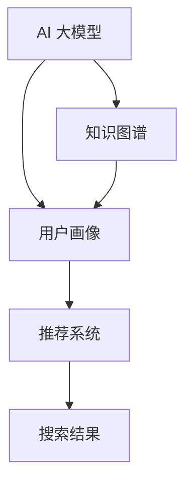

                 

# AI 大模型在电商搜索推荐中的用户画像应用：深度理解用户行为与偏好

## 1. 背景介绍

在电商行业，用户搜索和推荐系统是影响用户体验和购买转化的关键。传统的基于规则和统计的方法难以应对用户的复杂需求和不断变化的市场动态。因此，越来越多的电商公司开始探索基于深度学习的方法，利用用户的历史行为数据构建用户画像，从而实现个性化推荐和搜索匹配。AI 大模型，如BERT、GPT等，由于其强大的语言理解和生成能力，成为构建用户画像的重要工具。本文将深入探讨AI大模型在电商搜索推荐中的用户画像应用，通过深度理解用户行为与偏好，提供精准推荐和个性化搜索解决方案。

## 2. 核心概念与联系

### 2.1 核心概念概述

为深入理解AI大模型在电商搜索推荐中的应用，本节将介绍几个核心概念及其相互联系。

- **AI 大模型 (AI Large Models)**：以BERT、GPT等预训练模型为代表的深度学习模型，通过在海量文本数据上进行预训练，学习到通用的语言表示，具备强大的自然语言理解能力。
- **用户画像 (User Profile)**：基于用户历史行为数据，构建用户特征和偏好标签，形成用户画像。
- **推荐系统 (Recommender System)**：通过分析用户画像，对商品进行匹配和排序，生成个性化推荐列表。
- **搜索系统 (Search System)**：通过分析用户查询文本，匹配商品信息和用户画像，返回相关搜索结果。
- **知识图谱 (Knowledge Graph)**：用于存储商品和用户间的结构化关系，增强推荐系统的多维度关联。

这些概念通过以下Mermaid流程图展示了它们之间的联系：



该图展示了AI大模型在构建用户画像、推荐系统以及搜索结果中的作用，通过知识图谱的引入，进一步丰富了推荐系统的关联能力。

## 3. 核心算法原理 & 具体操作步骤
### 3.1 算法原理概述

基于AI大模型的电商搜索推荐系统，通常包括预训练模型、用户画像构建、推荐排序和搜索匹配等多个步骤。

- **预训练模型**：在无标注的大规模文本数据上进行预训练，学习到通用的语言表示。
- **用户画像构建**：利用预训练模型和用户历史行为数据，构建用户画像，表示用户的兴趣和偏好。
- **推荐排序**：通过匹配用户画像和商品特征，对商品进行排序，生成个性化推荐列表。
- **搜索匹配**：通过匹配用户查询和商品信息，返回相关搜索结果。

整个系统的核心在于预训练模型和用户画像的构建，这是实现个性化推荐和搜索的基础。

### 3.2 算法步骤详解

#### 3.2.1 预训练模型构建

1. **数据准备**：收集无标签的电商数据，包括商品描述、用户评论、浏览记录等。
2. **数据预处理**：清洗数据，去除噪声，标准化文本格式。
3. **模型训练**：使用预训练模型（如BERT、GPT）在准备好的数据上进行训练，学习到通用的语言表示。
4. **模型保存**：保存训练好的预训练模型，供后续微调和推理使用。

#### 3.2.2 用户画像构建

1. **数据收集**：收集用户的历史行为数据，包括浏览记录、购买记录、评分等。
2. **特征提取**：通过预训练模型对用户行为数据进行特征提取，生成用户特征向量。
3. **标签生成**：利用领域知识和用户行为数据，生成用户的兴趣标签。
4. **画像构建**：将用户特征向量和兴趣标签结合起来，形成用户画像。

#### 3.2.3 推荐排序

1. **商品特征提取**：通过预训练模型对商品信息进行特征提取，生成商品特征向量。
2. **匹配用户画像**：将用户画像和商品特征向量进行匹配，计算相似度。
3. **排序生成**：根据匹配结果，对商品进行排序，生成个性化推荐列表。

#### 3.2.4 搜索匹配

1. **查询理解**：利用预训练模型理解用户查询的语义，生成查询向量。
2. **商品检索**：将查询向量与商品特征向量进行匹配，找到相关商品。
3. **结果排序**：根据匹配结果，对商品进行排序，返回搜索结果。

### 3.3 算法优缺点

AI大模型在电商搜索推荐中的应用，具有以下优点：

- **强大的语言理解能力**：利用预训练模型的语言理解能力，可以更好地处理自然语言查询和商品描述，提升推荐和搜索的准确性。
- **灵活的特征提取**：通过预训练模型，可以灵活地提取用户和商品的特征，支持多样化的推荐和搜索任务。
- **可解释性强**：利用预训练模型的特征提取能力，可以更好地解释推荐和搜索结果的来源，增强系统的可解释性。

同时，也存在一些缺点：

- **计算资源消耗大**：预训练模型的训练和推理需要大量的计算资源，可能带来较高的成本。
- **数据隐私问题**：用户行为数据的收集和使用可能涉及到隐私保护，需要制定相应的数据保护措施。
- **冷启动问题**：对于新用户或新商品，由于缺乏足够的历史数据，推荐和搜索的效果可能较差。

### 3.4 算法应用领域

AI大模型在电商搜索推荐中的应用，主要体现在以下几个方面：

- **个性化推荐**：通过分析用户画像，对商品进行匹配和排序，生成个性化推荐列表。
- **个性化搜索**：通过分析用户查询和商品信息，返回相关搜索结果。
- **情感分析**：利用预训练模型对用户评论和评分进行情感分析，了解用户对商品的态度。
- **知识图谱构建**：通过预训练模型和领域知识，构建商品和用户间的知识图谱，增强推荐系统的多维度关联。

这些应用场景展示了AI大模型在电商行业中的广泛应用，有助于提升用户体验和提升电商平台的转化率。

## 4. 数学模型和公式 & 详细讲解
### 4.1 数学模型构建

基于AI大模型的电商搜索推荐系统，可以通过以下数学模型进行描述：

- **预训练模型**：$M_{\theta}(x)$，表示输入文本$x$通过预训练模型后的表示。
- **用户画像**：$P_u$，表示用户$u$的兴趣特征向量。
- **商品特征**：$F_i$，表示商品$i$的特征向量。
- **匹配函数**：$S(P_u, F_i)$，表示用户画像$P_u$与商品特征$F_i$的匹配度。
- **推荐排序**：$R_i = \frac{S(P_u, F_i)}{\sum_{j=1}^N S(P_u, F_j)}$，表示商品$i$在推荐列表中的排序权重。

### 4.2 公式推导过程

以推荐排序为例，假设用户$u$对商品$i$的评分$y_{ui}$和评论文本$x_{ui}$已知，利用预训练模型$M_{\theta}$对评论文本进行特征提取，生成用户画像$P_u$和商品特征$F_i$。匹配函数$S(P_u, F_i)$可以使用余弦相似度或其他相似度函数，表示为：

$$
S(P_u, F_i) = \frac{P_u^T F_i}{\|P_u\| \|F_i\|}
$$

其中$P_u^T F_i$表示用户画像和商品特征的点积，$\|P_u\|$和$\|F_i\|$分别表示用户画像和商品特征的范数。根据匹配函数，计算每个商品$i$的推荐排序权重$R_i$，最终生成推荐列表。

### 4.3 案例分析与讲解

假设某电商平台上用户$u$对商品1、2、3的评分分别为3、4、2，对应的评论文本分别为“性价比高”、“质量不错”、“价格偏高”。利用预训练模型$M_{\theta}$对评论文本进行特征提取，生成用户画像$P_u$和商品特征$F_i$。设用户画像$P_u$和商品特征$F_i$的范数分别为$\|P_u\|=1$和$\|F_i\|=1$。

1. **用户画像生成**：将用户$u$的评分和评论文本输入预训练模型$M_{\theta}$，生成用户画像$P_u$。
2. **商品特征提取**：同样将商品1、2、3的评分和评论文本输入预训练模型$M_{\theta}$，生成商品特征$F_1$、$F_2$、$F_3$。
3. **匹配函数计算**：计算用户画像$P_u$与每个商品特征$F_i$的匹配度$S(P_u, F_i)$。
4. **推荐排序生成**：将匹配度$S(P_u, F_i)$归一化，生成推荐排序权重$R_i$，对商品进行排序，生成推荐列表。

通过以上步骤，电商平台可以根据用户画像和商品特征，生成个性化推荐列表，提升用户购物体验。

## 5. 项目实践：代码实例和详细解释说明
### 5.1 开发环境搭建

在进行项目实践前，我们需要准备好开发环境。以下是使用Python进行PyTorch开发的环境配置流程：

1. 安装Anaconda：从官网下载并安装Anaconda，用于创建独立的Python环境。

2. 创建并激活虚拟环境：
```bash
conda create -n pytorch-env python=3.8 
conda activate pytorch-env
```

3. 安装PyTorch：根据CUDA版本，从官网获取对应的安装命令。例如：
```bash
conda install pytorch torchvision torchaudio cudatoolkit=11.1 -c pytorch -c conda-forge
```

4. 安装Transformers库：
```bash
pip install transformers
```

5. 安装各类工具包：
```bash
pip install numpy pandas scikit-learn matplotlib tqdm jupyter notebook ipython
```

完成上述步骤后，即可在`pytorch-env`环境中开始项目实践。

### 5.2 源代码详细实现

下面以用户画像构建和推荐排序为例，给出使用Transformers库进行电商搜索推荐系统开发的PyTorch代码实现。

首先，定义用户画像和商品特征的表示方式：

```python
from transformers import BertTokenizer, BertModel

# 定义商品特征向量维度
embedding_size = 768

# 定义用户画像表示
user_profile = torch.randn(1, embedding_size)

# 定义商品特征向量
item_features = [torch.randn(1, embedding_size) for _ in range(3)]

# 加载预训练模型和分词器
model = BertModel.from_pretrained('bert-base-uncased')
tokenizer = BertTokenizer.from_pretrained('bert-base-uncased')
```

然后，构建匹配函数和推荐排序函数：

```python
def compute_similarity(user_profile, item_features):
    # 使用预训练模型进行特征提取
    user_feature = model(user_profile, return_dict=True).last_hidden_state
    item_features = [model(item_feature, return_dict=True).last_hidden_state for item_feature in item_features]
    
    # 计算匹配度
    similarities = [torch.nn.functional.cosine_similarity(user_feature, item_feature) for item_feature in item_features]
    
    return similarities

def compute_ranking(similarities):
    # 计算排序权重
    ranking = [similarity / sum(similarity) for similarity in similarities]
    
    return ranking
```

最后，进行用户画像和推荐排序的计算：

```python
# 计算匹配度
similarities = compute_similarity(user_profile, item_features)

# 计算推荐排序
ranking = compute_ranking(similarities)

# 输出推荐排序权重
print(ranking)
```

以上代码展示了使用Transformers库进行电商搜索推荐系统开发的完整流程，包括用户画像构建、商品特征提取、匹配函数计算和推荐排序。通过这些步骤，电商公司可以基于AI大模型，实现个性化推荐和搜索。

### 5.3 代码解读与分析

让我们再详细解读一下关键代码的实现细节：

- **用户画像和商品特征表示**：通过预训练模型$M_{\theta}$对用户行为数据进行特征提取，生成用户画像$P_u$和商品特征$F_i$。
- **匹配函数计算**：利用预训练模型的特征提取能力，计算用户画像$P_u$与商品特征$F_i$的匹配度$S(P_u, F_i)$。
- **推荐排序生成**：根据匹配度$S(P_u, F_i)$，生成推荐排序权重$R_i$，对商品进行排序，生成推荐列表。

可以看到，通过使用预训练模型和用户画像构建，电商公司可以充分利用用户历史行为数据，提升推荐和搜索的准确性，实现个性化推荐和搜索。

## 6. 实际应用场景
### 6.1 智能推荐系统

基于AI大模型的智能推荐系统，可以显著提升电商平台的转化率和用户体验。通过分析用户画像和商品特征，系统可以精准匹配用户需求，生成个性化推荐列表，引导用户完成购买决策。

在技术实现上，可以通过构建用户画像和商品特征向量，利用余弦相似度或其他相似度函数，计算匹配度，生成推荐排序权重，最终生成推荐列表。用户每次访问电商平台时，系统根据其当前行为动态调整推荐内容，提高推荐效果。

### 6.2 智能搜索系统

智能搜索系统通过分析用户查询和商品信息，匹配生成相关搜索结果，提升用户搜索体验。通过预训练模型和知识图谱的引入，系统可以更好地理解查询语义，匹配商品信息，返回精准的搜索结果。

在技术实现上，可以构建查询向量和商品向量，利用余弦相似度计算匹配度，根据匹配度排序搜索结果，返回相关商品。同时，系统可以结合知识图谱，增强搜索结果的多维度关联，提高搜索结果的全面性和准确性。

### 6.3 实时推荐和搜索

电商平台的推荐和搜索系统需要实时响应用户需求，快速更新推荐列表和搜索结果。基于AI大模型的推荐和搜索系统，可以通过异步推理和模型压缩技术，实现实时响应，提升用户体验。

在技术实现上，可以采用模型裁剪、量化加速等技术，降低模型推理资源消耗，提升推理速度，实现实时推荐和搜索。同时，系统可以通过增量学习和模型更新机制，快速适应用户需求变化，提供及时准确的推荐和搜索结果。

### 6.4 未来应用展望

伴随AI大模型的不断进步，基于大模型的电商推荐和搜索系统将具备更强的适应性和泛化能力，有望实现更加智能化和个性化的推荐和搜索。

在未来的电商推荐和搜索中，AI大模型将进一步结合多模态信息，如图像、语音等，实现更加全面和精准的推荐和搜索。同时，系统将通过持续学习和增量更新，实时响应用户需求变化，提升用户体验和电商平台的转化率。

## 7. 工具和资源推荐
### 7.1 学习资源推荐

为了帮助开发者系统掌握AI大模型在电商推荐和搜索中的应用，这里推荐一些优质的学习资源：

1. **《深度学习入门：基于Python的理论与实现》**：介绍深度学习的基础理论和Python实现，适合初学者入门。
2. **《自然语言处理综论》**：讲解自然语言处理的基本概念和算法，适合进阶学习。
3. **《推荐系统：算法与实现》**：介绍推荐系统的主要算法和实现方法，适合实际应用开发。
4. **《机器学习实战》**：通过实际案例，讲解机器学习的应用，适合实践操作。

这些资源将帮助开发者全面了解AI大模型在电商推荐和搜索中的理论基础和实践技巧，快速上手电商推荐和搜索系统的开发。

### 7.2 开发工具推荐

高效的开发离不开优秀的工具支持。以下是几款用于AI大模型电商推荐和搜索系统开发的常用工具：

1. **PyTorch**：基于Python的开源深度学习框架，灵活方便，适合快速迭代研究。
2. **TensorFlow**：由Google主导开发的开源深度学习框架，生产部署方便，适合大规模工程应用。
3. **Transformers库**：HuggingFace开发的NLP工具库，集成了SOTA语言模型，支持多种深度学习框架。
4. **Google Colab**：谷歌推出的在线Jupyter Notebook环境，免费提供GPU/TPU算力，方便开发者快速实验。
5. **Weights & Biases**：模型训练的实验跟踪工具，记录和可视化模型训练指标，方便对比和调优。
6. **TensorBoard**：TensorFlow配套的可视化工具，实时监测模型训练状态，提供丰富的图表呈现方式。

合理利用这些工具，可以显著提升AI大模型在电商推荐和搜索系统开发中的效率，加速创新迭代的步伐。

### 7.3 相关论文推荐

AI大模型在电商推荐和搜索中的应用，得益于学术界的持续研究。以下是几篇奠基性的相关论文，推荐阅读：

1. **《Transformer模型及其应用》**：介绍Transformer模型的原理和应用，适合理解大模型的基础。
2. **《BERT: 预训练表示的语言模型》**：提出BERT模型，利用掩码自监督任务，提升语言表示的质量。
3. **《GPT: 基于深度学习的语言模型》**：介绍GPT模型的原理和应用，适合了解大模型的最新进展。
4. **《推荐系统: 原理与方法》**：介绍推荐系统的基本原理和算法，适合理论学习。
5. **《智能搜索: 理论与实现》**：介绍智能搜索系统的构建方法，适合实际应用。

这些论文代表了大模型在电商推荐和搜索中的应用研究，为实际开发提供了丰富的理论和实践参考。

## 8. 总结：未来发展趋势与挑战
### 8.1 研究成果总结

本文深入探讨了AI大模型在电商搜索推荐中的应用，通过构建用户画像和推荐系统，提升电商平台的转化率和用户体验。具体内容包括：

- **预训练模型的选择**：介绍Bert、GPT等主流预训练模型，并分析其优势和劣势。
- **用户画像的构建**：通过预训练模型和用户行为数据，构建用户画像，表示用户的兴趣和偏好。
- **推荐排序的计算**：利用匹配函数和排序算法，生成个性化推荐列表。
- **搜索匹配的实现**：通过预训练模型和知识图谱，匹配用户查询和商品信息，返回相关搜索结果。

通过这些步骤，电商公司可以基于AI大模型，实现个性化推荐和搜索，提升用户体验和平台转化率。

### 8.2 未来发展趋势

展望未来，AI大模型在电商搜索推荐中的应用将呈现以下几个发展趋势：

1. **多模态信息的融合**：未来的推荐和搜索系统将结合图像、语音等多模态信息，实现更加全面和精准的推荐和搜索。
2. **自监督学习的引入**：通过自监督学习，在缺乏标注数据的情况下，依然能够构建高质量的用户画像和商品特征。
3. **实时推荐和搜索**：通过异步推理和模型压缩技术，实现实时推荐和搜索，提升用户体验。
4. **持续学习和增量更新**：通过持续学习和增量更新，快速适应用户需求变化，提供及时准确的推荐和搜索结果。
5. **用户隐私保护**：在数据收集和处理过程中，注重用户隐私保护，采用匿名化处理和数据加密等技术，保障用户数据安全。

### 8.3 面临的挑战

尽管AI大模型在电商搜索推荐中的应用取得了一定进展，但仍面临诸多挑战：

1. **计算资源消耗大**：预训练模型的训练和推理需要大量的计算资源，可能带来较高的成本。
2. **数据隐私问题**：用户行为数据的收集和使用可能涉及到隐私保护，需要制定相应的数据保护措施。
3. **冷启动问题**：对于新用户或新商品，由于缺乏足够的历史数据，推荐和搜索的效果可能较差。
4. **模型鲁棒性不足**：在处理异常数据时，推荐和搜索系统的鲁棒性可能不足，需要进一步优化。
5. **解释性不足**：AI大模型的决策过程缺乏可解释性，难以对其推理逻辑进行分析和调试。

### 8.4 研究展望

未来的研究需要关注以下几个方面，以进一步提升AI大模型在电商推荐和搜索中的应用效果：

1. **多模态融合技术**：研究如何更好地融合多模态信息，提升推荐和搜索系统的全面性和准确性。
2. **自监督学习算法**：探索无需标注数据的情况下，如何通过自监督学习构建高质量的用户画像和商品特征。
3. **实时推荐和搜索机制**：研究如何通过异步推理和模型压缩技术，实现实时推荐和搜索，提升用户体验。
4. **持续学习算法**：研究如何通过持续学习和增量更新，快速适应用户需求变化，提供及时准确的推荐和搜索结果。
5. **隐私保护技术**：研究如何在数据收集和处理过程中，注重用户隐私保护，采用匿名化处理和数据加密等技术，保障用户数据安全。
6. **模型解释性技术**：研究如何提升AI大模型的可解释性，便于用户理解和调试推荐和搜索系统。

通过这些研究方向的探索，AI大模型在电商推荐和搜索中的应用将更加智能化和个性化，提升电商平台的转化率和用户体验。

## 9. 附录：常见问题与解答

**Q1：AI大模型在电商推荐和搜索中的优势是什么？**

A: AI大模型在电商推荐和搜索中的优势主要体现在以下几个方面：
1. **强大的语言理解能力**：通过预训练模型，可以更好地处理自然语言查询和商品描述，提升推荐和搜索的准确性。
2. **灵活的特征提取**：通过预训练模型，可以灵活地提取用户和商品的特征，支持多样化的推荐和搜索任务。
3. **可解释性强**：利用预训练模型的特征提取能力，可以更好地解释推荐和搜索结果的来源，增强系统的可解释性。

**Q2：如何处理冷启动问题？**

A: 冷启动问题是指新用户或新商品由于缺乏足够的历史数据，推荐和搜索的效果较差。以下是一些处理冷启动问题的方法：
1. **生成式推荐**：利用生成模型（如GPT），生成与用户兴趣相关的商品推荐。
2. **协同过滤**：利用用户之间的相似性，对新用户进行推荐。
3. **基线推荐**：利用商品的基本属性（如价格、品牌等）进行推荐。
4. **多维度融合**：结合多种推荐算法（如内容推荐、协同过滤等），综合生成推荐列表。

**Q3：如何处理异常数据？**

A: 异常数据是指与正常数据偏离的数据，如虚假评论、异常评分等。处理异常数据的方法包括：
1. **数据清洗**：通过数据清洗技术（如去噪、填补缺失值等），去除异常数据。
2. **异常检测**：利用异常检测算法（如孤立森林、聚类分析等），识别和过滤异常数据。
3. **权重调整**：根据异常数据的特征，调整其对推荐结果的影响权重。

**Q4：如何提升模型解释性？**

A: 提升模型解释性的方法包括：
1. **可解释性模型**：选择具有可解释性的模型（如规则模型、决策树等），便于用户理解和调试推荐和搜索系统。
2. **特征可视化**：利用特征可视化工具（如t-SNE、PCA等），展示用户画像和商品特征的分布情况，帮助用户理解模型决策过程。
3. **解释性评估**：设计可解释性评估指标（如SHAP值、LIME等），评估模型的可解释性和鲁棒性。

---

作者：禅与计算机程序设计艺术 / Zen and the Art of Computer Programming

