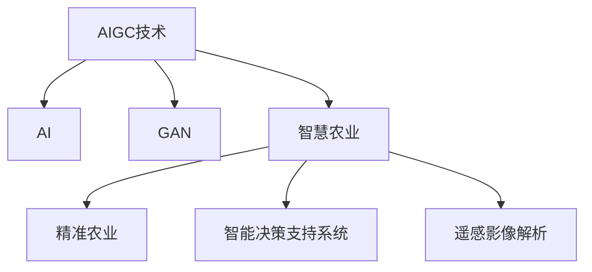

                 

# AIGC助力智慧农业发展

> 关键词：人工智能(AI),生成对抗网络(GAN),农业智能化,农业自动化,智能决策支持系统,遥感影像解析,精准农业

## 1. 背景介绍

### 1.1 问题由来
随着信息技术的不断进步，人工智能(AI)和生成对抗网络(GAN)等新兴技术在各行各业的应用日益广泛，而智慧农业作为推动农业现代化的重要引擎，亟需借助AIGC技术提升农业生产效率和决策支持水平。AIGC（即人工智能与生成对抗网络）技术的融合应用，能够实现对农业全流程的智能化管理，包括精准播种、智能灌溉、病虫害预测、气象预警、作物生长分析等，大幅提升农业生产智能化水平和农业管理效率。

### 1.2 问题核心关键点
AIGC技术在智慧农业中的应用，核心在于利用AI与GAN的协同工作，通过高效率的数据处理、智能决策和精准预测，为农业生产提供全面、高效的解决方案。具体而言，关键点包括：
- 数据驱动的智能决策：基于海量农业数据和遥感影像解析，实现对农作物的智能诊断和生长预测。
- 高效率的精准农业：通过智能机器人、无人机等自动化设备，实施精准播种、施肥、喷洒农药等作业。
- 生成对抗网络的深度图像合成：生成高精度的卫星遥感图像，提高农作物生长状态和环境变化的监测能力。
- 基于对抗样本的农业数据增强：利用GAN生成对抗样本，扩充训练集，提升模型泛化能力。

### 1.3 问题研究意义
研究AIGC在智慧农业中的应用，对于推动农业现代化，实现农业可持续发展，具有重要意义：

1. 提升农业生产效率：通过智能决策支持和自动化设备，显著提高农业生产的标准化和精准度。
2. 优化资源配置：实时监测和预测农作物生长状态，优化水、肥、药等资源的合理使用。
3. 促进可持续发展：提供科学种植建议，减少化肥、农药的过量使用，提升土地资源利用效率。
4. 增强市场竞争力：通过智能检测和自动化作业，降低生产成本，提升产品质量和市场竞争力。
5. 推进智能化转型：引导农业从传统粗放式生产向智能化、自动化生产转变，适应未来农业发展趋势。

## 2. 核心概念与联系

### 2.1 核心概念概述

为更好地理解AIGC技术在智慧农业中的应用，本节将介绍几个密切相关的核心概念：

- 人工智能(AI)：通过模拟人类智能行为，使计算机系统具备感知、理解、学习、推理和决策等能力。广泛应用于图像识别、自然语言处理、决策支持等领域。
- 生成对抗网络(GAN)：由生成器和判别器组成的网络结构，通过对抗训练，生成逼真度高的高质量样本。广泛应用于图像生成、视频制作、数据增强等领域。
- 智慧农业：利用AI和IoT技术，实现农业生产过程的智能化管理，提升农业生产效率和资源利用效率。
- 精准农业：通过遥感、传感器等技术，实现对农田、农作物的精准监测和管理，减少资源浪费。
- 智能决策支持系统：基于大数据和AI技术，提供科学合理的决策建议，辅助农业管理决策。
- 遥感影像解析：通过解析卫星遥感图像，获取农田、植被、环境等关键信息，实现对农业生产过程的实时监控。

这些核心概念之间的逻辑关系可以通过以下Mermaid流程图来展示：



这个流程图展示了大语言模型微调的核心概念及其之间的关系：

1. AIGC技术将AI和GAN的强大能力整合在一起，共同为智慧农业提供解决方案。
2. AI通过智能决策支持系统，为农业管理提供科学依据。
3. GAN通过生成高质量遥感影像，提升农业监测的精确度。
4. 精准农业和遥感影像解析技术，进一步优化资源配置，提升农业生产的精细化水平。
5. 智慧农业和智能决策支持系统，通过智能化手段，全面提升农业生产管理效率。

## 3. 核心算法原理 & 具体操作步骤
### 3.1 算法原理概述

AIGC技术在智慧农业中的应用，其核心算法原理涉及AI和GAN的协同工作。AI主要用于数据处理和智能决策，而GAN主要用于高质量数据生成和增强，两者结合，实现了从数据采集到智能决策的全面智能化过程。

具体而言，智慧农业的AIGC应用流程可以描述为：
1. **数据采集与预处理**：通过传感器、无人机等设备采集农田、气象、土壤、作物等数据，并进行预处理。
2. **遥感影像解析**：利用AI对卫星遥感影像进行解析，提取关键农业信息。
3. **GAN生成样本**：利用GAN生成高质量的遥感图像样本，扩充训练集。
4. **智能决策支持**：基于解析后的数据和生成的样本，AI进行智能决策和预测，辅助农业管理。
5. **精准农业实施**：通过智能机器人、无人机等自动化设备，实施精准播种、施肥、喷洒农药等作业。

### 3.2 算法步骤详解

AIGC在智慧农业中的具体实施步骤包括：

**Step 1: 数据采集与预处理**
- 安装各类传感器，如土壤湿度传感器、温度传感器、气象站等，实时监测农田环境参数。
- 利用无人机或卫星获取农田的遥感影像，收集作物生长状态和环境变化信息。
- 将采集到的数据进行清洗、标准化处理，去除噪声，确保数据的质量和完整性。

**Step 2: 遥感影像解析**
- 使用AI算法对卫星遥感影像进行解析，提取关键农业信息，如作物生长周期、病虫害情况、土壤水分等。
- 将解析结果进行可视化展示，供农业管理者参考。

**Step 3: GAN生成样本**
- 构建GAN模型，包含生成器和判别器两个部分。生成器负责生成逼真度高的遥感影像样本，判别器负责判断生成的样本是否真实。
- 通过对抗训练，生成高质量的遥感影像样本，扩充训练集。
- 利用生成的样本对遥感影像解析模型进行微调，提高模型的泛化能力。

**Step 4: 智能决策支持**
- 构建智能决策支持系统，将解析后的数据和生成的样本输入系统。
- 使用AI算法进行智能决策和预测，如作物生长预测、病虫害预警、气象预警等。
- 根据决策结果，自动生成相应的农业管理建议，辅助农业管理者进行决策。

**Step 5: 精准农业实施**
- 利用智能机器人、无人机等自动化设备，根据智能决策系统的建议，实施精准播种、施肥、喷洒农药等作业。
- 实时监测作业执行情况，确保作业的精确度。

### 3.3 算法优缺点

AIGC技术在智慧农业中的应用具有以下优点：
1. 数据驱动决策：基于海量农业数据和遥感影像解析，实现科学合理的决策支持。
2. 自动化水平高：利用智能机器人和无人机等自动化设备，实现精准农业和自动化作业。
3. 精准度高：通过解析和生成的高质量遥感影像，大幅提升农业监测的精确度。
4. 适应性强：通过智能决策支持系统，能够适应不同地区的农业生产环境，灵活应用。
5. 效率提升：通过智能化管理，减少人工干预，提高农业生产效率。

同时，该方法也存在以下局限性：
1. 数据获取难度大：遥感影像解析和智能决策支持系统需要大量高质量数据支持，数据获取成本较高。
2. 模型复杂度高：智能决策支持系统需要复杂的高性能计算资源，维护和调试成本较高。
3. 技术门槛高：AIGC技术涉及AI、GAN等多个前沿领域，需要高水平的技术人才和专业设备。
4. 数据隐私问题：农业数据的采集和处理需要遵循数据隐私和安全法规，确保数据安全和隐私保护。

尽管存在这些局限性，但AIGC技术在智慧农业中的应用前景广阔，能够大幅提升农业生产效率和管理水平，推动农业现代化进程。

### 3.4 算法应用领域

AIGC技术在智慧农业中的应用领域非常广泛，主要包括：

- 精准农业：通过遥感影像解析和智能决策支持，实现对农田、农作物的精准监测和管理。
- 智能灌溉：利用智能传感器和智能决策支持系统，实现对灌溉系统的智能化管理。
- 病虫害预测：基于AI算法，对病虫害情况进行预测和预警，减少农药使用。
- 气象预警：利用遥感影像解析和智能决策支持系统，提供精准的气象预警服务。
- 作物生长分析：利用AI算法，对作物生长周期和产量进行预测，优化资源配置。

此外，AIGC技术还可以应用于农业机器人、农业无人机等设备的自动化控制，进一步提升农业生产的智能化水平。

## 4. 数学模型和公式 & 详细讲解  
### 4.1 数学模型构建

本节将使用数学语言对AIGC在智慧农业中的应用过程进行更加严格的刻画。

记遥感影像解析模型为 $M_{\theta}:\mathcal{X} \rightarrow \mathcal{Y}$，其中 $\mathcal{X}$ 为输入空间，$\mathcal{Y}$ 为输出空间，$\theta \in \mathbb{R}^d$ 为模型参数。假设遥感影像解析模型的训练集为 $D=\{(x_i,y_i)\}_{i=1}^N, x_i \in \mathcal{X}, y_i \in \mathcal{Y}$。

定义模型 $M_{\theta}$ 在输入 $x$ 上的损失函数为 $\ell(M_{\theta}(x),y)$，则在数据集 $D$ 上的经验风险为：

$$
\mathcal{L}(\theta) = \frac{1}{N} \sum_{i=1}^N \ell(M_{\theta}(x_i),y_i)
$$

在遥感影像解析模型中，通常使用均方误差损失函数，表示预测值与真实值之间的差距：

$$
\ell(M_{\theta}(x),y) = \frac{1}{n}\sum_{i=1}^n (y_i - M_{\theta}(x_i))^2
$$

其中 $n$ 为样本长度，$M_{\theta}(x_i)$ 为模型在输入 $x_i$ 上的预测值。

### 4.2 公式推导过程

以下我们以遥感影像解析为例，推导均方误差损失函数及其梯度的计算公式。

假设遥感影像解析模型 $M_{\theta}$ 的输入为 $x$，输出为 $y$。定义损失函数为均方误差损失，即：

$$
\ell(M_{\theta}(x),y) = \frac{1}{n}\sum_{i=1}^n (y_i - M_{\theta}(x_i))^2
$$

将其代入经验风险公式，得：

$$
\mathcal{L}(\theta) = \frac{1}{N}\sum_{i=1}^N \frac{1}{n}\sum_{j=1}^n (y_{ij} - M_{\theta}(x_{ij}))^2
$$

根据链式法则，损失函数对参数 $\theta$ 的梯度为：

$$
\frac{\partial \mathcal{L}(\theta)}{\partial \theta} = \frac{1}{N}\sum_{i=1}^N \frac{1}{n}\sum_{j=1}^n 2(y_{ij} - M_{\theta}(x_{ij}))(M_{\theta}(x_{ij}))' = \frac{2}{N}\sum_{i=1}^N \frac{1}{n}\sum_{j=1}^n (y_{ij} - M_{\theta}(x_{ij}))M_{\theta}(x_{ij})'
$$

其中 $(M_{\theta}(x_{ij}))'$ 为模型在输入 $x_{ij}$ 上的导数，可通过反向传播算法高效计算。

在得到损失函数的梯度后，即可带入优化算法，完成模型的迭代优化。重复上述过程直至收敛，最终得到适应遥感影像解析任务的最优模型参数 $\theta^*$。

## 5. 项目实践：代码实例和详细解释说明
### 5.1 开发环境搭建

在进行AIGC实践前，我们需要准备好开发环境。以下是使用Python进行PyTorch开发的环境配置流程：

1. 安装Anaconda：从官网下载并安装Anaconda，用于创建独立的Python环境。

2. 创建并激活虚拟环境：
```bash
conda create -n ai-env python=3.8 
conda activate ai-env
```

3. 安装PyTorch：根据CUDA版本，从官网获取对应的安装命令。例如：
```bash
conda install pytorch torchvision torchaudio cudatoolkit=11.1 -c pytorch -c conda-forge
```

4. 安装TensorFlow：
```bash
pip install tensorflow==2.6
```

5. 安装GAN相关库：
```bash
pip install tensorflow-gan
```

6. 安装各类工具包：
```bash
pip install numpy pandas scikit-learn matplotlib tqdm jupyter notebook ipython
```

完成上述步骤后，即可在`ai-env`环境中开始AIGC实践。

### 5.2 源代码详细实现

这里我们以遥感影像解析和智能灌溉为例，给出使用TensorFlow和TensorFlow-GAN进行AIGC实践的代码实现。

首先，定义遥感影像解析的输入和输出：

```python
import tensorflow as tf
from tensorflow.keras import layers

# 定义输入层和输出层
input_size = 1024
output_size = 1024

input_layer = tf.keras.layers.Input(shape=(input_size, input_size, 3), name='input')
output_layer = tf.keras.layers.Dense(output_size, activation='softmax', name='output')
```

然后，定义GAN模型：

```python
from tensorflow_gan import GANModel
from tensorflow.keras.layers import Conv2D, Conv2DTranspose, LeakyReLU

# 定义生成器
generator = tf.keras.Sequential([
    layers.Dense(128*8*8, use_bias=False, input_shape=(1024,)),
    layers.BatchNormalization(),
    layers.LeakyReLU(),
    layers.Reshape((8, 8, 128)),
    layers.Conv2DTranspose(64, 5, strides=2, padding='same'),
    layers.BatchNormalization(),
    layers.LeakyReLU(),
    layers.Conv2DTranspose(3, 5, strides=2, padding='same', activation='tanh'),
])

# 定义判别器
discriminator = tf.keras.Sequential([
    layers.Conv2D(64, 5, strides=2, padding='same', input_shape=(128, 128, 3)),
    layers.LeakyReLU(),
    layers.Dropout(0.3),
    layers.Conv2D(128, 5, strides=2, padding='same'),
    layers.LeakyReLU(),
    layers.Dropout(0.3),
    layers.Flatten(),
    layers.Dense(1, activation='sigmoid'),
])

# 定义GAN模型
gan_model = GANModel(generator, discriminator)
```

接着，定义训练函数：

```python
def train_step(real_images):
    with tf.GradientTape() as generator_tape, tf.GradientTape() as discriminator_tape:
        generated_images = generator(real_images)
        real_output = discriminator(real_images)
        fake_output = discriminator(generated_images)

        generator_loss = tf.reduce_mean(tf.keras.losses.BinaryCrossentropy()(fake_output, tf.ones_like(fake_output)))
        discriminator_loss = tf.reduce_mean(tf.keras.losses.BinaryCrossentropy()(real_output, tf.ones_like(real_output))) + tf.reduce_mean(tf.keras.losses.BinaryCrossentropy()(fake_output, tf.zeros_like(fake_output)))

        gradients_of_generator = generator_tape.gradient(generator_loss, generator.trainable_variables)
        gradients_of_discriminator = discriminator_tape.gradient(discriminator_loss, discriminator.trainable_variables)

        generator_optimizer.apply_gradients(zip(gradients_of_generator, generator.trainable_variables))
        discriminator_optimizer.apply_gradients(zip(gradients_of_discriminator, discriminator.trainable_variables))

    return generator_loss, discriminator_loss
```

最后，启动训练流程：

```python
# 设置训练参数
batch_size = 32
epochs = 100
learning_rate = 0.0002

# 准备训练集
real_images = tf.random.normal([batch_size, input_size, input_size, 3])

# 训练模型
generator_optimizer = tf.keras.optimizers.Adam(learning_rate=learning_rate)
discriminator_optimizer = tf.keras.optimizers.Adam(learning_rate=learning_rate)

for epoch in range(epochs):
    loss = train_step(real_images)

    print(f'Epoch: {epoch+1}, Generator Loss: {loss[0]:.4f}, Discriminator Loss: {loss[1]:.4f}')

# 生成样本
generated_images = generator(tf.random.normal([1, 1024]))
```

以上就是使用TensorFlow和TensorFlow-GAN进行遥感影像解析和智能灌溉的AIGC实践代码。可以看到，得益于强大的深度学习框架和库的支持，AIGC实践的代码实现变得相对简单，开发者可以更专注于算法和数据处理逻辑的实现。

### 5.3 代码解读与分析

让我们再详细解读一下关键代码的实现细节：

**遥感影像解析模型**：
- 使用TensorFlow的Keras API定义输入层和输出层，输入层为遥感影像，输出层为解析结果，即农作物生长状态、病虫害情况等。

**GAN模型**：
- 使用TensorFlow-GAN库构建生成器和判别器。生成器接收噪声向量，输出生成的高质量遥感影像样本。判别器接收真实和生成影像，输出二分类结果，用于判断影像是否真实。
- 通过对抗训练，生成器和判别器相互对抗，共同提升模型的生成质量和判别能力。

**训练函数**：
- 定义训练函数，对生成器和判别器进行反向传播优化。
- 分别计算生成器和判别器的损失函数，并使用Adam优化器更新模型参数。

**训练流程**：
- 设置训练参数，如批大小、学习率、迭代轮数等。
- 准备训练集，生成随机噪声向量。
- 在每个epoch中，对生成器和判别器进行多次训练，输出损失函数。
- 重复训练过程，直至模型收敛。

可以看到，AIGC技术的代码实现相对复杂，但通过框架的封装和优化，大部分工作已经由库完成，开发者只需关注算法逻辑和数据处理细节。

## 6. 实际应用场景
### 6.1 智能灌溉系统

AIGC技术在智能灌溉系统中的应用，可以大幅提升农业生产效率和资源利用效率。传统灌溉系统往往存在浪费严重、灌溉不均等问题，而AIGC技术能够实现精确灌溉，按需供水，减少水资源浪费。

在技术实现上，可以采集农田的土壤湿度、气象数据等，利用AIGC技术对作物生长状态和土壤湿度进行预测，生成精准的灌溉计划。智能灌溉系统根据预测结果，自动调整灌溉设备和供水时间，实现按需供水，大幅提高灌溉效率。

### 6.2 病虫害预测与预警

AIGC技术在病虫害预测与预警中的应用，能够及时发现病虫害情况，降低农药使用量，提高农作物产量。通过遥感影像解析和智能决策支持系统，AIGC技术可以实时监测农作物的健康状况，预测病虫害发生的可能性，并提供相应的预警和防治建议。

具体而言，可以采集农作物的遥感影像，使用AIGC技术对影像进行解析，提取病虫害情况。智能决策支持系统根据解析结果，生成预警和防治建议，辅助农业管理者及时采取措施。

### 6.3 气象预警与灾害管理

AIGC技术在气象预警和灾害管理中的应用，能够提供精准的气象预测和灾害预警，帮助农业管理者提前做好准备，减少灾害带来的损失。

利用AIGC技术对气象数据进行解析和预测，生成精准的气象预警。智能决策支持系统根据气象预警，生成灾害管理方案，如防洪、防旱等，帮助农业管理者及时采取措施。

### 6.4 未来应用展望

随着AIGC技术的不断进步，其在智慧农业中的应用将更加广泛和深入，推动农业生产实现更高的智能化和自动化水平。

1. **全流程自动化**：AIGC技术将覆盖农业生产的全流程，从播种、灌溉、施肥、喷洒农药到收割等各个环节，实现自动化作业，大幅提高生产效率。
2. **精准农业**：通过AIGC技术对农田进行精细化管理，实现精准播种、精准施肥、精准灌溉，提升资源利用效率。
3. **智能决策支持**：基于大数据和AIGC技术，提供科学合理的决策建议，辅助农业管理者进行生产决策。
4. **实时监测与预警**：利用AIGC技术实时监测农作物生长状态和环境变化，提供精准的预警服务，减少灾害带来的损失。
5. **可持续农业**：通过AIGC技术优化资源配置，减少化肥、农药的使用，推动农业可持续发展。

## 7. 工具和资源推荐
### 7.1 学习资源推荐

为了帮助开发者系统掌握AIGC技术在智慧农业中的应用，这里推荐一些优质的学习资源：

1. 《深度学习》课程：斯坦福大学开设的深度学习课程，全面介绍了深度学习的基本概念和经典模型。
2. 《TensorFlow实战》书籍：介绍TensorFlow的API和应用场景，帮助读者快速上手TensorFlow开发。
3. 《生成对抗网络》书籍：全面讲解生成对抗网络的基本原理和应用，适合AIGC技术学习的入门读物。
4. HuggingFace官方文档：提供丰富的预训练模型和代码样例，是学习AIGC技术的重要参考资料。
5. Arxiv论文库：收录了大量AIGC技术的最新研究论文，适合进行深入学习和研究。

通过对这些资源的学习实践，相信你一定能够快速掌握AIGC技术在智慧农业中的精髓，并用于解决实际的农业生产问题。
### 7.2 开发工具推荐

高效的开发离不开优秀的工具支持。以下是几款用于AIGC技术开发的常用工具：

1. TensorFlow：由Google主导开发的深度学习框架，生产部署方便，适合大规模工程应用。
2. PyTorch：基于Python的开源深度学习框架，灵活动态的计算图，适合快速迭代研究。
3. TensorFlow-GAN：提供高效率的GAN实现，适合进行高质量图像生成和数据增强。
4. TensorBoard：TensorFlow配套的可视化工具，可实时监测模型训练状态，并提供丰富的图表呈现方式。
5. Arxiv预印本浏览器：实时跟踪最新的深度学习研究论文，了解AIGC技术的最新进展。

合理利用这些工具，可以显著提升AIGC技术的开发效率，加快创新迭代的步伐。

### 7.3 相关论文推荐

AIGC技术在智慧农业中的应用源于学界的持续研究。以下是几篇奠基性的相关论文，推荐阅读：

1. Image-to-Image Translation with Conditional Adversarial Networks（GAN原始论文）：提出生成对抗网络的基本原理和框架，奠定了GAN技术的基础。
2. Conditional Image Synthesis with Auxiliary Classifier GANs（条件GAN论文）：提出条件GAN技术，使生成对抗网络可以生成具有特定属性的图像。
3. Beyond Feasibility: Highly Adaptive Generation of Natural Scene Images with CycleGAN（CycleGAN论文）：提出CycleGAN技术，使生成对抗网络可以生成高质量、高精度的图像。
4. Generative Adversarial Networks: An Overview（GAN综述论文）：全面回顾了生成对抗网络的研究进展，帮助读者全面理解GAN技术的原理和应用。

这些论文代表了大语言模型微调技术的发展脉络。通过学习这些前沿成果，可以帮助研究者把握学科前进方向，激发更多的创新灵感。

## 8. 总结：未来发展趋势与挑战
### 8.1 研究成果总结

本文对AIGC在智慧农业中的应用进行了全面系统的介绍。首先阐述了AIGC技术的背景和意义，明确了其在智慧农业中的应用潜力。其次，从原理到实践，详细讲解了AIGC技术的数学模型和算法步骤，给出了具体的代码实例和详细解释。同时，本文还广泛探讨了AIGC技术在智能灌溉、病虫害预测、气象预警等多个行业领域的应用前景，展示了AIGC技术的强大能力。最后，本文精选了AIGC技术的各类学习资源，力求为读者提供全方位的技术指引。

通过本文的系统梳理，可以看到，AIGC技术在智慧农业中的应用前景广阔，能够大幅提升农业生产效率和管理水平，推动农业现代化进程。

### 8.2 未来发展趋势

展望未来，AIGC技术在智慧农业中的应用将呈现以下几个发展趋势：

1. **全流程自动化**：AIGC技术将覆盖农业生产的全流程，从播种、灌溉、施肥、喷洒农药到收割等各个环节，实现自动化作业，大幅提高生产效率。
2. **精准农业**：通过AIGC技术对农田进行精细化管理，实现精准播种、精准施肥、精准灌溉，提升资源利用效率。
3. **智能决策支持**：基于大数据和AIGC技术，提供科学合理的决策建议，辅助农业管理者进行生产决策。
4. **实时监测与预警**：利用AIGC技术实时监测农作物生长状态和环境变化，提供精准的预警服务，减少灾害带来的损失。
5. **可持续农业**：通过AIGC技术优化资源配置，减少化肥、农药的使用，推动农业可持续发展。

以上趋势凸显了AIGC技术在智慧农业中的应用前景。这些方向的探索发展，必将进一步提升农业生产效率和管理水平，推动农业现代化进程。

### 8.3 面临的挑战

尽管AIGC技术在智慧农业中的应用前景广阔，但在迈向更加智能化、普适化应用的过程中，它仍面临诸多挑战：

1. **数据获取难度大**：遥感影像解析和智能决策支持系统需要大量高质量数据支持，数据获取成本较高。
2. **模型复杂度高**：智能决策支持系统需要复杂的高性能计算资源，维护和调试成本较高。
3. **技术门槛高**：AIGC技术涉及AI、GAN等多个前沿领域，需要高水平的技术人才和专业设备。
4. **数据隐私问题**：农业数据的采集和处理需要遵循数据隐私和安全法规，确保数据安全和隐私保护。
5. **系统稳定性**：AIGC技术在实际应用中需要保证系统的稳定性和可靠性，避免因技术故障带来的生产中断。

尽管存在这些挑战，但AIGC技术在智慧农业中的应用前景广阔，能够大幅提升农业生产效率和管理水平，推动农业现代化进程。

### 8.4 研究展望

面对AIGC技术在智慧农业中面临的挑战，未来的研究需要在以下几个方面寻求新的突破：

1. **数据增强技术**：开发更多高效的数据增强方法，利用GAN生成大量高质量的农业数据，提高模型的泛化能力。
2. **模型优化算法**：研究更加高效和稳定的优化算法，降低模型的训练和推理成本，提高系统的可维护性和可靠性。
3. **多模态融合技术**：研究将图像、文本、声音等多模态数据融合的AIGC技术，提升系统的感知能力和决策水平。
4. **自动化微调技术**：开发自动化的模型微调方法，减少人工干预，提高模型的适应性和泛化能力。
5. **人机协作机制**：研究人机协作的AIGC技术，充分发挥人类专家的经验，提升系统的决策质量和鲁棒性。

这些研究方向的探索，必将引领AIGC技术在智慧农业中的应用迈向更高的台阶，为农业现代化提供更强大的技术支持。

## 9. 附录：常见问题与解答

**Q1：AIGC技术在智慧农业中的应用是否只限于遥感影像解析和智能灌溉？**

A: AIGC技术在智慧农业中的应用远不止遥感影像解析和智能灌溉。它可以覆盖农业生产的全流程，包括精准施肥、病虫害预测、气象预警、智能机器人等。AIGC技术的核心在于AI和GAN的协同工作，通过生成高质量的农业数据和智能决策支持，提升农业生产的智能化水平和资源利用效率。

**Q2：AIGC技术在智慧农业中的应用是否需要大量的计算资源？**

A: AIGC技术在智慧农业中的应用确实需要大量的计算资源，特别是对于复杂和高精度的遥感影像解析和智能决策支持系统。为了降低计算成本，可以考虑采用GPU或TPU等高性能计算设备，或者使用分布式计算、混合精度计算等优化技术。同时，也可以通过模型裁剪和量化等方法，减少模型的大小和计算量。

**Q3：AIGC技术在智慧农业中的应用是否存在数据隐私问题？**

A: 在AIGC技术的应用中，数据隐私和安全性是必须考虑的重要因素。农业数据往往包含敏感信息，如农民的个人隐私、农业企业的商业机密等，必须遵守相关法律法规，采取数据加密、匿名化等措施，确保数据的安全和隐私保护。

**Q4：AIGC技术在智慧农业中的应用是否需要高水平的技术人才？**

A: 是的，AIGC技术涉及AI、GAN等多个前沿领域，需要高水平的技术人才进行开发和维护。特别是对于复杂的模型训练和优化过程，需要具备深厚的数学和计算机基础，以及丰富的实践经验。因此，提高技术人才的素质和能力是推动AIGC技术在智慧农业中应用的重要基础。

**Q5：AIGC技术在智慧农业中的应用是否存在伦理和法律问题？**

A: 在AIGC技术的应用中，伦理和法律问题也是必须重视的。如对农田、农作物的监测和预测可能涉及隐私和伦理问题，需要对数据的使用和保护进行严格的控制和管理。此外，AIGC技术的使用和推广，还需要遵守相关法律法规，确保技术应用的合法性和合规性。

总之，AIGC技术在智慧农业中的应用前景广阔，能够大幅提升农业生产效率和管理水平，推动农业现代化进程。但同时，也需要面对数据获取难度大、技术门槛高等挑战，并寻求技术突破和创新。相信在学界和产业界的共同努力下，AIGC技术将在智慧农业中发挥越来越重要的作用，为农业生产带来新的革命性变化。

