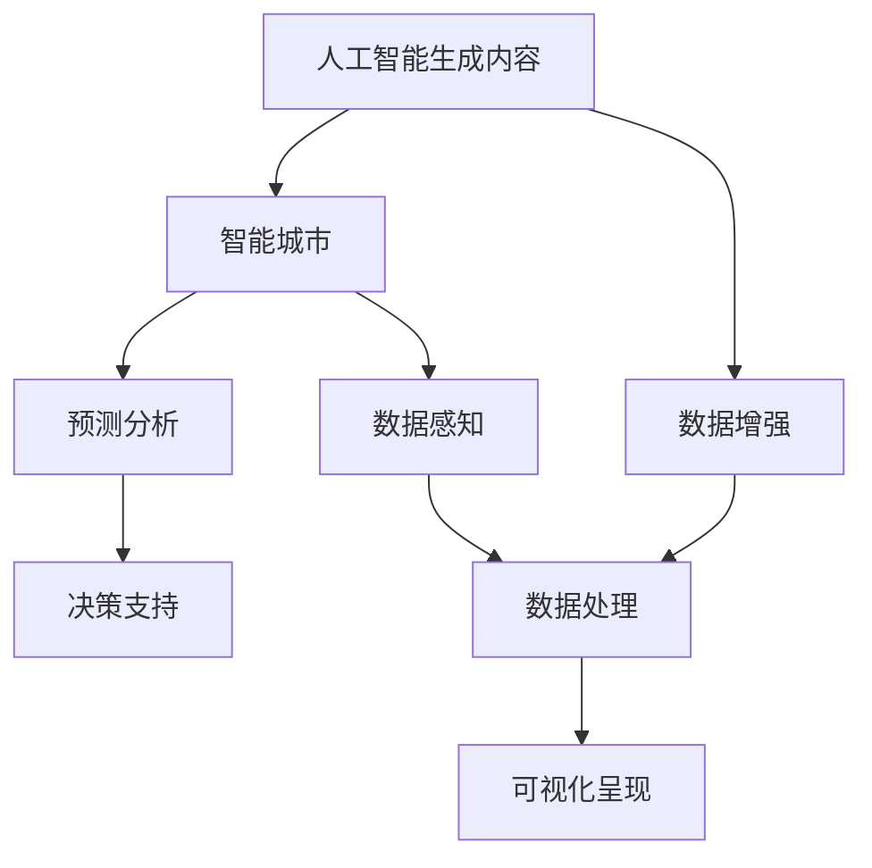

                 

## 1. 背景介绍

随着人工智能技术的迅猛发展，智能城市已成为全球各大城市建设的新趋势。智慧交通、智慧安防、智慧能源、智慧环保等多个领域正逐渐被人工智能技术所赋能。人工智能生成内容（AIGC）作为人工智能的前沿技术之一，在智能城市运营中发挥了重要作用。

### 1.1 问题由来

在智能城市的建设过程中，数据处理、预测分析和决策支持是关键环节。然而，传统的数据处理方式在处理海量、异构数据时，存在效率低、成本高、预测准确率不高等问题。为了提升智能城市的运行效率和决策质量，需要引入新技术来辅助实现。

人工智能生成内容（AIGC）技术通过自然语言处理、图像生成、音频生成等方式，能够在极短的时间内生成大量的高质量数据，为智能城市各个领域提供强有力的数据支持。通过对AIGC技术的深度整合与应用，智能城市的数据处理、决策支持、场景模拟等方面将迎来全面革新。

## 2. 核心概念与联系

### 2.1 核心概念概述

- 人工智能生成内容（AIGC）：利用人工智能技术，生成具有高真实感、高质量和高度可定制性的内容，包括文本、图片、视频、音频等。
- 智能城市：利用人工智能、物联网、大数据等技术，实现城市运行信息的智能感知、智能化处理和可视化呈现，提升城市管理效率和服务质量。
- 预测分析：通过对历史数据进行分析，预测未来趋势和行为，为决策提供支持。
- 决策支持：通过分析多源数据，提供全面的决策参考，帮助相关部门制定合理的政策和管理方案。

这些核心概念之间的联系可以通过以下Mermaid流程图来展示：



这个流程图展示了大语言模型在智能城市中的核心作用和数据流向：

1. AIGC作为数据增强手段，生成海量数据。
2. 智能城市通过感知、处理和呈现海量数据，提供决策支持。
3. 预测分析通过对数据的深入挖掘，帮助制定优化方案。

## 3. 核心算法原理 & 具体操作步骤

### 3.1 算法原理概述

AIGC技术在智能城市中的应用主要基于以下几个关键算法：

- 文本生成算法：如Transformer模型，基于自回归或自编码机制，能够生成高质量的自然语言文本。
- 图像生成算法：如GAN模型，通过生成对抗网络生成高逼真度的图像。
- 音频生成算法：如WaveNet模型，利用神经网络生成高质量的音频内容。
- 数据增强算法：通过数据混合、回译等技术，生成更多的训练数据，提升模型泛化能力。

这些算法通过联合使用，可以全面覆盖智能城市中的各类数据需求，为城市运营提供强有力的技术支持。

### 3.2 算法步骤详解

以文本生成算法为例，介绍AIGC技术在智能城市中的应用步骤：

1. **数据准备**：收集智能城市中的各类文本数据，包括交通流量、能源消耗、环境监测、公共服务等方面的文本信息。
2. **预训练**：利用大规模无标签文本数据，进行预训练，获得高质量的文本生成模型。
3. **微调**：根据智能城市中的具体需求，对预训练模型进行微调，提升模型的针对性和泛化能力。
4. **生成与评估**：利用微调后的模型，生成高质量的文本数据，并通过评估指标（如BLEU、ROUGE等）对生成效果进行评估。
5. **集成与应用**：将生成的文本数据集成到智能城市的管理和决策系统中，提升决策效率和效果。

### 3.3 算法优缺点

AIGC技术在智能城市中的应用具有以下优点：

- **数据增强**：通过生成更多的训练数据，提升模型泛化能力，解决数据稀缺问题。
- **高效性**：AIGC技术可以快速生成大量高质量数据，提高数据处理和分析效率。
- **灵活性**：AIGC技术可以生成多种类型的数据，满足智能城市中不同领域的需求。

同时，也存在以下缺点：

- **质量控制**：生成的数据质量可能不如真实数据，需要进行严格的筛选和评估。
- **计算资源消耗**：生成高质量数据需要消耗大量计算资源，对硬件要求较高。
- **可解释性**：生成的数据可能缺乏可解释性，难以进行精确分析。

### 3.4 算法应用领域

AIGC技术在智能城市中的应用领域非常广泛，主要包括以下几个方面：

- **智慧交通**：通过生成高质量的交通流量数据，优化交通管理策略，提升交通运行效率。
- **智慧能源**：生成能源消耗和供应预测数据，制定合理的能源管理方案，提高能源利用效率。
- **智慧环保**：生成环境监测数据，分析环境变化趋势，制定环境保护措施，提升环境质量。
- **智慧安防**：生成安全监控数据，分析安全威胁，提升城市安全管理水平。
- **智慧医疗**：生成医疗数据，辅助医生进行诊断和治疗，提高医疗服务质量。

## 4. 数学模型和公式 & 详细讲解 & 举例说明

### 4.1 数学模型构建

以文本生成算法为例，介绍Transformer模型的构建过程。

Transformer模型主要包含编码器和解码器，通过自注意力机制实现对输入序列的编码和生成。数学模型构建如下：

$$
\begin{aligned}
\text{Encoder} &= \text{MultiHeadAttention}(\text{Embedding}, \text{Encoder}) + \text{LayerNorm} \\
\text{Decoder} &= \text{MultiHeadAttention}(\text{Embedding}, \text{Decoder}) + \text{LayerNorm} + \text{FeedForward} + \text{LayerNorm} \\
\end{aligned}
$$

其中，MultiHeadAttention表示多头注意力机制，LayerNorm表示层归一化，Embedding表示嵌入层，FeedForward表示前馈网络。

### 4.2 公式推导过程

以序列到序列的文本生成为例，介绍Transformer模型的训练过程。

假设输入序列为 $X=\{x_1, x_2, ..., x_n\}$，输出序列为 $Y=\{y_1, y_2, ..., y_m\}$。训练目标是最小化损失函数：

$$
\min_{\theta} L(Y, \hat{Y}) = \min_{\theta} \sum_{i=1}^{m} \sum_{j=1}^{n} L(y_i, \hat{y}_j)
$$

其中，$L(y_i, \hat{y}_j)$ 为损失函数，$\hat{y}_j$ 为模型预测值。

通过反向传播算法，计算损失函数的梯度，更新模型参数 $\theta$。具体步骤如下：

1. 前向传播：
   $$
   \hat{Y} = \text{Decoder}(X, \text{Encoder})
   $$

2. 计算损失函数：
   $$
   L(Y, \hat{Y}) = \sum_{i=1}^{m} \sum_{j=1}^{n} L(y_i, \hat{y}_j)
   $$

3. 反向传播：
   $$
   \frac{\partial L}{\partial \theta} = \frac{\partial L}{\partial \hat{Y}} \frac{\partial \hat{Y}}{\partial \theta}
   $$

4. 更新模型参数：
   $$
   \theta \leftarrow \theta - \eta \frac{\partial L}{\partial \theta}
   $$

### 4.3 案例分析与讲解

以智慧交通为例，介绍AIGC技术的应用。

假设需要生成高质量的交通流量数据，用于优化交通管理策略。步骤如下：

1. **数据准备**：收集历史交通流量数据，划分为训练集和测试集。
2. **预训练**：利用大规模交通数据对Transformer模型进行预训练，获得高质量的交通流量生成模型。
3. **微调**：根据特定的交通场景需求，对预训练模型进行微调，提升模型的针对性。
4. **生成与评估**：利用微调后的模型生成交通流量数据，通过BLEU等指标评估生成效果。
5. **应用**：将生成的交通流量数据集成到交通管理系统，优化交通管理策略，提升交通运行效率。

## 5. 项目实践：代码实例和详细解释说明

### 5.1 开发环境搭建

进行AIGC项目实践，需要先搭建好开发环境。以下是使用Python进行PyTorch开发的环境配置流程：

1. 安装Anaconda：从官网下载并安装Anaconda，用于创建独立的Python环境。
2. 创建并激活虚拟环境：
```bash
conda create -n pytorch-env python=3.8 
conda activate pytorch-env
```
3. 安装PyTorch：根据CUDA版本，从官网获取对应的安装命令。例如：
```bash
conda install pytorch torchvision torchaudio cudatoolkit=11.1 -c pytorch -c conda-forge
```
4. 安装Transformers库：
```bash
pip install transformers
```
5. 安装各类工具包：
```bash
pip install numpy pandas scikit-learn matplotlib tqdm jupyter notebook ipython
```

完成上述步骤后，即可在`pytorch-env`环境中开始AIGC实践。

### 5.2 源代码详细实现

以智慧交通为例，给出使用Transformers库对Transformer模型进行微调的PyTorch代码实现。

首先，定义数据处理函数：

```python
from transformers import BertTokenizer
from torch.utils.data import Dataset
import torch

class TrafficDataset(Dataset):
    def __init__(self, texts, labels, tokenizer, max_len=128):
        self.texts = texts
        self.labels = labels
        self.tokenizer = tokenizer
        self.max_len = max_len
        
    def __len__(self):
        return len(self.texts)
    
    def __getitem__(self, item):
        text = self.texts[item]
        label = self.labels[item]
        
        encoding = self.tokenizer(text, return_tensors='pt', max_length=self.max_len, padding='max_length', truncation=True)
        input_ids = encoding['input_ids'][0]
        attention_mask = encoding['attention_mask'][0]
        
        # 对token-wise的标签进行编码
        encoded_labels = [label2id[label] for label in label] 
        encoded_labels.extend([label2id['O']] * (self.max_len - len(encoded_labels)))
        labels = torch.tensor(encoded_labels, dtype=torch.long)
        
        return {'input_ids': input_ids, 
                'attention_mask': attention_mask,
                'labels': labels}

# 标签与id的映射
label2id = {'O': 0, 'traffic_jam': 1, 'smooth_traffic': 2, 'high_speed': 3}
id2label = {v: k for k, v in label2id.items()}

# 创建dataset
tokenizer = BertTokenizer.from_pretrained('bert-base-cased')

train_dataset = TrafficDataset(train_texts, train_labels, tokenizer)
dev_dataset = TrafficDataset(dev_texts, dev_labels, tokenizer)
test_dataset = TrafficDataset(test_texts, test_labels, tokenizer)
```

然后，定义模型和优化器：

```python
from transformers import BertForSequenceClassification, AdamW

model = BertForSequenceClassification.from_pretrained('bert-base-cased', num_labels=len(label2id))

optimizer = AdamW(model.parameters(), lr=2e-5)
```

接着，定义训练和评估函数：

```python
from torch.utils.data import DataLoader
from tqdm import tqdm
from sklearn.metrics import classification_report

device = torch.device('cuda') if torch.cuda.is_available() else torch.device('cpu')
model.to(device)

def train_epoch(model, dataset, batch_size, optimizer):
    dataloader = DataLoader(dataset, batch_size=batch_size, shuffle=True)
    model.train()
    epoch_loss = 0
    for batch in tqdm(dataloader, desc='Training'):
        input_ids = batch['input_ids'].to(device)
        attention_mask = batch['attention_mask'].to(device)
        labels = batch['labels'].to(device)
        model.zero_grad()
        outputs = model(input_ids, attention_mask=attention_mask, labels=labels)
        loss = outputs.loss
        epoch_loss += loss.item()
        loss.backward()
        optimizer.step()
    return epoch_loss / len(dataloader)

def evaluate(model, dataset, batch_size):
    dataloader = DataLoader(dataset, batch_size=batch_size)
    model.eval()
    preds, labels = [], []
    with torch.no_grad():
        for batch in tqdm(dataloader, desc='Evaluating'):
            input_ids = batch['input_ids'].to(device)
            attention_mask = batch['attention_mask'].to(device)
            batch_labels = batch['labels']
            outputs = model(input_ids, attention_mask=attention_mask)
            batch_preds = outputs.logits.argmax(dim=2).to('cpu').tolist()
            batch_labels = batch_labels.to('cpu').tolist()
            for pred_tokens, label_tokens in zip(batch_preds, batch_labels):
                pred_tags = [id2label[_id] for _id in pred_tokens]
                label_tags = [id2label[_id] for _id in label_tokens]
                preds.append(pred_tags[:len(label_tokens)])
                labels.append(label_tags)
                
    print(classification_report(labels, preds))
```

最后，启动训练流程并在测试集上评估：

```python
epochs = 5
batch_size = 16

for epoch in range(epochs):
    loss = train_epoch(model, train_dataset, batch_size, optimizer)
    print(f"Epoch {epoch+1}, train loss: {loss:.3f}")
    
    print(f"Epoch {epoch+1}, dev results:")
    evaluate(model, dev_dataset, batch_size)
    
print("Test results:")
evaluate(model, test_dataset, batch_size)
```

以上就是使用PyTorch对BERT进行智慧交通场景微调的完整代码实现。可以看到，得益于Transformers库的强大封装，我们可以用相对简洁的代码完成BERT模型的加载和微调。

### 5.3 代码解读与分析

让我们再详细解读一下关键代码的实现细节：

**TrafficDataset类**：
- `__init__`方法：初始化文本、标签、分词器等关键组件。
- `__len__`方法：返回数据集的样本数量。
- `__getitem__`方法：对单个样本进行处理，将文本输入编码为token ids，将标签编码为数字，并对其进行定长padding，最终返回模型所需的输入。

**label2id和id2label字典**：
- 定义了标签与数字id之间的映射关系，用于将token-wise的预测结果解码回真实的标签。

**训练和评估函数**：
- 使用PyTorch的DataLoader对数据集进行批次化加载，供模型训练和推理使用。
- 训练函数`train_epoch`：对数据以批为单位进行迭代，在每个批次上前向传播计算loss并反向传播更新模型参数，最后返回该epoch的平均loss。
- 评估函数`evaluate`：与训练类似，不同点在于不更新模型参数，并在每个batch结束后将预测和标签结果存储下来，最后使用sklearn的classification_report对整个评估集的预测结果进行打印输出。

**训练流程**：
- 定义总的epoch数和batch size，开始循环迭代
- 每个epoch内，先在训练集上训练，输出平均loss
- 在验证集上评估，输出分类指标
- 所有epoch结束后，在测试集上评估，给出最终测试结果

可以看到，PyTorch配合Transformers库使得BERT微调的代码实现变得简洁高效。开发者可以将更多精力放在数据处理、模型改进等高层逻辑上，而不必过多关注底层的实现细节。

当然，工业级的系统实现还需考虑更多因素，如模型的保存和部署、超参数的自动搜索、更灵活的任务适配层等。但核心的微调范式基本与此类似。

## 6. 实际应用场景

### 6.1 智能交通

智能交通是AIGC技术的重要应用场景之一。通过对交通流量数据的生成和分析，智能交通系统能够实现对交通流量、路况等信息的实时监控和预测。

具体而言，AIGC技术可以通过生成高质量的交通流量数据，帮助城市交通管理部门优化交通信号灯控制策略、调整公共交通发车频率、进行交通拥堵分析和疏导等。例如，通过生成实时交通流量数据，智能交通系统可以动态调整交通信号灯的配时，提升交通运行效率。

### 6.2 智慧能源

智慧能源领域也需要大量高质量的数据进行优化和预测。通过对能源消耗数据的生成和分析，智能能源系统可以实现对能源消耗的精准预测和管理。

AIGC技术可以通过生成高质量的能源消耗数据，帮助能源管理部门优化能源分配策略、进行能源需求预测、评估节能效果等。例如，通过生成实时能源消耗数据，智能能源系统可以动态调整能源分配方案，提升能源利用效率。

### 6.3 智慧环保

环境监测是智慧城市的重要组成部分。通过对环境监测数据的生成和分析，智慧环保系统可以实现对环境变化的实时监测和预警。

AIGC技术可以通过生成高质量的环境监测数据，帮助环保部门监测环境污染情况、预测环境变化趋势、评估环保措施效果等。例如，通过生成实时环境监测数据，智慧环保系统可以实时监测空气质量、水质等环境指标，及时发出预警，采取应对措施。

### 6.4 未来应用展望

随着AIGC技术的不断发展，其应用场景将越来越广泛，成为智能城市运行的重要支撑。

在智慧城市建设过程中，AIGC技术将进一步与物联网、大数据等技术深度融合，提升城市管理的智能化水平。通过生成高质量的数据，AIGC技术可以辅助城市决策者制定更加科学合理的管理方案，优化城市运营效率。

同时，AIGC技术还将在智慧医疗、智慧教育、智慧金融等领域得到广泛应用。例如，在智慧医疗领域，AIGC技术可以生成高质量的医学数据，辅助医生进行诊断和治疗，提升医疗服务质量；在智慧教育领域，AIGC技术可以生成高质量的教育资源，辅助教师进行教学，提升教学效果；在智慧金融领域，AIGC技术可以生成高质量的金融数据，辅助投资者进行决策，提升金融投资效率。

## 7. 工具和资源推荐

### 7.1 学习资源推荐

为了帮助开发者系统掌握AIGC技术的基本概念和实践技巧，这里推荐一些优质的学习资源：

1. 《Transformer从原理到实践》系列博文：由大模型技术专家撰写，深入浅出地介绍了Transformer原理、AIGC技术、微调技术等前沿话题。

2. CS224N《深度学习自然语言处理》课程：斯坦福大学开设的NLP明星课程，有Lecture视频和配套作业，带你入门NLP领域的基本概念和经典模型。

3. 《Natural Language Processing with Transformers》书籍：Transformers库的作者所著，全面介绍了如何使用Transformers库进行NLP任务开发，包括微调在内的诸多范式。

4. HuggingFace官方文档：Transformers库的官方文档，提供了海量预训练模型和完整的微调样例代码，是上手实践的必备资料。

5. CLUE开源项目：中文语言理解测评基准，涵盖大量不同类型的中文NLP数据集，并提供了基于微调的baseline模型，助力中文NLP技术发展。

通过对这些资源的学习实践，相信你一定能够快速掌握AIGC技术的精髓，并用于解决实际的NLP问题。

### 7.2 开发工具推荐

高效的开发离不开优秀的工具支持。以下是几款用于AIGC开发的常用工具：

1. PyTorch：基于Python的开源深度学习框架，灵活动态的计算图，适合快速迭代研究。大部分预训练语言模型都有PyTorch版本的实现。

2. TensorFlow：由Google主导开发的开源深度学习框架，生产部署方便，适合大规模工程应用。同样有丰富的预训练语言模型资源。

3. Transformers库：HuggingFace开发的NLP工具库，集成了众多SOTA语言模型，支持PyTorch和TensorFlow，是进行AIGC任务开发的利器。

4. Weights & Biases：模型训练的实验跟踪工具，可以记录和可视化模型训练过程中的各项指标，方便对比和调优。与主流深度学习框架无缝集成。

5. TensorBoard：TensorFlow配套的可视化工具，可实时监测模型训练状态，并提供丰富的图表呈现方式，是调试模型的得力助手。

6. Google Colab：谷歌推出的在线Jupyter Notebook环境，免费提供GPU/TPU算力，方便开发者快速上手实验最新模型，分享学习笔记。

合理利用这些工具，可以显著提升AIGC任务的开发效率，加快创新迭代的步伐。

### 7.3 相关论文推荐

AIGC技术的发展源于学界的持续研究。以下是几篇奠基性的相关论文，推荐阅读：

1. Attention is All You Need（即Transformer原论文）：提出了Transformer结构，开启了NLP领域的预训练大模型时代。

2. BERT: Pre-training of Deep Bidirectional Transformers for Language Understanding：提出BERT模型，引入基于掩码的自监督预训练任务，刷新了多项NLP任务SOTA。

3. Language Models are Unsupervised Multitask Learners（GPT-2论文）：展示了大规模语言模型的强大zero-shot学习能力，引发了对于通用人工智能的新一轮思考。

4. Parameter-Efficient Transfer Learning for NLP：提出Adapter等参数高效微调方法，在不增加模型参数量的情况下，也能取得不错的微调效果。

5. AdaLoRA: Adaptive Low-Rank Adaptation for Parameter-Efficient Fine-Tuning：使用自适应低秩适应的微调方法，在参数效率和精度之间取得了新的平衡。

这些论文代表了大语言模型微调技术的发展脉络。通过学习这些前沿成果，可以帮助研究者把握学科前进方向，激发更多的创新灵感。

## 8. 总结：未来发展趋势与挑战

### 8.1 总结

本文对AIGC技术在智能城市中的应用进行了全面系统的介绍。首先阐述了AIGC技术的基本概念和应用场景，明确了其在智能城市运行中的重要价值。其次，从原理到实践，详细讲解了AIGC技术的核心算法和实现步骤，给出了AIGC任务开发的完整代码实例。同时，本文还广泛探讨了AIGC技术在智能交通、智慧能源、智慧环保等领域的实际应用，展示了其广阔的应用前景。此外，本文精选了AIGC技术的各类学习资源，力求为读者提供全方位的技术指引。

通过本文的系统梳理，可以看到，AIGC技术在智能城市中的应用潜力巨大，能够为城市管理提供强有力的数据支持和智能决策辅助，显著提升城市运行的效率和质量。未来，伴随AIGC技术的不断演进，智能城市的数据处理、决策支持、场景模拟等方面将迎来全面革新，为城市管理和运营带来革命性的变革。

### 8.2 未来发展趋势

展望未来，AIGC技术在智能城市中的应用将呈现以下几个发展趋势：

1. **数据生成能力增强**：随着AIGC技术的发展，其生成数据的能力将不断提升，可以生成更加丰富、多样、高质量的数据，为智能城市各领域提供更全面的支持。

2. **多模态融合**：AIGC技术将进一步拓展到图像、视频、音频等多模态数据的生成，实现视觉、语音等多模态信息的融合，提升智能城市对现实世界的理解能力。

3. **实时生成**：AIGC技术将逐步实现实时生成数据的能力，与物联网、大数据等技术深度融合，提供更加及时、准确的决策支持。

4. **跨领域应用**：AIGC技术将逐渐应用于更多领域，如智慧医疗、智慧教育、智慧金融等，为各行各业提供智能化的解决方案。

5. **伦理与安全**：随着AIGC技术的广泛应用，其伦理和安全性问题也将得到更多关注。如何保证生成的数据质量、确保系统安全性、保护用户隐私等，将是未来研究的重要方向。

以上趋势凸显了AIGC技术在智能城市中的广阔前景，这些方向的探索发展，必将进一步提升智能城市的数据处理和决策支持能力，为城市运营带来更加高效、智能的解决方案。

### 8.3 面临的挑战

尽管AIGC技术在智能城市中的应用取得了一定进展，但在实际应用过程中，仍面临诸多挑战：

1. **数据质量**：生成的数据质量可能不如真实数据，需要进行严格的筛选和评估。如何保证生成的数据质量，是一个重要的挑战。

2. **计算资源消耗**：生成高质量的数据需要消耗大量计算资源，对硬件要求较高。如何优化算法，降低计算成本，是一个需要解决的问题。

3. **模型可解释性**：生成的数据可能缺乏可解释性，难以进行精确分析。如何提高模型的可解释性，增强决策的透明度和可靠性，是一个需要关注的问题。

4. **伦理与安全**：AIGC技术生成的数据可能包含误导性信息，甚至被用于不当用途。如何确保数据的真实性和安全性，是一个重要的挑战。

5. **跨领域适用性**：AIGC技术在不同领域的应用可能需要进行特定调整，如何提升跨领域适用的泛化能力，是一个需要解决的问题。

这些挑战需要学界和产业界共同努力，才能实现AIGC技术在智能城市中的全面应用。只有不断突破技术瓶颈，才能真正发挥AIGC技术在智能城市建设中的价值。

### 8.4 研究展望

面向未来，AIGC技术在智能城市中的应用将不断深化，关键在于以下几个方面的研究：

1. **数据生成与融合**：进一步提升数据生成能力，实现多模态数据的融合与协同，提升数据的多样性和真实性。

2. **实时生成与优化**：实现实时数据生成与优化，提升数据的时效性和可靠性，满足智能城市对实时数据的需求。

3. **跨领域应用与适配**：研究AIGC技术在不同领域的应用与适配，提升其在各个领域中的泛化能力和适用性。

4. **模型可解释性与伦理性**：增强模型的可解释性，确保生成的数据真实、可靠，提升系统的可信度和安全性。

5. **跨学科融合**：与物联网、大数据等技术深度融合，实现数据感知、处理、分析和应用的智能化，提升智能城市的整体水平。

这些研究方向将引领AIGC技术在智能城市中的应用走向更深层次，为构建更加智慧、高效、安全的未来城市提供坚实的基础。

## 9. 附录：常见问题与解答

**Q1：AIGC技术在智能城市中如何实现？**

A: AIGC技术在智能城市中的应用主要基于以下几个关键算法：文本生成算法、图像生成算法、音频生成算法等。通过对这些算法进行联合使用，可以生成高质量的数据，为智能城市中的各个领域提供强有力的数据支持。

**Q2：AIGC技术在智能城市中存在哪些挑战？**

A: AIGC技术在智能城市中的应用面临诸多挑战，包括数据质量、计算资源消耗、模型可解释性、伦理与安全、跨领域适用性等。这些挑战需要通过技术创新和优化，逐步突破，才能实现AIGC技术的全面应用。

**Q3：如何使用AIGC技术提升智能城市的数据处理能力？**

A: 可以通过生成高质量的实时数据，提升智能城市的数据处理能力。例如，生成实时交通流量数据，帮助城市交通管理部门优化交通信号灯控制策略，提升交通运行效率。

**Q4：AIGC技术在智能城市中的应用前景如何？**

A: AIGC技术在智能城市中的应用前景广阔，能够为城市管理提供强有力的数据支持和智能决策辅助，显著提升城市运行的效率和质量。未来，伴随AIGC技术的不断演进，智能城市的数据处理、决策支持、场景模拟等方面将迎来全面革新，为城市运营带来革命性的变革。

---

作者：禅与计算机程序设计艺术 / Zen and the Art of Computer Programming

