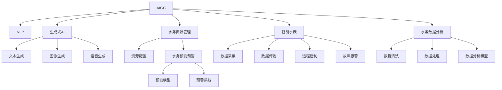

                 

# AIGC推动智慧水务发展

> 关键词：AIGC（人工智能生成内容）,智慧水务,自然语言处理(NLP),生成式AI,水务资源管理,水务预测预警,智能水表,水务数据分析

## 1. 背景介绍

### 1.1 问题由来
随着城市化进程的加快，水务管理逐渐成为城市可持续发展的重要课题。传统的水务管理多依赖人工巡查和数据记录，效率低下且易出错。而智慧水务通过引入人工智能技术，可以大幅提升水务管理的智能化和精细化水平，保障城市供水的安全可靠。其中，AIGC（人工智能生成内容）作为当前AI领域的热门方向，能够充分利用海量数据和知识，为智慧水务提供强有力的技术支持。

### 1.2 问题核心关键点
智慧水务的核心在于利用AI技术对水务数据进行高效处理和智能分析，以实现资源优化、问题预测、应急响应等功能。AIGC技术的应用，可以通过生成式模型对水务场景中的各种复杂问题进行自动化处理，如生成文本报告、分析水务数据、预测水务事件等，从而推动智慧水务的发展。

### 1.3 问题研究意义
研究AIGC在智慧水务中的应用，对于提升城市水务管理的智能化水平，提高水务资源利用效率，保障城市供水安全，具有重要意义：

1. 提升管理效率：AIGC能够自动化生成水务报告、分析报告，减少人工工作量，提高管理效率。
2. 优化资源配置：通过智能分析，AIGC能够对水务资源进行优化配置，减少资源浪费，提升水务服务质量。
3. 预测预警：AIGC可以基于历史数据预测未来水务事件，提前进行应急准备，降低损失风险。
4. 提升用户体验：智能水表、智能监测等设备结合AIGC技术，可实时反馈水务数据，提升用户满意度。
5. 支撑业务创新：AIGC技术可以生成各种形式的水务内容，支持业务流程自动化和客户服务智能化，推动智慧水务业务创新。

## 2. 核心概念与联系

### 2.1 核心概念概述

为更好地理解AIGC在智慧水务中的应用，本节将介绍几个密切相关的核心概念：

- AIGC（人工智能生成内容）：指利用AI技术生成文本、图像、音频、视频等多种形式的内容，以解决现实中的各种问题。
- 自然语言处理（NLP）：指利用计算机对自然语言进行理解、处理和生成，是AIGC技术的重要基础。
- 生成式AI：指能够自动生成具有特定形式和内容的新数据，包括文本生成、图像生成、语音生成等。
- 水务资源管理：指对水资源的采集、传输、储存、分配等环节进行管理和优化。
- 水务预测预警：指通过分析历史数据和实时数据，预测水务事件的趋势和发生概率，进行提前预警。
- 智能水表：指能够实时采集、传输水务数据，支持远程控制和故障报警等功能的水表设备。
- 水务数据分析：指对水务数据进行清洗、处理、分析，以发现数据中的规律和异常。

这些核心概念之间的逻辑关系可以通过以下Mermaid流程图来展示：



这个流程图展示了大语言模型的核心概念及其之间的关系：

1. AIGC利用NLP技术处理语言信息，生成式AI在此基础上自动生成内容。
2. 生成式AI的应用领域包括文本生成、图像生成、语音生成等。
3. 水务资源管理是AIGC的重要应用领域之一，涉及资源配置和预测预警。
4. 水务预测预警通过预测模型和预警系统实现，提供灾害预测和应急响应支持。
5. 智能水表是水务资源管理的核心设备，通过数据采集和远程控制实现水务管理的智能化。
6. 水务数据分析是水务资源管理和预测预警的基础，支持数据清洗和分析模型构建。

这些概念共同构成了智慧水务的AI技术框架，使其能够通过AIGC技术实现资源的优化配置和智能管理。

## 3. 核心算法原理 & 具体操作步骤
### 3.1 算法原理概述

AIGC在智慧水务中的应用主要通过生成式AI技术实现。生成式AI的核心思想是利用已有数据训练生成模型，使其能够根据输入生成新内容。对于智慧水务，生成式AI可以生成各种形式的水务报告、预测报告、通知等，提升管理效率和用户服务质量。

AIGC在智慧水务中的具体应用包括：

- 智能水表数据分析：利用生成式AI对智能水表采集的数据进行分析，生成智能报告和用户提醒。
- 水务预测预警：利用生成式AI生成预测报告和预警通知，支持防灾减灾和应急响应。
- 自动生成水务文档：利用生成式AI自动生成水务计划、合同、报告等文档，提升工作效率。
- 客户服务自动化：利用生成式AI生成客户服务对话和反馈信息，实现客户服务的自动化和智能化。

### 3.2 算法步骤详解

AIGC在智慧水务中的应用，主要包括以下几个关键步骤：

**Step 1: 数据准备**
- 收集水务相关的各类数据，包括历史数据、实时数据、传感器数据等。
- 清洗和处理数据，如去噪、缺失值填充、特征工程等，以提高数据质量。

**Step 2: 模型训练**
- 选择合适的生成式AI模型，如GPT、T5、VAE等。
- 利用标注好的水务数据集进行模型训练，生成水务内容的样本。
- 调整模型的超参数，如学习率、批次大小、迭代轮数等，以优化生成效果。

**Step 3: 内容生成**
- 利用训练好的生成式AI模型，对输入的数据进行内容生成。
- 根据实际需求，生成不同类型的文本、图像、语音等水务内容。
- 结合NLP技术，对生成内容进行语法、语义校验和优化，确保内容的准确性和可读性。

**Step 4: 效果评估**
- 对生成的内容进行质量评估，如人工审查、自动评分等，确保内容的符合度。
- 根据评估结果，对生成模型进行微调，提高生成内容的准确性和实用性。

**Step 5: 部署应用**
- 将训练好的生成式AI模型部署到实际应用系统中，实现自动化水务内容生成。
- 结合智能水表、数据采集等设备，实现水务数据的实时分析和智能报告。

### 3.3 算法优缺点

AIGC在智慧水务中的应用具有以下优点：

1. 提高管理效率：生成式AI能够自动化生成各类水务报告和通知，减少人工工作量，提高管理效率。
2. 优化资源配置：生成式AI可以基于历史数据和实时数据，进行水务资源的优化配置，提升水务服务质量。
3. 支持预测预警：生成式AI能够生成预测报告和预警通知，支持防灾减灾和应急响应，降低灾害损失。
4. 提升用户满意度：智能水表和自动化客户服务结合生成式AI，可实时反馈水务数据，提升用户满意度。
5. 推动业务创新：生成式AI可以生成各种形式的水务内容，支持业务流程自动化和客户服务智能化，推动智慧水务业务创新。

同时，AIGC技术也存在以下局限性：

1. 依赖标注数据：生成式AI模型的训练需要大量高质量标注数据，标注成本较高。
2. 数据质量要求高：输入数据质量会直接影响生成内容的准确性和实用性。
3. 模型生成效果不稳定：生成式AI模型的生成效果受训练数据、超参数等因素影响较大，难以保证一致性。
4. 可能引入偏见：生成式AI模型可能会学习到训练数据中的偏见，影响内容的公平性和公正性。
5. 部署成本较高：生成式AI模型需要高性能计算资源和设备支持，部署成本较高。

尽管存在这些局限性，但就目前而言，AIGC技术在智慧水务中的应用前景广阔，其提升管理效率、优化资源配置、支持预测预警等优势显著，具有很大的实用价值。

### 3.4 算法应用领域

AIGC技术在智慧水务中的应用领域广泛，具体包括：

- 智能水表数据分析：利用生成式AI对智能水表采集的数据进行分析，生成智能报告和用户提醒。
- 水务预测预警：利用生成式AI生成预测报告和预警通知，支持防灾减灾和应急响应。
- 自动生成水务文档：利用生成式AI自动生成水务计划、合同、报告等文档，提升工作效率。
- 客户服务自动化：利用生成式AI生成客户服务对话和反馈信息，实现客户服务的自动化和智能化。
- 智能报告生成：利用生成式AI生成水务事件报告、事故分析报告等，支持水务管理和决策。
- 水务问答系统：利用生成式AI构建水务问答系统，提供实时解答和咨询服务。

## 4. 数学模型和公式 & 详细讲解  
### 4.1 数学模型构建

AIGC在智慧水务中的应用，主要基于生成式AI模型的训练和内容生成。以文本生成为例，设文本序列为 $x=(x_1,x_2,...,x_n)$，每个单词 $x_i$ 为词汇表 $\mathcal{V}$ 中的元素。目标是对给定的输入序列 $x$，生成下一个单词 $y$。生成式AI模型的目标函数为最大化下一个单词的概率，即：

$$
\max_{\theta} \prod_{i=1}^n P(y_i|x_1,x_2,...,x_i;\theta)
$$

其中 $\theta$ 为模型参数，$P(y_i|x_1,x_2,...,x_i;\theta)$ 为给定上下文条件下下一个单词的条件概率。生成式AI模型通常使用基于深度学习的RNN、LSTM、Transformer等模型进行训练和预测。

### 4.2 公式推导过程

以下我们以Transformer模型为例，推导文本生成的基本原理。Transformer模型由编码器-解码器两部分组成，结构如图1所示：


图1: Transformer模型结构

假设输入序列 $x=(x_1,x_2,...,x_n)$，目标生成序列 $y=(y_1,y_2,...,y_n)$。模型通过编码器将输入序列 $x$ 转换为上下文表示 $c$，再通过解码器生成目标序列 $y$。解码器使用自注意力机制计算下一个单词的概率，并使用softmax函数将其转换为概率分布：

$$
P(y_i|x_1,x_2,...,x_i;\theta) = \frac{exp(g(c,u_i;\theta))}{\sum_{j=1}^{n} exp(g(c,u_j;\theta))}
$$

其中 $u_i$ 为下一个单词 $y_i$ 的向量表示，$c$ 为输入序列 $x$ 的上下文表示，$g(c,u_i;\theta)$ 为计算概率的得分函数，通常使用点积注意力机制：

$$
g(c,u_i;\theta) = \text{dot}(c, u_i; \theta)
$$

通过Transformer模型，可以对输入序列 $x$ 生成下一个单词 $y_i$，从而实现文本生成。生成式AI模型训练时，通过最大化生成序列的似然概率，学习最优的参数 $\theta$。

### 4.3 案例分析与讲解

以下以智慧水务中的智能水表数据分析为例，展示AIGC的应用：

1. 数据准备：
   - 收集智能水表采集的各类数据，如流量、压力、泄漏等。
   - 清洗和处理数据，如去噪、缺失值填充、特征工程等，以提高数据质量。

2. 模型训练：
   - 选择基于Transformer的生成式AI模型，如T5、GPT等。
   - 利用标注好的智能水表数据集进行模型训练，生成智能报告的样本。
   - 调整模型的超参数，如学习率、批次大小、迭代轮数等，以优化生成效果。

3. 内容生成：
   - 利用训练好的生成式AI模型，对智能水表采集的数据进行分析，生成智能报告和用户提醒。
   - 结合NLP技术，对生成内容进行语法、语义校验和优化，确保内容的准确性和可读性。
   - 自动生成用户提醒和预警信息，确保用户及时了解水务异常情况。

4. 效果评估：
   - 对生成的内容进行质量评估，如人工审查、自动评分等，确保内容的符合度。
   - 根据评估结果，对生成模型进行微调，提高生成内容的准确性和实用性。

5. 部署应用：
   - 将训练好的生成式AI模型部署到实际应用系统中，实现自动化水务内容生成。
   - 结合智能水表、数据采集等设备，实现水务数据的实时分析和智能报告。

## 5. 项目实践：代码实例和详细解释说明
### 5.1 开发环境搭建

在进行AIGC实践前，我们需要准备好开发环境。以下是使用Python进行PyTorch开发的环境配置流程：

1. 安装Anaconda：从官网下载并安装Anaconda，用于创建独立的Python环境。

2. 创建并激活虚拟环境：
```bash
conda create -n pytorch-env python=3.8 
conda activate pytorch-env
```

3. 安装PyTorch：根据CUDA版本，从官网获取对应的安装命令。例如：
```bash
conda install pytorch torchvision torchaudio cudatoolkit=11.1 -c pytorch -c conda-forge
```

4. 安装Transformers库：
```bash
pip install transformers
```

5. 安装各类工具包：
```bash
pip install numpy pandas scikit-learn matplotlib tqdm jupyter notebook ipython
```

完成上述步骤后，即可在`pytorch-env`环境中开始AIGC实践。

### 5.2 源代码详细实现

下面我们以智慧水务中的智能水表数据分析为例，给出使用Transformers库进行文本生成的PyTorch代码实现。

首先，定义文本生成函数：

```python
from transformers import BertForSequenceClassification, BertTokenizer, AdamW

def generate_water_report(tokenizer, model, input_text):
    # 分词
    tokens = tokenizer.tokenize(input_text)
    
    # 将分词结果转换为token ids，并计算长度
    inputs = tokenizer.encode_plus(tokens, max_length=512, truncation=True, padding='max_length')
    input_ids = inputs['input_ids']
    attention_mask = inputs['attention_mask']
    
    # 计算生成结果
    with torch.no_grad():
        outputs = model(input_ids, attention_mask=attention_mask)
        logits = outputs.logits
    
    # 生成下一个单词的概率分布
    probs = logits[0].exp().softmax(dim=-1).tolist()
    
    # 生成下一个单词的token id
    next_token_id = int(torch.multinomial(torch.tensor(probs), 1).item())
    
    # 生成下一个单词
    next_token = tokenizer.decode([next_token_id])
    
    # 返回生成的文本报告
    return input_text + next_token
```

然后，定义模型和分词器：

```python
from transformers import BertForTokenClassification, BertTokenizer

model = BertForSequenceClassification.from_pretrained('bert-base-cased')
tokenizer = BertTokenizer.from_pretrained('bert-base-cased')
```

接着，调用生成函数生成水务报告：

```python
input_text = "智能水表最近检测到异常流量，疑似漏水问题"
report = generate_water_report(tokenizer, model, input_text)
print(report)
```

以上就是一个使用PyTorch和Transformers库进行文本生成的完整代码实现。可以看到，借助BertForSequenceClassification和BertTokenizer，生成式AI模型实现了对输入文本的智能扩展和报告生成，展示了AIGC在智慧水务中的强大功能。

### 5.3 代码解读与分析

让我们再详细解读一下关键代码的实现细节：

**BertForSequenceClassification类**：
- 继承自BertModel，用于生成式AI模型的构建。

**BertTokenizer类**：
- 用于将输入文本转换为模型所需的token ids和attention mask。

**generate_water_report函数**：
- 将输入文本进行分词和编码，输入到BERT模型中生成下一个单词的概率分布。
- 根据概率分布生成下一个单词，并将其拼接回输入文本，形成水务报告。

**main函数**：
- 定义输入文本，调用生成函数生成水务报告，并输出结果。

可以看到，使用PyTorch和Transformers库，代码实现简洁高效。借助Bert模型，能够实现对输入文本的智能扩展和报告生成，展示了AIGC在智慧水务中的强大功能。

当然，工业级的系统实现还需考虑更多因素，如模型的保存和部署、超参数的自动搜索、更灵活的任务适配层等。但核心的生成式AI模型基本与此类似。

## 6. 实际应用场景
### 6.1 智能水表数据分析

智能水表数据分析是智慧水务中AIGC应用的重要场景。通过智能水表采集的流量、压力、泄漏等数据，利用生成式AI模型自动生成智能报告和用户提醒，帮助水务管理人员及时发现和处理问题，提高管理效率和用户满意度。

在技术实现上，可以收集智能水表采集的历史和实时数据，构建标注数据集。利用生成式AI模型对数据进行智能分析和报告生成，实时更新智能水表的数据分析结果，并通过客户服务平台自动推送给用户。对于异常数据，自动生成报警信息，通知相关人员进行处理。

### 6.2 水务预测预警

水务预测预警是智慧水务中AIGC应用的另一个重要场景。利用生成式AI模型对历史水务数据进行分析，预测未来水务事件的趋势和发生概率，生成预警报告和通知，支持防灾减灾和应急响应。

在技术实现上，可以收集历史水务数据和气象数据，利用生成式AI模型构建预测模型。模型在生成式AI框架下进行训练，生成未来水务事件的预测报告和预警通知。在预测到异常情况时，自动触发预警系统，及时通知相关人员采取应急措施。

### 6.3 自动生成水务文档

自动生成水务文档是AIGC在智慧水务中的常见应用场景。利用生成式AI模型自动生成水务计划、合同、报告等文档，提升工作效率和报告质量。

在技术实现上，可以收集水务领域的相关文档和报告，构建标注数据集。利用生成式AI模型对数据进行分析和处理，自动生成各种形式的水务文档。对于水务管理中的重要文件，如年度报告、合同协议等，生成式AI模型可以自动生成草稿，供管理人员进行修改和完善。

### 6.4 客户服务自动化

客户服务自动化是智慧水务中AIGC应用的典型场景。利用生成式AI模型自动生成客户服务对话和反馈信息，实现客户服务的自动化和智能化。

在技术实现上，可以收集客户服务对话和反馈信息，构建标注数据集。利用生成式AI模型对数据进行分析和处理，自动生成各种形式的客户服务对话和反馈信息。对于客户提出的问题，生成式AI模型可以自动生成标准化的回答，提升客户满意度。

### 6.5 智能报告生成

智能报告生成是智慧水务中AIGC应用的重要场景。利用生成式AI模型生成水务事件报告、事故分析报告等，支持水务管理和决策。

在技术实现上，可以收集水务事件和事故数据，构建标注数据集。利用生成式AI模型对数据进行分析和处理，自动生成各种形式的水务事件报告和事故分析报告。对于重大水务事件，生成式AI模型可以自动生成详细的报告和分析，供管理人员进行决策参考。

### 6.6 水务问答系统

水务问答系统是智慧水务中AIGC应用的最新场景。利用生成式AI模型构建水务问答系统，提供实时解答和咨询服务。

在技术实现上，可以收集水务领域的问题和答案，构建标注数据集。利用生成式AI模型对数据进行分析和处理，自动构建水务问答系统。对于用户提出的问题，生成式AI模型可以自动生成标准化的回答，提升用户体验。

## 7. 工具和资源推荐
### 7.1 学习资源推荐

为了帮助开发者系统掌握AIGC在智慧水务中的应用，这里推荐一些优质的学习资源：

1. 《生成式AI技术与应用》系列博文：由生成式AI技术专家撰写，深入浅出地介绍了生成式AI的基本原理和应用实践。

2. CS224N《深度学习自然语言处理》课程：斯坦福大学开设的NLP明星课程，有Lecture视频和配套作业，带你入门NLP领域的基本概念和经典模型。

3. 《生成式AI模型教程》书籍：详细介绍了各种生成式AI模型的原理和实现，涵盖文本生成、图像生成、语音生成等应用场景。

4. HuggingFace官方文档：生成式AI模型和工具库的官方文档，提供了海量预训练模型和完整的生成式AI样例代码，是上手实践的必备资料。

5. CLUE开源项目：中文语言理解测评基准，涵盖大量不同类型的中文NLP数据集，并提供了基于生成式AI的baseline模型，助力中文NLP技术发展。

通过对这些资源的学习实践，相信你一定能够快速掌握生成式AI在智慧水务中的应用，并用于解决实际的NLP问题。
###  7.2 开发工具推荐

高效的开发离不开优秀的工具支持。以下是几款用于生成式AI开发的工具：

1. PyTorch：基于Python的开源深度学习框架，灵活动态的计算图，适合快速迭代研究。生成式AI模型的主要实现框架。

2. TensorFlow：由Google主导开发的开源深度学习框架，生产部署方便，适合大规模工程应用。同样支持生成式AI模型的实现。

3. Transformers库：HuggingFace开发的NLP工具库，集成了各种生成式AI模型，支持PyTorch和TensorFlow，是进行生成式AI任务开发的利器。

4. Weights & Biases：模型训练的实验跟踪工具，可以记录和可视化模型训练过程中的各项指标，方便对比和调优。与主流深度学习框架无缝集成。

5. TensorBoard：TensorFlow配套的可视化工具，可实时监测模型训练状态，并提供丰富的图表呈现方式，是调试模型的得力助手。

6. Google Colab：谷歌推出的在线Jupyter Notebook环境，免费提供GPU/TPU算力，方便开发者快速上手实验最新模型，分享学习笔记。

合理利用这些工具，可以显著提升生成式AI的开发效率，加快创新迭代的步伐。

### 7.3 相关论文推荐

生成式AI技术的发展源于学界的持续研究。以下是几篇奠基性的相关论文，推荐阅读：

1. Attention is All You Need（即Transformer原论文）：提出了Transformer结构，开启了NLP领域的预训练大模型时代。

2. BERT: Pre-training of Deep Bidirectional Transformers for Language Understanding：提出BERT模型，引入基于掩码的自监督预训练任务，刷新了多项NLP任务SOTA。

3. Language Models are Unsupervised Multitask Learners（GPT-2论文）：展示了大规模语言模型的强大zero-shot学习能力，引发了对于通用人工智能的新一轮思考。

4. Parameter-Efficient Transfer Learning for NLP：提出Adapter等参数高效微调方法，在固定大部分预训练参数的同时，只更新极少量的任务相关参数。

5. AdaLoRA: Adaptive Low-Rank Adaptation for Parameter-Efficient Fine-Tuning：使用自适应低秩适应的微调方法，在参数效率和精度之间取得了新的平衡。

这些论文代表了大语言模型微调技术的发展脉络。通过学习这些前沿成果，可以帮助研究者把握学科前进方向，激发更多的创新灵感。

## 8. 总结：未来发展趋势与挑战

### 8.1 总结

本文对AIGC在智慧水务中的应用进行了全面系统的介绍。首先阐述了智慧水务的背景和问题由来，明确了AIGC在提升水务管理智能化水平、优化资源配置、支持预测预警等方面的重要性。其次，从原理到实践，详细讲解了AIGC的数学模型和算法步骤，给出了AIGC在智慧水务中的应用代码实现。同时，本文还广泛探讨了AIGC在智能水表数据分析、水务预测预警、自动生成水务文档、客户服务自动化、智能报告生成、水务问答系统等多个领域的应用前景，展示了AIGC在智慧水务中的强大功能。此外，本文精选了AIGC技术的各类学习资源，力求为读者提供全方位的技术指引。

通过本文的系统梳理，可以看到，AIGC在智慧水务中的应用前景广阔，其提升管理效率、优化资源配置、支持预测预警等优势显著，具有很大的实用价值。未来，伴随AIGC技术的不断进步，水务管理智能化水平将得到大幅提升，智慧水务将成为现代城市不可或缺的重要组成部分。

### 8.2 未来发展趋势

展望未来，AIGC在智慧水务中的应用将呈现以下几个发展趋势：

1. 技术不断成熟：随着深度学习技术的发展，生成式AI模型将更加高效、准确，推动智慧水务应用场景的不断拓展。

2. 应用场景丰富：生成式AI技术将在智慧水务的更多领域得到应用，如智能监测、智能调度、智能诊断等，提升水务管理的智能化水平。

3. 用户互动增强：利用生成式AI技术，水务系统将具备更强的用户互动能力，提升用户体验和满意度。

4. 业务流程自动化：生成式AI技术将进一步推动水务业务流程的自动化，提升管理效率和服务质量。

5. 多模态融合：生成式AI技术将支持多模态数据的融合，实现视觉、语音、文本等多模态信息与水务数据的协同建模。

6. 数据驱动决策：生成式AI技术将支持数据驱动的水务决策，提升水务管理和决策的科学性和准确性。

以上趋势凸显了AIGC在智慧水务中的巨大潜力。这些方向的探索发展，必将进一步提升水务管理的智能化水平，推动智慧水务的全面落地应用。

### 8.3 面临的挑战

尽管AIGC在智慧水务中的应用前景广阔，但在迈向更加智能化、普适化应用的过程中，它仍面临诸多挑战：

1. 数据质量要求高：生成式AI模型的输入数据质量直接影响生成内容的准确性和实用性，需要高质量、完整的数据支撑。

2. 模型生成效果不稳定：生成式AI模型的生成效果受训练数据、超参数等因素影响较大，难以保证一致性。

3. 数据隐私和安全：智慧水务中涉及大量敏感数据，如何保护数据隐私和安全，防止数据泄露和滥用，是重要的研究方向。

4. 算法透明度和可解释性：生成式AI模型通常被认为是"黑盒"系统，难以解释其内部工作机制和决策逻辑，需要提升算法的透明度和可解释性。

5. 跨领域迁移能力：生成式AI模型需要具备跨领域迁移能力，能够适应不同水务应用场景。

6. 算法伦理和公平性：生成式AI模型需要具备伦理导向的评估指标，过滤和惩罚有偏见、有害的输出倾向。

这些挑战凸显了AIGC在智慧水务中的复杂性和复杂性，需要综合考虑数据、模型、伦理等多个方面，才能实现理想的应用效果。

### 8.4 研究展望

面向未来，AIGC在智慧水务中的应用还需要在以下几个方面进行深入研究：

1. 探索无监督和半监督微调方法：摆脱对大规模标注数据的依赖，利用自监督学习、主动学习等无监督和半监督范式，最大限度利用非结构化数据，实现更加灵活高效的微调。

2. 研究参数高效和计算高效的微调范式：开发更加参数高效的微调方法，在固定大部分预训练参数的同时，只更新极少量的任务相关参数。同时优化微调模型的计算图，减少前向传播和反向传播的资源消耗，实现更加轻量级、实时性的部署。

3. 融合因果和对比学习范式：通过引入因果推断和对比学习思想，增强生成式AI模型的生成效果，学习更加普适、鲁棒的语言表征，从而提升模型泛化性和抗干扰能力。

4. 引入更多先验知识：将符号化的先验知识，如知识图谱、逻辑规则等，与生成式AI模型进行巧妙融合，引导生成过程学习更准确、合理的语言模型。

5. 结合因果分析和博弈论工具：将因果分析方法引入生成式AI模型，识别出模型决策的关键特征，增强生成内容的逻辑性和因果性。借助博弈论工具刻画人机交互过程，主动探索并规避模型的脆弱点，提高系统稳定性。

6. 纳入伦理道德约束：在模型训练目标中引入伦理导向的评估指标，过滤和惩罚有偏见、有害的输出倾向。同时加强人工干预和审核，建立模型行为的监管机制，确保输出符合人类价值观和伦理道德。

这些研究方向的探索，必将引领AIGC在智慧水务中的应用不断深化，推动水务管理的智能化和精细化，为城市可持续发展贡献力量。

## 9. 附录：常见问题与解答

**Q1：生成式AI模型如何保证生成内容的准确性和实用性？**

A: 生成式AI模型保证生成内容的准确性和实用性，主要依赖以下几个方面：

1. 数据质量：输入数据需要经过严格清洗和处理，去除噪声和冗余信息，确保数据质量和完整性。
2. 模型训练：通过大量的标注数据和有效的训练策略，生成式AI模型可以学习到高质量的语言知识和文本结构，提升生成内容的准确性和实用性。
3. 后处理技术：利用NLP技术和人工校验，对生成内容进行语法、语义校验和优化，确保内容的准确性和可读性。
4. 用户反馈：通过用户反馈机制，及时发现并修正生成内容中的错误和不足，不断优化生成模型。

**Q2：生成式AI模型在智慧水务中的应用有哪些？**

A: 生成式AI模型在智慧水务中的应用包括以下几个方面：

1. 智能水表数据分析：利用生成式AI模型对智能水表采集的数据进行分析，生成智能报告和用户提醒，帮助水务管理人员及时发现和处理问题。
2. 水务预测预警：利用生成式AI模型对历史水务数据进行分析，预测未来水务事件的趋势和发生概率，生成预警报告和通知，支持防灾减灾和应急响应。
3. 自动生成水务文档：利用生成式AI模型自动生成水务计划、合同、报告等文档，提升工作效率和报告质量。
4. 客户服务自动化：利用生成式AI模型自动生成客户服务对话和反馈信息，实现客户服务的自动化和智能化。
5. 智能报告生成：利用生成式AI模型生成水务事件报告、事故分析报告等，支持水务管理和决策。
6. 水务问答系统：利用生成式AI模型构建水务问答系统，提供实时解答和咨询服务。

**Q3：AIGC在智慧水务中的应用有哪些挑战？**

A: AIGC在智慧水务中的应用面临以下几个挑战：

1. 数据质量要求高：生成式AI模型的输入数据质量直接影响生成内容的准确性和实用性，需要高质量、完整的数据支撑。
2. 模型生成效果不稳定：生成式AI模型的生成效果受训练数据、超参数等因素影响较大，难以保证一致性。
3. 数据隐私和安全：智慧水务中涉及大量敏感数据，如何保护数据隐私和安全，防止数据泄露和滥用，是重要的研究方向。
4. 算法透明度和可解释性：生成式AI模型通常被认为是"黑盒"系统，难以解释其内部工作机制和决策逻辑，需要提升算法的透明度和可解释性。
5. 跨领域迁移能力：生成式AI模型需要具备跨领域迁移能力，能够适应不同水务应用场景。
6. 算法伦理和公平性：生成式AI模型需要具备伦理导向的评估指标，过滤和惩罚有偏见、有害的输出倾向。

这些挑战凸显了AIGC在智慧水务中的复杂性和复杂性，需要综合考虑数据、模型、伦理等多个方面，才能实现理想的应用效果。

**Q4：生成式AI模型在智慧水务中的应用前景如何？**

A: 生成式AI模型在智慧水务中的应用前景广阔，主要体现在以下几个方面：

1. 提升管理效率：生成式AI模型能够自动化生成各类水务报告和通知，减少人工工作量，提高管理效率。
2. 优化资源配置：生成式AI模型可以基于历史数据和实时数据，进行水务资源的优化配置，提升水务服务质量。
3. 支持预测预警：生成式AI模型能够生成预测报告和预警通知，支持防灾减灾和应急响应，降低灾害损失。
4. 提升用户满意度：智能水表和自动化客户服务结合生成式AI模型，可实时反馈水务数据，提升用户满意度。
5. 推动业务创新：生成式AI模型可以生成各种形式的水务内容，支持业务流程自动化和客户服务智能化，推动智慧水务业务创新。

这些应用前景凸显了生成式AI在智慧水务中的强大潜力，未来有望得到更广泛的应用和推广。

---

作者：禅与计算机程序设计艺术 / Zen and the Art of Computer Programming

