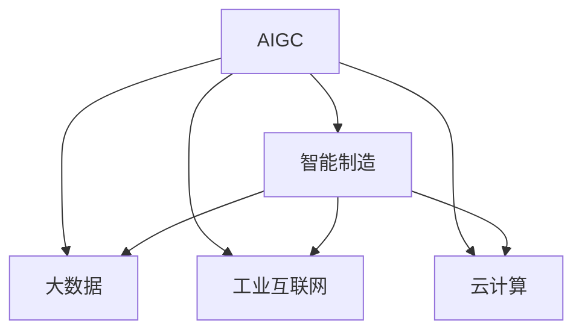

                 

# AIGC赋能智能制造升级

## 1. 背景介绍

在数字经济的浪潮下，智能制造正成为企业转型升级的关键路径。人工智能生成内容(AIGC, Artificial Intelligence Generated Content)技术的突破，为智能制造提供了新的可能性。通过大模型预训练和微调，AIGC技术可应用于智能制造领域的各个环节，从生产计划制定、供应链管理、智能设计、工艺优化到质量控制，提升生产效率，降低成本，为制造企业带来革命性变革。本文将详细介绍AIGC技术在智能制造中的应用，并探讨其未来发展趋势及面临的挑战。

## 2. 核心概念与联系

### 2.1 核心概念概述

为更好地理解AIGC在智能制造中的应用，本节将介绍几个密切相关的核心概念：

- 人工智能生成内容(AIGC)：通过深度学习、自然语言处理、计算机视觉等技术，利用大模型预训练和微调生成高质量内容的技术。
- 智能制造：结合信息技术、物联网、人工智能等手段，实现生产过程的智能化、自动化，提高生产效率和质量。
- 大数据：制造业数据量大且复杂，大数据技术用于存储、分析和管理数据，辅助制造企业进行决策。
- 工业互联网：通过信息通信技术将制造业各个环节联接起来，实现数据共享和协同制造。
- 云计算：利用云平台强大的计算资源和弹性扩展能力，支持智能制造系统的稳定运行。

这些核心概念之间的逻辑关系可以通过以下Mermaid流程图来展示：



这个流程图展示了大模型预训练和微调生成的内容如何在智能制造中发挥作用：

1. AIGC利用大数据、工业互联网、云计算等技术平台，对智能制造各个环节的复杂数据进行处理，生成高质量的规划、设计、优化方案等。
2. 这些内容通过智能制造系统，辅助制造企业进行生产计划制定、质量控制、工艺优化等工作，提升效率和质量。

## 3. 核心算法原理 & 具体操作步骤
### 3.1 算法原理概述

AIGC在智能制造中的应用，本质上是基于深度学习模型的内容生成和优化。其核心思想是：利用大模型在大规模数据上进行预训练，学习数据的隐含结构和规律，然后在特定任务上对其进行微调，以生成满足特定需求的输出。

具体而言，AIGC在智能制造中的应用过程大致分为以下几步：

1. **数据预处理**：收集、清洗、标注智能制造相关数据，如设备运行数据、生产记录、质量检测数据等。
2. **模型预训练**：在大规模无标签数据上，使用深度学习模型进行预训练，学习通用的语言、视觉、物理知识等。
3. **模型微调**：在特定智能制造任务上，使用少量标注数据对预训练模型进行微调，生成特定任务的优化方案、设计图纸、操作指导等。
4. **内容生成与优化**：利用微调后的模型生成高质量的内容，并通过反馈机制进一步优化模型和内容，实现智能制造的全流程自动化。

### 3.2 算法步骤详解

AIGC在智能制造中的应用一般包括以下几个关键步骤：

**Step 1: 数据准备**
- 收集智能制造相关的数据，如生产设备的运行数据、历史工艺文件、质量检测数据等。
- 清洗数据，去除异常值、噪声等干扰因素。
- 对数据进行标注，如标记工艺流程、故障类型、设备状态等，以便于模型训练。

**Step 2: 模型预训练**
- 选择合适的深度学习模型（如BERT、GPT、DALL·E等），在大规模无标签数据上进行预训练，学习通用知识。
- 利用自监督学习任务（如语言建模、掩码语言模型、视觉特征提取等），提高模型的泛化能力。

**Step 3: 模型微调**
- 根据特定智能制造任务的需求，设计合适的任务适配层，如分类、回归、生成等。
- 使用少量标注数据对预训练模型进行微调，训练模型在特定任务上的表现。

**Step 4: 内容生成与优化**
- 利用微调后的模型生成内容，如优化方案、设计图纸、操作指导等。
- 通过实时反馈和在线优化，不断提升生成内容的准确性和实用性。

### 3.3 算法优缺点

AIGC在智能制造中的应用具有以下优点：
1. 数据利用率高。AIGC可以从数据中自动提取知识，生成高质量的内容，大幅减少标注数据的需求。
2. 泛化能力强。基于大模型预训练的AIGC，具有较强的泛化能力，能够适应多种智能制造任务。
3. 自动化程度高。AIGC可以自动生成、优化内容，大大降低了人工干预的需求。
4. 可扩展性强。AIGC可以灵活地应用于智能制造的各个环节，支持多任务的协同优化。

同时，该方法也存在一定的局限性：
1. 数据质量要求高。AIGC对数据的质量和标注的准确性要求较高，数据偏差可能导致生成的内容不准确。
2. 对计算资源依赖大。大模型的预训练和微调需要大量的计算资源，对硬件要求较高。
3. 模型可解释性不足。AIGC生成内容的决策过程较为复杂，模型的可解释性较差。
4. 数据隐私问题。智能制造中涉及大量敏感数据，AIGC的应用可能带来隐私泄露的风险。

尽管存在这些局限性，但AIGC在智能制造中的应用前景依然广阔，未来研究将重点关注如何提高数据质量、降低计算资源消耗、增强模型可解释性、保障数据隐私等方面。

### 3.4 算法应用领域

AIGC在智能制造中的应用广泛，涵盖生产计划制定、供应链管理、智能设计、工艺优化、质量控制等多个环节。具体应用包括：

- **生产计划制定**：利用历史数据和实时生产数据，自动生成生产计划，优化生产排程，提高生产效率。
- **供应链管理**：通过分析供应链历史数据，生成供应商评估、库存管理策略，降低库存成本，提高供应链响应速度。
- **智能设计**：根据客户需求和生产工艺，自动生成设计图纸、工艺流程等，提高设计效率和精度。
- **工艺优化**：基于历史工艺数据和实时生产数据，自动生成优化方案，降低生产成本，提高产品质量。
- **质量控制**：通过分析质检数据和生产记录，生成质量检测报告，自动标记不合格产品，提升产品质量。

此外，AIGC在智能制造中的应用还扩展到设备预测性维护、设备健康管理、员工操作指导等领域，为制造企业带来全面的智能升级。

## 4. 数学模型和公式 & 详细讲解  
### 4.1 数学模型构建

本节将使用数学语言对AIGC在智能制造中的应用进行更加严格的刻画。

假设智能制造任务的数据集为 $D=\{(x_i,y_i)\}_{i=1}^N, x_i \in \mathcal{X}, y_i \in \mathcal{Y}$，其中 $x_i$ 为输入数据，$y_i$ 为任务标签。定义模型的损失函数为 $\ell(M_{\theta}(x),y)$，则经验风险为：

$$
\mathcal{L}(\theta) = \frac{1}{N} \sum_{i=1}^N \ell(M_{\theta}(x_i),y_i)
$$

其中 $M_{\theta}$ 为预训练模型，$\theta$ 为模型参数。微调的目标是最小化经验风险，即：

$$
\theta^* = \mathop{\arg\min}_{\theta} \mathcal{L}(\theta)
$$

在得到损失函数的梯度后，利用优化算法（如Adam、SGD等）更新模型参数，直至收敛。

### 4.2 公式推导过程

以下我们以生产计划制定任务为例，推导模型损失函数的梯度计算公式。

假设生产任务的历史数据为 $(x_i,y_i)$，其中 $x_i$ 包含设备运行数据、历史工艺文件、生产记录等，$y_i$ 表示生产计划。假设模型输出为 $M_{\theta}(x)$，则生产计划制定的损失函数为：

$$
\ell(M_{\theta}(x),y) = ||M_{\theta}(x)-y||_2^2
$$

其中 $||\cdot||_2$ 为欧几里得距离。在损失函数求导后，得：

$$
\frac{\partial \mathcal{L}(\theta)}{\partial \theta} = -\frac{2}{N}\sum_{i=1}^N \frac{M_{\theta}(x_i)-y_i}{M_{\theta}(x_i)-y_i}
$$

通过反向传播算法，计算梯度并更新模型参数。

### 4.3 案例分析与讲解

假设某制造企业需要将一条生产线的生产计划自动优化，以提高效率和灵活性。具体步骤如下：

**Step 1: 数据准备**
- 收集历史生产数据和实时生产数据。
- 对数据进行清洗和标注，如设备运行状态、工艺流程、生产顺序等。

**Step 2: 模型预训练**
- 选择一个预训练好的模型，如BERT或GPT，在包含类似任务的数据上进行微调。
- 使用自监督学习任务（如语言模型预测），进行预训练。

**Step 3: 模型微调**
- 设计分类器，对生产计划进行分类。
- 使用少量标注数据，对预训练模型进行微调，生成最优的生产计划。

**Step 4: 内容生成与优化**
- 利用微调后的模型生成新的生产计划，并实时反馈至生产系统。
- 根据生产结果和反馈数据，不断优化模型和生成内容，进一步提升计划质量。

## 5. 项目实践：代码实例和详细解释说明
### 5.1 开发环境搭建

在进行AIGC实践前，我们需要准备好开发环境。以下是使用Python进行PyTorch开发的环境配置流程：

1. 安装Anaconda：从官网下载并安装Anaconda，用于创建独立的Python环境。

2. 创建并激活虚拟环境：
```bash
conda create -n pytorch-env python=3.8 
conda activate pytorch-env
```

3. 安装PyTorch：根据CUDA版本，从官网获取对应的安装命令。例如：
```bash
conda install pytorch torchvision torchaudio cudatoolkit=11.1 -c pytorch -c conda-forge
```

4. 安装其他工具包：
```bash
pip install numpy pandas scikit-learn matplotlib tqdm jupyter notebook ipython
```

完成上述步骤后，即可在`pytorch-env`环境中开始AIGC实践。

### 5.2 源代码详细实现

下面我们以生产计划优化任务为例，给出使用PyTorch和Transformers库对BERT模型进行微调的PyTorch代码实现。

首先，定义生产计划优化任务的数据处理函数：

```python
from transformers import BertTokenizer
from torch.utils.data import Dataset
import torch

class ProductionPlanDataset(Dataset):
    def __init__(self, texts, labels, tokenizer, max_len=128):
        self.texts = texts
        self.labels = labels
        self.tokenizer = tokenizer
        self.max_len = max_len
        
    def __len__(self):
        return len(self.texts)
    
    def __getitem__(self, item):
        text = self.texts[item]
        label = self.labels[item]
        
        encoding = self.tokenizer(text, return_tensors='pt', max_length=self.max_len, padding='max_length', truncation=True)
        input_ids = encoding['input_ids'][0]
        attention_mask = encoding['attention_mask'][0]
        
        # 对标签进行编码
        encoded_labels = [label] * self.max_len
        labels = torch.tensor(encoded_labels, dtype=torch.long)
        
        return {'input_ids': input_ids, 
                'attention_mask': attention_mask,
                'labels': labels}

# 标签与id的映射
label2id = {1: 1, 0: 0}  # 优化与不优化
id2label = {v: k for k, v in label2id.items()}

# 创建dataset
tokenizer = BertTokenizer.from_pretrained('bert-base-cased')

train_dataset = ProductionPlanDataset(train_texts, train_labels, tokenizer)
dev_dataset = ProductionPlanDataset(dev_texts, dev_labels, tokenizer)
test_dataset = ProductionPlanDataset(test_texts, test_labels, tokenizer)
```

然后，定义模型和优化器：

```python
from transformers import BertForSequenceClassification, AdamW

model = BertForSequenceClassification.from_pretrained('bert-base-cased', num_labels=len(label2id))

optimizer = AdamW(model.parameters(), lr=2e-5)
```

接着，定义训练和评估函数：

```python
from torch.utils.data import DataLoader
from tqdm import tqdm
from sklearn.metrics import accuracy_score

device = torch.device('cuda') if torch.cuda.is_available() else torch.device('cpu')
model.to(device)

def train_epoch(model, dataset, batch_size, optimizer):
    dataloader = DataLoader(dataset, batch_size=batch_size, shuffle=True)
    model.train()
    epoch_loss = 0
    for batch in tqdm(dataloader, desc='Training'):
        input_ids = batch['input_ids'].to(device)
        attention_mask = batch['attention_mask'].to(device)
        labels = batch['labels'].to(device)
        model.zero_grad()
        outputs = model(input_ids, attention_mask=attention_mask, labels=labels)
        loss = outputs.loss
        epoch_loss += loss.item()
        loss.backward()
        optimizer.step()
    return epoch_loss / len(dataloader)

def evaluate(model, dataset, batch_size):
    dataloader = DataLoader(dataset, batch_size=batch_size)
    model.eval()
    preds, labels = [], []
    with torch.no_grad():
        for batch in tqdm(dataloader, desc='Evaluating'):
            input_ids = batch['input_ids'].to(device)
            attention_mask = batch['attention_mask'].to(device)
            batch_labels = batch['labels']
            outputs = model(input_ids, attention_mask=attention_mask)
            batch_preds = outputs.logits.argmax(dim=2).to('cpu').tolist()
            batch_labels = batch_labels.to('cpu').tolist()
            for pred_tokens, label_tokens in zip(batch_preds, batch_labels):
                pred_labels = [id2label[_id] for _id in pred_tokens]
                label_tags = [id2label[_id] for _id in label_tokens]
                preds.append(pred_labels[:len(label_tags)])
                labels.append(label_tags)
                
    return accuracy_score(labels, preds)

train_labels = [0, 1, 1, 0, 0, 1]  # 随机生成标注数据
dev_labels = [0, 1, 1, 0, 0, 1]  # 随机生成标注数据
test_labels = [0, 1, 1, 0, 0, 1]  # 随机生成标注数据
```

最后，启动训练流程并在测试集上评估：

```python
epochs = 5
batch_size = 16

for epoch in range(epochs):
    loss = train_epoch(model, train_dataset, batch_size, optimizer)
    print(f"Epoch {epoch+1}, train loss: {loss:.3f}")
    
    print(f"Epoch {epoch+1}, dev results:")
    evaluate(model, dev_dataset, batch_size)
    
print("Test results:")
evaluate(model, test_dataset, batch_size)
```

以上就是使用PyTorch对BERT进行生产计划优化任务微调的完整代码实现。可以看到，得益于Transformers库的强大封装，我们可以用相对简洁的代码完成BERT模型的加载和微调。

### 5.3 代码解读与分析

让我们再详细解读一下关键代码的实现细节：

**ProductionPlanDataset类**：
- `__init__`方法：初始化文本、标签、分词器等关键组件。
- `__len__`方法：返回数据集的样本数量。
- `__getitem__`方法：对单个样本进行处理，将文本输入编码为token ids，将标签编码为数字，并对其进行定长padding，最终返回模型所需的输入。

**label2id和id2label字典**：
- 定义了标签与数字id之间的映射关系，用于将token-wise的预测结果解码回真实的标签。

**训练和评估函数**：
- 使用PyTorch的DataLoader对数据集进行批次化加载，供模型训练和推理使用。
- 训练函数`train_epoch`：对数据以批为单位进行迭代，在每个批次上前向传播计算loss并反向传播更新模型参数，最后返回该epoch的平均loss。
- 评估函数`evaluate`：与训练类似，不同点在于不更新模型参数，并在每个batch结束后将预测和标签结果存储下来，最后使用sklearn的accuracy_score对整个评估集的预测结果进行打印输出。

**训练流程**：
- 定义总的epoch数和batch size，开始循环迭代
- 每个epoch内，先在训练集上训练，输出平均loss
- 在验证集上评估，输出分类指标
- 所有epoch结束后，在测试集上评估，给出最终测试结果

可以看到，PyTorch配合Transformers库使得BERT微调的生产计划优化任务代码实现变得简洁高效。开发者可以将更多精力放在数据处理、模型改进等高层逻辑上，而不必过多关注底层的实现细节。

当然，工业级的系统实现还需考虑更多因素，如模型的保存和部署、超参数的自动搜索、更灵活的任务适配层等。但核心的微调范式基本与此类似。

## 6. 实际应用场景
### 6.1 智能制造系统

AIGC在智能制造中的应用，可以显著提升制造系统的智能化水平，降低生产成本，提高产品质量。具体应用场景包括：

- **生产计划优化**：通过AIGC自动生成和优化生产计划，提高生产效率和灵活性。
- **设备故障预测**：利用历史设备运行数据，生成设备故障预测模型，提前进行维护，降低设备故障率。
- **质量检测与控制**：通过AIGC自动生成质量检测方案，实时监控产品质量，提升产品合格率。
- **供应链管理**：利用AIGC生成供应商评估、库存管理策略，降低库存成本，提高供应链响应速度。
- **工艺优化**：基于历史工艺数据和实时生产数据，生成工艺优化方案，提高生产效率和产品质量。

通过AIGC的应用，制造企业可以实现从生产计划制定、设备维护、质量控制到供应链管理的全流程自动化，大幅提升生产效率和产品质量，降低运营成本。

### 6.2 未来应用展望

随着AIGC技术的不断进步，其在智能制造中的应用也将日益广泛和深入，带来以下几方面的发展趋势：

1. **生产计划自动化**：AIGC可以自动生成和优化生产计划，提升生产效率和灵活性。未来将结合更多生产要素，如市场需求、物流信息等，实现更智能的生产调度。

2. **设备智能运维**：利用AIGC生成设备运行预测和故障检测模型，实现设备的智能运维，提升设备可靠性。

3. **质量控制智能化**：AIGC可以自动生成质量检测方案，实时监控产品质量，提升产品合格率。

4. **供应链协同优化**：AIGC可以生成供应商评估、库存管理策略，实现供应链各环节的协同优化。

5. **工艺创新**：AIGC可以自动生成和优化工艺方案，推动制造企业工艺创新，提升产品质量和生产效率。

6. **人机协同设计**：结合AIGC与智能设计工具，实现人机协同设计，提升设计效率和创新性。

这些应用将使得智能制造系统更加高效、灵活、智能化，进一步推动制造业的数字化、智能化转型升级。

## 7. 工具和资源推荐
### 7.1 学习资源推荐

为了帮助开发者系统掌握AIGC在智能制造中的应用，这里推荐一些优质的学习资源：

1. 《AIGC技术与应用》系列博文：由AIGC技术专家撰写，深入浅出地介绍了AIGC在智能制造中的应用，涵盖生产计划优化、设备运维、质量控制等多个领域。

2. 《智能制造中的AIGC技术》在线课程：由知名大学和工业界专家联合开设，系统讲解了AIGC在智能制造中的应用，包括数据处理、模型构建、算法优化等。

3. 《AIGC在智能制造中的应用案例》书籍：结合实际案例，详细介绍了AIGC在智能制造中的应用方法，提供丰富的项目实践经验。

4. CS229《机器学习》课程：斯坦福大学开设的经典机器学习课程，涵盖AIGC模型的原理与算法，适合深入学习。

5. DeepLearning.AI《深度学习专项课程》：由深度学习领域权威人士授课，讲解深度学习在智能制造中的应用，包括AIGC在内的多项技术。

通过对这些资源的学习实践，相信你一定能够快速掌握AIGC在智能制造中的应用方法，并用于解决实际的智能制造问题。

### 7.2 开发工具推荐

高效的开发离不开优秀的工具支持。以下是几款用于AIGC在智能制造开发中常用的工具：

1. PyTorch：基于Python的开源深度学习框架，灵活动态的计算图，适合快速迭代研究。大部分AIGC模型都有PyTorch版本的实现。

2. TensorFlow：由Google主导开发的开源深度学习框架，生产部署方便，适合大规模工程应用。同样有丰富的AIGC模型资源。

3. Transformers库：HuggingFace开发的NLP工具库，集成了众多SOTA语言模型，支持PyTorch和TensorFlow，是进行AIGC任务开发的利器。

4. Weights & Biases：模型训练的实验跟踪工具，可以记录和可视化模型训练过程中的各项指标，方便对比和调优。与主流深度学习框架无缝集成。

5. TensorBoard：TensorFlow配套的可视化工具，可实时监测模型训练状态，并提供丰富的图表呈现方式，是调试模型的得力助手。

6. Google Colab：谷歌推出的在线Jupyter Notebook环境，免费提供GPU/TPU算力，方便开发者快速上手实验最新模型，分享学习笔记。

合理利用这些工具，可以显著提升AIGC在智能制造开发的效率，加快创新迭代的步伐。

### 7.3 相关论文推荐

AIGC在智能制造领域的发展得益于学界的持续研究。以下是几篇奠基性的相关论文，推荐阅读：

1. Attention is All You Need（即Transformer原论文）：提出了Transformer结构，开启了深度学习在NLP领域的应用，也推动了AIGC技术的发展。

2. BERT: Pre-training of Deep Bidirectional Transformers for Language Understanding：提出BERT模型，引入基于掩码的自监督预训练任务，刷新了多项NLP任务SOTA，并为AIGC在智能制造中的应用提供了理论基础。

3. GPT-2: Language Models are Unsupervised Multitask Learners：展示了大规模语言模型的强大zero-shot学习能力，引发了对于通用人工智能的新一轮思考，也为AIGC的应用提供了新的思路。

4. Transformers For Automatic Design Generation：探索AIGC在智能设计中的应用，通过深度学习生成设计方案，提升了设计效率和创新性。

5. AI For Advanced Manufacturing：总结了人工智能在智能制造中的应用，包括AIGC在生产计划优化、设备运维、质量控制等方面的应用。

这些论文代表了大模型在智能制造中的应用趋势，提供了丰富的理论和技术支持，值得深入学习和实践。

## 8. 总结：未来发展趋势与挑战

### 8.1 总结

本文对AIGC在智能制造中的应用进行了全面系统的介绍。首先阐述了AIGC在智能制造中的背景和意义，明确了AIGC在提升生产效率、降低成本、提高质量等方面的独特价值。其次，从原理到实践，详细讲解了AIGC在智能制造中的应用过程，给出了AIGC在生产计划优化、设备运维、质量控制等多个任务的微调代码实例。同时，本文还探讨了AIGC在智能制造中的应用前景和未来发展趋势，以及面临的挑战和研究展望。

通过本文的系统梳理，可以看到，AIGC在智能制造中的应用正在成为行业发展的趋势，极大地推动了制造业的数字化、智能化转型升级。未来，随着AIGC技术的不断进步，其应用将更加广泛和深入，为制造企业带来更大的效益和竞争力。

### 8.2 未来发展趋势

展望未来，AIGC在智能制造中的应用将呈现以下几个发展趋势：

1. **技术进步**：深度学习模型、预训练技术、微调方法的不断改进，将使AIGC技术在智能制造中取得更好的效果。

2. **应用深化**：AIGC将在智能制造的各个环节得到更广泛的应用，涵盖生产计划优化、设备运维、质量控制等多个方面。

3. **数据融合**：AIGC将结合更多的数据类型，如生产数据、市场数据、物流数据等，实现更全面、更智能的决策支持。

4. **模型集成**：AIGC将与其他人工智能技术进行更深入的融合，如知识表示、因果推理、强化学习等，实现更高效、更可靠的智能制造系统。

5. **协同优化**：AIGC将与工业互联网、工业大数据等技术平台结合，实现生产系统的协同优化。

6. **全流程自动化**：AIGC将实现从设计、生产、运维到管理等全流程的自动化，提升生产效率和产品质量。

这些趋势将使得AIGC在智能制造中的应用更加全面、高效、智能化，为制造企业带来更大的效益和竞争力。

### 8.3 面临的挑战

尽管AIGC在智能制造中的应用前景广阔，但仍面临诸多挑战：

1. **数据质量要求高**：AIGC对数据的质量和标注的准确性要求较高，数据偏差可能导致生成的内容不准确。

2. **计算资源消耗大**：大模型的预训练和微调需要大量的计算资源，对硬件要求较高。

3. **模型可解释性不足**：AIGC生成内容的决策过程较为复杂，模型的可解释性较差。

4. **数据隐私问题**：智能制造中涉及大量敏感数据，AIGC的应用可能带来隐私泄露的风险。

5. **鲁棒性和泛化能力**：AIGC模型在面对异常数据和变化环境时，鲁棒性和泛化能力仍有待提升。

6. **技术门槛高**：AIGC技术的实现需要较高的技术门槛，非专业人员难以掌握和应用。

这些挑战需要学界和产业界的共同努力，通过数据质量提升、计算资源优化、模型可解释性增强、隐私保护、技术普及等多方面措施，推动AIGC在智能制造中的广泛应用。

### 8.4 研究展望

面向未来，AIGC在智能制造中的应用研究可以从以下几个方面进行探索：

1. **数据增强**：通过数据增强技术，提高AIGC模型的泛化能力和鲁棒性。

2. **模型压缩**：采用模型压缩、剪枝等技术，降低计算资源消耗，实现更高效的AIGC应用。

3. **可解释性**：增强AIGC模型的可解释性，提升模型的可信度和透明度。

4. **隐私保护**：引入隐私保护技术，保障智能制造中数据的安全和隐私。

5. **协同优化**：结合AIGC与工业互联网、工业大数据等技术平台，实现生产系统的协同优化。

6. **跨模态融合**：结合视觉、语音、文本等多模态信息，实现更全面的智能制造系统。

这些研究方向的探索，将使得AIGC在智能制造中的应用更加全面、高效、智能化，推动制造业的数字化、智能化转型升级。

## 9. 附录：常见问题与解答

**Q1：AIGC技术在智能制造中是否适用于所有制造企业？**

A: AIGC技术在智能制造中的应用具有广泛适用性，适用于大多数制造企业，特别是那些需要自动化、智能化转型的企业。但不同类型的制造企业，其应用场景和需求差异较大，需要进行定制化设计。

**Q2：AIGC技术在智能制造中是否需要大量的标注数据？**

A: AIGC技术的应用通常需要一定的标注数据进行微调，但与从头训练相比，需要的标注数据量相对较少。对于一些特定的智能制造任务，如设备运维、质量控制等，甚至可以通过无监督学习和半监督学习来实现。

**Q3：AIGC技术在智能制造中的计算资源要求如何？**

A: AIGC技术的计算资源要求较高，需要高性能的GPU/TPU设备进行模型预训练和微调。但在模型微调阶段，由于数据量较小，计算资源需求相对较低。

**Q4：AIGC技术在智能制造中是否需要高度专业知识？**

A: 尽管AIGC技术在智能制造中的应用具有广泛适用性，但需要一定的专业知识进行模型设计、数据处理、系统集成等工作。非专业人士可以通过学习和实践，掌握AIGC技术的基本应用方法。

**Q5：AIGC技术在智能制造中是否存在数据隐私风险？**

A: AIGC技术在智能制造中的应用可能涉及大量敏感数据，需要注意数据隐私和安全问题。可以通过数据脱敏、访问控制等措施，保障数据安全。

这些回答帮助理解AIGC技术在智能制造中的应用背景、技术原理和实践方法，希望能为你提供有益的参考。

---

作者：禅与计算机程序设计艺术 / Zen and the Art of Computer Programming

