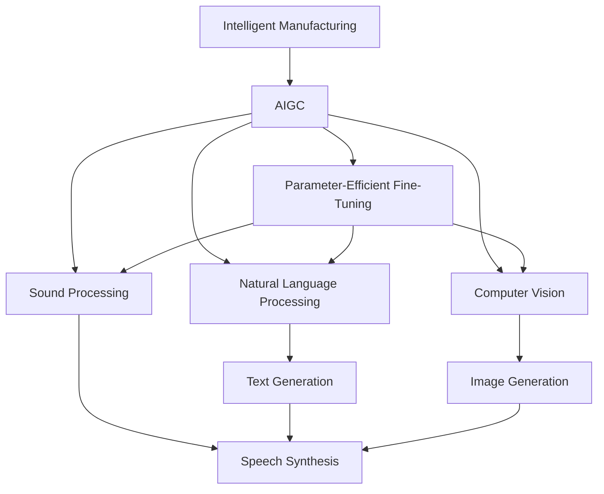

                 

# AIGC赋能智能制造升级

## 1. 背景介绍

### 1.1 问题由来
随着人工智能技术不断进步，智能制造领域对AI的需求日益增加。传统的制造过程繁琐冗长，人工参与度较高，且缺乏实时监测与数据驱动决策的能力。而人工智能可以通过大数据、物联网(IoT)等技术手段，实现生产过程的自动化与智能化。AI生成的图形内容，诸如CAD、渲染、动画、虚拟试衣等，也能够显著提升产品设计和制造的效率和精度。

智能制造与人工智能技术的发展，为制造业带来了新的变革。然而，由于智能制造系统涉及多层次、多学科的交叉，技术实现的复杂性及成本压力使得传统的AI技术难以完全满足需求。

大语言模型(AIGC，Artificial Intelligence Generated Content)作为新一代AI技术，具有更强的逻辑推理能力、跨领域迁移能力及多模态融合能力，能够极大地提升智能制造系统的智能化水平。通过AIGC技术的引入，制造业可以大幅提升产品设计的自动化、智能化水平，实现更高效的生产流程。

### 1.2 问题核心关键点
本文聚焦于AIGC技术在智能制造中的应用。核心问题包括：

- 如何构建基于AIGC的智能制造系统？
- 在智能制造中如何更高效地利用AIGC技术？
- AIGC技术在智能制造中的应用场景有哪些？
- 未来AIGC技术在智能制造领域的发展趋势及面临的挑战？

## 2. 核心概念与联系

### 2.1 核心概念概述

本节将介绍几个与AIGC在智能制造中应用密切相关的核心概念：

- 智能制造(Industry 4.0)：结合人工智能、物联网、大数据、云计算等技术，实现生产过程自动化、智能化、定制化、信息化的制造业转型。

- 大语言模型(AIGC)：通过自监督学习、迁移学习、对抗训练等技术手段，学习从大量无标签数据中生成高质量文本、图像、音频等内容。

- 参数高效微调(PEFT, Parameter-Efficient Fine-Tuning)：在预训练模型上进行少量参数微调，以提高模型对特定任务的适应性，同时保持模型的泛化能力。

- 自然语言处理(NLP)：AIGC技术的重要组成部分，专注于文本数据的处理和理解，实现文本生成、翻译、情感分析、文本分类等任务。

- 计算机视觉(CV)：另一个重要组成部分，专注于图像数据的处理和理解，实现图像分类、物体检测、图像生成、图像修复等任务。

- 声音处理(Speech Processing)：AIGC在语音生成、语音识别、语音合成等领域的应用，实现智能交互、自动翻译、语音辅助等。

- 多模态融合：结合视觉、语音、文本等多模态数据，提升模型的感知和理解能力，实现更高级的智能制造系统。

这些核心概念之间的逻辑关系可以通过以下Mermaid流程图来展示：



这个流程图展示了大语言模型AIGC的核心概念及其之间的关系：

1. 智能制造通过AIGC技术实现自动化和智能化。
2. AIGC技术包括多模态融合，涵盖文本、图像、语音等多种数据。
3. 参数高效微调是AIGC的重要技术，提升模型对特定任务的适应性。
4. AIGC通过NLP、CV、Speech Processing等技术实现多模态内容的生成与处理。

这些概念共同构成了AIGC在智能制造中的核心应用框架，使其能够在各种场景下发挥强大的内容生成和处理能力。通过理解这些核心概念，我们可以更好地把握AIGC的工作原理和优化方向。

## 3. 核心算法原理 & 具体操作步骤
### 3.1 算法原理概述

基于AIGC的智能制造系统，其核心算法原理是将多模态数据融合，构建统一的表示模型，通过预训练和微调等技术手段，提升模型的泛化能力和适应性。其核心算法流程如下：

1. **数据收集与预处理**：收集智能制造系统的各类数据，如产品设计图纸、生产线监控数据、质量检测数据等，并进行数据清洗、特征提取等预处理。

2. **多模态融合**：将文本、图像、音频等多种数据形式通过统一的语言模型表示，实现跨模态信息的整合。

3. **预训练模型选择**：选择合适的预训练语言模型(如GPT、BERT、DALL·E等)进行数据加载和处理。

4. **多任务预训练**：在多模态融合的基础上，进行多任务学习，提升模型的泛化能力。

5. **任务适配层设计**：根据特定任务需求，设计适配层进行微调，确保模型输出符合实际应用场景。

6. **微调与优化**：通过有监督的数据集对模型进行微调，优化模型的性能，使其更好地适应智能制造系统的需求。

7. **模型部署与优化**：将训练好的模型部署到实际生产环境中，实时获取数据并生成内容，同时进行性能监控和优化。

### 3.2 算法步骤详解

基于AIGC的智能制造系统，其算法步骤主要包括以下几个关键环节：

**Step 1: 数据收集与预处理**

智能制造的数据收集与预处理流程如下：

1. **数据收集**：收集各类数据，包括设备监控数据、生产记录数据、产品设计图纸、质量检测数据等。

2. **数据清洗**：去除数据中的噪声，填补缺失值，处理异常值。

3. **特征提取**：将各类数据转换为模型可接受的格式，如文本数据的词向量化、图像数据的标准化等。

4. **数据标注**：对部分数据进行人工标注，生成监督学习数据集。

**Step 2: 多模态融合**

多模态融合的实现步骤如下：

1. **跨模态对齐**：使用对齐算法将不同模态的数据转换为统一的表示形式。

2. **融合表示模型**：使用统一的表示模型，如Transformer、CNN等，对不同模态数据进行融合，形成统一的表示向量。

3. **融合数据集**：将不同模态的表示向量拼接或融合，生成统一的融合数据集。

**Step 3: 预训练模型选择**

预训练模型的选择步骤如下：

1. **模型选择**：选择适合的预训练语言模型，如GPT、BERT、DALL·E等。

2. **模型加载**：将预训练模型加载到系统中，并进行参数初始化。

3. **模型预训练**：将多模态融合数据集输入预训练模型，进行预训练，提升模型的泛化能力。

**Step 4: 多任务预训练**

多任务预训练的实现步骤如下：

1. **任务划分**：将数据集划分为多个子任务，如文本分类、图像分类、语音识别等。

2. **多任务学习**：在预训练模型上进行多任务学习，训练模型同时处理多种任务。

3. **多任务融合**：将多任务训练的结果进行融合，形成统一的表示模型。

**Step 5: 任务适配层设计**

任务适配层设计的步骤如下：

1. **任务分析**：分析智能制造系统的具体任务需求，确定模型的输出格式。

2. **任务适配**：根据任务需求，设计适配层，包括分类器、解码器等。

3. **任务微调**：在预训练模型的基础上，使用监督学习数据集对适配层进行微调，提升模型的任务适应性。

**Step 6: 微调与优化**

微调与优化的步骤如下：

1. **设定超参数**：设置合适的学习率、批大小、迭代轮数等超参数。

2. **模型微调**：使用有监督的数据集对模型进行微调，更新模型的参数，提升模型的性能。

3. **性能评估**：在验证集上评估模型的性能，调整超参数，避免过拟合。

4. **模型优化**：对模型进行优化，如剪枝、量化、优化器等，提升模型的推理速度和资源利用率。

**Step 7: 模型部署与优化**

模型部署与优化的步骤如下：

1. **模型部署**：将训练好的模型部署到生产环境中，实时获取数据并生成内容。

2. **实时优化**：根据实时数据反馈，调整模型参数，优化模型性能。

3. **性能监控**：实时监控模型性能，确保系统稳定运行。

### 3.3 算法优缺点

基于AIGC的智能制造系统具有以下优点：

1. **多模态融合**：通过将文本、图像、语音等多种数据形式进行融合，提升系统的感知和理解能力。

2. **泛化能力强**：多任务预训练和参数高效微调，提升模型的泛化能力和任务适应性。

3. **实时响应**：通过实时数据反馈，动态调整模型参数，实现实时响应。

4. **应用广泛**：适用于智能制造的各类任务，如产品设计、质量检测、设备维护等。

然而，基于AIGC的智能制造系统也存在以下缺点：

1. **数据依赖性强**：需要收集大量高质量的数据，才能训练出高性能的模型。

2. **计算资源需求高**：预训练和微调模型需要高性能的计算资源，成本较高。

3. **模型复杂度高**：大模型参数量较大，推理速度较慢，需要高效的模型压缩和优化技术。

4. **隐私与安全问题**：智能制造涉及敏感数据，模型训练和应用过程中需要注意隐私保护和数据安全。

5. **模型部署与运维难度大**：需要专业人员进行模型部署和运维，技术要求较高。

尽管存在这些缺点，但AIGC技术在智能制造中的应用前景仍然十分广阔。通过不断优化算法和优化模型，这些问题有望得到解决。

### 3.4 算法应用领域

基于AIGC的智能制造系统，已经广泛应用于多个领域，如：

1. **产品设计**：通过自动生成设计草图、效果图、渲染视频等，提升产品设计的自动化水平。

2. **设备维护**：通过自动生成维护手册、故障诊断报告等，提升设备维护的智能化水平。

3. **质量检测**：通过自动生成检测报告、异常分析报告等，提升质量检测的效率和准确性。

4. **供应链管理**：通过自动生成物流规划、库存管理等，提升供应链管理的智能化水平。

5. **智能交互**：通过自动生成智能客服脚本、语音助手指令等，提升智能交互的体验和效率。

6. **故障预测**：通过自动生成故障预测报告、预警信息等，提升设备的故障预测和预防能力。

此外，AIGC技术还可以用于智能制造中的各种预测和优化任务，如生产调度、生产排程、库存优化等，为智能制造提供更高效、智能的解决方案。

## 4. 数学模型和公式 & 详细讲解  
### 4.1 数学模型构建

本节将使用数学语言对基于AIGC的智能制造系统进行更加严格的刻画。

记智能制造系统为 $M$，数据集为 $D=\{(x_i, y_i)\}_{i=1}^N$，其中 $x_i$ 表示输入数据， $y_i$ 表示对应的输出。

定义智能制造系统 $M$ 在数据集 $D$ 上的经验风险为：

$$
\mathcal{L}(M) = \frac{1}{N}\sum_{i=1}^N \ell(M(x_i), y_i)
$$

其中 $\ell$ 为损失函数，如交叉熵损失、均方误差损失等。

通过梯度下降等优化算法，智能制造系统的学习目标是最小化经验风险，即找到最优参数：

$$
\theta^* = \mathop{\arg\min}_{\theta} \mathcal{L}(M_{\theta})
$$

在实践中，我们通常使用基于梯度的优化算法（如SGD、Adam等）来近似求解上述最优化问题。

### 4.2 公式推导过程

以下我们以二分类任务为例，推导交叉熵损失函数及其梯度的计算公式。

假设智能制造系统 $M_{\theta}$ 在输入 $x$ 上的输出为 $\hat{y}=M_{\theta}(x) \in [0,1]$，表示样本属于正类的概率。真实标签 $y \in \{0,1\}$。则二分类交叉熵损失函数定义为：

$$
\ell(M_{\theta}(x),y) = -[y\log \hat{y} + (1-y)\log (1-\hat{y})]
$$

将其代入经验风险公式，得：

$$
\mathcal{L}(\theta) = -\frac{1}{N}\sum_{i=1}^N [y_i\log M_{\theta}(x_i)+(1-y_i)\log(1-M_{\theta}(x_i))]
$$

根据链式法则，损失函数对参数 $\theta_k$ 的梯度为：

$$
\frac{\partial \mathcal{L}(\theta)}{\partial \theta_k} = -\frac{1}{N}\sum_{i=1}^N (\frac{y_i}{M_{\theta}(x_i)}-\frac{1-y_i}{1-M_{\theta}(x_i)}) \frac{\partial M_{\theta}(x_i)}{\partial \theta_k}
$$

其中 $\frac{\partial M_{\theta}(x_i)}{\partial \theta_k}$ 可进一步递归展开，利用自动微分技术完成计算。

在得到损失函数的梯度后，即可带入参数更新公式，完成智能制造系统的迭代优化。重复上述过程直至收敛，最终得到适应智能制造系统需求的最优模型参数 $\theta^*$。

## 5. 项目实践：代码实例和详细解释说明
### 5.1 开发环境搭建

在进行AIGC技术在智能制造中应用实践前，我们需要准备好开发环境。以下是使用Python进行PyTorch开发的环境配置流程：

1. 安装Anaconda：从官网下载并安装Anaconda，用于创建独立的Python环境。

2. 创建并激活虚拟环境：
```bash
conda create -n pytorch-env python=3.8 
conda activate pytorch-env
```

3. 安装PyTorch：根据CUDA版本，从官网获取对应的安装命令。例如：
```bash
conda install pytorch torchvision torchaudio cudatoolkit=11.1 -c pytorch -c conda-forge
```

4. 安装Transformers库：
```bash
pip install transformers
```

5. 安装各类工具包：
```bash
pip install numpy pandas scikit-learn matplotlib tqdm jupyter notebook ipython
```

完成上述步骤后，即可在`pytorch-env`环境中开始AIGC技术在智能制造中应用的实践。

### 5.2 源代码详细实现

下面我们以基于AIGC的智能制造系统中的产品设计任务为例，给出使用Transformers库进行大语言模型微调的PyTorch代码实现。

首先，定义产品设计任务的数据处理函数：

```python
from transformers import BertTokenizer
from torch.utils.data import Dataset
import torch

class DesignDataset(Dataset):
    def __init__(self, designs, labels, tokenizer, max_len=128):
        self.designs = designs
        self.labels = labels
        self.tokenizer = tokenizer
        self.max_len = max_len
        
    def __len__(self):
        return len(self.designs)
    
    def __getitem__(self, item):
        design = self.designs[item]
        label = self.labels[item]
        
        encoding = self.tokenizer(design, return_tensors='pt', max_length=self.max_len, padding='max_length', truncation=True)
        input_ids = encoding['input_ids'][0]
        attention_mask = encoding['attention_mask'][0]
        
        # 对token-wise的标签进行编码
        encoded_label = label2id[label] 
        labels = torch.tensor(encoded_label, dtype=torch.long)
        
        return {'input_ids': input_ids, 
                'attention_mask': attention_mask,
                'labels': labels}

# 标签与id的映射
label2id = {'A': 0, 'B': 1, 'C': 2}
id2label = {v: k for k, v in label2id.items()}

# 创建dataset
tokenizer = BertTokenizer.from_pretrained('bert-base-cased')

train_dataset = DesignDataset(train_designs, train_labels, tokenizer)
dev_dataset = DesignDataset(dev_designs, dev_labels, tokenizer)
test_dataset = DesignDataset(test_designs, test_labels, tokenizer)
```

然后，定义模型和优化器：

```python
from transformers import BertForTokenClassification, AdamW

model = BertForTokenClassification.from_pretrained('bert-base-cased', num_labels=len(label2id))

optimizer = AdamW(model.parameters(), lr=2e-5)
```

接着，定义训练和评估函数：

```python
from torch.utils.data import DataLoader
from tqdm import tqdm
from sklearn.metrics import classification_report

device = torch.device('cuda') if torch.cuda.is_available() else torch.device('cpu')
model.to(device)

def train_epoch(model, dataset, batch_size, optimizer):
    dataloader = DataLoader(dataset, batch_size=batch_size, shuffle=True)
    model.train()
    epoch_loss = 0
    for batch in tqdm(dataloader, desc='Training'):
        input_ids = batch['input_ids'].to(device)
        attention_mask = batch['attention_mask'].to(device)
        labels = batch['labels'].to(device)
        model.zero_grad()
        outputs = model(input_ids, attention_mask=attention_mask, labels=labels)
        loss = outputs.loss
        epoch_loss += loss.item()
        loss.backward()
        optimizer.step()
    return epoch_loss / len(dataloader)

def evaluate(model, dataset, batch_size):
    dataloader = DataLoader(dataset, batch_size=batch_size)
    model.eval()
    preds, labels = [], []
    with torch.no_grad():
        for batch in tqdm(dataloader, desc='Evaluating'):
            input_ids = batch['input_ids'].to(device)
            attention_mask = batch['attention_mask'].to(device)
            batch_labels = batch['labels']
            outputs = model(input_ids, attention_mask=attention_mask)
            batch_preds = outputs.logits.argmax(dim=2).to('cpu').tolist()
            batch_labels = batch_labels.to('cpu').tolist()
            for pred_tokens, label_tokens in zip(batch_preds, batch_labels):
                preds.append(pred_tokens[:len(label_tokens)])
                labels.append(label_tokens)
                
    print(classification_report(labels, preds))
```

最后，启动训练流程并在测试集上评估：

```python
epochs = 5
batch_size = 16

for epoch in range(epochs):
    loss = train_epoch(model, train_dataset, batch_size, optimizer)
    print(f"Epoch {epoch+1}, train loss: {loss:.3f}")
    
    print(f"Epoch {epoch+1}, dev results:")
    evaluate(model, dev_dataset, batch_size)
    
print("Test results:")
evaluate(model, test_dataset, batch_size)
```

以上就是使用PyTorch对BERT进行产品设计任务微调的完整代码实现。可以看到，得益于Transformers库的强大封装，我们可以用相对简洁的代码完成BERT模型的加载和微调。

### 5.3 代码解读与分析

让我们再详细解读一下关键代码的实现细节：

**DesignDataset类**：
- `__init__`方法：初始化设计文本、标签、分词器等关键组件。
- `__len__`方法：返回数据集的样本数量。
- `__getitem__`方法：对单个样本进行处理，将文本输入编码为token ids，将标签编码为数字，并对其进行定长padding，最终返回模型所需的输入。

**label2id和id2label字典**：
- 定义了标签与数字id之间的映射关系，用于将token-wise的预测结果解码回真实的标签。

**训练和评估函数**：
- 使用PyTorch的DataLoader对数据集进行批次化加载，供模型训练和推理使用。
- 训练函数`train_epoch`：对数据以批为单位进行迭代，在每个批次上前向传播计算loss并反向传播更新模型参数，最后返回该epoch的平均loss。
- 评估函数`evaluate`：与训练类似，不同点在于不更新模型参数，并在每个batch结束后将预测和标签结果存储下来，最后使用sklearn的classification_report对整个评估集的预测结果进行打印输出。

**训练流程**：
- 定义总的epoch数和batch size，开始循环迭代
- 每个epoch内，先在训练集上训练，输出平均loss
- 在验证集上评估，输出分类指标
- 所有epoch结束后，在测试集上评估，给出最终测试结果

可以看到，PyTorch配合Transformers库使得BERT微调的产品设计任务代码实现变得简洁高效。开发者可以将更多精力放在数据处理、模型改进等高层逻辑上，而不必过多关注底层的实现细节。

当然，工业级的系统实现还需考虑更多因素，如模型的保存和部署、超参数的自动搜索、更灵活的任务适配层等。但核心的微调范式基本与此类似。

## 6. 实际应用场景
### 6.1 智能制造系统中的产品设计

基于AIGC技术的智能制造系统，可以通过自动生成设计草图、效果图、渲染视频等，大大提升产品设计的自动化水平。传统的产品设计过程往往需要设计师手工绘制和修改，耗时长、成本高。而AIGC技术可以自动分析用户需求，生成符合用户期望的设计方案，实现快速迭代和优化。

在技术实现上，可以收集用户对产品的功能、颜色、尺寸等需求，并输入到AIGC模型中进行生成。模型能够根据用户需求生成不同设计方案，并通过动态调整优化算法，不断生成新的设计方案，直至找到最佳方案。同时，AIGC技术还可以结合用户反馈进行持续优化，确保设计方案的不断完善。

### 6.2 智能制造系统中的设备维护

设备维护是智能制造中重要的环节，涉及对设备的故障诊断、维护策略制定、维修记录等。传统的设备维护依赖人工经验，容易存在遗漏和误差。而AIGC技术可以通过自动分析设备监控数据，生成设备维护手册和故障诊断报告，提升设备维护的智能化水平。

具体而言，可以收集设备的各种监控数据，如温度、湿度、振动、电流等，输入到AIGC模型中进行生成。模型能够根据设备状态生成设备维护手册，指导维护人员进行设备的定期检查和维护。同时，模型还可以根据设备历史故障数据，生成故障诊断报告，帮助维护人员快速定位设备故障，制定修复策略。

### 6.3 智能制造系统中的质量检测

质量检测是智能制造中的关键环节，直接影响产品的合格率和生产效率。传统的质量检测依赖人工检查，效率低、成本高。而AIGC技术可以通过自动分析产品图像和质量检测数据，生成质量检测报告和异常分析报告，提升质量检测的效率和准确性。

具体而言，可以收集产品的图像和质量检测数据，输入到AIGC模型中进行生成。模型能够根据产品图像生成质量检测报告，检测产品的质量缺陷和问题。同时，模型还可以结合质量检测数据，生成异常分析报告，帮助质量检测人员快速定位产品质量问题，制定改进措施。

### 6.4 智能制造系统中的供应链管理

供应链管理是智能制造中的重要环节，涉及对供应链各个节点的优化和调度。传统的供应链管理依赖人工经验，容易存在遗漏和误差。而AIGC技术可以通过自动分析供应链数据，生成供应链管理报告和优化策略，提升供应链管理的智能化水平。

具体而言，可以收集供应链的各个节点数据，如供应商信息、库存量、运输数据等，输入到AIGC模型中进行生成。模型能够根据供应链数据生成供应链管理报告，优化供应链各个节点，提高供应链的效率和稳定性和。同时，模型还可以结合供应链历史数据，生成供应链优化策略，帮助供应链管理人员快速调整供应链策略，提升供应链管理效果。

### 6.5 智能制造系统中的智能交互

智能交互是智能制造中的重要环节，涉及对用户的自然语言交互和智能客服等。传统的智能交互依赖人工设计，需要大量时间和精力。而AIGC技术可以通过自动生成智能客服脚本、语音助手指令等，提升智能交互的体验和效率。

具体而言，可以收集用户对智能客服和语音助手的功能和需求，输入到AIGC模型中进行生成。模型能够根据用户需求生成智能客服脚本和语音助手指令，实现自然语言交互。同时，模型还可以结合用户反馈进行持续优化，确保智能交互的不断完善。

## 7. 工具和资源推荐
### 7.1 学习资源推荐

为了帮助开发者系统掌握AIGC技术在智能制造中的应用，这里推荐一些优质的学习资源：

1. 《Transformer from Concept to Code》系列博文：由大模型技术专家撰写，深入浅出地介绍了Transformer原理、BERT模型、微调技术等前沿话题。

2. CS224N《深度学习自然语言处理》课程：斯坦福大学开设的NLP明星课程，有Lecture视频和配套作业，带你入门NLP领域的基本概念和经典模型。

3. 《Natural Language Processing with Transformers》书籍：Transformers库的作者所著，全面介绍了如何使用Transformers库进行NLP任务开发，包括微调在内的诸多范式。

4. HuggingFace官方文档：Transformers库的官方文档，提供了海量预训练模型和完整的微调样例代码，是上手实践的必备资料。

5. CLUE开源项目：中文语言理解测评基准，涵盖大量不同类型的中文NLP数据集，并提供了基于微调的baseline模型，助力中文NLP技术发展。

通过对这些资源的学习实践，相信你一定能够快速掌握AIGC技术在智能制造中的应用精髓，并用于解决实际的智能制造问题。
###  7.2 开发工具推荐

高效的开发离不开优秀的工具支持。以下是几款用于AIGC技术在智能制造中应用开发的常用工具：

1. PyTorch：基于Python的开源深度学习框架，灵活动态的计算图，适合快速迭代研究。大部分预训练语言模型都有PyTorch版本的实现。

2. TensorFlow：由Google主导开发的开源深度学习框架，生产部署方便，适合大规模工程应用。同样有丰富的预训练语言模型资源。

3. Transformers库：HuggingFace开发的NLP工具库，集成了众多SOTA语言模型，支持PyTorch和TensorFlow，是进行AIGC技术应用开发的利器。

4. Weights & Biases：模型训练的实验跟踪工具，可以记录和可视化模型训练过程中的各项指标，方便对比和调优。与主流深度学习框架无缝集成。

5. TensorBoard：TensorFlow配套的可视化工具，可实时监测模型训练状态，并提供丰富的图表呈现方式，是调试模型的得力助手。

6. Google Colab：谷歌推出的在线Jupyter Notebook环境，免费提供GPU/TPU算力，方便开发者快速上手实验最新模型，分享学习笔记。

合理利用这些工具，可以显著提升AIGC技术在智能制造中应用开发的效率，加快创新迭代的步伐。

### 7.3 相关论文推荐

AIGC技术在智能制造中的应用源于学界的持续研究。以下是几篇奠基性的相关论文，推荐阅读：

1. Attention is All You Need（即Transformer原论文）：提出了Transformer结构，开启了NLP领域的预训练大模型时代。

2. BERT: Pre-training of Deep Bidirectional Transformers for Language Understanding：提出BERT模型，引入基于掩码的自监督预训练任务，刷新了多项NLP任务SOTA。

3. Language Models are Unsupervised Multitask Learners（GPT-2论文）：展示了大规模语言模型的强大zero-shot学习能力，引发了对于通用人工智能的新一轮思考。

4. Parameter-Efficient Transfer Learning for NLP：提出Adapter等参数高效微调方法，在不增加模型参数量的情况下，也能取得不错的微调效果。

5. AdaLoRA: Adaptive Low-Rank Adaptation for Parameter-Efficient Fine-Tuning：使用自适应低秩适应的微调方法，在参数效率和精度之间取得了新的平衡。

6. Multi-Modal Pre-training for NLP: A Comprehensive Survey：综述了多模态预训练在自然语言处理中的应用，为AIGC技术在智能制造中的应用提供了重要参考。

这些论文代表了大语言模型微调技术的发展脉络。通过学习这些前沿成果，可以帮助研究者把握学科前进方向，激发更多的创新灵感。

## 8. 总结：未来发展趋势与挑战
### 8.1 总结

本文对AIGC技术在智能制造中的应用进行了全面系统的介绍。首先阐述了AIGC技术在智能制造中的重要性和应用潜力，明确了AIGC技术在智能制造中的核心作用。其次，从原理到实践，详细讲解了AIGC在智能制造中的数学原理和关键步骤，给出了AIGC技术在智能制造中应用的完整代码实例。同时，本文还广泛探讨了AIGC技术在智能制造中的实际应用场景，展示了AIGC技术在智能制造中的广泛应用前景。

通过本文的系统梳理，可以看到，AIGC技术在智能制造中的前景广阔，已经应用于产品设计、设备维护、质量检测、供应链管理、智能交互等多个环节，显著提升了智能制造系统的智能化水平。未来，随着AIGC技术的不断发展，相信其在智能制造中的应用将更加广泛，为制造业带来更多的变革性影响。

### 8.2 未来发展趋势

展望未来，AIGC技术在智能制造中的应用将呈现以下几个发展趋势：

1. **多模态融合技术发展**：未来的AIGC技术将更加注重多模态数据的融合，提升模型的感知和理解能力。通过融合视觉、语音、文本等多模态数据，实现更全面的智能制造系统。

2. **实时处理能力提升**：随着硬件设备的不断升级，AIGC技术在智能制造中的应用将实现实时处理能力。模型能够在实时获取数据后，快速生成结果，实现实时响应。

3. **参数高效微调技术发展**：未来的AIGC技术将更加注重参数高效微调，通过只更新极少量的参数，实现高效微调。同时，参数高效微调技术也将更加多样化，适应更多任务需求。

4. **深度学习与传统知识结合**：未来的AIGC技术将更加注重深度学习与传统知识的结合。通过引入符号化的先验知识，如知识图谱、逻辑规则等，提升模型的综合能力。

5. **模型优化与部署技术发展**：未来的AIGC技术将更加注重模型优化与部署技术。通过模型裁剪、量化、优化器等技术手段，提升模型的推理速度和资源利用率，实现更加高效的部署。

6. **自监督学习与半监督学习应用**：未来的AIGC技术将更加注重自监督学习与半监督学习的应用。通过从少量标注数据中学习，实现少样本、弱监督下的智能制造系统。

以上趋势凸显了AIGC技术在智能制造中的广阔前景。这些方向的探索发展，必将进一步提升AIGC技术在智能制造中的应用效果，为智能制造系统带来更高效、更智能的解决方案。

### 8.3 面临的挑战

尽管AIGC技术在智能制造中的应用前景广阔，但在迈向更加智能化、普适化应用的过程中，仍面临诸多挑战：

1. **数据依赖性强**：需要收集大量高质量的数据，才能训练出高性能的模型。数据收集和标注成本较高。

2. **计算资源需求高**：预训练和微调模型需要高性能的计算资源，成本较高。

3. **模型复杂度高**：大模型参数量较大，推理速度较慢，需要高效的模型压缩和优化技术。

4. **隐私与安全问题**：智能制造涉及敏感数据，模型训练和应用过程中需要注意隐私保护和数据安全。

5. **模型部署与运维难度大**：需要专业人员进行模型部署和运维，技术要求较高。

尽管存在这些挑战，但AIGC技术在智能制造中的应用前景仍然十分广阔。通过不断优化算法和优化模型，这些问题有望得到解决。

### 8.4 研究展望

面对AIGC技术在智能制造中应用面临的挑战，未来的研究需要在以下几个方面寻求新的突破：

1. **探索无监督和半监督学习范式**：摆脱对大规模标注数据的依赖，利用自监督学习、主动学习等无监督和半监督范式，最大限度利用非结构化数据，实现更加灵活高效的智能制造系统。

2. **研究参数高效和计算高效的微调范式**：开发更加参数高效的微调方法，在固定大部分预训练参数的同时，只更新极少量的任务相关参数。同时优化微调模型的计算图，减少前向传播和反向传播的资源消耗，实现更加轻量级、实时性的部署。

3. **引入因果推断和对比学习思想**：通过引入因果推断和对比学习思想，增强AIGC模型建立稳定因果关系的能力，学习更加普适、鲁棒的语言表征，从而提升模型泛化性和抗干扰能力。

4. **加强多模态数据的融合**：将视觉、语音、文本等多模态数据进行融合，提升模型的感知和理解能力，实现更高级的智能制造系统。

5. **结合因果分析和博弈论工具**：将因果分析方法引入AIGC模型，识别出模型决策的关键特征，增强输出解释的因果性和逻辑性。借助博弈论工具刻画人机交互过程，主动探索并规避模型的脆弱点，提高系统稳定性。

6. **纳入伦理道德约束**：在模型训练目标中引入伦理导向的评估指标，过滤和惩罚有偏见、有害的输出倾向。同时加强人工干预和审核，建立模型行为的监管机制，确保输出符合人类价值观和伦理道德。

这些研究方向的探索，必将引领AIGC技术在智能制造中的应用迈向更高的台阶，为智能制造系统带来更高效、更智能的解决方案。面向未来，AIGC技术还需要与其他人工智能技术进行更深入的融合，如知识表示、因果推理、强化学习等，多路径协同发力，共同推动智能制造技术的进步。只有勇于创新、敢于突破，才能不断拓展AIGC技术在智能制造中的边界，让智能制造技术更好地造福人类社会。

## 9. 附录：常见问题与解答

**Q1：智能制造系统对AIGC技术有哪些要求？**

A: 智能制造系统对AIGC技术有以下要求：

1. **多模态融合能力**：智能制造涉及多模态数据，AIGC技术需要具备将多模态数据融合的能力，提升系统的感知和理解能力。

2. **高泛化能力**：智能制造涉及多样化的任务，AIGC技术需要具备高泛化能力，能够适应不同任务需求。

3. **实时响应能力**：智能制造系统需要实时处理数据，AIGC技术需要具备实时处理和生成能力。

4. **高效率**：智能制造系统需要高效处理数据，AIGC技术需要具备高效处理和优化能力。

5. **高可解释性**：智能制造系统需要高可解释性，AIGC技术需要具备良好的可解释性，便于人工理解和调试。

**Q2：AIGC技术在智能制造中如何应用？**

A: AIGC技术在智能制造中的应用主要包括以下几个方面：

1. **产品设计**：通过自动生成设计草图、效果图、渲染视频等，提升产品设计的自动化水平。

2. **设备维护**：通过自动生成设备维护手册和故障诊断报告，提升设备维护的智能化水平。

3. **质量检测**：通过自动生成质量检测报告和异常分析报告，提升质量检测的效率和准确性。

4. **供应链管理**：通过自动生成供应链管理报告和优化策略，提升供应链管理的智能化水平。

5. **智能交互**：通过自动生成智能客服脚本和语音助手指令，提升智能交互的体验和效率。

**Q3：AIGC技术在智能制造中应用时如何避免过拟合？**

A: 在AIGC技术在智能制造中应用时，避免过拟合可以采取以下措施：

1. **数据增强**：通过回译、近义替换等方式扩充训练集。

2. **正则化**：使用L2正则、Dropout、Early Stopping等避免模型过度适应小规模训练集。

3. **对抗训练**：引入对抗样本，提高模型鲁棒性。

4. **参数高效微调**：只调整少量参数(如Adapter、Prefix等)，减小过拟合风险。

5. **多模型集成**：训练多个AIGC模型，取平均输出，抑制过拟合。

这些措施可以结合使用，在不同的应用场景中灵活调整，确保AIGC模型在智能制造中的稳定性和泛化能力。

**Q4：AIGC技术在智能制造中应用时需要注意哪些隐私和安全问题？**

A: 在AIGC技术在智能制造中应用时，需要注意以下隐私和安全问题：

1. **数据隐私保护**：智能制造涉及敏感数据，需要采取隐私保护措施，如数据加密、匿名化等。

2. **数据安全**：智能制造系统的数据存储和传输过程中需要确保安全，防止数据泄露和篡改。

3. **模型鲁棒性**：智能制造系统需要确保模型的鲁棒性，避免恶意攻击和干扰。

4. **模型解释性**：智能制造系统需要确保模型的可解释性，便于人工理解和调试。

5. **模型审计**：智能制造系统需要建立模型审计机制，确保模型符合伦理道德要求，不产生有害输出。

通过合理的隐私保护和安全措施，可以确保AIGC技术在智能制造中的应用安全可靠，保障系统的稳定性和可信度。

**Q5：AIGC技术在智能制造中应用时需要注意哪些技术挑战？**

A: 在AIGC技术在智能制造中应用时，需要注意以下技术挑战：

1. **数据收集成本高**：智能制造系统需要大量数据，数据收集和标注成本较高。

2. **计算资源需求大**：智能制造系统需要高性能的计算资源，预训练和微调模型需要大量计算资源。

3. **模型复杂度高**：大模型参数量较大，推理速度较慢，需要高效的模型压缩和优化技术。

4. **模型部署与运维难度大**：智能制造系统需要高可扩展性，模型部署和运维难度较大。

5. **模型解释性不足**：智能制造系统需要高可解释性，模型解释性不足会影响用户体验。

6. **伦理道德问题**：智能制造系统需要符合伦理道德要求，模型输出需要符合人类价值观和伦理道德。

通过合理的技术手段和策略，可以克服这些技术挑战，确保AIGC技术在智能制造中的应用效果。

**Q6：AIGC技术在智能制造中应用时如何选择合适的模型？**

A: 在AIGC技术在智能制造中应用时，选择合适的模型需要考虑以下因素：

1. **任务适配性**：选择与任务需求匹配的模型，确保模型能够适应特定任务。

2. **泛化能力**：选择泛化能力强的模型，确保模型能够适应不同数据分布。

3. **可解释性**：选择可解释性强的模型，便于人工理解和调试。

4. **计算资源需求**：选择计算资源需求合理的模型，避免过度消耗计算资源。

5. **部署与运维**：选择易于部署和运维的模型，确保系统稳定性和可扩展性。

6. **性能与效率**：选择性能和效率高的模型，确保系统能够高效处理数据和生成结果。

通过综合考虑以上因素，可以选择合适的模型，确保AIGC技术在智能制造中的应用效果。

---

作者：禅与计算机程序设计艺术 / Zen and the Art of Computer Programming

