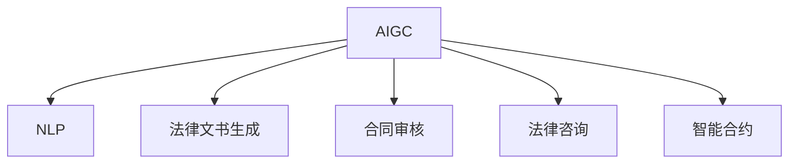

                 

# AIGC重新定义法律服务

> 关键词：人工智能生成内容(AIGC), 法律服务, 自然语言处理(NLP), 法律文书生成, 合同审核, 法律咨询, 智能合约

## 1. 背景介绍

### 1.1 问题由来
随着人工智能技术的飞速发展，特别是人工智能生成内容(AIGC)在自然语言处理(NLP)领域的突破，法律服务行业正面临前所未有的变革。法律服务不仅仅是案件处理，更涉及合规咨询、合同审核、法律文书生成等多个环节。AIGC技术以其高效、准确、个性化的特点，为法律服务注入了新的活力。

过去，法律服务高度依赖律师的个人经验和判断。律师需要耗费大量时间和精力进行资料收集、数据分析、文书撰写等基础工作，影响了其专业能力的充分发挥。AIGC技术能够自动处理这些繁琐的重复性任务，让律师专注于复杂法律问题的分析和解决，大幅提高工作效率和质量。

### 1.2 问题核心关键点
本文聚焦于AIGC技术在法律服务中的应用，将探讨其核心原理、操作步骤及实际应用场景，旨在帮助法律从业者理解AIGC的优势，并探索其在法律服务中的应用潜力。

## 2. 核心概念与联系

### 2.1 核心概念概述

为更好地理解AIGC在法律服务中的应用，本节将介绍几个关键概念及其相互联系：

- **AIGC**：人工智能生成内容，利用NLP、机器学习等技术生成自然语言文本，涵盖法律文书生成、合同审核等多个领域。
- **NLP**：自然语言处理，通过算法让计算机理解、处理和生成自然语言，是AIGC技术的重要基础。
- **法律文书生成**：自动生成法律文件，如起诉书、答辩状、上诉状等，可快速应对文书撰写需求。
- **合同审核**：通过NLP技术检测合同中可能的法律风险，帮助律师快速识别潜在问题。
- **法律咨询**：利用AIGC技术对用户问题进行理解和分析，生成可能的解决方案。
- **智能合约**：基于AIGC技术生成的智能合约，可自动化执行合同条款，提高交易效率。

这些核心概念之间的逻辑关系可以通过以下Mermaid流程图来展示：



这个流程图展示了AIGC技术在法律服务中的核心作用：利用NLP技术处理文本数据，生成多种法律文本，同时还能审核合同、提供法律咨询和生成智能合约。

## 3. 核心算法原理 & 具体操作步骤
### 3.1 算法原理概述

AIGC在法律服务中的应用，主要依赖于以下几大算法：

1. **文本生成算法**：基于Transformer、GPT等模型，利用大量标注数据训练生成模型，能够自动生成法律文书、合同、法律咨询等内容。
2. **文本匹配算法**：使用BERT、RoBERTa等模型，进行文本相似度计算，检测合同中的潜在法律风险。
3. **推理算法**：通过逻辑推理和规则引擎，对法律咨询问题进行深入分析，生成合理的法律建议。
4. **智能合约生成算法**：利用AIGC技术生成标准化的智能合约模板，提高合约执行的自动化水平。

这些算法通过深度学习、自然语言处理等技术，使得AIGC技术能够处理复杂多变的法律文本，并生成高质量的法律内容。

### 3.2 算法步骤详解

AIGC在法律服务中的应用步骤主要包括：

**Step 1: 数据准备**
- 收集并标注法律文书、合同、咨询案例等数据，准备训练和测试集。
- 使用预训练模型进行文本预处理，如分词、去除停用词等。

**Step 2: 模型训练**
- 利用收集的数据集训练AIGC模型，调整模型参数和超参数。
- 在训练过程中进行验证，确保模型性能稳定。

**Step 3: 模型评估**
- 使用测试集评估模型性能，计算准确率、召回率、F1值等指标。
- 根据评估结果调整模型，确保生成内容符合法律规范和逻辑。

**Step 4: 应用部署**
- 将训练好的模型部署到法律服务系统，进行实时处理。
- 结合用户需求，生成法律文书、合同、咨询建议等。

**Step 5: 持续优化**
- 定期收集用户反馈，优化模型性能。
- 更新模型参数，保持其与法律规范和案例库的一致性。

### 3.3 算法优缺点

AIGC技术在法律服务中的应用，具有以下优点：

1. **效率提升**：AIGC可以快速生成法律文书、审核合同、提供咨询建议，大幅缩短律师处理这些事务的时间。
2. **准确性提高**：AIGC模型在大量数据训练后，生成的文本质量较高，减少了人为错误。
3. **个性化服务**：AIGC可以根据不同客户需求，生成定制化的法律文本，提升服务体验。
4. **风险控制**：AIGC模型可以检测合同中的潜在法律风险，降低律师审查合同的负担。

同时，AIGC技术也存在一些局限性：

1. **法律规范更新**：法律规范和案例库需要不断更新，AIGC模型需要定期训练和优化。
2. **复杂问题处理**：AIGC在处理复杂法律问题时，可能出现逻辑错误或缺乏深入分析。
3. **隐私安全**：AIGC模型需要处理敏感的法律数据，存在数据隐私和安全问题。

尽管存在这些局限性，但AIGC技术在法律服务中的应用前景广阔，值得深入探索。

### 3.4 算法应用领域

AIGC技术在法律服务中的应用领域广泛，涵盖以下几个方面：

1. **法律文书生成**：如起诉书、答辩状、上诉状、法律意见书等。AIGC能够根据案件信息快速生成符合法律规范的文书，提高文书撰写效率。
2. **合同审核**：对合同文本进行自动审核，检测格式、条款合规性，标注法律风险点，辅助律师审查合同。
3. **法律咨询**：对用户提出的法律问题，进行自动分析和解答，生成可能的解决方案和法律依据。
4. **智能合约**：基于AIGC技术，自动生成标准化的智能合约模板，降低合约制作成本，提高执行效率。
5. **案件管理**：自动生成案件报告、起诉书、答辩状等，协助律师处理案件流程。
6. **法律教育**：生成法律知识普及材料、案例分析等，提供法律教育资源。

## 4. 数学模型和公式 & 详细讲解 & 举例说明

### 4.1 数学模型构建

AIGC在法律服务中的应用主要基于以下几个数学模型：

- **文本生成模型**：基于Transformer等架构，使用自回归模型或自编码器，生成法律文本。
- **文本匹配模型**：基于BERT等架构，使用双塔模型或向量拼接，计算文本相似度。
- **逻辑推理模型**：基于规则引擎或神经网络，进行逻辑推理和规则匹配。
- **智能合约生成模型**：基于模板匹配和规则引擎，生成标准化合约模板。

这些模型的数学模型构建过程复杂，涉及优化算法、损失函数、正则化技术等多个方面。本文将重点介绍文本生成模型的构建和训练过程。

### 4.2 公式推导过程

以文本生成模型为例，其核心公式为：

$$
\hat{y} = f_{\theta}(x)
$$

其中，$f_{\theta}$为文本生成模型，$\hat{y}$为生成的文本，$x$为输入的法律文本。

文本生成模型的训练过程如下：

1. 输入一个训练样本$x$，通过模型$f_{\theta}$生成文本$\hat{y}$。
2. 计算生成文本与实际标签$y$的损失函数$L$。
3. 使用优化算法（如Adam、SGD等）更新模型参数$\theta$，使得损失函数最小化。

具体训练过程如下：

1. 选择训练集和测试集，将数据分为训练集和验证集。
2. 定义损失函数，如交叉熵损失或均方误差损失。
3. 选择优化算法，设置学习率、批大小等参数。
4. 使用训练集进行模型训练，每轮迭代计算损失并更新模型参数。
5. 在验证集上评估模型性能，调整超参数。
6. 在测试集上最终评估模型性能。

### 4.3 案例分析与讲解

以法律文书生成为例，分析AIGC技术在文书撰写中的应用。

**Step 1: 数据准备**
- 收集大量已有的法律文书，进行标注和预处理。
- 将文书分为训练集和测试集。

**Step 2: 模型训练**
- 使用预训练的BERT模型，微调其文本生成能力。
- 设置合适的学习率、批大小等参数。

**Step 3: 模型评估**
- 使用测试集评估模型性能，计算准确率、召回率等指标。
- 调整模型参数，优化生成效果。

**Step 4: 应用部署**
- 将训练好的模型部署到法律文书生成系统。
- 用户输入案件信息，系统自动生成文书。

**Step 5: 持续优化**
- 收集用户反馈，优化模型性能。
- 更新模型参数，保持其与法律规范的一致性。

## 5. 项目实践：代码实例和详细解释说明

### 5.1 开发环境搭建

在进行AIGC应用实践前，我们需要准备好开发环境。以下是使用Python进行PyTorch开发的环境配置流程：

1. 安装Anaconda：从官网下载并安装Anaconda，用于创建独立的Python环境。

2. 创建并激活虚拟环境：
```bash
conda create -n pytorch-env python=3.8 
conda activate pytorch-env
```

3. 安装PyTorch：根据CUDA版本，从官网获取对应的安装命令。例如：
```bash
conda install pytorch torchvision torchaudio cudatoolkit=11.1 -c pytorch -c conda-forge
```

4. 安装Transformers库：
```bash
pip install transformers
```

5. 安装各类工具包：
```bash
pip install numpy pandas scikit-learn matplotlib tqdm jupyter notebook ipython
```

完成上述步骤后，即可在`pytorch-env`环境中开始AIGC应用实践。

### 5.2 源代码详细实现

这里我们以法律文书生成为例，给出使用Transformers库进行AIGC代码实现。

首先，定义数据处理函数：

```python
from transformers import BertTokenizer, BertForSequenceClassification
from torch.utils.data import Dataset
import torch

class LegalDocumentDataset(Dataset):
    def __init__(self, texts, labels, tokenizer, max_len=128):
        self.texts = texts
        self.labels = labels
        self.tokenizer = tokenizer
        self.max_len = max_len
        
    def __len__(self):
        return len(self.texts)
    
    def __getitem__(self, item):
        text = self.texts[item]
        label = self.labels[item]
        
        encoding = self.tokenizer(text, return_tensors='pt', max_length=self.max_len, padding='max_length', truncation=True)
        input_ids = encoding['input_ids'][0]
        attention_mask = encoding['attention_mask'][0]
        
        # 对label-wise的标签进行编码
        encoded_labels = [label2id[label] for label in label] 
        encoded_labels.extend([label2id['O']] * (self.max_len - len(encoded_labels)))
        labels = torch.tensor(encoded_labels, dtype=torch.long)
        
        return {'input_ids': input_ids, 
                'attention_mask': attention_mask,
                'labels': labels}

# 标签与id的映射
label2id = {'O': 0, 'A': 1, 'B': 2, 'C': 3, 'D': 4, 'E': 5}
id2label = {v: k for k, v in label2id.items()}

# 创建dataset
tokenizer = BertTokenizer.from_pretrained('bert-base-cased')

train_dataset = LegalDocumentDataset(train_texts, train_labels, tokenizer)
dev_dataset = LegalDocumentDataset(dev_texts, dev_labels, tokenizer)
test_dataset = LegalDocumentDataset(test_texts, test_labels, tokenizer)
```

然后，定义模型和优化器：

```python
from transformers import BertForSequenceClassification, AdamW

model = BertForSequenceClassification.from_pretrained('bert-base-cased', num_labels=len(label2id))

optimizer = AdamW(model.parameters(), lr=2e-5)
```

接着，定义训练和评估函数：

```python
from torch.utils.data import DataLoader
from tqdm import tqdm
from sklearn.metrics import classification_report

device = torch.device('cuda') if torch.cuda.is_available() else torch.device('cpu')
model.to(device)

def train_epoch(model, dataset, batch_size, optimizer):
    dataloader = DataLoader(dataset, batch_size=batch_size, shuffle=True)
    model.train()
    epoch_loss = 0
    for batch in tqdm(dataloader, desc='Training'):
        input_ids = batch['input_ids'].to(device)
        attention_mask = batch['attention_mask'].to(device)
        labels = batch['labels'].to(device)
        model.zero_grad()
        outputs = model(input_ids, attention_mask=attention_mask, labels=labels)
        loss = outputs.loss
        epoch_loss += loss.item()
        loss.backward()
        optimizer.step()
    return epoch_loss / len(dataloader)

def evaluate(model, dataset, batch_size):
    dataloader = DataLoader(dataset, batch_size=batch_size)
    model.eval()
    preds, labels = [], []
    with torch.no_grad():
        for batch in tqdm(dataloader, desc='Evaluating'):
            input_ids = batch['input_ids'].to(device)
            attention_mask = batch['attention_mask'].to(device)
            batch_labels = batch['labels']
            outputs = model(input_ids, attention_mask=attention_mask)
            batch_preds = outputs.logits.argmax(dim=2).to('cpu').tolist()
            batch_labels = batch_labels.to('cpu').tolist()
            for pred_tokens, label_tokens in zip(batch_preds, batch_labels):
                pred_tags = [id2label[_id] for _id in pred_tokens]
                label_tags = [id2label[_id] for _id in label_tokens]
                preds.append(pred_tags[:len(label_tokens)])
                labels.append(label_tags)
                
    print(classification_report(labels, preds))
```

最后，启动训练流程并在测试集上评估：

```python
epochs = 5
batch_size = 16

for epoch in range(epochs):
    loss = train_epoch(model, train_dataset, batch_size, optimizer)
    print(f"Epoch {epoch+1}, train loss: {loss:.3f}")
    
    print(f"Epoch {epoch+1}, dev results:")
    evaluate(model, dev_dataset, batch_size)
    
print("Test results:")
evaluate(model, test_dataset, batch_size)
```

以上就是使用PyTorch对Bert模型进行法律文书生成的完整代码实现。可以看到，得益于Transformers库的强大封装，我们可以用相对简洁的代码完成Bert模型的加载和微调。

### 5.3 代码解读与分析

让我们再详细解读一下关键代码的实现细节：

**LegalDocumentDataset类**：
- `__init__`方法：初始化文本、标签、分词器等关键组件。
- `__len__`方法：返回数据集的样本数量。
- `__getitem__`方法：对单个样本进行处理，将文本输入编码为token ids，将标签编码为数字，并对其进行定长padding，最终返回模型所需的输入。

**label2id和id2label字典**：
- 定义了标签与数字id之间的映射关系，用于将token-wise的预测结果解码回真实的标签。

**训练和评估函数**：
- 使用PyTorch的DataLoader对数据集进行批次化加载，供模型训练和推理使用。
- 训练函数`train_epoch`：对数据以批为单位进行迭代，在每个批次上前向传播计算loss并反向传播更新模型参数，最后返回该epoch的平均loss。
- 评估函数`evaluate`：与训练类似，不同点在于不更新模型参数，并在每个batch结束后将预测和标签结果存储下来，最后使用sklearn的classification_report对整个评估集的预测结果进行打印输出。

**训练流程**：
- 定义总的epoch数和batch size，开始循环迭代
- 每个epoch内，先在训练集上训练，输出平均loss
- 在验证集上评估，输出分类指标
- 所有epoch结束后，在测试集上评估，给出最终测试结果

可以看到，PyTorch配合Transformers库使得Bert模型的微调代码实现变得简洁高效。开发者可以将更多精力放在数据处理、模型改进等高层逻辑上，而不必过多关注底层的实现细节。

当然，工业级的系统实现还需考虑更多因素，如模型的保存和部署、超参数的自动搜索、更灵活的任务适配层等。但核心的微调范式基本与此类似。

## 6. 实际应用场景
### 6.1 智能合同生成

基于AIGC技术，智能合同生成系统可以自动化生成合同文本，提高合同制作效率和准确性。传统的合同制作需要律师耗费大量时间和精力，而AIGC技术能够自动处理文本模板，快速生成符合法律规范的合同文本。

在技术实现上，可以收集各类合同模板，标注合同要素和法律条款，训练生成模型。用户输入合同要素后，系统自动生成合同文本，并进行合规性检查，确保生成的合同符合法律规范。

### 6.2 法律咨询机器人

AIGC技术可以应用于法律咨询机器人，快速响应用户提出的法律问题，生成可能的解决方案和法律依据。用户可以通过自然语言描述问题，系统自动分析后给出回答，并提供相关法律文档和案例。

在技术实现上，可以使用GPT等预训练模型，微调其生成法律咨询内容的能力。用户输入问题后，系统自动生成回答，并展示法律依据和相关文档，方便用户理解和操作。

### 6.3 法律文书审核

AIGC技术还可以用于法律文书的自动审核，检测文书中的潜在法律风险和错误，提出改进建议。律师在撰写文书时，可以先用AIGC系统进行初步审核，减少人为错误和漏洞，提升文书质量。

在技术实现上，可以收集大量法律文书，标注其中的错误和风险点，训练审核模型。用户输入文书后，系统自动审核并提出修改建议，帮助律师优化文书。

### 6.4 未来应用展望

随着AIGC技术的不断发展，其在法律服务中的应用前景广阔，未来将不断拓展。

在智慧法律领域，AIGC技术将推动法律服务的智能化升级，提高司法效率和公正性。AIGC技术可以应用于电子法院系统，快速处理案件文书，辅助法官进行判决，提升司法透明度和公信力。

在法律教育领域，AIGC技术将丰富法律教育资源，提供更加生动、互动的学习体验。AIGC系统可以自动生成法律案例、模拟法庭等教学内容，帮助学生更好地理解和掌握法律知识。

在智能合约领域，AIGC技术将推动智能合约的普及和应用。AIGC系统可以生成标准化的智能合约模板，自动化执行合同条款，提高交易效率和安全性。

## 7. 工具和资源推荐
### 7.1 学习资源推荐

为了帮助开发者系统掌握AIGC在法律服务中的应用，这里推荐一些优质的学习资源：

1. 《深度学习与自然语言处理》系列书籍：介绍了深度学习在NLP领域的应用，涵盖文本生成、匹配、推理等多个方面。

2. 《自然语言处理综述》课程：由斯坦福大学开设，涵盖NLP基础和前沿技术，适合入门学习。

3. 《自然语言处理基础》课程：由Coursera提供，介绍了NLP的基本概念和算法，适合进阶学习。

4. HuggingFace官方文档：提供了大量预训练模型和代码样例，是学习AIGC技术的必备资源。

5. CLUE开源项目：包含大量NLP数据集和任务，适合数据标注和模型训练。

通过对这些资源的学习实践，相信你一定能够快速掌握AIGC技术在法律服务中的应用，并应用于实际项目中。

### 7.2 开发工具推荐

高效的开发离不开优秀的工具支持。以下是几款用于AIGC应用开发的常用工具：

1. PyTorch：基于Python的开源深度学习框架，灵活动态的计算图，适合快速迭代研究。

2. TensorFlow：由Google主导开发的开源深度学习框架，生产部署方便，适合大规模工程应用。

3. Transformers库：HuggingFace开发的NLP工具库，集成了众多SOTA模型，支持PyTorch和TensorFlow，是AIGC应用开发的利器。

4. Weights & Biases：模型训练的实验跟踪工具，可以记录和可视化模型训练过程中的各项指标，方便对比和调优。

5. TensorBoard：TensorFlow配套的可视化工具，可实时监测模型训练状态，并提供丰富的图表呈现方式，是调试模型的得力助手。

6. Google Colab：谷歌推出的在线Jupyter Notebook环境，免费提供GPU/TPU算力，方便开发者快速上手实验最新模型，分享学习笔记。

合理利用这些工具，可以显著提升AIGC应用开发的效率，加快创新迭代的步伐。

### 7.3 相关论文推荐

AIGC技术在法律服务中的应用源于学界的持续研究。以下是几篇奠基性的相关论文，推荐阅读：

1. Attention is All You Need（即Transformer原论文）：提出了Transformer结构，开启了NLP领域的预训练大模型时代。

2. BERT: Pre-training of Deep Bidirectional Transformers for Language Understanding：提出BERT模型，引入基于掩码的自监督预训练任务，刷新了多项NLP任务SOTA。

3. Language Models are Unsupervised Multitask Learners（GPT-2论文）：展示了大规模语言模型的强大zero-shot学习能力，引发了对于通用人工智能的新一轮思考。

4. Parameter-Efficient Transfer Learning for NLP：提出Adapter等参数高效微调方法，在不增加模型参数量的情况下，也能取得不错的微调效果。

5. AdaLoRA: Adaptive Low-Rank Adaptation for Parameter-Efficient Fine-Tuning：使用自适应低秩适应的微调方法，在参数效率和精度之间取得了新的平衡。

这些论文代表了大规模语言模型在法律服务中的应用脉络。通过学习这些前沿成果，可以帮助研究者把握学科前进方向，激发更多的创新灵感。

## 8. 总结：未来发展趋势与挑战

### 8.1 总结

本文对AIGC在法律服务中的应用进行了全面系统的介绍。首先阐述了AIGC技术的背景和意义，明确了其在法律服务中的应用潜力。其次，从原理到实践，详细讲解了AIGC技术的核心算法和操作步骤，给出了AIGC应用的完整代码实例。同时，本文还广泛探讨了AIGC技术在法律服务中的应用场景，展示了其广阔前景。

通过本文的系统梳理，可以看到，AIGC技术正在成为法律服务的重要工具，极大地提升了法律服务的效率和质量。未来，伴随AIGC技术的不断演进，其在法律服务中的应用将进一步深入，为法律行业的智能化升级提供强大的动力。

### 8.2 未来发展趋势

展望未来，AIGC技术在法律服务中的应用将呈现以下几个发展趋势：

1. **效率提升**：AIGC技术将进一步优化文书生成、合同审核、咨询机器人等功能，大幅提升法律服务的响应速度和处理效率。

2. **质量提升**：通过不断优化算法和模型，AIGC技术生成的法律内容将更加准确、规范，减少人为错误。

3. **个性化服务**：AIGC技术可以根据不同用户需求，生成定制化的法律文书、咨询建议，提升用户体验。

4. **多模态应用**：结合图像、语音、视频等多模态数据，AIGC技术将拓展法律服务的范围，提升其智能化水平。

5. **自动化审核**：通过机器学习技术，AIGC技术将自动审核法律文书、合同等文本，降低律师的工作负担。

6. **法律教育**：AIGC技术将丰富法律教育资源，提供更加生动、互动的学习体验，提升法律教育的效果。

以上趋势凸显了AIGC技术在法律服务中的巨大潜力，未来将为法律行业带来颠覆性的变革。

### 8.3 面临的挑战

尽管AIGC技术在法律服务中的应用前景广阔，但在迈向更加智能化、普适化应用的过程中，它仍面临诸多挑战：

1. **数据隐私**：AIGC技术需要处理大量的法律数据，存在隐私泄露的风险。如何保护数据隐私，确保数据安全，是一个重要问题。

2. **法律规范更新**：法律规范和案例库需要不断更新，AIGC模型需要定期训练和优化，以保持其与法律规范的一致性。

3. **复杂问题处理**：AIGC技术在处理复杂法律问题时，可能出现逻辑错误或缺乏深入分析。如何提高AIGC的逻辑推理能力，是一个亟待解决的问题。

4. **伦理道德**：AIGC系统可能存在偏见和歧视，如何确保其公正性和伦理道德，是一个重要的研究方向。

5. **技术融合**：AIGC技术需要与知识图谱、规则库等专家知识进行融合，提高其决策的合理性和可解释性。

6. **资源消耗**：大规模法律文本的处理需要大量的计算资源，如何优化算法和模型，减少资源消耗，是一个重要的研究方向。

正视AIGC技术面临的这些挑战，积极应对并寻求突破，将是大规模语言模型在法律服务中走向成熟的关键。相信随着学界和产业界的共同努力，这些挑战终将一一被克服，AIGC技术必将在构建智能法律服务中发挥重要作用。

### 8.4 研究展望

面对AIGC技术在法律服务中的应用挑战，未来的研究需要在以下几个方面寻求新的突破：

1. **数据隐私保护**：开发更加安全和隐私保护的数据处理技术，保护用户数据隐私。

2. **规范更新机制**：建立规范更新和模型微调机制，确保AIGC模型始终与最新法律规范一致。

3. **逻辑推理强化**：引入因果推断和逻辑推理技术，提高AIGC模型的逻辑推理能力。

4. **伦理道德约束**：引入伦理导向的评估指标，过滤和惩罚有偏见、有害的输出倾向，确保输出公正和伦理。

5. **多模态融合**：结合视觉、语音、文本等多模态数据，提升AIGC系统的综合能力。

6. **计算资源优化**：优化算法和模型，减少计算资源消耗，提高AIGC系统的实时性和可扩展性。

这些研究方向将引领AIGC技术在法律服务中的应用，推动法律行业的智能化升级，为构建智能、公正、高效的法律服务提供坚实的基础。

## 9. 附录：常见问题与解答

**Q1：AIGC在法律服务中的应用是否存在法律风险？**

A: AIGC技术在法律服务中的应用存在一定的法律风险。首先，AIGC技术生成的法律文本可能存在逻辑错误或未覆盖的情况，需要律师进行审阅和修正。其次，AIGC技术在处理复杂法律问题时，可能出现判断失误，需结合律师经验进行综合决策。最后，AIGC技术生成的法律文本可能存在隐私泄露风险，需确保数据安全。

**Q2：如何保护AIGC在法律服务中的应用中的数据隐私？**

A: 保护AIGC在法律服务中的应用中的数据隐私，主要从以下几个方面进行：

1. 数据匿名化：将法律文本中的个人身份信息进行脱敏处理，保护用户隐私。
2. 数据加密：对法律数据进行加密处理，防止数据泄露。
3. 访问控制：设置严格的数据访问权限，仅允许授权人员访问法律数据。
4. 数据监控：实时监控法律数据的访问和使用情况，防止数据滥用。
5. 合规审查：定期进行数据合规审查，确保数据处理符合法律法规。

**Q3：AIGC在法律服务中的应用是否需要考虑伦理道德问题？**

A: AIGC在法律服务中的应用确实需要考虑伦理道德问题。首先，AIGC技术可能存在偏见和歧视，需确保其输出公正、合理。其次，AIGC技术在处理复杂法律问题时，可能存在伦理道德上的争议，需结合专家知识和伦理规范进行决策。最后，AIGC技术在生成法律文本时，需确保其语言表达符合法律规范和伦理道德标准。

**Q4：AIGC在法律服务中的应用是否需要考虑计算资源问题？**

A: AIGC在法律服务中的应用确实需要考虑计算资源问题。首先，大规模法律文本的处理需要大量的计算资源，需优化算法和模型，减少资源消耗。其次，实时法律咨询和文书审核需要高效的计算能力，需优化模型结构，提高推理速度。最后，法律服务系统的部署需要考虑到计算资源的合理分配，需优化系统架构，确保服务稳定性。

---

作者：禅与计算机程序设计艺术 / Zen and the Art of Computer Programming

