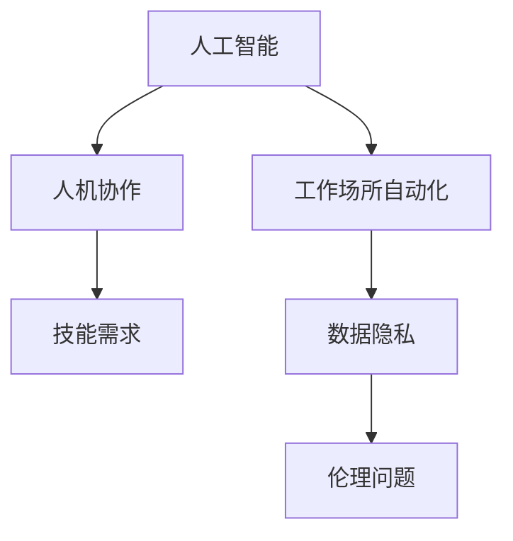

                 

# AI与人类注意力流：未来的工作场所和技能要求

## 1. 背景介绍

### 1.1 问题由来
随着人工智能(AI)技术的飞速发展，其在工作场所中的应用变得越来越普遍。从自动化流程到智能助理，AI技术正在逐渐改变我们的工作方式。然而，这一过程中也引发了一系列关于人机交互、技能需求、隐私保护等方面的问题。本文旨在探讨AI如何改变工作场所，以及未来的技能需求。

### 1.2 问题核心关键点
1. **人机交互**：AI技术如何改变工作场所的互动方式，提升工作效率。
2. **技能需求**：AI时代对人类技能的新要求，包括技术技能和软技能。
3. **隐私保护**：如何在AI应用中保护个人隐私和数据安全。
4. **伦理考量**：AI技术的伦理问题，如偏见和歧视。
5. **就业影响**：AI对就业市场的影响，包括工作岗位的替代与创造。

### 1.3 问题研究意义
研究AI技术对工作场所的影响，对于理解未来职场变化、预测技能需求、制定应对策略具有重要意义。这不仅有助于企业更好地利用AI技术提升竞争力，也有助于个体提升技能，适应未来职场的需求。

## 2. 核心概念与联系

### 2.1 核心概念概述

为更好地理解AI技术对工作场所的影响，本节将介绍几个关键概念及其相互联系：

- **人工智能(AI)**：通过机器学习、深度学习等技术，使计算机系统能够执行需要人类智能的任务。
- **工作场所自动化**：通过AI技术自动化执行繁琐、重复的任务，提升工作效率。
- **人机协作**：AI与人类共同完成任务，实现优势互补。
- **技能需求**：随着AI技术的引入，对人类技能的需求也会发生变化。
- **数据隐私**：AI系统在处理个人数据时，如何保障用户隐私。
- **伦理问题**：AI技术在使用过程中可能引发的伦理问题，如偏见和歧视。

这些概念之间存在紧密联系，共同构成了AI与人类交互的复杂生态系统。

### 2.2 核心概念原理和架构的 Mermaid 流程图



这个流程图展示了AI技术在职场中的作用及其引发的相关问题。

## 3. 核心算法原理 & 具体操作步骤

### 3.1 算法原理概述

AI技术在工作场所的应用主要基于机器学习、深度学习等算法。这些算法通过大量数据的训练，使得计算机能够识别模式、做出决策，并执行任务。对于人机协作，通常采用强化学习、协同过滤等方法，使AI与人类共同完成任务。

### 3.2 算法步骤详解

**Step 1: 数据准备与预处理**
- 收集相关数据，进行清洗和标注。
- 使用数据增强技术提高数据的多样性。

**Step 2: 模型选择与训练**
- 选择合适的AI模型，如深度神经网络、支持向量机等。
- 在标注数据上训练模型，调整超参数以获得最佳性能。

**Step 3: 模型部署与应用**
- 将训练好的模型部署到实际工作场景中。
- 监测模型性能，定期更新模型以适应新的工作任务。

**Step 4: 持续学习与优化**
- 通过反馈数据不断优化模型，提高其泛化能力。
- 引入对抗样本提高模型的鲁棒性。

### 3.3 算法优缺点

AI技术在工作场所的应用具有以下优点：
1. 提升工作效率：自动执行重复性任务，减少人工错误。
2. 优化决策过程：基于数据驱动的决策更准确。
3. 增强人机协作：AI与人协作完成复杂任务。

但同时也有以下缺点：
1. 数据隐私问题：大量个人数据被收集和处理，隐私风险增加。
2. 伦理问题：AI系统可能带有偏见，导致不公正决策。
3. 技能替代风险：部分岗位可能被自动化取代。

### 3.4 算法应用领域

AI技术已经应用于多个领域，包括但不限于：

- **制造业**：自动化生产线、质量检测。
- **医疗行业**：疾病诊断、治疗方案优化。
- **金融服务**：风险评估、智能投顾。
- **客户服务**：智能客服、自动化报告。
- **教育**：个性化学习、自动评分。

## 4. 数学模型和公式 & 详细讲解

### 4.1 数学模型构建

在AI应用中，通常会使用机器学习模型来处理数据和执行任务。以分类问题为例，模型目标是将数据分为不同的类别。常用的模型包括决策树、支持向量机、随机森林等。

### 4.2 公式推导过程

以决策树为例，假设我们有一个二分类问题，数据集为 $(x_1, y_1), (x_2, y_2), ..., (x_n, y_n)$，其中 $x_i$ 为特征向量，$y_i \in \{0, 1\}$ 为标签。决策树的构建过程如下：

1. 选择最优的特征 $x_k$ 作为分裂节点。
2. 对每个子集 $x_{k_1}, x_{k_2}, ..., x_{k_m}$ 递归构建子树。
3. 最终得到一棵决策树，用于分类预测。

公式表示如下：

$$
T(x) = \begin{cases} 
      \text{Node}_1 & \text{if} \quad x_k \leq \text{Split}_1 \\
      \text{Node}_2 & \text{if} \quad x_k > \text{Split}_1 
   \end{cases}
$$

其中，$x_k$ 为待分类特征，$\text{Split}_1$ 为分裂阈值，$\text{Node}_1, \text{Node}_2$ 为左右子树。

### 4.3 案例分析与讲解

假设我们有一个数据集，包含客户购买行为数据。我们希望通过AI模型预测客户是否会再次购买。数据集包括客户的年龄、性别、购买金额等特征，以及是否再次购买的标签。

首先，我们收集和清洗数据，然后进行特征工程，选择和构建特征。接着，我们训练决策树模型，并使用交叉验证调整超参数。最后，我们将模型部署到实际应用中，通过新数据进行测试和优化。

## 5. 项目实践：代码实例和详细解释说明

### 5.1 开发环境搭建

在进行AI项目实践前，我们需要准备好开发环境。以下是使用Python进行机器学习开发的环境配置流程：

1. 安装Anaconda：从官网下载并安装Anaconda，用于创建独立的Python环境。

2. 创建并激活虚拟环境：
```bash
conda create -n ml-env python=3.8 
conda activate ml-env
```

3. 安装必要的库：
```bash
pip install numpy pandas scikit-learn matplotlib seaborn
```

完成上述步骤后，即可在`ml-env`环境中开始AI项目的开发。

### 5.2 源代码详细实现

我们以决策树模型为例，给出Python代码实现。

```python
from sklearn.model_selection import train_test_split
from sklearn.ensemble import DecisionTreeClassifier
from sklearn.metrics import accuracy_score

# 假设我们有一个包含客户购买行为数据的数据集
data = pd.read_csv('customer_purchase_data.csv')

# 分离特征和标签
X = data[['age', 'gender', 'purchase_amount']]
y = data['repeat_purchase']

# 划分训练集和测试集
X_train, X_test, y_train, y_test = train_test_split(X, y, test_size=0.2, random_state=42)

# 训练决策树模型
clf = DecisionTreeClassifier()
clf.fit(X_train, y_train)

# 预测测试集
y_pred = clf.predict(X_test)

# 计算准确率
accuracy = accuracy_score(y_test, y_pred)
print(f"Accuracy: {accuracy}")
```

### 5.3 代码解读与分析

让我们再详细解读一下关键代码的实现细节：

**数据准备与预处理**：
- `pd.read_csv()`：从CSV文件中读取数据集。
- `train_test_split()`：将数据集划分为训练集和测试集。

**模型选择与训练**：
- `DecisionTreeClassifier()`：选择决策树模型。
- `clf.fit(X_train, y_train)`：在训练集上训练模型。

**模型部署与应用**：
- `clf.predict(X_test)`：在测试集上进行预测。

**持续学习与优化**：
- `accuracy_score()`：计算模型在测试集上的准确率。

## 6. 实际应用场景

### 6.1 制造业自动化
在制造业中，AI技术可以用于自动化生产线、质量检测等。通过AI系统自动执行重复性任务，可以大幅提升生产效率和质量。

### 6.2 医疗行业智能诊断
AI技术在医疗行业中的应用包括疾病诊断、治疗方案优化等。通过AI系统分析患者数据，可以提供更准确、个性化的诊断和治疗建议。

### 6.3 金融服务风险评估
在金融服务中，AI技术可以用于风险评估、智能投顾等。通过AI系统分析金融数据，可以更准确地评估风险，提供更个性化的投资建议。

### 6.4 客户服务智能客服
AI技术在客户服务中的应用包括智能客服、自动化报告等。通过AI系统自动处理客户咨询，可以提升服务效率，改善客户体验。

### 6.5 教育个性化学习
AI技术在教育中的应用包括个性化学习、自动评分等。通过AI系统分析学生数据，可以提供更个性化的学习建议，提升教学效果。

## 7. 工具和资源推荐

### 7.1 学习资源推荐

为了帮助开发者系统掌握AI技术及其应用，这里推荐一些优质的学习资源：

1. 《Python机器学习》书籍：由Sebastian Raschka撰写，介绍了机器学习的基础知识和常用算法。
2. Coursera《机器学习》课程：由Andrew Ng教授讲授，深入浅出地介绍了机器学习原理和应用。
3. Google AI公开课：涵盖从基础到高级的AI技术，包括TensorFlow、深度学习等。
4. Kaggle竞赛平台：提供大量数据集和竞赛任务，适合实战练习。
5. Arxiv预印本网站：最新的人工智能研究成果，适合跟踪前沿技术。

通过对这些资源的学习实践，相信你一定能够快速掌握AI技术及其应用，并将其用于解决实际问题。

### 7.2 开发工具推荐

高效的开发离不开优秀的工具支持。以下是几款用于AI项目开发的常用工具：

1. Jupyter Notebook：交互式开发环境，支持Python代码编写、数据分析、可视化。
2. TensorFlow：由Google主导开发的深度学习框架，支持分布式训练和模型部署。
3. PyTorch：由Facebook主导开发的深度学习框架，灵活易用，适合研究和原型开发。
4. scikit-learn：Python机器学习库，提供了各种常用算法和工具。
5. Matplotlib和Seaborn：数据可视化工具，支持绘制图表、数据分布等。

合理利用这些工具，可以显著提升AI项目开发效率，加快创新迭代的步伐。

### 7.3 相关论文推荐

AI技术的发展源于学界的持续研究。以下是几篇奠基性的相关论文，推荐阅读：

1. AlexNet: ImageNet Classification with Deep Convolutional Neural Networks：提出深度卷积神经网络，开启了深度学习时代。
2. Deep Learning：由Yoshua Bengio、Geoffrey Hinton和Aaron Courville合著，全面介绍了深度学习的基本理论和实践。
3. Reinforcement Learning: An Introduction：由Richard S. Sutton和Andrew G. Barto合著，介绍了强化学习的基本原理和应用。
4. Generative Adversarial Networks：提出生成对抗网络，推动了生成模型的发展。
5. AlphaGo：提出深度强化学习模型，首次在围棋领域实现人类水平以上的表现。

这些论文代表了大数据、深度学习、强化学习等领域的发展脉络。通过学习这些前沿成果，可以帮助研究者把握学科前进方向，激发更多的创新灵感。

## 8. 总结：未来发展趋势与挑战

### 8.1 研究成果总结
本文对AI技术在工作场所的应用进行了全面系统的介绍。从数据准备到模型训练，再到模型部署与应用，详细讲解了AI技术的全流程。同时，本文还探讨了AI技术对工作场所的深刻影响，以及未来的技能需求和伦理问题。

通过本文的系统梳理，可以看到，AI技术正在深刻改变我们的工作方式，提升工作效率和质量。然而，这也带来了新的挑战，如数据隐私、伦理问题等。因此，未来的研究需要在技术、伦理、隐私等方面进行全面探索和突破。

### 8.2 未来发展趋势
展望未来，AI技术在工作场所的应用将呈现以下几个发展趋势：

1. **自动化与智能化**：随着技术的发展，AI将更广泛地应用于自动化流程，提升工作效率和质量。
2. **人机协作**：AI系统将更多地与人类协作，共同完成任务，实现优势互补。
3. **多模态融合**：AI系统将融合视觉、听觉、触觉等多模态信息，提升任务处理能力。
4. **个性化定制**：AI系统将根据用户需求，提供个性化服务，提升用户体验。
5. **跨领域应用**：AI技术将更广泛地应用于各个领域，推动社会进步和经济发展。

### 8.3 面临的挑战
尽管AI技术在工作场所的应用前景广阔，但也面临着诸多挑战：

1. **数据隐私问题**：大量个人数据被收集和处理，隐私风险增加。
2. **伦理问题**：AI系统可能带有偏见，导致不公正决策。
3. **技能需求变化**：部分岗位可能被自动化取代，对人类技能提出新的要求。
4. **技术复杂性**：AI技术的实现和维护复杂，需要大量的技术储备。
5. **安全问题**：AI系统可能被恶意攻击，影响系统安全。

### 8.4 研究展望
面对AI技术在工作场所的应用所面临的挑战，未来的研究需要在以下几个方面寻求新的突破：

1. **隐私保护技术**：开发更加高效、安全的隐私保护技术，保障用户数据安全。
2. **公平性算法**：引入公平性算法，减少AI系统的偏见和歧视。
3. **跨领域应用技术**：将AI技术应用于更多领域，推动社会进步和经济发展。
4. **人机协作技术**：开发更加高效的人机协作技术，提升AI系统的使用效果。
5. **跨模态融合技术**：融合视觉、听觉、触觉等多模态信息，提升AI系统的任务处理能力。

## 9. 附录：常见问题与解答

**Q1: AI技术在工作场所的应用有哪些？**

A: AI技术在工作场所的应用非常广泛，包括但不限于自动化生产线、智能诊断、风险评估、智能客服、个性化学习等。

**Q2: AI技术的优势和劣势是什么？**

A: AI技术的优势包括提升工作效率、优化决策过程、实现人机协作等。劣势包括数据隐私问题、伦理问题、技能替代风险等。

**Q3: 如何保护AI系统中的数据隐私？**

A: 保护AI系统中的数据隐私，可以采用数据加密、匿名化、差分隐私等技术，确保数据安全。

**Q4: 如何减少AI系统的偏见？**

A: 减少AI系统的偏见，可以采用公平性算法、多样性数据集、定期审计等方法，确保AI系统的公正性。

**Q5: AI技术在未来的发展方向是什么？**

A: AI技术在未来的发展方向包括自动化与智能化、人机协作、多模态融合、个性化定制、跨领域应用等。

---

作者：禅与计算机程序设计艺术 / Zen and the Art of Computer Programming

