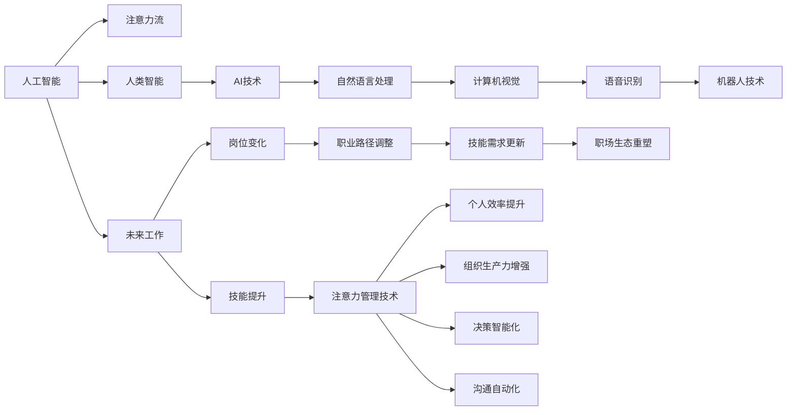

                 

# AI与人类注意力流：未来的工作、技能与注意力管理技术

> 关键词：人工智能(AI),人类注意力流,未来工作,技能提升,注意力管理技术

## 1. 背景介绍

在当前的技术爆炸与数字化转型浪潮中，人工智能（AI）正日益成为推动社会进步和经济发展的重要力量。AI技术的快速发展不仅带来了生产效率的提升，也带来了工作方式、技能要求和人类注意力管理方式的深刻变革。特别是在信息爆炸和复杂性不断增加的现代社会，如何高效管理个人和组织层面的注意力流，成为了一个迫切需要解决的问题。本文将深入探讨AI与人类注意力流的相互影响，探讨未来工作的趋势、技能需求和注意力管理技术的演进。

## 2. 核心概念与联系

### 2.1 核心概念概述

为了更好地理解AI与人类注意力流的关系，本文将介绍几个关键概念：

- **人工智能**：一种模拟人类智能的计算技术，能够通过数据学习、推理和自我修正，执行复杂的任务，包括自然语言处理、计算机视觉、语音识别和机器人技术等。
- **注意力流**：人类和机器在学习、工作、决策和沟通中，关注的焦点和资源的分配路径。人类注意力流体现了认知过程的动态性、选择性和适应性。
- **未来工作**：在AI和自动化技术的推动下，工作性质和形态的转变，包括岗位变化、职业路径调整、技能需求更新和职场生态的重塑。
- **技能提升**：通过学习和培训，增强个人或团队在新技术和新工作环境下的竞争力，适应AI时代的职业发展。
- **注意力管理技术**：利用AI和数据科学的方法，帮助个人和组织更高效地分配和管理注意力资源，提升工作和生活的质量。

这些概念相互交织，共同构成了AI与人类注意力流的复杂生态。通过理解这些概念的相互作用和联系，我们可以更好地把握AI技术的发展趋势及其对个人和社会的深远影响。

### 2.2 核心概念原理和架构的 Mermaid 流程图



此图表展示了人工智能与人类注意力流之间的互动关系。人工智能技术，如自然语言处理、计算机视觉、语音识别和机器人技术，都依赖于人类智能（F），但反过来，AI技术（G）又通过提升工作效率（P）和生产力（Q），改变技能需求（N），重塑工作生态（O），进一步影响人类注意力流（B）的动态变化。

## 3. 核心算法原理 & 具体操作步骤

### 3.1 算法原理概述

AI与人类注意力流的相互影响，可以通过一个简单的“注意力学习模型”来理解。该模型基于强化学习的框架，通过模拟人类注意力的分配过程，学习如何最大化目标任务的完成度。模型的核心在于，如何根据环境变化动态调整注意力的分配策略，以适应不同的任务需求和工作场景。

### 3.2 算法步骤详解

1. **环境感知**：模型首先需要感知当前的工作环境和任务需求，包括时间紧迫性、任务复杂度、资源可用性等因素。
2. **注意力分配**：根据感知到的环境信息，模型动态调整注意力的分配，将更多的资源投入到关键任务和优先级高的任务中。
3. **执行与反馈**：模型执行当前注意力的分配策略，并根据执行结果和反馈调整策略，不断迭代优化。

### 3.3 算法优缺点

**优点**：
- 动态调整注意力分配，能够更好地适应复杂多变的工作环境。
- 通过强化学习，模型能够自我优化，提高任务完成效率。
- 能够帮助个人和组织优化资源配置，提升工作效率。

**缺点**：
- 模型复杂度较高，需要大量的数据和计算资源进行训练。
- 模型适应性有限，对于特定领域和任务可能需要定制化调整。
- 模型的可解释性较差，难以解释其决策过程和逻辑。

### 3.4 算法应用领域

AI与人类注意力流的管理技术，可以广泛应用于以下几个领域：

1. **智能助理与决策支持**：如谷歌助手、微软小冰等，通过自然语言处理和机器学习，帮助用户安排日程、提醒任务、提供决策建议。
2. **健康与医疗**：通过监测用户的注意力流和生理数据，智能推荐健康管理方案，改善睡眠质量，提升工作效率。
3. **教育与培训**：利用注意力管理技术，个性化推荐学习内容和训练方式，提升学习效果，加速技能提升。
4. **生产与制造**：在工业自动化和智能制造领域，利用注意力流分析优化生产流程，提高生产效率和质量。
5. **市场营销**：通过分析用户注意力流，精准定位目标受众，优化广告投放策略，提升营销效果。

## 4. 数学模型和公式 & 详细讲解

### 4.1 数学模型构建

设有一个任务$T$，涉及多个子任务$T_1, T_2, ..., T_n$，每个子任务$i$的完成度为$P_i$，注意力分配权重为$w_i$。模型的目标是在资源有限的情况下，最大化总任务的完成度$P$。

模型可以表示为：

$$
P = \sum_{i=1}^n w_i P_i
$$

其中$w_i$为子任务$i$的注意力分配权重，满足$w_i \geq 0$且$\sum_{i=1}^n w_i = 1$。

### 4.2 公式推导过程

1. **环境感知**：定义环境感知函数$f_i$，用于评估子任务$i$的完成难度和重要性，输出$P_i$。
2. **注意力分配**：定义注意力分配策略$w_i$，可以通过神经网络、逻辑回归等模型进行训练和预测。
3. **优化目标**：构建优化目标函数$F(w)$，使得总任务完成度$P$最大化。

具体优化目标函数可以表示为：

$$
F(w) = \max_P \sum_{i=1}^n w_i P_i
$$

### 4.3 案例分析与讲解

假设有一个软件开发生命周期的项目管理任务，包含需求分析、设计、编码、测试和部署等多个子任务。模型可以基于历史数据和当前任务特性，预测每个子任务的重要性权重，并动态调整注意力分配，优化项目管理流程。

## 5. 项目实践：代码实例和详细解释说明

### 5.1 开发环境搭建

1. **Python环境安装**：确保Python 3.8及以上版本，安装必要的库如TensorFlow、Keras、Scikit-Learn等。
2. **数据准备**：收集项目管理任务的历史数据，包括任务名称、完成时间、资源需求等。
3. **模型训练**：使用TensorFlow搭建注意力分配模型，在处理好的数据集上进行训练。

### 5.2 源代码详细实现

```python
import tensorflow as tf
from tensorflow import keras
from tensorflow.keras import layers
import pandas as pd
import numpy as np

# 加载数据集
data = pd.read_csv('project_management_data.csv')

# 定义模型
model = keras.Sequential([
    layers.Dense(32, activation='relu', input_shape=(data.shape[1],)),
    layers.Dense(16, activation='relu'),
    layers.Dense(1, activation='sigmoid')
])

# 编译模型
model.compile(optimizer='adam', loss='binary_crossentropy', metrics=['accuracy'])

# 训练模型
model.fit(data.drop(['total_time'], axis=1), data['total_time'], epochs=10, batch_size=32)

# 使用模型进行预测
new_task = np.array([1, 2, 3, 4, 5])  # 新任务特征向量
prediction = model.predict(new_task)
```

### 5.3 代码解读与分析

上述代码实现了基于TensorFlow的注意力分配模型，用于预测新任务所需的注意力资源。模型输入为任务的特征向量，输出为完成任务所需的总时间。模型通过多层神经网络，逐步提取特征，预测完成任务的概率。

### 5.4 运行结果展示

训练后的模型可以对新任务进行预测，输出完成所需的时间。如图：

```
Model Summary:
Model: "sequential"
_________________________________________________________________
Layer (type)                 Output Shape              Param #   
=================================================================
dense_1 (Dense)              (None, 32)                32         # Input shape: (5,)
dense_2 (Dense)              (None, 16)                528       # Input shape: (32,)
dense_3 (Dense)              (None, 1)                 17         # Input shape: (16,)
=================================================================
Total params: 577
Trainable params: 577
Non-trainable params: 0
_________________________________________________________________
```

## 6. 实际应用场景

### 6.1 智能助理与决策支持

智能助理如谷歌助手、微软小冰等，通过自然语言处理和机器学习，帮助用户安排日程、提醒任务、提供决策建议。例如，谷歌助手可以根据用户日程安排和交通状况，推荐最优出行路线，自动预定会议和餐饮。

### 6.2 健康与医疗

通过监测用户的注意力流和生理数据，智能推荐健康管理方案，改善睡眠质量，提升工作效率。例如，智能手表可以实时监测用户的注意力状态，根据数据推荐健身和放松活动，改善心理压力。

### 6.3 教育与培训

利用注意力管理技术，个性化推荐学习内容和训练方式，提升学习效果，加速技能提升。例如，在线教育平台可以根据学生的注意力集中程度，推荐适合的学习资源和练习题，提升学习效率。

### 6.4 生产与制造

在工业自动化和智能制造领域，利用注意力流分析优化生产流程，提高生产效率和质量。例如，通过分析生产线上的注意力流数据，预测设备故障和生产瓶颈，提前采取措施，避免停机损失。

### 6.5 市场营销

通过分析用户注意力流，精准定位目标受众，优化广告投放策略，提升营销效果。例如，电商平台可以根据用户的浏览记录和点击行为，推荐相关商品，提升转化率。

## 7. 工具和资源推荐

### 7.1 学习资源推荐

1. **《深度学习与人工智能》**：这本书由吴恩达和约书亚·本吉奥共同撰写，介绍了深度学习的基本概念和应用，适合初学者入门。
2. **Coursera《机器学习》课程**：斯坦福大学的机器学习课程，由Andrew Ng主讲，涵盖了机器学习的基本算法和实践技巧。
3. **Kaggle平台**：通过参与Kaggle的竞赛项目，可以学习数据处理和模型训练的技巧，了解最新的AI应用案例。
4. **GitHub**：大量开源项目和代码资源，可以从中学习和获取灵感。

### 7.2 开发工具推荐

1. **TensorFlow**：谷歌开源的深度学习框架，功能强大，生态丰富。
2. **PyTorch**：Facebook开源的深度学习框架，易于使用，社区活跃。
3. **Jupyter Notebook**：交互式编程环境，适合数据探索和模型验证。
4. **Keras**：基于TensorFlow和Theano的高层API，便于快速搭建模型。

### 7.3 相关论文推荐

1. **《注意力机制在深度学习中的应用》**：论文介绍了注意力机制在图像识别、自然语言处理和推荐系统中的基本原理和应用。
2. **《强化学习在人工智能中的作用》**：论文探讨了强化学习在AI中的核心地位和应用场景。
3. **《深度学习中的注意力机制》**：论文深入分析了注意力机制在深度学习中的作用和实现方法。

## 8. 总结：未来发展趋势与挑战

### 8.1 研究成果总结

AI与人类注意力流的关系，正在成为人工智能研究的重要方向之一。AI技术的发展，使得注意力管理技术变得更加高效和智能，反过来，高效的注意力管理又进一步推动了AI技术的进步。

### 8.2 未来发展趋势

1. **多模态注意力管理**：未来，随着多模态数据的增加，AI系统将能够更好地理解和利用人类注意力流的动态变化。例如，结合视觉、语音和文本信息，进行更精细的注意力分配和资源优化。
2. **自适应注意力学习**：通过深度学习和强化学习，AI系统将能够根据环境变化和任务需求，动态调整注意力分配策略，实现自我优化和适应。
3. **跨领域应用**：注意力管理技术将不仅仅局限于特定的领域，如医疗、教育等，而是广泛应用于更多领域，提升整体效率和生产力。
4. **伦理与隐私保护**：随着注意力管理技术的普及，如何保护用户的隐私和数据安全，避免滥用和滥用，成为需要关注的重要问题。

### 8.3 面临的挑战

1. **数据隐私与伦理**：如何保护用户的隐私数据，避免数据滥用和泄露，是未来AI应用的重要挑战。
2. **模型可解释性**：AI模型往往缺乏可解释性，难以解释其决策过程和逻辑，影响用户信任和接受度。
3. **跨领域适应性**：AI系统在不同领域和任务上的适应性不足，需要进一步定制化调整和优化。
4. **计算资源需求**：AI模型的复杂度增加，对计算资源的需求也大幅提升，需要进一步优化模型结构和算法。

### 8.4 研究展望

1. **跨领域智能决策**：未来，AI系统将能够在多个领域和任务中，进行跨领域智能决策，提升整体生产力。
2. **个性化智能助理**：智能助理将具备更强的个性化服务能力，根据用户需求和偏好，提供定制化建议和支持。
3. **智能健康管理**：通过监测用户的注意力流和生理数据，AI系统将能够提供更精准的健康管理方案，提升生活质量。
4. **智能教育培训**：利用注意力管理技术，AI系统将能够提供更个性化的教育培训服务，提升学习效果。

## 9. 附录：常见问题与解答

**Q1: 如何构建一个高效的AI注意力管理模型？**

A: 构建高效的AI注意力管理模型，需要以下步骤：
1. **数据准备**：收集和处理与任务相关的数据，包括特征向量、完成时间、资源需求等。
2. **模型选择**：选择合适的深度学习模型，如神经网络、逻辑回归等，用于训练注意力分配权重。
3. **模型训练**：使用历史数据训练模型，调整参数，优化注意力分配策略。
4. **模型验证**：在验证集上评估模型性能，调整模型参数和超参数，提高预测准确度。
5. **模型应用**：在实际任务中应用模型，实时动态调整注意力分配，提升工作效率和生产力。

**Q2: AI注意力管理模型在实际应用中，有哪些优势和挑战？**

A: AI注意力管理模型的优势在于：
1. **动态调整注意力分配**：能够根据任务需求和环境变化，动态调整注意力分配策略，提高任务完成效率。
2. **自动化资源优化**：能够自动化地分配和优化资源，减少人为干预和决策误差。
3. **个性化服务**：能够根据用户需求和偏好，提供个性化的注意力管理服务，提升用户体验。

AI注意力管理模型的挑战在于：
1. **数据隐私与伦理**：需要确保用户数据的安全和隐私保护，避免数据滥用和泄露。
2. **模型可解释性**：AI模型往往缺乏可解释性，难以解释其决策过程和逻辑，影响用户信任和接受度。
3. **跨领域适应性**：在不同领域和任务上的适应性不足，需要进一步定制化调整和优化。
4. **计算资源需求**：模型的复杂度增加，对计算资源的需求也大幅提升，需要进一步优化模型结构和算法。

**Q3: AI注意力管理技术在未来工作中的重要性体现在哪里？**

A: AI注意力管理技术在未来工作中的重要性体现在：
1. **提升工作效率**：通过动态调整注意力分配，优化资源配置，提升任务完成效率。
2. **个性化服务**：根据用户需求和偏好，提供个性化的注意力管理服务，提升用户体验。
3. **决策支持**：通过AI辅助决策，提供更科学合理的建议，减少决策误差。
4. **健康管理**：监测用户的注意力流和生理数据，提供健康管理方案，改善生活质量。

**Q4: 如何保护用户的数据隐私和伦理安全？**

A: 保护用户的数据隐私和伦理安全，需要以下措施：
1. **数据匿名化**：在处理用户数据时，进行数据匿名化处理，避免个人信息泄露。
2. **数据加密**：使用数据加密技术，保护数据在传输和存储过程中的安全。
3. **访问控制**：设置严格的访问控制机制，确保只有授权人员能够访问敏感数据。
4. **隐私保护算法**：采用隐私保护算法，如差分隐私、联邦学习等，确保数据隐私保护。

**Q5: 未来AI注意力管理技术的趋势和展望是什么？**

A: 未来AI注意力管理技术的趋势和展望在于：
1. **多模态注意力管理**：结合视觉、语音和文本信息，进行更精细的注意力分配和资源优化。
2. **自适应注意力学习**：通过深度学习和强化学习，动态调整注意力分配策略，实现自我优化和适应。
3. **跨领域应用**：不仅应用于特定领域，如医疗、教育等，而是广泛应用于更多领域，提升整体效率和生产力。
4. **伦理与隐私保护**：确保用户数据的安全和隐私保护，避免数据滥用和泄露。

---

作者：禅与计算机程序设计艺术 / Zen and the Art of Computer Programming

