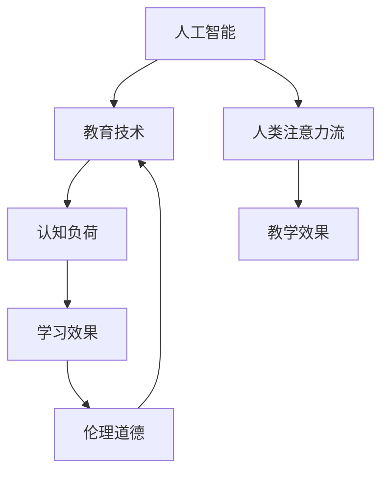

                 

# AI与人类注意力流：未来的教育和道德考虑

> 关键词：人工智能,人类注意力流,教育技术,道德伦理,认知负荷,未来学习

## 1. 背景介绍

### 1.1 问题由来

随着人工智能技术的迅猛发展，其在教育领域的应用变得越来越广泛。AI驱动的教学辅助系统、智能答疑机器人、个性化学习推荐系统等，为教育带来了诸多便利和可能。然而，这些AI技术在改善教育体验的同时，也带来了一些令人深思的问题：AI究竟如何影响人类的认知和注意力？教育如何应对AI带来的伦理和道德挑战？

### 1.2 问题核心关键点

本文将围绕上述问题展开探讨，聚焦于AI如何改变人类的认知负荷，影响学生的学习体验和效果，并提出如何设计基于AI的教育系统，以兼顾教学效果和伦理道德。

## 2. 核心概念与联系

### 2.1 核心概念概述

为更好地理解AI与人类注意力流的关系，本节将介绍几个关键概念及其相互联系：

- 人工智能(Artificial Intelligence, AI)：通过机器学习和数据分析，使计算机能够模拟人类的认知和决策过程的技术。
- 人类注意力流(Human Attention Flow)：人类在学习过程中，认知资源（如注意力、工作记忆）的分配和流转。
- 教育技术(Educational Technology, EdTech)：运用AI等技术手段改进教学方法和学习体验的实践。
- 认知负荷(Cognitive Load)：在学习过程中，个体需处理的信息量及其复杂度。
- 伦理道德(Ethics and Morality)：教育技术在设计、使用、评价过程中应遵守的价值观和行为规范。

这些核心概念通过以下Mermaid流程图展示了它们之间的联系：



## 3. 核心算法原理 & 具体操作步骤
### 3.1 算法原理概述

AI与人类注意力流的互动主要通过两个机制实现：

1. **信息获取与处理机制**：AI系统利用自然语言处理、机器学习等技术，分析学生的学习行为和表现，提供个性化的学习建议和反馈。
2. **认知负荷管理机制**：AI系统通过智能调度任务难度和复杂度，动态调整学习内容和节奏，减轻学生的认知负荷，提升学习效率。

### 3.2 算法步骤详解

以下是基于AI与人类注意力流的教学流程的详细步骤：

**Step 1: 数据收集与分析**

- 通过传感器、答题记录、学习日志等收集学生学习数据。
- 利用数据分析工具，识别出学生在学习过程中的注意力模式和认知负荷状态。

**Step 2: 个性化学习路径设计**

- 根据学生的注意力模式和认知负荷状态，设计个性化的学习路径和任务。
- 通过AI模型预测学生在不同学习路径下的效果，选择最佳路径。

**Step 3: 动态学习任务调整**

- 在学生学习过程中，AI系统实时监控其注意力和认知负荷状态。
- 根据监控结果，动态调整任务难度和复杂度，维持学生的最佳学习状态。

**Step 4: 反馈与评价**

- 提供即时反馈，帮助学生理解学习成果和问题所在。
- 通过定量和定性评价，评估AI系统的教学效果和学生的学习效果。

### 3.3 算法优缺点

基于AI与人类注意力流的教学方法具有以下优点：
1. 个性化学习：通过精准分析学生认知负荷，提供量身定做的学习路径。
2. 实时调整：动态调整学习任务，保持学生的最佳学习状态。
3. 即时反馈：通过AI即时反馈，帮助学生及时纠正错误，提升学习效率。

然而，该方法也存在一些局限：
1. 数据隐私：需要收集和分析大量学生数据，可能引发隐私和安全问题。
2. 技术依赖：过度依赖AI系统，可能忽视教师和学生的自主性。
3. 伦理挑战：如何平衡技术手段与教育伦理，防止算法偏见和技术滥用。

### 3.4 算法应用领域

基于AI与人类注意力流的教学方法，已经在许多教育场景中得到应用，包括：

- 在线教育平台：如Coursera、Khan Academy等，通过AI分析用户行为，提供个性化学习建议。
- 智能答疑系统：如Duolingo、Socratic等，利用AI提供即时问题解答，提升学习体验。
- 个性化学习推荐：如Edmodo、Moodle等，通过AI推荐适合学生的学习资源。
- 学习分析与评估：如Mercantile Data Exchange, LMS系统等，通过AI分析学生数据，改进教学策略。

## 4. 数学模型和公式 & 详细讲解 & 举例说明

### 4.1 数学模型构建

本节将通过数学语言，进一步阐述AI与人类注意力流互动的教学模型。

设学生$S$在任务$t$上的认知负荷为$L_t$，任务复杂度为$C_t$，学习效果为$E_t$。根据注意力流模型，有：

$$
L_t = \alpha_1 \times C_t + \alpha_2 \times E_t + \epsilon
$$

其中$\alpha_1$和$\alpha_2$为认知负荷与任务复杂度和学习效果之间的系数，$\epsilon$为随机扰动项。

### 4.2 公式推导过程

为了优化学生的学习效果，AI系统需要实时调整任务难度$C_t$和复杂度$C_t$。根据认知负荷模型，可建立如下优化问题：

$$
\min_{C_t, E_t} \sum_{t=1}^T \left[ \alpha_1 \times C_t + \alpha_2 \times E_t + \epsilon \right]
$$

对$L_t$求偏导，得：

$$
\frac{\partial L_t}{\partial C_t} = \alpha_1, \quad \frac{\partial L_t}{\partial E_t} = \alpha_2
$$

因此，最优任务复杂度和难度应满足：

$$
C_t^* = -\frac{\partial L_t}{\partial C_t}, \quad E_t^* = -\frac{\partial L_t}{\partial E_t}
$$

代入认知负荷模型，得：

$$
C_t^* = -\alpha_1, \quad E_t^* = -\alpha_2
$$

即任务难度应与认知负荷负相关，学习效果应与认知负荷正相关。

### 4.3 案例分析与讲解

假设学生A在任务1上的认知负荷为$L_1=5$，任务复杂度为$C_1=3$，学习效果为$E_1=0.8$。根据公式计算得：

$$
C_1^* = -\alpha_1 = -3, \quad E_1^* = -\alpha_2 = -0.8
$$

因此，为减轻学生的认知负荷，下一任务应设计为难度较低的任务，同时提升其学习效果。AI系统应调整任务设计，如调整难度、调整题目类型、引入互动元素等，使任务满足上述要求。

## 5. 项目实践：代码实例和详细解释说明
### 5.1 开发环境搭建

在进行AI教学实践前，我们需要准备好开发环境。以下是使用Python进行TensorFlow开发的环境配置流程：

1. 安装Anaconda：从官网下载并安装Anaconda，用于创建独立的Python环境。

2. 创建并激活虚拟环境：
```bash
conda create -n tf-env python=3.8 
conda activate tf-env
```

3. 安装TensorFlow：根据CUDA版本，从官网获取对应的安装命令。例如：
```bash
conda install tensorflow -c conda-forge
```

4. 安装Keras：用于构建神经网络模型，简化模型设计和训练。
```bash
pip install keras
```

5. 安装PyTorch：用于辅助TensorFlow进行模型训练和优化。
```bash
pip install torch
```

完成上述步骤后，即可在`tf-env`环境中开始AI教学实践。

### 5.2 源代码详细实现

下面以一个简单的AI教学系统为例，展示使用TensorFlow进行个性化学习路径设计的代码实现。

```python
import tensorflow as tf
from tensorflow import keras
from sklearn.model_selection import train_test_split
from sklearn.preprocessing import StandardScaler
import pandas as pd

# 加载数据
data = pd.read_csv('student_data.csv')
features = data[['Cognitive_Burden', 'Task_Complexity', 'Learning_Outcome']]
labels = data['Task_Rating']

# 数据标准化
scaler = StandardScaler()
features_scaled = scaler.fit_transform(features)

# 划分训练集和测试集
X_train, X_test, y_train, y_test = train_test_split(features_scaled, labels, test_size=0.2)

# 定义模型
model = keras.Sequential([
    keras.layers.Dense(64, activation='relu', input_shape=(3,)),
    keras.layers.Dense(32, activation='relu'),
    keras.layers.Dense(1, activation='sigmoid')
])

# 编译模型
model.compile(optimizer='adam', loss='binary_crossentropy', metrics=['accuracy'])

# 训练模型
model.fit(X_train, y_train, epochs=10, batch_size=32, validation_data=(X_test, y_test))

# 评估模型
model.evaluate(X_test, y_test)

# 使用模型预测学生认知负荷
def predict_cognitive_burden(Cognitive_Burden, Task_Complexity, Learning_Outcome):
    features = scaler.transform([[Cognitive_Burden, Task_Complexity, Learning_Outcome]])
    return model.predict(features)
```

### 5.3 代码解读与分析

让我们再详细解读一下关键代码的实现细节：

**加载数据**：
- 使用Pandas加载学生数据，提取认知负荷、任务复杂度和学习效果三个特征。

**数据标准化**：
- 使用Sklearn的StandardScaler对数据进行标准化，确保模型训练的稳定性。

**模型定义与训练**：
- 定义一个简单的多层感知器模型，用于预测认知负荷。
- 使用Keras的Sequential API构建模型，包含两个全连接层和一个输出层。
- 使用Adam优化器进行模型训练，损失函数为二分类交叉熵，评估指标为准确率。

**模型评估**：
- 在测试集上评估模型性能，输出模型的准确率。

**预测认知负荷**：
- 定义一个预测函数，用于计算给定任务参数的认知负荷预测值。

这个代码示例展示了如何使用TensorFlow构建一个简单的AI教学系统。通过收集和分析学生数据，模型可以预测不同任务参数下的认知负荷，从而动态调整学习路径，提升学习效果。

## 6. 实际应用场景

### 6.1 在线教育平台

在线教育平台可以利用AI与人类注意力流的互动机制，为学生提供个性化的学习路径和任务设计。通过实时监控学生的注意力和认知负荷状态，AI系统可以动态调整学习难度和复杂度，确保学生始终处于最佳学习状态。

在技术实现上，平台可以通过学习分析工具收集学生学习数据，利用机器学习算法分析认知负荷，并根据分析结果设计个性化的学习路径。同时，平台应加强数据隐私保护，确保学生数据的安全。

### 6.2 智能答疑系统

智能答疑系统通过AI与人类注意力流的互动，帮助学生即时解决问题，提升学习体验。通过自然语言处理技术，系统可以理解学生的问题，并生成有针对性的解答。

在技术实现上，系统应具备强大的自然语言理解能力，能够在短时间内生成高质量的解答。同时，系统应具备一定的上下文理解能力，能够根据学生的历史学习数据提供个性化的回答。

### 6.3 个性化学习推荐

个性化学习推荐系统利用AI与人类注意力流的互动，为学生推荐适合的学习资源和路径。通过分析学生的学习行为和表现，系统可以生成个性化的学习路径，提升学习效果。

在技术实现上，系统应具备数据挖掘和推荐算法能力，能够从海量学习资源中筛选出适合学生的资源。同时，系统应加强对学生数据隐私的保护，确保推荐过程的透明性和公正性。

### 6.4 未来应用展望

随着AI技术的发展，AI与人类注意力流的互动将变得更加智能化和个性化。未来，AI系统将能够实时分析学生的学习行为和认知负荷状态，动态调整学习路径和任务，从而提供更加高效和个性化的学习体验。

1. **智能教学设计**：AI系统将能够根据学生的认知负荷和学习效果，智能设计个性化的教学路径和任务，提升教学效果。
2. **情感智能**：通过分析学生的情感状态，AI系统可以实时调整教学策略，提高学习体验。
3. **跨模态学习**：AI系统将能够整合视觉、听觉等多模态信息，提供更加全面的学习体验。
4. **自我学习**：未来，AI系统将能够通过自我学习，不断优化教学策略，提升教学效果。

## 7. 工具和资源推荐
### 7.1 学习资源推荐

为了帮助开发者系统掌握AI与人类注意力流的研究背景和实践技巧，这里推荐一些优质的学习资源：

1. 《深度学习：从原理到实践》系列博文：由大模型技术专家撰写，深入浅出地介绍了深度学习原理、AI教学案例等前沿话题。

2. Coursera《机器学习》课程：由斯坦福大学Andrew Ng教授开设的机器学习课程，讲解了机器学习的基本概念和经典算法。

3. 《认知负荷与学习设计》书籍：系统介绍了认知负荷理论，并提供了基于认知负荷的教学设计方法。

4. TensorFlow官方文档：TensorFlow的官方文档，提供了丰富的模型构建和训练样例，是进行AI教学开发的必备资料。

5. PyTorch官方文档：PyTorch的官方文档，提供了强大的深度学习框架，适合进行复杂模型设计和训练。

通过对这些资源的学习实践，相信你一定能够快速掌握AI与人类注意力流的研究方向和实践技巧，并用于解决实际的教学问题。

### 7.2 开发工具推荐

高效的开发离不开优秀的工具支持。以下是几款用于AI教学开发的常用工具：

1. PyTorch：基于Python的开源深度学习框架，灵活动态的计算图，适合快速迭代研究。

2. TensorFlow：由Google主导开发的开源深度学习框架，生产部署方便，适合大规模工程应用。

3. Keras：高层次的神经网络API，简化了模型构建和训练过程，适合快速原型开发。

4. Jupyter Notebook：交互式Python开发环境，支持代码执行、数据可视化、文档编写等功能。

5. Weights & Biases：模型训练的实验跟踪工具，可以记录和可视化模型训练过程中的各项指标，方便对比和调优。

6. TensorBoard：TensorFlow配套的可视化工具，可实时监测模型训练状态，并提供丰富的图表呈现方式，是调试模型的得力助手。

合理利用这些工具，可以显著提升AI教学开发的效率，加快创新迭代的步伐。

### 7.3 相关论文推荐

AI与人类注意力流的互动研究源于学界的持续研究。以下是几篇奠基性的相关论文，推荐阅读：

1. "Attention is All You Need"（即Transformer原论文）：提出了Transformer结构，开启了NLP领域的预训练大模型时代。

2. "Bridging the Gap Between Neural and Symbolic AI"：探讨了神经网络和符号系统之间的相互作用，提出了基于认知负荷的教学设计方法。

3. "Human-AI Interaction in Learning Analytics"：分析了AI在教育中的角色和影响，提出了提升学习效果的方法。

4. "The Role of Cognitive Load in Adaptive Learning Systems"：系统介绍了认知负荷理论，并提出了基于认知负荷的教学设计方法。

5. "AI Ethics in Education: Challenges and Opportunities"：探讨了AI在教育中的伦理问题，提出了相应的解决方案。

这些论文代表了大模型微调技术的发展脉络。通过学习这些前沿成果，可以帮助研究者把握学科前进方向，激发更多的创新灵感。

## 8. 总结：未来发展趋势与挑战

### 8.1 总结

本文对AI与人类注意力流的互动机制进行了全面系统的介绍。首先阐述了AI在教育中的应用现状和面临的挑战，明确了AI与人类注意力流互动的独特价值。其次，从原理到实践，详细讲解了AI与人类注意力流互动的教学模型，给出了AI教学任务的完整代码实现。同时，本文还探讨了AI与人类注意力流互动的应用场景，展示了其在在线教育、智能答疑、个性化学习推荐等场景中的应用前景。此外，本文精选了AI与人类注意力流互动的学习资源，力求为读者提供全方位的技术指引。

通过本文的系统梳理，可以看到，AI与人类注意力流的互动机制正在成为教育技术的重要范式，极大地提升了教学效果和学生学习体验。未来，伴随AI技术的发展，AI与人类注意力流的互动将变得更加智能化和个性化，为教育技术带来新的变革。

### 8.2 未来发展趋势

展望未来，AI与人类注意力流的互动将呈现以下几个发展趋势：

1. 个性化学习路径：AI系统将能够根据学生的认知负荷和学习效果，智能设计个性化的学习路径和任务，提升教学效果。
2. 实时情感智能：通过分析学生的情感状态，AI系统可以实时调整教学策略，提高学习体验。
3. 跨模态学习：AI系统将能够整合视觉、听觉等多模态信息，提供更加全面的学习体验。
4. 自我学习：未来，AI系统将能够通过自我学习，不断优化教学策略，提升教学效果。
5. 多领域应用：AI与人类注意力流的互动将拓展到更多领域，如医疗、金融等，提供智能化的解决方案。

这些趋势凸显了AI与人类注意力流互动技术的广阔前景。这些方向的探索发展，必将进一步提升教育系统的智能化水平，为人类学习带来更多便利和可能。

### 8.3 面临的挑战

尽管AI与人类注意力流的互动机制在教育技术中取得了瞩目成就，但在迈向更加智能化、普适化应用的过程中，它仍面临诸多挑战：

1. 数据隐私：收集和分析大量学生数据，可能引发隐私和安全问题。如何保护学生数据隐私，确保数据安全，将是一大难题。
2. 技术依赖：过度依赖AI系统，可能忽视教师和学生的自主性。如何在AI辅助和人类主导之间找到平衡，是一个亟待解决的问题。
3. 伦理挑战：如何平衡技术手段与教育伦理，防止算法偏见和技术滥用。AI系统的决策过程是否透明，是否符合教育伦理，是需要深入探讨的课题。
4. 跨学科融合：AI与人类注意力流的互动涉及多学科知识，如何跨学科协同创新，还需要进一步研究。

这些挑战需要通过学界和产业界的共同努力，才能逐步解决，确保AI技术在教育领域健康发展。

### 8.4 研究展望

面对AI与人类注意力流互动机制面临的挑战，未来的研究需要在以下几个方面寻求新的突破：

1. 探索无监督和半监督教学方法：摆脱对大规模标注数据的依赖，利用自监督学习、主动学习等无监督和半监督范式，最大限度利用非结构化数据，实现更加灵活高效的AI教学。
2. 研究参数高效和计算高效的AI教学范式：开发更加参数高效的AI教学方法，在固定大部分预训练参数的情况下，只更新极少量的任务相关参数。同时优化教学模型的计算图，减少前向传播和反向传播的资源消耗，实现更加轻量级、实时性的部署。
3. 融合因果和对比学习范式：通过引入因果推断和对比学习思想，增强AI教学模型的建立稳定因果关系的能力，学习更加普适、鲁棒的语言表征，从而提升模型泛化性和抗干扰能力。
4. 引入更多先验知识：将符号化的先验知识，如知识图谱、逻辑规则等，与神经网络模型进行巧妙融合，引导AI教学过程学习更准确、合理的语言模型。同时加强不同模态数据的整合，实现视觉、语音等多模态信息与文本信息的协同建模。
5. 结合因果分析和博弈论工具：将因果分析方法引入AI教学模型，识别出模型决策的关键特征，增强输出解释的因果性和逻辑性。借助博弈论工具刻画人机交互过程，主动探索并规避模型的脆弱点，提高系统稳定性。
6. 纳入伦理道德约束：在模型训练目标中引入伦理导向的评估指标，过滤和惩罚有偏见、有害的输出倾向。同时加强人工干预和审核，建立模型行为的监管机制，确保输出符合人类价值观和伦理道德。

这些研究方向的探索，必将引领AI与人类注意力流互动机制迈向更高的台阶，为构建安全、可靠、可解释、可控的智能系统铺平道路。面向未来，AI与人类注意力流的互动机制还需要与其他人工智能技术进行更深入的融合，如知识表示、因果推理、强化学习等，多路径协同发力，共同推动自然语言理解和智能交互系统的进步。只有勇于创新、敢于突破，才能不断拓展语言模型的边界，让智能技术更好地造福人类社会。

## 9. 附录：常见问题与解答

**Q1：AI与人类注意力流的互动机制是否适用于所有教育场景？**

A: AI与人类注意力流的互动机制在大多数教育场景中都能取得不错的效果，但对于一些需要高度自主性和创造性的任务，AI可能无法完全取代教师的角色。因此，在实际应用中，需要结合教师的指导和学生的自主性，共同完成教学过程。

**Q2：如何平衡AI教学和人类教师的角色？**

A: AI与人类教师的角色应相辅相成，互补不足。AI可以提供个性化的学习路径和即时反馈，但无法完全替代教师的情感引导和人文关怀。因此，在实际应用中，应结合AI教学和人类教师的教学方法，共同提升教学效果。

**Q3：AI教学系统的开发过程中，有哪些技术挑战？**

A: AI教学系统的开发过程中，面临的主要技术挑战包括：
1. 数据隐私：收集和分析大量学生数据，可能引发隐私和安全问题。如何保护学生数据隐私，确保数据安全，将是一大难题。
2. 技术依赖：过度依赖AI系统，可能忽视教师和学生的自主性。如何在AI辅助和人类主导之间找到平衡，是一个亟待解决的问题。
3. 伦理挑战：如何平衡技术手段与教育伦理，防止算法偏见和技术滥用。AI系统的决策过程是否透明，是否符合教育伦理，是需要深入探讨的课题。

**Q4：未来AI教学系统的技术方向有哪些？**

A: 未来AI教学系统的技术方向包括：
1. 个性化学习路径：AI系统将能够根据学生的认知负荷和学习效果，智能设计个性化的学习路径和任务，提升教学效果。
2. 实时情感智能：通过分析学生的情感状态，AI系统可以实时调整教学策略，提高学习体验。
3. 跨模态学习：AI系统将能够整合视觉、听觉等多模态信息，提供更加全面的学习体验。
4. 自我学习：未来，AI系统将能够通过自我学习，不断优化教学策略，提升教学效果。
5. 多领域应用：AI与人类注意力流的互动将拓展到更多领域，如医疗、金融等，提供智能化的解决方案。

这些技术方向将引领AI教学系统的未来发展，为教育技术带来新的变革。

总之，AI与人类注意力流的互动机制为教育技术带来了新的可能，但也面临诸多挑战。通过学界和产业界的共同努力，我们相信未来AI教学系统将更加智能化、普适化，为人类学习带来更多便利和可能。

