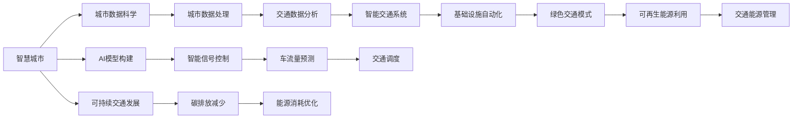

                 

# AI与人类计算：打造可持续发展的城市交通与基础设施规划与管理

> 关键词：智慧城市、人工智能、城市交通、基础设施规划与管理、城市数据科学、智能交通系统、可持续交通

## 1. 背景介绍

### 1.1 问题由来

随着城市化进程的加快，全球范围内各大城市均面临着严峻的交通和基础设施规划与管理挑战。交通拥堵、能源消耗、环境污染等问题，严重制约了城市的可持续发展。为了应对这些挑战，各大城市纷纷将人工智能（AI）引入城市管理的各个环节，借助智能化手段提升城市运行的效率与可持续性。

AI在城市交通与基础设施管理中的应用，主要体现在智慧交通系统（Intelligent Transportation Systems, ITS）的构建上。智慧交通系统通过数据收集、分析、预测与决策支持，为交通管理提供了科学依据。AI技术在智慧交通系统中的应用，不仅能提升交通的流通过程、优化交通管理、减少环境污染，还能推动智能基础设施的构建，进而实现可持续的城市发展。

### 1.2 问题核心关键点

AI在城市交通与基础设施规划与管理中的应用，主要集中在以下几个方面：

1. **数据驱动决策**：通过海量城市数据收集与分析，为城市管理决策提供支撑。
2. **智能交通管理**：通过AI技术优化交通信号控制、车流量预测与交通调度。
3. **基础设施自动化**：AI辅助设计、施工与运维，提升基础设施的智能化水平。
4. **可持续交通发展**：AI推动绿色出行模式，减少碳排放与能源消耗。

## 2. 核心概念与联系

### 2.1 核心概念概述

为更好地理解AI在城市交通与基础设施规划与管理中的应用，本节将介绍几个关键概念：

- **智慧城市（Smart City）**：通过物联网（IoT）、大数据、云计算、人工智能等技术手段，实现城市运行的智能化、自动化与高效化。
- **城市数据科学（Urban Data Science）**：利用数据科学方法分析、预测城市运行状态，辅助城市决策与治理。
- **智能交通系统（ITS）**：依托AI技术优化交通系统管理，提升交通效率与安全性。
- **可持续交通（Sustainable Transportation）**：通过AI技术推广绿色出行，减少环境污染与能源消耗。
- **基础设施自动化（Infrastructure Automation）**：通过AI技术提升城市基础设施的设计、施工与运维效率。

这些核心概念之间通过数据流动与技术交互，构成了智慧城市建设的整体框架。AI技术的引入，使得城市管理实现了从粗放式管理向智能化管理的转变，极大地提升了城市运行的效率与可持续性。

### 2.2 核心概念原理和架构的 Mermaid 流程图



这个流程图展示了AI在城市交通与基础设施规划与管理中的核心概念及其关系：

1. **智慧城市**：通过数据科学和AI技术，对城市运行进行智能化管理。
2. **城市数据科学**：利用数据分析与机器学习，提取城市运行特征，辅助决策与治理。
3. **智能交通系统**：依托AI技术优化交通信号控制、预测与调度，提升交通效率。
4. **基础设施自动化**：通过AI技术提升基础设施设计、施工与运维效率。
5. **绿色交通模式**：借助AI技术推广绿色出行，减少环境污染与能源消耗。
6. **智能信号控制、车流量预测、交通调度**：具体应用AI技术解决交通问题。
7. **可再生能源利用与交通能源管理**：结合AI技术优化能源利用，支持绿色交通发展。
8. **可持续交通发展**：通过AI技术推动交通系统向可持续方向转变。

这些概念共同构成了AI在城市交通与基础设施规划与管理中的应用框架，为其高效运作提供了理论支撑。

## 3. 核心算法原理 & 具体操作步骤

### 3.1 算法原理概述

AI在城市交通与基础设施规划与管理中的核心算法原理主要围绕数据科学和机器学习展开。具体而言，通过数据收集、处理、分析与模型构建，AI技术实现了对城市交通与基础设施的智能化管理。

城市交通与基础设施管理的数据来源广泛，包括传感器数据、交通监控、城市能源消耗、气象数据等。这些数据通过AI模型进行深入分析，以预测交通流量、优化交通信号控制、提升基础设施管理效率。AI模型通常包括特征工程、模型选择与训练、模型评估与优化等关键步骤，其核心目标是通过数据驱动决策，优化城市交通与基础设施管理。

### 3.2 算法步骤详解

AI在城市交通与基础设施管理中的应用主要分为以下几个步骤：

**Step 1: 数据收集与预处理**

1. **数据收集**：通过城市物联网设备、交通监控摄像头、车辆GPS设备等收集数据。
2. **数据预处理**：清洗、去噪、归一化处理，确保数据质量。

**Step 2: 特征工程**

1. **特征提取**：从原始数据中提取有用的特征，如交通流量、车速、碳排放量、能耗等。
2. **特征选择**：使用统计学方法或机器学习技术，选择最相关的特征。

**Step 3: 模型构建与训练**

1. **模型选择**：根据任务需求，选择合适的人工智能模型，如决策树、随机森林、深度学习等。
2. **模型训练**：使用历史数据训练模型，并根据结果不断调整模型参数。

**Step 4: 模型评估与优化**

1. **模型评估**：使用交叉验证、ROC曲线等方法，评估模型性能。
2. **模型优化**：根据评估结果，调整模型参数、改进特征提取方法，优化模型性能。

**Step 5: 应用与部署**

1. **模型应用**：将训练好的模型应用于城市交通与基础设施管理。
2. **模型部署**：将模型部署到实际的城市管理系统中，实现实时监测与决策支持。

### 3.3 算法优缺点

AI在城市交通与基础设施管理中的应用，具有以下优点：

1. **高效与准确**：AI技术可以快速处理大量数据，并从中找到模式和规律，提供高效准确的决策依据。
2. **智能化与自动化**：AI系统可以实现交通信号自动控制、交通流量自动预测等智能化功能，提升城市运行效率。
3. **可扩展性**：AI模型可以根据新数据不断更新和优化，实现长期稳定运行。

同时，AI在城市交通与基础设施管理中也存在一些局限：

1. **数据依赖性**：AI模型的性能依赖于数据的质量和全面性，缺乏数据支持时可能无法正常工作。
2. **高成本**：AI模型的开发与部署需要大量计算资源和人力投入。
3. **模型黑箱**：复杂的AI模型往往难以解释其内部工作原理，缺乏透明性和可解释性。
4. **安全性与隐私**：城市数据包含敏感信息，如何保护数据安全和隐私是一个重要问题。

### 3.4 算法应用领域

AI在城市交通与基础设施管理中的应用，涵盖了以下几个主要领域：

1. **智能交通信号控制**：通过AI技术优化交通信号灯控制，减少交通拥堵。
2. **车流量预测与调度**：使用AI模型预测车流量，优化交通调度，提升通行效率。
3. **基础设施自动化管理**：AI辅助设计、施工与运维，提升基础设施管理效率。
4. **绿色交通模式推广**：借助AI技术推广绿色出行模式，减少环境污染与能源消耗。
5. **交通能源管理**：通过AI技术优化交通能源使用，支持绿色交通发展。
6. **交通违法行为识别与防范**：使用AI技术识别交通违法行为，提升交通安全性。
7. **公共交通信息发布**：通过AI技术优化交通信息发布，提升公众出行体验。

这些领域展示了AI技术在城市交通与基础设施管理中的广泛应用，为实现智能化与可持续发展的城市管理提供了有力支撑。

## 4. 数学模型和公式 & 详细讲解 & 举例说明

### 4.1 数学模型构建

城市交通与基础设施管理的AI模型通常涉及多个数据源和复杂的数据关系，需要通过数学模型进行刻画。以下介绍几个常见的数学模型：

1. **线性回归模型（Linear Regression）**：用于预测交通流量、能耗等连续型变量，模型公式为：
   $$
   y = \beta_0 + \beta_1x_1 + \beta_2x_2 + \cdots + \beta_nx_n + \epsilon
   $$
   其中 $y$ 为预测变量，$x_i$ 为特征变量，$\beta_i$ 为回归系数，$\epsilon$ 为误差项。

2. **决策树（Decision Tree）**：用于分类和回归任务，模型通过树状结构对数据进行分拆和归纳。模型公式为：
   $$
   y = f(x_1, x_2, \cdots, x_n)
   $$
   其中 $f$ 为决策树模型，$x_i$ 为特征变量。

3. **随机森林（Random Forest）**：由多个决策树组成，通过投票机制提升预测准确性。模型公式为：
   $$
   y = \frac{1}{N}\sum_{i=1}^N f_i(x_1, x_2, \cdots, x_n)
   $$
   其中 $f_i$ 为第 $i$ 个决策树模型。

4. **神经网络（Neural Network）**：用于处理非线性关系，模型公式为：
   $$
   y = f(x_1, x_2, \cdots, x_n)
   $$
   其中 $f$ 为神经网络模型，$x_i$ 为特征变量。

### 4.2 公式推导过程

以线性回归模型为例，其公式推导过程如下：

1. **样本数据表示**：设样本集为 $\{(x_i, y_i)\}_{i=1}^N$，其中 $x_i = (x_{i1}, x_{i2}, \cdots, x_{in})$ 为特征向量，$y_i$ 为标签。

2. **最小二乘法**：最小二乘法用于求解回归系数 $\beta_i$，公式为：
   $$
   \beta = (X^TX)^{-1}X^Ty
   $$
   其中 $X = [x_1, x_2, \cdots, x_n]$ 为特征矩阵，$y$ 为标签向量。

3. **误差项**：误差项 $\epsilon$ 用于表示预测值与真实值之间的差异，通常服从高斯分布：
   $$
   \epsilon \sim N(0, \sigma^2)
   $$

### 4.3 案例分析与讲解

以下通过一个具体的案例，说明如何利用线性回归模型预测交通流量。

**案例背景**：某城市某交叉口交通流量数据，需要预测未来一定时间段内的交通流量。

**数据准备**：收集交叉口的历史流量数据，包括时间、天气、车流量等。

**特征工程**：对原始数据进行特征提取与选择，如时间、天气、车流量等。

**模型训练**：使用历史数据训练线性回归模型，求解回归系数 $\beta_i$。

**模型评估**：使用交叉验证方法评估模型性能，确保模型泛化能力。

**模型应用**：将训练好的模型应用于未来一段时间的交通流量预测。

通过上述步骤，AI模型可以高效地预测交通流量，辅助城市交通管理决策。

## 5. 项目实践：代码实例和详细解释说明

### 5.1 开发环境搭建

在进行AI城市交通与基础设施管理项目开发前，需要准备好开发环境。以下是使用Python进行TensorFlow和Keras开发的环境配置流程：

1. 安装Anaconda：从官网下载并安装Anaconda，用于创建独立的Python环境。

2. 创建并激活虚拟环境：
```bash
conda create -n ai-env python=3.8 
conda activate ai-env
```

3. 安装TensorFlow：根据CUDA版本，从官网获取对应的安装命令。例如：
```bash
conda install tensorflow -c tf
```

4. 安装Keras：
```bash
conda install keras
```

5. 安装各类工具包：
```bash
pip install numpy pandas scikit-learn matplotlib tqdm jupyter notebook ipython
```

完成上述步骤后，即可在`ai-env`环境中开始AI项目开发。

### 5.2 源代码详细实现

这里以一个简单的智能交通信号控制项目为例，使用TensorFlow和Keras进行代码实现。

**Step 1: 数据准备**

1. **数据收集**：收集交叉口的历史交通流量数据，包括时间、天气、车流量等。

2. **数据预处理**：清洗、去噪、归一化处理，确保数据质量。

**Step 2: 特征工程**

1. **特征提取**：从原始数据中提取有用的特征，如时间、天气、车流量等。

2. **特征选择**：使用统计学方法或机器学习技术，选择最相关的特征。

**Step 3: 模型构建与训练**

1. **模型选择**：选择合适的人工智能模型，如线性回归、决策树等。

2. **模型训练**：使用历史数据训练模型，并根据结果不断调整模型参数。

```python
import tensorflow as tf
from tensorflow.keras.models import Sequential
from tensorflow.keras.layers import Dense, Dropout, LSTM

# 定义模型
model = Sequential()
model.add(LSTM(128, input_shape=(X_train.shape[1], 1)))
model.add(Dropout(0.2))
model.add(Dense(1, activation='linear'))

# 编译模型
model.compile(loss='mse', optimizer='adam')

# 训练模型
model.fit(X_train, y_train, epochs=50, batch_size=32, validation_data=(X_val, y_val))
```

**Step 4: 模型评估与优化**

1. **模型评估**：使用交叉验证、ROC曲线等方法，评估模型性能。

2. **模型优化**：根据评估结果，调整模型参数、改进特征提取方法，优化模型性能。

**Step 5: 应用与部署**

1. **模型应用**：将训练好的模型应用于城市交通与基础设施管理。

2. **模型部署**：将模型部署到实际的城市管理系统中，实现实时监测与决策支持。

### 5.3 代码解读与分析

让我们再详细解读一下关键代码的实现细节：

**数据处理与预处理**

1. **数据加载**：使用Pandas库加载数据，并进行数据清洗和预处理。

2. **特征工程**：使用Scikit-learn库进行特征提取和选择，确保特征具有较好的区分度和代表性。

**模型构建**

1. **模型选择**：选择LSTM模型，用于处理时间序列数据。

2. **模型架构**：包括LSTM层、Dropout层和输出层。

**模型训练与评估**

1. **模型编译**：设置损失函数、优化器等模型参数。

2. **模型训练**：使用交叉验证方法评估模型性能，确保模型泛化能力。

**模型应用与部署**

1. **模型应用**：将训练好的模型应用于城市交通与基础设施管理。

2. **模型部署**：将模型部署到实际的城市管理系统中，实现实时监测与决策支持。

通过上述代码实现，AI技术在城市交通与基础设施管理中的应用得以体现。开发者可以根据实际需求，进一步优化模型参数、调整模型架构，实现更高效的城市管理。

## 6. 实际应用场景

### 6.1 智能交通信号控制

智能交通信号控制是AI在城市交通管理中的重要应用之一。通过AI技术，可以实现交通信号的动态调整，提升交通流量和通行效率。

**案例背景**：某城市某交叉口交通流量数据，需要实时调整信号灯控制策略。

**数据准备**：收集交叉口的历史交通流量数据，包括时间、天气、车流量等。

**模型构建**：使用深度学习模型，如LSTM或神经网络，对交通流量进行预测。

**模型应用**：根据预测结果，动态调整交通信号灯控制策略，实现交通流量优化。

通过智能交通信号控制，AI技术在城市交通管理中的应用得以充分体现，提升了交通效率和通行安全。

### 6.2 车流量预测与调度

车流量预测与调度是城市交通管理的核心任务之一，通过AI技术可以提升交通调度的智能化水平。

**案例背景**：某城市某路段车流量数据，需要预测未来一段时间的车流量，并优化交通调度。

**数据准备**：收集历史车流量数据，包括时间、天气、车速等。

**模型构建**：使用时间序列模型或深度学习模型，对车流量进行预测。

**模型应用**：根据预测结果，优化交通调度策略，提升通行效率。

通过车流量预测与调度，AI技术在城市交通管理中的应用得以充分体现，提升了交通调度的智能化水平。

### 6.3 基础设施自动化管理

AI技术在城市基础设施管理中的应用，主要体现在自动化设计与施工上。通过AI技术，可以实现基础设施的智能设计、施工和运维，提升管理效率和质量。

**案例背景**：某城市某路段道路设计数据，需要优化设计方案。

**数据准备**：收集历史道路数据，包括地形、交通量等。

**模型构建**：使用AI模型，如决策树或神经网络，对道路设计方案进行优化。

**模型应用**：根据优化结果，调整设计方案，提升道路通行效率。

通过基础设施自动化管理，AI技术在城市基础设施管理中的应用得以充分体现，提升了基础设施的设计效率和管理质量。

### 6.4 未来应用展望

随着AI技术的不断发展，城市交通与基础设施管理中的应用将更加广泛和深入。未来，AI技术有望在以下几个方面取得突破：

1. **自动驾驶**：通过AI技术实现自动驾驶，提升交通安全性与效率。
2. **智慧能源管理**：通过AI技术优化能源使用，支持绿色交通发展。
3. **实时监测与预警**：通过AI技术实现实时交通监测与预警，提升城市运行的安全性。
4. **智能运维**：通过AI技术优化基础设施运维，提升城市管理效率。
5. **精准定位与导航**：通过AI技术实现精准定位与导航，提升出行体验。

这些技术突破将进一步提升城市交通与基础设施管理水平，为实现可持续发展的城市建设提供有力支撑。

## 7. 工具和资源推荐

### 7.1 学习资源推荐

为了帮助开发者系统掌握AI在城市交通与基础设施管理中的应用，这里推荐一些优质的学习资源：

1. **TensorFlow官方文档**：详细介绍了TensorFlow的使用方法，提供了丰富的示例代码和API文档。

2. **Keras官方文档**：Keras是一个高级神经网络API，提供了简单易用的接口，适合快速原型开发。

3. **Udacity《人工智能与城市》课程**：介绍了AI在城市交通与基础设施管理中的应用，包括数据收集、模型构建、部署等内容。

4. **Coursera《城市数据分析》课程**：通过数据科学方法分析城市运行状态，辅助城市决策与治理。

5. **IEEE《智能交通系统》期刊**：汇集了大量智能交通系统相关的学术论文，介绍了最新的研究成果和应用案例。

通过对这些资源的学习实践，相信你一定能够快速掌握AI在城市交通与基础设施管理中的应用，并用于解决实际的交通问题。

### 7.2 开发工具推荐

高效的开发离不开优秀的工具支持。以下是几款用于AI城市交通与基础设施管理开发的常用工具：

1. **TensorFlow**：基于Python的开源深度学习框架，支持大规模分布式计算。

2. **Keras**：高级神经网络API，提供了简单易用的接口，适合快速原型开发。

3. **Jupyter Notebook**：交互式Python环境，方便代码调试和展示。

4. **Google Colab**：谷歌提供的在线Jupyter Notebook环境，免费提供GPU/TPU算力，方便实验最新模型。

5. **TensorBoard**：TensorFlow配套的可视化工具，可实时监测模型训练状态，提供丰富的图表呈现方式。

通过合理利用这些工具，可以显著提升AI城市交通与基础设施管理的开发效率，加速创新迭代的步伐。

### 7.3 相关论文推荐

AI在城市交通与基础设施管理中的应用研究，涉及多个学术领域。以下是几篇奠基性的相关论文，推荐阅读：

1. **A Survey on Artificial Intelligence for Traffic and Infrastructure Management**：总结了AI在交通与基础设施管理中的应用，包括智能交通系统、基础设施自动化等。

2. **Deep Learning in Traffic Management: A Review**：综述了深度学习在交通管理中的应用，包括智能信号控制、车流量预测等。

3. **Intelligent Infrastructure Systems: Applications and Research Challenges**：介绍了智能基础设施系统的应用与挑战，包括智慧城市建设、交通数据分析等。

4. **Data-Driven Traffic Management with AI**：介绍了AI在交通管理中的应用，包括智能交通信号控制、车流量预测等。

5. **Sustainable Urban Transport: The Role of AI**：探讨了AI在绿色交通中的应用，包括智能出行模式、能源管理等。

这些论文代表了大规模城市交通与基础设施管理的研究方向，通过学习这些前沿成果，可以帮助研究者把握学科前进方向，激发更多的创新灵感。

## 8. 总结：未来发展趋势与挑战

### 8.1 总结

本文对AI在城市交通与基础设施规划与管理中的应用进行了全面系统的介绍。首先阐述了AI技术在城市交通与基础设施管理中的应用背景与意义，明确了AI技术在优化交通管理、提升基础设施管理效率等方面的独特价值。其次，从原理到实践，详细讲解了AI城市交通与基础设施管理的核心算法原理和具体操作步骤，给出了AI项目开发的完整代码实例。同时，本文还广泛探讨了AI技术在智能交通信号控制、车流量预测、基础设施自动化管理、绿色交通推广等实际应用场景中的应用前景，展示了AI技术在城市交通与基础设施管理中的广泛应用。此外，本文精选了AI技术的各类学习资源，力求为读者提供全方位的技术指引。

通过本文的系统梳理，可以看到，AI技术在城市交通与基础设施管理中的应用前景广阔，为实现智能化与可持续发展的城市管理提供了有力支撑。未来，随着AI技术的不断演进，基于AI的城市交通与基础设施管理必将迎来更广泛的应用与发展。

### 8.2 未来发展趋势

展望未来，AI在城市交通与基础设施管理中的应用将呈现以下几个发展趋势：

1. **智能化与自动化水平提升**：随着AI技术的不断发展，城市交通与基础设施管理将更加智能化和自动化，提升城市运行的效率与安全性。
2. **数据驱动决策**：通过大数据和AI技术，实现城市运行状态的精确预测和科学决策。
3. **绿色交通推广**：AI技术将推动绿色出行模式，减少碳排放与能源消耗，支持可持续发展。
4. **多模态融合**：AI技术将结合交通、能源、环境等多模态数据，实现全面、准确的城市运行分析与预测。
5. **实时监测与预警**：通过AI技术实现实时交通监测与预警，提升城市运行的安全性。
6. **智能运维与优化**：AI技术将优化基础设施运维，提升城市管理效率和质量。

以上趋势凸显了AI技术在城市交通与基础设施管理中的广阔前景，这些方向的探索发展，必将进一步提升城市交通与基础设施管理的智能化水平，为实现可持续发展的城市建设提供有力支撑。

### 8.3 面临的挑战

尽管AI在城市交通与基础设施管理中的应用取得了显著进展，但在迈向更加智能化、普适化应用的过程中，仍面临诸多挑战：

1. **数据获取与处理**：AI模型的性能依赖于数据的质量和全面性，缺乏数据支持时可能无法正常工作。
2. **模型解释性**：复杂的AI模型往往难以解释其内部工作原理，缺乏透明性和可解释性。
3. **安全与隐私**：城市数据包含敏感信息，如何保护数据安全和隐私是一个重要问题。
4. **高成本与资源消耗**：AI模型的开发与部署需要大量计算资源和人力投入。
5. **模型鲁棒性与泛化能力**：AI模型在面对不同数据分布和场景时，泛化能力可能不足。
6. **伦理与法律问题**：AI技术在应用过程中可能涉及伦理与法律问题，如隐私保护、数据滥用等。

面对这些挑战，未来的研究需要在数据获取、模型解释、安全隐私、成本资源、模型鲁棒性与伦理法律等方面寻求新的突破。只有在这些关键环节取得进展，才能真正实现AI技术在城市交通与基础设施管理中的应用。

### 8.4 研究展望

面向未来，城市交通与基础设施管理的AI研究需要在以下几个方面进行深入探索：

1. **数据驱动的智能决策**：通过大数据与AI技术，实现城市运行状态的精确预测和科学决策。
2. **智能运维与优化**：利用AI技术优化基础设施运维，提升城市管理效率和质量。
3. **绿色交通推广**：推动绿色出行模式，减少碳排放与能源消耗，支持可持续发展。
4. **多模态融合与协同**：结合交通、能源、环境等多模态数据，实现全面、准确的城市运行分析与预测。
5. **实时监测与预警**：通过AI技术实现实时交通监测与预警，提升城市运行的安全性。
6. **智能信号控制与交通调度**：优化交通信号控制和交通调度策略，提升通行效率。
7. **伦理与法律问题**：探讨AI技术在应用过程中涉及的伦理与法律问题，确保技术应用的合规性与公平性。

这些研究方向将引领AI技术在城市交通与基础设施管理中的应用迈向更高的台阶，为构建智能、绿色、可持续发展的城市交通与基础设施管理提供有力支撑。面向未来，AI技术将在城市交通与基础设施管理中发挥越来越重要的作用，成为实现智能城市目标的重要手段。

## 9. 附录：常见问题与解答

**Q1：AI在城市交通与基础设施管理中的应用是否可靠？**

A: AI技术在城市交通与基础设施管理中的应用已经取得了显著成效，但其可靠性依赖于数据的质量、模型的选择与训练、算法的优化等因素。只有在确保数据准确、模型稳健、算法优化的前提下，AI应用才能实现可靠的智能决策与管理。

**Q2：AI在城市交通与基础设施管理中是否会面临数据隐私问题？**

A: 城市数据包含敏感信息，如何保护数据安全和隐私是一个重要问题。在未来AI应用的实践中，需要采取数据加密、匿名化、访问控制等措施，确保数据隐私与安全。同时，透明的数据使用协议和明确的隐私保护政策也是必要的。

**Q3：AI在城市交通与基础设施管理中的应用成本是否较高？**

A: AI技术在城市交通与基础设施管理中的应用成本较高，主要包括算力、人力、数据收集与标注等。然而，长期来看，AI技术的引入可以大幅提升城市管理的效率与质量，降低运营成本，实现可持续发展。

**Q4：AI在城市交通与基础设施管理中的应用是否存在伦理与法律问题？**

A: AI技术在应用过程中可能涉及伦理与法律问题，如隐私保护、数据滥用等。如何在技术应用过程中平衡各方利益，确保技术的公平性与合法性，是一个重要的研究方向。

**Q5：AI在城市交通与基础设施管理中的应用是否适用于所有城市？**

A: AI技术在城市交通与基础设施管理中的应用具有广泛的适用性，但不同城市的应用场景和需求不同，需要根据具体实际情况进行调整和优化。

总之，AI技术在城市交通与基础设施管理中的应用前景广阔，但仍需应对数据、模型、安全、成本、伦理等多方面的挑战。通过持续的创新与优化，AI技术必将在实现智能、绿色、可持续发展的城市交通与基础设施管理中发挥重要作用。

