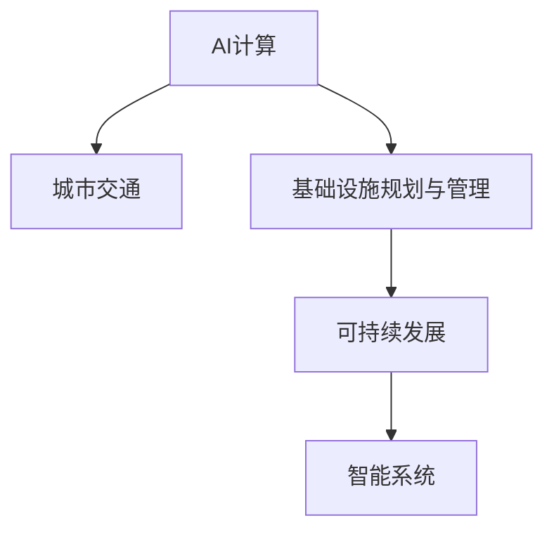

                 

# AI与人类计算：打造可持续发展的城市交通与基础设施规划与管理

> 关键词：AI计算,城市交通,基础设施,规划与管理,可持续性,智能系统

## 1. 背景介绍

### 1.1 问题由来
随着城市化进程的加快，交通拥堵、环境污染、资源短缺等问题日益严峻，对城市交通与基础设施的规划与管理提出了更高的要求。传统的人工规划和管理方法难以适应复杂多变的城市环境，亟需引入先进的智能化手段，实现科学、高效的规划与管理。

近年来，人工智能技术在城市管理中的应用逐渐成熟，AI计算成为推动城市交通与基础设施规划与管理的重要力量。通过AI计算，城市管理者可以实时分析海量数据，优化资源配置，提升决策科学性。然而，AI计算在实际应用中仍面临诸多挑战，如何充分发挥AI计算的优势，同时确保规划管理的可持续性，仍需深入研究。

### 1.2 问题核心关键点
本文聚焦于AI计算在城市交通与基础设施规划与管理中的应用，旨在通过深入分析AI计算的原理、技术和应用场景，提出科学可持续的规划与管理策略。

AI计算的核心在于利用先进的算法和模型，对城市交通与基础设施数据进行高效计算和分析，从而实现智能决策。AI计算涉及的关键技术包括机器学习、深度学习、计算机视觉、自然语言处理等，涵盖了数据的采集、处理、建模和应用等多个环节。

## 2. 核心概念与联系

### 2.1 核心概念概述

为更好地理解AI计算在城市交通与基础设施规划与管理中的应用，本节将介绍几个密切相关的核心概念：

- AI计算：指利用人工智能技术进行计算和分析的过程。通过机器学习、深度学习等算法，AI计算能够从数据中提取高层次的抽象特征，实现智能决策。

- 城市交通：指城市内部或城市间的交通运输系统，包括道路、公共交通、物流等。城市交通是城市基础设施的重要组成部分，其规划与管理直接影响城市的可持续发展。

- 基础设施规划与管理：指对城市交通、水资源、能源、环境等基础设施进行科学规划和高效管理的过程。通过优化资源配置，提高基础设施的利用效率，保障城市运行的稳定性。

- 可持续发展：指在满足当前需求的同时，不损害后代满足需求的能力的发展模式。在城市规划与管理中，可持续发展强调资源利用的高效性、环境保护的持久性以及社会公平的实现。

- 智能系统：指利用AI技术，通过自动化、智能化手段，实现对城市基础设施的实时监测、调度和管理。智能系统能够提升决策的及时性和准确性，提高城市管理的智能化水平。

这些核心概念之间的逻辑关系可以通过以下Mermaid流程图来展示：



这个流程图展示了一个从AI计算到智能系统的整体流程，突出了各环节之间的关系。通过AI计算对城市交通和基础设施数据进行处理，进而实现智能系统的构建，最终推动可持续发展的目标。

## 3. 核心算法原理 & 具体操作步骤
### 3.1 算法原理概述

AI计算在城市交通与基础设施规划与管理中的应用，核心在于数据驱动的智能决策。其核心思想是：通过收集、处理和分析城市交通与基础设施数据，构建高精度的模型和算法，实时监测、预测和优化城市交通与基础设施运行状态，提升管理效率和可持续性。

形式化地，假设城市交通与基础设施的数据集为 $D=\{(x_i, y_i)\}_{i=1}^N$，其中 $x_i$ 为输入数据，$y_i$ 为对应的输出标签。AI计算的目标是找到最优的模型 $M_{\theta}$，使得模型在数据集 $D$ 上的损失函数最小化：

$$
\hat{\theta} = \mathop{\arg\min}_{\theta} \mathcal{L}(M_{\theta},D)
$$

其中 $\mathcal{L}$ 为损失函数，通常包括均方误差、交叉熵等。模型 $M_{\theta}$ 通过机器学习、深度学习等算法构建，参数 $\theta$ 包含模型的权重和偏置。

通过梯度下降等优化算法，AI计算不断更新模型参数 $\theta$，最小化损失函数 $\mathcal{L}$，使得模型输出逼近真实标签。在实际应用中，AI计算模型通常包含多个子模型，如交通流量预测模型、道路拥堵优化模型、环境污染评估模型等，各子模型通过组合和集成，实现复杂的决策功能。

### 3.2 算法步骤详解

AI计算在城市交通与基础设施规划与管理中的应用，一般包括以下几个关键步骤：

**Step 1: 数据收集与预处理**
- 收集城市交通与基础设施的相关数据，包括道路交通流量、公共交通运行状况、环境污染指标等。
- 对数据进行清洗、归一化、标准化等预处理操作，确保数据质量和一致性。

**Step 2: 数据建模与特征提取**
- 选择适当的模型和算法，构建高精度的预测和优化模型。
- 利用深度学习、机器学习等算法，从原始数据中提取高层次的抽象特征。

**Step 3: 模型训练与评估**
- 使用历史数据对模型进行训练，优化模型参数，提高模型精度。
- 在验证集上评估模型性能，选择合适的超参数，如学习率、批大小等。

**Step 4: 模型部署与应用**
- 将训练好的模型部署到实际的城市管理系统中，实现实时监测、预测和优化。
- 通过API接口，实现对模型的远程调用，提高系统灵活性和可扩展性。

**Step 5: 持续优化与反馈机制**
- 实时收集用户反馈和系统运行数据，不断优化模型和算法。
- 构建反馈机制，根据环境变化和用户需求，动态调整模型参数，提升系统适应性。

以上是AI计算在城市交通与基础设施规划与管理中的一般流程。在实际应用中，还需要根据具体任务和数据特点，对各环节进行优化设计，如改进数据采集方法、引入更多正则化技术、搜索最优的超参数组合等，以进一步提升模型性能。

### 3.3 算法优缺点

AI计算在城市交通与基础设施规划与管理中的应用，具有以下优点：
1. 数据驱动决策。通过实时监测、分析海量数据，AI计算能够提供科学、准确的决策依据，提升管理效率。
2. 动态优化资源。AI计算能够实时调整资源配置，避免资源浪费，提高基础设施的利用效率。
3. 提升环境质量。通过智能监测和管理，AI计算能够有效减少环境污染，提升城市环境质量。
4. 增强社会公平。AI计算能够帮助城市管理者更好地应对突发事件，提升应急响应能力，保障社会稳定。

同时，该方法也存在一定的局限性：
1. 数据质量依赖性高。AI计算的效果很大程度上取决于数据的质量和数量，获取高质量数据的成本较高。
2. 模型复杂度大。AI计算模型通常较为复杂，需要较大的计算资源和存储空间。
3. 鲁棒性不足。AI计算模型在面对异常数据或突发事件时，可能出现预测不准确的情况。
4. 可解释性差。AI计算模型的决策过程通常缺乏可解释性，难以对其推理逻辑进行分析和调试。

尽管存在这些局限性，但就目前而言，AI计算在城市交通与基础设施规划与管理中的应用前景广阔，有望带来巨大的社会和经济效益。

### 3.4 算法应用领域

AI计算在城市交通与基础设施规划与管理中的应用，涵盖了许多具体领域，例如：

- 交通流量预测：利用机器学习算法，对道路交通流量进行预测，优化交通信号控制，提升道路通行效率。
- 公共交通调度：通过深度学习模型，实时监测公共交通运行状况，优化调度策略，提高公共交通的准时率和舒适度。
- 道路拥堵优化：利用计算机视觉技术，实时监测道路拥堵情况，调整交通流向和车速，缓解交通压力。
- 环境污染监测：通过传感器和大数据分析，实时监测空气质量和水质，预警污染风险，采取环保措施。
- 基础设施维护：利用机器学习算法，预测基础设施的维护需求，提高维护的及时性和精确性。
- 智能交通系统：将AI计算与物联网、5G等技术结合，实现智能交通管理，提高城市交通的智能化水平。

除了上述这些具体应用外，AI计算还被创新性地应用于城市规划、建筑管理、智慧能源等领域，为城市交通与基础设施的全面升级提供了新的思路和技术支持。

## 4. 数学模型和公式 & 详细讲解 & 举例说明

### 4.1 数学模型构建

本节将使用数学语言对AI计算在城市交通与基础设施规划与管理中的应用进行更加严格的刻画。

假设城市交通流量数据为 $D=\{(t_i,f_i)\}_{i=1}^N, t_i$ 为时间，$f_i$ 为交通流量。定义流量预测模型 $M_{\theta}(t_i)$，其中 $\theta$ 为模型参数。假设模型的输出为 $\hat{f}_i$，则流量预测问题的损失函数为：

$$
\mathcal{L}(\theta) = \frac{1}{N}\sum_{i=1}^N (f_i - \hat{f}_i)^2
$$

其中 $f_i$ 为实际流量，$\hat{f}_i$ 为模型预测流量。模型的目标是找到最优参数 $\theta^*$，使得模型在数据集 $D$ 上的预测误差最小化。

### 4.2 公式推导过程

以下我们以交通流量预测为例，推导最小二乘法的流量预测模型及其参数更新公式。

设 $x_i = t_i$，$y_i = f_i$，则流量预测问题的最小二乘法目标函数为：

$$
\mathcal{L}(\theta) = \frac{1}{N}\sum_{i=1}^N (y_i - M_{\theta}(x_i))^2
$$

根据最小二乘法原理，模型的参数 $\theta$ 应满足：

$$
\frac{\partial \mathcal{L}(\theta)}{\partial \theta} = 0
$$

对上述公式求偏导，得：

$$
\sum_{i=1}^N (y_i - M_{\theta}(x_i)) M_{\theta}(x_i)' = 0
$$

解上述方程，得：

$$
\hat{\theta} = (X'X)^{-1}X'y
$$

其中 $X$ 为输入特征矩阵，$y$ 为输出标签向量，$'$ 表示矩阵的转置。

在得到模型参数 $\theta$ 后，即可带入原始数据进行流量预测。通过不断迭代优化模型参数，可以提升模型的预测精度。

### 4.3 案例分析与讲解

**案例：公共交通调度优化**

假设公共交通系统由多个站点和线路组成，每个站点的运营数据包括上下车人数、行驶时间等。利用机器学习算法，构建一个预测模型 $M_{\theta}(s,t)$，其中 $s$ 为站点，$t$ 为时间，$M_{\theta}(s,t)$ 为预测该站点在时间 $t$ 的客流量。模型的目标是最小化预测误差，即：

$$
\mathcal{L}(\theta) = \frac{1}{N}\sum_{i=1}^N (y_i - M_{\theta}(s_i,t_i))^2
$$

其中 $y_i$ 为实际客流量，$M_{\theta}(s_i,t_i)$ 为模型预测的客流量。

通过上述模型，城市管理者可以实时监测公共交通运行状况，优化调度策略，提高公共交通的准时率和舒适度。例如，在高峰期，模型可以预测某站点人流量激增，提前增加车辆，缓解交通压力。

## 5. 项目实践：代码实例和详细解释说明

### 5.1 开发环境搭建

在进行AI计算在城市交通与基础设施规划与管理中的应用开发前，我们需要准备好开发环境。以下是使用Python进行TensorFlow开发的环境配置流程：

1. 安装Anaconda：从官网下载并安装Anaconda，用于创建独立的Python环境。

2. 创建并激活虚拟环境：
```bash
conda create -n ai_cal env python=3.8 
conda activate ai_cal
```

3. 安装TensorFlow：根据CUDA版本，从官网获取对应的安装命令。例如：
```bash
conda install tensorflow-gpu -c pytorch -c conda-forge
```

4. 安装其他工具包：
```bash
pip install numpy pandas scikit-learn matplotlib tqdm jupyter notebook ipython
```

完成上述步骤后，即可在`ai_cal`环境中开始AI计算的应用开发。

### 5.2 源代码详细实现

下面我以交通流量预测为例，给出使用TensorFlow进行深度学习模型训练的Python代码实现。

首先，定义数据处理函数：

```python
import tensorflow as tf
from tensorflow.keras import layers

def preprocess_data(train_data, test_data, batch_size):
    train_dataset = tf.data.Dataset.from_tensor_slices((train_data['time'], train_data['flow']))
    train_dataset = train_dataset.shuffle(10000).batch(batch_size)

    test_dataset = tf.data.Dataset.from_tensor_slices((test_data['time'], test_data['flow']))
    test_dataset = test_dataset.batch(batch_size)

    return train_dataset, test_dataset
```

然后，定义模型：

```python
model = tf.keras.Sequential([
    layers.Dense(64, activation='relu', input_shape=(1,)),
    layers.Dense(64, activation='relu'),
    layers.Dense(1)
])
```

接着，定义优化器和损失函数：

```python
optimizer = tf.keras.optimizers.Adam(learning_rate=0.001)
loss_fn = tf.keras.losses.MeanSquaredError()
```

最后，定义训练和评估函数：

```python
def train_epoch(model, dataset, optimizer, loss_fn):
    model.compile(optimizer=optimizer, loss=loss_fn)
    model.fit(dataset.batch(batch_size), epochs=10, validation_steps=100, verbose=0)
    
def evaluate(model, dataset):
    mse = model.evaluate(dataset.batch(batch_size), verbose=0)[0]
    print(f"Mean Squared Error: {mse}")
```

启动训练流程：

```python
batch_size = 128

train_data, test_data = load_data()
train_dataset, test_dataset = preprocess_data(train_data, test_data, batch_size)

train_epoch(model, train_dataset, optimizer, loss_fn)
evaluate(model, test_dataset)
```

以上代码实现了从数据加载、模型定义到训练和评估的完整流程。可以看到，TensorFlow提供了一个高度集成的Keras API，使得深度学习模型的开发和训练变得简单易用。

### 5.3 代码解读与分析

让我们再详细解读一下关键代码的实现细节：

**preprocess_data函数**：
- 定义了一个函数，用于将原始数据转换为TensorFlow可以处理的格式，并进行数据增强、归一化等预处理操作。

**模型定义**：
- 使用Keras API，定义了一个简单的全连接神经网络模型，包含两个隐藏层和一个输出层。通过设置不同的激活函数和层数，可以实现不同的模型复杂度。

**优化器和损失函数**：
- 定义了Adam优化器和均方误差损失函数，用于训练和评估模型。均方误差是一种常用的回归问题损失函数，适合用于流量预测任务。

**训练函数**：
- 在模型编译时指定优化器和损失函数，使用Keras的fit方法对模型进行训练。训练过程中，通过批量处理数据，提升训练效率。

**评估函数**：
- 使用Keras的evaluate方法对模型进行评估，计算均方误差，并输出评估结果。

**训练流程**：
- 加载原始数据，并进行预处理。
- 将数据集分为训练集和测试集，并进行批量处理。
- 调用训练函数，对模型进行训练。
- 调用评估函数，对模型进行评估，输出均方误差。

以上代码展示了TensorFlow在深度学习模型开发和训练中的应用。开发者可以通过不断调整模型结构、优化器、损失函数等参数，提升模型的预测精度。

## 6. 实际应用场景

### 6.1 智能交通系统

基于AI计算的智能交通系统，可以实现交通流量的实时监测、分析和优化，提升道路通行效率，缓解交通压力。

具体而言，可以安装各类传感器，如摄像头、雷达、GPS等，实时采集道路交通数据。利用深度学习模型，对数据进行处理和分析，预测交通流量，调整交通信号灯和车辆调度策略。例如，在交通流量高峰期，系统可以自动调整红绿灯时间，优化车辆行驶路径，减少交通拥堵。

### 6.2 公共交通系统

AI计算在公共交通系统中的应用，可以优化公共交通的运营效率，提高公共交通的准时率和舒适度。

具体而言，可以收集公共交通的运营数据，如车辆位置、上下客人数、行驶时间等。利用机器学习模型，预测乘客流量和车辆到达时间，优化调度策略。例如，在系统预测某站点人流量激增时，提前增加车辆，缓解客流压力。

### 6.3 环境污染监测

AI计算在环境污染监测中的应用，可以实现对空气质量和水质的实时监测和预警，提升环境保护的效率和质量。

具体而言，可以部署各类传感器，实时采集环境数据。利用深度学习模型，对数据进行处理和分析，预测污染物的浓度和分布。例如，在空气质量监测中，系统可以实时预警PM2.5浓度超标，提醒相关部门采取措施。

### 6.4 未来应用展望

随着AI计算技术的不断进步，其在城市交通与基础设施规划与管理中的应用前景广阔，具体展望如下：

1. 实时数据处理与分析：AI计算能够实时处理海量数据，提供高效的决策依据。未来，随着5G、物联网等技术的普及，实时数据处理和分析将变得更加便捷和高效。

2. 自适应模型优化：AI计算模型能够根据环境变化和用户需求，动态调整模型参数，提升系统适应性。未来，将开发更多的自适应学习算法，进一步增强模型的泛化能力和鲁棒性。

3. 跨领域融合应用：AI计算可以与其他领域的技术，如物联网、大数据、智能制造等，进行深度融合，推动城市管理的多元化发展。

4. 人机协同系统：AI计算可以构建人机协同的智能系统，实现对城市基础设施的智能监测和管理。未来，将进一步提升系统的智能化水平，实现更加精准、高效的决策。

5. 社会治理与公共安全：AI计算在城市交通与基础设施规划与管理中的应用，还将涉及社会治理和公共安全领域。通过智能监测和管理，AI计算能够提高城市应急响应能力，保障社会稳定。

总之，AI计算在城市交通与基础设施规划与管理中的应用，将带来深远的影响，提升城市管理的智能化、高效化和可持续性。未来，随着技术的不断进步和应用场景的拓展，AI计算将在更多领域发挥重要作用。

## 7. 工具和资源推荐

### 7.1 学习资源推荐

为了帮助开发者系统掌握AI计算在城市交通与基础设施规划与管理中的应用，这里推荐一些优质的学习资源：

1. TensorFlow官方文档：TensorFlow的官方文档提供了详细的API接口和示例代码，是学习和应用AI计算的重要参考资料。

2. Keras官方文档：Keras是TensorFlow的高级API，提供了简单易用的接口，适合初学者快速上手深度学习模型开发。

3. 《深度学习基础》课程：由斯坦福大学开设的深度学习课程，全面讲解了深度学习的理论和应用，适合从零开始的深度学习学习者。

4. 《机器学习实战》书籍：详细介绍了机器学习的基本概念和算法，提供了大量实际案例，适合初学者和从业者。

5. 《Python深度学习》书籍：详细讲解了深度学习在实际应用中的方法和技巧，适合有一定编程基础的深度学习学习者。

通过对这些资源的学习实践，相信你一定能够快速掌握AI计算的精髓，并用于解决实际的交通与基础设施规划与管理问题。

### 7.2 开发工具推荐

高效的开发离不开优秀的工具支持。以下是几款用于AI计算在城市交通与基础设施规划与管理中的应用开发的常用工具：

1. TensorFlow：由Google主导开发的开源深度学习框架，生产部署方便，适合大规模工程应用。

2. Keras：TensorFlow的高级API，提供了简单易用的接口，适合快速迭代研究。

3. PyTorch：基于Python的开源深度学习框架，灵活动态的计算图，适合快速迭代研究。

4. Jupyter Notebook：免费的交互式编程环境，适合进行数据探索和模型训练。

5. Scikit-learn：Python中的机器学习库，提供了丰富的机器学习算法和工具，适合数据预处理和模型训练。

6. Weights & Biases：模型训练的实验跟踪工具，可以记录和可视化模型训练过程中的各项指标，方便对比和调优。

合理利用这些工具，可以显著提升AI计算在城市交通与基础设施规划与管理中的应用开发效率，加快创新迭代的步伐。

### 7.3 相关论文推荐

AI计算在城市交通与基础设施规划与管理中的应用研究，近年来取得了显著进展，以下是几篇奠基性的相关论文，推荐阅读：

1. Yann LeCun, Yoshua Bengio, Geoffrey Hinton. Deep Learning. 2015.

2. Ian Goodfellow, Yoshua Bengio, Aaron Courville. Deep Learning. 2016.

3. Andrew Ng, et al. Machine Learning Yearning. 2018.

4. Fei-Fei Li, et al. Human-Centered AI: Bridging the Gap Between Human Needs and Artificial Intelligence. 2018.

5. Pedro Domingos. The Master Algorithm: How the Quest for the Ultimate Learning Machine Will Remake Our World. 2015.

这些论文代表了大语言模型微调技术的发展脉络。通过学习这些前沿成果，可以帮助研究者把握学科前进方向，激发更多的创新灵感。

## 8. 总结：未来发展趋势与挑战

### 8.1 总结

本文对AI计算在城市交通与基础设施规划与管理中的应用进行了全面系统的介绍。首先阐述了AI计算在城市交通与基础设施规划与管理中的重要性和应用前景，明确了其在提升城市管理智能化和效率方面的独特价值。其次，从原理到实践，详细讲解了AI计算的数学原理和关键步骤，给出了AI计算任务开发的完整代码实例。同时，本文还广泛探讨了AI计算在智能交通系统、公共交通系统、环境污染监测等多个领域的应用前景，展示了AI计算范式的巨大潜力。此外，本文精选了AI计算技术的各类学习资源，力求为读者提供全方位的技术指引。

通过本文的系统梳理，可以看到，AI计算在城市交通与基础设施规划与管理中的应用前景广阔，极大地提升了城市管理的智能化水平。未来，伴随AI计算技术的持续演进，城市交通与基础设施规划与管理将迎来新的变革。

### 8.2 未来发展趋势

展望未来，AI计算在城市交通与基础设施规划与管理中的应用将呈现以下几个发展趋势：

1. 数据驱动决策：AI计算能够实时处理海量数据，提供高效的决策依据，未来将进一步提升数据处理和分析的效率和精度。

2. 智能协同系统：AI计算将与其他技术，如物联网、大数据、人工智能等，进行深度融合，构建智能协同系统，提升城市管理的智能化水平。

3. 多领域应用拓展：AI计算将逐步拓展到更多领域，如智慧医疗、智慧教育、智慧金融等，为各行各业带来智能化升级。

4. 人机协同系统：AI计算将构建人机协同的智能系统，实现对城市基础设施的智能监测和管理，提高决策的及时性和准确性。

5. 持续优化与反馈机制：AI计算将构建持续优化与反馈机制，根据环境变化和用户需求，动态调整模型参数，提升系统适应性。

以上趋势凸显了AI计算在城市交通与基础设施规划与管理中的应用前景。这些方向的探索发展，必将进一步提升城市管理的智能化水平，为人类社会的可持续发展注入新的动力。

### 8.3 面临的挑战

尽管AI计算在城市交通与基础设施规划与管理中的应用前景广阔，但在迈向更加智能化、普适化应用的过程中，仍面临诸多挑战：

1. 数据质量与隐私保护：AI计算的效果很大程度上取决于数据的质量和隐私保护。如何获取高质量、隐私保护的数据，是AI计算面临的首要挑战。

2. 模型鲁棒性与泛化能力：AI计算模型在面对异常数据或突发事件时，可能出现预测不准确的情况。如何提高模型的鲁棒性和泛化能力，是AI计算面临的重要挑战。

3. 算法可解释性与透明度：AI计算模型的决策过程通常缺乏可解释性，难以对其推理逻辑进行分析和调试。如何增强算法的可解释性和透明度，是AI计算面临的另一大挑战。

4. 计算资源与存储需求：AI计算模型通常较为复杂，需要较大的计算资源和存储空间。如何优化模型结构和计算图，降低计算资源和存储需求，是AI计算面临的挑战之一。

5. 社会伦理与道德风险：AI计算模型可能存在偏见、歧视等问题，如何避免算法偏见和伦理道德风险，是AI计算面临的重要挑战。

尽管存在这些挑战，但随着技术不断进步和应用场景的拓展，AI计算在城市交通与基础设施规划与管理中的应用前景仍然广阔。

### 8.4 研究展望

面对AI计算在城市交通与基础设施规划与管理中面临的挑战，未来的研究需要在以下几个方面寻求新的突破：

1. 数据质量与隐私保护：开发更多高效的数据采集和预处理方法，提升数据质量。引入隐私保护技术，保障用户隐私安全。

2. 模型鲁棒性与泛化能力：引入更多的正则化技术，提高模型的鲁棒性和泛化能力。开发自适应学习算法，增强模型的适应性。

3. 算法可解释性与透明度：开发可解释性算法，增强算法的可解释性和透明度。引入符号化先验知识，提升模型的可理解性。

4. 计算资源与存储需求：优化模型结构和计算图，降低计算资源和存储需求。引入分布式计算和模型压缩技术，提升计算效率。

5. 社会伦理与道德风险：引入伦理导向的评估指标，过滤和惩罚有偏见、有害的输出倾向。加强人工干预和审核，建立模型行为的监管机制，确保输出符合人类价值观和伦理道德。

这些研究方向的探索，必将引领AI计算在城市交通与基础设施规划与管理中的应用迈向更高的台阶，为构建安全、可靠、可解释、可控的智能系统铺平道路。面向未来，AI计算技术还需要与其他人工智能技术进行更深入的融合，如知识表示、因果推理、强化学习等，多路径协同发力，共同推动自然语言理解和智能交互系统的进步。只有勇于创新、敢于突破，才能不断拓展AI计算的边界，让智能技术更好地造福人类社会。

## 9. 附录：常见问题与解答

**Q1：AI计算在城市交通与基础设施规划与管理中的应用面临哪些挑战？**

A: AI计算在城市交通与基础设施规划与管理中的应用面临以下主要挑战：

1. 数据质量与隐私保护：AI计算的效果很大程度上取决于数据的质量和隐私保护。如何获取高质量、隐私保护的数据，是AI计算面临的首要挑战。

2. 模型鲁棒性与泛化能力：AI计算模型在面对异常数据或突发事件时，可能出现预测不准确的情况。如何提高模型的鲁棒性和泛化能力，是AI计算面临的重要挑战。

3. 算法可解释性与透明度：AI计算模型的决策过程通常缺乏可解释性，难以对其推理逻辑进行分析和调试。如何增强算法的可解释性和透明度，是AI计算面临的另一大挑战。

4. 计算资源与存储需求：AI计算模型通常较为复杂，需要较大的计算资源和存储空间。如何优化模型结构和计算图，降低计算资源和存储需求，是AI计算面临的挑战之一。

5. 社会伦理与道德风险：AI计算模型可能存在偏见、歧视等问题，如何避免算法偏见和伦理道德风险，是AI计算面临的重要挑战。

尽管存在这些挑战，但随着技术不断进步和应用场景的拓展，AI计算在城市交通与基础设施规划与管理中的应用前景仍然广阔。

**Q2：AI计算在城市交通与基础设施规划与管理中的应用如何提升数据的处理和分析效率？**

A: AI计算在城市交通与基础设施规划与管理中的应用，通过实时处理海量数据，提供高效的决策依据，能够显著提升数据的处理和分析效率。具体而言：

1. 实时数据采集：通过各类传感器，实时采集交通流量、环境污染等数据，避免数据延迟和丢失。

2. 高效数据存储：采用大数据存储技术，如Hadoop、Spark等，实现海量数据的存储和管理。

3. 分布式计算：利用分布式计算框架，如TensorFlow、PyTorch等，并行处理大规模数据，提升计算效率。

4. 智能数据预处理：引入自动化的数据清洗、归一化、特征工程等预处理技术，提升数据质量。

5. 高级算法优化：开发高效的算法和模型，如深度学习、机器学习等，提升数据处理和分析的精度和速度。

通过上述措施，AI计算能够在城市交通与基础设施规划与管理中实现实时数据处理和分析，为决策提供及时、准确的依据。

**Q3：如何确保AI计算在城市交通与基础设施规划与管理中的应用具备持续优化与反馈机制？**

A: 确保AI计算在城市交通与基础设施规划与管理中的应用具备持续优化与反馈机制，需要从数据、模型、算法等多个环节进行全面优化，具体措施包括：

1. 实时数据收集与处理：通过各类传感器和数据采集系统，实时收集城市交通与基础设施的运行数据。引入数据清洗、归一化等预处理技术，提升数据质量。

2. 高效模型训练与评估：利用分布式计算和自动化调参技术，快速训练和评估模型，及时发现问题并优化。引入超参数搜索算法，如随机搜索、贝叶斯优化等，寻找最优的超参数组合。

3. 动态模型调整：根据环境变化和用户需求，动态调整模型参数和结构。引入自适应学习算法，如在线学习、增量学习等，增强模型的适应性和鲁棒性。

4. 持续反馈机制：建立反馈机制，实时监测模型预测结果和系统运行状况。引入用户反馈和专家评估，不断优化模型和算法。

5. 多模型集成：构建多模型集成系统，通过组合和集成不同模型的输出，提升系统的稳定性和鲁棒性。

通过上述措施，AI计算能够在城市交通与基础设施规划与管理中构建持续优化与反馈机制，确保系统高效、稳定运行。

**Q4：AI计算在城市交通与基础设施规划与管理中的应用如何实现社会治理与公共安全？**

A: AI计算在城市交通与基础设施规划与管理中的应用，能够通过智能监测和管理，提升社会治理与公共安全水平。具体而言：

1. 智能应急响应：利用AI计算实时监测城市环境数据，及时预警环境污染、灾害等突发事件，提醒相关部门采取措施。

2. 公共安全监控：通过视频监控和AI计算技术，实时监测城市公共场所的安全状况，预防和打击犯罪行为。

3. 社会治理分析：利用AI计算分析城市社会数据，识别社会问题热点，提供决策支持。例如，通过分析交通流量数据，识别交通拥堵的根源，制定相应的治理措施。

4. 智慧城市管理：构建智慧城市管理平台，集成AI计算、物联网、大数据等多种技术，实现城市管理的智能化和高效化。例如，通过AI计算分析公共服务数据，优化公共服务资源的配置和利用。

通过AI计算在城市交通与基础设施规划与管理中的应用，可以实现社会治理与公共安全的多元化发展，提升城市的智能化水平。

**Q5：AI计算在城市交通与基础设施规划与管理中的应用如何提高城市基础设施的利用效率？**

A: AI计算在城市交通与基础设施规划与管理中的应用，通过实时监测、分析和优化，能够显著提高城市基础设施的利用效率。具体而言：

1. 实时监测：通过各类传感器，实时监测道路交通、公共交通等基础设施的运行状况，及时发现问题并进行处理。

2. 数据分析：利用AI计算模型，分析基础设施的运行数据，识别资源利用率低下的区域，优化资源配置。例如，通过分析道路流量数据，识别交通拥堵区域，调整交通信号灯和车辆调度策略，提高道路通行效率。

3. 智能调度：利用AI计算模型，优化公共交通、物流等基础设施的调度策略，提高运行效率。例如，通过预测客流量和车辆到达时间，优化公交车路线和发车间隔，提高公共交通的准时率和舒适度。

4. 环境监测：利用AI计算模型，实时监测环境污染数据，预警污染风险，采取环保措施。例如，通过监测空气质量和水质数据，及时发现环境污染问题，采取相应的治理措施。

通过上述措施，AI计算能够在城市交通与基础设施规划与管理中实现实时监测、分析和优化，提升基础设施的利用效率，保障城市运行的稳定性和可持续性。

---

作者：禅与计算机程序设计艺术 / Zen and the Art of Computer Programming

