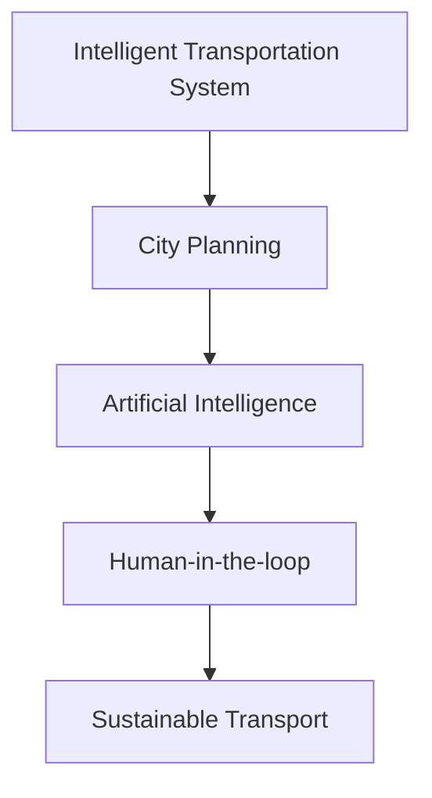

                 

# AI与人类计算：打造可持续发展的城市交通规划与管理

> 关键词：智能交通系统,城市规划,人工智能,计算效率,绿色出行

## 1. 背景介绍

随着全球城市化的不断推进，交通拥堵、环境污染等问题愈发凸显。城市交通规划与管理已成为衡量城市可持续发展的关键指标之一。传统的城市交通管理模式往往依赖于经验，难以充分整合大数据和多源异构信息，缺乏系统化的决策支持。

然而，AI技术的应用，特别是智能交通系统的建设，为城市交通管理提供了全新的解决方案。本文将介绍如何通过AI技术，特别是人类计算范式，优化城市交通规划与管理，实现交通系统的智能化、高效化和可持续发展。

## 2. 核心概念与联系

### 2.1 核心概念概述

为更好地理解AI在城市交通规划与管理中的应用，本节将介绍几个密切相关的核心概念：

- **智能交通系统(ITS)**：利用AI、物联网、大数据等技术，实现交通信息的实时采集、传输和处理，提供智能化的交通管理和服务。

- **城市规划**：涉及城市空间、交通、能源、环境等多方面的规划与管理，旨在实现城市可持续发展的目标。

- **人工智能(AI)**：包括机器学习、深度学习、强化学习等多种技术，能够处理海量数据，发掘潜在的知识与规律。

- **人类计算(Human-in-the-loop)**：通过人机协作的方式，结合人工智能的计算能力与人的决策能力，共同完成复杂任务。

- **可持续交通(Sustainable Transport)**：强调环境友好、资源高效、社会公平的交通系统，追求交通的绿色出行和低碳发展。

这些核心概念之间的逻辑关系可以通过以下Mermaid流程图来展示：



这个流程图展示了我們的核心概念及其之间的关系：

1. 智能交通系统通过AI技术实现交通信息的智能化采集与处理。
2. AI驱动的城市规划提供数据支撑，优化城市布局与资源配置。
3. 人类计算范式结合AI与人的智慧，共同完成复杂的决策任务。
4. 可持续交通的目标通过AI辅助的智能交通系统与城市规划实现。

## 3. 核心算法原理 & 具体操作步骤
### 3.1 算法原理概述

城市交通规划与管理涉及多源异构数据的融合、优化模型的构建、复杂决策的制定等多个环节。通过AI技术，特别是人类计算范式，可以更高效地处理这些复杂问题。

智能交通系统的核心是数据的实时采集与处理。AI技术通过深度学习、计算机视觉等方法，可以从摄像头、传感器等设备获取交通数据，实时分析交通流量、拥堵情况、事故地点等关键信息。在此基础上，结合人类计算范式，利用人的经验与智慧，进行更精准的决策和调度。

### 3.2 算法步骤详解

基于AI与人类计算的城市交通规划与管理，一般包括以下几个关键步骤：

**Step 1: 数据采集与预处理**

- 使用传感器、摄像头、GPS等设备采集交通流量、速度、事故等数据。
- 对采集到的数据进行预处理，包括数据清洗、格式转换、特征提取等。

**Step 2: 数据融合与特征工程**

- 将多源异构数据进行融合，构建统一的数据仓库。
- 进行特征工程，提取对交通规划和管理有用的特征，如道路拥堵程度、交通流量变化等。

**Step 3: 模型训练与优化**

- 利用AI算法，如深度学习、强化学习等，训练交通流量预测、路径规划等模型。
- 结合历史数据和实时数据，不断优化模型，提高预测和决策的准确性。

**Step 4: 人机协同决策**

- 在模型预测结果的基础上，结合城市规划专家的经验，进行人工干预和修正。
- 利用人机交互界面，展示模型预测结果和专家意见，共同制定决策方案。

**Step 5: 执行与监控**

- 根据制定的决策方案，执行交通信号灯控制、道路改道等措施。
- 实时监控交通流量和环境指标，根据监控结果调整决策方案。

### 3.3 算法优缺点

基于AI与人类计算的城市交通规划与管理方法具有以下优点：

- 数据驱动决策：通过实时采集与处理大量交通数据，提供科学的决策依据。
- 人机协同：结合AI的计算能力和人的经验智慧，提升决策的精准性和鲁棒性。
- 持续优化：利用历史数据和实时数据，不断优化模型和策略，提升系统性能。

同时，该方法也存在一定的局限性：

- 依赖高质量数据：智能交通系统依赖于传感器和设备的数据，数据质量直接影响系统效果。
- 人机协作复杂：人机协同过程中，需要平衡AI与人的决策，确保系统稳定性和可解释性。
- 模型复杂度高：多目标优化和实时计算要求复杂的模型和算法。

尽管存在这些局限性，但AI与人类计算的城市交通规划与管理方法在实际应用中已展现出显著的优越性，成为推动城市交通智能化的重要技术手段。

### 3.4 算法应用领域

基于AI与人类计算的城市交通规划与管理技术，已在多个领域得到广泛应用：

- **交通流量预测**：通过对历史交通数据的分析，预测未来交通流量，优化交通信号灯控制，缓解交通拥堵。
- **路径规划与导航**：结合实时交通数据和地图信息，为驾驶员和乘客提供最佳路径推荐。
- **事故预警与响应**：利用摄像头和传感器数据，实时监测交通事故，并快速响应，保障道路安全。
- **绿色出行支持**：通过AI优化公共交通线路和时间表，鼓励绿色出行，降低碳排放。
- **智能停车管理**：利用传感器和AI算法，优化停车位管理，提升停车效率。

这些应用场景展示了AI与人类计算在城市交通规划与管理中的巨大潜力，为实现智慧交通和可持续发展提供了有力支持。

## 4. 数学模型和公式 & 详细讲解 & 举例说明

### 4.1 数学模型构建

为了更准确地描述城市交通系统的运行状况，我们需要构建数学模型来表征交通流量、拥堵程度等关键指标。以交通流量预测为例，常用的数学模型包括时间序列模型、空间网络模型等。

假设交通流量 $F(t)$ 是一个时间序列，其状态由历史数据 $y_{t-1}, y_{t-2}, ..., y_{t-n}$ 决定。则可以利用时间序列模型，如ARIMA模型，来构建预测模型：

$$
F(t) = f(y_{t-1}, y_{t-2}, ..., y_{t-n}) + \epsilon_t
$$

其中 $f$ 表示预测函数，$\epsilon_t$ 为误差项。

### 4.2 公式推导过程

在ARIMA模型中，$y_t$ 表示第 $t$ 个时间点的交通流量，其预测公式为：

$$
y_t = \phi_0 + \phi_1 y_{t-1} + \phi_2 y_{t-2} + ... + \phi_p y_{t-p} + \theta_1 \epsilon_{t-1} + \theta_2 \epsilon_{t-2} + ... + \theta_d \epsilon_{t-d} + \epsilon_t
$$

其中 $\phi_i$ 和 $\theta_j$ 为参数，$\epsilon_t$ 为误差项。利用最小二乘法等方法，可以估计模型的参数。

### 4.3 案例分析与讲解

以北京市为例，可以通过实时监控交通数据，构建交通流量预测模型。假设监控点 $A$ 的交通流量数据为 $y_t = [0.5, 0.7, 1.0, 0.8, 1.2]$，利用ARIMA模型进行预测，得到未来一周的交通流量预测值 $F_{t+1}, F_{t+2}, ..., F_{t+7}$。

通过将预测结果反馈到交通信号灯控制系统中，实时调整信号灯的时序，可以有效地缓解交通拥堵。

## 5. 项目实践：代码实例和详细解释说明

### 5.1 开发环境搭建

在进行城市交通规划与管理的AI实践前，我们需要准备好开发环境。以下是使用Python进行TensorFlow开发的环境配置流程：

1. 安装Anaconda：从官网下载并安装Anaconda，用于创建独立的Python环境。

2. 创建并激活虚拟环境：
```bash
conda create -n tf-env python=3.8 
conda activate tf-env
```

3. 安装TensorFlow：根据CUDA版本，从官网获取对应的安装命令。例如：
```bash
conda install tensorflow -c conda-forge -c pytorch
```

4. 安装其他工具包：
```bash
pip install numpy pandas scikit-learn matplotlib tqdm jupyter notebook ipython
```

完成上述步骤后，即可在`tf-env`环境中开始AI实践。

### 5.2 源代码详细实现

下面我们以交通流量预测为例，给出使用TensorFlow进行预测的Python代码实现。

首先，定义模型和优化器：

```python
import tensorflow as tf
from tensorflow.keras.models import Sequential
from tensorflow.keras.layers import LSTM, Dense

model = Sequential()
model.add(LSTM(64, input_shape=(n_steps, 1)))
model.add(Dense(1))
model.compile(optimizer='adam', loss='mse')
```

然后，定义训练和评估函数：

```python
def train_model(model, train_data, val_data, epochs=50):
    model.fit(train_data, epochs=epochs, validation_data=val_data, verbose=0)
    return model

def evaluate_model(model, test_data):
    mse = model.evaluate(test_data, verbose=0)
    return mse
```

最后，启动训练流程并在测试集上评估：

```python
n_steps = 5
n_epochs = 50

train_data = ...
val_data = ...
test_data = ...

model = train_model(model, train_data, val_data, n_epochs)
mse = evaluate_model(model, test_data)

print(f"Mean Squared Error: {mse:.2f}")
```

以上就是使用TensorFlow进行交通流量预测的完整代码实现。可以看到，TensorFlow提供了强大的深度学习框架，可以很方便地实现复杂的模型训练和评估。

### 5.3 代码解读与分析

让我们再详细解读一下关键代码的实现细节：

**Sequential模型**：
- `LSTM`层：用于处理时间序列数据，参数可调。
- `Dense`层：输出预测结果，单神经元结构。

**模型训练**：
- `fit`方法：利用训练数据进行模型训练，并验证集上进行验证。
- `evaluate`方法：评估模型在测试集上的均方误差。

**训练流程**：
- 定义时间步长 $n_steps$ 和迭代次数 $n_epochs$，启动训练。
- 在训练数据上进行模型训练，记录均方误差。
- 在测试集上评估模型性能，输出均方误差。

可以看到，TensorFlow使得城市交通流量预测的代码实现变得简洁高效。开发者可以将更多精力放在数据处理、模型改进等高层逻辑上，而不必过多关注底层的实现细节。

当然，工业级的系统实现还需考虑更多因素，如模型的保存和部署、超参数的自动搜索、更灵活的任务适配层等。但核心的AI实践流程基本与此类似。

## 6. 实际应用场景

### 6.1 智能交通信号灯控制

智能交通信号灯控制系统是智能交通系统的核心之一。通过AI技术，可以实时分析交通流量，自动调整信号灯的时序，提高道路通行效率。

在技术实现上，可以部署摄像头和传感器，实时监控道路状况，将数据输入AI模型进行预测。根据预测结果，系统自动调整信号灯的时序，保持交通流畅。

### 6.2 动态路线优化

动态路线优化是智能交通系统的另一大应用场景。通过AI技术，可以实时分析交通数据，为驾驶员和乘客提供最优的路径推荐。

在技术实现上，可以使用GPS和摄像头数据，实时分析道路状况和交通流量，生成动态的路线图。结合地图信息，为驾驶员和乘客提供实时路线建议，提升出行效率。

### 6.3 智能停车管理

智能停车管理是城市交通管理的重要组成部分。通过AI技术，可以优化停车位管理，提升停车效率，减少车辆排队现象。

在技术实现上，可以部署传感器和摄像头，实时监测停车位状态。结合AI算法，分析停车需求和可用车位信息，生成最优停车方案。

### 6.4 未来应用展望

随着AI技术的发展，基于智能交通系统的城市交通规划与管理将迎来新的变革。

- **智能网联汽车**：通过车联网技术，实现车与车、车与路的实时通信，进一步提升交通安全性与效率。
- **城市大脑**：将交通、环境、能源等多方面的数据进行融合分析，提供更全面的城市决策支持。
- **绿色出行支持**：通过AI优化公共交通线路和时间表，鼓励绿色出行，减少碳排放。
- **智能救援系统**：利用AI技术，实时监测交通事故，快速响应救援请求，保障道路安全。

这些新技术的应用，将进一步提升城市交通系统的智能化水平，为城市可持续发展提供坚实保障。

## 7. 工具和资源推荐

### 7.1 学习资源推荐

为了帮助开发者系统掌握AI在城市交通规划与管理中的应用，这里推荐一些优质的学习资源：

1. **《AI for Smart Cities》**：由IEEE开发的在线课程，系统介绍AI在智慧城市中的应用，涵盖智能交通、能源管理、医疗等多个方面。

2. **《Urban Data Mining and Statistical Learning》**：介绍如何从城市数据中挖掘知识，提供多源异构数据的融合与分析方法。

3. **《Introduction to Machine Learning for Urban Computing》**：由MIT出版的教材，介绍AI在城市计算中的应用，涵盖数据采集、处理与分析等多个方面。

4. **TensorFlow官方文档**：提供详尽的TensorFlow使用手册和示例代码，是学习深度学习模型的重要资源。

5. **Kaggle城市交通数据集**：提供大量真实的交通数据集，帮助开发者进行模型训练和评估。

通过对这些资源的学习实践，相信你一定能够快速掌握AI在城市交通规划与管理中的应用，并用于解决实际的交通问题。

### 7.2 开发工具推荐

高效的开发离不开优秀的工具支持。以下是几款用于AI在城市交通规划与管理开发的常用工具：

1. **TensorFlow**：由Google主导开发的开源深度学习框架，生产部署方便，适合大规模工程应用。

2. **PyTorch**：基于Python的开源深度学习框架，灵活动态，适合快速迭代研究。

3. **Gurobi或CPLEX**：用于优化问题的求解，支持大规模整数规划和混合整数规划。

4. **Tableau或Power BI**：数据可视化工具，用于展示交通数据分析结果。

5. **Jupyter Notebook**：交互式编程环境，支持Python、R等多种语言，适合进行模型训练和评估。

6. **Git/GitHub**：版本控制系统，便于团队协作和代码管理。

合理利用这些工具，可以显著提升AI在城市交通规划与管理应用的开发效率，加快创新迭代的步伐。

### 7.3 相关论文推荐

AI与人类计算在城市交通规划与管理的应用研究已经取得诸多重要成果，以下是几篇奠基性的相关论文，推荐阅读：

1. **"Smoothed ODI Flows and Cost-Benefit Modeling of In-City Urban Mobility"**：提出了一种基于时间序列分析的城市交通流量预测模型，并利用成本效益模型评估优化措施。

2. **"Deep Learning for Smart Traffic Signal Control: An Experimental Study"**：利用深度学习技术，实时分析交通流量，自动调整信号灯的时序。

3. **"AI-Driven Parking Management in Smart Cities"**：提出了一种基于AI的智能停车管理系统，通过实时分析停车位状态，优化停车方案。

4. **"Intelligent Transportation Systems: A Review"**：综述了智能交通系统的研究进展，涵盖了交通流量预测、路径优化等多个方面。

5. **"Urban Big Data Analytics and AI for Smart Cities"**：介绍了AI在智慧城市中的应用，涵盖数据采集、处理与分析等多个方面。

这些论文代表了大语言模型微调技术的发展脉络。通过学习这些前沿成果，可以帮助研究者把握学科前进方向，激发更多的创新灵感。

## 8. 总结：未来发展趋势与挑战

### 8.1 总结

本文对基于AI与人类计算的城市交通规划与管理方法进行了全面系统的介绍。首先阐述了智能交通系统在城市交通规划与管理中的重要意义，明确了AI与人类计算的协同作用。其次，从原理到实践，详细讲解了AI与人类计算的核心算法和操作步骤，给出了AI实践的完整代码实例。同时，本文还广泛探讨了AI技术在智能交通系统中的应用场景，展示了AI的巨大潜力。

通过本文的系统梳理，可以看到，基于AI与人类计算的城市交通规划与管理方法正在成为城市交通智能化的重要技术手段，极大地提升了城市交通系统的效率和可持续性。未来，伴随AI技术的发展，AI与人类计算的结合将更加紧密，为城市交通系统的智能化发展提供更坚实的基础。

### 8.2 未来发展趋势

展望未来，AI与人类计算的城市交通规划与管理将呈现以下几个发展趋势：

1. **智能网联汽车**：通过车联网技术，实现车与车、车与路的实时通信，进一步提升交通安全性与效率。

2. **城市大脑**：将交通、环境、能源等多方面的数据进行融合分析，提供更全面的城市决策支持。

3. **绿色出行支持**：通过AI优化公共交通线路和时间表，鼓励绿色出行，减少碳排放。

4. **智能救援系统**：利用AI技术，实时监测交通事故，快速响应救援请求，保障道路安全。

5. **动态路径优化**：利用实时数据和AI算法，优化路径规划，提升出行效率。

6. **多模态数据融合**：结合交通、环境、社会等多个模态的数据，提供更全面、更精确的交通分析。

这些趋势凸显了AI与人类计算在城市交通规划与管理中的广阔前景。这些方向的探索发展，必将进一步提升城市交通系统的智能化水平，为城市可持续发展提供坚实保障。

### 8.3 面临的挑战

尽管AI与人类计算的城市交通规划与管理技术已经取得诸多进展，但在迈向更加智能化、普适化应用的过程中，它仍面临着诸多挑战：

1. **数据质量与隐私**：智能交通系统依赖于大量的传感器和摄像头数据，数据质量直接影响系统效果。同时，数据的隐私问题也需要妥善解决。

2. **人机协作复杂**：人机协同过程中，需要平衡AI与人的决策，确保系统稳定性和可解释性。

3. **模型复杂度高**：多目标优化和实时计算要求复杂的模型和算法。

4. **资源消耗大**：大规模数据的实时处理和存储需要高性能的硬件设备和算法。

5. **系统集成难度大**：城市交通系统涉及多部门、多领域的协同工作，系统的集成和协同管理复杂。

尽管存在这些挑战，但AI与人类计算的城市交通规划与管理技术仍在不断演进，有望在未来的应用中得到进一步提升。

### 8.4 研究展望

未来，AI与人类计算在城市交通规划与管理中的应用将更加广泛和深入，主要的研究方向包括：

1. **多源异构数据的融合与分析**：利用AI技术，将交通、环境、能源等多方面的数据进行融合分析，提供更全面、更精确的交通分析。

2. **动态路径规划与优化**：利用实时数据和AI算法，优化路径规划，提升出行效率。

3. **智能网联汽车**：通过车联网技术，实现车与车、车与路的实时通信，进一步提升交通安全性与效率。

4. **绿色出行支持**：通过AI优化公共交通线路和时间表，鼓励绿色出行，减少碳排放。

5. **智能救援系统**：利用AI技术，实时监测交通事故，快速响应救援请求，保障道路安全。

这些研究方向将进一步提升城市交通系统的智能化水平，为城市可持续发展提供坚实保障。

## 9. 附录：常见问题与解答

**Q1: 城市交通规划与管理的主要挑战有哪些？**

A: 城市交通规划与管理面临的主要挑战包括：
1. 数据质量与隐私：智能交通系统依赖于大量的传感器和摄像头数据，数据质量直接影响系统效果。同时，数据的隐私问题也需要妥善解决。
2. 人机协作复杂：人机协同过程中，需要平衡AI与人的决策，确保系统稳定性和可解释性。
3. 模型复杂度高：多目标优化和实时计算要求复杂的模型和算法。
4. 资源消耗大：大规模数据的实时处理和存储需要高性能的硬件设备和算法。
5. 系统集成难度大：城市交通系统涉及多部门、多领域的协同工作，系统的集成和协同管理复杂。

**Q2: 如何提高智能交通系统的数据质量？**

A: 提高智能交通系统的数据质量，可以采取以下措施：
1. 加强传感器和摄像头的维护与校准，确保数据采集的准确性。
2. 引入多源数据融合技术，结合多种数据源的优点，提高数据的全面性和可靠性。
3. 使用数据清洗和预处理技术，去除噪音和异常值，提高数据质量。
4. 采用分布式存储和计算技术，提高数据处理和存储的效率和可靠性。

**Q3: 人机协同过程中，如何平衡AI与人的决策？**

A: 在人机协同过程中，可以采取以下措施平衡AI与人的决策：
1. 设计智能推荐系统，提供AI的预测结果供人参考，同时保留人的决策权。
2. 引入人工干预机制，允许人在必要时调整AI的决策。
3. 设计透明可解释的AI模型，提供决策的依据，增强系统的可解释性和可信任度。

**Q4: 如何优化交通流量预测模型？**

A: 优化交通流量预测模型可以采取以下措施：
1. 引入更多的时间序列特征，如天气、节假日等因素，提高模型的预测精度。
2. 引入空间网络模型，考虑交通网络的结构对流量的影响。
3. 采用集成学习技术，结合多个模型的预测结果，提高模型的鲁棒性。
4. 利用历史数据和实时数据，不断优化模型，提高预测的准确性。

**Q5: 智能交通系统如何应对突发事件？**

A: 智能交通系统应对突发事件可以采取以下措施：
1. 引入实时监测和预警系统，及时发现和响应突发事件。
2. 设计应急响应机制，自动调整交通信号灯和路径规划，减少事故影响。
3. 引入多源数据融合技术，提高事件检测和处理的准确性。
4. 加强人工干预和协作，确保系统在紧急情况下的可靠性和安全性。

这些措施可以帮助智能交通系统更好地应对突发事件，保障道路安全和交通顺畅。

---

作者：禅与计算机程序设计艺术 / Zen and the Art of Computer Programming

