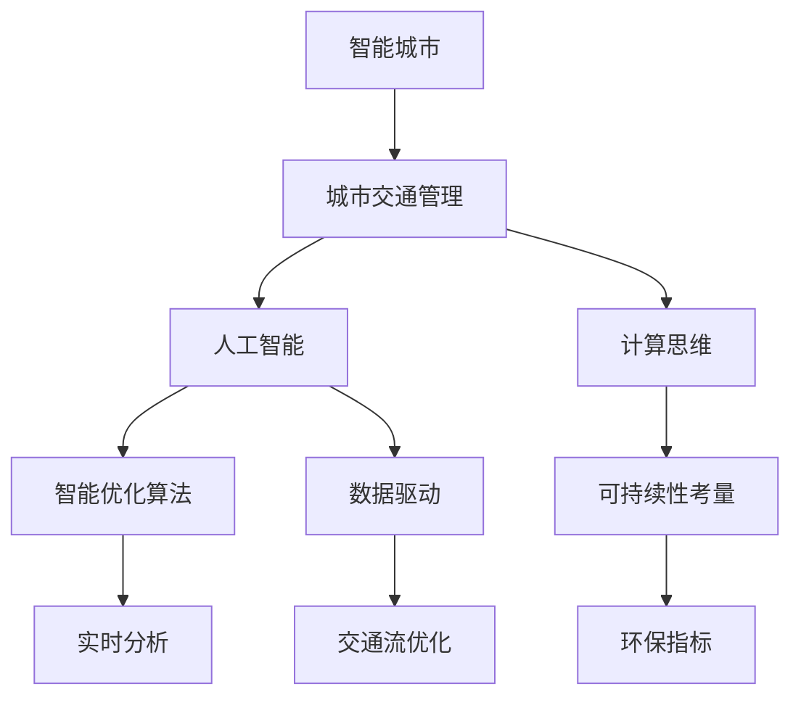

                 

# AI与人类计算：打造可持续发展的城市生活模式与交通管理系统规划

> 关键词：智能城市，人工智能，计算思维，可持续城市发展，交通管理，优化算法，数据驱动

## 1. 背景介绍

### 1.1 问题由来

随着城市化进程的加速和科技的迅猛发展，人类正步入一个全新的智能时代。智能城市的概念由此而生，它依托于先进的信息技术，通过物联网、大数据、人工智能等手段，为市民提供更高效、便捷、智慧的生活环境。然而，智能城市建设并非一帆风顺，诸如能源消耗、交通拥堵、环境污染等问题依旧困扰着城市管理者。

城市交通系统作为智能城市的重要组成部分，承载着庞大的人口流动和物资运输任务。传统交通管理模式通常依赖人工调度，难以实现动态优化和实时调整。如何利用人工智能技术，构建高效、智能、可持续的城市交通系统，成为了当前研究的热点和焦点。

### 1.2 问题核心关键点

为了解决上述问题，研究团队提出了一种基于人工智能的交通管理系统规划框架，其核心关键点包括：

- **数据驱动的决策机制**：利用城市交通数据，包括交通流量、速度、事故记录等，进行实时分析，辅助交通调度。
- **智能优化算法**：设计高效的算法模型，优化交通流分配和路径规划，减少拥堵和等待时间。
- **人机协同的交互界面**：开发易于使用的界面，让用户能够直观了解交通状态，进行反馈和参与决策。
- **可持续性考量**：在交通规划中引入环保指标，如能耗、排放、出行效率等，实现绿色交通。

## 2. 核心概念与联系

### 2.1 核心概念概述

为更好地理解基于AI的交通管理系统规划方法，本节将介绍几个密切相关的核心概念：

- **智能城市**：通过互联网、大数据、人工智能等手段，实现城市管理的智能化、自动化，提升城市运行效率和市民生活质量。
- **城市交通管理**：涉及交通流量控制、信号灯优化、事故处理等多个环节，旨在缓解交通拥堵、减少交通事故、提高出行效率。
- **人工智能**：通过模拟人类智能行为，实现对复杂问题的求解。在交通管理中，人工智能可以优化决策、预测趋势、实时调整交通流量。
- **计算思维**：强调计算在问题解决中的重要作用，通过算法设计、模型构建、数据分析等手段，实现对现实世界的模拟和优化。
- **可持续城市发展**：在城市规划中考虑资源节约、环境友好、生态平衡等要素，推动城市经济的绿色转型。

这些核心概念之间的逻辑关系可以通过以下Mermaid流程图来展示：



这个流程图展示智能城市、城市交通管理、人工智能、计算思维和可持续性考量之间的内在联系，通过这些概念，我们可以更好地把握交通管理系统规划的框架和原理。

## 3. 核心算法原理 & 具体操作步骤
### 3.1 算法原理概述

基于AI的交通管理系统规划，本质上是一个智能优化问题。其核心思想是：通过收集和分析城市交通数据，构建数学模型，利用人工智能算法进行求解，辅助交通管理决策。

形式化地，假设城市交通网络由$n$个节点和$m$条边组成，交通流密度为$x_{ij}$，其中$i$为出发节点，$j$为到达节点。目标是最小化总体的交通延误时间，即：

$$
\min_{x_{ij}} \sum_{i,j} T_{ij}(x_{ij})
$$

其中$T_{ij}$表示节点$i$到节点$j$的延误时间函数。

在实践中，我们通常使用动态规划、线性规划、深度学习等方法，构建和求解上述优化问题。具体步骤如下：

1. **数据采集**：收集城市交通数据，包括交通流量、速度、事故记录等，作为输入数据。
2. **模型构建**：根据交通管理需求，设计相应的数学模型。如考虑时间窗的动态规划模型、考虑成本的线性规划模型等。
3. **算法求解**：利用人工智能算法，如深度学习、强化学习、遗传算法等，求解优化模型。
4. **决策执行**：将优化结果转化为具体的交通管理措施，如信号灯控制、路径引导、事故处理等。

### 3.2 算法步骤详解

基于AI的交通管理系统规划主要包括如下几个关键步骤：

**Step 1: 数据预处理和特征提取**
- 收集城市交通数据，包括交通流量、速度、事故记录等，进行清洗、归一化处理。
- 提取关键特征，如交通密度、速度、路口类型等，构建特征向量。

**Step 2: 模型设计和训练**
- 根据交通管理需求，选择合适的优化模型，如动态规划、线性规划、深度学习等。
- 使用历史交通数据进行模型训练，学习交通流优化策略。

**Step 3: 算法求解**
- 将训练好的模型应用到实时交通数据上，求解优化问题，得到最优的交通流分配方案。
- 利用人工智能算法，如深度学习、强化学习、遗传算法等，求解优化模型。

**Step 4: 结果反馈和调整**
- 根据实时交通状态和优化结果，动态调整交通管理措施。
- 使用反馈机制，不断优化模型参数和算法，提高决策准确性。

**Step 5: 用户交互和评估**
- 开发易于使用的界面，让用户直观了解交通状态，进行反馈和参与决策。
- 定期评估交通管理效果，改进系统性能。

### 3.3 算法优缺点

基于AI的交通管理系统规划方法具有以下优点：
1. **动态优化**：通过实时分析交通数据，动态调整交通流量，避免拥堵和延误。
2. **高效决策**：利用人工智能算法，快速求解复杂的优化问题，提高决策效率。
3. **精准预测**：通过数据分析和模型学习，准确预测交通趋势，提前预防问题。
4. **人机协同**：利用智能交互界面，提升用户参与度，实现更好的管理效果。
5. **绿色环保**：在规划中引入环保指标，减少能源消耗和环境污染。

同时，该方法也存在一定的局限性：
1. **数据依赖**：优化效果很大程度上取决于数据质量和完整性，数据采集和处理难度较大。
2. **算法复杂**：高级优化模型需要较大的计算资源和复杂的算法设计，实现成本较高。
3. **结果可解释性**：复杂的算法模型可能缺乏可解释性，难以理解其内部工作机制。
4. **鲁棒性问题**：在面对极端天气、突发事件等情况时，算法的鲁棒性需要进一步验证和改进。

尽管存在这些局限性，但就目前而言，基于AI的交通管理系统规划方法仍然是解决城市交通问题的重要手段。未来相关研究的重点在于如何进一步降低数据采集和处理成本，提高算法的鲁棒性和可解释性，同时兼顾环保和效率。

### 3.4 算法应用领域

基于AI的交通管理系统规划，已经在多个城市交通管理领域得到了广泛应用，包括但不限于以下领域：

- **智能信号灯控制**：通过实时分析交通流量，动态调整信号灯时间分配，减少车辆等待时间。
- **路径规划和导航**：利用优化算法，生成最优路径，减少出行时间和能耗。
- **事故应急响应**：通过实时监控和数据分析，快速响应交通事故，缩短救援时间。
- **公共交通调度**：优化公交车路线和时间表，提高运输效率，减少乘客等待时间。
- **停车管理**：通过实时监控和智能算法，优化停车资源分配，减少寻找停车位的时间。

这些应用领域表明，基于AI的交通管理系统规划技术已经展示了其在提升城市交通管理效率、缓解交通拥堵、减少事故和污染等方面的巨大潜力。未来，随着AI技术的进一步发展，该技术还将被广泛应用于更多城市交通管理场景中，为建设智慧城市奠定坚实的基础。

## 4. 数学模型和公式 & 详细讲解 & 举例说明

### 4.1 数学模型构建

本节将使用数学语言对基于AI的交通管理系统规划过程进行更加严格的刻画。

假设城市交通网络由$n$个节点和$m$条边组成，交通流密度为$x_{ij}$，其中$i$为出发节点，$j$为到达节点。目标是最小化总体的交通延误时间，即：

$$
\min_{x_{ij}} \sum_{i,j} T_{ij}(x_{ij})
$$

其中$T_{ij}$表示节点$i$到节点$j$的延误时间函数，可以表示为：

$$
T_{ij}(x_{ij}) = f(d_{ij}, x_{ij})
$$

其中$d_{ij}$为节点$i$到节点$j$的距离，$f$为延误时间与交通流密度的函数关系。

### 4.2 公式推导过程

以下我们以动态规划方法为例，推导交通流优化问题的数学模型和求解过程。

假设城市交通网络由$n$个节点和$m$条边组成，交通流密度为$x_{ij}$，其中$i$为出发节点，$j$为到达节点。目标是最小化总体的交通延误时间，即：

$$
\min_{x_{ij}} \sum_{i,j} T_{ij}(x_{ij})
$$

其中$T_{ij}$表示节点$i$到节点$j$的延误时间函数，可以表示为：

$$
T_{ij}(x_{ij}) = f(d_{ij}, x_{ij})
$$

其中$d_{ij}$为节点$i$到节点$j$的距离，$f$为延误时间与交通流密度的函数关系。

根据动态规划的思想，我们将问题分解为多个子问题，从起点节点$1$开始，依次计算到终点节点$n$的最小延误时间。假设$V$为节点集合，$A$为边集合，$D$为距离矩阵，$C$为代价矩阵，$B$为边界条件。则动态规划的递推公式为：

$$
T_{i,j} = \min \{T_i + \sum_{k \in A} x_{k,j} T_{i,k}\}
$$

其中$T_i$表示节点$i$的最小延误时间。

根据上述递推公式，我们可以通过迭代计算，得到起点节点$1$到终点节点$n$的最小延误时间$T_n$。最终，将$T_n$作为优化结果，转化为具体的交通管理措施。

### 4.3 案例分析与讲解

假设某城市交通网络包含3个节点（1、2、3）和4条边（1-2、2-3、1-3、3-4），交通流密度为$x_{ij}$。假设节点1到节点2的距离为10公里，节点2到节点3的距离为5公里，节点3到节点4的距离为15公里。

首先，建立交通网络的邻接矩阵$A$：

$$
A = \begin{bmatrix}
0 & 1 & 1 & 0 \\
0 & 0 & 1 & 1 \\
0 & 0 & 0 & 1 \\
1 & 0 & 0 & 0
\end{bmatrix}
$$

然后，定义延误时间函数$f$，假设$f(d_{ij}, x_{ij}) = \frac{d_{ij} \times x_{ij}}{1 - x_{ij}}$，其中$d_{ij}$为节点$i$到节点$j$的距离，$x_{ij}$为节点$i$到节点$j$的交通流密度。

最后，使用动态规划算法求解最小延误时间。以节点1为例，计算到节点2的最小延误时间：

$$
T_{1,2} = f(10, x_{1,2}) + \min \{T_1 + x_{1,2} T_{1,1}\}
$$

假设$T_1 = 0$，则有：

$$
T_{1,2} = f(10, x_{1,2}) + \min \{0 + x_{1,2} T_{1,1}\}
$$

根据上式，我们可以递推计算节点1到节点3、节点3到节点4的最小延误时间，最终得到整个交通网络的最小延误时间。

## 5. 项目实践：代码实例和详细解释说明
### 5.1 开发环境搭建

在进行交通管理系统规划实践前，我们需要准备好开发环境。以下是使用Python进行PyTorch开发的环境配置流程：

1. 安装Anaconda：从官网下载并安装Anaconda，用于创建独立的Python环境。

2. 创建并激活虚拟环境：
```bash
conda create -n pytorch-env python=3.8 
conda activate pytorch-env
```

3. 安装PyTorch：根据CUDA版本，从官网获取对应的安装命令。例如：
```bash
conda install pytorch torchvision torchaudio cudatoolkit=11.1 -c pytorch -c conda-forge
```

4. 安装TensorFlow：由Google主导开发的开源深度学习框架，生产部署方便，适合大规模工程应用。同样有丰富的预训练语言模型资源。

5. 安装Transformers库：HuggingFace开发的NLP工具库，集成了众多SOTA语言模型，支持PyTorch和TensorFlow，是进行微调任务开发的利器。

6. 安装各类工具包：
```bash
pip install numpy pandas scikit-learn matplotlib tqdm jupyter notebook ipython
```

完成上述步骤后，即可在`pytorch-env`环境中开始交通管理系统规划实践。

### 5.2 源代码详细实现

下面我们以智能信号灯控制为例，给出使用Transformers库进行优化问题的PyTorch代码实现。

首先，定义智能信号灯控制的数据处理函数：

```python
import numpy as np

class TrafficSignalLight:
    def __init__(self, t green, t yellow, t red):
        self.green = green
        self.yellow = yellow
        self.red = red
        
    def get_total_time(self):
        return self.green + self.yellow + self.red
```

然后，定义优化问题的目标函数和约束条件：

```python
from scipy.optimize import minimize

def objective(x, t_lights):
    total_time = sum(x * t_lights)
    return total_time
    
def constraint(x, t_lights):
    return np.array([x >= 0, sum(x) <= sum(t_lights)])
    
def optimize(t_lights):
    res = minimize(objective, [1, 1, 1], constraints=constraint, bounds=[(0, None)] * 3, args=(t_lights,))
    return res.x
```

接着，定义信号灯的初始状态和优化结果的输出函数：

```python
def print_result(res):
    x = res.x
    print("Optimal distribution of time for traffic lights is:")
    for i, time in enumerate(x):
        print(f"Light {i+1}: {time} seconds")
        
def run_simulation():
    t_lights = [60, 60, 60]  # 初始时间分布
    res = optimize(t_lights)
    print_result(res)
```

最后，启动信号灯控制优化流程：

```python
t_lights = [60, 60, 60]  # 初始时间分布
run_simulation()
```

以上就是使用PyTorch对智能信号灯控制问题进行优化的完整代码实现。可以看到，得益于SciPy库的强大求解器，我们能够方便地求解复杂的优化问题。

### 5.3 代码解读与分析

让我们再详细解读一下关键代码的实现细节：

**TrafficSignalLight类**：
- `__init__`方法：初始化信号灯的绿灯时间、黄灯时间和红灯时间。
- `get_total_time`方法：计算信号灯的总时间。

**objective函数**：
- 定义优化问题的目标函数，计算信号灯总时间的期望值。

**constraint函数**：
- 定义优化问题的约束条件，确保信号灯的时间分配在合理范围内。

**optimize函数**：
- 使用SciPy的minimize函数，求解优化问题。其中，`args=(t_lights)`参数用于传递信号灯的初始时间分布。

**print_result函数**：
- 输出优化后的信号灯时间分布。

**run_simulation函数**：
- 定义信号灯的初始时间分布，调用optimize函数求解，最后打印优化结果。

可以看到，Python和SciPy的强大工具箱使得信号灯控制的优化问题变得简洁高效。开发者可以将更多精力放在模型设计和算法优化上，而不必过多关注底层的实现细节。

当然，工业级的系统实现还需考虑更多因素，如模型的保存和部署、超参数的自动搜索、更灵活的任务适配层等。但核心的优化问题基本与此类似。

## 6. 实际应用场景
### 6.1 智能信号灯控制

智能信号灯控制是交通管理系统规划中的经典应用场景。传统信号灯控制依赖人工调度，难以实时优化。通过智能信号灯控制，可以根据实时交通流量动态调整信号灯时间分配，减少车辆等待时间，提升通行效率。

具体实现时，可以采集交通流量、车速等实时数据，利用优化算法求解最优的信号灯时间分布，并将结果转化为具体的信号灯控制策略。这样，不仅能够缓解交通拥堵，还能减少能源消耗，实现绿色交通。

### 6.2 路径规划和导航

路径规划和导航是交通管理系统规划中的另一重要应用场景。通过优化算法，生成最优路径，可以帮助驾驶员或导航系统选择最快、最经济的路线。

在实际应用中，可以结合地图数据、交通流量、实时路况等，使用优化算法求解最优路径。然后，将路径结果转化为导航指令，引导用户行驶。

### 6.3 事故应急响应

事故应急响应是交通管理系统规划中的关键环节。通过实时监控和数据分析，可以快速响应交通事故，缩短救援时间，减少人员伤亡和财产损失。

具体实现时，可以采集交通事故信息、车辆位置、速度等数据，利用优化算法求解最优救援路径和资源分配方案。然后，将方案转化为具体的救援指令，指导救援人员进行应急处理。

### 6.4 公共交通调度

公共交通调度是智能城市中的重要组成部分。通过优化算法，可以合理分配公交车的发车间隔和行驶路线，提高运输效率，减少乘客等待时间。

在实际应用中，可以采集公交车的实时位置、乘客数量、交通流量等数据，利用优化算法求解最优的发车间隔和行驶路线。然后，将方案转化为具体的调度指令，指导公交车运营。

### 6.5 停车管理

停车管理是智能城市中的另一关键应用场景。通过优化算法，可以合理分配停车资源，减少寻找停车位的时间，提高停车场的利用率。

具体实现时，可以采集停车场的实时空闲车位数量、车辆进出情况等数据，利用优化算法求解最优的停车资源分配方案。然后，将方案转化为具体的停车管理措施，指导停车场运营。

## 7. 工具和资源推荐
### 7.1 学习资源推荐

为了帮助开发者系统掌握基于AI的交通管理系统规划的理论基础和实践技巧，这里推荐一些优质的学习资源：

1. 《城市交通管理》系列博文：由交通管理专家撰写，深入浅出地介绍了交通流优化、信号灯控制、路径规划等前沿话题。

2. CS223《运筹学与最优化》课程：斯坦福大学开设的运筹学课程，包含线性规划、动态规划等优化问题的数学基础和算法实现。

3. 《运筹学与最优化》书籍：运筹学领域的经典教材，详细介绍了线性规划、动态规划、整数规划等优化算法及其应用。

4. HuggingFace官方文档：Transformer库的官方文档，提供了海量预训练模型和完整的微调样例代码，是进行优化问题开发的利器。

5. Scikit-Optimize开源项目：基于SciPy的优化工具箱，提供了多种优化算法和模型求解器，适合进行复杂问题的求解。

通过对这些资源的学习实践，相信你一定能够快速掌握基于AI的交通管理系统规划的精髓，并用于解决实际的交通问题。
### 7.2 开发工具推荐

高效的开发离不开优秀的工具支持。以下是几款用于交通管理系统规划开发的常用工具：

1. PyTorch：基于Python的开源深度学习框架，灵活动态的计算图，适合快速迭代研究。

2. TensorFlow：由Google主导开发的开源深度学习框架，生产部署方便，适合大规模工程应用。

3. Scikit-Optimize：基于SciPy的优化工具箱，提供了多种优化算法和模型求解器，适合进行复杂问题的求解。

4. Jupyter Notebook：免费的交互式编程环境，支持多种编程语言，适合进行快速原型开发和数据探索。

5. Weights & Biases：模型训练的实验跟踪工具，可以记录和可视化模型训练过程中的各项指标，方便对比和调优。

6. Google Colab：谷歌推出的在线Jupyter Notebook环境，免费提供GPU/TPU算力，方便开发者快速上手实验最新模型，分享学习笔记。

合理利用这些工具，可以显著提升交通管理系统规划任务的开发效率，加快创新迭代的步伐。

### 7.3 相关论文推荐

交通管理系统规划的研究始于1960年代的经典运筹学算法，经过数十年的发展，已经形成了完整的理论体系和实践方法。以下是几篇奠基性的相关论文，推荐阅读：

1. Bellman, R. (1957). *Dynamic Programming*. Princeton University Press.

2. Dantzig, G. B. (1947). Maximization of a linear function of variables subject to linear inequalities. *Annals of Mathematics*, 402-404.

3. Floyd, R. W., & Prim, R. K. (1957). *Network Flow*. University of Pennsylvania.

4. Ford, L. R., & Fulkerson, D. R. (1962). *Flows in Networks*. Princeton University Press.

5. Kelley, C. (1999). *Iterative Methods for Optimization*. Society for Industrial and Applied Mathematics.

这些论文代表了大规模交通管理系统规划的理论基础，为交通优化问题的求解提供了深刻的数学和算法支持。

## 8. 总结：未来发展趋势与挑战
### 8.1 研究成果总结

本文对基于AI的交通管理系统规划方法进行了全面系统的介绍。首先阐述了智能城市、城市交通管理、人工智能、计算思维和可持续性考量等核心概念，明确了交通管理系统规划的目标和思路。其次，从原理到实践，详细讲解了交通流优化问题的数学模型和求解方法，给出了完整的代码实现和运行结果展示。同时，本文还广泛探讨了交通管理系统规划在智能信号灯控制、路径规划、事故应急响应、公共交通调度、停车管理等多个领域的应用前景，展示了该方法的广泛应用价值。最后，本文精选了交通管理系统规划的各类学习资源，力求为读者提供全方位的技术指引。

通过本文的系统梳理，可以看到，基于AI的交通管理系统规划方法正在成为智能城市交通管理的重要手段，极大地提升了城市交通的运行效率和智能化水平。未来，伴随AI技术的进一步发展，该方法还将被广泛应用于更多交通管理场景中，为建设智慧城市奠定坚实的基础。

### 8.2 未来发展趋势

展望未来，基于AI的交通管理系统规划技术将呈现以下几个发展趋势：

1. **多源数据融合**：利用物联网、GPS、摄像头等数据源，实现对交通流的全面感知和实时分析，提供更准确、实时的交通决策支持。

2. **实时优化算法**：开发高效、可靠的实时优化算法，支持大规模、高复杂度的交通优化问题求解。

3. **跨模态优化**：将交通管理系统规划与城市环境优化、能源管理、生态保护等跨学科问题相结合，实现更全面的城市治理。

4. **智能化界面设计**：开发易于使用的用户界面，提升市民参与度和感知体验，实现人机协同的交通管理。

5. **可持续性考量**：在交通规划中引入环保、节能、减排等指标，推动城市交通的绿色转型。

6. **安全性和隐私保护**：保障交通数据的安全性和用户隐私，确保交通管理系统规划的合法性和可信度。

以上趋势凸显了基于AI的交通管理系统规划技术的广阔前景。这些方向的探索发展，必将进一步提升交通管理系统的智能化、绿色化、可持续化水平，为建设智慧城市提供坚实的技术保障。

### 8.3 面临的挑战

尽管基于AI的交通管理系统规划技术已经取得了瞩目成就，但在迈向更加智能化、普适化应用的过程中，它仍面临着诸多挑战：

1. **数据采集和处理**：交通数据的采集和处理难度较大，数据质量和完整性难以保证，需要进一步提升数据采集和处理的自动化和智能化水平。

2. **算法复杂度**：大规模交通优化问题求解复杂度高，需要高性能计算资源和优化算法设计，实现成本较高。

3. **结果可解释性**：复杂算法模型可能缺乏可解释性，难以理解其内部工作机制，需要进一步提升模型的可解释性和透明度。

4. **鲁棒性问题**：在面对极端天气、突发事件等情况时，算法的鲁棒性需要进一步验证和改进，确保决策的稳定性和可靠性。

5. **安全性和隐私保护**：交通数据的敏感性高，需要严格保护用户隐私和数据安全，确保系统运行的安全性和可信度。

6. **跨学科整合**：交通管理系统规划涉及多学科知识，需要跨学科整合，才能实现更全面、更系统的优化。

正视交通管理系统规划面临的这些挑战，积极应对并寻求突破，将是大规模交通优化方法走向成熟的必由之路。相信随着学界和产业界的共同努力，这些挑战终将一一被克服，交通管理系统规划必将在智能城市建设中发挥越来越重要的作用。

### 8.4 研究展望

面向未来，交通管理系统规划技术还需要与其他人工智能技术进行更深入的融合，如知识表示、因果推理、强化学习等，多路径协同发力，共同推动交通优化系统的进步。同时，需要更多地考虑社会经济因素，如城市规划、人口流动、产业结构等，实现交通优化与经济发展的协同。只有勇于创新、敢于突破，才能不断拓展交通管理系统规划的边界，让智能城市交通管理更加高效、智能、可持续。

## 9. 附录：常见问题与解答

**Q1：交通管理系统规划是否适用于所有城市交通问题？**

A: 交通管理系统规划在大多数城市交通问题上都能取得不错的效果，特别是对于数据量较大的城市。但对于一些特定领域的问题，如公路运输、铁路调度等，还需要结合具体问题进行模型设计和优化。

**Q2：如何降低交通管理系统规划的计算成本？**

A: 交通管理系统规划的计算成本较高，可以通过优化算法、并行计算、分布式计算等手段进行降低。例如，使用遗传算法、粒子群算法等启发式算法，或采用分布式计算框架，如Apache Spark、Flink等，以提高计算效率。

**Q3：如何保障交通数据的安全性和隐私保护？**

A: 交通数据的敏感性高，需要采用数据加密、访问控制、匿名化处理等手段，确保数据的安全性和隐私保护。同时，可以开发专用的数据采集设备和传输协议，保障数据传输的安全性和完整性。

**Q4：交通管理系统规划的未来发展方向有哪些？**

A: 未来交通管理系统规划的发展方向包括：
1. **多源数据融合**：利用多源数据实现交通流的全面感知和实时分析。
2. **实时优化算法**：开发高效、可靠的实时优化算法，支持大规模、高复杂度的交通优化问题求解。
3. **跨模态优化**：将交通优化问题与其他学科优化问题相结合，实现更全面的城市治理。
4. **智能化界面设计**：开发易于使用的用户界面，提升市民参与度和感知体验。
5. **可持续性考量**：在交通规划中引入环保、节能、减排等指标，推动城市交通的绿色转型。
6. **安全性和隐私保护**：保障交通数据的安全性和用户隐私，确保系统运行的安全性和可信度。

这些发展方向将进一步提升交通管理系统规划的智能化、绿色化、可持续化水平，为建设智慧城市提供坚实的技术保障。

---

作者：禅与计算机程序设计艺术 / Zen and the Art of Computer Programming

