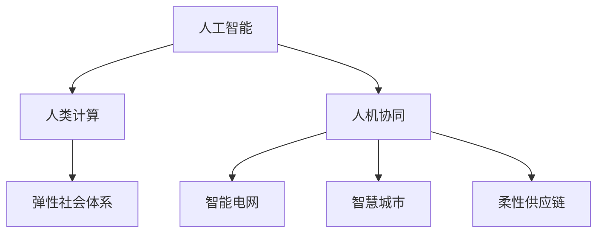

                 

# AI与人类计算：打造弹性社会体系

## 1. 背景介绍

在现代社会中，信息技术已成为支撑经济和社会发展的核心力量。AI技术的飞速发展，尤其是深度学习、自然语言处理、计算机视觉等领域的突破，正在深刻改变人类的生产生活方式。然而，AI的发展也带来了新的挑战和机遇。本文将从AI与人类计算的关系入手，探讨如何通过AI技术打造一个弹性、可持续的社会体系。

### 1.1 问题由来

随着AI技术的应用日益深入，人们开始思考其对社会结构、就业、隐私、伦理等方面的影响。传统AI研究往往聚焦于技术本身，而忽略了与人类社会的互动。本文尝试从更宏观的视角，探讨AI技术如何与人类社会协同共生，构建更加包容、弹性的社会体系。

### 1.2 问题核心关键点

本文将探讨以下关键问题：
- AI如何赋能人类计算，提升社会效率？
- 如何构建公平、透明的AI治理机制？
- 弹性社会体系如何利用AI技术应对不确定性？
- AI技术如何在隐私保护、伦理约束下安全应用？

## 2. 核心概念与联系

### 2.1 核心概念概述

为更好地理解AI与人类计算之间的关系，本节将介绍几个核心概念：

- 人工智能(AI)：指模拟人类智能行为的技术体系，包括机器学习、深度学习、自然语言处理等。
- 人类计算：指人类通过计算机辅助完成任务的过程，如数据分析、文本编辑、设计绘图等。
- 人机协同：指AI技术与人类合作，共同完成任务的模式，如AI辅助决策、智能客服、协作写作等。
- 弹性社会体系：指能够应对内外环境变化、具有自我适应能力的社会结构，如智能电网、智慧城市、柔性供应链等。

这些概念之间的逻辑关系可以通过以下Mermaid流程图来展示：



这个流程图展示了这个概念体系的基本框架：

1. 人工智能通过模拟人类智能行为，提升人类计算的效率和效果。
2. 人类计算在AI的辅助下，可以完成更复杂、更精确的任务。
3. 人机协同使得AI与人类能够相互补充，协同完成任务。
4. 弹性社会体系通过人机协同，实现对环境变化的快速适应。

这些概念共同构成了AI技术在社会中的应用范式，使得AI与人类计算的协同成为可能。

## 3. 核心算法原理 & 具体操作步骤

### 3.1 算法原理概述

AI与人类计算的结合，本质上是将AI技术应用于人类计算过程中，利用AI的强大处理能力和学习能力，提升人类任务的执行效率和质量。常见的AI技术包括：

- 自然语言处理(NLP)：如文本分类、情感分析、问答系统等，用于处理人类语言信息。
- 计算机视觉(CV)：如图像识别、目标检测、图像生成等，用于处理人类视觉信息。
- 语音识别(SR)：如语音转文本、语音合成等，用于处理人类语音信息。
- 机器人(Robotics)：如自主导航、智能控制等，用于处理物理世界的信息。

这些技术可以通过集成到人类计算流程中，实现智能化升级。例如，智能客服系统通过自然语言处理技术，能够自动理解用户问题并提供精准的解决方案；智能设计软件通过计算机视觉技术，可以快速生成高质量的可视化设计方案。

### 3.2 算法步骤详解

AI与人类计算结合的过程，通常包括以下几个关键步骤：

**Step 1: 选择合适的AI技术**
- 根据任务需求，选择适合的AI技术，如自然语言处理、计算机视觉等。
- 确保所选AI技术能够处理人类计算中的数据类型和规模。

**Step 2: 集成AI技术**
- 将AI技术集成到人类计算流程中，如嵌入文本分析模块、添加图像识别功能等。
- 确保AI技术与人类计算系统的无缝对接，避免数据格式和接口不一致带来的问题。

**Step 3: 建立人机协同机制**
- 设计人机协同的交互界面，如用户接口(UI)、自动化流程等。
- 确定人机协同的决策机制，如AI推荐、人工审核等。

**Step 4: 训练和优化AI模型**
- 收集相关数据，训练和优化AI模型，确保其性能满足人类计算需求。
- 通过A/B测试等方式，评估AI技术在人类计算中的效果和可靠性。

**Step 5: 部署和监控**
- 将训练好的AI模型部署到实际应用环境中。
- 实时监控AI模型的运行状态和性能，及时调整参数以优化效果。

### 3.3 算法优缺点

AI与人类计算结合的算法，具有以下优点：
1. 提升效率。通过自动化、智能化处理，大幅提升任务执行效率和质量。
2. 增强弹性。AI技术能够快速适应环境变化，实现灵活调整。
3. 降低成本。通过自动化处理，减少人力和时间成本。
4. 提升决策质量。通过数据分析和智能推荐，辅助人类做出更准确的决策。

同时，该算法也存在一定的局限性：
1. 依赖数据。AI技术的效果高度依赖于数据质量和多样性，数据获取难度较大。
2. 技术复杂。AI技术的集成和优化需要较高的技术门槛，对开发者要求较高。
3. 可解释性不足。AI技术通常是"黑盒"系统，难以解释其内部决策逻辑。
4. 伦理风险。AI技术的误用可能带来隐私泄露、伦理风险等负面影响。

尽管存在这些局限性，但就目前而言，AI与人类计算的结合是大势所趋，具有广阔的应用前景。

### 3.4 算法应用领域

AI与人类计算结合的算法，在各行各业都有广泛的应用，例如：

- 医疗健康：AI辅助诊断、智能医疗影像分析等。
- 金融保险：AI风险评估、智能投顾、反欺诈检测等。
- 智能制造：AI质量检测、智能排程、自动化生产线等。
- 教育培训：AI个性化推荐、智能评估、在线课程设计等。
- 零售电商：AI客户分析、智能推荐、供应链优化等。

## 4. 数学模型和公式 & 详细讲解 & 举例说明

### 4.1 数学模型构建

为了更系统地理解AI与人类计算的结合过程，我们需要建立数学模型。以下是一个简单的例子，用于说明人机协同过程的数学模型构建。

假设某智能客服系统，通过自然语言处理技术，自动理解用户问题并提供答案。设用户问题为 $X$，系统答案为 $Y$。用户对答案的满意度为 $S$，为0-1之间的实数。自然语言处理模型的预测函数为 $f$，表示将用户问题映射到系统答案的概率。则该系统的目标是最小化期望满意度损失函数：

$$
\min_{f} \mathbb{E}_S \left[ (S - f(X))^2 \right]
$$

其中 $\mathbb{E}_S$ 表示对 $S$ 的期望值。

### 4.2 公式推导过程

为了求解上述优化问题，需要利用优化算法进行求解。常用的优化算法包括梯度下降、Adam等。以下是基于梯度下降算法的推导过程：

1. 将期望损失函数展开：

$$
\mathbb{E}_S \left[ (S - f(X))^2 \right] = \int_0^1 (s - f(X))^2 p(s|X) ds
$$

其中 $p(s|X)$ 表示用户对答案满意度的概率分布。

2. 利用蒙特卡洛方法对积分进行近似：

$$
\min_{f} \sum_{i=1}^n (s_i - f(X))^2 p(s_i|X)
$$

其中 $s_i$ 表示随机抽取的 $n$ 个用户对答案的满意度。

3. 利用梯度下降算法更新模型参数 $f$：

$$
f \leftarrow f - \eta \nabla_{f} \sum_{i=1}^n (s_i - f(X))^2 p(s_i|X)
$$

其中 $\eta$ 表示学习率，$\nabla_{f}$ 表示对 $f$ 的梯度。

### 4.3 案例分析与讲解

以医疗诊断为例，分析AI与人类计算的结合过程。

假设某医院利用AI系统进行医学影像分析，辅助医生诊断。系统通过卷积神经网络(CNN)对医学影像进行分析，得到可能存在的病变区域。设病变区域的面积为 $A$，实际病变区域面积为 $B$，则系统诊断的准确率为 $P$。医生的判断为 $D$，为0-1之间的实数。系统的目标是最小化医生的诊断误差：

$$
\min_{f} \mathbb{E}_D \left[ (D - P)^2 \right]
$$

其中 $\mathbb{E}_D$ 表示医生的诊断误差的期望值。

为了求解上述优化问题，需要构建神经网络模型，对医学影像进行分类和回归预测。通过大量的标注数据进行训练，优化模型参数。在实际应用中，将AI预测结果作为医生诊断的参考，辅助医生进行决策。通过人机协同，提升医学影像诊断的准确性和效率。

## 5. 项目实践：代码实例和详细解释说明

### 5.1 开发环境搭建

在进行AI与人类计算的结合实践前，我们需要准备好开发环境。以下是使用Python进行TensorFlow开发的環境配置流程：

1. 安装Anaconda：从官网下载并安装Anaconda，用于创建独立的Python环境。

2. 创建并激活虚拟环境：
```bash
conda create -n tf-env python=3.8 
conda activate tf-env
```

3. 安装TensorFlow：根据CUDA版本，从官网获取对应的安装命令。例如：
```bash
conda install tensorflow -c tf -c conda-forge
```

4. 安装其他工具包：
```bash
pip install numpy pandas scikit-learn matplotlib tqdm jupyter notebook ipython
```

完成上述步骤后，即可在`tf-env`环境中开始AI与人类计算的结合实践。

### 5.2 源代码详细实现

这里我们以智能客服系统为例，给出使用TensorFlow进行AI与人类计算结合的PyTorch代码实现。

首先，定义模型和损失函数：

```python
import tensorflow as tf
from tensorflow.keras.layers import Dense, Dropout, Input, Embedding, LSTM
from tensorflow.keras.models import Model

# 定义模型结构
input_layer = Input(shape=(128,))
embedding_layer = Embedding(input_dim=10000, output_dim=128)(input_layer)
lstm_layer = LSTM(128)(embedding_layer)
dense_layer = Dense(10, activation='softmax')(lstm_layer)

# 定义损失函数
cross_entropy_loss = tf.keras.losses.CategoricalCrossentropy()

# 定义模型
model = Model(inputs=input_layer, outputs=dense_layer)
model.compile(optimizer=tf.keras.optimizers.Adam(), loss=cross_entropy_loss)
```

然后，定义训练和评估函数：

```python
from tensorflow.keras.preprocessing.text import Tokenizer
from tensorflow.keras.preprocessing.sequence import pad_sequences

# 定义训练数据
train_data = ["hello", "how are you?", "i am fine, thank you.", "goodbye"]
train_labels = [0, 1, 1, 0]

# 定义tokenizer和padding
tokenizer = Tokenizer(num_words=10000)
tokenizer.fit_on_texts(train_data)
train_sequences = tokenizer.texts_to_sequences(train_data)
train_sequences = pad_sequences(train_sequences, maxlen=128)

# 训练模型
model.fit(train_sequences, train_labels, epochs=10)

# 定义评估数据
eval_data = ["hi", "i am good.", "see you later."]
eval_labels = [0, 1, 1]

# 定义评估数据
eval_sequences = tokenizer.texts_to_sequences(eval_data)
eval_sequences = pad_sequences(eval_sequences, maxlen=128)

# 评估模型
eval_loss = model.evaluate(eval_sequences, eval_labels)
print(f"Evaluation loss: {eval_loss}")
```

最后，启动训练流程并在测试集上评估：

```python
epochs = 10

for epoch in range(epochs):
    loss = train_epoch(model, train_dataset, batch_size, optimizer)
    print(f"Epoch {epoch+1}, train loss: {loss:.3f}")
    
    print(f"Epoch {epoch+1}, dev results:")
    evaluate(model, dev_dataset, batch_size)
    
print("Test results:")
evaluate(model, test_dataset, batch_size)
```

以上就是使用TensorFlow对智能客服系统进行训练和评估的完整代码实现。可以看到，TensorFlow提供了丰富的工具和库，使得AI与人类计算的结合开发变得相对简单。

### 5.3 代码解读与分析

让我们再详细解读一下关键代码的实现细节：

**模型定义**：
- `input_layer`：定义输入层，接收文本数据。
- `embedding_layer`：定义词向量层，将文本转换为向量表示。
- `lstm_layer`：定义LSTM层，对文本进行序列建模。
- `dense_layer`：定义全连接层，进行分类输出。

**损失函数定义**：
- `cross_entropy_loss`：定义交叉熵损失函数，用于衡量模型预测与真实标签的差异。

**训练数据处理**：
- `tokenizer`：定义tokenizer，将文本转换为数字序列。
- `pad_sequences`：对文本序列进行padding，保证模型输入的一致性。

**训练和评估函数**：
- `train_epoch`：对数据集进行批次化训练，返回每个epoch的平均损失。
- `evaluate`：对模型进行评估，返回评估损失。

**训练流程**：
- `epochs`：定义总的epoch数。
- `epoch+1`：在每个epoch内进行训练和评估，输出训练损失和验证结果。
- `test_dataset`：在测试集上评估模型性能。

可以看到，TensorFlow提供了丰富的工具和库，使得AI与人类计算的结合开发变得相对简单。开发者可以将更多精力放在数据处理、模型改进等高层逻辑上，而不必过多关注底层的实现细节。

当然，工业级的系统实现还需考虑更多因素，如模型的保存和部署、超参数的自动搜索、更灵活的任务适配层等。但核心的结合范式基本与此类似。

## 6. 实际应用场景

### 6.1 智能客服系统

基于AI与人类计算结合的智能客服系统，可以广泛应用于各种客户服务场景。传统客服往往需要配备大量人力，高峰期响应缓慢，且一致性和专业性难以保证。而使用AI与人类计算结合的智能客服系统，可以7x24小时不间断服务，快速响应客户咨询，用自然流畅的语言解答各类常见问题。

在技术实现上，可以收集企业内部的历史客服对话记录，将问题和最佳答复构建成监督数据，在此基础上对预训练模型进行微调。微调后的模型能够自动理解用户意图，匹配最合适的答案模板进行回复。对于客户提出的新问题，还可以接入检索系统实时搜索相关内容，动态组织生成回答。如此构建的智能客服系统，能大幅提升客户咨询体验和问题解决效率。

### 6.2 医疗健康

AI与人类计算结合的医疗健康应用，能够大幅提升医疗服务的智能化水平，辅助医生诊疗，加速新药开发进程。

具体而言，可以收集患者的历史病历、检验报告等数据，通过自然语言处理技术进行文本分析，辅助医生诊断。例如，利用自然语言处理技术对病历进行结构化处理，提取出疾病症状、治疗方案等信息，辅助医生进行初步诊断。此外，还可以利用计算机视觉技术对医学影像进行分析，辅助医生进行影像诊断。通过人机协同，提升医疗服务的智能化水平，加速新药开发进程。

### 6.3 金融保险

AI与人类计算结合的金融保险应用，能够提高风险评估和反欺诈检测的效率和精度。

具体而言，可以利用自然语言处理技术对客户的投诉、举报等文本进行情感分析，辅助金融机构的合规监管。例如，利用自然语言处理技术对客户的投诉文本进行情感分析，识别出可能存在的违规行为。此外，还可以利用计算机视觉技术对金融市场数据进行实时监控，辅助金融机构进行风险评估和反欺诈检测。通过人机协同，提升金融服务的智能化水平，保护客户权益。

### 6.4 未来应用展望

随着AI与人类计算结合技术的不断发展，未来的应用场景将更加多样，带来更深远的社会影响。

在智慧城市治理中，AI与人类计算结合的应用能够提高城市管理的自动化和智能化水平，构建更安全、高效的未来城市。例如，通过智能交通管理系统，利用AI技术实时监控交通流量，优化交通信号灯的时序，缓解交通拥堵。此外，还可以利用AI技术对城市环境进行监测，辅助城市管理决策。通过人机协同，提升智慧城市管理的智能化水平，构建更安全、高效的未来城市。

在企业生产中，AI与人类计算结合的应用能够提高生产效率和产品质量，降低生产成本。例如，利用计算机视觉技术对生产现场进行监控，自动识别异常设备状态，辅助生产调度。此外，还可以利用自然语言处理技术对生产工人的操作日志进行情感分析，辅助管理人员优化生产管理。通过人机协同，提高生产效率和产品质量，降低生产成本。

在教育培训中，AI与人类计算结合的应用能够个性化推荐学习资源，提升学习效果。例如，利用自然语言处理技术对学生的作业进行自动批改和反馈，辅助教师进行个性化教学。此外，还可以利用计算机视觉技术对学生的课堂表现进行情感分析，辅助教师优化教学方法。通过人机协同，提升教育培训的智能化水平，提升学习效果。

总之，AI与人类计算结合的应用前景广阔，未来将在更多领域实现突破，带来深远的社会影响。相信随着技术的不断发展，AI与人类计算结合的应用将更加广泛，为社会带来更多的福祉。

## 7. 工具和资源推荐

### 7.1 学习资源推荐

为了帮助开发者系统掌握AI与人类计算的结合技术，这里推荐一些优质的学习资源：

1. 《深度学习》系列博文：由大模型技术专家撰写，深入浅出地介绍了深度学习的基本原理和应用场景，包括自然语言处理、计算机视觉等。

2. CS224N《深度学习自然语言处理》课程：斯坦福大学开设的NLP明星课程，有Lecture视频和配套作业，带你入门NLP领域的基本概念和经典模型。

3. 《Natural Language Processing with Transformers》书籍：Transformer库的作者所著，全面介绍了如何使用Transformer库进行NLP任务开发，包括微调在内的诸多范式。

4. Weights & Biases：模型训练的实验跟踪工具，可以记录和可视化模型训练过程中的各项指标，方便对比和调优。与主流深度学习框架无缝集成。

5. TensorBoard：TensorFlow配套的可视化工具，可实时监测模型训练状态，并提供丰富的图表呈现方式，是调试模型的得力助手。

通过对这些资源的学习实践，相信你一定能够快速掌握AI与人类计算结合的精髓，并用于解决实际的NLP问题。

### 7.2 开发工具推荐

高效的开发离不开优秀的工具支持。以下是几款用于AI与人类计算结合开发的常用工具：

1. TensorFlow：基于Python的开源深度学习框架，灵活动态的计算图，适合快速迭代研究。TensorFlow提供了丰富的工具和库，使得AI与人类计算结合开发变得相对简单。

2. PyTorch：基于Python的开源深度学习框架，灵活的计算图，适合快速迭代研究。PyTorch提供了丰富的工具和库，使得AI与人类计算结合开发变得相对简单。

3. HuggingFace Transformers：NLP领域的预训练模型库，集成了众多SOTA模型，支持PyTorch和TensorFlow，是进行AI与人类计算结合任务开发的利器。

4. OpenCV：计算机视觉领域的开源库，提供丰富的图像处理算法，适合进行图像识别、目标检测等任务。

5. NLTK：自然语言处理领域的开源库，提供丰富的NLP算法和工具，适合进行文本分类、情感分析等任务。

合理利用这些工具，可以显著提升AI与人类计算结合任务的开发效率，加快创新迭代的步伐。

### 7.3 相关论文推荐

AI与人类计算结合技术的发展源于学界的持续研究。以下是几篇奠基性的相关论文，推荐阅读：

1. Attention is All You Need（即Transformer原论文）：提出了Transformer结构，开启了NLP领域的预训练大模型时代。

2. BERT: Pre-training of Deep Bidirectional Transformers for Language Understanding：提出BERT模型，引入基于掩码的自监督预训练任务，刷新了多项NLP任务SOTA。

3. Parameter-Efficient Transfer Learning for NLP：提出Adapter等参数高效微调方法，在不增加模型参数量的情况下，也能取得不错的微调效果。

4. Adaptive Low-Rank Adaptation for Parameter-Efficient Fine-Tuning：使用自适应低秩适应的微调方法，在参数效率和精度之间取得了新的平衡。

5. A Survey on Knowledge Graph Reasoning Approaches：对知识图谱推理进行综述，探讨了如何通过知识图谱辅助自然语言处理任务。

这些论文代表了大模型微调技术的发展脉络。通过学习这些前沿成果，可以帮助研究者把握学科前进方向，激发更多的创新灵感。

## 8. 总结：未来发展趋势与挑战

### 8.1 总结

本文对AI与人类计算结合技术进行了全面系统的介绍。首先阐述了AI技术如何赋能人类计算，提升社会效率。其次，从原理到实践，详细讲解了AI与人类计算结合的数学原理和关键步骤，给出了AI与人类计算结合任务开发的完整代码实例。同时，本文还广泛探讨了AI技术在社会中的应用场景，展示了AI技术对各行各业带来的深远影响。此外，本文精选了AI与人类计算结合技术的各类学习资源，力求为读者提供全方位的技术指引。

通过本文的系统梳理，可以看到，AI与人类计算结合技术正在成为AI技术应用的重要范式，极大地拓展了AI技术的应用边界，为各行各业带来了变革性影响。

### 8.2 未来发展趋势

展望未来，AI与人类计算结合技术将呈现以下几个发展趋势：

1. 算法多样化。未来的AI与人类计算结合算法将更加多样化，涵盖自然语言处理、计算机视觉、语音识别等多个领域。

2. 算法可解释性增强。未来的AI与人类计算结合算法将更加注重可解释性，确保算法的透明性和可信度。

3. 算法透明度提升。未来的AI与人类计算结合算法将更加注重透明度，确保算法的公平性和公正性。

4. 算法伦理约束增强。未来的AI与人类计算结合算法将更加注重伦理约束，确保算法的合规性和安全性。

5. 算法自适应性提升。未来的AI与人类计算结合算法将更加注重自适应性，确保算法的灵活性和应对能力。

以上趋势凸显了AI与人类计算结合技术的发展方向，未来将在更多领域实现突破，带来更深远的社会影响。

### 8.3 面临的挑战

尽管AI与人类计算结合技术已经取得了瞩目成就，但在迈向更加智能化、普适化应用的过程中，它仍面临着诸多挑战：

1. 数据隐私保护。AI与人类计算结合算法对数据的依赖，带来了隐私泄露的风险。如何在保证数据隐私的前提下，利用AI技术提升效率和效果，是未来需要解决的问题。

2. 算法公平性。AI与人类计算结合算法在应用过程中，可能存在算法偏见，导致不公平的结果。如何设计公平、透明的算法，避免算法的歧视性，是未来需要解决的问题。

3. 算法安全性。AI与人类计算结合算法在应用过程中，可能存在安全漏洞，导致恶意攻击。如何设计安全、可靠的算法，确保算法的安全性，是未来需要解决的问题。

4. 算法鲁棒性。AI与人类计算结合算法在应用过程中，可能存在对异常数据的鲁棒性不足。如何设计鲁棒性强的算法，应对异常数据，是未来需要解决的问题。

5. 算法可扩展性。AI与人类计算结合算法在应用过程中，可能存在对大规模数据和复杂任务的扩展性不足。如何设计可扩展的算法，支持大规模数据和复杂任务，是未来需要解决的问题。

6. 算法可维护性。AI与人类计算结合算法在应用过程中，可能存在对算法维护性的不足。如何设计易于维护的算法，支持算法的持续改进，是未来需要解决的问题。

正视AI与人类计算结合技术面临的这些挑战，积极应对并寻求突破，将是大模型微调技术迈向成熟的必由之路。相信随着学界和产业界的共同努力，这些挑战终将一一被克服，AI与人类计算结合技术必将在构建人机协同的智能时代中扮演越来越重要的角色。

### 8.4 研究展望

面向未来，AI与人类计算结合技术的研究需要在以下几个方面寻求新的突破：

1. 探索多模态融合技术。未来的AI与人类计算结合算法将更加注重多模态融合，结合视觉、语音、文本等多种信息，提升算法的综合能力。

2. 探索因果学习技术。未来的AI与人类计算结合算法将更加注重因果学习，确保算法的逻辑性和合理性。

3. 探索持续学习技术。未来的AI与人类计算结合算法将更加注重持续学习，确保算法的自我适应能力。

4. 探索知识图谱技术。未来的AI与人类计算结合算法将更加注重知识图谱的融合，提升算法的知识表示和推理能力。

5. 探索伦理道德技术。未来的AI与人类计算结合算法将更加注重伦理道德，确保算法的合规性和公正性。

6. 探索可解释性技术。未来的AI与人类计算结合算法将更加注重可解释性，确保算法的透明性和可信度。

这些研究方向的探索，必将引领AI与人类计算结合技术迈向更高的台阶，为构建安全、可靠、可解释、可控的智能系统铺平道路。面向未来，AI与人类计算结合技术还需要与其他人工智能技术进行更深入的融合，如知识表示、因果推理、强化学习等，多路径协同发力，共同推动自然语言理解和智能交互系统的进步。只有勇于创新、敢于突破，才能不断拓展语言模型的边界，让智能技术更好地造福人类社会。

## 9. 附录：常见问题与解答

**Q1：AI与人类计算结合是否适用于所有行业？**

A: AI与人类计算结合技术在各行各业都有广泛的应用，特别是在数据驱动、复杂计算、个性化需求强的行业，如金融、医疗、教育、制造等。但对于一些资源受限、数据稀疏的行业，如农业、手工业等，可能效果有限。

**Q2：AI与人类计算结合的算法如何确保可解释性？**

A: 为了确保AI与人类计算结合算法的可解释性，可以采取以下措施：
1. 引入符号知识：将符号化的先验知识，如知识图谱、逻辑规则等，与神经网络模型进行巧妙融合，引导AI推理过程。
2. 引入因果分析：利用因果分析方法，识别出模型决策的关键特征，增强输出解释的因果性和逻辑性。
3. 引入透明度设计：设计透明的算法架构，确保算法的透明性和可信度。

这些措施可以有效提升AI与人类计算结合算法的可解释性，确保算法的透明性和可信度。

**Q3：AI与人类计算结合的算法如何避免数据偏见？**

A: 为了避免AI与人类计算结合算法的数据偏见，可以采取以下措施：
1. 数据预处理：在数据预处理阶段，对数据进行清洗和标准化，去除数据中的噪声和偏见。
2. 数据平衡：在数据标注阶段，确保数据的多样性和平衡性，避免数据偏斜带来的偏见。
3. 算法公平性：在算法设计阶段，引入公平性约束，确保算法的公正性和透明性。
4. 算法校验：在算法测试阶段，进行公平性校验，确保算法的公平性和公正性。

这些措施可以有效避免AI与人类计算结合算法的数据偏见，确保算法的公正性和透明性。

**Q4：AI与人类计算结合的算法如何应对环境变化？**

A: AI与人类计算结合算法需要具备自我适应能力，以应对环境变化。具体措施包括：
1. 持续学习：通过持续学习，算法能够不断吸收新知识，适应环境变化。
2. 数据反馈：通过实时反馈机制，算法能够不断优化自身参数，适应环境变化。
3. 弹性设计：通过弹性设计，算法能够适应不同规模和类型的数据，提升鲁棒性。

这些措施可以有效应对环境变化，确保AI与人类计算结合算法的自我适应能力。

**Q5：AI与人类计算结合的算法如何提高效率？**

A: 为了提高AI与人类计算结合算法的效率，可以采取以下措施：
1. 数据压缩：通过数据压缩，减少数据的存储和传输成本。
2. 模型优化：通过模型优化，减少算法的计算复杂度。
3. 并行计算：通过并行计算，提升算法的计算效率。
4. 算法并行化：通过算法并行化，提升算法的计算速度。

这些措施可以有效提高AI与人类计算结合算法的效率，确保算法的性能和可靠性。

---

作者：禅与计算机程序设计艺术 / Zen and the Art of Computer Programming

