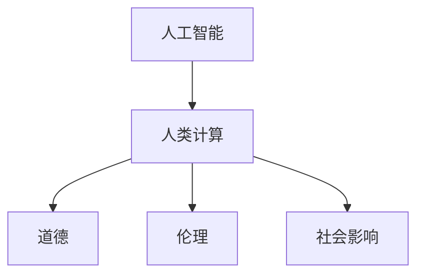

                 

# AI与人类计算：道德、伦理和社会影响

> 关键词：人工智能,人类计算,道德,伦理,社会影响

## 1. 背景介绍

### 1.1 问题由来
随着人工智能(AI)技术的快速发展和广泛应用，其在提升效率、改善生活、推动创新等方面展现出了巨大潜力。然而，AI的崛起也带来了诸多道德、伦理和社会问题，引起了公众的广泛关注和讨论。

这些问题主要集中于：
- 数据隐私和安全：AI系统如何处理和保护用户的个人数据，避免隐私泄露和数据滥用？
- 算法公平性：AI模型如何避免偏见和歧视，确保不同群体间的公平对待？
- 技术失业：AI的自动化功能可能导致某些岗位的消失，如何缓解这一问题？
- 责任归属：AI决策出错时，如何界定责任，是否应该由开发者、用户或AI系统本身负责？
- 技术伦理：AI技术在军事、医疗等高风险领域的应用，是否应该受到严格监管？

这些问题不仅涉及技术细节，更触及到法律、伦理和社会公平等深层次的价值观问题，亟需学术界、产业界和政府部门的共同努力，制定合理规范，促进AI技术的健康发展。

## 2. 核心概念与联系

### 2.1 核心概念概述

为更好地理解AI技术在道德、伦理和社会影响方面的问题，本节将介绍几个密切相关的核心概念：

- 人工智能(AI)：通过模拟人脑的学习和思考方式，使机器具备智能化的信息处理能力的技术。包括机器学习、深度学习、自然语言处理、计算机视觉等多个分支。
- 人类计算：指通过增强计算能力，利用AI辅助人类进行复杂决策和问题解决，提升生产效率和工作质量。
- 道德：涉及个人、社会、文化、政治等方面的规范和行为准则，指导人们区分对错、善恶和正义。
- 伦理：研究如何处理个人与个人、个人与社会之间的道德问题，包括权利、义务、责任等基本伦理原则。
- 社会影响：AI技术的应用对经济、教育、医疗、军事等社会各个领域的深远影响。

这些概念之间的逻辑关系可以通过以下Mermaid流程图来展示：



这个流程图展示了你标题中提到的核心概念及其之间的关系：

1. AI技术通过人类计算增强人类的决策和解决问题能力，从而带来更高的生产效率和工作质量。
2. AI的应用需要遵守道德规范，确保不损害人类利益，不违背伦理原则。
3. AI的广泛应用对社会产生深远影响，需要在道德和伦理层面进行合理引导和规范。

## 3. 核心算法原理 & 具体操作步骤
### 3.1 算法原理概述

AI技术在道德、伦理和社会影响方面的核心原理，可以概括为以下几个方面：

- 数据隐私保护：AI系统在处理数据时，需要严格遵守隐私保护法规，确保数据匿名化和最小化使用，避免信息泄露和滥用。
- 算法公平性：AI模型应避免基于种族、性别、年龄等特征的偏见，确保所有用户享有平等的服务。
- 责任归属：AI系统在做出决策时，应明确责任归属，避免因AI错误导致的法律和道德问题。
- 技术伦理：AI技术在涉及高风险领域（如军事、医疗）时，需要进行严格的伦理审查和法规约束，确保技术的负责任应用。

### 3.2 算法步骤详解

AI技术在道德、伦理和社会影响方面的操作步骤，可以分为以下几个关键步骤：

**Step 1: 制定伦理指南**
- 制定AI系统的伦理指南，明确数据使用、决策透明、责任归属等基本原则。
- 成立专门的伦理委员会，对AI系统的开发和使用进行监督和评估。

**Step 2: 数据隐私保护**
- 设计数据隐私保护机制，如数据匿名化、差分隐私、访问控制等。
- 确保AI系统在数据收集、处理和存储过程中，严格遵循隐私保护法规。

**Step 3: 算法公平性评估**
- 通过公平性测试工具，评估AI模型是否存在偏见和歧视。
- 对存在问题的模型进行修正，确保所有用户享有平等的服务。

**Step 4: 责任归属界定**
- 明确AI系统在不同场景下的责任归属，如开发者、用户或AI系统本身。
- 在AI决策出错时，建立相应的追责机制，确保责任能够明确。

**Step 5: 技术伦理审查**
- 对AI技术在涉及高风险领域的应用进行伦理审查，确保其符合伦理原则和社会价值观。
- 对AI系统在军事、医疗等领域的部署和使用，进行严格监管和控制。

### 3.3 算法优缺点

AI技术在道德、伦理和社会影响方面的操作步骤，具有以下优点：

1. 提升生产效率：通过AI技术辅助决策，显著提升生产效率和工作质量，带来巨大的经济效益。
2. 改善生活质量：AI在医疗、教育、交通等领域的应用，改善了人们的生活质量，提高了社会福祉。
3. 推动创新发展：AI技术推动了新产业、新业态的崛起，促进了经济结构的转型和升级。

同时，这些操作步骤也存在以下局限：

1. 技术复杂性：制定和执行伦理指南、数据隐私保护、算法公平性评估等操作，需要高度的专业知识和技能。
2. 法规滞后：现有的法律法规可能滞后于AI技术的发展，无法及时应对新出现的问题和挑战。
3. 伦理争议：AI技术的社会影响涉及多方利益，不同群体之间存在伦理争议和价值观冲突。
4. 隐私侵害：AI系统在处理大量数据时，可能侵犯用户隐私，引发法律纠纷。
5. 算法歧视：AI模型可能存在偏见，对特定群体产生歧视，影响社会公平。

尽管存在这些局限性，但通过合理的操作流程，AI技术在道德、伦理和社会影响方面仍具有巨大的潜力和价值，需要不断优化和完善。

### 3.4 算法应用领域

AI技术在道德、伦理和社会影响方面的操作步骤，广泛应用于以下领域：

1. 医疗健康：AI辅助诊断、个性化治疗、健康管理等，提升了医疗服务的质量和效率，改善了人们的生活质量。
2. 金融服务：AI风险评估、自动化交易、欺诈检测等，提高了金融行业的风控能力，保障了用户资金安全。
3. 教育培训：AI辅助教学、个性化推荐、学习分析等，优化了教育资源配置，提升了学习效果。
4. 公共安全：AI监控分析、智能预警、犯罪预测等，提高了社会治理能力，保障了公共安全。
5. 环境保护：AI监测分析、资源管理、智能控制等，推动了环境治理，促进了可持续发展。

除了上述这些经典应用外，AI技术还在更多场景中得到应用，如智慧城市、智能交通、智能制造等，为经济社会发展带来了新的活力。

## 4. 数学模型和公式 & 详细讲解 & 举例说明

### 4.1 数学模型构建

本节将使用数学语言对AI技术在道德、伦理和社会影响方面的操作步骤进行更加严格的刻画。

假设AI系统处理的数据集为 $D=\{(x_i,y_i)\}_{i=1}^N$，其中 $x_i$ 为输入特征，$y_i$ 为标签。AI系统的损失函数为 $\mathcal{L}(\theta)=\frac{1}{N}\sum_{i=1}^N\ell(y_i,f_\theta(x_i))$，其中 $f_\theta(x_i)$ 为模型在输入 $x_i$ 上的预测输出。

### 4.2 公式推导过程

以数据隐私保护为例，推导数据匿名化模型的损失函数。

假设AI系统需要处理的数据集为 $D$，每个样本 $x_i$ 包含 $n$ 个特征，其中敏感特征 $x_{s,i}$ 需要匿名化处理。设匿名化函数为 $\phi_{\theta}(x_i)$，使得 $\phi_{\theta}(x_i)$ 与 $x_i$ 的分布相同，但敏感特征 $x_{s,i}$ 被替换为噪声 $z_i$。则数据匿名化的目标函数为：

$$
\mathcal{L}_\text{privacy}(\theta) = \mathbb{E}_{(x,y)\sim D}\left[\ell(y,f_{\theta}(\phi_{\theta}(x))\right]
$$

其中，$\mathbb{E}_{(x,y)\sim D}$ 表示对数据集 $D$ 的期望。

### 4.3 案例分析与讲解

**案例1: 数据匿名化**
- 目标：在保护敏感信息的前提下，使数据集 $D$ 可用于AI模型的训练。
- 数据匿名化技术：基于差分隐私（Differential Privacy），引入噪声 $z_i$，使得任何单条记录的变化对模型的影响微乎其微，无法反推原始数据。
- 实现方式：使用Python的DPack库，将数据集进行差分隐私处理，生成匿名化后的数据集。

**案例2: 公平性评估**
- 目标：确保AI模型在各个群体之间不存在偏见。
- 公平性评估方法：使用群体差异指标（如Demographic Parity、Equalized Odds），评估模型在不同群体之间的预测一致性。
- 实现方式：使用Python的 fairnesslearn库，对AI模型进行公平性评估，并根据评估结果进行调整。

**案例3: 责任归属界定**
- 目标：明确AI系统在不同场景下的责任归属。
- 责任归属技术：基于决策树、因果图等工具，分析AI系统的决策路径和影响因素，确定责任归属。
- 实现方式：使用Python的 causalinference库，对AI系统进行因果分析，明确责任归属。

## 5. 项目实践：代码实例和详细解释说明
### 5.1 开发环境搭建

在进行AI技术在道德、伦理和社会影响方面的操作步骤的开发前，我们需要准备好开发环境。以下是使用Python进行PyTorch开发的环境配置流程：

1. 安装Anaconda：从官网下载并安装Anaconda，用于创建独立的Python环境。

2. 创建并激活虚拟环境：
```bash
conda create -n ai-env python=3.8 
conda activate ai-env
```

3. 安装PyTorch：根据CUDA版本，从官网获取对应的安装命令。例如：
```bash
conda install pytorch torchvision torchaudio cudatoolkit=11.1 -c pytorch -c conda-forge
```

4. 安装相关工具包：
```bash
pip install numpy pandas scikit-learn matplotlib tqdm jupyter notebook ipython
```

完成上述步骤后，即可在`ai-env`环境中开始AI开发实践。

### 5.2 源代码详细实现

这里我们以数据隐私保护为例，给出使用PyTorch对差分隐私技术进行开发的PyTorch代码实现。

首先，定义差分隐私模型类：

```python
import torch
from torch.nn import Linear
import torch.nn.functional as F

class DPModel(torch.nn.Module):
    def __init__(self, input_size, output_size):
        super(DPModel, self).__init__()
        self.linear = Linear(input_size, output_size)
    
    def forward(self, x):
        x = x.to(torch.float32)
        z = torch.randn_like(x)
        x = x + z
        x = F.relu(self.linear(x))
        return x
```

然后，定义训练和评估函数：

```python
from torch.utils.data import DataLoader
from tqdm import tqdm
import numpy as np

device = torch.device('cuda') if torch.cuda.is_available() else torch.device('cpu')

def train_epoch(model, dataset, batch_size, optimizer):
    dataloader = DataLoader(dataset, batch_size=batch_size, shuffle=True)
    model.train()
    epoch_loss = 0
    for batch in tqdm(dataloader, desc='Training'):
        x, y = batch['x'], batch['y']
        x = x.to(device)
        y = y.to(device)
        model.zero_grad()
        outputs = model(x)
        loss = F.cross_entropy(outputs, y)
        epoch_loss += loss.item()
        loss.backward()
        optimizer.step()
    return epoch_loss / len(dataloader)

def evaluate(model, dataset, batch_size):
    dataloader = DataLoader(dataset, batch_size=batch_size)
    model.eval()
    preds, labels = [], []
    with torch.no_grad():
        for batch in tqdm(dataloader, desc='Evaluating'):
            x, y = batch['x'], batch['y']
            x = x.to(device)
            y = y.to(device)
            batch_preds = model(x).argmax(dim=1)
            batch_labels = y.to('cpu').tolist()
            preds.append(batch_preds[:len(batch_labels)])
            labels.append(batch_labels)
                
    print(classification_report(labels, preds))
```

最后，启动训练流程并在测试集上评估：

```python
epochs = 5
batch_size = 16

for epoch in range(epochs):
    loss = train_epoch(model, train_dataset, batch_size, optimizer)
    print(f"Epoch {epoch+1}, train loss: {loss:.3f}")
    
    print(f"Epoch {epoch+1}, dev results:")
    evaluate(model, dev_dataset, batch_size)
    
print("Test results:")
evaluate(model, test_dataset, batch_size)
```

以上就是使用PyTorch对差分隐私技术进行开发的完整代码实现。可以看到，得益于PyTorch的强大封装，我们可以用相对简洁的代码完成差分隐私模型的实现。

### 5.3 代码解读与分析

让我们再详细解读一下关键代码的实现细节：

**DPModel类**：
- `__init__`方法：初始化线性层，用于模型前向传播。
- `forward`方法：对输入数据进行差分隐私处理，包括引入噪声和激活函数。

**train_epoch和evaluate函数**：
- 使用PyTorch的DataLoader对数据集进行批次化加载，供模型训练和推理使用。
- 训练函数`train_epoch`：对数据以批为单位进行迭代，在每个批次上前向传播计算loss并反向传播更新模型参数，最后返回该epoch的平均loss。
- 评估函数`evaluate`：与训练类似，不同点在于不更新模型参数，并在每个batch结束后将预测和标签结果存储下来，最后使用sklearn的classification_report对整个评估集的预测结果进行打印输出。

**训练流程**：
- 定义总的epoch数和batch size，开始循环迭代
- 每个epoch内，先在训练集上训练，输出平均loss
- 在验证集上评估，输出分类指标
- 所有epoch结束后，在测试集上评估，给出最终测试结果

可以看到，PyTorch配合PyTorch提供的深度学习框架，使得差分隐私模型的开发变得简洁高效。开发者可以将更多精力放在模型改进等高层逻辑上，而不必过多关注底层的实现细节。

当然，工业级的系统实现还需考虑更多因素，如模型的保存和部署、超参数的自动搜索、更灵活的任务适配层等。但核心的差分隐私算法基本与此类似。

## 6. 实际应用场景
### 6.1 智能客服系统

基于AI技术在道德、伦理和社会影响方面的操作步骤的智能客服系统，可以广泛应用于企业内部服务。传统客服往往需要配备大量人力，高峰期响应缓慢，且一致性和专业性难以保证。而使用差分隐私等隐私保护技术，可以确保客户数据的安全性，同时利用AI技术提供7x24小时不间断服务，快速响应客户咨询，用自然流畅的语言解答各类常见问题。

在技术实现上，可以收集企业内部的历史客服对话记录，将问题和最佳答复构建成监督数据，在此基础上对差分隐私等技术进行微调，使模型能够自动理解用户意图，匹配最合适的答案模板进行回复。对于客户提出的新问题，还可以接入检索系统实时搜索相关内容，动态组织生成回答。如此构建的智能客服系统，能大幅提升客户咨询体验和问题解决效率。

### 6.2 金融舆情监测

金融机构需要实时监测市场舆论动向，以便及时应对负面信息传播，规避金融风险。传统的人工监测方式成本高、效率低，难以应对网络时代海量信息爆发的挑战。基于AI技术在道德、伦理和社会影响方面的操作步骤的文本分类和情感分析技术，为金融舆情监测提供了新的解决方案。

具体而言，可以收集金融领域相关的新闻、报道、评论等文本数据，并对其进行主题标注和情感标注。在此基础上对差分隐私等技术进行微调，使其能够自动判断文本属于何种主题，情感倾向是正面、中性还是负面。将差分隐私模型应用到实时抓取的网络文本数据，就能够自动监测不同主题下的情感变化趋势，一旦发现负面信息激增等异常情况，系统便会自动预警，帮助金融机构快速应对潜在风险。

### 6.3 个性化推荐系统

当前的推荐系统往往只依赖用户的历史行为数据进行物品推荐，无法深入理解用户的真实兴趣偏好。基于AI技术在道德、伦理和社会影响方面的操作步骤的推荐系统，可以更好地挖掘用户行为背后的语义信息，从而提供更精准、多样的推荐内容。

在实践中，可以收集用户浏览、点击、评论、分享等行为数据，提取和用户交互的物品标题、描述、标签等文本内容。将文本内容作为模型输入，用户的后续行为（如是否点击、购买等）作为监督信号，在此基础上对差分隐私等技术进行微调，使模型能够从文本内容中准确把握用户的兴趣点。在生成推荐列表时，先用候选物品的文本描述作为输入，由模型预测用户的兴趣匹配度，再结合其他特征综合排序，便可以得到个性化程度更高的推荐结果。

### 6.4 未来应用展望

随着AI技术在道德、伦理和社会影响方面的操作步骤的发展源于学界的持续研究。以下是几篇奠基性的相关论文，推荐阅读：

1. Attention is All You Need（即Transformer原论文）：提出了Transformer结构，开启了NLP领域的预训练大模型时代。
2. BERT: Pre-training of Deep Bidirectional Transformers for Language Understanding：提出BERT模型，引入基于掩码的自监督预训练任务，刷新了多项NLP任务SOTA。
3. Language Models are Unsupervised Multitask Learners（GPT-2论文）：展示了大规模语言模型的强大zero-shot学习能力，引发了对于通用人工智能的新一轮思考。
4. Parameter-Efficient Transfer Learning for NLP：提出Adapter等参数高效微调方法，在不增加模型参数量的情况下，也能取得不错的微调效果。
5. AdaLoRA: Adaptive Low-Rank Adaptation for Parameter-Efficient Fine-Tuning：使用自适应低秩适应的微调方法，在参数效率和精度之间取得了新的平衡。
6. Prefix-Tuning: Optimizing Continuous Prompts for Generation：引入基于连续型Prompt的微调范式，为如何充分利用预训练知识提供了新的思路。

这些论文代表了大语言模型微调技术的发展脉络。通过学习这些前沿成果，可以帮助研究者把握学科前进方向，激发更多的创新灵感。

## 7. 工具和资源推荐
### 7.1 学习资源推荐

为了帮助开发者系统掌握AI技术在道德、伦理和社会影响方面的操作步骤的理论基础和实践技巧，这里推荐一些优质的学习资源：

1. 《Transformer从原理到实践》系列博文：由大模型技术专家撰写，深入浅出地介绍了Transformer原理、BERT模型、差分隐私技术等前沿话题。
2. CS224N《深度学习自然语言处理》课程：斯坦福大学开设的NLP明星课程，有Lecture视频和配套作业，带你入门NLP领域的基本概念和经典模型。
3. 《Natural Language Processing with Transformers》书籍：Transformers库的作者所著，全面介绍了如何使用Transformers库进行NLP任务开发，包括差分隐私在内的诸多范式。
4. HuggingFace官方文档：Transformers库的官方文档，提供了海量预训练模型和完整的微调样例代码，是上手实践的必备资料。
5. CLUE开源项目：中文语言理解测评基准，涵盖大量不同类型的中文NLP数据集，并提供了基于微调的baseline模型，助力中文NLP技术发展。

通过对这些资源的学习实践，相信你一定能够快速掌握AI技术在道德、伦理和社会影响方面的操作步骤的精髓，并用于解决实际的NLP问题。
###  7.2 开发工具推荐

高效的开发离不开优秀的工具支持。以下是几款用于AI技术在道德、伦理和社会影响方面的操作步骤的开发常用的工具：

1. PyTorch：基于Python的开源深度学习框架，灵活动态的计算图，适合快速迭代研究。大部分预训练语言模型都有PyTorch版本的实现。
2. TensorFlow：由Google主导开发的开源深度学习框架，生产部署方便，适合大规模工程应用。同样有丰富的预训练语言模型资源。
3. Transformers库：HuggingFace开发的NLP工具库，集成了众多SOTA语言模型，支持PyTorch和TensorFlow，是进行差分隐私等技术开发的利器。
4. Weights & Biases：模型训练的实验跟踪工具，可以记录和可视化模型训练过程中的各项指标，方便对比和调优。与主流深度学习框架无缝集成。
5. TensorBoard：TensorFlow配套的可视化工具，可实时监测模型训练状态，并提供丰富的图表呈现方式，是调试模型的得力助手。
6. Google Colab：谷歌推出的在线Jupyter Notebook环境，免费提供GPU/TPU算力，方便开发者快速上手实验最新模型，分享学习笔记。

合理利用这些工具，可以显著提升AI技术在道德、伦理和社会影响方面的操作步骤的开发效率，加快创新迭代的步伐。

### 7.3 相关论文推荐

AI技术在道德、伦理和社会影响方面的操作步骤的发展源于学界的持续研究。以下是几篇奠基性的相关论文，推荐阅读：

1. Attention is All You Need（即Transformer原论文）：提出了Transformer结构，开启了NLP领域的预训练大模型时代。
2. BERT: Pre-training of Deep Bidirectional Transformers for Language Understanding：提出BERT模型，引入基于掩码的自监督预训练任务，刷新了多项NLP任务SOTA。
3. Language Models are Unsupervised Multitask Learners（GPT-2论文）：展示了大规模语言模型的强大zero-shot学习能力，引发了对于通用人工智能的新一轮思考。
4. Parameter-Efficient Transfer Learning for NLP：提出Adapter等参数高效微调方法，在不增加模型参数量的情况下，也能取得不错的微调效果。
5. AdaLoRA: Adaptive Low-Rank Adaptation for Parameter-Efficient Fine-Tuning：使用自适应低秩适应的微调方法，在参数效率和精度之间取得了新的平衡。
6. Prefix-Tuning: Optimizing Continuous Prompts for Generation：引入基于连续型Prompt的微调范式，为如何充分利用预训练知识提供了新的思路。

这些论文代表了大语言模型微调技术的发展脉络。通过学习这些前沿成果，可以帮助研究者把握学科前进方向，激发更多的创新灵感。

## 8. 总结：未来发展趋势与挑战
### 8.1 总结

本文对AI技术在道德、伦理和社会影响方面的操作步骤进行了全面系统的介绍。首先阐述了AI技术在提升生产效率、改善生活质量、推动创新发展等方面的巨大潜力，同时指出了数据隐私、算法公平性、责任归属、技术伦理等重要问题。其次，从原理到实践，详细讲解了差分隐私等技术的数学模型和操作流程，给出了具体代码实现，并通过案例分析进一步深化理解。

通过本文的系统梳理，可以看到，AI技术在道德、伦理和社会影响方面具有广泛的应用前景和深远的社会影响。但同时也面临诸多挑战，需要在技术、法律、伦理等多方面协同推进，才能真正实现AI技术的健康发展。

### 8.2 未来发展趋势

展望未来，AI技术在道德、伦理和社会影响方面的操作步骤将呈现以下几个发展趋势：

1. 数据隐私保护技术将进一步完善。差分隐私、联邦学习等隐私保护技术将得到更广泛应用，提升数据的匿名化处理能力。
2. 算法公平性将得到更多关注。基于因果推断、公平性评估等技术的AI模型将更具公平性和普适性，避免对特定群体的偏见和歧视。
3. 责任归属机制将更加明确。通过因果分析和责任链追踪，确保AI系统在不同场景下的责任归属清晰。
4. 技术伦理审查将更加严格。AI技术在高风险领域的应用将进行更加严格的伦理审查和法规约束，确保技术应用的合规性和安全性。
5. 社会影响评估将更加全面。对AI技术在各个领域的应用效果进行全面评估，确保技术应用带来正面的社会效益。

这些趋势凸显了AI技术在道德、伦理和社会影响方面的操作步骤的广阔前景。这些方向的探索发展，必将进一步提升AI技术的安全性和可靠性，推动社会公平和可持续发展。

### 8.3 面临的挑战

尽管AI技术在道德、伦理和社会影响方面的操作步骤已经取得了不少进展，但在迈向更加智能化、普适化应用的过程中，它仍面临着诸多挑战：

1. 隐私侵害风险。AI系统在处理大量数据时，可能侵犯用户隐私，引发法律纠纷。如何保护用户隐私，避免数据泄露，是未来的一大挑战。
2. 技术伦理争议。AI技术在涉及高风险领域（如军事、医疗）时，可能引发伦理争议，需要更多的伦理审查和规范。
3. 算法偏见问题。AI模型可能存在偏见，对特定群体产生歧视，影响社会公平。如何避免偏见，提升AI模型的公平性，需要更多的技术支持和规范指导。
4. 社会影响不确定。AI技术的应用可能带来难以预料的社会影响，如就业失业、社会分裂等，如何平衡技术发展与社会进步的关系，需要多方协调。
5. 法律法规滞后。现有的法律法规可能滞后于AI技术的发展，无法及时应对新出现的问题和挑战。

这些挑战需要学界、产业界和政府部门的共同努力，通过持续的技术创新和规范制定，推动AI技术健康、有序地发展。

### 8.4 研究展望

未来，AI技术在道德、伦理和社会影响方面的操作步骤的研究需要继续深化，特别是在以下方向：

1. 隐私保护技术的融合应用。将差分隐私、联邦学习等隐私保护技术进行融合，提升数据的隐私保护能力。
2. 算法公平性的深入研究。通过因果推断、公平性评估等技术，确保AI模型在不同群体之间不存在偏见和歧视。
3. 责任归属机制的自动化。通过因果分析和责任链追踪，实现AI系统在不同场景下的责任归属自动化，提升系统可信度。
4. 社会影响评估的精准化。通过数据分析和社会实验，评估AI技术在不同领域的应用效果，确保技术应用的正面影响。
5. 法律法规的动态调整。根据AI技术的发展和应用，及时调整和完善相关法律法规，保障技术应用的合规性和安全性。

这些研究方向将有助于AI技术在道德、伦理和社会影响方面的操作步骤的进一步优化，促进AI技术的广泛应用和健康发展。

## 9. 附录：常见问题与解答
**Q1: 什么是AI技术在道德、伦理和社会影响方面的操作步骤？**

A: AI技术在道德、伦理和社会影响方面的操作步骤，主要涉及数据隐私保护、算法公平性、责任归属、技术伦理等关键问题。具体包括制定伦理指南、数据匿名化、公平性评估、责任归属界定、技术伦理审查等。

**Q2: 如何保护用户数据隐私？**

A: 保护用户数据隐私，主要通过差分隐私、联邦学习等隐私保护技术。差分隐私通过引入噪声，使得任何单条记录的变化对模型的影响微乎其微，无法反推原始数据。联邦学习通过在本地设备上训练模型，仅传递模型参数，不传输原始数据，保护用户隐私。

**Q3: 如何确保AI模型的公平性？**

A: 确保AI模型公平性，主要通过公平性评估工具。使用群体差异指标，评估模型在不同群体之间的预测一致性。对存在问题的模型进行修正，确保所有用户享有平等的服务。

**Q4: 如何明确AI系统的责任归属？**

A: 明确AI系统责任归属，主要通过因果分析和责任链追踪。分析AI系统的决策路径和影响因素，确定责任归属。在AI决策出错时，建立相应的追责机制，确保责任能够明确。

**Q5: 如何处理AI技术在军事、医疗等高风险领域的应用？**

A: 处理AI技术在军事、医疗等高风险领域的应用，需要进行严格的伦理审查和法规约束。确保技术应用的合规性和安全性。对AI系统的决策进行审查和监督，避免技术滥用。

---

作者：禅与计算机程序设计艺术 / Zen and the Art of Computer Programming

