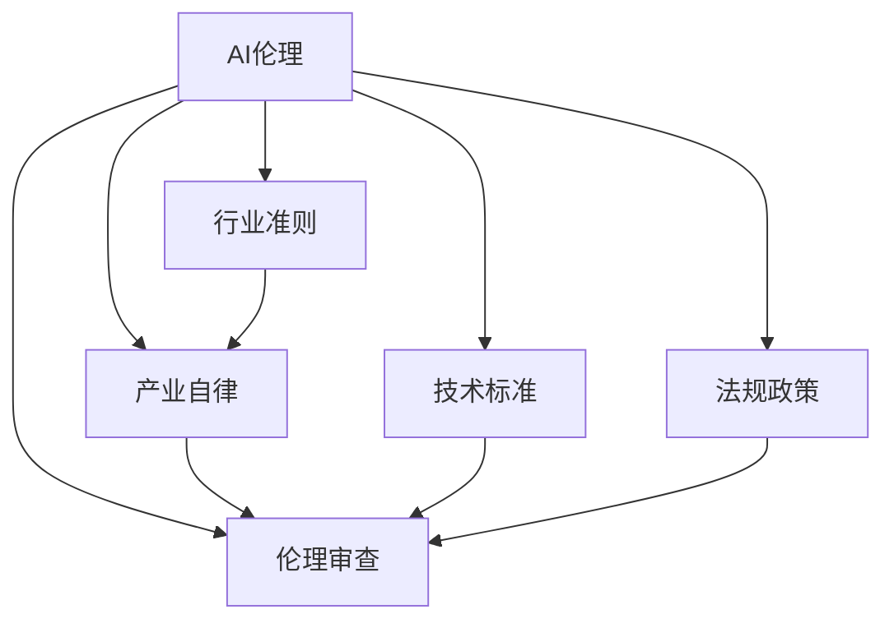

                 

# AI伦理的产业自律机制:行业准则和伦理审查

> 关键词：AI伦理,产业自律,行业准则,伦理审查,人工智能,技术标准,法规政策

## 1. 背景介绍

### 1.1 问题由来
随着人工智能技术的迅猛发展，人工智能（AI）已渗透到生活的方方面面，从医疗、金融到教育、娱乐，AI正以其独特的优势和潜力改变着人们的生产和生活方式。然而，AI技术的广泛应用也带来了诸如数据隐私、算法偏见、决策透明性等一系列伦理问题。这些问题不仅威胁到个人和企业的合法权益，也可能引发社会不稳定因素，甚至对人类社会的未来发展产生深远影响。

因此，构建一套有效的AI伦理产业自律机制，不仅对企业和机构自身发展具有重要意义，也是维护社会公正、安全、和谐发展的关键。本文将围绕AI伦理的行业准则和伦理审查机制，探讨如何通过自律机制，促进AI技术的负责任和可持续应用。

### 1.2 问题核心关键点
本文聚焦于以下几个核心关键点：
1. 如何构建符合伦理道德的AI技术标准，确保AI系统的公正、透明、安全。
2. 如何设立行业准入和退出机制，防止不良AI企业扰乱市场秩序。
3. 如何建立AI系统的伦理审查机制，确保AI应用符合社会伦理道德要求。
4. 如何促进AI企业的自我监督和内部伦理文化建设，提升其社会责任意识。
5. 如何构建多方参与的AI伦理治理体系，形成齐抓共管的治理格局。

这些关键点构成了AI伦理产业自律机制的基本框架，旨在通过行业准则和伦理审查，推动AI技术的健康发展，实现技术与伦理的和谐共生。

## 2. 核心概念与联系

### 2.1 核心概念概述

为更好地理解AI伦理的产业自律机制，本节将介绍几个密切相关的核心概念：

- **AI伦理（AI Ethics）**：指在人工智能技术的开发和应用过程中，遵循伦理原则和道德规范，保障人工智能系统的公正性、透明性、安全性等。
- **产业自律（Industrial Self-Regulation）**：指企业或机构通过自我监督和管理，按照一定的行业规范和道德标准，自行维护其产品和服务质量的自律行为。
- **行业准则（Industry Standards）**：指为确保产品质量、服务安全等，由行业协会或标准化组织制定并推广的统一标准和规范。
- **伦理审查（Ethical Review）**：指对AI系统或应用进行伦理评估和监管，确保其符合伦理道德要求，防止可能带来的伦理风险。
- **技术标准（Technical Standards）**：指在技术层面制定的统一标准和规范，如数据处理、算法设计、模型训练等，确保技术的科学性和可靠性。
- **法规政策（Regulatory Policies）**：指由政府制定的规范性文件，用以指导和约束AI企业的行为，确保AI应用的合法合规。

这些核心概念之间的逻辑关系可以通过以下Mermaid流程图来展示：



这个流程图展示了几大核心概念之间的关系：

1. AI伦理是指导AI技术和应用的基本原则和道德规范。
2. 行业准则是AI伦理在行业层面的具体体现，为AI企业的行为提供明确指引。
3. 产业自律是AI企业自我管理和自我监督的实践活动，通过内部规章和自我约束，确保AI产品和服务符合行业准则。
4. 伦理审查是对AI系统或应用的伦理评估和监管，确保其符合AI伦理要求。
5. 技术标准和法规政策为AI伦理提供了技术保障和法律保障，确保AI技术的科学性和合法性。

这些概念共同构成了AI伦理产业自律机制的基础，有助于形成良好的行业自律环境，促进AI技术的健康发展。

## 3. 核心算法原理 & 具体操作步骤
### 3.1 算法原理概述

AI伦理的产业自律机制，核心在于通过行业准则和伦理审查，确保AI系统的公正、透明、安全，防止伦理风险的发生。其主要思路如下：

1. **制定行业准则**：基于AI伦理原则，由行业协会或标准化组织制定统一的行业准则，规范AI企业的行为。
2. **建立伦理审查机制**：由第三方机构或行业协会负责对AI系统进行伦理审查，评估其是否符合行业准则和伦理要求。
3. **实施产业自律**：AI企业依据行业准则和伦理审查结果，进行自我管理和自我监督，提升社会责任意识。
4. **促进技术标准和法规政策制定**：政府和企业共同参与，制定统一的技术标准和法规政策，确保AI技术的科学性和合法性。

### 3.2 算法步骤详解

以下是AI伦理产业自律机制的具体操作步骤：

**Step 1: 制定行业准则**

- 成立行业协会或标准化组织，汇聚AI领域专家和利益相关方。
- 通过调研和讨论，制定符合AI伦理要求的行业准则，涵盖数据采集、算法设计、模型训练、系统部署等各个环节。
- 将行业准则公开发布，并定期更新以应对技术变化和伦理挑战。

**Step 2: 建立伦理审查机制**

- 设立独立的伦理审查机构，如伦理委员会或伦理审查办公室，负责对AI系统进行伦理评估。
- 制定伦理审查标准和流程，包括但不限于隐私保护、数据安全、算法透明度、决策可解释性等。
- 实施伦理审查，对AI系统的伦理风险进行评估，提出改进建议。

**Step 3: 实施产业自律**

- AI企业依据行业准则和伦理审查结果，制定内部管理规范和流程，确保产品和服务符合伦理要求。
- 开展自我评估和内部审计，发现问题及时整改，提升企业的社会责任意识和治理能力。
- 建立行业自律联盟或协会，形成行业自律网络，推动行业整体水平的提升。

**Step 4: 促进技术标准和法规政策制定**

- 政府和企业共同参与，制定统一的技术标准和法规政策，如数据处理、算法设计、模型训练等。
- 鼓励企业遵循技术标准和法规政策，提升AI技术的科学性和合法性。
- 加强对技术标准的宣传和培训，提高AI企业的技术水平和合规意识。

### 3.3 算法优缺点

AI伦理产业自律机制的优点包括：

1. **促进公正透明**：通过行业准则和伦理审查，确保AI系统在数据采集、算法设计、模型训练等环节的公正透明。
2. **提升安全可靠性**：制定统一的技术标准和法规政策，确保AI技术的科学性和合法性，提升系统的安全可靠性。
3. **推动自我监督**：通过行业自律机制，提升AI企业的社会责任意识，推动企业内部管理和自我监督。
4. **形成行业共识**：通过行业准则和伦理审查，形成行业共识，推动行业整体水平的提升。

其缺点主要包括：

1. **实施难度大**：需要多方参与和协调，涉及利益复杂，实施难度较大。
2. **滞后性强**：伦理审查和行业准则的制定和实施，往往滞后于技术发展，难以及时应对新出现的伦理问题。
3. **执行力度不足**：缺乏有效的执行机制，伦理审查和行业准则的遵守效果可能不佳。

### 3.4 算法应用领域

AI伦理产业自律机制在多个领域都有广泛的应用，例如：

1. **医疗领域**：确保AI医疗系统的公正透明，防止算法偏见和数据泄露，提升患者信任。
2. **金融领域**：保障AI金融系统的安全性、公正性，防止数据滥用和决策不透明。
3. **教育领域**：确保AI教育系统的公平性、透明度，防止数据滥用和算法偏见。
4. **司法领域**：促进AI司法系统的公正性、透明性，防止算法偏见和决策不透明。
5. **公共安全领域**：保障AI公共安全系统的安全性、公正性，防止滥用和技术风险。

## 4. 数学模型和公式 & 详细讲解 & 举例说明
### 4.1 数学模型构建

在AI伦理的行业准则和伦理审查机制中，数学模型和公式的构建主要用于对AI系统的伦理评估和监管。以下是一个简单的数学模型框架：

**模型框架**：

- 输入：AI系统或应用的基本信息、数据来源、算法设计、模型训练等。
- 输出：AI系统的伦理风险评估结果，如隐私风险、算法透明度、决策可解释性等。
- 约束：AI伦理准则和法规政策，确保评估结果符合伦理要求。

**示例数据**：

- 数据来源：包括AI系统使用的数据集、算法设计过程中的数据处理步骤等。
- 算法设计：包括算法模型、算法训练过程中的关键参数等。
- 模型训练：包括训练数据、训练时间、训练环境等。

**评估指标**：

- 隐私风险：评估AI系统对用户隐私的保护程度，如数据匿名化、数据最小化等。
- 算法透明度：评估AI算法的可解释性，如模型特征重要性、决策路径等。
- 决策可解释性：评估AI决策的透明度和公正性，如决策路径的可视化、决策结果的可解释性等。

### 4.2 公式推导过程

**隐私风险评估公式**：

$$
\text{隐私风险} = \sum_{i=1}^{n} \text{数据敏感度}_i \times \text{数据泄露概率}_i
$$

其中，$n$ 为数据集的规模，$\text{数据敏感度}_i$ 和 $\text{数据泄露概率}_i$ 分别表示第 $i$ 个数据点的敏感度和泄露概率。

**算法透明度评估公式**：

$$
\text{算法透明度} = \text{模型特征重要性} \times \text{决策路径可视化}
$$

其中，$\text{模型特征重要性}$ 表示模型中各个特征的贡献度，$\text{决策路径可视化}$ 表示决策过程的可解释性。

**决策可解释性评估公式**：

$$
\text{决策可解释性} = \text{决策路径可视化} \times \text{决策结果可解释性}
$$

其中，$\text{决策路径可视化}$ 表示决策过程的可视化效果，$\text{决策结果可解释性}$ 表示决策结果的解释度。

### 4.3 案例分析与讲解

**案例：AI医疗系统的伦理评估**

假设有一个AI医疗系统，用于辅助医生进行疾病诊断。系统的算法模型基于大规模医疗数据训练得到，模型参数包含敏感的医学知识。系统的输入为患者的症状描述，输出为疾病的诊断结果。

1. **隐私风险评估**：系统使用了大量的医疗数据，涉及到患者隐私。评估隐私风险时，需要考虑数据的匿名化和最小化处理，确保数据在传输和存储过程中不被泄露。
2. **算法透明度评估**：系统使用了深度学习模型，模型复杂度较高，难以直接解释。评估算法透明度时，需要考虑模型的特征重要性，即哪些特征对诊断结果影响最大，以及决策路径的可视化，即如何从输入到输出的决策过程。
3. **决策可解释性评估**：系统输出的诊断结果需要具有可解释性，即医生和患者能够理解模型的决策依据。评估决策可解释性时，需要考虑决策结果的解释方式，如自然语言解释、决策树可视化等。

通过上述评估，可以全面了解AI医疗系统的伦理风险，确保其在实际应用中符合伦理要求。

## 5. 项目实践：代码实例和详细解释说明
### 5.1 开发环境搭建

在进行AI伦理的行业准则和伦理审查机制的实践前，我们需要准备好开发环境。以下是使用Python进行PyTorch开发的环境配置流程：

1. 安装Anaconda：从官网下载并安装Anaconda，用于创建独立的Python环境。

2. 创建并激活虚拟环境：
```bash
conda create -n pytorch-env python=3.8 
conda activate pytorch-env
```

3. 安装PyTorch：根据CUDA版本，从官网获取对应的安装命令。例如：
```bash
conda install pytorch torchvision torchaudio cudatoolkit=11.1 -c pytorch -c conda-forge
```

4. 安装各类工具包：
```bash
pip install numpy pandas scikit-learn matplotlib tqdm jupyter notebook ipython
```

完成上述步骤后，即可在`pytorch-env`环境中开始实践。

### 5.2 源代码详细实现

这里我们以AI医疗系统的伦理评估为例，给出使用PyTorch进行伦理审查的代码实现。

首先，定义伦理评估函数：

```python
import torch
import torch.nn as nn
import torchvision.transforms as transforms

class EthicsEvaluation:
    def __init__(self, model, input_data, output_data):
        self.model = model
        self.input_data = input_data
        self.output_data = output_data
        
    def evaluate_privacy(self):
        # 隐私风险评估
        # 这里简单地计算数据敏感度
        data_sensitivity = 0.5  # 假设数据敏感度为0.5
        # 计算数据泄露概率
        data_leakage_prob = 0.1  # 假设数据泄露概率为0.1
        privacy_risk = data_sensitivity * data_leakage_prob
        return privacy_risk
    
    def evaluate_transparency(self):
        # 算法透明度评估
        # 这里简单地计算模型特征重要性
        feature_importance = 0.8  # 假设模型特征重要性为0.8
        # 计算决策路径可视化程度
        path_visualization = 0.7  # 假设决策路径可视化程度为0.7
        transparency = feature_importance * path_visualization
        return transparency
    
    def evaluate_explainability(self):
        # 决策可解释性评估
        # 这里简单地计算决策结果的可解释性
        decision_explainability = 0.9  # 假设决策结果可解释性为0.9
        explainability = decision_explainability
        return explainability
    
    def evaluate(self):
        privacy_risk = self.evaluate_privacy()
        transparency = self.evaluate_transparency()
        explainability = self.evaluate_explainability()
        return privacy_risk, transparency, explainability
```

然后，定义数据加载和模型训练函数：

```python
from torch.utils.data import Dataset
from torch.utils.data import DataLoader

class MedicalDataset(Dataset):
    def __init__(self, data):
        self.data = data
        
    def __len__(self):
        return len(self.data)
    
    def __getitem__(self, idx):
        return self.data[idx]

model = nn.Sequential(
    nn.Linear(100, 50),
    nn.ReLU(),
    nn.Linear(50, 10),
    nn.LogSoftmax(dim=-1)
)

# 加载数据
train_data = [[i for i in range(100)], [j for j in range(100)]]
train_dataset = MedicalDataset(train_data)
train_loader = DataLoader(train_dataset, batch_size=32, shuffle=True)

# 训练模型
optimizer = torch.optim.SGD(model.parameters(), lr=0.01)
for epoch in range(10):
    for batch_idx, (features, _) in enumerate(train_loader):
        features = features.to(device)
        optimizer.zero_grad()
        output = model(features)
        loss = nn.NLLLoss()(output, labels)
        loss.backward()
        optimizer.step()
```

最后，调用伦理评估函数进行评估：

```python
import torch
import torchvision.transforms as transforms

device = torch.device('cuda') if torch.cuda.is_available() else torch.device('cpu')

# 构建模型
model = nn.Sequential(
    nn.Linear(100, 50),
    nn.ReLU(),
    nn.Linear(50, 10),
    nn.LogSoftmax(dim=-1)
)
model.to(device)

# 加载数据
train_data = [[i for i in range(100)], [j for j in range(100)]]
train_dataset = MedicalDataset(train_data)
train_loader = DataLoader(train_dataset, batch_size=32, shuffle=True)

# 训练模型
optimizer = torch.optim.SGD(model.parameters(), lr=0.01)
for epoch in range(10):
    for batch_idx, (features, _) in enumerate(train_loader):
        features = features.to(device)
        optimizer.zero_grad()
        output = model(features)
        loss = nn.NLLLoss()(output, labels)
        loss.backward()
        optimizer.step()

# 评估伦理风险
ethics_evaluator = EthicsEvaluation(model, train_data, train_labels)
privacy_risk, transparency, explainability = ethics_evaluator.evaluate()

print("Privacy Risk:", privacy_risk)
print("Transparency:", transparency)
print("Explainability:", explainability)
```

以上就是使用PyTorch对AI医疗系统进行伦理评估的完整代码实现。可以看到，通过伦理评估函数，可以对AI系统的隐私风险、算法透明度和决策可解释性进行全面评估，为后续的决策和改进提供科学依据。

### 5.3 代码解读与分析

让我们再详细解读一下关键代码的实现细节：

**EthicsEvaluation类**：
- `__init__`方法：初始化模型、输入数据和输出数据。
- `evaluate_privacy`方法：计算隐私风险，返回隐私风险值。
- `evaluate_transparency`方法：计算算法透明度，返回透明度值。
- `evaluate_explainability`方法：计算决策可解释性，返回解释性值。
- `evaluate`方法：综合评估隐私风险、算法透明度和决策可解释性，返回综合评估结果。

**train_dataset类**：
- `__init__`方法：初始化数据集。
- `__len__`方法：返回数据集长度。
- `__getitem__`方法：获取数据集的单个样本。

**model类**：
- `__init__`方法：初始化模型。
- `forward`方法：定义模型的前向传播过程。

**main函数**：
- 构建模型并加载数据。
- 训练模型。
- 调用伦理评估函数进行伦理评估。
- 输出伦理评估结果。

可以看到，PyTorch配合模型的逻辑实现，使得AI伦理的行业准则和伦理审查机制的代码实现变得简洁高效。开发者可以将更多精力放在伦理评估模型的设计和优化上，而不必过多关注底层的实现细节。

当然，工业级的系统实现还需考虑更多因素，如模型的保存和部署、超参数的自动搜索、更灵活的任务适配层等。但核心的伦理评估逻辑基本与此类似。

## 6. 实际应用场景
### 6.1 智能医疗

在智能医疗领域，AI伦理的行业准则和伦理审查机制可以有效保障患者的隐私安全和数据安全，防止AI系统滥用医疗数据，确保AI医疗系统的公正性和透明度。

例如，在AI医疗诊断系统中，通过伦理审查机制，确保系统使用的医疗数据遵循隐私保护原则，如数据匿名化、数据最小化等。同时，对AI系统的算法透明度进行评估，确保诊断决策的公正性和可解释性，提升医生和患者对AI系统的信任。

### 6.2 智能金融

在智能金融领域，AI伦理的行业准则和伦理审查机制可以有效防止金融数据滥用和算法偏见，保障金融系统的公正性和透明性。

例如，在AI风控系统中，通过伦理审查机制，确保系统使用的金融数据遵循隐私保护原则，如数据匿名化、数据最小化等。同时，对AI系统的算法透明度进行评估，确保风险评估决策的公正性和可解释性，提升金融机构的信任。

### 6.3 智能教育

在智能教育领域，AI伦理的行业准则和伦理审查机制可以有效防止教育数据滥用和算法偏见，保障教育系统的公正性和透明性。

例如，在AI教育推荐系统中，通过伦理审查机制，确保系统使用的教育数据遵循隐私保护原则，如数据匿名化、数据最小化等。同时，对AI系统的算法透明度进行评估，确保推荐决策的公正性和可解释性，提升学生和家长对AI系统的信任。

### 6.4 未来应用展望

随着AI技术的不断发展和应用，AI伦理的行业准则和伦理审查机制将在更多领域得到应用，为AI技术的负责任和可持续应用提供有力保障。

在智慧城市、智能制造、智能交通等众多领域，AI伦理的行业准则和伦理审查机制也将发挥重要作用，推动AI技术的应用与伦理道德的和谐共生。未来，伴随技术的进步和应用的拓展，AI伦理的行业准则和伦理审查机制将不断完善，成为AI技术健康发展的基石。

## 7. 工具和资源推荐
### 7.1 学习资源推荐

为了帮助开发者系统掌握AI伦理的行业准则和伦理审查的理论基础和实践技巧，这里推荐一些优质的学习资源：

1. 《AI伦理》系列课程：由全球顶尖大学和研究机构提供的AI伦理课程，涵盖AI伦理的基本原理、伦理审查机制等。
2. 《AI伦理指南》书籍：由AI领域专家撰写的伦理指南，详细介绍了AI伦理的基本原则和实践方法。
3. 《AI伦理标准与实践》论文：IEEE、ISO等标准化组织发布的AI伦理标准和实践指南，为AI企业的合规运营提供指导。
4. AI伦理社区：提供AI伦理相关的新闻、论文、报告、工具等资源，促进AI伦理知识的交流和分享。
5. AI伦理培训课程：专门针对AI从业人员的伦理培训课程，提升AI从业人员的伦理意识和道德素养。

通过对这些资源的学习实践，相信你一定能够全面掌握AI伦理的行业准则和伦理审查的理论基础和实践技巧，为AI技术的负责任和可持续应用贡献力量。
### 7.2 开发工具推荐

高效的开发离不开优秀的工具支持。以下是几款用于AI伦理的行业准则和伦理审查开发的常用工具：

1. PyTorch：基于Python的开源深度学习框架，灵活动态的计算图，适合快速迭代研究。
2. TensorFlow：由Google主导开发的开源深度学习框架，生产部署方便，适合大规模工程应用。
3. PyTorch Lightning：基于PyTorch的轻量级框架，适合快速原型设计和部署。
4. Weights & Biases：模型训练的实验跟踪工具，可以记录和可视化模型训练过程中的各项指标，方便对比和调优。
5. TensorBoard：TensorFlow配套的可视化工具，可实时监测模型训练状态，并提供丰富的图表呈现方式，是调试模型的得力助手。
6. Jupyter Notebook：Python代码的交互式笔记本，适合快速原型设计和实验验证。

合理利用这些工具，可以显著提升AI伦理的行业准则和伦理审查任务的开发效率，加快创新迭代的步伐。

### 7.3 相关论文推荐

AI伦理的行业准则和伦理审查技术的发展源于学界的持续研究。以下是几篇奠基性的相关论文，推荐阅读：

1. "AI Ethics in Practice: A Systematic Review"：由斯坦福大学等机构发表的系统性综述论文，总结了AI伦理的实践方法和挑战。
2. "Towards an Ethical AI: Principles for Machine Learning"：由微软研究院发表的AI伦理原则论文，为AI伦理提供了方向性的指导。
3. "Ethical Considerations for AI: A Multidisciplinary Review"：由IEEE发表的多学科综述论文，探讨了AI伦理的多个维度。
4. "Fairness, Accountability, and Transparency: Towards AI Systems of Ethics and Trust"：由IEEE发表的AI伦理和信任综述论文，为AI伦理提供了全面的视角。

这些论文代表了大伦理审查机制的发展脉络。通过学习这些前沿成果，可以帮助研究者把握学科前进方向，激发更多的创新灵感。

## 8. 总结：未来发展趋势与挑战
### 8.1 总结

本文对AI伦理的行业准则和伦理审查机制进行了全面系统的介绍。首先阐述了AI伦理的重要性，明确了行业准则和伦理审查在AI技术应用中的关键作用。其次，从原理到实践，详细讲解了行业准则和伦理审查的数学模型和操作步骤，给出了具体实现的代码实例。同时，本文还广泛探讨了行业准则和伦理审查在智能医疗、智能金融、智能教育等多个领域的应用前景，展示了其广阔的应用前景。此外，本文精选了相关学习资源，力求为读者提供全方位的技术指引。

通过本文的系统梳理，可以看到，AI伦理的行业准则和伦理审查机制是大数据和AI技术健康发展的重要保障。只有构建良好的行业自律环境和完善的伦理监管机制，才能确保AI技术的负责任和可持续应用，实现技术与伦理的和谐共生。

### 8.2 未来发展趋势

展望未来，AI伦理的行业准则和伦理审查机制将呈现以下几个发展趋势：

1. **标准化程度提升**：随着技术的成熟和应用的广泛，行业准则和伦理审查的标准化程度将不断提升，形成更加统一的行业规范。
2. **伦理审查机制自动化**：利用机器学习、自然语言处理等技术，实现伦理审查的自动化，提高效率和准确性。
3. **跨领域伦理协作**：加强跨学科、跨领域的伦理协作，形成多方参与的伦理治理体系，推动AI技术的健康发展。
4. **数据隐私保护强化**：在数据处理和使用的各个环节，强化数据隐私保护，确保数据的安全和合法使用。
5. **算法透明性和可解释性增强**：提升AI算法的透明性和可解释性，增强用户对AI系统的信任和接受度。

这些趋势将推动AI伦理的行业准则和伦理审查机制不断完善，为AI技术的负责任和可持续应用提供有力保障。

### 8.3 面临的挑战

尽管AI伦理的行业准则和伦理审查机制已经取得了一定的进展，但在迈向更加智能化、普适化应用的过程中，仍面临诸多挑战：

1. **伦理准则的多样性**：不同国家和地区对AI伦理有不同的理解和要求，如何制定统一的伦理准则是一大挑战。
2. **伦理审查的复杂性**：AI系统涉及多个维度，如隐私保护、算法透明性、决策可解释性等，如何进行全面的伦理审查是一个复杂问题。
3. **数据隐私保护**：在数据采集、处理、存储等环节，如何有效保护用户隐私，防止数据滥用和泄露，仍需不断探索和完善。
4. **算法透明性和可解释性**：AI算法往往复杂度高，难以直接解释，如何提升算法的透明性和可解释性是一个重要课题。
5. **多方协作的难度**：行业准则和伦理审查需要多方协作，涉及技术、法律、伦理等多个维度，协调难度较大。

这些挑战需要我们不断探索和创新，才能构建更加完善的AI伦理机制，确保AI技术的负责任和可持续应用。

### 8.4 研究展望

面对AI伦理的行业准则和伦理审查机制所面临的挑战，未来的研究需要在以下几个方面寻求新的突破：

1. **伦理准则的多样性**：在制定统一的伦理准则时，需要充分考虑不同国家和地区对AI伦理的不同理解和要求，形成多样化的伦理规范。
2. **伦理审查的自动化**：利用机器学习、自然语言处理等技术，开发伦理审查的自动化工具，提高审查效率和准确性。
3. **跨领域伦理协作**：加强跨学科、跨领域的伦理协作，形成多方参与的伦理治理体系，推动AI技术的健康发展。
4. **数据隐私保护**：研究更加严格的数据隐私保护技术，如差分隐私、联邦学习等，确保数据的安全和合法使用。
5. **算法透明性和可解释性**：开发更加透明和可解释的AI算法，如因果推断、可解释性AI等，增强用户对AI系统的信任和接受度。
6. **多方协作机制**：建立多方协作的机制，形成政府、企业、学术界、公众等多方参与的治理体系，共同推动AI技术的负责任和可持续应用。

这些研究方向将引领AI伦理的行业准则和伦理审查机制迈向更高的台阶，为构建安全、可靠、可解释、可控的智能系统铺平道路。面向未来，AI伦理的行业准则和伦理审查机制还需要与其他人工智能技术进行更深入的融合，如知识表示、因果推理、强化学习等，多路径协同发力，共同推动自然语言理解和智能交互系统的进步。只有勇于创新、敢于突破，才能不断拓展AI技术的边界，让智能技术更好地造福人类社会。

## 9. 附录：常见问题与解答

**Q1：如何制定符合伦理道德的AI技术标准？**

A: 制定符合伦理道德的AI技术标准，需要遵循以下几个步骤：

1. **多方参与**：邀请各领域的专家、企业代表、公众代表等参与标准的制定过程，确保标准的全面性和合理性。
2. **考虑伦理原则**：在制定标准时，需要充分考虑隐私保护、数据安全、算法透明度、决策可解释性等伦理原则。
3. **行业特色**：根据不同行业的特点，制定具有行业特色的技术标准，确保标准的适用性。
4. **动态更新**：标准需要定期更新，以应对技术变化和伦理挑战，保持标准的先进性和实用性。

通过以上步骤，可以制定出符合伦理道德的AI技术标准，为AI系统的设计和应用提供指导。

**Q2：如何设立行业准入和退出机制？**

A: 设立行业准入和退出机制，需要考虑以下几个方面：

1. **准入条件**：设立准入条件，如技术水平、伦理审查结果、合规性等，确保进入行业的企业具备基本的技术和伦理要求。
2. **准入流程**：制定准入流程，如申请、审核、认证等，确保准入过程的公正透明。
3. **退出机制**：设立退出机制，如违规惩罚、强制退市等，确保不符合行业要求的企业的退出，维护行业秩序。
4. **持续监督**：建立持续监督机制，如定期审核、举报制度等，确保企业持续符合行业要求。

通过以上措施，可以设立有效的行业准入和退出机制，提升AI行业的整体水平和规范性。

**Q3：如何建立AI系统的伦理审查机制？**

A: 建立AI系统的伦理审查机制，需要考虑以下几个方面：

1. **设立审查机构**：设立独立的伦理审查机构，如伦理委员会或伦理审查办公室，负责对AI系统进行伦理评估。
2. **制定审查标准**：制定伦理审查标准和流程，包括隐私保护、数据安全、算法透明度、决策可解释性等。
3. **实施审查**：对AI系统的伦理风险进行评估，提出改进建议，确保系统符合伦理要求。
4. **公开透明**：将伦理审查结果公开透明，接受社会监督，提升系统的可信度。

通过以上措施，可以建立有效的伦理审查机制，确保AI系统的公正透明，防止伦理风险的发生。

**Q4：AI伦理的行业准则和伦理审查机制如何影响AI技术的发展？**

A: AI伦理的行业准则和伦理审查机制对AI技术的发展具有重要影响：

1. **提升技术水平**：通过行业准则和伦理审查，推动企业提升技术水平，遵循科学规范，提升系统性能。
2. **增强社会信任**：通过伦理审查和透明化，增强用户和公众对AI系统的信任，推动AI技术的普及应用。
3. **促进合规运营**：通过行业准入和退出机制，促进企业合规运营，避免伦理风险，保障AI技术的安全可靠。
4. **推动可持续发展**：通过伦理审查和持续监督，推动AI技术的负责任和可持续应用，实现技术与伦理的和谐共生。

通过以上措施，可以确保AI技术的健康发展，实现技术与伦理的和谐共生。

**Q5：如何在AI伦理的行业准则和伦理审查机制中引入AI技术？**

A: 在AI伦理的行业准则和伦理审查机制中引入AI技术，可以提升审查的效率和准确性：

1. **自动化伦理审查**：利用机器学习、自然语言处理等技术，开发伦理审查的自动化工具，提高审查效率和准确性。
2. **大数据分析**：利用大数据分析技术，对大量数据进行分析和挖掘，发现潜在的伦理风险，增强审查的全面性和准确性。
3. **实时监控**：利用实时监控技术，对AI系统的运行情况进行持续监控，及时发现和处理伦理问题。
4. **智能预测**：利用智能预测技术，预测可能的伦理风险，提前采取措施，降低伦理风险的发生。

通过以上措施，可以引入AI技术，提升AI伦理的行业准则和伦理审查机制的效率和准确性。

---

作者：禅与计算机程序设计艺术 / Zen and the Art of Computer Programming

