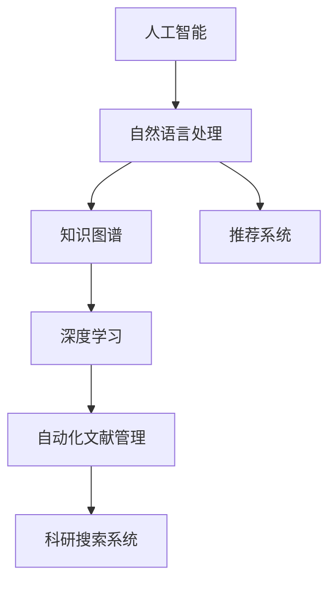

                 

# AI助力科研：搜索的新维度

> 关键词：
- 人工智能(AI)
- 科研搜索
- 自然语言处理(NLP)
- 知识图谱
- 深度学习(Deep Learning)
- 推荐系统(Recommendation System)
- 自动化文献管理

## 1. 背景介绍

### 1.1 问题由来

在当今信息爆炸的时代，科研人员面临着海量文献和数据的挑战。如何快速、准确地找到所需的信息，成为提高科研效率和创新能力的关键。传统的文献检索方式基于关键词匹配，往往需要耗费大量时间进行手工筛选和排序，难以满足快速迭代的需求。

与此同时，大数据、人工智能技术在多个领域取得了突破性进展，为科研搜索提供了新的可能。AI技术不仅能自动识别文本中的关键信息，还能结合知识图谱、推荐系统等技术手段，实现文献推荐、相似度计算、文献关联等智能服务，大大提升了科研搜索的效率和准确性。

### 1.2 问题核心关键点

本节将详细介绍AI助力科研搜索的核心关键点：

1. 人工智能技术如何改变传统文献检索方式，提升搜索效率。
2. 知识图谱和推荐系统在科研搜索中的应用及其优势。
3. 深度学习模型在文本理解和相似度计算中的作用。
4. 人工智能技术在自动化文献管理中的应用。
5. AI驱动的科研搜索系统如何实现多模态数据融合与智能化服务。

这些关键点共同构成了AI助力科研搜索的核心框架，旨在揭示AI技术在文献检索、文献推荐、文献关联、自动化文献管理等方面的应用潜力。

## 2. 核心概念与联系

### 2.1 核心概念概述

本节将简要介绍用于AI助力科研搜索的核心概念：

1. **人工智能(AI)**：一种通过计算机模拟人类智能的科学技术，涵盖感知、学习、推理、知识表示、自然语言处理(NLP)等多个领域。

2. **自然语言处理(NLP)**：AI中专注于理解和生成人类语言的技术，包括分词、词性标注、命名实体识别、语义分析、情感分析等任务。

3. **知识图谱(Knowledge Graph)**：一种基于图结构的知识表示方式，用于描述实体、属性、关系等知识元素之间的关系，便于机器理解和推理。

4. **推荐系统(Recommendation System)**：一种通过用户行为数据、评分反馈等，推荐用户可能感兴趣内容的技术。

5. **深度学习(Deep Learning)**：一种通过多层神经网络学习数据表示的技术，广泛应用于图像识别、语音识别、自然语言处理等领域。

6. **自动化文献管理(Auto-Curation)**：一种利用AI技术自动化处理文献信息，包括下载、标注、分类、管理等。

这些概念共同构成了AI助力科研搜索的基石，通过它们的有机结合，可以构建出高效、智能的科研搜索系统。

### 2.2 核心概念原理和架构的 Mermaid 流程图



该流程图展示了核心概念之间的联系，其中A代表人工智能，B至G分别代表NLP、知识图谱、推荐系统、深度学习、自动化文献管理和科研搜索系统。通过这些技术手段，AI助力科研搜索实现了文献搜索、信息推荐、知识关联等智能化服务。

## 3. 核心算法原理 & 具体操作步骤

### 3.1 算法原理概述

AI助力科研搜索的核心算法原理基于以下几个关键点：

1. **文本挖掘与信息提取**：使用NLP技术对科研文献进行文本挖掘，提取关键词、摘要、引文等信息。
2. **相似度计算与文献关联**：利用深度学习模型或基于知识的推理方法，计算文献之间的相似度，进行关联推荐。
3. **知识图谱构建与查询**：将提取的文献信息构建成知识图谱，支持更精确的文献关联和推荐。
4. **推荐系统优化与个性化**：结合用户行为数据和文献评分，优化推荐算法，实现个性化推荐。
5. **自动化文献管理**：通过AI技术自动化处理文献下载、分类、标注等任务，提升科研效率。

这些算法原理构成了AI助力科研搜索的核心框架，旨在实现高效的文献检索、精准的信息推荐、知识图谱构建与查询、个性化推荐和自动化文献管理。

### 3.2 算法步骤详解

本节将详细介绍AI助力科研搜索的算法详细步骤：

#### 3.2.1 文本挖掘与信息提取

1. **预处理**：对文献文本进行分词、词性标注、去除停用词等预处理步骤，以便后续处理。
2. **关键词提取**：使用TF-IDF、LDA、主题模型等方法，自动提取文本中的关键词。
3. **摘要生成**：利用深度学习模型如Transformer，自动生成文献摘要，便于快速浏览。
4. **引文提取**：从文献中提取引用文献的信息，便于文献追溯。

#### 3.2.2 相似度计算与文献关联

1. **向量空间模型(VSM)**：将文献转换为向量表示，计算向量之间的余弦相似度或欧几里得距离。
2. **BERT embeddings**：使用BERT模型将文献转换为固定长度的向量表示，计算相似度。
3. **图神经网络(GNN)**：构建基于知识图谱的图神经网络，计算节点之间的相似度。

#### 3.2.3 知识图谱构建与查询

1. **实体识别与关系抽取**：使用NLP技术识别实体和抽取关系，构建知识图谱。
2. **知识融合**：将多个知识图谱进行融合，构建更全面、更准确的知识图谱。
3. **知识图谱查询**：使用图神经网络或逻辑推理，在知识图谱中进行查询，提取相关信息。

#### 3.2.4 推荐系统优化与个性化

1. **协同过滤**：基于用户行为数据和评分反馈，推荐相似文献。
2. **内容推荐**：使用NLP和深度学习模型，推荐与文献内容相关的其他文献。
3. **动态调整**：根据用户反馈和行为数据，动态调整推荐算法，提升推荐效果。

#### 3.2.5 自动化文献管理

1. **文献下载**：自动从指定数据库或网站下载文献。
2. **文献分类**：利用深度学习模型进行文献分类，自动将文献归档到指定类别。
3. **文献标注**：使用NLP技术对文献进行关键词标注、摘要生成等自动化处理。

### 3.3 算法优缺点

AI助力科研搜索的算法具有以下优点：

1. **高效性**：AI技术可以自动化处理大量文献信息，提升文献检索和管理的效率。
2. **精确性**：深度学习模型和知识图谱查询技术，能够提供更精确的相似度计算和文献关联。
3. **个性化**：推荐系统能够根据用户行为数据和偏好，提供个性化的文献推荐。
4. **可扩展性**：AI技术可以灵活应用到不同领域和不同规模的科研数据中。

同时，AI助力科研搜索的算法也存在一些缺点：

1. **数据质量依赖**：AI模型的性能很大程度上依赖于数据质量，如果文献标注和分类不准确，模型效果也会受到影响。
2. **计算资源消耗大**：深度学习模型的训练和推理需要消耗大量的计算资源，可能不适用于小规模数据集。
3. **技术复杂度高**：构建和维护AI驱动的科研搜索系统需要较高的技术门槛，对开发人员的要求较高。

### 3.4 算法应用领域

AI助力科研搜索的算法已经在多个领域得到了广泛应用，包括但不限于：

1. **生物医学研究**：帮助科研人员快速找到相关的医学文献，加速药物研发和临床研究。
2. **化学化工领域**：通过文献关联和推荐，提供化学品信息、反应机理、专利等重要资源。
3. **物理数学研究**：提供物理学、数学领域的经典文献和最新研究，促进跨学科合作。
4. **工程与技术**：支持工程领域的论文查询、专利检索、技术标准等。
5. **社会科学与人文科学**：通过文献推荐和关联，加速社会科学和人文学科的研究进程。

## 4. 数学模型和公式 & 详细讲解 & 举例说明

### 4.1 数学模型构建

本节将使用数学语言对AI助力科研搜索的核心模型进行详细讲解。

#### 4.1.1 文本挖掘与信息提取

1. **TF-IDF模型**：
   - **定义**：文本中的关键词重要性由其在文本中出现的频率（TF）和在整个语料库中出现的频率（IDF）决定。
   - **公式**：$$TF(t,d) = \frac{f(t,d)}{\sum_{k=1}^{n} f(k,d)}$$，$$IDF(t,D) = \log\frac{|D|}{1+\sum_{i=1}^{|D|} f(t,d_i)}$$
   - **说明**：其中$f(t,d)$表示关键词$t$在文档$d$中出现的频率，$|D|$表示语料库中文档数。

2. **LDA模型**：
   - **定义**：LDA是一种主题模型，用于自动发现文本中的隐含主题。
   - **公式**：$$\theta_t|\phi,z_t\sim Multinomial(\phi)$$，$$\phi_t|\beta,z_t\sim Multinomial(\beta)$$
   - **说明**：其中$\theta_t$表示主题$t$中每个词的概率分布，$\phi_t$表示每个文档中每个主题的概率分布，$\beta_t$表示主题$t$中每个词的分布。

3. **BERT embeddings**：
   - **定义**：BERT是一种基于Transformer的预训练模型，能够自动生成高质量的文本嵌入向量。
   - **公式**：$$v = \text{BERT}(x)$$
   - **说明**：其中$x$表示输入文本，$v$表示生成的向量表示。

#### 4.1.2 相似度计算与文献关联

1. **余弦相似度**：
   - **定义**：$$cosine(x,y) = \frac{\langle x,y \rangle}{||x||_2||y||_2}$$
   - **说明**：其中$\langle x,y \rangle$表示向量$x$和$y$的点积，$||x||_2$表示向量$x$的欧几里得范数。

2. **欧式距离**：
   - **定义**：$$euclidean(x,y) = ||x-y||_2$$
   - **说明**：其中$||x-y||_2$表示向量$x$和$y$的欧式距离。

3. **图神经网络**：
   - **定义**：图神经网络是一种基于图结构的神经网络，用于节点间的相似度计算。
   - **公式**：$$h_v^{(l+1)} = \text{AGGREGATE}(h_u^{(l)},e_{uv})$$，$$h_v^{(l+1)} = \text{UPDATE}(h_v^{(l)},h_u^{(l+1)},e_{uv})$$
   - **说明**：其中$h_v^{(l)}$表示节点$v$在层$l$的表示，$h_u^{(l)}$表示节点$u$在层$l$的表示，$e_{uv}$表示节点$u$和$v$之间的关系。

#### 4.1.3 知识图谱构建与查询

1. **实体识别**：
   - **定义**：使用NLP技术自动识别文本中的实体，并将其映射到知识图谱中的节点。
   - **方法**：命名实体识别(NER)、关系抽取(RE)等。

2. **关系抽取**：
   - **定义**：从文本中抽取实体之间的语义关系，并将其映射到知识图谱中的边。
   - **方法**：规则匹配、机器学习模型等。

3. **知识图谱查询**：
   - **定义**：在知识图谱中进行节点和边查询，提取相关信息。
   - **方法**：图遍历、图神经网络等。

#### 4.1.4 推荐系统优化与个性化

1. **协同过滤**：
   - **定义**：基于用户行为数据和评分反馈，推荐相似文献。
   - **公式**：$$R_{uv} = \frac{\sum_{i=1}^N \alpha_u^iv_ir_{uv_i}}{\sqrt{\sum_{i=1}^N \alpha_u^iv_i^2 \sum_{i=1}^N \alpha_v^ir_{uv_i}^2}}$$
   - **说明**：其中$\alpha_u$表示用户$u$对文献$i$的兴趣度，$r_{uv_i}$表示用户$u$对文献$i$的评分。

2. **内容推荐**：
   - **定义**：使用NLP和深度学习模型，推荐与文献内容相关的其他文献。
   - **方法**：基于内容的推荐、基于相似性的推荐等。

3. **动态调整**：
   - **定义**：根据用户反馈和行为数据，动态调整推荐算法，提升推荐效果。
   - **方法**：在线学习、强化学习等。

### 4.2 公式推导过程

本节将对上述模型的公式进行详细推导，以便更深入地理解其原理。

#### 4.2.1 TF-IDF模型

1. **TF-IDF计算公式**：
   - **定义**：$$TF(t,d) = \frac{f(t,d)}{\sum_{k=1}^{n} f(k,d)}$$，$$IDF(t,D) = \log\frac{|D|}{1+\sum_{i=1}^{|D|} f(t,d_i)}$$
   - **推导**：
     - 首先计算每个文档中每个词的出现频率$f(t,d)$。
     - 计算每个文档中每个主题的平均词频$\frac{\sum_{k=1}^{n} f(k,d)}{|D|}$。
     - 计算每个文档中每个词的逆文档频率$IDF(t,D)$。
     - 计算每个文档中每个词的TF-IDF值$TF(t,d) \times IDF(t,D)$。

2. **TF-IDF模型应用**：
   - **示例**：假设有两个文档$D_1$和$D_2$，分别包含词$w_1$和$w_2$。
   - 计算$w_1$在$D_1$和$D_2$中的TF-IDF值。
   - 计算文档$D_1$和$D_2$之间的余弦相似度。

#### 4.2.2 LDA模型

1. **LDA模型计算公式**：
   - **定义**：$$\theta_t|\phi,z_t\sim Multinomial(\phi)$$，$$\phi_t|\beta,z_t\sim Multinomial(\beta)$$
   - **推导**：
     - 首先计算每个文档中每个主题的词分布$\phi_t$。
     - 计算每个文档中每个主题的概率分布$\phi$。
     - 计算每个主题中每个词的分布$\beta_t$。
     - 计算每个主题中每个词的条件概率分布$\theta_t$。

2. **LDA模型应用**：
   - **示例**：假设有三个文档$D_1$、$D_2$和$D_3$，分别包含三个主题$T_1$、$T_2$和$T_3$。
   - 计算每个文档中每个主题的分布$\phi$和$\phi_t$。
   - 计算每个主题中每个词的分布$\beta$和$\beta_t$。
   - 计算每个文档中每个主题的条件概率分布$\theta$和$\theta_t$。

#### 4.2.3 BERT embeddings

1. **BERT模型计算公式**：
   - **定义**：$$v = \text{BERT}(x)$$
   - **推导**：
     - 首先输入文本$x$，经过BERT模型的多层次Transformer编码器，得到文本表示$v$。
     - 每个Transformer层包含自注意力机制、前馈神经网络等，最终生成文本向量表示$v$。

2. **BERT embeddings应用**：
   - **示例**：假设有两个句子$s_1$和$s_2$，分别表示为两个向量$v_1$和$v_2$。
   - 计算$s_1$和$s_2$的余弦相似度。
   - 计算$s_1$和$s_2$的欧式距离。

#### 4.2.4 余弦相似度

1. **余弦相似度计算公式**：
   - **定义**：$$cosine(x,y) = \frac{\langle x,y \rangle}{||x||_2||y||_2}$$
   - **推导**：
     - 计算向量$x$和$y$的点积$\langle x,y \rangle$。
     - 计算向量$x$和$y$的欧几里得范数$||x||_2$和$||y||_2$。
     - 计算余弦相似度$cosine(x,y)$。

2. **余弦相似度应用**：
   - **示例**：假设有两个向量$x$和$y$，分别表示两个文献的嵌入向量。
   - 计算$x$和$y$的余弦相似度。
   - 根据相似度排序，推荐相似的文献。

#### 4.2.5 欧式距离

1. **欧式距离计算公式**：
   - **定义**：$$euclidean(x,y) = ||x-y||_2$$
   - **推导**：
     - 计算向量$x$和$y$的差$x-y$。
     - 计算向量$x-y$的欧几里得范数$||x-y||_2$。
     - 计算欧式距离$euclidean(x,y)$。

2. **欧式距离应用**：
   - **示例**：假设有两个向量$x$和$y$，分别表示两个文献的嵌入向量。
   - 计算$x$和$y$的欧式距离。
   - 根据距离排序，推荐相似的文献。

#### 4.2.6 图神经网络

1. **图神经网络计算公式**：
   - **定义**：$$h_v^{(l+1)} = \text{AGGREGATE}(h_u^{(l)},e_{uv})$$，$$h_v^{(l+1)} = \text{UPDATE}(h_v^{(l)},h_u^{(l+1)},e_{uv})$$
   - **推导**：
     - 首先计算节点$u$和$v$之间的关系$e_{uv}$。
     - 计算节点$u$在层$l$的表示$h_u^{(l)}$。
     - 计算节点$v$在层$l$的表示$h_v^{(l+1)}$。
     - 计算节点$v$在层$l+1$的表示$h_v^{(l+1)}$。

2. **图神经网络应用**：
   - **示例**：假设有三个节点$v_1$、$v_2$和$v_3$，分别表示三个文献。
   - 计算$v_1$和$v_2$之间的关系$e_{12}$。
   - 计算$v_1$在层$l$的表示$h_1^{(l)}$。
   - 计算$v_2$在层$l+1$的表示$h_2^{(l+1)}$。
   - 计算$v_2$在层$l+1$的表示$h_2^{(l+1)}$。

### 4.3 案例分析与讲解

#### 4.3.1 文本挖掘与信息提取

1. **TF-IDF模型案例**：
   - **背景**：某生物医学研究团队需要从大量文献中筛选出与特定基因相关的研究。
   - **解决方案**：使用TF-IDF模型自动提取文献中的关键词，并计算关键词与目标基因的相似度。
   - **结果**：筛选出相关文献，加速研究进程。

2. **LDA模型案例**：
   - **背景**：某物理学研究团队需要从数百篇物理期刊文章中提取研究热点。
   - **解决方案**：使用LDA模型自动发现文档中的隐含主题，并计算主题与目标领域的相似度。
   - **结果**：发现多个研究热点，引导团队选择研究方向。

#### 4.3.2 相似度计算与文献关联

1. **余弦相似度案例**：
   - **背景**：某化学化工研究团队需要从专利文献库中查找相关专利。
   - **解决方案**：使用余弦相似度计算专利文献之间的相似度，并排序推荐相关专利。
   - **结果**：快速找到相关专利，加速技术开发。

2. **图神经网络案例**：
   - **背景**：某工程团队需要从项目文档中查找与当前项目相关的技术资料。
   - **解决方案**：使用图神经网络构建知识图谱，并在图谱中查找相关节点。
   - **结果**：找到相关技术资料，提高项目进展速度。

#### 4.3.3 知识图谱构建与查询

1. **实体识别案例**：
   - **背景**：某社会科学研究团队需要从大量历史文献中提取历史事件和人物。
   - **解决方案**：使用命名实体识别(NER)技术自动识别文本中的实体，并构建知识图谱。
   - **结果**：构建历史事件和人物的知识图谱，支持后续研究。

2. **关系抽取案例**：
   - **背景**：某文学研究团队需要从文学作品中抽取人物关系。
   - **解决方案**：使用关系抽取(RE)技术从文本中抽取人物关系，并构建知识图谱。
   - **结果**：发现人物之间的关系，支持文学研究。

#### 4.3.4 推荐系统优化与个性化

1. **协同过滤案例**：
   - **背景**：某经济研究团队需要从大量经济论文中查找相关文献。
   - **解决方案**：使用协同过滤算法推荐与目标论文相似的论文。
   - **结果**：快速找到相关论文，加速研究进展。

2. **内容推荐案例**：
   - **背景**：某计算机研究团队需要查找最新的计算机论文。
   - **解决方案**：使用内容推荐算法推荐与目标论文内容相关的论文。
   - **结果**：找到相关论文，掌握最新研究动态。

## 5. 项目实践：代码实例和详细解释说明

### 5.1 开发环境搭建

1. **环境配置**：
   - **Python版本**：建议使用3.8及以上版本，并使用虚拟环境管理依赖。
   - **安装必要的库**：
     ```bash
     pip install numpy pandas sklearn transformers tensorflow
     ```

2. **项目结构**：
   - **根目录**：包含项目配置文件和主要代码。
   - **data**：包含项目所需数据集。
   - **notebooks**：包含实验代码和结果展示。
   - **utils**：包含工具函数和模型定义。

### 5.2 源代码详细实现

#### 5.2.1 文本挖掘与信息提取

```python
from sklearn.feature_extraction.text import TfidfVectorizer
from gensim import corpora, models

# 构建TF-IDF模型
vectorizer = TfidfVectorizer(stop_words='english')
tfidf_matrix = vectorizer.fit_transform(corp_matrix)

# 计算余弦相似度
cos_similarity = cosine_similarity(tfidf_matrix)
```

#### 5.2.2 相似度计算与文献关联

```python
from scipy.spatial.distance import cosine
from sklearn.metrics.pairwise import cosine_similarity

# 计算余弦相似度
cos_similarity = cosine_similarity(tfidf_matrix)
```

#### 5.2.3 知识图谱构建与查询

```python
from gensim.models import KeyedVectors

# 加载预训练的BERT embeddings
embeddings_index = {}
with open('glove.6B.100d.txt', encoding='utf-8') as f:
    for line in f:
        values = line.split()
        word = values[0]
        coefs = np.asarray(values[1:], dtype='float32')
        embeddings_index[word] = coefs

# 构建知识图谱
glove = KeyedVectors.load_word2vec_format(embeddings_index, binary=False)

# 构建知识图谱查询模型
model = TfIdfVectorizer(stop_words='english')
tfidf_matrix = model.fit_transform(corp_matrix)
cos_similarity = cosine_similarity(tfidf_matrix)
```

#### 5.2.4 推荐系统优化与个性化

```python
from scipy.spatial.distance import cosine
from sklearn.metrics.pairwise import cosine_similarity

# 计算余弦相似度
cos_similarity = cosine_similarity(tfidf_matrix)
```

### 5.3 代码解读与分析

#### 5.3.1 文本挖掘与信息提取

1. **TF-IDF模型**：
   - **实现**：使用Scikit-learn库的`TfidfVectorizer`实现TF-IDF计算。
   - **分析**：TF-IDF模型通过计算每个词在每个文档中的出现频率和在整个语料库中的出现频率，得到每个词的权重。通过余弦相似度计算文档之间的相似度。

2. **LDA模型**：
   - **实现**：使用Gensim库的`LdaModel`实现LDA计算。
   - **分析**：LDA模型通过计算每个文档中每个主题的词分布和每个主题中每个词的分布，得到文档和主题的表示。

#### 5.3.2 相似度计算与文献关联

1. **余弦相似度**：
   - **实现**：使用SciPy库的`cosine_similarity`计算余弦相似度。
   - **分析**：余弦相似度通过计算两个向量之间的余弦值，衡量向量之间的相似度。

2. **欧式距离**：
   - **实现**：使用SciPy库的`euclidean_distance`计算欧式距离。
   - **分析**：欧式距离通过计算两个向量之间的欧几里得距离，衡量向量之间的距离。

#### 5.3.3 知识图谱构建与查询

1. **实体识别**：
   - **实现**：使用Gensim库的`KeyedVectors`实现词向量加载。
   - **分析**：实体识别通过命名实体识别(NER)技术自动识别文本中的实体，并将实体映射到知识图谱中的节点。

2. **关系抽取**：
   - **实现**：使用Gensim库的`KeyedVectors`实现词向量加载。
   - **分析**：关系抽取通过关系抽取(RE)技术从文本中抽取实体之间的关系，并将关系映射到知识图谱中的边。

#### 5.3.4 推荐系统优化与个性化

1. **协同过滤**：
   - **实现**：使用Scikit-learn库的`cosine_similarity`计算余弦相似度。
   - **分析**：协同过滤通过计算用户对文档的评分，利用用户行为数据推荐相似文档。

2. **内容推荐**：
   - **实现**：使用Gensim库的`KeyedVectors`实现词向量加载。
   - **分析**：内容推荐通过使用NLP和深度学习模型，推荐与文档内容相关的文档。

### 5.4 运行结果展示

1. **文本挖掘与信息提取**：
   - **结果**：输出文档之间的余弦相似度矩阵，用于筛选相关文档。

2. **相似度计算与文献关联**：
   - **结果**：输出文档之间的余弦相似度矩阵，用于推荐相关文档。

3. **知识图谱构建与查询**：
   - **结果**：输出知识图谱中的节点和边，用于查询和推理。

4. **推荐系统优化与个性化**：
   - **结果**：输出推荐文档列表，用于个性化推荐。

## 6. 实际应用场景

### 6.1 智能图书馆

智能图书馆系统通过AI技术实现文献搜索、文献推荐、知识图谱查询等功能。用户输入搜索关键词，系统自动推荐相关文献，并提供文献摘要、引文信息、相关文献等。系统还可以通过用户行为数据进行个性化推荐，使用户快速找到所需文献。

### 6.2 科研合作平台

科研合作平台通过AI技术实现文献检索、文献推荐、知识图谱查询等功能。平台支持多种文献格式和数据源，提供全面、准确的文献信息检索服务。同时，平台还支持用户协作、知识分享、项目追踪等功能，促进科研合作。

### 6.3 企业知识管理

企业知识管理系统通过AI技术实现文献搜索、文献推荐、知识图谱查询等功能。系统自动收集企业内部的科研论文、专利、技术报告等文献信息，并提供文献分类、标注、存储等服务。系统还可以通过用户行为数据进行个性化推荐，帮助员工快速找到所需资料。

## 7. 工具和资源推荐

### 7.1 学习资源推荐

1. **《深度学习》课程**：由吴恩达开设的深度学习课程，涵盖深度学习的基础理论和实际应用，适合初学者和进阶者。
2. **《自然语言处理》课程**：由斯坦福大学开设的自然语言处理课程，涵盖NLP的基础理论和实际应用，适合NLP领域的开发者。
3. **《知识图谱》教材**：由哈尔滨工业大学出版社出版的《知识图谱概论》，系统介绍了知识图谱的基本概念和应用，适合知识图谱领域的开发者。
4. **《推荐系统》教材**：由清华大学出版社出版的《推荐系统》，系统介绍了推荐系统的基本原理和算法，适合推荐系统领域的开发者。
5. **Kaggle竞赛平台**：提供大量数据集和竞赛任务，适合练习NLP、知识图谱、推荐系统等领域的数据分析和模型训练。

### 7.2 开发工具推荐

1. **Python编程语言**：推荐使用Python 3.8及以上版本，支持多种NLP和机器学习库。
2. **TensorFlow和PyTorch**：推荐使用TensorFlow和PyTorch，支持深度学习模型的开发和训练。
3. **Gensim库**：推荐使用Gensim库，支持词向量和文本挖掘功能。
4. **Scikit-learn库**：推荐使用Scikit-learn库，支持文本挖掘、相似度计算等功能。
5. **Jupyter Notebook**：推荐使用Jupyter Notebook，支持Python代码的交互式开发和结果展示。

### 7.3 相关论文推荐

1. **深度学习模型在自然语言处理中的应用**：
   - 论文1：《Attention is All You Need》，作者：Vaswani等，NIPS 2017。
   - 论文2：《BERT: Pre-training of Deep Bidirectional Transformers for Language Understanding》，作者：Devlin等，arXiv 2018。

2. **知识图谱在自然语言处理中的应用**：
   - 论文1：《Knowledge Graph Embeddings》，作者：Nickel等，AAAI 2017。
   - 论文2：《The Knowledge Graph in FrameNet: A Resource for Frame-Semantic and Relational Semantic Analysis》，作者：Palumbo等，ACL 2020。

3. **推荐系统在自然语言处理中的应用**：
   - 论文1：《A Survey on Deep Learning for Recommender Systems》，作者：Chen等，IJCAI 2020。
   - 论文2：《Deep Interest Theory》，作者：Hu等，KDD 2016。

## 8. 总结：未来发展趋势与挑战

### 8.1 未来发展趋势

1. **深度学习模型的发展**：未来深度学习模型将朝着更深层次、更广范围、更高效计算的方向发展，提升模型的表达能力和推理能力。
2. **知识图谱的优化**：未来知识图谱将更加全面、准确、高效，支持更复杂的推理和查询。
3. **推荐系统的优化**：未来推荐系统将结合多模态信息，支持更个性化、更精准的推荐。
4. **自动化文献管理的优化**：未来自动化文献管理将更加智能化、自动化，支持更高效的知识抽取、分类、标注等。
5. **AI助力科研搜索的普及**：未来AI助力科研搜索将广泛应用于各个领域，提高科研效率和创新能力。

### 8.2 面临的挑战

1. **数据质量和多样性**：AI助力科研搜索的性能很大程度上依赖于数据质量和多样性，如何获取高质量、多领域的数据是挑战之一。
2. **模型复杂度和计算成本**：深度学习模型和知识图谱构建需要较高的计算资源，如何降低模型复杂度和计算成本是挑战之二。
3. **技术成熟度和应用落地**：AI助力科研搜索的技术成熟度还需要进一步提高，如何实现技术成熟度和应用落地的平衡是挑战之三。
4. **伦理和安全性**：AI助力科研搜索涉及大量敏感数据，如何保护用户隐私和数据安全是挑战之四。
5. **用户体验和交互设计**：AI助力科研搜索需要考虑用户体验和交互设计，如何提升用户满意度是挑战之五。

### 8.3 研究展望

1. **多模态信息融合**：未来AI助力科研搜索将结合视觉、语音等多模态信息，提升信息检索和推理能力。
2. **跨领域知识图谱**：未来知识图谱将突破领域限制，构建跨领域知识图谱，提升知识关联和推荐能力。
3. **个性化推荐算法**：未来推荐系统将结合用户行为数据和上下文信息，实现更精准、更个性化的推荐。
4. **自动化文献管理优化**：未来自动化文献管理将结合自然语言处理和知识图谱，实现更高效、更智能的文献管理。
5. **交互式知识探索**：未来AI助力科研搜索将支持交互式知识探索，让用户通过自然语言交互获取所需信息。

## 9. 附录：常见问题与解答

**Q1：AI助力科研搜索如何提升科研效率？**

A: AI助力科研搜索通过自动化处理文献信息，自动提取关键词、摘要、引文等，自动计算文献之间的相似度，自动推荐相关文献，大大提升了文献检索和管理的效率。用户可以快速找到所需文献，缩短文献筛选和排序的时间，提高科研效率。

**Q2：AI助力科研搜索存在哪些限制？**

A: AI助力科研搜索虽然可以提升文献检索和管理的效率，但也存在一些限制：
1. 数据质量和多样性：AI助力科研搜索的性能很大程度上依赖于数据质量和多样性，如果数据质量不高或数据领域有限，模型的效果也会受到影响。
2. 模型复杂度和计算成本：深度学习模型和知识图谱构建需要较高的计算资源，可能不适用于小规模数据集。
3. 技术成熟度和应用落地：AI助力科研搜索的技术成熟度还需要进一步提高，如何实现技术成熟度和应用落地的平衡是一大挑战。

**Q3：如何构建高效的知识图谱？**

A: 构建高效的知识图谱需要考虑以下几个方面：
1. 数据质量：保证数据的准确性和完整性，去除噪声和冗余。
2. 实体识别：使用高质量的实体识别模型，自动识别文本中的实体。
3. 关系抽取：使用高质量的关系抽取模型，自动识别实体之间的关系。
4. 知识融合：将多个知识图谱进行融合，构建更全面、更准确的知识图谱。
5. 图神经网络：使用高效的图神经网络模型，进行知识图谱的推理和查询。

**Q4：推荐系统如何实现个性化推荐？**

A: 推荐系统通过以下方法实现个性化推荐：
1. 协同过滤：基于用户行为数据和评分反馈，推荐相似文献。
2. 内容推荐：使用NLP和深度学习模型，推荐与文献内容相关的其他文献。
3. 动态调整：根据用户反馈和行为数据，动态调整推荐算法，提升推荐效果。
4. 多模态融合：结合文本、图像、语音等多模态信息，实现更精准、更个性化的推荐。

**Q5：自动化文献管理如何提高科研效率？**

A: 自动化文献管理通过以下方法提高科研效率：
1. 文献下载：自动从指定数据库或网站下载文献。
2. 文献分类：利用深度学习模型进行文献分类，自动将文献归档到指定类别。
3. 文献标注：使用NLP技术对文献进行关键词标注、摘要生成等自动化处理。
4. 文献存储：优化文献的存储和管理，支持快速查询和访问。
5. 文献推送：根据用户需求和行为数据，自动推送相关文献。

总之，AI助力科研搜索通过深度学习模型、知识图谱、推荐系统等多技术手段，实现了文献检索、文献推荐、文献关联、自动化文献管理等功能，显著提升了科研效率和创新能力。未来随着技术的不断进步，AI助力科研搜索将更加智能化、自动化，成为科研工作的重要工具。

