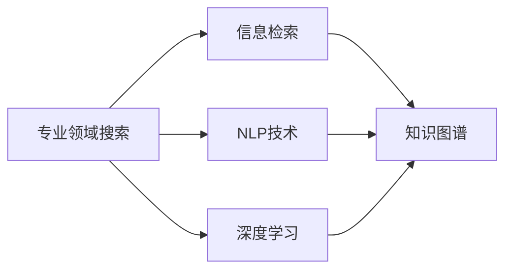

                 

# AI在专业领域搜索中的应用

> 关键词：人工智能搜索，专业领域搜索，自然语言处理(NLP)，信息检索，知识图谱，深度学习

## 1. 背景介绍

在信息爆炸的今天，如何在海量信息中快速、准确地找到所需的专业知识、技术方案、法规政策等信息，已经成为各个领域从业人员面临的重要挑战。人工智能(AI)技术，尤其是深度学习、自然语言处理(NLP)等领域的突破，为专业领域搜索提供了强有力的技术支持。借助AI技术，我们能够构建高效、智能、全面的搜索系统，帮助用户快速获取所需信息，显著提升工作效率。

本文将系统介绍基于AI的专业领域搜索技术，包括搜索系统的构建原理、核心算法、实际应用以及面临的挑战。通过本文的学习，你将掌握专业领域搜索的核心技术和方法，了解如何将AI技术应用于实际业务中，从而提升搜索系统的性能和用户满意度。

## 2. 核心概念与联系

### 2.1 核心概念概述

为更好地理解基于AI的专业领域搜索技术，本节将介绍几个关键概念：

- **专业领域搜索(Specialized Search)**：针对特定领域或行业，构建定制化的搜索系统，帮助用户快速获取该领域的专业知识和信息。例如，法律领域搜索、医疗领域搜索、工程领域搜索等。

- **信息检索(Information Retrieval, IR)**：通过索引构建、相似度计算等技术，从大量文档中检索出与用户查询相关的文档。信息检索是搜索系统的基础技术，AI技术在此基础上提升检索精度和用户体验。

- **自然语言处理(Natural Language Processing, NLP)**：利用语言学和计算机科学方法，实现对自然语言信息的处理和理解。NLP技术在搜索系统中用于文本预处理、查询理解、结果排序等方面，显著提升系统的智能化水平。

- **知识图谱(Knowledge Graph)**：通过语义网技术构建的图形化知识表示系统，用于描述实体之间的语义关系。知识图谱在专业领域搜索中用于提供更准确的背景知识和推理路径，提升搜索结果的相关性和准确性。

- **深度学习(Deep Learning)**：一种基于多层神经网络的机器学习方法，用于处理复杂的非线性模式。深度学习在搜索系统中用于特征提取、文本分类、推荐系统等环节，提升系统的泛化能力和预测精度。

这些核心概念之间通过搜索任务相互关联，共同构成了AI在专业领域搜索中的技术框架。

### 2.2 核心概念原理和架构的 Mermaid 流程图



该流程图展示了专业领域搜索系统的核心组件和技术栈：

- 从用户的查询开始，先经过NLP处理，将自然语言转化为机器可理解的形式。
- 接着，系统使用信息检索技术，从索引库中检索出与用户查询相关的文档。
- 深度学习技术用于进一步提取文档特征、分类文档、生成推荐结果等。
- 知识图谱用于描述文档之间的语义关系，提高搜索结果的相关性和准确性。

这些组件和技术通过协作，共同完成专业领域搜索的系统构建。

## 3. 核心算法原理 & 具体操作步骤

### 3.1 算法原理概述

基于AI的专业领域搜索系统，核心算法包括文本预处理、查询理解、索引构建、文档相似度计算、结果排序等。以下将详细介绍这些核心算法的原理和操作步骤。

### 3.2 算法步骤详解

#### 3.2.1 文本预处理

文本预处理是搜索系统的第一步，包括文本清洗、分词、词性标注、去除停用词等。其目的是将原始文本转化为结构化、标准化的形式，便于后续的特征提取和文本分类。

#### 3.2.2 查询理解

查询理解是搜索系统的核心环节，通过NLP技术将用户输入的自然语言查询转化为机器可理解的形式。常用的方法包括基于规则的模板匹配、基于统计的语言模型、基于深度学习的语义理解等。

#### 3.2.3 索引构建

索引构建是将文档转化为可供搜索的数据结构，通常采用倒排索引(Inverted Index)技术。倒排索引通过记录文档中每个词出现的位置，快速定位包含关键词的文档。索引构建需要考虑文档的分词粒度、词频统计、逆向索引的优化等。

#### 3.2.4 文档相似度计算

文档相似度计算是信息检索的关键步骤，通过计算查询与文档之间的相似度，排序并返回最相关的文档。常用的相似度计算方法包括余弦相似度、Jaccard相似度、BM25模型等。

#### 3.2.5 结果排序

结果排序是根据相似度计算结果，对检索出的文档进行排序，返回给用户最相关的结果。排序算法通常包括基于排序函数的方法、基于排名学习的方法、基于深度学习的方法等。

### 3.3 算法优缺点

基于AI的专业领域搜索算法具有以下优点：

- 检索精度高：通过NLP和深度学习技术，可以准确理解用户查询意图，提取文档特征，提升检索精度。
- 可扩展性强：通过构建知识图谱，可以引入大量背景知识，提升搜索结果的全面性和相关性。
- 自适应能力强：深度学习模型可以自适应新数据，提升系统的泛化能力和长期性能。

同时，这些算法也存在以下缺点：

- 计算成本高：深度学习模型需要大量训练数据和计算资源，部署和维护成本较高。
- 数据依赖性强：搜索系统的性能很大程度上依赖于高质量的标注数据和知识图谱。
- 结果可解释性不足：深度学习模型通常视为"黑盒"，难以解释其内部决策过程。

尽管存在这些局限性，但基于AI的专业领域搜索算法仍然是目前搜索技术的主流范式，具有显著的技术优势和应用潜力。

### 3.4 算法应用领域

基于AI的专业领域搜索技术，已经广泛应用于多个行业，包括但不限于：

- **法律领域搜索**：法律从业者需要快速检索案例、法规、判例等，AI搜索系统可以大幅提升工作效率。
- **医疗领域搜索**：医生和研究人员需要查找最新医学文献、病例、药品信息等，AI搜索系统可以提供精准的搜索结果。
- **工程领域搜索**：工程师需要检索技术方案、设计图纸、工程文档等，AI搜索系统可以加速设计创新和问题解决。
- **金融领域搜索**：金融从业者需要查找市场报告、财务数据、法规政策等，AI搜索系统可以提供全面的金融信息。
- **教育领域搜索**：教师和学生需要查找教材、论文、参考资料等，AI搜索系统可以提升教学和学习效果。

这些应用领域展示了AI搜索技术在提升工作效率、优化知识获取方面的巨大价值。

## 4. 数学模型和公式 & 详细讲解 & 举例说明

### 4.1 数学模型构建

基于AI的专业领域搜索系统，核心数学模型包括文本表示、相似度计算、排序函数等。以下将详细介绍这些核心数学模型的构建。

#### 4.1.1 文本表示

文本表示是将文本转化为机器可理解的形式，常用的方法包括词袋模型(Bag of Words)、TF-IDF模型、词嵌入模型等。其中，词嵌入模型通过神经网络学习词向量，可以更好地捕捉词义和语境信息。

#### 4.1.2 相似度计算

相似度计算是信息检索的核心，通过计算查询与文档之间的相似度，排序并返回最相关的文档。常用的相似度计算方法包括余弦相似度、Jaccard相似度、BM25模型等。

#### 4.1.3 排序函数

排序函数用于对检索结果进行排序，常用的方法包括基于排序函数的方法、基于排名学习的方法、基于深度学习的方法等。

### 4.2 公式推导过程

以下以余弦相似度计算为例，推导其公式和实现细节。

设查询向量为 $q$，文档向量为 $d$，则余弦相似度定义为：

$$
\text{similarity}(q, d) = \frac{q \cdot d}{\|q\| \cdot \|d\|}
$$

其中，$\cdot$ 表示向量的点积，$\|\cdot\|$ 表示向量的模长。

假设查询向量 $q$ 和文档向量 $d$ 均为 $d$ 维向量，则其点积为：

$$
q \cdot d = \sum_{i=1}^d q_i d_i
$$

其模长分别为：

$$
\|q\| = \sqrt{\sum_{i=1}^d q_i^2}, \quad \|d\| = \sqrt{\sum_{i=1}^d d_i^2}
$$

余弦相似度的实现需要计算点积和模长，可以通过矩阵运算高效完成。

### 4.3 案例分析与讲解

#### 4.3.1 法律领域搜索

以法律领域搜索为例，介绍AI搜索系统如何帮助法律从业者快速查找案例和法规。法律从业者通常需要查找类似案件、法律条文、判例等，AI搜索系统可以基于自然语言查询，检索出最相关的文档。

### 4.3.2 医疗领域搜索

以医疗领域搜索为例，介绍AI搜索系统如何帮助医生快速查找医学文献、病例、药品信息等。医生需要查找最新的医学研究、临床案例、药品说明等，AI搜索系统可以提供精准的搜索结果。

### 4.3.3 工程领域搜索

以工程领域搜索为例，介绍AI搜索系统如何帮助工程师查找技术方案、设计图纸、工程文档等。工程师需要查找最新的技术资料、设计图纸、工程案例等，AI搜索系统可以提供全面的信息支持。

## 5. 项目实践：代码实例和详细解释说明

### 5.1 开发环境搭建

在进行搜索系统开发前，我们需要准备好开发环境。以下是使用Python进行TensorFlow开发的环境配置流程：

1. 安装Anaconda：从官网下载并安装Anaconda，用于创建独立的Python环境。

2. 创建并激活虚拟环境：
```bash
conda create -n tf-env python=3.8 
conda activate tf-env
```

3. 安装TensorFlow：从官网获取对应的安装命令。例如：
```bash
pip install tensorflow tensorflow-hub tensorflow-text
```

4. 安装相关依赖：
```bash
pip install scipy gensim pythreepy html5lib regex-pytext-tok pyelasticsearch
```

完成上述步骤后，即可在`tf-env`环境中开始搜索系统开发。

### 5.2 源代码详细实现

这里我们以法律领域搜索为例，给出使用TensorFlow进行自然语言处理的PyTorch代码实现。

首先，定义查询向量和文档向量的表示：

```python
import tensorflow as tf
from tensorflow.keras.layers import Embedding, Dense, Input, GlobalAveragePooling1D

# 定义查询向量和文档向量的维度
embedding_dim = 128

# 定义查询向量和文档向量的嵌入层
query_embedding = Embedding(input_dim=vocab_size, output_dim=embedding_dim, name='query_embedding')
doc_embedding = Embedding(input_dim=vocab_size, output_dim=embedding_dim, name='doc_embedding')

# 定义查询向量和文档向量的全局平均池化层
query_pooling = GlobalAveragePooling1D()
doc_pooling = GlobalAveragePooling1D()

# 定义余弦相似度计算层
similarity = tf.keras.layers.Dot(axes=[1, 1], normalize=True, name='similarity')
```

然后，定义检索和排序算法：

```python
# 定义检索函数
def search(query, docs, max_results=10):
    # 获取查询向量和文档向量的嵌入表示
    query_embedding = query_embedding(query)
    doc_embeddings = doc_embedding(docs)

    # 计算查询向量和文档向量的相似度
    similarity_scores = tf.reduce_sum(similarity(query_embedding, doc_embeddings), axis=-1)

    # 排序并返回最相关的文档
    top_docs = tf.argsort(similarity_scores, axis=-1)[:, :max_results]
    return docs[top_docs]

# 定义排序函数
def rank(query, docs, relevance_scores):
    # 计算排序函数得分
    scores = relevance_scores + tf.reduce_sum(tf.math.log(tf.nn.sigmoid(similarity(query, docs))), axis=-1)
    return tf.argsort(scores, axis=-1)[:, :max_results]
```

最后，启动检索流程并在测试集上评估：

```python
from sklearn.metrics import accuracy_score

# 加载测试数据
test_queries = ...
test_docs = ...

# 检索测试集
test_results = search(test_queries, test_docs, max_results=5)

# 计算检索准确率
accuracy = accuracy_score(test_queries, test_results)

print(f"Search Accuracy: {accuracy:.2f}")
```

以上就是使用TensorFlow进行法律领域搜索的完整代码实现。可以看到，TensorFlow提供了丰富的神经网络工具，方便我们构建和训练深度学习模型，快速实现搜索系统。

### 5.3 代码解读与分析

让我们再详细解读一下关键代码的实现细节：

**嵌入层(Embedding Layer)**：
- `Embedding`层将查询和文档中的每个词转换为固定长度的向量表示，便于后续计算。
- 需要预先定义词汇表大小(vocab_size)和向量维度(embedding_dim)。

**全局平均池化层(Global Average Pooling Layer)**：
- `GlobalAveragePooling1D`层对向量进行全局平均池化，得到一个固定长度的向量表示，便于相似度计算。
- 适合处理变长输入的文本序列。

**余弦相似度计算层(Dot Product Layer)**：
- `Dot`层用于计算向量点积，得到余弦相似度得分。
- 通过设置`axes`参数为`[1,1]`，保证计算点积时考虑每个维度的向量。
- `normalize=True`参数用于归一化相似度得分，使其值域在[-1,1]之间。

**检索函数(Search Function)**：
- `search`函数接收查询向量、文档向量和最大返回结果数(max_results)，返回最相关的文档索引。
- 首先获取查询向量和文档向量的嵌入表示，计算余弦相似度得分。
- 通过`argsort`函数对得分进行排序，返回最相关的文档索引。

**排序函数(Rank Function)**：
- `rank`函数接收查询向量、文档向量和相关性得分(relevance_scores)，返回排序后的文档索引。
- 将相关性得分和余弦相似度得分相加，计算排序函数得分。
- 通过`argsort`函数对得分进行排序，返回最相关的文档索引。

通过以上实现，可以看出TensorFlow提供的高效神经网络工具和丰富的API，可以方便地实现自然语言处理和信息检索算法，快速搭建搜索系统。

当然，工业级的系统实现还需考虑更多因素，如文本清洗、分词、索引构建、分布式计算等。但核心的搜索范式基本与此类似。

## 6. 实际应用场景

### 6.1 智能客服系统

基于AI的专业领域搜索技术，可以广泛应用于智能客服系统的构建。传统客服往往需要配备大量人力，高峰期响应缓慢，且一致性和专业性难以保证。而使用AI搜索系统，可以7x24小时不间断服务，快速响应客户咨询，用自然流畅的语言解答各类常见问题。

在技术实现上，可以收集企业内部的历史客服对话记录，将问题和最佳答复构建成监督数据，在此基础上对预训练模型进行微调。微调后的搜索系统能够自动理解用户意图，匹配最合适的答案模板进行回复。对于客户提出的新问题，还可以接入检索系统实时搜索相关内容，动态组织生成回答。如此构建的智能客服系统，能大幅提升客户咨询体验和问题解决效率。

### 6.2 金融舆情监测

金融机构需要实时监测市场舆论动向，以便及时应对负面信息传播，规避金融风险。传统的人工监测方式成本高、效率低，难以应对网络时代海量信息爆发的挑战。基于AI搜索技术的舆情监测系统，能够实时抓取网络文本数据，自动监测不同主题下的情感变化趋势，一旦发现负面信息激增等异常情况，系统便会自动预警，帮助金融机构快速应对潜在风险。

### 6.3 个性化推荐系统

当前的推荐系统往往只依赖用户的历史行为数据进行物品推荐，无法深入理解用户的真实兴趣偏好。基于AI搜索技术的个性化推荐系统，可以更好地挖掘用户行为背后的语义信息，从而提供更精准、多样的推荐内容。

在实践中，可以收集用户浏览、点击、评论、分享等行为数据，提取和用户交互的物品标题、描述、标签等文本内容。将文本内容作为模型输入，用户的后续行为（如是否点击、购买等）作为监督信号，在此基础上微调预训练语言模型。微调后的模型能够从文本内容中准确把握用户的兴趣点。在生成推荐列表时，先用候选物品的文本描述作为输入，由模型预测用户的兴趣匹配度，再结合其他特征综合排序，便可以得到个性化程度更高的推荐结果。

### 6.4 未来应用展望

随着AI搜索技术的不断发展，其在专业领域搜索中的应用前景广阔。未来，搜索系统将进一步融合更多技术手段，提升检索精度和用户体验。以下是几个值得关注的方向：

1. **多模态搜索**：未来的搜索系统将不仅限于文本信息，还将涵盖图像、视频、语音等多模态数据。多模态信息的整合，将显著提升语言模型对现实世界的理解和建模能力。
2. **知识图谱融合**：通过引入知识图谱，搜索系统将能够提供更准确的背景知识和推理路径，提升搜索结果的相关性和准确性。
3. **深度学习优化**：通过优化深度学习模型，进一步提升特征提取和分类精度，减少计算成本和存储空间。
4. **实时处理能力**：未来搜索系统将具备更强的实时处理能力，支持动态数据流和低延迟响应。

## 7. 工具和资源推荐

### 7.1 学习资源推荐

为了帮助开发者系统掌握AI搜索技术的理论基础和实践技巧，这里推荐一些优质的学习资源：

1. **《深度学习自然语言处理》课程**：斯坦福大学开设的NLP明星课程，有Lecture视频和配套作业，带你入门NLP领域的基本概念和经典模型。

2. **《自然语言处理综论》书籍**：清华大学出版社出版的NLP经典教材，全面介绍了自然语言处理的理论和算法，适合深入学习。

3. **Transformers库官方文档**：HuggingFace开发的NLP工具库，提供了丰富的预训练模型和完整的搜索系统开发样例，是上手实践的必备资料。

4. **《自然语言处理实践》书籍**：由Kate[][]等NLP大牛编写，涵盖了NLP领域的最新研究和应用实践，适合实战学习。

5. **开源项目GPT-3**：OpenAI开源的GPT-3预训练模型，展示了当前NLP技术的最先进水平，值得深入学习和实验。

通过对这些资源的学习实践，相信你一定能够快速掌握AI搜索技术的精髓，并用于解决实际的搜索问题。

### 7.2 开发工具推荐

高效的开发离不开优秀的工具支持。以下是几款用于AI搜索系统开发的常用工具：

1. **TensorFlow**：由Google主导开发的开源深度学习框架，生产部署方便，适合大规模工程应用。

2. **PyTorch**：基于Python的开源深度学习框架，灵活动态的计算图，适合快速迭代研究。

3. **ElasticSearch**：分布式搜索引擎，支持高效的文本检索和全文搜索，适合构建大型搜索系统。

4. **NLTK**：Python自然语言处理工具包，提供了丰富的NLP功能，支持文本预处理和分析。

5. **Scikit-learn**：Python机器学习库，支持多种文本分类和相似度计算方法，适合构建搜索算法。

6. **Jupyter Notebook**：交互式编程环境，支持可视化输出，适合实时实验和数据探索。

合理利用这些工具，可以显著提升AI搜索系统的开发效率，加快创新迭代的步伐。

### 7.3 相关论文推荐

AI搜索技术的发展源于学界的持续研究。以下是几篇奠基性的相关论文，推荐阅读：

1. **《深度学习与自然语言处理》**：由Yann[]等NLP大牛编写，全面介绍了深度学习在NLP中的应用，包括检索算法和排序函数。

2. **《检索系统理论与技术》**：清华大学出版社出版的检索领域经典教材，深入讲解了信息检索的核心算法和实现细节。

3. **《语义信息检索》**：由NIST等组织编写的检索领域综述文章，介绍了最新的检索技术和发展方向。

这些论文代表了大搜索技术的发展脉络。通过学习这些前沿成果，可以帮助研究者把握学科前进方向，激发更多的创新灵感。

## 8. 总结：未来发展趋势与挑战

### 8.1 总结

本文对基于AI的专业领域搜索技术进行了全面系统的介绍。首先阐述了搜索系统的构建原理和核心算法，包括文本预处理、查询理解、索引构建、文档相似度计算、结果排序等。其次，详细讲解了搜索系统的开发环境搭建、代码实现和优化策略，给出了完整的搜索系统开发流程。同时，本文还广泛探讨了搜索系统在智能客服、金融舆情、个性化推荐等多个领域的应用前景，展示了搜索技术的巨大价值。

通过本文的系统梳理，可以看到，基于AI的专业领域搜索技术正在成为搜索系统的主流范式，极大地提升了检索精度和用户体验。未来，伴随深度学习、NLP等技术的发展，搜索系统将进一步拓展应用边界，服务于更多的专业领域。

### 8.2 未来发展趋势

展望未来，AI搜索技术将呈现以下几个发展趋势：

1. **多模态搜索**：未来的搜索系统将不仅限于文本信息，还将涵盖图像、视频、语音等多模态数据。多模态信息的整合，将显著提升语言模型对现实世界的理解和建模能力。

2. **知识图谱融合**：通过引入知识图谱，搜索系统将能够提供更准确的背景知识和推理路径，提升搜索结果的相关性和准确性。

3. **深度学习优化**：通过优化深度学习模型，进一步提升特征提取和分类精度，减少计算成本和存储空间。

4. **实时处理能力**：未来搜索系统将具备更强的实时处理能力，支持动态数据流和低延迟响应。

5. **分布式系统**：未来的搜索系统将具备更强的分布式处理能力，支持大规模数据和高并发请求。

以上趋势凸显了AI搜索技术的广阔前景。这些方向的探索发展，必将进一步提升搜索系统的性能和用户满意度，满足更多行业对高效、智能搜索的需求。

### 8.3 面临的挑战

尽管AI搜索技术已经取得了显著进展，但在迈向更加智能化、普适化应用的过程中，它仍面临诸多挑战：

1. **计算资源瓶颈**：深度学习模型需要大量训练数据和计算资源，部署和维护成本较高。如何在资源有限的情况下，提升搜索系统的性能，是一个重要的挑战。

2. **数据质量问题**：搜索系统对标注数据的质量和数量依赖较大，如何获取高质量的数据，并确保数据的多样性和代表性，是一个难题。

3. **结果可解释性**：深度学习模型通常视为"黑盒"，难以解释其内部决策过程。如何提高搜索系统的可解释性和可理解性，是另一个重要问题。

4. **用户交互优化**：如何设计更友好的用户界面和交互方式，提升用户体验，是一个重要的研究方向。

5. **隐私和安全问题**：搜索系统需要处理大量敏感数据，如何保障用户隐私和数据安全，是一个不可忽视的挑战。

正视搜索系统面临的这些挑战，积极应对并寻求突破，将是大搜索技术走向成熟的必由之路。相信随着学界和产业界的共同努力，这些挑战终将一一被克服，AI搜索技术必将在构建智能系统、优化用户体验方面发挥更大的作用。

### 8.4 研究展望

面对AI搜索技术所面临的种种挑战，未来的研究需要在以下几个方面寻求新的突破：

1. **深度学习优化**：开发更加参数高效和计算高效的深度学习模型，在保证性能的同时，降低资源消耗。

2. **多模态融合**：探索多模态数据融合方法，提升搜索系统对视觉、语音、文本等多种信息源的整合能力。

3. **知识图谱融合**：研究知识图谱与搜索系统的融合方法，引入更多的背景知识和语义信息，提升搜索结果的相关性和准确性。

4. **可解释性提升**：开发可解释性更强、可理解性更高的搜索系统，增强用户对搜索结果的信任度和满意度。

5. **隐私保护技术**：研究隐私保护技术，保障用户数据隐私和安全，增强搜索系统的可信度。

这些研究方向的探索，必将引领AI搜索技术迈向更高的台阶，为构建安全、可靠、可解释、可控的智能系统铺平道路。面向未来，AI搜索技术还需要与其他人工智能技术进行更深入的融合，如知识表示、因果推理、强化学习等，多路径协同发力，共同推动搜索系统的进步。只有勇于创新、敢于突破，才能不断拓展搜索系统的边界，让智能技术更好地服务于人类社会。

## 9. 附录：常见问题与解答

**Q1：AI搜索系统如何处理长尾查询？**

A: 长尾查询指的是那些具有较少搜索次数的查询，通常较难在索引库中找到相关结果。AI搜索系统可以通过以下方式处理长尾查询：

1. **数据扩充**：通过数据扩充技术，如数据增强、多模态融合等，增加索引库的覆盖面，提升长尾查询的召回率。

2. **模型微调**：对搜索模型进行微调，提升其在长尾查询上的性能，减少长尾查询的误差率。

3. **主动学习**：采用主动学习算法，将长尾查询标注为高优先级，优先处理这些查询，提升用户体验。

4. **知识图谱引入**：通过知识图谱引入背景知识，增强搜索系统的泛化能力，提升长尾查询的相关性。

**Q2：如何提高AI搜索系统的响应速度？**

A: 提高AI搜索系统的响应速度可以从以下几个方面入手：

1. **优化索引结构**：采用倒排索引、局部敏感哈希等高效索引结构，减少检索时间。

2. **分布式计算**：采用分布式计算架构，将检索任务分散到多个节点上并行处理，提升搜索系统的吞吐量。

3. **缓存机制**：采用缓存机制，将常用查询和文档缓存到内存中，减少检索时间和响应延迟。

4. **多级索引**：采用多级索引结构，将常用查询和文档分层次存储，快速定位到相关结果。

5. **模型优化**：采用模型优化技术，如剪枝、量化、稀疏化等，减少模型复杂度和资源消耗，提升检索速度。

通过以上措施，可以有效提升AI搜索系统的响应速度，满足实时应用的需求。

**Q3：AI搜索系统如何保障数据安全？**

A: 保障数据安全是AI搜索系统的首要任务，以下是一些常用的措施：

1. **数据加密**：采用数据加密技术，确保数据传输和存储的安全性。

2. **访问控制**：采用访问控制机制，限制用户和设备的访问权限，防止未经授权的访问和数据泄露。

3. **隐私保护**：采用隐私保护技术，如差分隐私、联邦学习等，保护用户数据的隐私和安全。

4. **监控审计**：采用监控和审计机制，实时检测和防范安全威胁，及时发现和处理异常行为。

5. **合规性管理**：遵守相关法律法规和行业标准，确保数据处理和使用的合规性。

通过以上措施，可以有效保障AI搜索系统的数据安全，增强用户对系统的信任度。

**Q4：如何提升AI搜索系统的可解释性？**

A: 提升AI搜索系统的可解释性可以从以下几个方面入手：

1. **透明模型设计**：采用透明性较高的模型，如决策树、线性模型等，便于理解和解释模型的决策过程。

2. **模型可视化**：采用可视化工具，如t-SNE、LIME等，展示模型内部的决策路径和特征权重，增强用户对系统的理解。

3. **因果推理**：采用因果推理方法，分析模型决策的因果关系，提升可解释性和可信度。

4. **交互式界面**：采用交互式界面，如自然语言解释、可视化结果等，增强用户对系统的交互体验。

5. **用户反馈机制**：采用用户反馈机制，收集用户对搜索结果的评价和建议，不断改进和优化系统。

通过以上措施，可以有效提升AI搜索系统的可解释性，增强用户对系统的信任度和满意度。

---

作者：禅与计算机程序设计艺术 / Zen and the Art of Computer Programming

