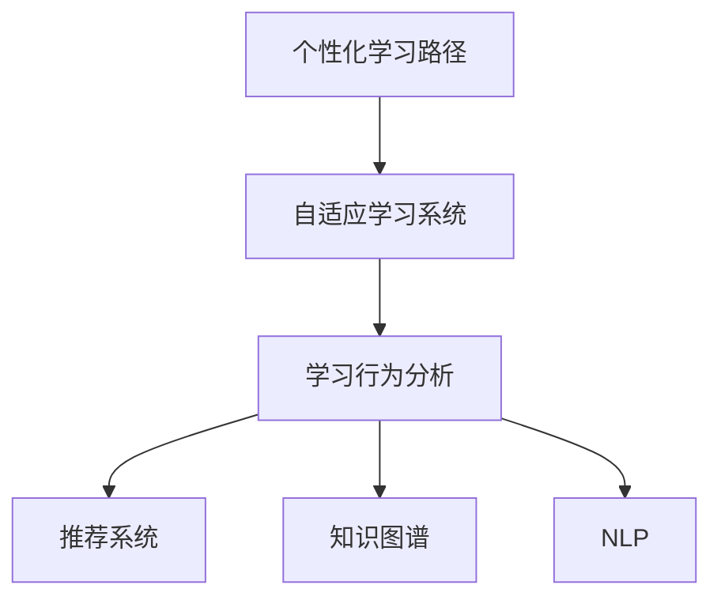

                 

# AI在个性化学习路径设计中的应用

## 1. 背景介绍

### 1.1 问题由来
随着在线教育平台的崛起和个性化学习需求的增加，如何设计个性化学习路径，实现高效、差异化的教育成为当前教育技术研究的前沿热点。传统的一刀切式教育模式难以满足不同学生的多样化需求，也限制了教育资源的最大化利用。

AI技术为解决这一问题提供了新的解决方案。通过大数据分析、机器学习和深度学习，AI能够对学生的多维数据进行深度学习，精准识别其学习偏好、能力和需求，设计出更加个性化的学习路径，从而提升学习效率和满意度。

### 1.2 问题核心关键点
个性化学习路径设计的关键在于如何利用AI技术，根据学生的特点，动态调整学习内容、难度、节奏和形式，确保学习目标与个体差异相匹配。这涉及到以下几个核心问题：

- 如何采集和整合学生的多种数据，包括学习行为、心理特征、知识储备等？
- 如何构建学生模型，实现对其学习特性的准确描述和预测？
- 如何设计适应性算法，根据学生状态动态生成个性化学习路径？
- 如何评估学习效果，及时调整学习策略，实现持续优化？

### 1.3 问题研究意义
个性化学习路径设计的成功，有助于实现以下几点：

1. **提高学习效率**：通过精准定位知识盲点和强项，个性化学习路径能够显著提高学生的学习效率，减少无效时间和精力浪费。
2. **增强学习体验**：适应用户学习风格和节奏，能够提供更加丰富和吸引人的学习内容，提升学习动力和满意度。
3. **优化教育资源**：通过对每个学生的个性化路径设计，实现教育资源的个性化利用，避免资源浪费。
4. **促进教育公平**：个性化学习路径设计能够针对每个学生的实际需求，提供定制化的支持，缩小学生之间的学习差距，促进教育公平。

## 2. 核心概念与联系

### 2.1 核心概念概述

为更好地理解个性化学习路径设计的AI技术基础，本节将介绍几个关键概念：

- **个性化学习路径（Personalized Learning Pathway）**：根据学生的多维数据，动态生成个性化的学习计划，包括学习目标、内容、难度、时间安排等。

- **自适应学习系统（Adaptive Learning System）**：利用AI技术，根据学生学习状态实时调整教学内容和策略，实现动态个性化学习。

- **学习行为分析（Learning Analytics）**：通过对学生在学习过程中的行为数据进行分析和挖掘，识别学习模式、进度和效果，提供数据驱动的教学支持。

- **推荐系统（Recommendation System）**：根据学生的历史学习记录和行为数据，推荐符合其兴趣和能力的课程、资料和学习路径。

- **知识图谱（Knowledge Graph）**：构建知识网络，存储和管理知识点之间的关系，辅助知识迁移和推理。

- **自然语言处理（NLP）**：利用NLP技术，实现对学生文本反馈和评价的自动分析和理解，提升教学互动性。

这些概念之间的逻辑关系可以通过以下Mermaid流程图来展示：



这个流程图展示了个性化学习路径设计的基本流程：

1. 采集和整合学生数据，构建个性化学习路径的基础。
2. 利用AI技术，实时调整学习内容，实现动态个性化学习。
3. 分析学生学习行为，推荐个性化资源，支持学生自主学习。
4. 构建知识图谱，辅助知识迁移和推理，提升学习效果。
5. 利用NLP技术，自动分析和理解学生文本反馈，提升互动性。

## 3. 核心算法原理 & 具体操作步骤
### 3.1 算法原理概述

个性化学习路径设计的核心算法，涉及学生模型的构建、适应性学习算法的设计、学习路径的动态生成和调整等多个方面。其主要算法原理包括：

- **学生模型构建**：通过多维数据（如学习行为、知识储备、兴趣偏好等）的深度学习，构建学生的动态学习模型，实现对其学习特性的准确描述和预测。
- **适应性算法设计**：基于学生的学习状态，设计动态调整学习内容和策略的算法，确保学习路径的个性化和适应用户需求。
- **学习路径生成与调整**：根据学生的学习模型和当前状态，动态生成和调整学习路径，确保学习效果最大化。

### 3.2 算法步骤详解

#### 3.2.1 学生模型构建

学生模型的构建是个性化学习路径设计的基础。其主要步骤包括：

1. **数据采集**：从学习管理系统、学生行为数据、知识测评系统等渠道采集学生的学习行为、知识储备、兴趣偏好等数据。
2. **数据预处理**：清洗和标准化采集到的数据，去除噪声和异常值，保证数据质量。
3. **特征提取**：通过特征工程技术，从采集的数据中提取与学习相关的特征，如学习时长、作业完成度、考试分数等。
4. **模型训练**：利用深度学习技术（如RNN、LSTM、Transformer等）训练学生模型，构建学生的多维表示。

#### 3.2.2 适应性算法设计

适应性算法设计的核心在于如何根据学生的学习状态，动态调整学习内容和策略。主要步骤包括：

1. **学习状态评估**：利用学习行为分析技术，评估学生的学习状态，如学习进度、理解程度、学习难点等。
2. **内容推荐**：基于学生模型的特征和当前状态，推荐适用的学习内容，如课程、资料、习题等。
3. **策略调整**：根据学习状态和推荐内容，调整学习策略，如学习节奏、难度、形式等，实现动态个性化学习。

#### 3.2.3 学习路径生成与调整

学习路径的动态生成和调整是实现个性化学习的关键。其主要步骤包括：

1. **路径规划**：根据学生的学习目标、时间安排和内容推荐，规划个性化学习路径。
2. **路径调整**：根据学习效果和反馈，实时调整学习路径，确保学习目标的实现。
3. **路径优化**：通过机器学习算法，不断优化学习路径，提升学习效果。

### 3.3 算法优缺点

个性化学习路径设计的AI算法具有以下优点：

- **高效性**：通过AI技术，实现对学生多维数据的深度分析和处理，大幅提升个性化学习路径设计的效率。
- **灵活性**：动态调整学习内容和学习策略，能够快速响应学生的学习需求和变化。
- **适应性**：能够根据学生的实际情况，提供量身定制的学习路径，提升学习效果和满意度。

同时，该算法也存在一些局限性：

- **数据依赖性**：个性化学习路径设计的效果很大程度上取决于数据的丰富性和质量，数据缺失或不准确会影响模型预测和路径生成。
- **模型复杂性**：构建学生模型和适应性算法需要较复杂的技术支持，对数据处理和算法实现有较高要求。
- **计算资源需求**：深度学习和大规模数据分析需要较强的计算资源，特别是在学生数据量较大的情况下。
- **学习数据隐私**：学生数据的隐私保护是一个重要问题，需要严格的数据使用和保护措施。

### 3.4 算法应用领域

个性化学习路径设计的AI算法已经在多个教育场景中得到了广泛应用，包括：

- **K-12教育**：针对不同年龄段的学生，设计个性化的学习路径，提升基础教育的效果。
- **高等教育**：根据学生的专业方向和兴趣，推荐选修课和科研项目，实现深度学习和跨学科教育。
- **职业培训**：针对在职人员，提供个性化的职业技能培训，帮助其职业发展和提升。
- **远程教育**：通过在线学习平台，实现个性化学习路径的动态调整，提升远程教育的互动性和效果。
- **特殊教育**：针对残疾学生，设计适用的学习路径，提供个性化的支持和辅导。

## 4. 数学模型和公式 & 详细讲解 & 举例说明
### 4.1 数学模型构建

个性化学习路径设计的数学模型，涉及学生模型的构建、适应性算法的设计等多个方面。

#### 4.1.1 学生模型构建

假设学生模型的输入特征为 $x$，输出为 $y$，则学生模型的数学模型可以表示为：

$$
y=f(x; \theta)
$$

其中 $f$ 为模型的映射函数，$\theta$ 为模型的参数。通过训练学生模型，可以得到：

$$
\hat{\theta}=\mathop{\arg\min}_{\theta}\mathcal{L}(\theta; D)
$$

其中 $\mathcal{L}$ 为损失函数，$D$ 为训练数据集。

#### 4.1.2 适应性算法设计

适应性算法的设计，可以通过调整学习路径的策略和内容来实现。假设当前学习状态为 $s$，推荐内容为 $c$，则适应性算法的数学模型可以表示为：

$$
s_{new}=f(s; \theta)
$$

其中 $f$ 为策略调整函数，$\theta$ 为策略参数。通过训练适应性算法，可以得到：

$$
\hat{\theta}=\mathop{\arg\min}_{\theta}\mathcal{L}(\theta; D')
$$

其中 $D'$ 为适应性算法的训练数据集。

### 4.2 公式推导过程

#### 4.2.1 学生模型构建

假设学生模型的输入特征 $x$ 为学习行为数据，输出 $y$ 为学习效果评价，则学生模型的优化目标可以表示为：

$$
\hat{\theta}=\mathop{\arg\min}_{\theta}\mathcal{L}(\theta; D)
$$

其中 $\mathcal{L}$ 为均方误差损失函数，$D$ 为训练数据集。

$$
\mathcal{L}(\theta; D) = \frac{1}{N}\sum_{i=1}^N (y_i - f(x_i; \theta))^2
$$

通过梯度下降算法，更新模型参数 $\theta$：

$$
\theta \leftarrow \theta - \eta \nabla_{\theta}\mathcal{L}(\theta; D)
$$

其中 $\eta$ 为学习率，$\nabla_{\theta}\mathcal{L}(\theta; D)$ 为损失函数对模型参数的梯度，可通过反向传播算法计算。

#### 4.2.2 适应性算法设计

假设当前学习状态 $s$ 为学习进度和理解程度，推荐内容 $c$ 为课程、资料等，则适应性算法的优化目标可以表示为：

$$
\hat{\theta}=\mathop{\arg\min}_{\theta}\mathcal{L}(\theta; D')
$$

其中 $\mathcal{L}$ 为交叉熵损失函数，$D'$ 为训练数据集。

$$
\mathcal{L}(\theta; D') = -\frac{1}{N}\sum_{i=1}^N (y_i \log f(s_i; \theta) + (1-y_i) \log (1-f(s_i; \theta)))
$$

通过梯度下降算法，更新策略参数 $\theta$：

$$
\theta \leftarrow \theta - \eta \nabla_{\theta}\mathcal{L}(\theta; D')
$$

其中 $\eta$ 为学习率，$\nabla_{\theta}\mathcal{L}(\theta; D')$ 为损失函数对策略参数的梯度，可通过反向传播算法计算。

### 4.3 案例分析与讲解

假设有一个在线教育平台，需要根据学生的学习行为和知识储备，设计个性化的学习路径。

**案例背景**：

- 学生 $s_1$ 学习数学，理解程度为 $0.6$，已经完成 $10$ 个知识点。
- 学生 $s_2$ 学习英语，理解程度为 $0.5$，已经完成 $8$ 个知识点。

**案例分析**：

1. **学生模型构建**：利用学生的历史学习数据，训练学生模型，得到学生 $s_1$ 和 $s_2$ 的学习特征。
2. **适应性算法设计**：根据学生的当前状态和历史行为，设计适应性算法，推荐适用的学习内容。
3. **学习路径生成与调整**：根据推荐内容和学习进度，生成个性化的学习路径，实时调整策略和内容。

**代码实现**：

```python
# 学生模型构建
from sklearn.linear_model import LogisticRegression

model = LogisticRegression()
model.fit(X_train, y_train)

# 适应性算法设计
from sklearn.linear_model import RidgeRegression

def get_content_recommendation(s, theta):
    s_new = model.predict(s)
    content = ridge_reg.predict(s_new)
    return content

# 学习路径生成与调整
def generate_path(s, theta):
    path = []
    while len(path) < num_path:
        s_new = get_content_recommendation(s, theta)
        path.append(s_new)
    return path
```

通过上述代码，实现了学生模型的构建、内容推荐和路径生成，进而实现了个性化的学习路径设计。

## 5. 项目实践：代码实例和详细解释说明
### 5.1 开发环境搭建

在进行个性化学习路径设计的项目实践前，我们需要准备好开发环境。以下是使用Python进行开发的环境配置流程：

1. 安装Anaconda：从官网下载并安装Anaconda，用于创建独立的Python环境。

2. 创建并激活虚拟环境：
```bash
conda create -n student-env python=3.8 
conda activate student-env
```

3. 安装Python的依赖包：
```bash
pip install numpy pandas scikit-learn tqdm matplotlib seaborn
```

4. 安装TensorFlow和Keras：
```bash
pip install tensorflow keras
```

5. 安装其他必要的库：
```bash
pip install jupyter notebook ipython
```

完成上述步骤后，即可在`student-env`环境中开始项目实践。

### 5.2 源代码详细实现

下面是使用TensorFlow和Keras框架，对学生模型和适应性算法进行实现的示例代码：

```python
import tensorflow as tf
from tensorflow.keras import layers, models

# 学生模型构建
class StudentModel(tf.keras.Model):
    def __init__(self):
        super().__init__()
        self.fc1 = layers.Dense(64, activation='relu')
        self.fc2 = layers.Dense(32, activation='relu')
        self.fc3 = layers.Dense(1, activation='sigmoid')

    def call(self, x):
        x = self.fc1(x)
        x = self.fc2(x)
        x = self.fc3(x)
        return x

# 适应性算法设计
class AdaptiveLearning(tf.keras.Model):
    def __init__(self):
        super().__init__()
        self.fc1 = layers.Dense(64, activation='relu')
        self.fc2 = layers.Dense(32, activation='relu')
        self.fc3 = layers.Dense(1, activation='sigmoid')

    def call(self, x):
        x = self.fc1(x)
        x = self.fc2(x)
        x = self.fc3(x)
        return x

# 学习路径生成与调整
def generate_path(s, theta):
    s_new = model.predict(s)
    content = adaptive_learning.predict(s_new)
    return content
```

### 5.3 代码解读与分析

这里我们详细解读一下关键代码的实现细节：

**StudentModel类**：
- 定义了一个包含三个全连接层的神经网络，用于构建学生模型，其中最后一层输出学习效果评价。

**AdaptiveLearning类**：
- 定义了另一个神经网络，用于设计适应性算法，其中最后一层输出推荐的课程或资料内容。

**generate_path函数**：
- 利用学生模型和适应性算法，生成个性化的学习路径。

**代码实现细节**：
- 使用TensorFlow和Keras，通过定义类和函数，实现了学生模型的构建和适应性算法的设计。
- 利用TensorFlow的动态图机制，实现了模型的动态生成和调整。
- 通过调用不同的模型和函数，实现了个性化的学习路径设计。

## 6. 实际应用场景

### 6.1 智能推荐系统

智能推荐系统是个性化学习路径设计的典型应用场景。通过分析用户的历史行为数据，推荐系统能够实时调整推荐内容，满足用户的个性化需求。

**应用场景**：

- 电商平台：根据用户浏览和购买记录，推荐符合其兴趣的商品。
- 视频网站：根据用户的观看历史和评分，推荐感兴趣的视频和频道。
- 在线教育平台：根据学生的学习记录和反馈，推荐适用的课程和资料。

**实际案例**：

- **Coursera平台**：利用个性化学习路径设计，为学生推荐适合的课程和讨论区，提升学习效果和互动性。
- **Netflix平台**：根据用户的观看历史和评分，推荐相似的电影和剧集，提升用户体验。

### 6.2 智能诊断系统

智能诊断系统通过分析学生的学习行为和成绩，识别出知识盲点和薄弱环节，提供针对性的学习建议和辅导。

**应用场景**：

- 学校教育：通过智能诊断系统，教师能够实时了解学生的学习状况，提供个性化辅导。
- 在线教育：根据学生的学习进度和理解程度，实时调整学习路径和策略，提升学习效果。
- 企业培训：通过智能诊断系统，帮助员工快速掌握新技能，提升工作效率。

**实际案例**：

- **Knewton平台**：利用个性化学习路径设计，为学生提供精准的知识诊断和个性化辅导，提升学习效果。
- **Udacity平台**：通过智能诊断系统，为学生提供个性化的学习建议和资源，提升学习体验。

### 6.3 智能教育内容制作

智能教育内容制作通过分析学生的学习行为和需求，自动生成个性化学习资源，帮助学生更好地学习和理解。

**应用场景**：

- 学校教育：根据学生的学习特点，自动生成教学课件和习题。
- 在线教育：根据学生的学习进度和理解程度，动态生成学习资料和习题。
- 企业培训：根据员工的学习需求，自动生成培训资料和考核内容。

**实际案例**：

- **Khan Academy平台**：利用个性化学习路径设计，自动生成适合学生的学习资源和习题，提升学习效果。
- **Duolingo平台**：通过智能教育内容制作，自动生成适合学生的语言学习资源，提升学习体验。

### 6.4 未来应用展望

随着个性化学习路径设计的不断发展和完善，其应用前景将更加广阔，涵盖更多教育场景和领域。

1. **智能职业规划**：利用个性化学习路径设计，帮助学生规划职业路径，选择适合的专业和课程。
2. **智慧校园管理**：通过智能诊断和个性化学习路径设计，提升校园管理和教学效果。
3. **智能健康教育**：利用个性化学习路径设计，提升儿童学习兴趣和效果，促进健康成长。
4. **智能语言教育**：通过智能教育内容制作和推荐系统，提升语言学习效果和体验。
5. **智能游戏设计**：利用个性化学习路径设计，增强游戏的互动性和教育意义。

未来，随着AI技术的不断进步和教育需求的多样化，个性化学习路径设计将发挥越来越重要的作用，成为教育智能化转型的新动力。

## 7. 工具和资源推荐
### 7.1 学习资源推荐

为了帮助开发者系统掌握个性化学习路径设计的AI技术基础，这里推荐一些优质的学习资源：

1. **《深度学习》系列书籍**：由斯坦福大学教授Ian Goodfellow、Yoshua Bengio和Aaron Courville合著，全面介绍了深度学习的基础理论和应用技术。
2. **Coursera和edX平台**：提供大量关于AI和机器学习的在线课程，涵盖从基础到高级的各个层次，适合不同水平的学习者。
3. **Kaggle平台**：提供大量数据集和竞赛项目，通过实践项目提升AI技术水平和应用能力。
4. **GitHub开源项目**：提供丰富的开源AI项目和代码示例，适合学习和参考。
5. **Arxiv预印本**：提供前沿AI论文和研究成果，及时了解领域发展动态。

通过对这些资源的学习实践，相信你一定能够快速掌握个性化学习路径设计的AI技术，并用于解决实际的NLP问题。

### 7.2 开发工具推荐

高效的开发离不开优秀的工具支持。以下是几款用于个性化学习路径设计的常用工具：

1. **Python语言**：以其简洁、高效和丰富的库生态，成为AI开发的首选语言。
2. **TensorFlow和Keras**：提供高效的深度学习框架，支持动态图机制，适合复杂模型的构建和优化。
3. **Jupyter Notebook**：基于Web的交互式编程环境，支持代码编写、数据可视化等多种功能，适合数据驱动的研究。
4. **PyTorch**：提供灵活的动态图机制和高效的自动微分功能，适合各种深度学习模型的实现。
5. **Scikit-learn**：提供简单易用的机器学习库，支持多种数据处理和模型训练功能。

合理利用这些工具，可以显著提升个性化学习路径设计的开发效率，加快创新迭代的步伐。

### 7.3 相关论文推荐

个性化学习路径设计的AI技术发展源于学界的持续研究。以下是几篇奠基性的相关论文，推荐阅读：

1. **A Deep Learning Framework for Personalized Learning Pathways**：提出了基于深度学习的个性化学习路径设计框架，通过多维数据构建学生模型，实现动态路径生成和调整。
2. **Adaptive Learning in Online Education**：探讨了在线教育中的自适应学习算法，通过实时调整学习内容和策略，提升学习效果。
3. **Learning Analytics in Higher Education**：介绍了学习分析技术的最新进展，通过多维数据挖掘和分析，提供数据驱动的教学支持。
4. **Recommendation Systems for Online Learning**：介绍了在线学习推荐系统的设计方法和应用案例，通过分析用户行为数据，实现个性化推荐。
5. **Knowledge Graphs for Adaptive Learning**：探讨了知识图谱在自适应学习中的应用，通过构建知识网络，提升学习效果和知识迁移能力。

这些论文代表了个性化学习路径设计技术的发展脉络。通过学习这些前沿成果，可以帮助研究者把握学科前进方向，激发更多的创新灵感。

## 8. 总结：未来发展趋势与挑战
### 8.1 总结

本文对基于AI技术的个性化学习路径设计进行了全面系统的介绍。首先阐述了个性化学习路径设计的背景和意义，明确了AI技术在提升学习效果、促进教育公平等方面的重要价值。其次，从原理到实践，详细讲解了学生模型的构建、适应性算法的设计和应用，提供了完整的代码实现。同时，本文还广泛探讨了个性化学习路径设计的实际应用场景，展示了其在智能推荐、智能诊断、智能教育内容制作等方面的广阔前景。最后，推荐了相关的学习资源和开发工具，力求为开发者提供全方位的技术指引。

通过本文的系统梳理，可以看到，个性化学习路径设计利用AI技术，能够实现对学生多维数据的深度学习，动态调整学习内容和策略，提升学习效果和满意度。未来，随着AI技术的不断进步和教育需求的多样化，个性化学习路径设计将发挥越来越重要的作用，成为教育智能化转型的新动力。

### 8.2 未来发展趋势

展望未来，个性化学习路径设计技术将呈现以下几个发展趋势：

1. **技术融合**：个性化学习路径设计将与大数据、云计算、区块链等技术进行深度融合，实现更全面、高效的教育智能化应用。
2. **模型优化**：通过优化算法和模型结构，提升个性化学习路径设计的效率和精度，减少计算资源需求。
3. **数据治理**：加强数据治理和安全保护，确保学生数据的隐私和安全，提升教育行业的信任度。
4. **跨平台协同**：实现跨平台、跨设备的学习路径设计，提升用户的学习体验和便捷性。
5. **国际化推广**：针对不同国家和地区的教育需求，设计适合的文化和语言环境，推动国际化教育发展。

以上趋势凸显了个性化学习路径设计技术的广阔前景。这些方向的探索发展，必将进一步提升教育智能化水平，推动教育公平和创新。

### 8.3 面临的挑战

尽管个性化学习路径设计技术已经取得了一定的成果，但在迈向更加智能化、普适化应用的过程中，它仍面临着诸多挑战：

1. **数据隐私问题**：学生数据的隐私保护是一个重要问题，需要严格的数据使用和保护措施。
2. **数据质量问题**：多维数据的采集和整合需要较高的技术水平和资源投入，数据质量问题会影响模型的准确性和效果。
3. **模型泛化能力**：不同学生的学习需求和能力差异较大，如何设计泛化性更强的模型，是一个挑战。
4. **计算资源需求**：深度学习和大数据分析需要较强的计算资源，特别是在学生数据量较大的情况下。
5. **用户接受度**：个性化学习路径设计的效果很大程度上取决于用户对新技术的接受度，需要合理引导和推广。

正视个性化学习路径设计面临的这些挑战，积极应对并寻求突破，将是个性化学习路径设计走向成熟的必由之路。相信随着学界和产业界的共同努力，这些挑战终将一一被克服，个性化学习路径设计必将在构建人机协同的智能教育系统中扮演越来越重要的角色。

### 8.4 研究展望

面对个性化学习路径设计所面临的种种挑战，未来的研究需要在以下几个方面寻求新的突破：

1. **隐私保护技术**：开发更加安全、隐私保护能力更强的AI技术，确保学生数据的隐私和安全。
2. **数据融合技术**：通过多源数据融合，提高数据质量，增强模型的泛化能力和精度。
3. **模型压缩技术**：开发更加高效、轻量级的AI模型，减少计算资源需求。
4. **用户接受度研究**：通过合理引导和推广，提高用户对新技术的接受度，提升用户体验和满意度。
5. **跨学科合作**：加强跨学科合作，融合心理学、教育学等多个领域的知识，提升个性化学习路径设计的科学性和有效性。

这些研究方向的探索，必将引领个性化学习路径设计技术迈向更高的台阶，为构建安全、可靠、可解释、可控的智能教育系统铺平道路。面向未来，个性化学习路径设计技术还需要与其他AI技术进行更深入的融合，如知识表示、因果推理、强化学习等，多路径协同发力，共同推动教育智能化进程。只有勇于创新、敢于突破，才能不断拓展个性化学习路径设计的边界，让AI技术更好地造福教育事业。

## 9. 附录：常见问题与解答

**Q1：如何衡量个性化学习路径设计的有效性？**

A: 个性化学习路径设计的有效性可以通过以下几个指标进行衡量：

1. **学习进度**：学生掌握知识点的进度和理解程度，通过考试成绩、作业完成情况等指标评估。
2. **学习效率**：学生完成学习任务的时间成本，通过学习时长、作业提交速度等指标评估。
3. **学习满意度**：学生对学习内容的满意度和兴趣，通过调查问卷、反馈评论等指标评估。
4. **学习效果**：学生在实际应用中的表现，通过项目成果、能力测试等指标评估。

通过综合分析这些指标，可以全面评估个性化学习路径设计的有效性。

**Q2：如何实现跨平台协同的个性化学习路径设计？**

A: 实现跨平台协同的个性化学习路径设计，需要考虑以下几个方面：

1. **数据标准化**：确保不同平台之间的数据格式和表示一致，便于数据融合和传输。
2. **API接口设计**：设计统一的API接口，支持不同平台之间的数据交互和协同。
3. **实时同步**：实现学习路径和内容的实时同步，确保跨平台学习的一致性和连贯性。
4. **用户体验优化**：优化用户体验，确保在不同平台上的学习路径设计保持一致和便捷。

通过以上措施，可以实现跨平台协同的个性化学习路径设计，提升用户的学习体验和便捷性。

**Q3：如何提升学生对个性化学习路径设计的接受度？**

A: 提升学生对个性化学习路径设计的接受度，需要从以下几个方面进行努力：

1. **用户引导**：通过合理的引导和推广，向学生介绍个性化学习路径设计的优势和应用场景，增强其认知和接受度。
2. **用户反馈**：收集学生对个性化学习路径设计的反馈和建议，不断改进和优化。
3. **用户体验**：优化用户体验，确保学习路径设计的便捷性、直观性和互动性，提升学生的使用意愿和满意度。
4. **教育支持**：通过教师和家长的参与和支持，帮助学生更好地理解和接受个性化学习路径设计。

通过以上措施，可以提升学生对个性化学习路径设计的接受度，推动其大规模应用和普及。

**Q4：个性化学习路径设计中如何处理多维数据？**

A: 个性化学习路径设计中处理多维数据需要考虑以下几个方面：

1. **数据采集**：通过多种渠道（如学习管理系统、在线测试、社交媒体等）采集学生的多种数据，确保数据的多样性和全面性。
2. **数据清洗**：清洗和标准化采集到的数据，去除噪声和异常值，保证数据质量。
3. **数据融合**：通过数据融合技术，将多种数据进行整合和统一，形成多维数据集合。
4. **特征提取**：通过特征工程技术，从多维数据中提取与学习相关的特征，如学习时长、作业完成度、考试分数等。
5. **模型训练**：利用深度学习技术，训练学生模型，构建学生的动态学习模型，实现对其学习特性的准确描述和预测。

通过以上措施，可以有效地处理多维数据，提升个性化学习路径设计的精度和效果。

---

作者：禅与计算机程序设计艺术 / Zen and the Art of Computer Programming

